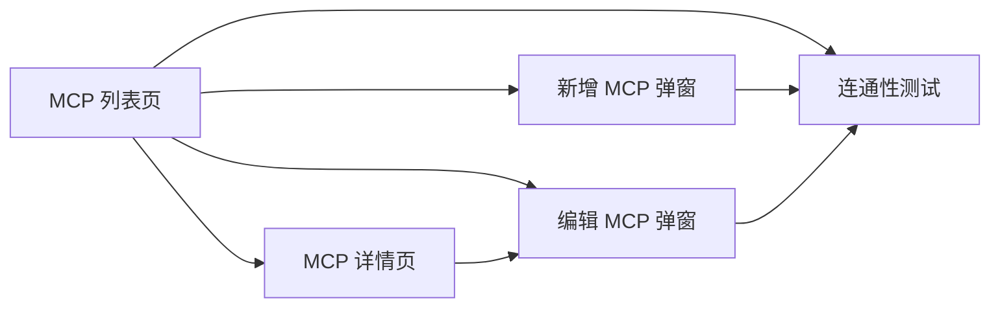
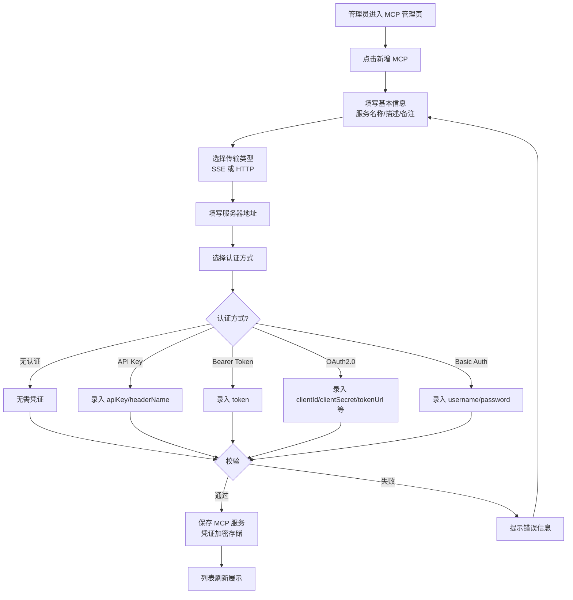
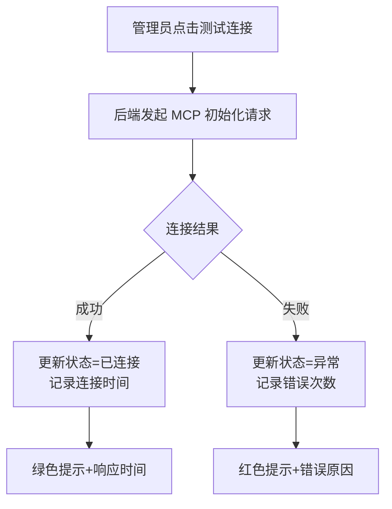
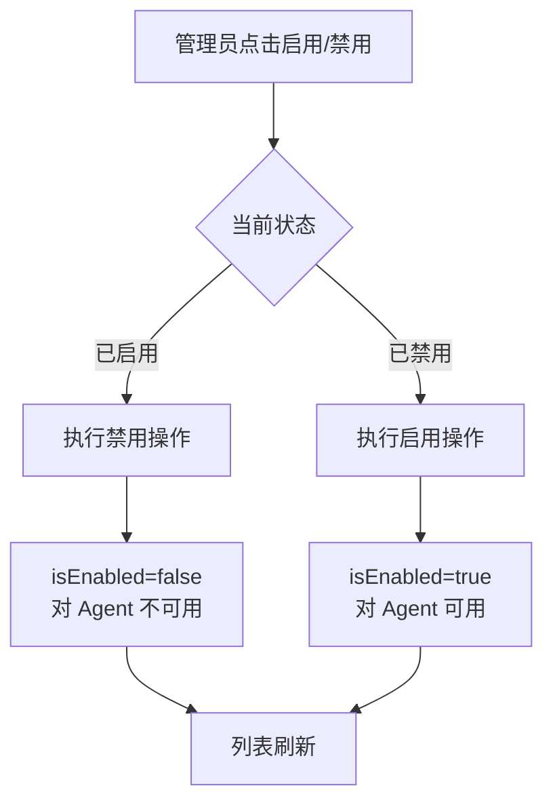
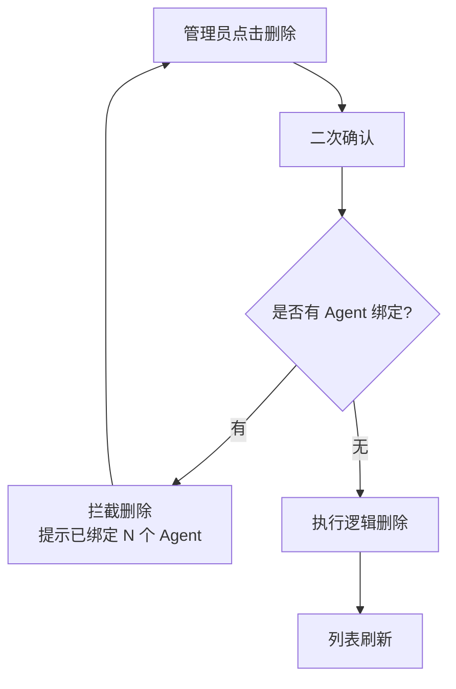
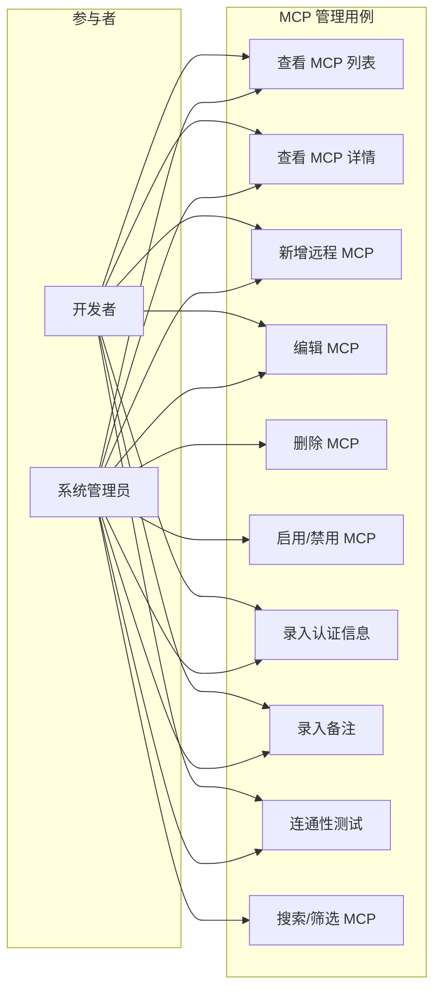

# MCP 管理 PRD

## 1. 产品/需求背景

- **为什么要做**：随着外部 MCP 生态的发展，越来越多的 MCP 服务以远程 HTTP/SSE 方式部署。平台需要支持远程 MCP 的注册接入，并补充管理备注信息。
- **解决什么问题**：现有 MCP 管理模块（PRD V5.0 §4.1.6）未聚焦远程 MCP 场景，认证信息录入不够细化，且缺少管理员内部备注字段。
- **面向用户**：系统管理员、开发者（管理端）。

## 2. 目标与范围

- **目标**：
  1. 支持远程 MCP 服务录入（仅 HTTP/SSE 协议），支持多种认证方式
  2. 为 MCP 服务增加内部备注字段，方便管理员记录维护信息
  3. 远程 MCP 连通性测试，验证服务可达性和认证有效性
- **范围**：本次包含的功能：远程 MCP 录入、认证信息动态表单、备注字段、连通性测试。
- **不做什么**：
  - 不支持本地 stdio 方式 MCP（command/args/envVariables 本期不录入）
  - 不做 MCP 服务自动发现/扫描
  - 不做 MCP 故障自动转移

## 3. 系统线框图（必选，优先产出）

### 3.1 管理端 MCP 模块结构



**说明**：
| 页面/模块 | 职责 | 对应功能需求 |
|-----------|------|-------------|
| MCP 列表页 | 展示所有已录入的远程 MCP 服务，支持筛选/搜索/分页 | F1 MCP 列表查询 |
| MCP 详情页 | 查看单个 MCP 服务的完整配置信息（含备注，不展示凭证明文） | F2 MCP 详情查看 |
| 新增 MCP 弹窗 | 录入远程 MCP 服务，包含服务器地址、认证信息动态表单、备注 | F3 新增远程 MCP |
| 编辑 MCP 弹窗 | 修改已有 MCP 服务配置，凭证留空表示不修改 | F4 编辑 MCP |
| 连通性测试 | 发起 MCP 初始化握手，验证 URL 可达性和认证有效性 | F5 连通性测试 |

### 3.2 系统导航结构

```
管理端主导航
├── 首页
├── Agent 管理
├── 用户管理
├── 权限管理
├── Skill 管理
├── MCP 管理  ← 本次变更
│   └── 列表页（新增/编辑/删除/启用/禁用/测试/详情）
├── 模型管理
└── 系统配置
```

## 4. 业务流程图（必选）

### 4.1 远程 MCP 录入流程



**流程说明**：
- **主路径**：填写信息 → 校验 → 保存 → 列表刷新
- **关键分支**：认证方式不同，凭证录入字段动态变化
- **异常处理**：校验失败时保留已填写内容，提示具体错误

### 4.2 连通性测试流程



### 4.3 MCP 启用/禁用流程



### 4.4 MCP 删除流程



## 5. 用例图（必选）



**说明**：

| 参与者 | 角色说明 | 可执行用例 |
|--------|---------|-----------|
| 系统管理员 | 管理端最高权限，可执行全部操作 | UC1 ~ UC10 |
| 开发者 | 管理端普通角色，可查看、新增、编辑，但不可删除和禁用 | UC1~UC4、UC7~UC10 |

## 6. 用户与场景

- **作为系统管理员**，我希望录入部署在远程服务器上的 MCP 服务并配置认证信息，以便 Agent 可以通过平台调用这些远程 MCP 服务。
- **作为系统管理员**，我希望为每个 MCP 服务添加内部备注，以便记录接入原因、维护联系人、特殊注意事项等。
- **作为开发者**，我希望在录入 MCP 后能立即测试连通性，以便确认服务可达性和认证配置正确性。
- **作为开发者**，我希望认证凭证在前端以掩码形式展示，以便在编辑时避免泄露。

## 7. 功能需求

### 7.1 功能点清单

| 序号 | 功能点 | 说明 | 优先级 |
|------|--------|------|--------|
| F1 | MCP 列表查询 | 分页展示已录入的远程 MCP 服务，支持按名称搜索、按状态筛选 | P0 |
| F2 | MCP 详情查看 | 查看 MCP 完整配置信息，不展示凭证明文，展示备注 | P0 |
| F3 | 新增远程 MCP | 录入远程 MCP 服务，包含基本信息、认证信息动态表单、备注 | P0 |
| F4 | 编辑 MCP | 修改已有 MCP 配置，凭证留空表示不修改 | P0 |
| F5 | 删除 MCP | 逻辑删除，有 Agent 绑定时拦截 | P0 |
| F6 | 启用/禁用 MCP | 切换 MCP 可用状态 | P0 |
| F7 | 认证信息动态表单 | 根据 authType 动态渲染对应凭证字段（无认证/API Key/Bearer Token/OAuth2.0/Basic Auth） | P0 |
| F8 | 备注字段 | 内部备注，最大 500 字符，仅管理端可见 | P0 |
| F9 | 连通性测试 | 发起 MCP 初始化握手，验证 URL 可达性和认证有效性 | P1 |
| F10 | 搜索/筛选 | 按名称模糊搜索，按连接状态筛选 | P1 |

### 7.2 认证方式凭证字段明细

| 认证方式 | 凭证子字段 | 必填 | 说明 |
|----------|-----------|------|------|
| **无认证** | 无 | 否 | 无需录入任何凭证 |
| **API Key** | apiKey（String） | 是 | API Key 值 |
| | headerName（String） | 否 | HTTP Header 名称，默认 `X-API-Key` |
| | headerPrefix（String） | 否 | Header 值前缀 |
| **Bearer Token** | token（String） | 是 | Bearer Token 值 |
| **OAuth2.0** | clientId（String） | 是 | OAuth2.0 客户端 ID |
| | clientSecret（String） | 是 | 客户端密钥，加密存储 |
| | tokenUrl（String） | 是 | Token 获取地址 |
| | scope（String） | 否 | 权限范围，空格分隔 |
| | grantType（Enum） | 否 | 授权类型，默认 `client_credentials` |
| **Basic Auth** | username（String） | 是 | 用户名 |
| | password（String） | 是 | 密码，加密存储 |

### 7.3 description 与 remarks 的区别

| 维度 | description（描述） | remarks（备注） |
|------|---------------------|-----------------|
| 面向 | Agent 用户、API 消费者 | 内部管理员 |
| 内容 | 服务功能说明、能力描述 | 接入原因、维护人、注意事项 |
| 可见性 | 管理端 + 用户端可见 | 仅管理端可见 |
| 是否必填 | 否 | 否 |
| 最大长度 | 500 字符 | 500 字符 |

## 8. 原型图/界面说明（必选）

### 8.1 MCP 列表页

```
┌─────────────────────────────────────────────────────────────────────────────┐
│  MCP 管理                                                        [+ 新增MCP] │
├─────────────────────────────────────────────────────────────────────────────┤
│  🔍 [搜索服务名称...]    状态: [全部 ▼]  [搜索]  [重置]                      │
├──────┬─────────┬──────────┬──────┬──────┬──────┬──────┬──────────┬──────────┤
│ 服务名称 │ 描述      │ 备注       │ 状态   │ 启用  │ 版本  │ 绑定Agent│ 创建时间  │ 操作     │
├──────┼─────────┼──────────┼──────┼──────┼──────┼──────┼──────────┼──────────┤
│ 远程数据库 │ 提供MySQL │ 张三维护   │ 🟢已连接│ [是] │ v1.0 │  2     │ 2026-05-01│ 详情 编辑│
│ MCP    │ 查询能力   │           │        │      │      │        │          │ 测试 禁用│
├──────┼─────────┼──────────┼──────┼──────┼──────┼──────┼──────────┼──────────┤
│ 远程搜索  │ 提供全文   │ 外部团队   │ ⚪未连接│ [否] │ v1.0 │  0     │ 2026-05-01│ 详情 编辑│
│ MCP    │ 搜索能力   │ 联系李四   │        │      │      │        │          │ 测试 启用│
└──────┴─────────┴──────────┴──────┴──────┴──────┴──────┴──────────┴──────────┘
                                    共 2 条  < 1 > 每页10条
```

**关键元素**：
- 工具栏：搜索框 + 状态筛选 + 新增按钮
- 列表列：服务名称、描述、**备注**（新增列）、状态、启用、版本、绑定 Agent 数、创建时间、操作
- 操作列：详情、编辑、测试、启用/禁用、删除

### 8.2 新增/编辑 MCP 弹窗

```
┌──────────────────────────────────────────────────────────────┐
│  新增 MCP                                           [×]      │
├──────────────────────────────────────────────────────────────┤
│  服务名称 *  [________________________]                      │
│  描述       [________________________]                      │
│             [________________________]                       │
│  备注       [________________________]                      │
│             [________________________]                       │
│  服务器地址* [https://mcp.example.com/sse]                   │
│  协议版本 *  [v1.0 ▼]                                        │
│  传输类型 *  [sse ▼]                                         │
│  认证方式 *  [API Key ▼]                                     │
│                                                              │
│  ┌─ 认证信息 ──────────────────────────────────────┐        │
│  │  API Key *      [sk-xxxxxx..............] [👁]  │        │
│  │  Header 名称    [X-API-Key.............]         │        │
│  │  Header 前缀    [                       ]         │        │
│  └─────────────────────────────────────────────────┘        │
│                                                              │
│  超时时间(秒) [30]   最大重试次数 [3]  健康检查间隔 [60]    │
│                                                              │
│                          [取消]     [确定]                   │
└──────────────────────────────────────────────────────────────┘
```

**交互说明**：
- **认证信息区域**：选择不同 authType 后动态渲染对应凭证字段
- **凭证输入框**：默认 password 类型（掩码），点击 👁 切换明文
- **编辑模式**：凭证字段留空表示不修改
- **备注字段**：多行文本，最大 500 字符，右下角显示字符计数

### 8.3 传输类型选择后的表单变化

**选择 SSE 或 HTTP 时**（远程 MCP）：
```
传输类型: [sse ▼]  →  展示 serverUrl、认证信息
                       不展示 command/args/envVariables
```

### 8.4 连通性测试结果

**成功态**：
```
┌──────────────────────────────────────┐
│  ✅ 连通性测试通过                    │
│     响应时间: 520ms                   │
└──────────────────────────────────────┘
```

**失败态**：
```
┌──────────────────────────────────────┐
│  ❌ 测试失败                          │
│     原因: 连接超时（超过 30 秒）       │
└──────────────────────────────────────┘
```

**常见错误原因**：
- 连接超时：服务不可达或网络问题
- 认证失败：凭证错误或无效
- 服务不可达：URL 错误或 DNS 解析失败
- 协议不兼容：MCP 协议版本不匹配

### 8.5 MCP 详情页

```
┌──────────────────────────────────────────────────────────────┐
│  MCP 详情                                            [×]      │
├──────────────────────────────────────────────────────────────┤
│  基本信息                                                    │
│  ┌─────────────────────────────────────────────────────────┐│
│  │ 服务名称:    远程数据库 MCP                              ││
│  │ 描述:        提供 MySQL 数据查询能力                     ││
│  │ 备注:        由外部团队维护，联系张三 zhangsan@ex.com    ││
│  │ 服务器地址:  https://mcp.example.com/sse                ││
│  │ 协议版本:    v1.0                                       ││
│  │ 传输类型:    sse                                        ││
│  │ 认证方式:    API Key（已配置）                           ││
│  │ 超时时间:    30 秒                                      ││
│  │ 最大重试:    3 次                                       ││
│  │ 状态:        🟢 已连接                                   ││
│  │ 绑定 Agent:  2 个                                       ││
│  │ 创建人:      admin                                      ││
│  │ 创建时间:    2026-05-01 10:00:00                        ││
│  └─────────────────────────────────────────────────────────┘│
│                                                              │
│                          [编辑]    [测试连接]                │
└──────────────────────────────────────────────────────────────┘
```

**关键说明**：
- **credentials 字段不展示明文**，仅展示认证方式和「已配置」标识
- **备注字段**在详情页中展示，与描述分开
- **操作按钮**：编辑（跳转编辑弹窗）、测试连接（发起连通性测试）

### 8.6 删除拦截提示

```
┌──────────────────────────────────────┐
│  ⚠️ 无法删除                          │
│     该 MCP 已被 2 个 Agent 绑定，     │
│     请先解绑后再删除。                 │
│                                      │
│              [确定]                   │
└──────────────────────────────────────┘
```

## 9. 非功能需求

- **安全**：
  - credentials 字段必须 AES-256 加密后存储
  - 前端传输使用 HTTPS
  - 查询/详情接口不返回凭证明文
  - 凭证输入框默认 password 类型（掩码显示）
- **性能**：MCP 列表查询响应时间 < 1 秒
- **可用性**：连通性测试超时时间可配置，默认 30 秒
- **兼容性**：支持 Chrome 90+、Firefox 88+、Safari 14+

## 10. 与现有功能的关系

- **扩展现有 MCP 管理模块**（PRD V5.0 §4.1.6）
- **兼容要点**：
  - 传输类型移除 stdio 选项，仅保留 sse 和 http
  - command/args/envVariables 字段保留数据库兼容性（未来如需支持本地 MCP 可恢复），但前端不展示
  - 新增 remarks 字段，不影响现有列表查询
  - credentials JSON 结构扩展为支持多种认证方式的子字段

## 11. 验收标准

- [ ] 能够成功录入一个远程 SSE 协议的 MCP 服务
- [ ] 能够成功录入一个远程 HTTP 协议的 MCP 服务
- [ ] 传输类型选项仅包含 sse 和 http，不包含 stdio
- [ ] 选择「无认证」时无需填写凭证，MCP 可正常保存
- [ ] 选择「API Key」时可录入 apiKey 和 headerName，凭证加密存储
- [ ] 选择「Bearer Token」时可录入 token，凭证加密存储
- [ ] 选择「OAuth2.0」时可录入 clientId、clientSecret、tokenUrl 等，凭证加密存储
- [ ] 选择「Basic Auth」时可录入 username 和 password，凭证加密存储
- [ ] 查询接口不返回凭证明文
- [ ] 新增/编辑 MCP 时可填写备注（可选），最大 500 字符
- [ ] 备注仅在管理端可见
- [ ] 录入远程 MCP 后可点击「测试连接」
- [ ] 测试成功时显示绿色提示和响应时间
- [ ] 测试失败时显示红色提示和错误原因
- [ ] 有 Agent 绑定时删除 MCP 有明确拦截提示
