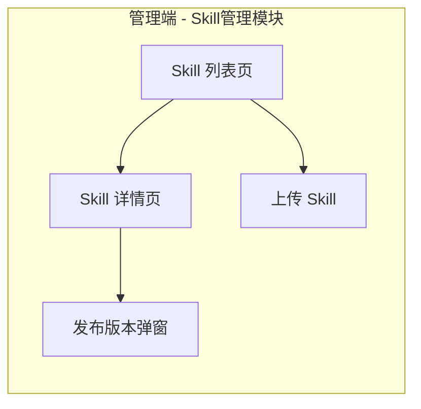
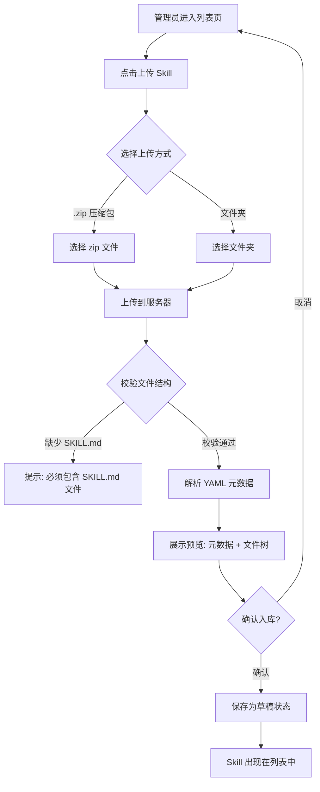
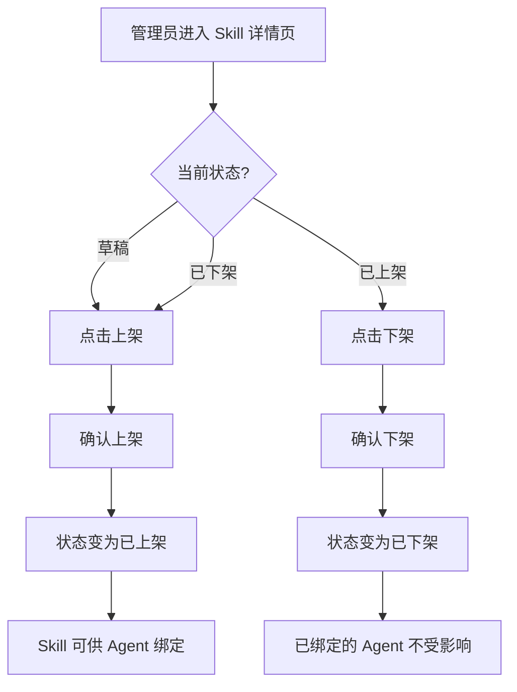
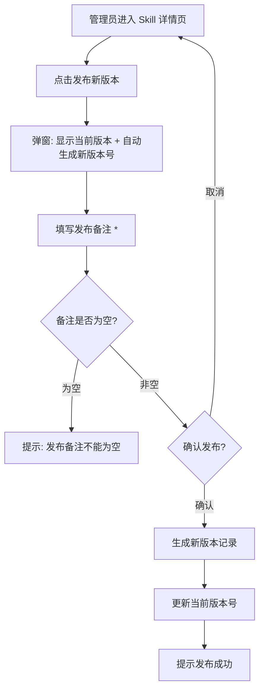
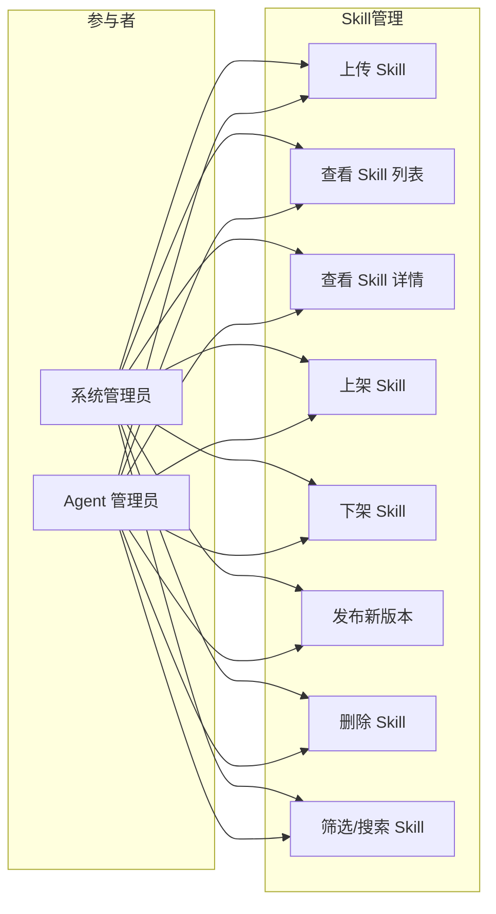

# Skill 管理 产品需求文档（PRD）

## 1. 产品/需求背景

GAgentManager 是一个企业级 Agent 管理平台。Agent 的核心能力由所绑定的 Skill 决定。Skill 管理仅对**管理端**开放，普通用户端不展示任何 Skill 相关功能。

**为什么要做：**
- Agent 管理员需要上传和管理 Skill 文件包，为 Agent 提供能力扩展
- 需要一个统一的 Skill 管理入口，支持上架/下架控制和版本发布

**解决什么问题：**
- Skill 上传困难：需要支持压缩包/文件夹上传，自动解析 SKILL.md 元数据
- 版本管理缺失：无法回滚到旧版本或查看变更历史
- 上架状态不透明：不清楚哪些 Skill 可供 Agent 绑定使用

**面向用户：**
- **系统管理员/Agent 管理员**（管理端）：上传、上架、下架、发布 Skill，管理全平台 Skill 库

> **注意：Skill 管理仅对管理端开放，不对普通用户开放。**

## 2. 目标与范围

### 目标
1. 提供 Skill 上传能力（`.zip` 压缩包 / 文件夹），自动解析 SKILL.md 元数据
2. 实现完整的 Skill 生命周期管理（新增→上架→下架→发布）
3. 建立 Skill 版本管理体系（语义化版本号、发布备注、版本历史）
4. 提供 Skill 列表筛选能力（按分类、标签、状态、关键词搜索）

### 范围

**本次包含（MVP）：**
- Skill 上传（`.zip` 压缩包 / 文件夹）
- SKILL.md YAML 元数据自动解析
- Skill 上架/下架
- Skill 版本发布（每次发布需填写发布备注）
- Skill 列表筛选（分类、标签、状态、关键词搜索）
- Skill 详情查看（文件树、SKILL.md 内容预览）
- Skill 删除（需确认无 Agent 绑定）

**本次不做什么（明确排除）：**
- Skill 评价系统（评分、评论）
- Skill 市场浏览流程
- 第三方 Skill 市场集成
- Skill 安全验证与自动测试
- Skill 推荐算法
- 普通用户端的 Skill 相关功能

## 3. 系统线框图

### 3.1 系统页面结构



### 3.2 页面说明

| 页面 | 对应功能 | 职责 |
|------|---------|------|
| Skill 列表页 | 浏览与筛选 | 分页展示所有 Skill，支持搜索/分类/标签/状态筛选，管理端可见上传按钮 |
| Skill 详情页 | 信息查看 | 文件树浏览、SKILL.md 内容预览、版本历史、上架/下架操作 |
| 上传 Skill | 管理端操作 | 上传 `.zip` 压缩包或文件夹，预览解析结果后确认入库 |
| 发布版本弹窗 | 版本控制 | 填写发布备注，确认发布后生成新版本号 |

## 4. 业务流程图

### 4.1 Skill 上传与新增流程



### 4.2 Skill 上架/下架流程



### 4.3 Skill 版本发布流程



## 5. 用例图

### 5.1 角色定义

| 角色 | 说明 |
|------|------|
| 系统管理员 | 拥有 Skill 全部操作权限（上传、上架、下架、发布、删除） |
| Agent 管理员 | 拥有 Skill 全部操作权限（上传、上架、下架、发布、删除） |

### 5.2 用例图



## 6. 用户与场景

### 6.1 典型用户故事

| # | 角色 | 用户故事 | 优先级 |
|---|------|---------|--------|
| 1 | 系统管理员 | 作为系统管理员，我希望上传 `.zip` 压缩包来新增 Skill，以便快速导入 Skill 文件 | P0 |
| 2 | 系统管理员 | 作为系统管理员，我希望上传文件夹来新增 Skill，以便无需打包直接上传 | P0 |
| 3 | 系统管理员 | 作为系统管理员，我希望上传后自动解析 SKILL.md 元数据，以便减少手动填写 | P0 |
| 4 | 系统管理员 | 作为系统管理员，我希望上架/下架 Skill，以便控制哪些 Skill 可供 Agent 绑定 | P0 |
| 5 | 系统管理员 | 作为系统管理员，我希望发布 Skill 新版本并填写发布备注，以便记录变更内容 | P0 |
| 6 | 系统管理员 | 作为系统管理员，我希望按分类/标签/状态/关键词筛选 Skill，以便快速定位 | P0 |
| 7 | 系统管理员 | 作为系统管理员，我希望查看 Skill 文件树和 SKILL.md 内容，以便了解 Skill 详情 | P0 |
| 8 | 系统管理员 | 作为系统管理员，我希望删除无 Agent 绑定的 Skill，以便清理废弃 Skill | P1 |
| 9 | 系统管理员 | 作为系统管理员，我希望查看版本历史，以便了解 Skill 的发布记录 | P1 |

## 7. 功能需求

### 7.1 功能需求清单

| 序号 | 功能模块 | 功能点 | 优先级 | 说明 |
|------|---------|--------|--------|------|
| **M1** | **Skill 上传** | | **P0** | |
| 1.1 | 上传压缩包 | 支持 `.zip` 格式上传 | P0 | 自动解压到临时目录 |
| 1.2 | 上传文件夹 | 支持直接上传文件夹 | P0 | 通过浏览器 File API 或拖拽 |
| 1.3 | 文件结构校验 | 必须包含 `SKILL.md` 文件 | P0 | 缺少则拒绝上传并提示 |
| 1.4 | 元数据解析 | 自动解析 YAML frontmatter | P0 | 提取 name、description、author、version、tags、category、dependencies |
| 1.5 | 安全扫描 | 检查文件类型、大小、潜在恶意脚本 | P0 | 最大文件大小 50MB |
| 1.6 | 预览确认 | 展示解析结果和文件树 | P0 | 管理员确认后入库，初始状态为"草稿" |
| **M2** | **Skill 列表** | | **P0** | |
| 2.1 | 列表展示 | 分页 Skill 列表 | P0 | 每页默认 20 条，支持 10/20/50/100 切换 |
| 2.2 | 关键词搜索 | 搜索 Skill 名称、描述 | P0 | 模糊匹配 |
| 2.3 | 分类筛选 | 按分类筛选 | P0 | 数据处理、工具调用、内容生成、搜索查询、系统集成、自定义、开发、自动化、创意、通信等 |
| 2.4 | 标签筛选 | 按标签筛选 | P0 | 支持多标签组合，最多 20 个标签 |
| 2.5 | 状态筛选 | 按状态筛选 | P0 | 草稿 / 已上架 / 已下架 |
| **M3** | **Skill 详情** | | **P0** | |
| 3.1 | 基本信息 | 展示名称、描述、图标、分类、标签、作者 | P0 | |
| 3.2 | 文件树 | 展示 Skill 文件树结构 | P0 | 支持展开/折叠目录节点 |
| 3.3 | SKILL.md 预览 | 展示 SKILL.md 完整内容 | P0 | Markdown 渲染 |
| 3.4 | 版本历史 | 展示所有版本记录 | P0 | 版本号、发布备注、发布时间、发布人 |
| 3.5 | 绑定 Agent | 展示已绑定此 Skill 的 Agent 列表 | P1 | 只读展示 |
| **M4** | **上架/下架** | | **P0** | |
| 4.1 | 上架 | 草稿/已下架 → 已上架 | P0 | 上架后可供 Agent 绑定 |
| 4.2 | 下架 | 已上架 → 已下架 | P0 | 已绑定的 Agent 不受影响 |
| **M5** | **版本发布** | | **P0** | |
| 5.1 | 发布新版本 | 生成新版本号 + 填写发布备注 | P0 | 修订号自动+1，也可手动指定主/次版本升级 |
| 5.2 | 发布备注必填 | 不填写发布备注不可发布 | P0 | 最大 1000 字符 |
| 5.3 | 版本历史查看 | 查看所有历史版本 | P0 | 版本号、发布备注、发布时间、发布人 |
| **M6** | **Skill 删除** | | **P1** | |
| 6.1 | 删除校验 | 有 Agent 绑定时不可删除 | P1 | 提示拦截 |
| 6.2 | 逻辑删除 | 标记 deleted=1 | P1 | 不物理删除 |

### 7.2 优先级汇总

| 优先级 | 功能模块 | 交付目标 |
|--------|---------|---------|
| **P0 (MVP)** | M1 上传、M2 列表、M3 详情、M4 上架/下架、M5 版本发布 | 管理员可以上传 Skill、上架/下架、发布新版本、列表筛选 |
| **P1** | M3.5 绑定 Agent 展示、M6 删除 | 完整的 Skill 生命周期管理 |

## 8. 原型图/界面说明

### 8.1 Skill 列表页

```
┌──────────────────────────────────────────────────────────────────┐
│  Skill 管理                                        [上传 Skill]  │
├──────────────────────────────────────────────────────────────────┤
│  [🔍 搜索 Skill...]  分类: [全部 ▾]  标签: [选择 ▾]  状态: [全部 ▾]│
├──────────────────────────────────────────────────────────────────┤
│  名称      分类      状态    版本    作者      绑定Agent  更新时间  │
│  ─────────────────────────────────────────────────────────────── │
│  代码助手  工具调用  已上架  V1.2.0  张三      3        2026-05-01│
│  数据分析  数据处理  草稿    V1.0.0  李四      0        2026-04-28│
│  文本生成  内容生成  已下架  V2.0.0  王五      1        2026-04-25│
├──────────────────────────────────────────────────────────────────┤
│  共 3 条   <  1  >        每页: [20 ▾]                          │
└──────────────────────────────────────────────────────────────────┘
```

**关键元素：**
- 顶部搜索栏 + 筛选条件（分类下拉、标签多选、状态下拉）
- 「上传 Skill」按钮（管理端可见）
- 列表展示：名称、分类、状态、版本、作者、绑定 Agent 数、更新时间
- 底部分页控件

**空态：** 无匹配结果时展示「暂无匹配的 Skill，请调整搜索条件」+ 搜索建议

---

### 8.2 Skill 详情页

```
┌──────────────────────────────────────────────────────────────────┐
│  ← 返回列表                                        [上架]/[下架] │
├──────────────────────────────────────────────────────────────────┤
│  Skill 名称: 代码助手                              状态: [已上架] │
│  描述: 一个用于辅助代码编写的 Skill，支持代码生成、补全、重构等功能 │
│  作者: 张三        当前版本: V1.2.0    分类: 工具调用              │
│  标签: #代码 #自动化 #数据处理                                    │
│                                                    [发布新版本]   │
├──────────────────────────────────────────────────────────────────┤
│  [文件树]  [SKILL.md 预览]  [版本历史]  [绑定 Agent]               │
├──────────────────────────────────────────────────────────────────┤
│                                                                  │
│  Tab: 文件树                                                      │
│  skill-name/                                                      │
│  ├── SKILL.md (2.3KB)                                             │
│  ├── scripts/                                                     │
│  │   ├── analyze.py (5.1KB)                                       │
│  │   └── format.sh (1.2KB)                                        │
│  ├── references/                                                  │
│  │   └── API.md (8.7KB)                                           │
│  └── assets/                                                      │
│      └── icon.svg (3.4KB)                                         │
│                                                                  │
│  Tab: SKILL.md 预览                                                │
│  (Markdown 渲染的内容，包含 YAML frontmatter + 指令正文)           │
│                                                                  │
│  Tab: 版本历史                                                     │
│  V1.2.0 (2026-05-01 张三)                                         │
│    - 新增代码格式化功能                                           │
│    - 修复代码补全偶发卡顿问题                                     │
│  V1.1.0 (2026-04-15 张三)                                         │
│    - 优化代码分析准确度                                           │
│  V1.0.0 (2026-04-01 张三)                                         │
│    - 初始版本                                                     │
│                                                                  │
│  Tab: 绑定 Agent                                                   │
│  Agent-A  |  绑定时间: 2026-04-20  |  版本: V1.0.0                │
│  Agent-B  |  绑定时间: 2026-04-25  |  版本: V1.2.0                │
│                                                                  │
└──────────────────────────────────────────────────────────────────┘
```

---

### 8.3 上传 Skill 页（管理端）

```
┌──────────────────────────────────────────────────────────────────┐
│  ← 返回列表              上传 Skill                              │
├──────────────────────────────────────────────────────────────────┤
│                                                                  │
│  上传方式:  [●] 上传压缩包 (.zip)   [○] 上传文件夹               │
│                                                                  │
│  ┌──────────────────────────────────────────────────────────┐   │
│  │                                                          │   │
│  │          拖拽文件到此处，或 [点击选择文件]                  │   │
│  │          支持 .zip 格式，最大 50MB                        │   │
│  │                                                          │   │
│  └──────────────────────────────────────────────────────────┘   │
│                                                                  │
│  ──── 预览（上传后展示） ────                                    │
│                                                                  │
│  解析结果:                                                       │
│  Skill 名称:    代码助手                                          │
│  功能描述:      一个用于辅助代码编写的 Skill...                    │
│  作者:          张三                                              │
│  版本:          1.0.0                                             │
│  分类:          development                                      │
│  标签:          code, automation                                  │
│  文件数:        5                                                 │
│  总大小:        20.7KB                                            │
│                                                                  │
│  文件树预览:                                                     │
│  skill-name/                                                     │
│  ├── SKILL.md (2.3KB)                                            │
│  ├── scripts/analyze.py (5.1KB)                                  │
│  └── ...                                                         │
│                                                                  │
│                           [取消]  [确认入库]                      │
│                                                                  │
└──────────────────────────────────────────────────────────────────┘
```

**校验规则：**
- 必须包含 `SKILL.md` 文件
- `SKILL.md` 中必须包含 YAML frontmatter
- `name` 和 `description` 为必填字段
- `name` 格式：kebab-case，最大 64 字符

---

### 8.4 发布 Skill 版本弹窗

```
┌────────────────────────────────────────────┐
│  发布新版本                                │
├────────────────────────────────────────────┤
│                                            │
│  当前版本: V1.2.0                          │
│  新版本号: V1.2.1（自动生成）               │
│                                            │
│  发布备注 *                                │
│  [_____________________________________]   │
│  [_____________________________________]   │
│  [_____________________________________]   │
│  (最大 1000 字符)                           │
│                                            │
│  提示: 发布备注不能为空                      │
│                                            │
│              [取消]    [确认发布]            │
│                                            │
└────────────────────────────────────────────┘
```

---

### 8.5 关键状态说明

| 状态 | 展示 | 说明 |
|------|------|------|
| 草稿 | 状态标签：灰色「草稿」 | 新上传的 Skill，尚未上架 |
| 已上架 | 状态标签：绿色「已上架」 | 可供 Agent 绑定使用 |
| 已下架 | 状态标签：红色「已下架」 | 不可被新 Agent 绑定，已绑定的不受影响 |
| 空态（列表无结果） | 居中图标 + 「暂无匹配的 Skill，请调整搜索条件」 | 搜索/筛选结果为空 |
| 加载中 | 列表位置展示 loading 骨架屏 | 数据请求中 |
| 错误态 | Toast 提示错误原因 + 重试按钮 | 接口返回失败 |
| 有 Agent 绑定不可删除 | 删除时弹出提示：「该 Skill 已被 X 个 Agent 绑定，请先解除绑定后再删除」 | 删除拦截 |

## 9. 非功能需求

### 9.1 性能
- Skill 列表搜索响应时间 < 1 秒（P95）
- Skill 详情页加载时间 < 500ms（P95）
- 文件上传（50MB 以内）处理时间 < 5 秒

### 9.2 安全与权限
- Skill 创建/编辑/上架/下架/删除/发布：仅管理端（系统管理员/Agent 管理员）可操作
- **普通用户端不展示任何 Skill 相关功能和页面**

### 9.3 数据一致性
- Skill 删除前必须检查是否有 Agent 绑定（强校验）
- Skill name（来自 SKILL.md YAML）全局唯一（数据库唯一索引约束）
- 发布时发布备注必填，不填写不可发布

### 9.4 兼容性
- 浏览器兼容：Chrome 90+, Firefox 88+, Safari 14+
- 前端框架：React 18 + Ant Design
- 屏幕分辨率：支持 1366x768 及以上

### 9.5 错误提示
- 所有操作失败时需返回明确的中文错误提示
- 前端错误码映射：
  - `1301` → 「Skill 编码已存在，请更换编码」
  - `1304` → 「该 Skill 已被 Agent 绑定，请先解除绑定后再删除」

## 10. 与现有功能的关系

### 10.1 全新功能

Skill 管理是 GAgentManager 平台的全新功能模块，不依赖已有功能的改造。

### 10.2 与现有模块的关联

| 关联模块 | 关联点 | 说明 |
|---------|--------|------|
| Agent 管理 | Skill 绑定 | Agent 只能使用 Skill 管理中已上架的 Skill，关联关系在 Agent 域中管理 |
| 用户管理 | 操作用户 | Skill 的创建人、发布人需关联操作用户信息 |
| 审计日志 | 领域事件 | Skill 创建/上架/下架/发布/删除操作需发送领域事件，供审计日志消费 |
| RBAC 权限 | 权限控制 | Skill 操作需遵循 RBAC 权限模型 |

### 10.3 数据迁移

无历史数据迁移需求（全新模块）。

## 11. 验收标准

### 11.1 功能验收

| # | 验收条款 | 验收方法 |
|---|---------|---------|
| 1 | 管理员可以上传 `.zip` 压缩包新增 Skill | 上传 zip 文件，自动解压并解析 SKILL.md |
| 2 | 管理员可以上传文件夹新增 Skill | 上传文件夹，自动解析 SKILL.md |
| 3 | 缺少 SKILL.md 的包应拒绝上传 | 上传不含 SKILL.md 的 zip，提示错误 |
| 4 | SKILL.md 元数据解析准确率 100% | name、description 为必填项，解析正确 |
| 5 | 管理员可以上架/下架 Skill | 操作后状态正确更新 |
| 6 | 发布新版本时必须填写发布备注 | 不填写时不可点击确认发布 |
| 7 | 每次发布生成新的版本号 | 修订号自动+1，版本号正确递增 |
| 8 | 支持按分类/标签/状态/关键词筛选 | 选择筛选条件，结果正确过滤 |
| 9 | 详情页可展示文件树和 SKILL.md 内容 | 文件树可展开/折叠，SKILL.md 正确渲染 |
| 10 | 有 Agent 绑定的 Skill 不可删除 | 尝试删除时弹出拦截提示 |
| 11 | 版本历史正确展示所有发布记录 | 包含版本号、发布备注、发布时间、发布人 |

### 11.2 性能验收

- Skill 列表搜索 P95 响应时间 < 1 秒
- 详情页加载 P95 响应时间 < 500ms
- 文件上传（50MB 以内）处理时间 < 5 秒

### 11.3 安全验收

- 普通用户无法访问/查看 Skill 管理页面
- 非管理员用户无法上传/上架/下架/发布/删除 Skill
- Skill name 重复时返回明确错误
- 所有操作记录操作用户和时间

---

**文档版本：** V1.0  
**创建日期：** 2026年05月01日  
**作者：** GAgentManager 产品团队  
**关联技术方案：** `docs/技术方案/2026-04-29_Skill商店-技术方案.md`  
**关联总 PRD：** `docs/prd/PRD-GAgentManager-V5.0.md` §4.1.5  
**审核人：** 产品负责人、技术负责人、业务负责人
