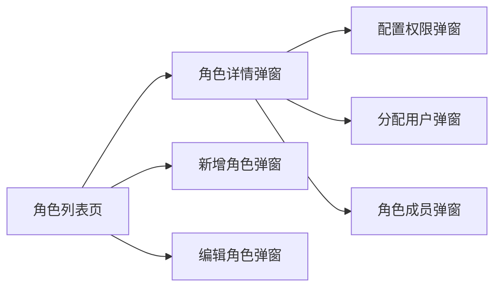
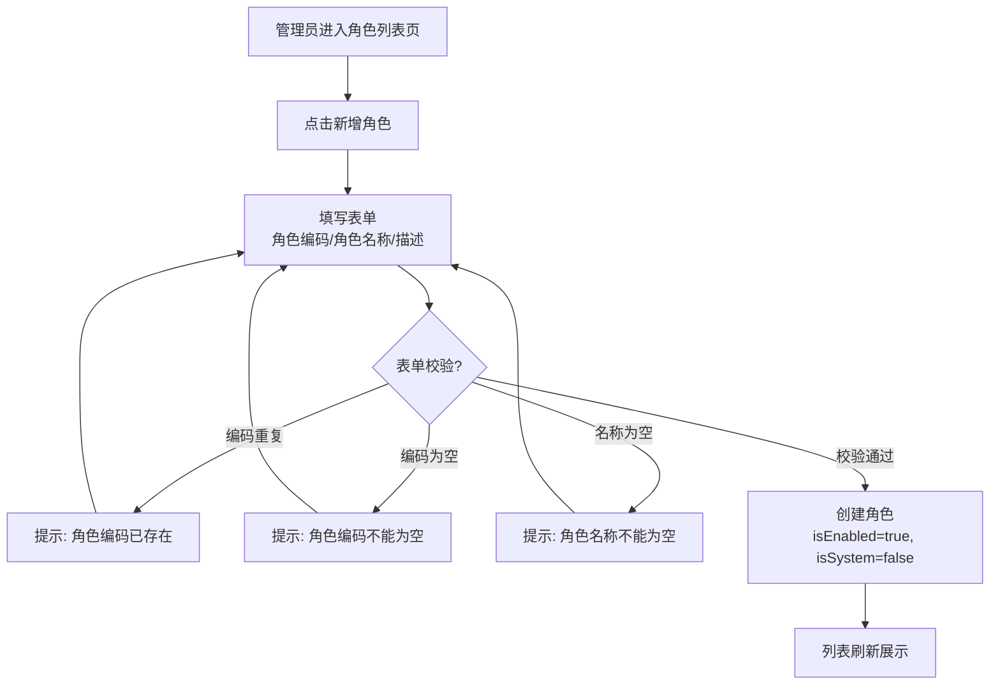
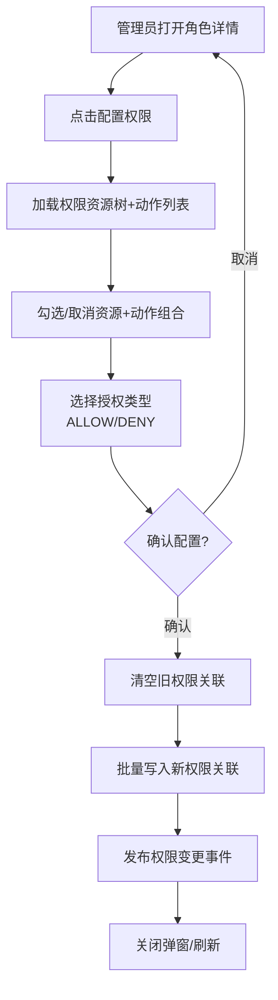
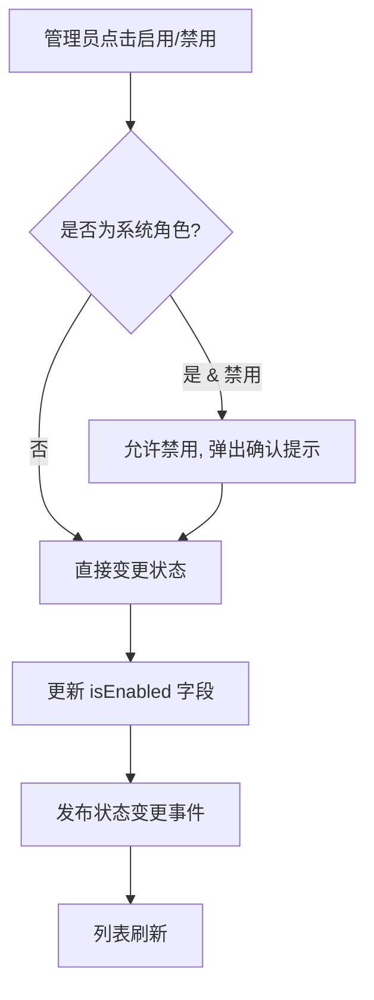
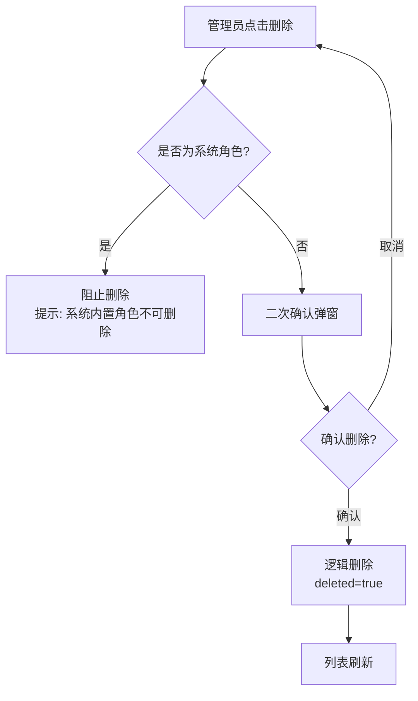
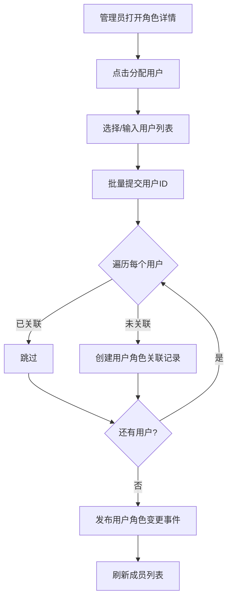
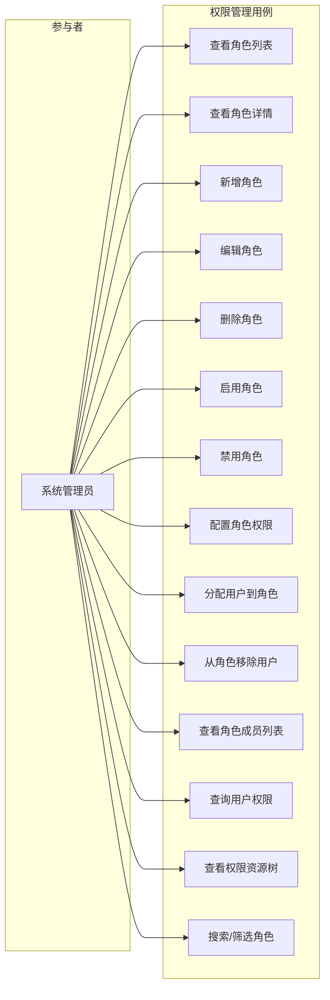

# 权限管理 产品需求文档（PRD）

> **版本**：V1.0
> **日期**：2026-05-02
> **状态**：评审中

---

## 1. 产品/需求背景

GAgentManager 是一个企业级 Agent 管理平台。权限管理（RBAC，基于角色的访问控制）是平台的核心安全基础设施，用于定义「谁在什么资源上可以做什么操作」。

**为什么要做：**
- 现有主 PRD V5.0 §4.1.3 仅概述了权限管理功能，缺少独立、详细的产品需求文档
- 需要一个独立的 PRD 文档来定义权限管理的完整功能范围、交互细节和数据约束
- 企业管理需要灵活的权限体系，确保不同角色的管理员只能访问其被授权的功能范围

**解决什么问题：**
- 角色全生命周期管理（新增、编辑、启用、禁用、删除）
- 权限资源树管理（资源 CRUD、层级关系）
- 角色权限配置（资源+动作组合的授权/拒绝）
- 用户角色绑定（批量分配、移除）
- 用户权限查询（某个用户拥有的全部权限码）
- 系统内置角色保护（防止误删核心角色）

**面向用户：**
- **系统管理员**（管理端）：全部权限管理操作（角色/权限配置/用户角色绑定）

> **注意：权限管理仅对管理端开放。普通用户端无权限管理入口。**

---

## 2. 目标与范围

### 目标
1. 提供角色全生命周期管理（新增、编辑、启用、禁用、删除）
2. 提供权限资源树形展示与管理（资源层级、类型、排序）
3. 提供角色权限配置界面（可视化勾选资源+动作组合）
4. 提供用户角色批量分配与移除
5. 提供用户权限查询能力
6. 保护系统内置角色不被误删

### 范围

**本次包含（MVP）：**
- 角色新增（角色编码、角色名称、描述）
- 角色编辑（修改名称、描述，编码不可修改）
- 角色启用/禁用
- 角色删除（逻辑删除，系统内置角色不可删除）
- 角色列表（分页、关键词搜索、启用状态筛选）
- 角色详情查看
- 权限资源树展示（MODULE/MENU/BUTTON/API 四级类型）
- 权限动作列表（read/create/update/delete/admin）
- 角色权限配置（为角色分配/撤销资源+动作组合，支持 ALLOW/DENY）
- 用户角色分配（批量为用户绑定角色）
- 从角色中移除用户
- 角色成员列表（查看某角色下的所有用户）
- 用户权限查询（查看某用户的全部权限码）

**本次不做什么（明确排除）：**
- 动态权限资源/动作新增（资源树和动作集合通过初始化脚本预置）
- 权限变更实时生效（需要用户重新登录或刷新 token 后生效）
- 数据级权限控制（行级/字段级权限）
- 临时权限/过期权限管理（虽然 user_role 表有 expire_time 字段，但本期不做 UI 支持）
- 权限审批流程
- 跨租户/多组织权限隔离

---

## 3. 系统线框图

### 3.1 管理端权限管理模块结构



### 3.2 系统导航结构

```
管理端主导航
├── 首页
├── Agent 管理
├── 用户管理
├── 权限管理  ← 本次变更
│   ├── 角色列表页（新增/编辑/删除/启用/禁用/详情）
│   ├── 角色详情弹窗（基本信息/权限配置/成员列表）
│   ├── 配置权限弹窗（资源树+动作勾选）
│   ├── 分配用户弹窗（批量绑定用户到角色）
│   └── 角色成员弹窗（查看/移除角色下的用户）
├── Skill 管理
├── MCP 管理
├── 模型管理
└── 系统配置
```

**页面说明：**

| 页面 | 职责 | 对应功能 |
|------|------|---------|
| 角色列表页 | 展示所有角色，支持筛选/搜索/分页 | 角色列表查询 |
| 角色详情弹窗 | 查看角色完整信息+权限配置+成员管理 | 角色详情查看/权限配置/成员管理 |
| 新增角色弹窗 | 录入新角色基本信息 | 角色新增 |
| 编辑角色弹窗 | 修改已有角色基本信息 | 角色编辑 |
| 配置权限弹窗 | 可视化勾选资源树+动作组合 | 角色权限配置 |
| 分配用户弹窗 | 选择用户批量绑定到当前角色 | 用户角色分配 |
| 角色成员弹窗 | 查看当前角色下的所有用户 | 角色成员查看/移除 |

---

## 4. 业务流程图

### 4.1 角色新增流程



### 4.2 角色权限配置流程



### 4.3 角色启用/禁用流程



### 4.4 角色删除流程



### 4.5 用户角色分配流程



---

## 5. 用例图

### 5.1 角色定义

| 角色 | 说明 |
|------|------|
| 系统管理员 | 管理端最高权限，可执行全部权限管理操作 |

### 5.2 用例图



---

## 6. 用户与场景

### 6.1 典型用户故事

| # | 角色 | 用户故事 | 优先级 |
|---|------|---------|--------|
| 1 | 系统管理员 | 作为系统管理员，我希望新增一个自定义角色并设置其名称和描述，以便为不同职责的人员分配不同权限 | P0 |
| 2 | 系统管理员 | 我希望查看角色列表并通过关键词搜索特定角色，以便快速定位目标角色 | P0 |
| 3 | 系统管理员 | 我希望为角色配置权限，通过勾选资源树上的功能模块和操作，以便精确控制该角色的访问范围 | P0 |
| 4 | 系统管理员 | 我希望将用户批量分配到一个角色，以便一次性授予多个用户相同的权限集合 | P0 |
| 5 | 系统管理员 | 我希望启用或禁用某个角色，以便在不删除角色的情况下控制其是否可用 | P0 |
| 6 | 系统管理员 | 我希望编辑角色的基本信息（名称、描述），以便保持角色信息的准确性 | P0 |
| 7 | 系统管理员 | 我希望查看某个角色下的所有成员，以便了解哪些用户拥有该角色的权限 | P0 |
| 8 | 系统管理员 | 我希望从角色中移除某个用户，以便收回该用户通过此角色获得的权限 | P0 |
| 9 | 系统管理员 | 我希望查询某个用户拥有的全部权限，以便审计该用户的权限范围 | P0 |
| 10 | 系统管理员 | 我希望查看完整的权限资源树，以便了解平台当前有哪些可配置的权限资源 | P0 |
| 11 | 系统管理员 | 我希望删除不再需要的自定义角色，以便清理冗余的角色数据 | P1 |
| 12 | 系统管理员 | 我希望系统内置角色不被误删除，以避免破坏平台的核心权限体系 | P0 |

---

## 7. 功能需求

### 7.1 功能需求清单

| 序号 | 功能模块 | 功能点 | 优先级 | 说明 |
|------|---------|--------|--------|------|
| **M1** | **角色新增** | | **P0** | |
| 1.1 | 角色编码 | 设置唯一角色编码 | P0 | 1-64 字符，字母数字下划线，全局唯一 |
| 1.2 | 角色名称 | 设置角色显示名称 | P0 | 1-128 字符 |
| 1.3 | 描述 | 填写角色描述 | P1 | 最大 500 字符 |
| 1.4 | 初始状态 | 自动设为启用 | P0 | 创建时默认 isEnabled=true, isSystem=false |
| **M2** | **角色列表** | | **P0** | |
| 2.1 | 列表展示 | 分页角色列表 | P0 | 每页默认 20 条，支持 10/20/50/100 切换 |
| 2.2 | 关键词搜索 | 搜索角色编码、角色名称 | P0 | 模糊匹配 |
| 2.3 | 状态筛选 | 按启用/禁用状态筛选 | P1 | 全部 / 已启用 / 已禁用 |
| 2.4 | 操作列 | 编辑/删除/启用/禁用/详情 | P0 | 列表行操作按钮 |
| **M3** | **角色详情** | | **P0** | |
| 3.1 | 基本信息 | 展示角色编码、名称、描述、是否系统内置、状态 | P0 | |
| 3.2 | 系统信息 | 展示创建人、创建时间、更新人、更新时间 | P0 | |
| 3.3 | 关联用户数 | 展示该角色关联的用户数量 | P0 | |
| **M4** | **角色编辑** | | **P0** | |
| 4.1 | 编辑基本信息 | 修改角色名称、描述 | P0 | 角色编码不可修改 |
| 4.2 | 状态修改 | 通过单独的启用/禁用操作 | P0 | 不在编辑表单中修改状态 |
| **M5** | **角色删除** | | **P1** | |
| 5.1 | 逻辑删除 | 标记 deleted=true | P1 | 不物理删除 |
| 5.2 | 系统角色保护 | 系统内置角色不可删除 | P0 | is_system=true 时阻止 |
| 5.3 | 删除确认 | 二次确认弹窗 | P1 | 防止误操作 |
| **M6** | **状态管理** | | **P0** | |
| 6.1 | 启用 | 已禁用 → 已启用 | P0 | 角色可被分配给用户 |
| 6.2 | 禁用 | 已启用 → 已禁用 | P0 | 角色仍可查看，但提示已禁用 |
| **M7** | **权限配置** | | **P0** | |
| 7.1 | 资源树展示 | 树形展示权限资源 | P0 | 支持 MODULE/MENU/BUTTON/API 层级 |
| 7.2 | 动作列表 | 展示可用权限动作 | P0 | read/create/update/delete/admin |
| 7.3 | 权限勾选 | 勾选/取消资源+动作组合 | P0 | 可视化多选界面 |
| 7.4 | 授权类型 | 选择 ALLOW（允许）或 DENY（拒绝） | P0 | 默认 ALLOW |
| 7.5 | 保存配置 | 批量写入角色权限关联 | P0 | 先清空旧权限，再写入新权限 |
| **M8** | **用户角色分配** | | **P0** | |
| 8.1 | 批量分配 | 选择多个用户绑定到当前角色 | P0 | 已关联的用户自动跳过 |
| 8.2 | 移除用户 | 从当前角色中移除单个用户 | P0 | |
| 8.3 | 成员列表 | 分页展示角色下的所有用户 | P0 | 用户ID、用户名、关联类型、关联时间、操作人 |
| **M9** | **用户权限查询** | | **P0** | |
| 9.1 | 权限码列表 | 查询用户拥有的全部权限码 | P0 | 聚合所有关联角色的 ALLOW 权限 |
| **M10** | **权限资源管理** | | **P1** | |
| 10.1 | 资源树查询 | 查询完整权限资源树 | P1 | 只读，通过初始化脚本预置 |
| 10.2 | 动作列表查询 | 查询所有权限动作 | P1 | 只读，通过初始化脚本预置 |

### 7.2 优先级汇总

| 优先级 | 功能模块 | 交付目标 |
|--------|---------|---------|
| **P0 (MVP)** | M1 新增、M2 列表、M3 详情、M4 编辑、M5 系统角色保护、M6 状态管理、M7 权限配置、M8 用户角色分配、M9 用户权限查询 | 完整的角色 CRUD + 权限配置 + 用户角色绑定 |
| **P1** | M5 角色删除、M10 权限资源管理 | 角色删除能力 + 资源/动作只读查询 |

---

## 8. 原型图/界面说明

### 8.1 角色列表页

```
┌─────────────────────────────────────────────────────────────────────────────────────┐
│  权限管理                                                              [+ 新增角色] │
├─────────────────────────────────────────────────────────────────────────────────────┤
│  [🔍 搜索角色编码/名称...]         状态: [全部 ▾]                      [搜索] [重置] │
├────────────┬────────────┬──────────────┬──────┬────────┬──────────┬──────────────────┤
│ 角色编码   │ 角色名称   │ 描述         │ 类型 │ 状态   │ 用户数   │ 操作             │
├────────────┼────────────┼──────────────┼──────┼────────┼──────────┼──────────────────┤
│ SUPER_ADMIN│ 超级管理员 │ 拥有全部权限 │ 系统 │ 🟢已启用│ 1        │ 详情 编辑 禁用   │
├────────────┼────────────┼──────────────┼──────┼────────┼──────────┼──────────────────┤
│ ADMIN      │ 管理员     │ 日常管理权限 │ 系统 │ 🟢已启用│ 3        │ 详情 编辑 禁用   │
├────────────┼────────────┼──────────────┼──────┼────────┼──────────┼──────────────────┤
│ VIEWER     │ 观察者     │ 只读权限     │ 系统 │ 🟢已启用│ 5        │ 详情 编辑 禁用   │
├────────────┼────────────┼──────────────┼──────┼────────┼──────────┼──────────────────┤
│ CUSTOM_01  │ 运营专员   │ 运营相关权限 │ 自定义│🔴已禁用│ 0        │ 详情 编辑 启用 删除│
├────────────┴────────────┴──────────────┴──────┴────────┴──────────┴──────────────────┤
│  共 4 条   <  1  >              每页: [20 ▾]                                           │
└─────────────────────────────────────────────────────────────────────────────────────┘
```

**关键元素：**
- 顶部搜索栏 + 状态筛选 + 搜索/重置按钮
- 「新增角色」按钮
- 列表展示：角色编码、角色名称、描述、类型（系统/自定义）、状态（彩色标签）、关联用户数
- 操作列：详情、编辑、启用/禁用、删除（系统角色不显示删除按钮）
- 底部分页控件

**空态：** 无匹配结果时展示「暂无匹配的角色，请调整搜索条件」

---

### 8.2 新增角色弹窗

```
┌────────────────────────────────────────────┐
│  新增角色                           [×]    │
├────────────────────────────────────────────┤
│                                            │
│  角色编码 *                                │
│  [CUSTOM_ROLE____________________]         │
│  （1-64字符，字母、数字、下划线）           │
│                                            │
│  角色名称 *                                │
│  [运营专员_______________________]         │
│                                            │
│  描述                                      │
│  [负责运营相关功能的查看与操作_____]       │
│  [_________________________________]       │
│  （可选，最大500字符）               20/500  │
│                                            │
│              [取消]      [确认创建]          │
│                                            │
└────────────────────────────────────────────┘
```

**校验规则：**
- 角色编码、角色名称为必填
- 角色编码 1-64 字符，仅允许字母、数字、下划线，全局唯一
- 角色名称 1-128 字符
- 描述可选，最大 500 字符
- 创建后自动设为启用状态（isEnabled=true），非系统角色（isSystem=false）

---

### 8.3 编辑角色弹窗

```
┌────────────────────────────────────────────┐
│  编辑角色                           [×]    │
├────────────────────────────────────────────┤
│                                            │
│  角色编码：ADMIN（不可修改）                  │
│                                            │
│  角色名称 *                                │
│  [高级管理员_____________________]         │
│                                            │
│  描述                                      │
│  [负责日常管理和用户审批___________]       │
│  [_________________________________]       │
│  （可选，最大500字符）               18/500  │
│                                            │
│              [取消]      [确认修改]          │
│                                            │
└────────────────────────────────────────────┘
```

**说明：**
- 角色编码不可修改
- 其他校验规则同新增

---

### 8.4 角色详情弹窗

```
┌──────────────────────────────────────────────────────────┐
│  角色详情 - ADMIN                                 [×]    │
├──────────────────────────────────────────────────────────┤
│                                                          │
│  ┌─ 基本信息 ───────────────────────────────────────┐   │
│  │  角色编码:     ADMIN                             │   │
│  │  角色名称:     管理员                             │   │
│  │  描述:         日常管理权限                       │   │
│  │  角色类型:     系统内置                          │   │
│  │  状态:         🟢 已启用                         │   │
│  │  关联用户数:   3                                 │   │
│  └──────────────────────────────────────────────────┘   │
│                                                          │
│  ┌─ 系统信息 ───────────────────────────────────────┐   │
│  │  创建人:       system                            │   │
│  │  创建时间:     2026-05-01 10:00:00               │   │
│  │  更新人:       admin                             │   │
│  │  更新时间:     2026-05-01 14:20:00               │   │
│  └──────────────────────────────────────────────────┘   │
│                                                          │
│  ┌─ Tab 页签 ───────────────────────────────────────┐   │
│  │  [权限配置]  [角色成员]                           │   │
│  │                                                  │   │
│  │  > 权限配置页签：                                 │   │
│  │  显示当前角色的权限矩阵（资源树 + 已勾选的动作）   │   │
│  │  [配置权限] 按钮 → 打开配置权限弹窗               │   │
│  │                                                  │   │
│  │  > 角色成员页签：                                 │   │
│  │  分页展示关联的用户列表                           │   │
│  │  [分配用户] 按钮 → 打开分配用户弹窗               │   │
│  │  每行操作列有「移除」按钮                         │   │
│  └──────────────────────────────────────────────────┘   │
│                                                          │
│          [编辑]    [启用/禁用]    [删除]                  │
│                                                          │
└──────────────────────────────────────────────────────────┘
```

**关键说明：**
- 权限配置和角色成员以 Tab 页签方式组织
- 系统内置角色不显示删除按钮或点击时提示不可删除
- 底部操作按钮根据当前状态动态变化

---

### 8.5 配置权限弹窗

```
┌──────────────────────────────────────────────────────────────────┐
│  配置权限 - 管理员                                        [×]    │
├──────────────────────────────────────────────────────────────────┤
│                                                                  │
│  授权类型:  [●] ALLOW（允许）    [○] DENY（拒绝）                 │
│                                                                  │
│  ┌─ 权限资源树 ───────────────┬─ 权限动作 ─────────────────────┐ │
│  │  [☑] 首页                  │  [☑] read    (查看)            │ │
│  │  [☑] Agent 管理            │  [☐] create  (新增)            │ │
│  │    [☑] Agent 列表          │  [☐] update  (编辑)            │ │
│  │    [☑] Agent 详情          │  [☐] delete  (删除)            │ │
│  │    [☐] Agent 删除          │  [☐] admin   (管理)            │ │
│  │  [☑] 用户管理              │                                │ │
│  │    [☑] 用户列表            │                                │ │
│  │    [☑] 用户详情            │                                │ │
│  │    [☐] 用户编辑            │                                │ │
│  │  [☐] 权限管理              │                                │ │
│  │  [☐] Skill 管理            │                                │ │
│  │  [☐] MCP 管理              │                                │ │
│  │  [☐] 模型管理              │                                │ │
│  │  [☐] 系统配置              │                                │ │
│  └────────────────────────────┴────────────────────────────────┘ │
│                                                                  │
│  提示：当前配置将覆盖该角色的现有权限，确认保存后旧权限将被清除。    │
│                                                                  │
│              [取消]              [确认保存]                        │
│                                                                  │
└──────────────────────────────────────────────────────────────────┘
```

**交互说明：**
- 左侧为权限资源树（Tree 组件），支持展开/折叠、勾选/取消
- 右侧为权限动作复选框组（Checkbox Group）
- 勾选资源树节点 + 勾选动作 = 生成一条权限关联记录（resourceCode:actionCode）
- 授权类型切换：ALLOW 表示允许访问，DENY 表示明确拒绝
- 保存时先清空该角色的全部现有权限，再批量写入新权限
- 底部提示告知用户这是全量覆盖操作

---

### 8.6 分配用户弹窗

```
┌────────────────────────────────────────────┐
│  分配用户 - 管理员                   [×]    │
├────────────────────────────────────────────┤
│                                            │
│  搜索用户: [🔍 输入用户名/姓名搜索...]      │
│                                            │
│  ┌────────────────────────────────────┐   │
│  │ [☑] 全选                           │   │
│  │ [ ] admin  (张三)                  │   │
│  │ [ ] lisi   (李四)                  │   │
│  │ [☑] wangwu (王五)                  │   │
│  │ [☑] zhaoliu (赵六)                 │   │
│  │                                    │   │
│  │ 已选择 2 个用户                     │   │
│  └────────────────────────────────────┘   │
│                                            │
│  提示：已关联该角色的用户将自动跳过。        │
│                                            │
│              [取消]      [确认分配]          │
│                                            │
└────────────────────────────────────────────┘
```

**说明：**
- 支持搜索/筛选可选用户
- 已关联的用户默认不显示或标记为已选中
- 提交后后端自动跳过已存在的关联记录

---

### 8.7 角色成员弹窗（Tab 页签内）

```
┌──────────────────────────────────────────────────────────┐
│  角色成员 - 管理员                                [×]    │
├──────────────────────────────────────────────────────────┤
│                                                          │
│  ┌──────┬────────┬──────────┬──────────────────┬────────┐│
│  │ 用户名 │ 真实姓名│ 关联类型 │ 关联时间         │ 操作   ││
│  ├──────┼────────┼──────────┼──────────────────┼────────┤│
│  │ admin│ 张三   │ 直接分配 │ 2026-05-01 10:00 │ [移除] ││
│  ├──────┼────────┼──────────┼──────────────────┼────────┤│
│  │ lisi │ 李四   │ 直接分配 │ 2026-05-01 11:30 │ [移除] ││
│  ├──────┼────────┼──────────┼──────────────────┼────────┤│
│  │ wangwu│ 王五  │ 直接分配 │ 2026-05-02 09:00 │ [移除] ││
│  └──────┴────────┴──────────┴──────────────────┴────────┘│
│                                                          │
│  共 3 条   <  1  >                                        │
│                                                          │
└──────────────────────────────────────────────────────────┘
```

---

### 8.8 关键状态说明

| 状态 | 展示 | 说明 |
|------|------|------|
| 已启用 | 绿色标签「已启用」 | 角色可被分配给用户 |
| 已禁用 | 红色标签「已禁用」 | 角色不可被分配，已有用户权限不受影响 |
| 系统内置 | 紫色标签「系统」 | 不可删除，可编辑名称和描述 |
| 自定义 | 蓝色标签「自定义」 | 可编辑、可删除 |
| 空态（列表无结果） | 居中图标 + 「暂无匹配的角色，请调整搜索条件」 | 搜索/筛选结果为空 |
| 加载中 | 列表位置展示 loading 骨架屏 | 数据请求中 |
| 错误态 | Toast 提示错误原因 + 重试按钮 | 接口返回失败 |

---

## 9. 非功能需求

### 9.1 性能
- 角色列表查询响应时间 < 1 秒（P95）
- 权限资源树加载时间 < 500ms（P95）
- 角色成员列表查询 < 500ms（P95）

### 9.2 安全
- 系统内置角色（is_system=true）不可删除
- 权限变更需要用户重新登录或刷新 token 后生效
- 所有权限管理操作记录操作人和时间
- 非管理员用户无法访问权限管理页面

### 9.3 数据一致性
- 角色编码全局唯一（数据库唯一索引约束 uk_role_code）
- 资源编码全局唯一（数据库唯一索引约束 uk_resource_code）
- 角色权限关联唯一（联合唯一索引 uk_role_resource_action）
- 用户角色关联唯一（联合唯一索引 uk_user_role）
- 删除为逻辑删除（标记 deleted=true），不物理删除

### 9.4 兼容性
- 浏览器兼容：Chrome 90+, Firefox 88+, Safari 14+
- 前端框架：React 18 + Ant Design
- 屏幕分辨率：支持 1366x768 及以上

### 9.5 错误提示
- 所有操作失败时需返回明确的中文错误提示
- 前端错误码映射：
  - `1001` → 「角色编码已存在」
  - `1002` → 「角色不存在」
  - `1003` → 「系统内置角色不可删除」
  - `1004` → 「资源不存在」
  - `1005` → 「权限动作不存在」

---

## 10. 与现有功能的关系

### 10.1 现有代码

权限管理模块已有完整的六层代码实现：
- **domain**：Role 聚合根（含 save/delete/enable/disable 等领域动作）、RoleRepository、RolePermissionRepository、UserRoleRepository、PermissionResourceRepository、PermissionActionRepository
- **application**：RbacCommandService（createRole/updateRole/deleteRole/enableRole/disableRole/assignUsers/removeUserFromRole/assignPermissions）、RbacQueryService（getRoleById/listRoles/listPermissionTree/getRolePermissions/getUsersByRole/getPermissionsByUserId）
- **adapter**：RbacCommandController（POST 写操作）、RbacQueryController（GET 读操作）
- **client**：CreateRoleParam/UpdateRoleParam/AssignUsersParam/AssignPermissionsParam/RoleVO/RolePermissionVO/PermissionResourceVO/PermissionActionVO/UserInRoleVO/PermissionMatrixVO
- **facade**：RoleCreatedEvent/RoleStatusChangedEvent/PermissionChangedEvent/UserRoleChangedEvent/RbacEventConstants
- **infra**：RoleEntity/RolePermissionEntity/UserRoleEntity/PermissionResourceEntity/PermissionActionEntity 及对应 Mapper 和 Repository 实现

### 10.2 与现有模块的关联

| 关联模块 | 关联点 | 说明 |
|---------|--------|------|
| 用户管理 | 关联角色展示 | 用户管理模块中用户详情页展示关联角色（只读），角色分配在 RBAC 模块中处理 |
| 认证模块 | 权限校验 | 用户登录后通过 RBAC 获取权限码列表，用于前端菜单和按钮级权限控制 |
| 审计日志 | 领域事件 | 角色创建/状态变更/权限变更/用户角色变更操作发布领域事件，供审计日志消费 |
| Agent 管理 | 权限控制 | Agent 的创建/编辑/删除等操作需要对应权限码校验 |

### 10.3 数据初始化

现有数据库表已全部存在，初始化脚本（init.sql）已包含：
- 5 个预置角色（SUPER_ADMIN/ADMIN/USER_MANAGER/AGENT_MANAGER/VIEWER）
- 8 个预置权限资源模块
- 5 个预置权限动作（read/create/update/delete/admin）
- SUPER_ADMIN 的全部权限关联
- admin 用户的 SUPER_ADMIN 角色绑定

---

## 11. 验收标准

### 11.1 功能验收

| # | 验收条款 | 验收方法 |
|---|---------|---------|
| 1 | 管理员可以新增角色（填写编码、名称、描述） | 提交表单，数据正确入库，状态为启用 |
| 2 | 角色编码全局唯一，重复时提示错误 | 尝试创建已存在的编码，提示「角色编码已存在」 |
| 3 | 管理员可以编辑角色名称和描述 | 修改后保存，编码不变 |
| 4 | 角色编码不可修改 | 编辑表单中编码字段为只读 |
| 5 | 管理员可以启用/禁用角色 | 操作后状态正确更新 |
| 6 | 系统内置角色不可删除 | 尝试删除系统角色，提示「系统内置角色不可删除」 |
| 7 | 自定义角色可以逻辑删除 | 删除后数据库中 deleted=true，数据保留 |
| 8 | 管理员可以为角色配置权限 | 勾选资源+动作，保存后权限关联正确写入 |
| 9 | 权限配置为全量覆盖 | 保存后旧权限被清除，仅保留新配置的权限 |
| 10 | 管理员可以批量为用户分配角色 | 分配后 user_role 表正确写入关联记录 |
| 11 | 已关联的用户在分配时自动跳过 | 重复分配不报错，不产生重复记录 |
| 12 | 管理员可以从角色中移除用户 | 移除后 user_role 表对应记录被删除 |
| 13 | 支持查看角色下的所有成员 | 成员列表正确展示，分页正常 |
| 14 | 支持查询用户的全部权限码 | 聚合用户所有角色的 ALLOW 权限，正确返回 |
| 15 | 权限资源树正确展示层级关系 | MODULE → MENU → BUTTON → API 树形结构 |

### 11.2 性能验收

- 角色列表查询 P95 响应时间 < 1 秒
- 权限资源树加载 P95 响应时间 < 500ms
- 角色成员列表查询 P95 响应时间 < 500ms

### 11.3 安全验收

- 系统内置角色不可删除
- 非管理员用户无法访问权限管理页面
- 所有管理操作记录操作人和时间
- 权限变更后旧权限被完全清除，不存在权限残留

---

**文档版本：** V1.0
**创建日期：** 2026年05月02日
**作者：** GAgentManager 产品团队
**关联总 PRD：** `docs/prd/PRD-GAgentManager-V5.0.md` §4.1.3
**审核人：** 产品负责人、技术负责人、业务负责人
