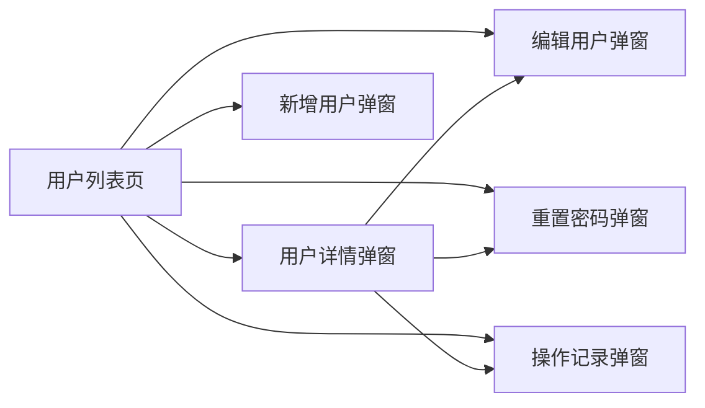
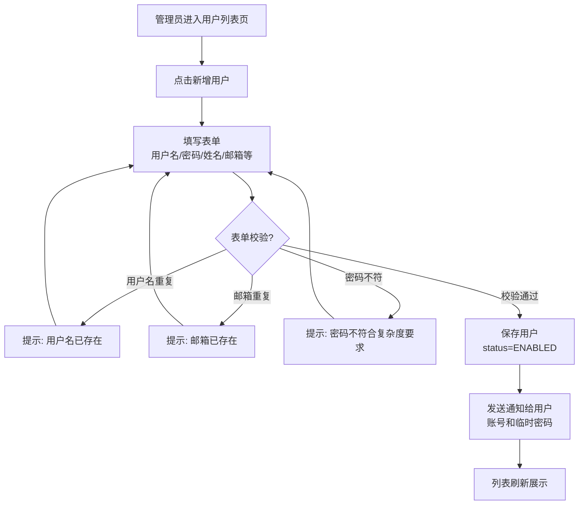
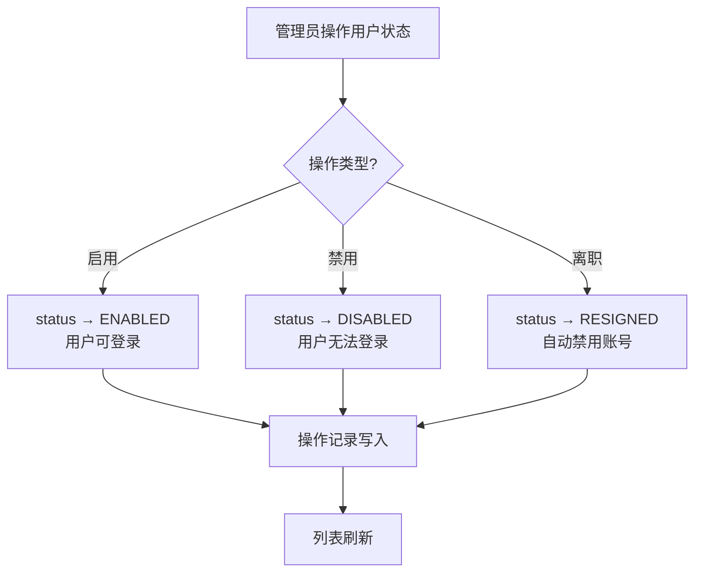
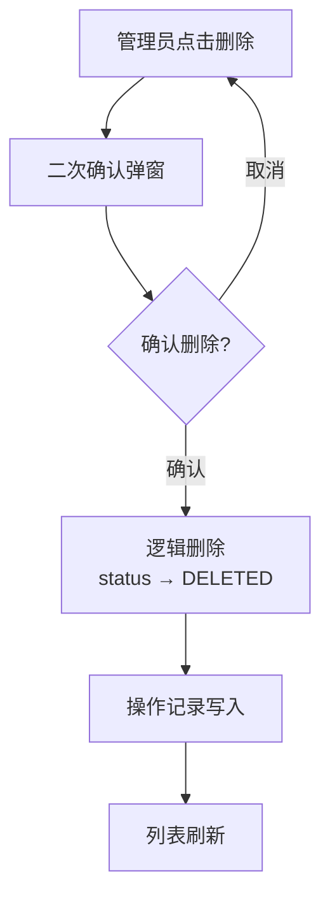
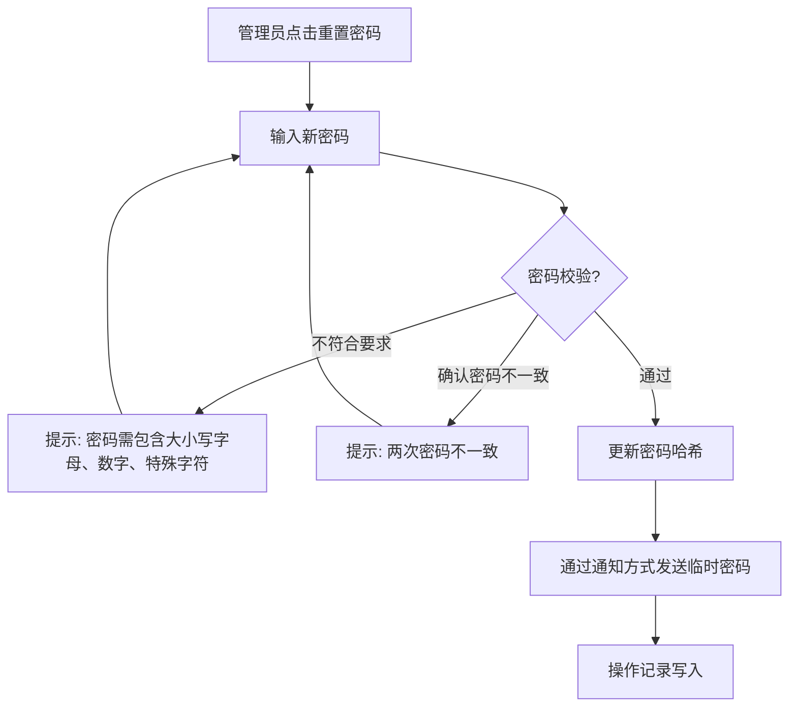
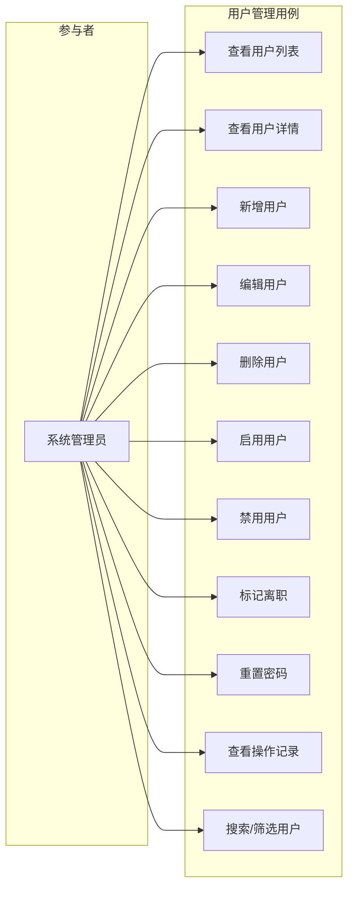

# 用户管理 产品需求文档（PRD）

> **版本**：V1.0
> **日期**：2026-05-02
> **状态**：评审中

---

## 1. 产品/需求背景

GAgentManager 是一个企业级 Agent 管理平台。当前平台已有用户管理的基础代码实现，但缺少独立、完整的产品需求文档来定义用户管理的完整功能范围和交互细节。

**为什么要做：**
- 现有 PRD V5.0 §4.1.2 仅概述了用户管理功能，缺少详细的业务流程、原型图和交互说明
- 需要一个独立的 PRD 文档来定义用户管理的完整功能范围，便于后续技术方案设计和开发
- 企业管理需要对平台用户进行全生命周期管理，确保数据安全和操作合规

**解决什么问题：**
- 用户账号全生命周期管理（新增、启用、禁用、删除、离职、重置密码）
- 用户信息查看与编辑（基本信息、状态、备注）
- 用户操作审计记录查询

**面向用户：**
- **系统管理员**（管理端）：全量用户管理操作（新增/编辑/删除/启用/禁用/离职/重置密码）

> **注意：用户管理仅对管理端开放。普通用户端的个人资料修改（头像、密码、偏好）不属于本 PRD 范围。**

---

## 2. 目标与范围

### 目标
1. 提供用户全生命周期管理（新增、启用、禁用、删除、离职、重置密码）
2. 支持用户列表分页查询、关键词搜索、状态/来源筛选
3. 提供用户详情查看（基本信息、状态、关联角色展示）
4. 提供用户操作记录查询
5. 支持管理员重置用户密码

### 范围

**本次包含（MVP）：**
- 用户新增（用户名、密码、真实姓名、邮箱、手机、部门、备注）
- 用户启用/禁用
- 用户离职（标记离职状态，自动禁用账号）
- 用户删除（逻辑删除，需确认）
- 重置密码（管理员操作，生成临时密码）
- 用户列表（分页、搜索、按状态/来源筛选）
- 用户详情查看（基本信息、关联角色展示）
- 用户编辑（修改基本信息，不含角色分配）
- 用户操作记录查看

**本次不做什么（明确排除）：**
- 用户权限分配（通过 RBAC 权限管理模块处理，用户管理仅展示关联角色）
- 用户端功能（对话、Session 管理、个人资料修改）
- 批量用户导入/导出
- 用户分组管理
- 双因素认证（MFA）管理
- 账号过期时间设置

---

## 3. 系统线框图

### 3.1 管理端用户管理模块结构



### 3.2 系统导航结构

```
管理端主导航
├── 首页
├── Agent 管理
├── 用户管理  ← 本次变更
│   ├── 列表页（新增/编辑/删除/启用/禁用/离职/重置密码/详情/操作记录）
│   └── 操作记录（子弹窗/子页签）
├── 权限管理
├── Skill 管理
├── MCP 管理
├── 模型管理
└── 系统配置
```

**页面说明：**

| 页面 | 职责 | 对应功能 |
|------|------|---------|
| 用户列表页 | 展示所有用户，支持筛选/搜索/分页/批量操作 | 用户列表查询 |
| 用户详情弹窗 | 查看单个用户的完整信息 | 用户详情查看 |
| 新增用户弹窗 | 录入新用户基本信息和初始状态 | 用户新增 |
| 编辑用户弹窗 | 修改已有用户基本信息 | 用户编辑 |
| 重置密码弹窗 | 为用户重置登录密码 | 重置密码 |
| 操作记录弹窗 | 查看指定用户的管理操作历史 | 操作记录查询 |

---

## 4. 业务流程图

### 4.1 用户新增流程



### 4.2 用户启用/禁用/离职流程



### 4.3 用户删除流程



### 4.4 重置密码流程



---

## 5. 用例图

### 5.1 角色定义

| 角色 | 说明 |
|------|------|
| 系统管理员 | 管理端最高权限，可执行全部用户管理操作 |

### 5.2 用例图



---

## 6. 用户与场景

### 6.1 典型用户故事

| # | 角色 | 用户故事 | 优先级 |
|---|------|---------|--------|
| 1 | 系统管理员 | 作为系统管理员，我希望新增一个用户账号并设置初始密码，以便新员工可以登录平台 | P0 |
| 2 | 系统管理员 | 作为系统管理员，我希望查看用户列表并搜索特定用户，以便快速定位目标用户 | P0 |
| 3 | 系统管理员 | 作为系统管理员，我希望启用/禁用用户账号，以便控制用户的平台访问权限 | P0 |
| 4 | 系统管理员 | 作为系统管理员，我希望为忘记密码的用户重置密码，以便帮助用户恢复访问 | P0 |
| 5 | 系统管理员 | 作为系统管理员，我希望编辑用户的基本信息，以便更新用户的联系方式或部门 | P0 |
| 6 | 系统管理员 | 作为系统管理员，我希望查看用户的详细信息和关联角色，以便了解用户的权限配置 | P0 |
| 7 | 系统管理员 | 作为系统管理员，我希望标记用户为离职状态，以便在员工离职时自动禁用其账号 | P0 |
| 8 | 系统管理员 | 作为系统管理员，我希望查看用户的操作记录，以便审计用户的管理历史 | P1 |
| 9 | 系统管理员 | 作为系统管理员，我希望删除不再需要的用户账号，以便清理平台数据 | P1 |

---

## 7. 功能需求

### 7.1 功能需求清单

| 序号 | 功能模块 | 功能点 | 优先级 | 说明 |
|------|---------|--------|--------|------|
| **M1** | **用户新增** | | **P0** | |
| 1.1 | 用户名 | 设置登录用户名 | P0 | 3-30 字符，字母数字下划线，全局唯一 |
| 1.2 | 密码 | 设置初始密码 | P0 | 8-32 字符，需包含大小写字母、数字、特殊字符 |
| 1.3 | 真实姓名 | 填写真实姓名 | P0 | 2-50 字符 |
| 1.4 | 邮箱 | 填写邮箱地址 | P0 | 标准邮箱格式，全局唯一 |
| 1.5 | 手机号 | 填写手机号 | P1 | 11 位数字（中国大陆），格式校验 |
| 1.6 | 部门 | 填写所属部门 | P1 | 文本输入 |
| 1.7 | 备注 | 填写备注信息 | P1 | 最大 500 字符 |
| 1.8 | 来源 | 自动记录用户来源 | P0 | 创建时默认「手动创建」 |
| **M2** | **用户列表** | | **P0** | |
| 2.1 | 列表展示 | 分页用户列表 | P0 | 每页默认 20 条，支持 10/20/50/100 切换 |
| 2.2 | 关键词搜索 | 搜索用户名、真实姓名、邮箱 | P0 | 模糊匹配 |
| 2.3 | 状态筛选 | 按状态筛选 | P0 | 已启用 / 已禁用 / 已离职 |
| 2.4 | 来源筛选 | 按来源筛选 | P1 | 手动创建 / 导入 / SSO / 邀请注册 / API 创建 |
| 2.5 | 操作列 | 启用/禁用/离职/编辑/删除/重置密码 | P0 | 列表行操作按钮 |
| **M3** | **用户详情** | | **P0** | |
| 3.1 | 基本信息 | 展示用户名、真实姓名、昵称、邮箱、手机、部门 | P0 | |
| 3.2 | 状态信息 | 展示状态、来源、创建时间、最后登录时间 | P0 | |
| 3.3 | 关联角色 | 展示用户关联的角色列表 | P0 | 只读展示，来自 RBAC 模块 |
| 3.4 | 备注 | 展示备注信息 | P0 | |
| **M4** | **用户编辑** | | **P0** | |
| 4.1 | 编辑基本信息 | 修改真实姓名、手机号、邮箱、部门、备注 | P0 | 用户名不可修改 |
| 4.2 | 状态修改 | 通过单独的启用/禁用/离职操作修改 | P0 | 不在编辑表单中修改状态 |
| **M5** | **状态管理** | | **P0** | |
| 5.1 | 启用 | 已禁用/已离职 → 已启用 | P0 | 用户可登录 |
| 5.2 | 禁用 | 已启用 → 已禁用 | P0 | 用户无法登录，数据保留 |
| 5.3 | 离职 | 任意状态 → 已离职 | P0 | 自动禁用账号，数据保留 |
| **M6** | **重置密码** | | **P0** | |
| 6.1 | 新密码输入 | 输入新密码 | P0 | 8-32 字符，复杂度校验 |
| 6.2 | 确认密码 | 确认新密码 | P0 | 必须与新密码一致 |
| 6.3 | 通知方式 | 选择通知方式 | P1 | 系统消息 / 邮件 / 短信 |
| **M7** | **操作记录** | | **P1** | |
| 7.1 | 记录列表 | 分页展示操作记录 | P1 | 操作类型、操作人、操作时间、备注 |
| 7.2 | 操作类型 | 展示操作类型 | P1 | 新增 / 启用 / 禁用 / 删除 / 离职 / 重置密码 / 编辑 |
| **M8** | **用户删除** | | **P1** | |
| 8.1 | 逻辑删除 | 标记 status=DELETED | P1 | 不物理删除 |
| 8.2 | 删除确认 | 二次确认弹窗 | P1 | 防止误操作 |

### 7.2 优先级汇总

| 优先级 | 功能模块 | 交付目标 |
|--------|---------|---------|
| **P0 (MVP)** | M1 新增、M2 列表、M3 详情、M4 编辑、M5 状态管理、M6 重置密码 | 管理员可以新增/编辑/启用/禁用用户、重置密码、列表筛选 |
| **P1** | M7 操作记录、M8 删除 | 完整的用户生命周期管理 |

---

## 8. 原型图/界面说明

### 8.1 用户列表页

```
┌─────────────────────────────────────────────────────────────────────────────────────┐
│  用户管理                                                              [+ 新增用户] │
├─────────────────────────────────────────────────────────────────────────────────────┤
│  [🔍 搜索用户名/姓名/邮箱...]    状态: [全部 ▾]    来源: [全部 ▾]    [搜索] [重置]   │
├────────┬────────┬──────────┬────────────┬────────┬────────┬──────────┬──────────────┤
│ 用户名   │ 真实姓名 │ 邮箱       │ 部门         │ 状态     │ 来源     │ 最后登录     │ 操作         │
├────────┼────────┼──────────┼────────────┼────────┼────────┼──────────┼──────────────┤
│ admin  │ 张三    │ zhang@xx │ 技术部       │ 🟢已启用 │ 手动创建 │ 2026-05-01 │ 详情 编辑    │
│        │        │          │            │        │        │ 10:30    │ 重置 禁用 删除 │
├────────┼────────┼──────────┼────────────┼────────┼────────┼──────────┼──────────────┤
│ lisi   │ 李四    │ li@xx    │ 产品部       │ 🔴已禁用 │ SSO    │ 2026-04-28 │ 详情 编辑    │
│        │        │          │            │        │        │ 14:20    │ 重置 启用 删除 │
├────────┼────────┼──────────┼────────────┼────────┼────────┼──────────┼──────────────┤
│ wangwu │ 王五    │ wang@xx  │ 运营部       │ ⚪已离职 │ 手动创建 │ 2026-03-15 │ 详情 编辑    │
│        │        │          │            │        │        │ 09:00    │ 重置 启用 删除 │
├────────┴────────┴──────────┴────────────┴────────┴────────┴──────────┴──────────────┤
│  共 3 条   <  1  >              每页: [20 ▾]                                         │
└─────────────────────────────────────────────────────────────────────────────────────┘
```

**关键元素：**
- 顶部搜索栏 + 状态筛选 + 来源筛选 + 搜索/重置按钮
- 「新增用户」按钮
- 列表展示：用户名、真实姓名、邮箱、部门、状态（彩色标签）、来源、最后登录时间
- 操作列：详情、编辑、重置密码、启用/禁用/启用、删除
- 底部分页控件

**空态：** 无匹配结果时展示「暂无匹配的用户，请调整搜索条件」

---

### 8.2 新增用户弹窗

```
┌────────────────────────────────────────────┐
│  新增用户                           [×]    │
├────────────────────────────────────────────┤
│                                            │
│  用户名 *                                  │
│  [admin__________________________]         │
│  （3-30字符，字母、数字、下划线）            │
│                                            │
│  密码 *                                    │
│  [••••••••••••••••_______________] [👁]    │
│  （8-32字符，需包含大小写字母、数字、特殊字符）│
│                                            │
│  确认密码 *                                │
│  [••••••••••••••••_______________] [👁]    │
│                                            │
│  真实姓名 *                                │
│  [张三___________________________]         │
│                                            │
│  邮箱 *                                    │
│  [zhangsan@example.com___________]         │
│                                            │
│  手机号                                    │
│  [13800138000____________________]         │
│                                            │
│  部门                                      │
│  [技术部_________________________]         │
│                                            │
│  备注                                      │
│  [_________________________________]       │
│  [_________________________________]       │
│  （可选，最大500字符）                0/500  │
│                                            │
│              [取消]      [确认创建]          │
│                                            │
└────────────────────────────────────────────┘
```

**校验规则：**
- 用户名、密码、真实姓名、邮箱为必填
- 用户名 3-30 字符，仅允许字母、数字、下划线，全局唯一
- 密码 8-32 字符，需包含大写字母、小写字母、数字、特殊字符
- 确认密码必须与密码一致
- 邮箱格式校验，全局唯一
- 手机号 11 位数字，格式校验

---

### 8.3 编辑用户弹窗

```
┌────────────────────────────────────────────┐
│  编辑用户                           [×]    │
├────────────────────────────────────────────┤
│                                            │
│  用户名：admin（不可修改）                    │
│                                            │
│  真实姓名 *                                │
│  [张三___________________________]         │
│                                            │
│  邮箱 *                                    │
│  [zhangsan@example.com___________]         │
│                                            │
│  手机号                                    │
│  [13800138000____________________]         │
│                                            │
│  部门                                      │
│  [技术部_________________________]         │
│                                            │
│  备注                                      │
│  [该用户为系统管理员_____________]         │
│  [_________________________________]       │
│  （可选，最大500字符）               20/500  │
│                                            │
│              [取消]      [确认修改]          │
│                                            │
└────────────────────────────────────────────┘
```

**说明：**
- 用户名不可修改
- 邮箱全局唯一，修改时需校验不与其他用户重复
- 其他校验规则同新增

---

### 8.4 重置密码弹窗

```
┌────────────────────────────────────────────┐
│  重置密码                           [×]    │
├────────────────────────────────────────────┤
│                                            │
│  用户：admin（张三）                          │
│                                            │
│  新密码 *                                  │
│  [••••••••••••••••_______________] [👁]    │
│  （8-32字符，需包含大小写字母、数字、特殊字符）│
│                                            │
│  确认新密码 *                              │
│  [••••••••••••••••_______________] [👁]    │
│                                            │
│  通知方式（可选）                            │
│  [●] 系统消息  [○] 邮件  [○] 短信           │
│                                            │
│              [取消]      [确认重置]          │
│                                            │
└────────────────────────────────────────────┘
```

**说明：**
- 新密码复杂度校验同新增用户
- 通知方式可选，默认系统消息
- 重置后通过选定方式通知用户新密码

---

### 8.5 用户详情弹窗

```
┌──────────────────────────────────────────────────┐
│  用户详情                                 [×]    │
├──────────────────────────────────────────────────┤
│                                                  │
│  ┌─ 基本信息 ────────────────────────────────┐   │
│  │  用户名:     admin                         │   │
│  │  真实姓名:   张三                          │   │
│  │  昵称:       小三                          │   │
│  │  邮箱:       zhangsan@example.com          │   │
│  │  手机号:     13800138000                   │   │
│  │  部门:       技术部                        │   │
│  └───────────────────────────────────────────┘   │
│                                                  │
│  ┌─ 状态信息 ────────────────────────────────┐   │
│  │  状态:       🟢 已启用                     │   │
│  │  来源:       手动创建                      │   │
│  │  创建人:     system                        │   │
│  │  创建时间:   2026-05-01 10:00:00           │   │
│  │  最后登录:   2026-05-01 10:30:00           │   │
│  │  登录失败:   0 次                          │   │
│  └───────────────────────────────────────────┘   │
│                                                  │
│  ┌─ 关联角色 ────────────────────────────────┐   │
│  │  系统管理员                                │   │
│  │  Agent 管理员                              │   │
│  │  （只读，通过权限管理模块配置）              │   │
│  └───────────────────────────────────────────┘   │
│                                                  │
│  ┌─ 备注 ────────────────────────────────────┐   │
│  │  该用户为系统管理员                         │   │
│  └───────────────────────────────────────────┘   │
│                                                  │
│          [编辑]    [重置密码]    [操作记录]       │
│                                                  │
└──────────────────────────────────────────────────┘
```

**关键说明：**
- 关联角色只读展示，不可在用户管理模块中修改
- 密码不展示
- 操作记录按钮打开子弹窗展示该用户的管理操作历史

---

### 8.6 操作记录弹窗

```
┌──────────────────────────────────────────────────────────┐
│  操作记录 - admin                                 [×]    │
├──────────────────────────────────────────────────────────┤
│                                                          │
│  操作类型    操作人    操作时间            备注           │
│  ─────────────────────────────────────────────────────── │
│  新增用户    system   2026-05-01 10:00   初始创建         │
│  启用用户    admin    2026-05-01 10:05   恢复账号         │
│  重置密码    admin    2026-05-01 14:20   用户忘记密码     │
│                                                          │
│  共 3 条   <  1  >                                        │
│                                                          │
└──────────────────────────────────────────────────────────┘
```

---

### 8.7 关键状态说明

| 状态 | 展示 | 说明 |
|------|------|------|
| 已启用 | 绿色标签「已启用」 | 用户可正常登录 |
| 已禁用 | 红色标签「已禁用」 | 用户无法登录，数据保留 |
| 已离职 | 灰色标签「已离职」 | 自动禁用，数据保留 |
| 已删除 | 列表不展示 | 逻辑删除，数据保留但不可恢复 |
| 空态（列表无结果） | 居中图标 + 「暂无匹配的用户，请调整搜索条件」 | 搜索/筛选结果为空 |
| 加载中 | 列表位置展示 loading 骨架屏 | 数据请求中 |
| 错误态 | Toast 提示错误原因 + 重试按钮 | 接口返回失败 |

---

## 9. 非功能需求

### 9.1 性能
- 用户列表查询响应时间 < 1 秒（P95）
- 用户详情加载时间 < 500ms（P95）

### 9.2 安全
- 密码必须加密存储（BCrypt 或等同算法）
- 查询/详情接口不返回密码哈希
- 密码输入框默认 password 类型（掩码显示）
- 连续登录失败 5 次自动锁定账号

### 9.3 数据一致性
- 用户名全局唯一（数据库唯一索引约束）
- 邮箱全局唯一（数据库唯一索引约束）
- 用户名一旦创建不可修改
- 删除为逻辑删除（标记 status=DELETED），不物理删除

### 9.4 兼容性
- 浏览器兼容：Chrome 90+, Firefox 88+, Safari 14+
- 前端框架：React 18 + Ant Design
- 屏幕分辨率：支持 1366x768 及以上

### 9.5 错误提示
- 所有操作失败时需返回明确的中文错误提示
- 前端错误码映射：
  - `1501` → 「用户名已存在」
  - `1502` → 「邮箱已存在」
  - `1503` → 「密码不符合复杂度要求」
  - `1504` → 「用户不存在」
  - `1505` → 「账号已禁用，无法登录」

---

## 10. 与现有功能的关系

### 10.1 现有代码

用户管理模块已有完整的六层代码实现：
- **domain**：User 聚合根（含 save/delete/activate/deactivate/resign/resetPassword 等领域动作）、UserRepository 接口
- **application**：UserCommandService、UserQueryService、UserProfileService
- **adapter**：UserCommandController、UserQueryController
- **client**：UserVO、CreateUserParam、UpdateUserParam、PasswordChangeParam 等
- **facade**：UserCreatedEvent、UserStatusChangedEvent、UserEventConstants
- **infra**：UserEntity、UserMapper、UserRepositoryImpl

### 10.2 与现有模块的关联

| 关联模块 | 关联点 | 说明 |
|---------|--------|------|
| RBAC 权限管理 | 关联角色展示 | 用户详情页展示用户关联的角色列表，只读，角色分配在 RBAC 模块中处理 |
| 认证模块 | 用户登录 | 用户状态为 ENABLED 时可登录，DISABLED/RESIGNED/DELETED 不可登录 |
| 审计日志 | 领域事件 | 用户创建/状态变更/删除/重置密码操作需发送领域事件，供审计日志消费 |
| Chat 模块 | 用户端功能 | ChatSession/ChatMessage 属于用户端对话功能，不在管理端用户管理范围内 |

### 10.3 数据迁移

现有 user 表已存在，无需数据迁移。本次需确认表字段是否覆盖 PRD 全部字段。

---

## 11. 验收标准

### 11.1 功能验收

| # | 验收条款 | 验收方法 |
|---|---------|---------|
| 1 | 管理员可以新增用户（填写用户名、密码、姓名、邮箱等） | 提交表单，数据正确入库 |
| 2 | 用户名全局唯一，重复时提示错误 | 尝试创建已存在的用户名，提示「用户名已存在」 |
| 3 | 邮箱全局唯一，重复时提示错误 | 尝试创建已存在的邮箱，提示「邮箱已存在」 |
| 4 | 密码符合复杂度要求（大小写字母+数字+特殊字符） | 输入简单密码，提示不符合要求 |
| 5 | 管理员可以启用/禁用用户 | 操作后状态正确更新，禁用后用户无法登录 |
| 6 | 管理员可以标记用户离职 | 操作后状态变为已离职，账号自动禁用 |
| 7 | 管理员可以重置用户密码 | 重置后新密码生效，旧密码失效 |
| 8 | 支持按用户名/姓名/邮箱搜索 | 搜索后结果正确过滤 |
| 9 | 支持按状态/来源筛选 | 选择筛选条件，结果正确过滤 |
| 10 | 用户详情页展示关联角色（只读） | 角色列表正确展示，不可修改 |
| 11 | 删除为逻辑删除，不物理删除 | 删除后数据仍在数据库中，status=DELETED |
| 12 | 操作记录正确展示所有管理操作历史 | 包含操作类型、操作人、操作时间、备注 |

### 11.2 性能验收

- 用户列表查询 P95 响应时间 < 1 秒
- 用户详情加载 P95 响应时间 < 500ms

### 11.3 安全验收

- 密码加密存储，不可明文或可逆加密
- 查询/详情接口不返回密码哈希
- 密码输入框默认掩码显示
- 非管理员用户无法访问用户管理页面
- 所有管理操作记录操作人和时间

---

**文档版本：** V1.0
**创建日期：** 2026年05月02日
**作者：** GAgentManager 产品团队
**关联总 PRD：** `docs/prd/PRD-GAgentManager-V5.0.md` §4.1.2
**审核人：** 产品负责人、技术负责人、业务负责人
