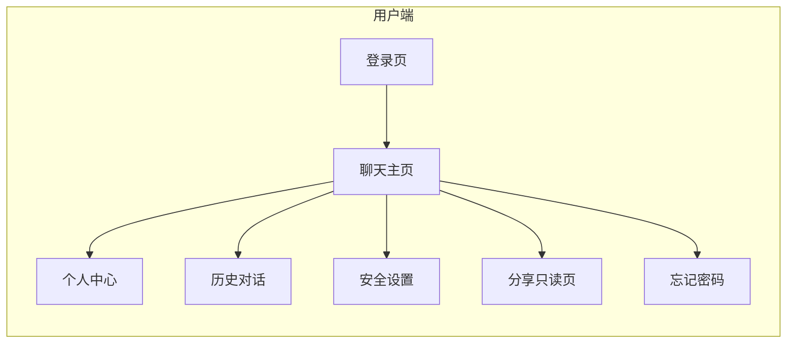
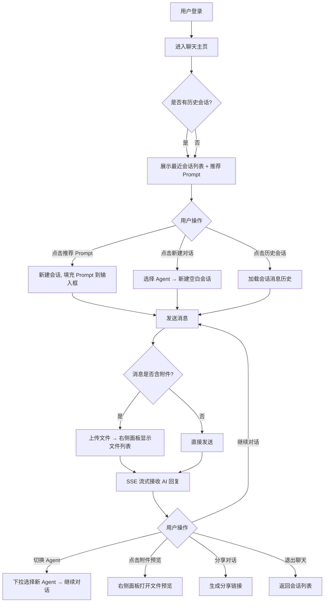
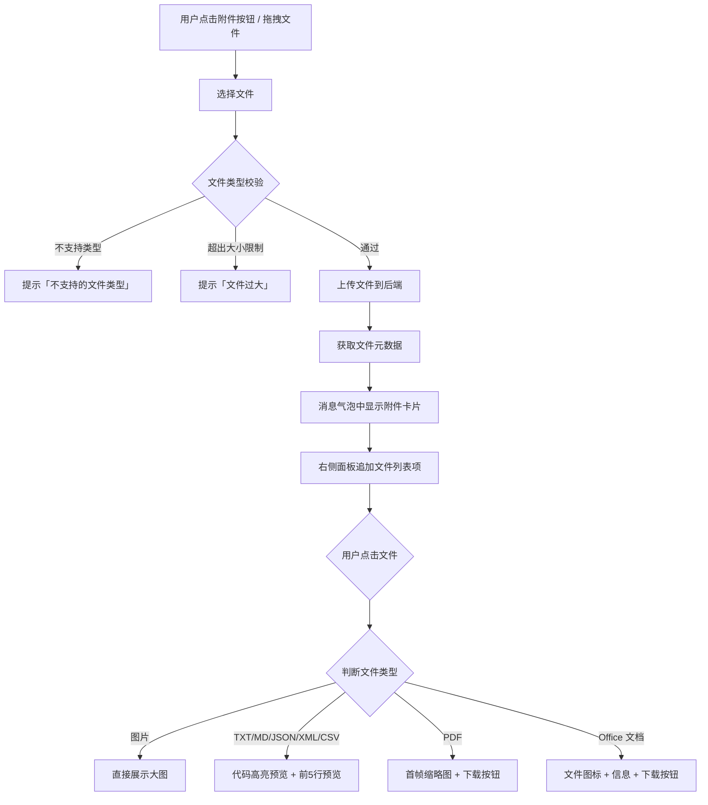
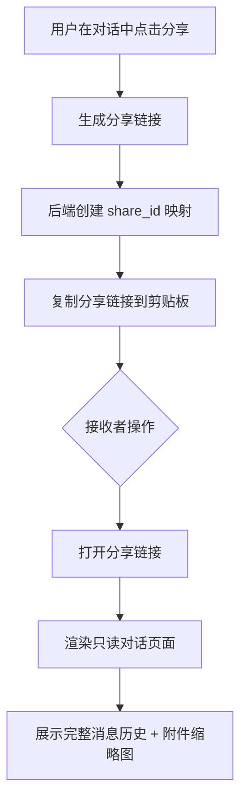
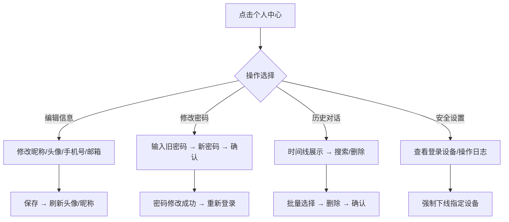
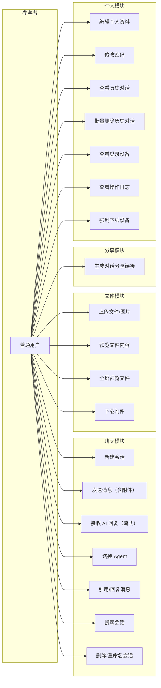

# GAgentManager 用户端重构 PRD

## 1. 产品/需求背景

当前用户端仅有 4 个页面（登录、聊天、个人资料、忘记密码），聊天功能基础，缺少文件传输、Agent 选择、对话管理等核心体验。本次重构在保持纯聊天产品形态的前提下，全面增强用户端功能，提供文件上传、Agent 实时切换、对话引用回复、分享导出、智能推荐 Prompt、富媒体渲染等能力。

## 2. 目标与范围

- **目标**：
  1. 提供完整的 Agent 聊天体验，支持文件/图片上传、实时 Agent 切换、对话引用回复
  2. 丰富消息展示形式，支持 Markdown 渲染、代码高亮、表格预览、附件面板
  3. 提供对话分享能力，支持生成只读链接
  4. 完善个人中心：基础信息编辑、历史对话管理、安全设置
- **范围**：用户端前端重构 + 后端配套接口（文件上传、Agent 列表、对话分享、附件管理）
- **不做什么**：不涉及管理端功能、不涉及多 Agent 并发对话、不涉及付费/计费功能

## 3. 系统线框图

用户端整体导航结构：



聊天主页三栏布局（顶部导航栏 + 左中右三栏 + 底部输入栏）：

```
┌─────────────────────────────────────────────────────────────────────────┐
│  顶部导航栏                                                              │
│  [Logo] GAgentManager          [Agent 选择器 ▼]    [👤 用户昵称 ▼]      │
├──────────┬────────────────────────────────────────────┬──────────────────┤
│ 左侧栏    │  中间聊天区                                │  右侧文件面板      │
│ 280px    │  自适应宽度                                 │  320px  [⛶]     │
│          │                                            │                  │
│ [新对话]  │  [Agent头像] 你好！                         │ ┌──────────────┐│
│ [搜索]    │  [用户头像] 帮我分析这份数据                 │ │ 📎 文件列表   ││
│ ──────── │                                            │ ├──────────────┤│
│ [会话1]   │  [Agent头像] 收到，我来分析一下              │ │ 📄 data.csv   ││
│ [会话2]   │  ┌──────────────────────────────┐         │ │ 📷 screenshot ││
│ [会话3]   │  │ 📎 附件: data.csv  [预览]      │         │ │ 📊 report.xlsx││
│ ...       │  └──────────────────────────────┘         │ └──────────────┘│
│          │                                            │                  │
│ ──────── │  [Agent头像] 分析结果如下：                  │ ┌──────────────┐│
│ [个人中心] │  根据数据，用户活跃度...                    │ │ 📄 data.csv   ││
│ [历史记录] │  ┌──────────────────────────────┐         │ │ name│age│city ││
│ [安全设置] │  │ [引用] 帮我分析这份数据        │         │ │ 张三│ 28│ 北京││
│ [退出登录] │  └──────────────────────────────┘         │ │ 李四│ 32│ 上海││
│          │                                            │ └──────────────┘│
│          │                                            │ [下载] [复制]    │
├──────────┴────────────────────────────────────────────┴──────────────────┤
│  底部输入栏                                                              │
│  [📎]  输入消息... (Shift+Enter 换行)                       [发送]        │
└─────────────────────────────────────────────────────────────────────────┘
```

右侧面板全屏模式：

```
┌─────────────────────────────────────────────────────────────────┐
│  全屏文件预览                                    [下载] [⛶收起] │
├─────────────────────────────┬───────────────────────────────────┤
│  📎 文件列表（左侧竖排）       │  文件预览区（主区域）               │
│  ● 📄 data.csv  ← 当前选中   │  ┌─────────────────────────────┐│
│    📷 screenshot.png        │  │  name │ age │ city           ││
│    📊 report.xlsx           │  │  张三 │ 28  │ 北京           ││
│                             │  │  李四 │ 32  │ 上海           ││
│                             │  └─────────────────────────────┘│
│                             │  文件信息：24.5 KB · 5行          │
└─────────────────────────────┴───────────────────────────────────┘
```

## 4. 业务流程图

### 4.1 聊天主流程



### 4.2 文件上传与预览流程



### 4.3 对话分享流程



### 4.4 个人中心/安全设置流程



## 5. 用例图



## 6. 用户与场景

- **场景 1 — 日常对话**：作为用户，我选择或新建会话，输入问题并发送，实时接收 AI 的流式回复
- **场景 2 — 文件分析**：作为用户，我上传一份 CSV 文件，AI 自动解析内容并给出分析报告，我可在右侧面板预览文件原文
- **场景 3 — Agent 切换**：作为用户，我希望在对话中切换到不同的 Agent（如从通用对话切换到代码专家），无需新建会话
- **场景 4 — 追问引用**：作为用户，我希望对历史某条消息进行引用回复，方便 AI 理解上下文
- **场景 5 — 分享对话**：作为用户，我想把一次有价值的对话分享给同事，生成只读链接发给对方
- **场景 6 — 推荐 Prompt**：作为新用户，我不知道该问什么，希望首页有推荐的 Prompt 卡片快速开始
- **场景 7 — 个人管理**：作为用户，我想查看历史对话记录、修改个人信息、检查登录安全
- **场景 8 — 全屏预览**：作为用户，上传了多份文件，希望全屏查看对比不同文件的内容

## 7. 功能需求

### 7.1 聊天核心（P0）

| 序号 | 功能点 | 说明 | 优先级 |
|------|--------|------|--------|
| 1 | 新建会话 | 支持新建空白会话，默认使用「自动」Agent（服务端路由） | P0 |
| 2 | 发送消息 | 支持文本输入，Shift+Enter 换行，支持流式接收回复 | P0 |
| 3 | 会话列表 | 左侧展示所有会话，支持搜索、重命名、删除 | P0 |
| 4 | Agent 选择器 | 顶部导航栏中央下拉选择，支持「自动」模式和手动选择具体 Agent | P0 |
| 5 | Markdown 渲染 | 消息气泡内渲染 Markdown，支持代码高亮、表格 | P0 |
| 6 | 智能推荐 Prompt | 首页 Welcome 区展示 6 个场景化 Prompt 卡片 | P0 |

### 7.2 文件与附件（P0+P1）

| 序号 | 功能点 | 说明 | 优先级 |
|------|--------|------|--------|
| 7 | 文件上传 | 支持图片、TXT、MD、CSV、JSON、XML、PDF、DOCX、XLSX、PPTX，单文件最大 20MB | P0 |
| 8 | 拖拽上传 | 拖拽文件到输入框或聊天区域触发上传 | P0 |
| 9 | 右侧文件面板 | 上下分区：上方文件列表、下方文件预览 | P0 |
| 10 | 文件预览 — 图片 | 内联缩略图 + 点击放大 | P0 |
| 11 | 文件预览 — 文本 | TXT/MD/JSON/XML 代码高亮 + 前 5 行预览 | P0 |
| 12 | 文件预览 — 表格 | CSV/XLSX 表格渲染 | P1 |
| 13 | 文件预览 — PDF | 首帧缩略图 + 下载按钮 | P1 |
| 14 | 文件预览 — Office | 文件图标 + 基本信息 + 下载 | P1 |
| 15 | 全屏预览 | 右侧面板全屏展开，左列文件列表 + 主区域大面积预览，Esc 退出 | P0 |
| 16 | 文件下载 | 从面板下载原文件 | P0 |

### 7.3 对话增强（P0+P1）

| 序号 | 功能点 | 说明 | 优先级 |
|------|--------|------|--------|
| 17 | 引用/回复消息 | 悬停消息显示「引用」按钮，引用后发送新消息 | P0 |
| 18 | 对话分享 | 生成只读分享链接，复制后可直接访问 | P0 |
| 19 | 对话导出 | 导出当前对话为 Markdown 文件下载 | P1 |
| 20 | 思考链展示 | 保留现有的 ThoughtChain 组件展示 AI 思考过程 | P0 |
| 21 | Agent 切换中实时切换 | 切换后新消息使用新 Agent，历史消息不受影响 | P0 |

### 7.4 个人中心（P0+P1）

| 序号 | 功能点 | 说明 | 优先级 |
|------|--------|------|--------|
| 22 | 编辑个人资料 | 昵称、头像上传、手机号、邮箱编辑 | P0 |
| 23 | 修改密码 | 输入旧密码 + 新密码 + 确认 | P0 |
| 24 | 历史对话管理 | 时间线展示所有历史会话，支持搜索、批量删除 | P0 |
| 25 | 登录设备管理 | 查看当前登录设备列表，支持强制下线 | P1 |
| 26 | 操作日志 | 查看个人操作记录（登录、修改信息等） | P1 |

## 8. 原型图/界面说明

### 8.1 聊天主页

```
┌─────────────────────────────────────────────────────────────────────────┐
│  GAgentManager          [🤖 自动 ▼]    [👤 张三 ▾]                     │
│                          ├─ 自动(推荐)                                   │
│                          ├─ 💻 代码专家                                  │
│                          ├─ 📊 数据分析                                  │
│                          ├─ 📝 文档助手                                  │
│                          └─ 🎨 创意设计                                  │
├──────────┬────────────────────────────────────────────┬──────────────────┤
│ [新对话]  │  欢迎使用 GAgentManager                    │ ┌──────────────┐│
│ [搜索...] │                                            │ │ 📎 文件列表   ││
│          │  [💬 写代码] [📊 数据分析] [📝 写文档]       │ ├──────────────┤│
│ ● 会话1   │  [🔍 Bug 排查] [🌐 翻译] [💡 头脑风暴]     │ │ 📄 data.csv ✓ ││
│   会话2   │                                            │ │ 📷 photo.png  ││
│   会话3   │                                            │ └──────────────┘│
│          │                                            │ ┌──────────────┐│
│ ──────── │                                            │ │ CSV 预览      ││
│ [个人中心] │  ── 以下为对话内容 ──                      │ │ name│age│city ││
│ [历史记录] │  [🤖 代码专家] 你好！我能帮你什么？         │ │ 张三│ 28│ 北京││
│ [安全设置] │  [👤 张三] 帮我分析这份数据                 │ │ 李四│ 32│ 上海││
│ [退出登录] │  📎 data.csv  [预览]                       │ │ 王五│ 25│ 广州││
│          │  [🤖 代码专家] 分析结果如下...               │ └──────────────┘│
│          │  [引用] 帮我分析这份数据                     │ [⬇ 下载]        │
│          │  [🤖 代码专家] 继续回复...                   │ [⛶ 全屏]       │
├──────────┴────────────────────────────────────────────┴──────────────────┤
│ [📎]  输入消息...                          [🎤]  [发送]                   │
└─────────────────────────────────────────────────────────────────────────┘
```

### 8.2 关键状态

**空态（无会话）：**
```
┌──────────────────────────────────────┐
│  欢迎使用 GAgentManager               │
│  🤖 选择一个 Agent 或保持「自动」模式   │
│                                      │
│  快速开始：                           │
│  [💬 写代码] [📊 数据分析] [📝 写文档] │
│  [🔍 Bug 排查] [🌐 翻译] [💡 头脑风暴] │
└──────────────────────────────────────┘
```

**加载中（消息流式接收中）：**
- AI 回复气泡底部显示光标闪烁动画
- 思考链组件显示「正在思考...」
- 输入框禁用状态，发送按钮变为 Loading 图标

**错误态：**
- 消息气泡显示红色边框 + 错误提示「发送失败，点击重试」
- 点击后重新发送该消息

**分享只读页：**
```
┌──────────────────────────────────────┐
│  GAgentManager  ·  对话分享           │
│  Agent: 代码专家  ·  2026-05-05      │
├──────────────────────────────────────┤
│  [用户] 帮我写一个快速排序算法        │
│  [代码专家] 以下是实现：              │
│  ```python                           │
│  def quick_sort(arr): ...            │
│  ```                                 │
│  [用户] 时间复杂度是多少？            │
│  [代码专家] 平均 O(n log n)          │
├──────────────────────────────────────┤
│  GAgentManager · 此页面为只读分享链接  │
└──────────────────────────────────────┘
```

## 9. 非功能需求

- **性能**：首屏加载 ≤ 2 秒，SSE 消息延迟 ≤ 1 秒可见首字，文件上传进度实时展示
- **文件大小**：单文件最大 20MB，超过限制在上传前拦截并提示
- **兼容性**：Chrome/Edge/Safari 最新两个大版本；移动端基础可用（聊天区可正常阅读）
- **安全**：文件上传需校验 MIME 类型 + 扩展名双重验证；分享链接带过期时间（7 天）
- **可访问性**：键盘导航支持 Tab 切换各区域；图片附件支持 alt 文本

## 10. 与现有功能的关系

- **改造现有聊天页**：当前 Chat 页面为单栏布局，重构为三栏布局（左侧会话 + 中间聊天 + 右侧文件）
- **保留现有组件**：Bubble.List、Conversations、ThoughtChain、Sender、Welcome 等 Ant Design X 组件保留，重新布局
- **保留现有 API**：会话 CRUD、消息 SSE 等现有接口保留，新增文件上传、Agent 列表、对话分享接口
- **个人中心扩展**：现有 Profile 页面为基础表单，重构后分拆为个人中心/历史对话/安全设置三个页面

## 11. 验收标准

- [ ] 顶部导航栏保留 Logo、Agent 选择器、用户下拉菜单
- [ ] 左侧会话列表支持新建、搜索、重命名、删除
- [ ] Agent 选择器支持「自动」模式和手动切换指定 Agent
- [ ] 发送消息支持 Markdown 渲染、代码高亮、思考链展示
- [ ] 文件上传支持图片 + 文本 + PDF + Office 文档，单文件 ≤ 20MB
- [ ] 拖拽文件到聊天区域可触发上传
- [ ] 右侧文件面板上下分区：文件列表 + 文件预览
- [ ] 文件预览支持：图片大图、文本代码高亮、表格渲染、PDF 首帧、Office 信息+下载
- [ ] 右侧面板支持全屏展开，Esc 退出
- [ ] 消息支持引用/回复功能
- [ ] 对话可生成只读分享链接，链接有效期 7 天
- [ ] 首页展示 6 个智能推荐 Prompt 卡片
- [ ] 个人中心支持编辑昵称、头像、手机号、邮箱
- [ ] 历史对话页支持时间线展示、搜索、批量删除
- [ ] 安全设置页支持查看登录设备、操作日志、修改密码
