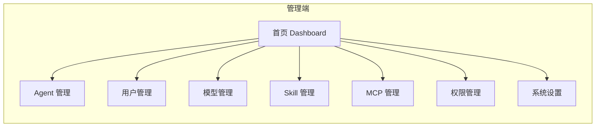
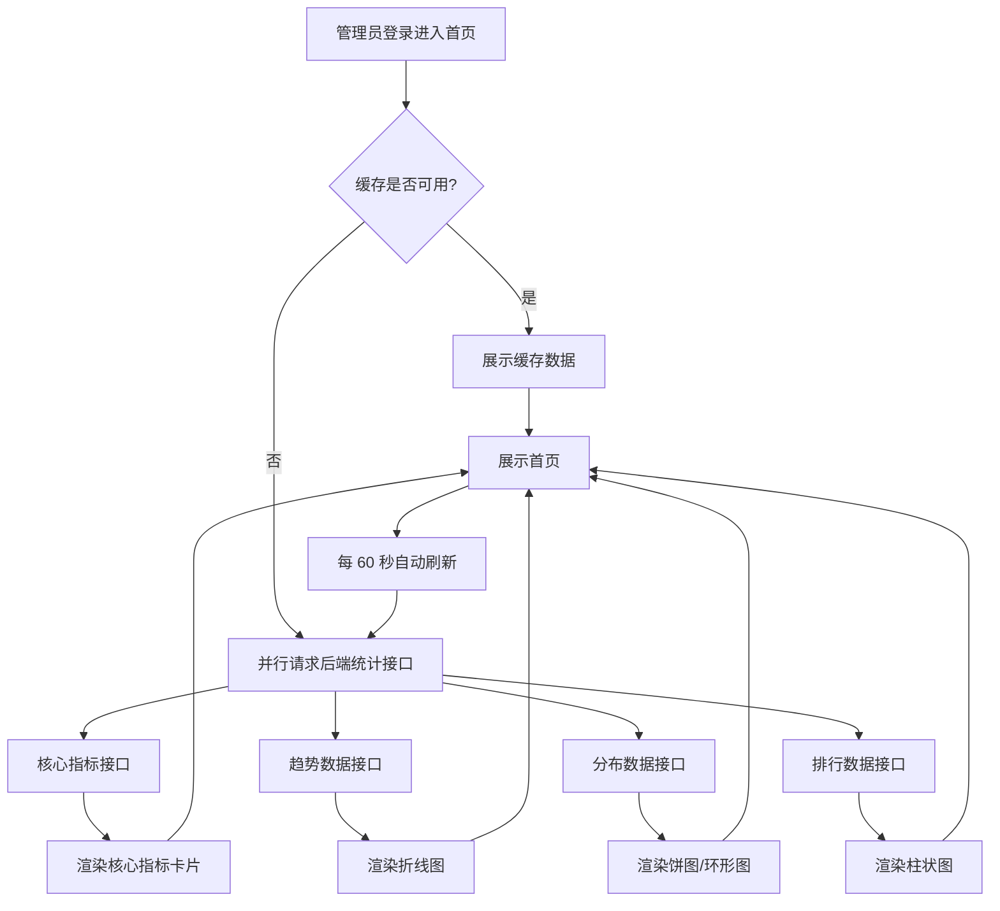
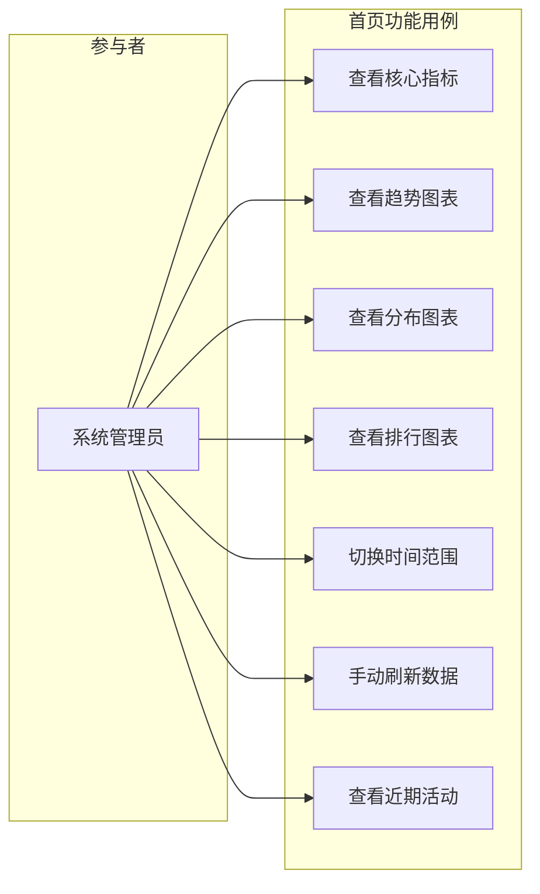

# 管理端首页数据可视化重构 PRD

## 1. 产品/需求背景

当前管理端首页仅展示 4 个统计数字卡片（Agent 总数、在线数、活跃用户、模型总数）和公告栏，信息密度低、缺乏趋势分析和多维度统计，管理员无法从首页直观掌握平台运行态势。本次重构将首页升级为数据可视化仪表盘，通过饼图、折线图、柱状图、仪表盘等多种图表形式，全面展示平台运行数据。

## 2. 目标与范围

- **目标**：
  1. 提供丰富的数据可视化图表，让管理员一目了然地掌握平台运行状态
  2. 支持多维度统计分析（趋势、分布、占比、排行等）
  3. 首页加载性能可控，核心指标 3 秒内可见
- **范围**：仅改造管理端首页（Dashboard 页面）及配套后端统计接口；管理端其他管理页面（Agent 列表、用户管理等）不在本次范围
- **不做什么**：不涉及数据导出、自定义看板、图表交互钻取（下钻到明细页暂不做）

## 3. 系统线框图

管理端整体导航结构不变，首页为 Dashboard，其他为各资源管理页面：



Dashboard 页面内部布局（三栏信息架构）：

```
┌─────────────────────────────────────────────────────────┐
│  核心指标卡片区（4-6 个关键指标，一行排列）                │
│  ┌─────┐ ┌─────┐ ┌─────┐ ┌─────┐ ┌─────┐ ┌─────┐      │
│  │Agent│ │在线 │ │活跃 │ │模型 │ │Skill│ │ MCP │      │
│  │总数 │ │Agent│ │用户 │ │总数 │ │ 数量│ │数量 │      │
│  └─────┘ └─────┘ └─────┘ └─────┘ └─────┘ └─────┘      │
├──────────────────────────┬──────────────────────────────┤
│  趋势区（折线图，占 2/3 宽） │  分布区（饼图/环形图，占 1/3 宽）│
│  Agent 数量变化趋势         │  Agent 状态分布               │
│  近 7 天/30 天              │  在线/离线/异常 占比           │
│  用户活跃趋势               │  模型使用占比                  │
│                            │  Skill 分类占比               │
├──────────────────────────┴──────────────────────────────┤
│  对比/排行区（柱状图 + 表格，左右分栏）                     │
│  ┌─────────────────┐  ┌─────────────────┐               │
│  │ 模型调用量排行    │  │ Skill 使用排行    │               │
│  │ (横向柱状图)      │  │ (横向柱状图)      │               │
│  └─────────────────┘  └─────────────────┘               │
├──────────────────────────┬──────────────────────────────┤
│  MCP 调用统计（柱状图）     │  近期活动/公告（列表）          │
└──────────────────────────┴──────────────────────────────┘
```

**说明**：页面从上到下分为四个区块——核心指标卡片区、趋势与分布区、对比排行区、MCP 统计与活动区。每个区块对应一个后端统计接口，前端并行加载。

## 4. 业务流程图

首页数据加载流程：



**说明**：管理员进入首页后，若有缓存数据则立即展示并后台刷新，否则并行请求各统计接口。页面支持定时自动刷新和手动刷新。

## 5. 用例图



**说明**：管理员（已登录系统）可使用首页全部功能。各用例对应的功能点与优先级见第 7 节。

## 6. 用户与场景

- **场景 1 — 平台概览**：作为管理员，我希望登录后第一眼看到 Agent 总数、在线率、活跃用户数等核心指标，以便快速了解平台整体状况
- **场景 2 — 趋势分析**：作为管理员，我希望通过折线图看到近 7 天/30 天 Agent 数量变化和用户活跃趋势，以便发现增长或异常
- **场景 3 — 分布洞察**：作为管理员，我希望通过饼图看到 Agent 状态分布、模型使用占比，以便判断资源分配是否合理
- **场景 4 — 排行对比**：作为管理员，我希望通过柱状图看到模型调用量和 Skill 使用排行，以便识别热门和冷门资源
- **场景 5 — 动态关注**：作为管理员，我希望在首页看到近期操作活动和系统公告，以便及时处理重要事项

## 7. 功能需求

| 序号 | 模块 | 功能点 | 优先级 |
|------|------|--------|--------|
| 1 | 核心指标 | 展示 Agent 总数、在线 Agent、活跃用户、模型总数、Skill 数量、MCP 数量共 6 个指标卡片 | P0 |
| 2 | 核心指标 | 指标卡片支持同比/环比增长率展示（如较昨日 +12%） | P1 |
| 3 | 趋势图表 | Agent 数量变化趋势折线图，支持近 7 天/30 天切换 | P0 |
| 4 | 趋势图表 | 用户活跃趋势折线图，展示每日活跃用户数 | P0 |
| 5 | 分布图表 | Agent 状态分布饼图（在线/离线/异常） | P0 |
| 6 | 分布图表 | 模型使用占比环形图 | P1 |
| 7 | 分布图表 | Skill 分类占比饼图 | P2 |
| 8 | 排行图表 | 模型调用量排行横向柱状图 | P1 |
| 9 | 排行图表 | Skill 使用量排行横向柱状图 | P2 |
| 10 | MCP 统计 | MCP 调用统计柱状图 | P1 |
| 11 | 活动/公告 | 近期操作活动列表 + 系统公告列表 | P1 |
| 12 | 交互 | 时间范围选择器（7 天/30 天），切换后图表联动刷新 | P0 |
| 13 | 交互 | 手动刷新按钮 | P1 |
| 14 | 交互 | 自动刷新（60 秒间隔） | P2 |

## 8. 原型图/界面说明

### 8.1 核心指标卡片区

```
┌────────────┐ ┌────────────┐ ┌────────────┐ ┌────────────┐ ┌────────────┐ ┌────────────┐
│  Agent总数  │ │  在线Agent  │ │  活跃用户   │ │  模型总数   │ │  Skill数量  │ │  MCP数量   │
│            │ │            │ │            │ │            │ │            │ │            │
│    128     │ │     96     │ │    1,245   │ │     24     │ │     58     │ │     12     │
│  ↑ +8.5%   │ │  ↑ +3.2%   │ │  ↓ -2.1%   │ │  ↑ +4.0%   │ │  ↑ +16.0%  │ │  持平      │
│   vs 昨日   │ │   vs 昨日   │ │   vs 昨日   │ │   vs 昨日   │ │   vs 昨日   │ │   vs 昨日   │
└────────────┘ └────────────┘ └────────────┘ └────────────┘ └────────────┘ └────────────┘
```

- **正常态**：卡片显示指标数值、名称、图标和增长率箭头
- **空态**：数值为 0，卡片显示灰色提示
- **加载中**：卡片区域显示骨架屏（Skeleton）

### 8.2 趋势与分布区

```
┌─────────────────────────────────────┬──────────────────────────┐
│  Agent 数量趋势          [7天|30天]  │  Agent 状态分布           │
│                                     │                          │
│    ┌─ 折线图 ──────┐                │    ┌─ 饼图 ───┐           │
│   / \              │                │    │ 在线 75%  │           │
│  /   \    ── 新增  │                │    │ 离线 20%  │           │
│ ───────\   ── 删除  │                │    │ 异常 5%   │           │
│         \           │                │    └──────────┘           │
│                     │                │                          │
├─────────────────────────────────────┤  模型使用占比              │
│  用户活跃趋势                        │                          │
│                                     │    ┌─ 环形图 ─┐           │
│    ┌─ 折线图 ──────┐                │    │  中心:24  │           │
│   / \    ── DAU    │                │    │  GPT-4 40%│           │
│  /   \   ── MAU    │                │    │  Claude 35%│           │
│ ───────             │                │    │  其他 25%  │           │
│                     │                │    └──────────┘           │
└─────────────────────────────────────┴──────────────────────────┘
```

- **时间切换**：右上角 [7天|30天] 按钮切换后，左右两侧图表同时刷新
- **图例**：折线图右侧显示图例，可点击切换曲线显隐
- **空态**：无数据时显示「暂无数据」提示和空图标

### 8.3 对比排行区

```
┌──────────────────────────────┬──────────────────────────────┐
│  模型调用量 TOP 8             │  Skill 使用量 TOP 8          │
│                              │                              │
│ GPT-4        ██████████  1245│  code-review  ██████████  856 │
│ Claude-Sonet ████████    987 │  data-analys  ████████    723 │
│ Qwen-Max     ██████      654 │  doc-summary  ██████      612 │
│ DeepSeek     ████        432 │  api-gen      ████        445 │
│ Gemini       ███         321 │  text-rewrite ███         334 │
│ Baichuan     ██          210 │  img-gen      ██          223 │
│                              │                              │
└──────────────────────────────┴──────────────────────────────┘
```

- **排序**：按调用量从高到低排列
- **数据标签**：柱状条末端显示具体数值
- **颜色**：前 3 名用主题色，其余用灰色

### 8.4 MCP 统计与活动区

```
┌──────────────────────────────┬──────────────────────────────┐
│  MCP 调用统计（近 7 天）       │  近期活动 & 系统公告           │
│                              │                              │
│  Mon  ██                     │  [10:32] 用户张三创建了 Agent  │
│  Tue  ████                   │  [09:15] Agent 订单助手上线    │
│  Wed  █████                  │  [昨天]  管理员李四修改了配置   │
│  Thu  ███                    │  [前天]  系统公告：版本升级     │
│  Fri  ██████                 │  [3天前]  新增 Skill 数据导出   │
│  Sat  ██                     │                              │
│  Sun  █                     │  [查看更多] 按钮                │
└──────────────────────────────┴──────────────────────────────┘
```

## 9. 非功能需求

- **性能**：首页全部接口响应时间 ≤ 2 秒；首屏核心指标 1 秒内可见（骨架屏 + 异步加载）
- **数据准确性**：统计数据允许 1 分钟延迟，无需强实时（基于缓存或定时聚合）
- **兼容性**：支持 Chrome/Edge/Safari 最新两个大版本；响应式适配 1440px 及以上屏幕
- **可访问性**：图表支持鼠标悬停 Tooltip 显示详细数据
- **扩展性**：图表组件设计应支持后续新增图表类型无需改动现有组件

## 10. 与现有功能的关系

- **改造现有 Dashboard 页面**：当前 Dashboard 仅展示 4 个 StatisticCard 和公告，本次完全重构
- **后端接口扩展**：当前 `/api/home/query/dashboard` 仅返回简单计数，需新增多个统计接口（趋势、分布、排行等）。现有接口保留兼容，新增接口独立
- **图表库引入**：当前前端无图表库，需引入 ECharts 或 Ant Design Charts（具体由技术方案决定）

## 11. 验收标准

- [ ] 首页展示 6 个核心指标卡片，数值正确、增长率计算正确
- [ ] Agent 数量趋势折线图可切换 7 天/30 天，曲线正确渲染
- [ ] 用户活跃趋势折线图正确展示
- [ ] Agent 状态分布饼图各占比之和为 100%
- [ ] 模型使用占比环形图正确展示
- [ ] 模型调用量排行柱状图按降序排列
- [ ] Skill 使用量排行柱状图按降序排列
- [ ] MCP 调用统计柱状图正确展示近 7 天数据
- [ ] 近期活动列表展示最新 10 条记录
- [ ] 切换时间范围后所有图表联动刷新
- [ ] 手动刷新按钮正常工作
- [ ] 各图表加载态（骨架屏/Loading）正常展示
- [ ] 无数据时各区块空态展示正确
- [ ] 首页整体加载时间 ≤ 3 秒
