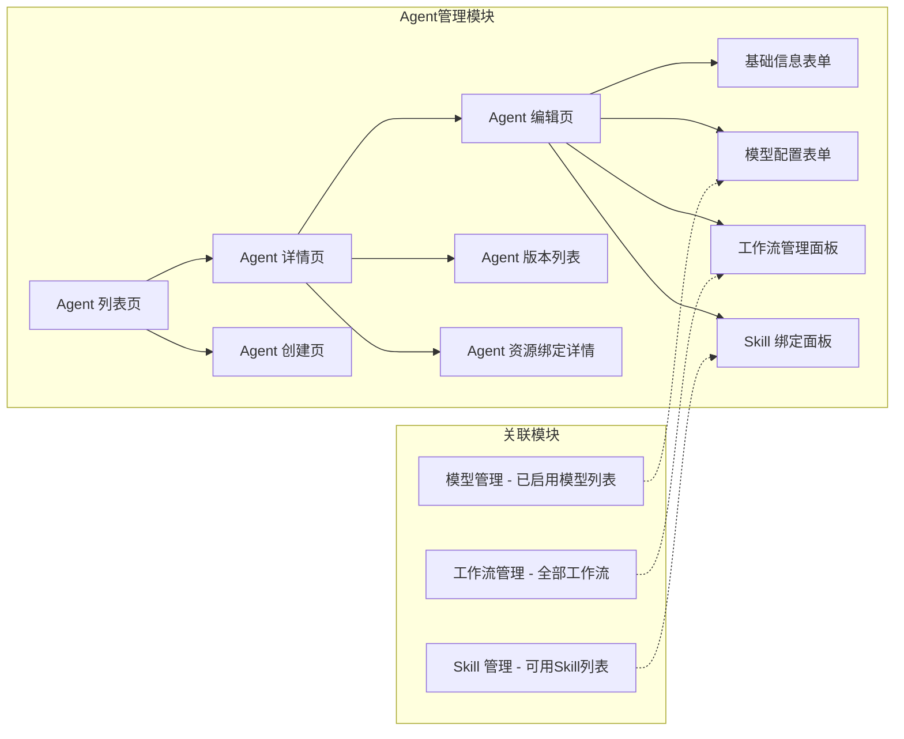
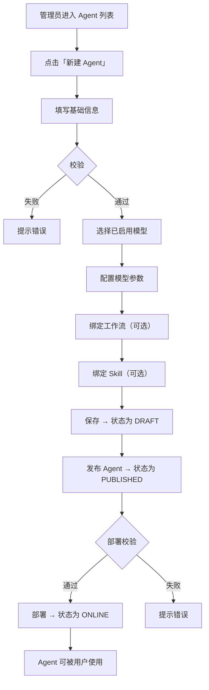
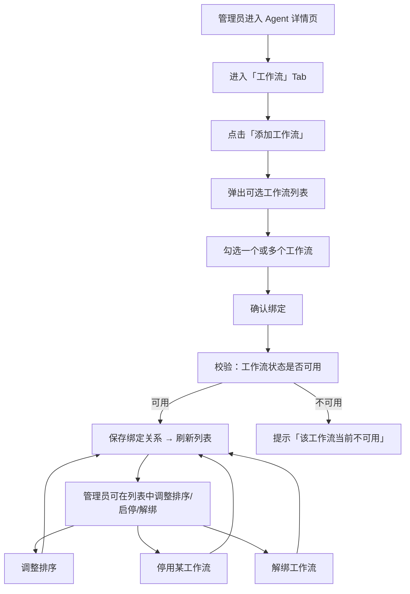
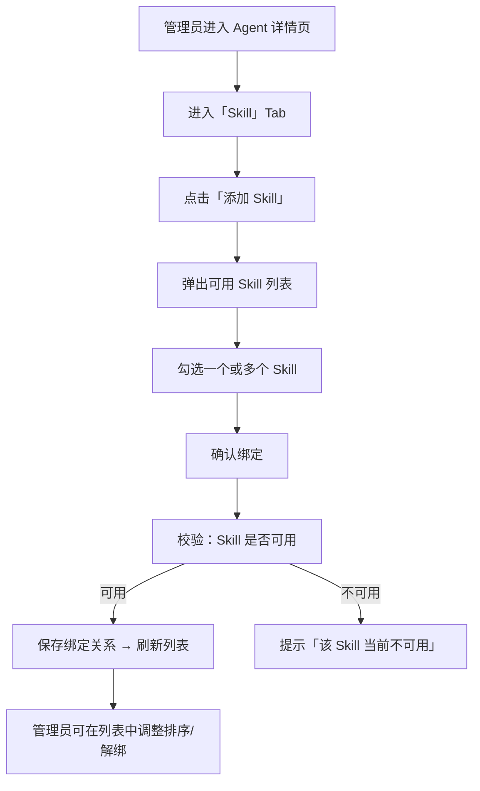
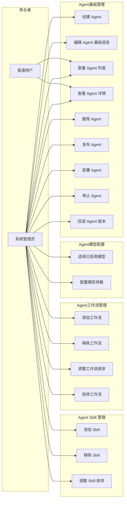

# Agent 管理 产品需求文档（PRD）

> **版本**：V1.0  
> **日期**：2026-05-15  
> **状态**：评审中  

---

## 1. 产品/需求背景

Agent 是 GAgentManager 平台的核心资产，承载了 LLM 对话编排、任务自动化、数据分析等场景。当前 Agent 仅支持基础信息 + 零散的模型配置参数，缺乏对模型引用、工作流编排、Skill 扩展的系统化管理。

**待解决的问题**：

- Agent 的模型配置与模型管理模块未建立关联，模型切换需要手工输入参数，无法直接复用模型管理中已配置好的模型。
- Agent 缺少对「工作流」的编排能力，一个 Agent 无法通过多个工作流完成复杂的多步骤任务链。
- Agent 缺少对 Skill 的绑定能力，无法通过 Skill 市场扩展 Agent 的工具能力。

**面向用户**：平台管理员（Agent 创建/发布/运维）、普通用户（使用 Agent 进行对话和任务）。

---

## 2. 目标与范围

- **目标**：
  1. 建立 Agent 四维度的完整属性体系：**基础信息 → 模型配置 → 工作流编排 → Skill 扩展**
  2. 支持 Agent 与模型管理中已启用的模型直接关联，简化模型切换
  3. 支持 Agent 绑定多个工作流，实现复杂任务编排
  4. 支持 Agent 挂载 Skill，扩展工具调用能力

- **范围（本次包含）**：
  - Agent 基础信息的增删改查（已有，需补充用户提示词字段）
  - Agent 模型选择（单选已启用模型）+ 模型常用配置参数
  - Agent 工作流的创建、绑定、解绑、排序、状态管理
  - Agent Skill 的选择、绑定、解绑

- **不做什么（明确排除）**：
  - 本次不做工作流的可视化编排（画布/拖拽节点），仅做 Agent 与已有工作流的绑定关系
  - 本次不做 Skill 的运行时调用链路追踪与日志
  - 本次不做 Agent 版本回滚 UI
  - 本次不做 Agent 市场（发布到外部平台）

---

## 3. 系统线框图（必选，优先产出）

Agent 管理模块包含以下页面及导航关系：



**页面说明**：

| 页面 | 职责 |
|------|------|
| Agent 列表页 | 展示所有 Agent，支持关键词/状态/类型筛选，支持新建 |
| Agent 创建页 | 填写基础信息 → 选择模型 → 配置参数 → 保存为草稿 |
| Agent 详情页 | 只读展示 Agent 四维属性 + 版本历史 + 资源绑定详情 |
| Agent 编辑页 | 分步或 Tab 切换编辑四个维度 |
| 基础信息表单 | Agent 名称、编码、类型、描述、头像、系统提示词、用户提示词 |
| 模型配置表单 | 从已启用模型中单选一个 + 配置常用 LLM 参数 |
| 工作流管理面板 | 已有工作流列表（可添加）、已绑定工作流列表（可删除/排序/开关） |
| Skill 绑定面板 | 已有 Skill 列表（可添加）、已绑定 Skill 列表（可删除/排序） |

---

## 4. 业务流程图（必选）

### 4.1 Agent 创建到上线全流程



### 4.2 Agent 工作流绑定流程



### 4.3 Agent Skill 绑定流程



---

## 5. 用例图（必选）



---

## 6. 用户与场景

| 角色 | 场景 | 用户故事 |
|------|------|----------|
| 系统管理员 | 创建新 Agent | 作为管理员，我希望快速创建一个 Agent 并绑定模型，以便团队使用 |
| 系统管理员 | 为 Agent 添加工作流 | 作为管理员，我希望为 Agent 关联多个工作流，以便编排复杂的多步骤任务 |
| 系统管理员 | 为 Agent 挂载 Skill | 作为管理员，我希望从 Skill 市场选择 Skill 挂载到 Agent，以便扩展 Agent 的工具能力 |
| 系统管理员 | 切换 Agent 模型 | 作为管理员，我希望从已启用模型列表中一键切换 Agent 模型，避免重复配置参数 |
| 普通用户 | 使用 Agent | 作为用户，我希望在 Agent 列表中选择可用的 Agent 进行对话或任务 |

---

## 7. 功能需求

### 7.1 基础信息模块（P0）

| 序号 | 功能点 | 说明 | 优先级 |
|------|--------|------|--------|
| 1.1 | AgentID | 系统自动生成（递增 Long），不可修改 | P0 |
| 1.2 | Agent 编码 | 业务唯一标识，必填，全局唯一，不可修改 | P0 |
| 1.3 | Agent 名称 | 必填，2-100 字符 | P0 |
| 1.4 | Agent 类型 | 枚举：CHAT / WORKFLOW / ANALYSIS / AUTOMATION / HYBRID | P0 |
| 1.5 | 功能描述 | 可选，500 字符以内 | P0 |
| 1.6 | Agent 头像 | 可选，URL 地址 | P1 |
| 1.7 | 系统提示词（System Prompt） | 可选，用于 LLM 对话设定 | P0 |
| 1.8 | 用户提示词（User Prompt） | 可选，预设用户输入模板 | **新增 P0** |
| 1.9 | 状态 | DRAFT / PUBLISHED / ONLINE / OFFLINE / ABNORMAL / PUBLISHING | P0 |

### 7.2 模型配置模块（P0）

| 序号 | 功能点 | 说明 | 优先级 |
|------|--------|------|--------|
| 2.1 | 模型选择 | 从模型管理中**已启用**的模型列表中选择，**单选**，必填 | P0 |
| 2.2 | 模型信息回显 | 选中后展示模型名称、模型 ID、提供商等只读信息 | P0 |
| 2.3 | 模型过滤 | 下拉列表仅展示状态为「已启用」的模型，禁用/已删除模型不可见 | P0 |
| 2.4 | 模型切换提示 | 切换模型时提示「切换将导致当前对话参数重置」 | P1 |

### 7.3 模型常用配置参数（P0）

| 序号 | 功能点 | 说明 | 优先级 | 类型 | 默认值 | 范围 |
|------|--------|------|--------|------|--------|------|
| 3.1 | Temperature | 控制输出随机性 | P0 | Decimal | 0.7 | 0.0 ~ 2.0 |
| 3.2 | Max Tokens | 最大输出 token 数 | P0 | Integer | 2000 | 1 ~ 8192 |
| 3.3 | Top P | 核采样阈值 | P1 | Decimal | 1.0 | 0.0 ~ 1.0 |
| 3.4 | Top K | 候选词数量 | P1 | Integer | 50 | 1 ~ 200 |
| 3.5 | Frequency Penalty | 频率惩罚 | P1 | Decimal | 0.0 | -2.0 ~ 2.0 |
| 3.6 | Presence Penalty | 存在惩罚 | P1 | Decimal | 0.0 | -2.0 ~ 2.0 |
| 3.7 | Stop Sequences | 停止序列 | P2 | Array | [] | - |
| 3.8 | Response Format | 响应格式（text/json） | P2 | String | text | text / json |
| 3.9 | Timeout Seconds | 请求超时（秒） | P1 | Integer | 60 | 1 ~ 300 |
| 3.10 | Retry Count | 自动重试次数 | P2 | Integer | 0 | 0 ~ 3 |

### 7.4 工作流管理模块（P0）

| 序号 | 功能点 | 说明 | 优先级 |
|------|--------|------|--------|
| 4.1 | 创建/添加工作流 | 从工作流管理中选择一个或多个已发布的工作流绑定到当前 Agent | P0 |
| 4.2 | 工作流列表展示 | 展示 Agent 下已绑定的工作流列表，包含：工作流名称、工作流 ID、状态、描述、排序号 | P0 |
| 4.3 | 工作流详情 | 可展开查看工作流配置信息（JSON） | P1 |
| 4.4 | 工作流排序 | 支持拖拽或手动输入序号调整执行优先级 | P0 |
| 4.5 | 工作流启停 | 支持单独启停某个已绑定的工作流，不影响其他工作流 | P0 |
| 4.6 | 工作流解绑 | 支持从 Agent 解绑某工作流，不影响工作流本身 | P0 |
| 4.7 | 工作流状态联动 | 若被绑定工作流在管理工作流中被下线，Agent 侧应展示为「不可用」 | P1 |
| 4.8 | 工作流配置覆盖 | 支持在 Agent 侧对某工作流的配置进行覆盖，覆盖后的配置仅在 Agent 运行时生效 | P2 |

### 7.5 Skill 管理模块（P0）

| 序号 | 功能点 | 说明 | 优先级 |
|------|--------|------|--------|
| 5.1 | 添加 Skill | 从 Skill 管理中可用 Skill 列表选择一个或多个绑定到当前 Agent | P0 |
| 5.2 | Skill 列表展示 | 展示 Agent 下已绑定的 Skill 列表，包含：Skill 名称、Skill ID、类别、状态、描述、排序号 | P0 |
| 5.3 | Skill 排序 | 支持拖拽或手动输入序号调整调用优先级 | P1 |
| 5.4 | Skill 解绑 | 支持从 Agent 解绑某 Skill，不影响 Skill 本身 | P0 |
| 5.5 | Skill 状态联动 | 若被绑定 Skill 在管理 Skill 中被卸载或下架，Agent 侧应展示为「不可用」 | P1 |

---

## 8. 原型图/界面说明（必选）

### 8.1 Agent 列表页

```
┌─────────────────────────────────────────────────────────────────────┐
│  Agent 管理                                              [+ 新建]   │
├─────────────────────────────────────────────────────────────────────┤
│  搜索: [________________]  类型: [全部 ▼]  状态: [全部 ▼]  [搜索]   │
├─────────────────────────────────────────────────────────────────────┤
│  ID   │ 编码      │ 名称     │ 类型       │ 模型   │ 状态  │ 操作    │
│  1001 │客服助手  │ 智能客服 │ CHAT      │ GPT-4 │ 在线  │ 详情 编辑 │
│  1002 │数据分析  │ 数据洞察 │ ANALYSIS  │ Claude│ 草稿  │ 详情 编辑 │
│  1003 │自动化    │ 报表生成 │ AUTOMATION│ GPT-4 │ 已停止│ 详情 编辑 │
├─────────────────────────────────────────────────────────────────────┤
│  共 3 条  < 1 >                                                     │
└─────────────────────────────────────────────────────────────────────┘
```

### 8.2 Agent 创建/编辑页（Tab 结构）

```
┌─────────────────────────────────────────────────────────────────────┐
│  新建 Agent                                        [保存草稿] [发布] │
├─────────────────────────────────────────────────────────────────────┤
│  ┌─ 基础信息 ─┐  ┌─ 模型配置 ─┐  ┌─ 工作流 ─┐  ┌─ Skill ─┐         │
│                                                                         │
│  基础信息 Tab:                                                          │
│  ┌─────────────────────────────────────────────────────────────┐     │
│  │ Agent 编码:    [_____________] *                             │     │
│  │ Agent 名称:    [_____________] *                             │     │
│  │ Agent 类型:    [CHAT ▼]          *                           │     │
│  │ 功能描述:      [______________________] (500字以内)          │     │
│  │ Agent 头像:    [上传图片/输入URL]                            │     │
│  │ 系统提示词:    [多行文本编辑器_________________]              │     │
│  │ 用户提示词:    [多行文本编辑器_________________] (新增)        │     │
│  └─────────────────────────────────────────────────────────────┘     │
│                                                                         │
│  模型配置 Tab:                                                          │
│  ┌─────────────────────────────────────────────────────────────┐     │
│  │ 选择模型:    [GPT-4 (OpenAI) ▼] *                           │     │
│  │              ↑ 仅展示已启用的模型                             │     │
│  │                                                             │     │
│  │ ─── 模型参数 ───                                           │     │
│  │ Temperature:     [0.7   ] ━━━━━━━━━  范围: 0.0 ~ 2.0       │     │
│  │ Max Tokens:      [2000  ]             范围: 1 ~ 8192        │     │
│  │ Top P:           [1.0   ]             范围: 0.0 ~ 1.0       │     │
│  │ Top K:           [50    ]             范围: 1 ~ 200         │     │
│  │ Frequency Penalty: [0.0  ]            范围: -2.0 ~ 2.0      │     │
│  │ Presence Penalty:  [0.0  ]            范围: -2.0 ~ 2.0      │     │
│  │ Stop Sequences:  [+ 添加序列]                               │     │
│  │ Response Format: [text ▼]                                   │     │
│  │ Timeout (秒):    [60    ]             范围: 1 ~ 300         │     │
│  │ Retry Count:     [0     ]             范围: 0 ~ 3           │     │
│  └─────────────────────────────────────────────────────────────┘     │
│                                                                         │
│  工作流 Tab:                                                            │
│  ┌─────────────────────────────────────────────────────────────┐     │
│  │ [+ 添加工作流]                                               │     │
│  │                                                             │     │
│  │ 已绑定工作流:                                                │     │
│  │ ┌──────┬────────┬──────┬──────┬────────┬──────────────┐     │     │
│  │ │ 排序 │ 名称   │ ID   │ 状态 │ 描述   │ 操作          │     │     │
│  │ │  ☰  │审批流程│ WF01 │ 启用 │ 审批链 │ [禁用][解绑] │     │     │
│  │ │  ☰  │数据清洗│ WF02 │ 启用 │ ETL    │ [禁用][解绑] │     │     │
│  │ └──────┴────────┴──────┴──────┴────────┴──────────────┘     │     │
│  └─────────────────────────────────────────────────────────────┘     │
│                                                                         │
│  Skill Tab:                                                             │
│  ┌─────────────────────────────────────────────────────────────┐     │
│  │ [+ 添加 Skill]                                               │     │
│  │                                                             │     │
│  │ 已绑定 Skill:                                                │     │
│  │ ┌──────┬────────────┬──────────┬──────┬────────┬───────┐    │     │
│  │ │ 排序 │ 名称       │ ID       │ 类别 │ 描述   │ 操作   │    │     │
│  │ │  ☰  │代码解释器  │ SKILL-01 │ 工具 │ Python │ [解绑] │    │     │
│  │ │  ☰  │网页搜索    │ SKILL-02 │ 信息 │ 搜索   │ [解绑] │    │     │
│  │ └──────┴────────────┴──────────┴──────┴────────┴───────┘    │     │
│  └─────────────────────────────────────────────────────────────┘     │
└─────────────────────────────────────────────────────────────────────┘
```

### 8.3 Agent 详情页

```
┌─────────────────────────────────────────────────────────────────────┐
│  Agent: 智能客服 (客服助手)                           [编辑] [发布]   │
├─────────────────────────────────────────────────────────────────────┤
│  状态: 🟢 在线  │  类型: CHAT  │  创建时间: 2026-05-15              │
├─────────────────────────────────────────────────────────────────────┤
│  ┌─ 概览 ─┐  ┌─ 基础信息 ─┐  ┌─ 模型配置 ─┐  ┌─ 工作流 ─┐  ┌─ Skill ─┐│
│                                                                         │
│  概览 Tab:                                                              │
│  ┌─────────────────────────────┐  ┌──────────────────────────────┐    │
│  │ Agent 编码: 客服助手         │  │ 模型: GPT-4 (OpenAI)         │    │
│  │ Agent 类型: CHAT            │  │ Temperature: 0.7             │    │
│  │ 功能描述: 智能客服问答      │  │ Max Tokens: 2000             │    │
│  │ 系统提示词: 你是一个...     │  │ Response Format: text        │    │
│  │ 用户提示词: 请帮我...       │  │ ...                            │    │
│  └─────────────────────────────┘  └──────────────────────────────┘    │
│                                                                         │
│  工作流 Tab: 同 8.2 工作流 Tab（只读模式）                                │
│  Skill Tab: 同 8.2 Skill Tab（只读模式）                                  │
│                                                                         │
│  版本历史 Tab:                                                          │
│  ┌─────────────────────────────────────────────────────────────┐     │
│  │ 版本    │ 标签  │ 发布时间    │ 变更日志       │ 当前?       │     │
│  │ V1.2.0  │ 热修  │ 05-15 10:00 │ 修改 system prompt │ ✓       │     │
│  │ V1.1.0  │ 新增  │ 05-14 14:00 │ 绑定新工作流      │         │     │
│  │ V1.0.0  │ 初始  │ 05-13 09:00 │ 首次发布         │         │     │
│  └─────────────────────────────────────────────────────────────┘     │
└─────────────────────────────────────────────────────────────────────┘
```

### 8.4 添加工作流弹窗

```
┌──────────────────────────────────────────────────────┐
│  添加工作流                                [×]        │
├──────────────────────────────────────────────────────┤
│  搜索: [____________________]                         │
├──────────────────────────────────────────────────────┤
│  ☐ 审批流程 (WF01) ── 已发布 ── 审批节点编排         │
│  ☐ 数据清洗 (WF02) ── 已发布 ── ETL 数据处理         │
│  ☐ 报表生成 (WF03) ── 草稿 ── 自动生成报表            │
│  ☐ 消息推送 (WF04) ── 已下线 ── 多渠道消息推送        │
├──────────────────────────────────────────────────────┤
│                              [取消]    [确定 (已选 2)] │
└──────────────────────────────────────────────────────┘
```
> 注：草稿/已下线状态的工作流不可勾选（禁用态），仅展示「已发布」状态的可选。

### 8.5 添加 Skill 弹窗

```
┌──────────────────────────────────────────────────────┐
│  添加 Skill                                [×]        │
├──────────────────────────────────────────────────────┤
│  类别: [全部 ▼]  搜索: [_________________]            │
├──────────────────────────────────────────────────────┤
│  ☐ 代码解释器 (SKILL-01) ── 工具 ── 执行 Python 代码 │
│  ☐ 网页搜索 (SKILL-02)   ── 信息 ── 搜索网页内容      │
│  ☐ 数据库查询 (SKILL-03) ── 数据 ── SQL 查询执行      │
│  ☐ 文件处理 (SKILL-04)   ── 工具 ── 上传/下载/转换    │
├──────────────────────────────────────────────────────┤
│                              [取消]    [确定 (已选 2)] │
└──────────────────────────────────────────────────────┘
```

### 8.6 关键状态说明

| 状态 | 场景 | 表现 |
|------|------|------|
| 空态 | Agent 列表无数据 | 展示「暂无 Agent，点击新建」+ 空状态插图 |
| 加载中 | 任何数据拉取 | 骨架屏或 loading spinner |
| 错误态 | 接口调用失败 | Toast 提示错误原因 + 重试按钮 |
| 模型无可用 | 模型管理无已启用模型 | 表单中展示「暂无可用模型，请先在模型管理中启用」 |
| 无工作流 | Agent 未绑定工作流 | 工作流 Tab 展示「暂无已绑定的工作流」+ 「添加工作流」按钮 |
| 无 Skill | Agent 未绑定 Skill | Skill Tab 展示「暂无已绑定的 Skill」+ 「添加 Skill」按钮 |

---

## 9. 非功能需求

| 维度 | 要求 |
|------|------|
| 性能 | Agent 列表页支持分页（默认 20 条/页），查询响应 < 200ms |
| 安全 | 所有写操作需要记录操作人 + 操作时间到审计日志；模型选择需校验模型是否存在且已启用 |
| 并发 | 同一 Agent 的并发操作（编辑 + 发布）需做乐观锁或版本号校验 |
| 兼容 | 新增的 userPrompt 字段需兼容历史 Agent 数据（nullable） |
| 审计 | Agent 创建/编辑/发布/部署/停止/回滚均需写入审计日志 |
| 数据一致性 | Agent 绑定工作流/Skill 时需校验目标资源状态，防止绑定草稿/已下线资源 |

---

## 10. 与现有功能的关系

| 现有模块 | 关系 | 兼容要点 |
|---------|------|---------|
| Agent 基础管理 | **扩展** | 已有基础信息 + 模型配置参数 + AgentResourceBinding 表，需补充 userPrompt 字段 |
| 模型管理 | **关联** | Agent 模型选择需复用模型管理的数据，仅展示已启用模型 |
| 工作流管理 | **关联** | Agent 工作流绑定通过 AgentResourceBinding 表（resourceType = WORKFLOW），复用已有绑定机制 |
| Skill 管理 | **关联** | Agent Skill 绑定通过 AgentResourceBinding 表（resourceType = SKILL），复用已有绑定机制 |
| 审计日志 | **复用** | Agent 的所有操作自动写入审计体系 |

---

## 11. Agent 属性完整定义

### 11.1 Agent 基础信息

| 字段名 | 类型 | 必填 | 说明 |
|--------|------|------|------|
| agentId (id) | Long | 自动生成 | 系统主键 ID |
| num | String | 自动生成 | 业务编码（唯一标识） |
| agentCode | String | ✅ | Agent 编码（全局唯一，不可修改） |
| agentName | String | ✅ | Agent 名称（2-100 字符） |
| agentType | Enum | ✅ | CHAT / WORKFLOW / ANALYSIS / AUTOMATION / HYBRID |
| description | String | 否 | 功能描述（500 字符以内） |
| iconUrl | String | 否 | Agent 头像 URL |
| systemPrompt | Text | 否 | LLM 系统提示词 |
| **userPrompt** | **Text** | **否** | **用户提示词（预设输入模板，新增字段）** |
| status | Enum | 系统管理 | DRAFT / PUBLISHED / ONLINE / OFFLINE / ABNORMAL / PUBLISHING |

### 11.2 Agent 模型信息

| 字段名 | 类型 | 必填 | 说明 |
|--------|------|------|------|
| **modelId** | **Long** | **✅** | **绑定的模型 ID（通过 AgentResourceBinding，resourceType=MODEL）** |
| temperature | Decimal | 否 | 温度系数（0.0 ~ 2.0，默认 0.7） |
| maxTokens | Integer | 否 | 最大输出 token（1 ~ 8192，默认 2000） |
| topP | Decimal | 否 | 核采样（0.0 ~ 1.0，默认 1.0） |
| topK | Integer | 否 | 候选词数（1 ~ 200，默认 50） |
| frequencyPenalty | Decimal | 否 | 频率惩罚（-2.0 ~ 2.0，默认 0.0） |
| presencePenalty | Decimal | 否 | 存在惩罚（-2.0 ~ 2.0，默认 0.0） |
| stopSequences | JSON | 否 | 停止序列数组 |
| responseFormat | String | 否 | text / json |
| timeoutSeconds | Integer | 否 | 请求超时秒数（1 ~ 300，默认 60） |
| retryCount | Integer | 否 | 重试次数（0 ~ 3，默认 0） |

### 11.3 Agent 工作流

| 字段名 | 类型 | 必填 | 说明 |
|--------|------|------|------|
| workflowId | Long | ✅ | 工作流 ID（通过 AgentResourceBinding，resourceType=WORKFLOW） |
| workflowNum | String | 自动生成 | 工作流编码 |
| workflowName | String | 自动生成 | 工作流名称 |
| description | String | 否 | 工作流描述 |
| status | Enum | 系统管理 | ENABLED / DISABLED（Agent 级开关） |
| sortOrder | Integer | 否 | 排序号 |
| config | JSON | 否 | 工作流覆盖配置（可选，Agent 侧覆盖原配置） |
| isDefault | Boolean | 否 | 是否为默认工作流 |

### 11.4 Agent Skill

| 字段名 | 类型 | 必填 | 说明 |
|--------|------|------|------|
| skillId | Long | ✅ | Skill ID（通过 AgentResourceBinding，resourceType=SKILL） |
| skillNum | String | 自动生成 | Skill 编码 |
| skillName | String | 自动生成 | Skill 名称 |
| category | String | 自动生成 | Skill 类别 |
| description | String | 否 | Skill 描述 |
| status | Enum | 系统管理 | ENABLED / DISABLED（Agent 级开关） |
| sortOrder | Integer | 否 | 排序号 |
| config | JSON | 否 | Skill 覆盖配置（可选） |

---

## 12. 验收标准

| 编号 | 验收条件 |
|------|---------|
| AC-01 | 能成功创建 Agent，包含完整基础信息和模型选择，保存后状态为 DRAFT |
| AC-02 | 模型选择下拉仅展示已启用模型，禁用/删除模型不可选 |
| AC-03 | Agent 发布后状态变为 PUBLISHED，部署后变为 ONLINE |
| AC-04 | Agent 详情中可绑定多个工作流，支持排序和启停 |
| AC-05 | Agent 详情中可绑定多个 Skill，支持排序 |
| AC-06 | 工作流被下线后，Agent 详情页应展示为「不可用」状态 |
| AC-07 | Skill 被卸载后，Agent 详情页应展示为「不可用」状态 |
| AC-08 | 所有写操作（创建/编辑/发布/部署/停止/绑定/解绑）均写入审计日志 |
| AC-09 | 历史 Agent 数据迁移后 userPrompt 字段为 null 不影响任何功能 |
| AC-10 | Agent 列表支持按类型、状态、关键词筛选，分页正常 |
