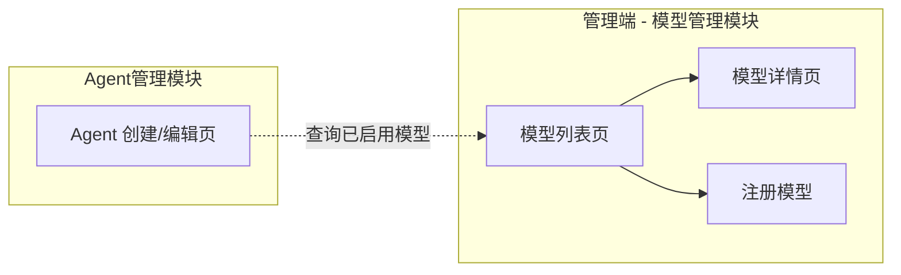
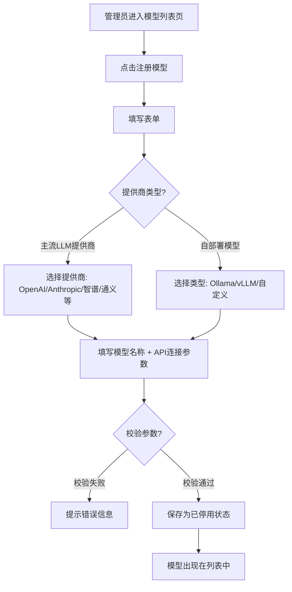
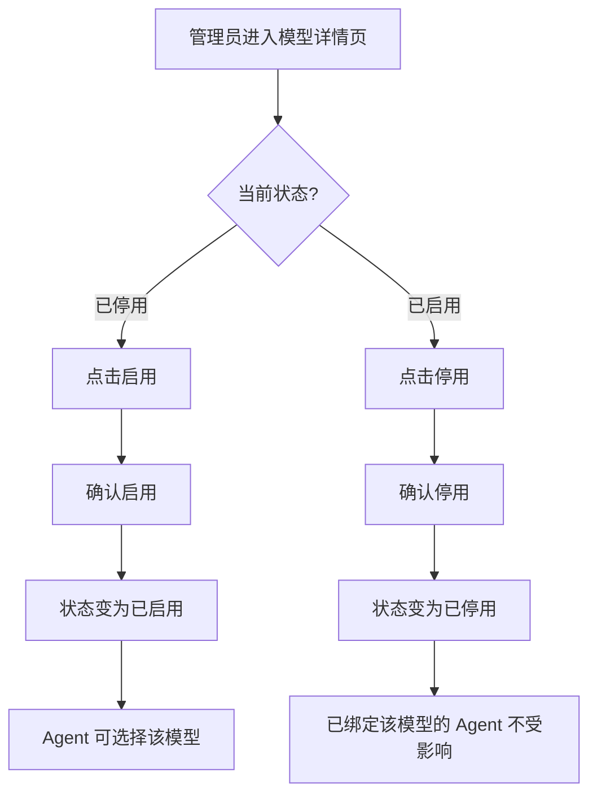
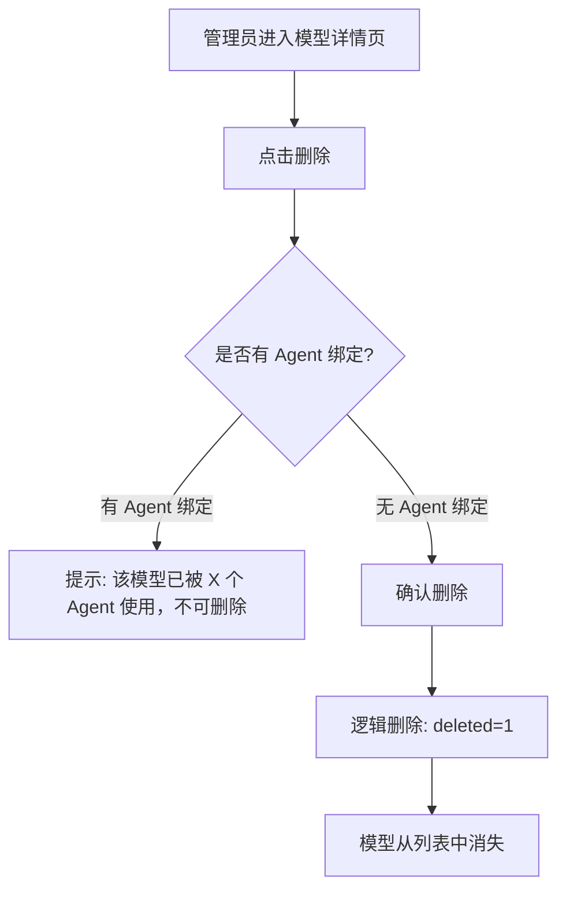
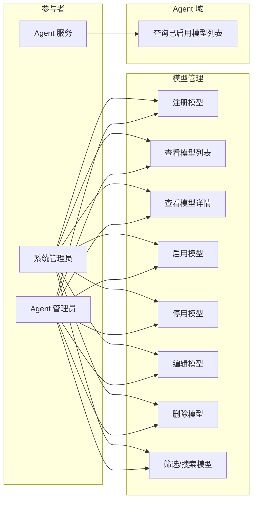

# 模型管理 产品需求文档（PRD）

> **版本**：V1.0
> **日期**：2026-05-15
> **状态**：评审中

---

## 1. 产品/需求背景

GAgentManager 是一个企业级 Agent 管理平台。Agent 的模型配置需要从模型管理中选择已启用的模型，因此需要一个统一的模型管理入口，供管理员配置和管理平台的 LLM 模型池。

**为什么要做：**
- Agent 创建/编辑时需要从模型池中单选一个已启用的模型作为绑定模型
- 需要一个统一管理界面来注册、启用/停用模型，维护模型连接参数
- 避免 Agent 手工输入模型 API 参数，实现模型配置复用

**解决什么问题：**
- 模型配置分散：目前 Agent 模型配置参数零散，无法统一管理
- 缺少模型池概念：无法集中查看和管理平台已注册的模型
- 启用/停用控制：无法快速禁用不健康的模型或切换主力模型

**面向用户：**
- **系统管理员/Agent 管理员**（管理端）：注册模型、配置连接参数、启用/停用模型
- **普通用户端不展示任何模型管理功能和页面**

> **注意：模型管理仅对管理端开放，不对普通用户开放。但 Agent 创建/编辑时可查看已启用的模型列表。**

## 2. 目标与范围

### 目标
1. 提供模型注册能力，支持主流 LLM 提供商和自部署模型
2. 实现模型启用/停用控制，为 Agent 模型选择提供数据源
3. 提供模型列表筛选能力（按提供商、状态、关键词搜索）
4. 建立模型连接参数管理体系（API endpoint、API key、timeout 等）

### 范围

**本次包含（MVP）：**
- 模型注册（类型选择、提供商选择、模型名称、API 连接参数）
- 模型启用/停用
- 模型列表（分页、搜索、按提供商/状态/类型筛选）
- 模型详情查看（基本信息、连接参数）
- 模型编辑（修改连接参数、提供商信息）
- 模型删除（禁用状态才可删除）
- Agent 创建/编辑时获取已启用模型列表

**本次不做什么（明确排除）：**
- 模型配额管理（TPM/RPM 限流）
- 模型健康监控（可用性检测、调用统计、失败率）
- 模型连接参数校验（不强制测试连通性）
- 模型默认推理参数配置（temperature、max_tokens 等）
- 模型调用链路代理/网关
- 普通用户端的模型管理功能

## 3. 系统线框图

### 3.1 系统页面结构



### 3.2 页面说明

| 页面 | 对应功能 | 职责 |
|------|---------|------|
| 模型列表页 | 浏览与筛选 | 分页展示所有模型，支持搜索/提供商/状态筛选，管理端可见注册按钮 |
| 模型详情页 | 信息查看 | 基本信息展示、连接参数查看、启用/停用操作、编辑/删除 |
| 注册模型 | 管理端操作 | 填写模型提供商、模型名称、API 连接参数后确认入库 |
| Agent 创建/编辑页 | 已启用模型选择 | 从模型管理获取已启用模型列表，单选一个作为 Agent 绑定模型 |

## 4. 业务流程图

### 4.1 模型注册流程



### 4.2 模型启用/停用流程



### 4.3 模型删除流程



## 5. 用例图

### 5.1 角色定义

| 角色 | 说明 |
|------|------|
| 系统管理员 | 拥有模型全部操作权限（注册、启用/停用、编辑、删除） |
| Agent 管理员 | 拥有模型全部操作权限（注册、启用/停用、编辑、删除） |
| Agent 服务（内部） | 查询已启用模型列表（只读） |

### 5.2 用例图



## 6. 用户与场景

### 6.1 典型用户故事

| # | 角色 | 用户故事 | 优先级 |
|---|------|---------|--------|
| 1 | 系统管理员 | 作为系统管理员，我希望注册一个 OpenAI GPT-4o 模型并配置 API 连接参数，以便 Agent 可以使用该模型 | P0 |
| 2 | 系统管理员 | 作为系统管理员，我希望注册一个自部署的 Ollama 模型，以便使用本地 LLM | P0 |
| 3 | 系统管理员 | 作为系统管理员，我希望启用/停用模型，以便控制哪些模型可供 Agent 选择 | P0 |
| 4 | 系统管理员 | 作为系统管理员，我希望按提供商/状态/关键词筛选模型，以便快速定位 | P0 |
| 5 | 系统管理员 | 作为系统管理员，我希望查看和编辑模型的连接参数，以便修改 API key 或 endpoint | P0 |
| 6 | Agent 管理员 | 作为 Agent 管理员，我希望在创建 Agent 时从已启用模型列表中单选一个模型，以便简化配置 | P0 |
| 7 | 系统管理员 | 作为系统管理员，我希望删除无 Agent 绑定的模型，以便清理废弃模型 | P1 |

## 7. 功能需求

### 7.1 功能需求清单

| 序号 | 功能模块 | 功能点 | 优先级 | 说明 |
|------|---------|--------|--------|------|
| **M1** | **模型注册** | | **P0** | |
| 1.1 | 提供商选择 | 选择 LLM 提供商 | P0 | 枚举：OpenAI / Anthropic / 智谱 / 通义千问 / 文心一言 / Ollama / vLLM / 自定义 |
| 1.2 | 类型选择 | 选择模型类型 | P0 | 枚举：文本模型 / 视觉模型 / 语音模型 / 全模态模型，默认文本模型 |
| 1.3 | 模型名称 | 填写模型名称 | P0 | 如 gpt-4o、claude-sonnet-4-6、glm-4-plus 等 |
| 1.4 | API endpoint | 填写 API 地址 | P0 | 如 https://api.openai.com/v1 |
| 1.5 | API key | 填写认证密钥 | P0 | 加密存储 |
| 1.6 | Timeout | 设置请求超时 | P0 | 单位秒，默认 60s |
| 1.7 | 模型描述 | 填写模型功能描述 | P1 | 最大 500 字符 |
| **M2** | **模型列表** | | **P0** | |
| 2.1 | 列表展示 | 分页模型列表 | P0 | 每页默认 20 条，支持 10/20/50/100 切换 |
| 2.2 | 关键词搜索 | 搜索模型名称、提供商 | P0 | 模糊匹配 |
| 2.3 | 提供商筛选 | 按 LLM 提供商筛选 | P0 | 多选 |
| 2.4 | 状态筛选 | 按启用/停用状态筛选 | P0 | 已启用 / 已禁用 |
| 2.5 | 类型筛选 | 按模型类型筛选 | P0 | 文本模型 / 视觉模型 / 语音模型 / 全模态模型 |
| 2.6 | 操作列 | 详情、删除按钮 | P0 | 删除仅在禁用状态下可用 |
| **M3** | **模型详情** | | **P0** | |
| 3.1 | 基本信息 | 展示提供商、模型名称、类型、描述 | P0 | |
| 3.2 | 连接参数 | 展示 endpoint、timeout | P0 | API key 脱敏展示（如 sk-****abcd） |
| 3.3 | 绑定 Agent | 展示已绑定此模型的 Agent 数量 | P1 | 只读展示 |
| **M4** | **启用/停用** | | **P0** | |
| 4.1 | 启用 | 已停用 → 已启用 | P0 | 启用后可供 Agent 选择 |
| 4.2 | 停用 | 已启用 → 已停用 | P0 | 已绑定的 Agent 不受影响 |
| **M5** | **模型编辑** | | **P0** | |
| 5.1 | 编辑连接参数 | 修改 endpoint、API key、timeout | P0 | 修改后即时生效，API Key 留空则不修改 |
| 5.2 | 编辑基本信息 | 修改模型名称、描述、提供商、类型 | P0 | 模型名称修改不影响 Agent 绑定 |
| **M6** | **模型删除** | | **P1** | |
| 6.1 | 删除校验 | 仅禁用状态才可删除 | P1 | 非禁用状态隐藏删除按钮 |
| 6.2 | 逻辑删除 | 标记 deleted=1 | P1 | 不物理删除 |

### 7.2 优先级汇总

| 优先级 | 功能模块 | 交付目标 |
|--------|---------|---------|
| **P0 (MVP)** | M1 注册、M2 列表、M3 详情、M4 启用/停用、M5 编辑 | 管理员可以注册模型、启用/停用、编辑连接参数、列表筛选 |
| **P1** | M1.7 模型描述、M3.3 绑定 Agent 展示、M6 删除 | 完整的模型生命周期管理 |

## 8. 原型图/界面说明

### 8.1 模型列表页

```
┌────────────────────────────────────────────────────────────────────┐
│  模型管理                                            [新增模型]    │
├────────────────────────────────────────────────────────────────────┤
│  [🔍 搜索模型...]  提供商: [全部 ▾]  状态: [全部 ▾]  类型: [全部 ▾]│
├────────────────────────────────────────────────────────────────────┤
│  模型名称    模型编码    提供商    类型    状态   Base URL   操作   │
│  ────────────────────────────────────────────────────────────────  │
│  gpt-4o     MODEL-001  OpenAI   文本模型  已启用  api.open... 详情 │
│  claude     MODEL-002  Anthropic 视觉模型  已启用  api.ant... 详情 │
│  llama3     MODEL-003  本地部署  全模态   已禁用  localho... 详删  │
│  glm-4      MODEL-004  智谱     文本模型  已启用  open.bi... 详情 │
├────────────────────────────────────────────────────────────────────┤
│  共 4 条   <  1  >        每页: [20 ▾]                            │
└────────────────────────────────────────────────────────────────────┘
```

**关键元素：**
- 顶部搜索栏 + 筛选条件（提供商、状态、类型）
- 「新增模型」按钮（管理端可见）
- 列表展示：模型名称、模型编码、提供商、类型、状态、Base URL
- 操作列：详情按钮（始终显示）、删除按钮（仅禁用状态下显示）
- 字段超出长度省略显示，鼠标悬停展示完整内容
- 底部分页控件

**空态：** 无匹配结果时展示「暂无数据」空态提示

---

### 8.2 注册模型页

```
┌──────────────────────────────────────────────────────────────────┐
│  ← 返回列表              注册模型                                │
├──────────────────────────────────────────────────────────────────┤
│                                                                  │
│  提供商 *                                                        │
│  [OpenAI ▾]                                                      │
│  （OpenAI / Anthropic / 智谱 / 通义千问 / 文心一言 / Ollama /   │
│   vLLM / 自定义）                                                │
│                                                                  │
│  模型名称 *                                                      │
│  [gpt-4o                          ]                              │
│                                                                  │
│  类型 *                                                          │
│  [文本模型 ▾]                                                    │
│  （文本模型 / 视觉模型 / 语音模型 / 全模态模型）                  │
│                                                                  │
│  API Endpoint *                                                  │
│  [https://api.openai.com/v1       ]                              │
│                                                                  │
│  API Key *                                                       │
│  [sk-proj-*********************   ]                              │
│                                                                  │
│  Timeout（秒）                                                   │
│  [60                              ]  默认 60s                    │
│                                                                  │
│  模型描述                                                        │
│  [_______________________________________________________]       │
│  [_______________________________________________________]       │
│  （可选，最大 500 字符）                                          │
│                                                                  │
│                              [取消]  [确认注册]                  │
│                                                                  │
└──────────────────────────────────────────────────────────────────┘
```

**校验规则：**
- 提供商、模型名称、类型、API Endpoint、API Key 为必填项
- API Endpoint 需为合法 URL 格式
- Timeout 需为 1-300 之间的正整数

---

### 8.3 模型详情页

```
┌──────────────────────────────────────────────────────────────────┐
│  ← 返回列表                              [已启用] [编辑] [删除]  │
├──────────────────────────────────────────────────────────────────┤
│                                                                  │
│  ┌─ 基本信息 ────────────────────────────────┐                   │
│  │  提供商:     OpenAI                        │                   │
│  │  模型名称:   gpt-4o                        │                   │
│  │  类型:       文本模型                       │                   │
│  │  模型描述:   OpenAI 最新旗舰模型...         │                   │
│  │  创建时间:   2026-05-15 10:30              │                   │
│  │  更新时间:   2026-05-15 14:20              │                   │
│  └────────────────────────────────────────────┘                   │
│                                                                  │
│  ┌─ 连接参数 ────────────────────────────────┐                   │
│  │  API Endpoint: https://api.openai.com/v1   │                   │
│  │  API Key:      sk-proj-****abcd            │                   │
│  │  Timeout:      60s                         │                   │
│  └────────────────────────────────────────────┘                   │
│                                                                  │
│  ┌─ 绑定 Agent ──────────────────────────────┐                   │
│  │  共 5 个 Agent 使用此模型                  │                   │
│  │  代码助手  |  创建时间: 2026-04-20         │                   │
│  │  数据分析  |  创建时间: 2026-04-25         │                   │
│  │  ...                                     │                   │
│  └────────────────────────────────────────────┘                   │
│                                                                  │
└──────────────────────────────────────────────────────────────────┘
```

---

### 8.4 编辑模型弹窗

```
┌────────────────────────────────────────────┐
│  编辑模型                                  │
├────────────────────────────────────────────┤
│                                            │
│  提供商                                    │
│  [OpenAI ▾]                                │
│                                            │
│  模型名称                                  │
│  [gpt-4o                   ]               │
│                                            │
│  类型                                      │
│  [文本模型 ▾]                              │
│                                            │
│  API Endpoint *                            │
│  [https://api.openai.com/v1]               │
│                                            │
│  API Key                                   │
│  [sk-proj-******************]              │
│  （留空则不修改）                           │
│                                            │
│  Timeout（秒）                             │
│  [60                       ]               │
│                                            │
│  模型描述                                  │
│  [OpenAI 最新旗舰模型...   ]               │
│                                            │
│              [取消]    [确认修改]           │
│                                            │
└────────────────────────────────────────────┘
```

---

### 8.5 关键状态说明

| 状态 | 展示 | 说明 |
|------|------|------|
| 已启用 | 状态标签：绿色「已启用」 | 可供 Agent 选择绑定 |
| 已禁用 | 状态标签：灰色「已禁用」 | 不可被新 Agent 绑定，已绑定的不受影响，允许删除 |
| 异常 | 状态标签：红色「异常」 | 模型配置异常 |
| 空态（列表无结果） | 居中展示「暂无数据」 | 搜索/筛选结果为空 |
| 加载中 | 列表位置展示 loading 骨架屏 | 数据请求中 |
| 错误态 | Toast 提示错误原因 | 接口返回失败 |

## 9. 非功能需求

### 9.1 性能
- 模型列表响应时间 < 500ms（P95）
- 模型详情页加载时间 < 200ms（P95）

### 9.2 安全与权限
- 模型创建/编辑/启用/停用/删除：仅管理端（系统管理员/Agent 管理员）可操作
- **普通用户端不展示任何模型管理功能和页面**
- API Key 需加密存储，不可明文展示
- 模型详情中 API Key 必须脱敏显示（如 sk-****abcd）

### 9.3 数据一致性
- 禁用状态才可删除（前端隐藏删除按钮，非禁用状态不可见）
- API Endpoint 需校验 URL 格式合法性

### 9.4 兼容性
- 浏览器兼容：Chrome 90+, Firefox 88+, Safari 14+
- 前端框架：React 18 + Ant Design
- 屏幕分辨率：支持 1366x768 及以上

### 9.5 错误提示
- 所有操作失败时需返回明确的中文错误提示
- 前端错误码映射：
  - `1401` → 「模型名称已存在，请更换名称」
  - `1402` → 「该模型已被 Agent 使用，请先解除绑定后再删除」
  - `1403` → 「API Endpoint 格式不合法」

## 10. 与现有功能的关系

### 10.1 全新功能

模型管理是 GAgentManager 平台的全新功能模块，不依赖已有功能的改造。

### 10.2 与现有模块的关联

| 关联模块 | 关联点 | 说明 |
|---------|--------|------|
| Agent 管理 | 模型绑定 | Agent 创建/编辑时从模型管理中单选一个已启用的模型，通过 AgentResourceBinding 表关联 |
| RBAC 权限 | 权限控制 | 模型操作需遵循 RBAC 权限模型 |
| 审计日志 | 领域事件 | 模型注册/启用/停用/编辑/删除操作需发送领域事件，供审计日志消费 |

### 10.3 数据迁移

无历史数据迁移需求（全新模块）。

## 11. 验收标准

### 11.1 功能验收

| # | 验收条款 | 验收方法 |
|---|---------|---------|
| 1 | 管理员可以新增模型（选择提供商 + 类型 + 填写连接参数） | 提交表单，数据正确入库 |
| 2 | 类型字段为必填项，默认值为文本模型 | 不选择类型时表单不可提交 |
| 3 | API Key 加密存储，不可明文展示 | 查看数据库和详情页，API Key 已加密/脱敏 |
| 4 | 管理员可以启用/停用模型 | 操作后状态正确更新 |
| 5 | 启用模型后可供 Agent 选择 | Agent 创建页能正确获取已启用模型列表 |
| 6 | 停用后已绑定的 Agent 不受影响 | 停用模型后，已绑定 Agent 仍可正常运行 |
| 7 | 支持按提供商/状态/类型/关键词筛选 | 选择筛选条件，结果正确过滤 |
| 8 | 管理员可以编辑模型连接参数和基本信息 | 修改后数据正确更新 |
| 9 | 仅禁用状态的模型可删除 | 非禁用状态列表页不显示删除按钮 |
| 10 | 列表字段超出长度省略显示，鼠标悬停展示完整内容 | 查看长文本字段 |
| 11 | 普通用户无法访问/查看模型管理页面 | 使用普通用户登录，无模型管理入口 |

### 11.2 性能验收

- 模型列表 P95 响应时间 < 500ms
- 详情页加载 P95 响应时间 < 200ms

### 11.3 安全验收

- 普通用户无法访问/查看模型管理页面
- 非管理员用户无法新增/启用/停用/编辑/删除模型
- API Key 加密存储，API Key 在详情页脱敏展示
- 所有操作记录操作用户和时间

---

**文档版本：** V1.0
**创建日期：** 2026年05月15日
**作者：** GAgentManager 产品团队
**关联总 PRD：** `docs/prd/PRD-GAgentManager-V5.0.md`
**审核人：** 产品负责人、技术负责人、业务负责人
