# Skill 管理 - 技术方案

> **文档版本**：V1.0  
> **创建日期**：2026-05-01  
> **关联 PRD**：`doc/产品方案/2026-05-01_Skill商店-PRD.md`  
> **对应分支**：`feature-20260501-skill-management`

---

## 1. 目标与范围

### 1.1 目标

- 提供 Skill 上传能力（`.zip` 压缩包 / 文件夹），两步式上传+确认入库
- 实现完整的 Skill 生命周期管理（新增→上架→下架→发布）
- 建立 Skill 版本管理体系（语义化版本号、发布备注、版本历史）
- 提供 Skill 列表筛选能力（按分类、标签、状态、关键词搜索）

### 1.2 范围

| 范围内 | 范围外 |
|--------|--------|
| Skill 上传（`.zip` / 文件夹）、两步式预览确认 | Skill 评价系统（评分、评论） |
| SKILL.md YAML 元数据自动解析 | Skill 市场浏览流程（用户端） |
| Skill 上架/下架 | 第三方 Skill 市场集成 |
| Skill 版本发布（重新上传完整包 / 在线编辑 SKILL.md） | Skill 安全验证与自动测试 |
| Skill 列表筛选（分类、标签、状态、搜索） | Skill 推荐算法 |
| Skill 详情（文件树、SKILL.md 预览） | 普通用户端的 Skill 功能 |
| Skill 删除（需确认无 Agent 绑定） | |

### 1.3 关键技术决策

| 决策点 | 方案 |
|--------|------|
| Skill 名称/描述 | 手动填写表单，不依赖 YAML 自动解析 |
| Skill 文件存储 | MinIO 对象存储，原 zip 和解压后的文件树都保留 |
| 文件树来源 | 上传时解析并存储到数据库字段 |
| SKILL.md 预览 | 从 MinIO 读取（不单独存数据库） |
| 上传流程 | 两步式：先上传到临时目录预览，确认后正式入库 |
| 版本发布 | 支持重新上传完整包 + 在线编辑 SKILL.md 两种方式 |
| skillCode | 系统自动生成（如 SKILL-0001），与 YAML name 无关 |
| 分类枚举 | 10 类：数据处理、工具调用、内容生成、搜索查询、系统集成、自定义、开发、自动化、创意、通信 |
| Agent 绑定查询 | 应用层组装（调用 Agent 域 Gateway） |
| MinIO 配置 | 项目中尚无 MinIO，需新建 MinIO 客户端配置 |

---

## 2. 架构设计（代码结构）

| 层 | 领域 | 包 | 职责 |
|---|------|---|------|
| facade | skill | `com.gagentmanager.facade.skill` | Skill 领域事件 DTO、事件常量 |
| client | skill | `com.gagentmanager.client.skill` | SkillVO、SkillVersionVO、SkillUploadParam、CreateSkillParam、UpdateSkillParam、PublishParam、SkillFileNodeVO |
| client | common | `com.gagentmanager.client.common` | PageParam、PageResult |
| domain | skill | `com.gagentmanager.domain.skill` | Skill 聚合根、SkillVersion/SkillReleaseNote 实体、Repository 接口、AgentGateway 接口 |
| infra | skill | `com.gagentmanager.infra.skill` | Skill/SkillVersion/SkillReleaseNote Entity、Mapper、Repository 实现 |
| infra | util | `com.gagentmanager.infra.util` | MinIO 工具类、Zip 解压工具、YAML 解析工具 |
| application | skill | `com.gagentmanager.application.skill` | SkillCommandService、SkillQueryService、SkillUploadService |
| adapter | skill | `com.gagentmanager.adapter.skill` | SkillCommandController、SkillQueryController、SkillUploadController |
| adapter | config | `com.gagentmanager.adapter.config` | MinIO 配置类、SecurityConfig 中 Skill 权限配置 |

---

## 3. 领域模型设计

### 3.1 业务层级划分

| 层级 | 业务领域 | 说明 |
|-----|---------|------|
| 核心域 | skill | Skill 管理（上传、上架/下架、版本发布、列表/详情） |
| 支撑域 | agent（跨域） | Agent-Skill 绑定关系查询（通过 Gateway 调用 Agent 域） |

### 3.2 Skill（skill）

#### 3.2.1 领域模型

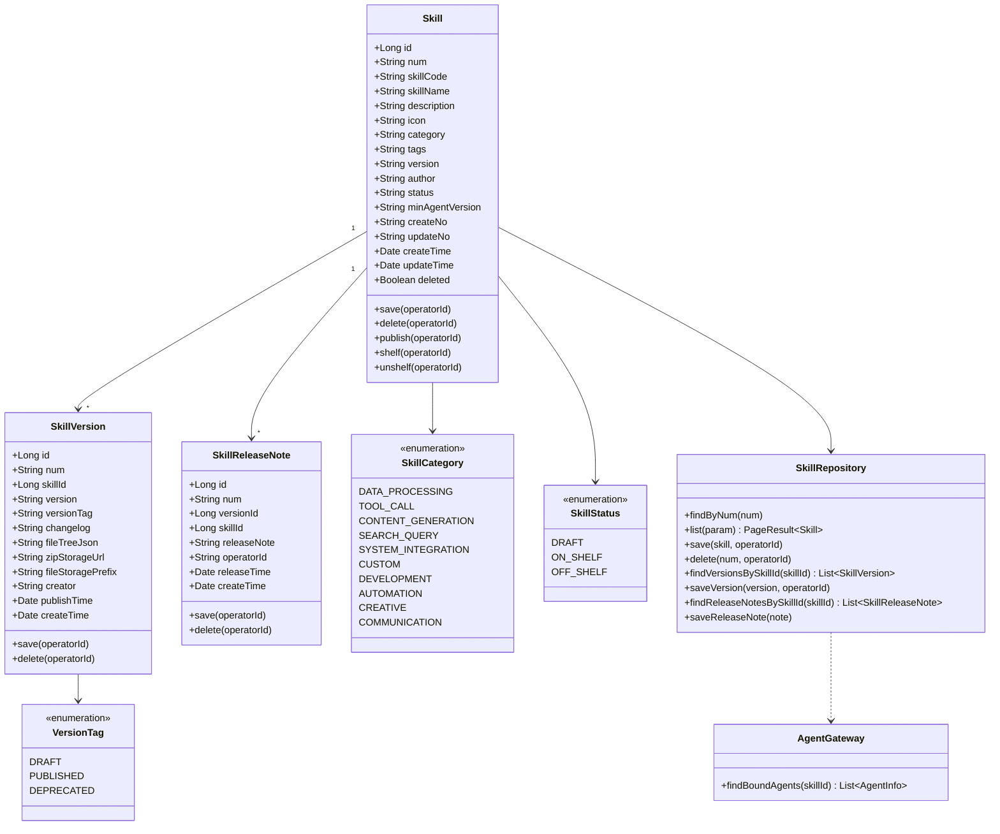

| 对象 | 类型 | 属性 | 说明 |
|-----|------|------|------|
| Skill | 聚合根 | id, num, skillCode, skillName, description, icon, category, tags, version, author, status, minAgentVersion, createNo, updateNo | Skill 元数据 |
| SkillVersion | 实体 | id, num, skillId, version, versionTag, changelog, fileTreeJson, zipStorageUrl, fileStoragePrefix, creator, publishTime | Skill 版本记录（含文件树和 MinIO 存储位置） |
| SkillReleaseNote | 实体 | id, num, versionId, skillId, releaseNote, operatorId, releaseTime | 版本发布备注（替代旧 SkillReview） |

**Repository 接口**：

| 方法 | 说明 |
|-----|------|
| `findByNum(num)` | 按编号查找 Skill |
| `list(param): PageResult~Skill~` | 分页查询 Skill（支持关键词/分类/标签/状态筛选） |
| `save(skill, operatorId)` | 保存 Skill |
| `delete(num, operatorId)` | 逻辑删除 |
| `findVersionsBySkillId(skillId): List~SkillVersion~` | 查版本列表 |
| `saveVersion(version, operatorId)` | 保存版本 |
| `findReleaseNotesBySkillId(skillId): List~SkillReleaseNote~` | 查发布备注列表 |
| `saveReleaseNote(note)` | 保存发布备注 |

**Gateway 接口**：

| 方法 | 说明 |
|-----|------|
| `AgentGateway.findBoundAgents(skillId)` | 查询已绑定此 Skill 的 Agent 列表 |

**工具类（infra.util）**：

| 工具类 | 方法 | 说明 |
|--------|------|------|
| MinIOUtil | `uploadToTemp(file): String` | 上传到临时目录 |
| MinIOUtil | `extractZip(zipPath, targetPrefix): List~FileNode~` | 解压 zip 到目标路径，返回文件树 |
| MinIOUtil | `findSkillMd(prefix): String` | 在指定前缀下查找 SKILL.md 文件 |
| MinIOUtil | `moveToPermanent(tempPath, permanentPath): Void` | 从临时目录移到正式目录 |
| MinIOUtil | `delete(prefix): Void` | 删除指定前缀下的所有文件 |
| MinIOUtil | `getFileContent(objectKey): String` | 读取文件内容（用于 SKILL.md 预览） |
| MinIOUtil | `listFiles(prefix): List~FileNode~` | 列出指定前缀下的文件树 |
| ZipUtil | `extract(zipFile, targetDir): Void` | 解压 zip 文件 |
| YamlUtil | `parseFrontmatter(content): Map` | 解析 YAML frontmatter |

#### 3.2.2 领域规则

| 聚合/对象 | 规则类型 | 规则描述 | 违反时表达 |
|----------|---------|---------|-----------|
| Skill | 不变性 | skillCode 全局唯一（系统自动生成） | SkillCodeAlreadyExistsException |
| Skill | 业务规则 | 有 Agent 绑定的 Skill 不可删除 | SkillHasBindingsException |
| Skill | 业务规则 | 上传必须包含 SKILL.md 文件 | SkillMissingSkillMdException |
| Skill | 业务规则 | 上传后元数据解析成功才可确认入库 | SkillParseYamlFailedException |
| SkillVersion | 不变性 | version 语义化版本号格式（V主.次.修订） | InvalidVersionException |
| SkillVersion | 业务规则 | 发布新版本时 changelog 不能为空 | EmptyChangelogException |
| SkillReleaseNote | 业务规则 | releaseNote 最大 1000 字符 | NoteTooLongException |

#### 3.2.3 领域动作

| 聚合/实体 | 领域动作 | 职责 | 前置条件 | 后置条件/规则 | 领域事件 |
|----------|---------|------|---------|-------------|---------|
| Skill | `save(operatorId)` | 创建/更新 Skill | skillCode 唯一 | 保存 Skill 记录，初始状态=DRAFT | SkillCreated / SkillUpdated |
| Skill | `delete(operatorId)` | 删除 Skill | 无 Agent 绑定 | 标记 deleted=1 | SkillDeleted |
| Skill | `shelf(operatorId)` | 上架 Skill | 状态为 DRAFT/OFF_SHELF | 状态变为 ON_SHELF | SkillShelfChanged |
| Skill | `unshelf(operatorId)` | 下架 Skill | 状态为 ON_SHELF | 状态变为 OFF_SHELF | SkillShelfChanged |
| Skill | `publish(operatorId, changelog)` | 发布新版本 | Skill 存在 | 生成新版本记录，更新当前版本号 | SkillPublished |
| SkillVersion | `save(operatorId)` | 保存版本 | version 唯一（同 Skill 下） | 保存版本记录，含文件树和存储位置 | - |
| SkillReleaseNote | `save()` | 保存发布备注 | note 非空 | 保存发布备注 | - |

**upload 时序图（两步式上传）**：

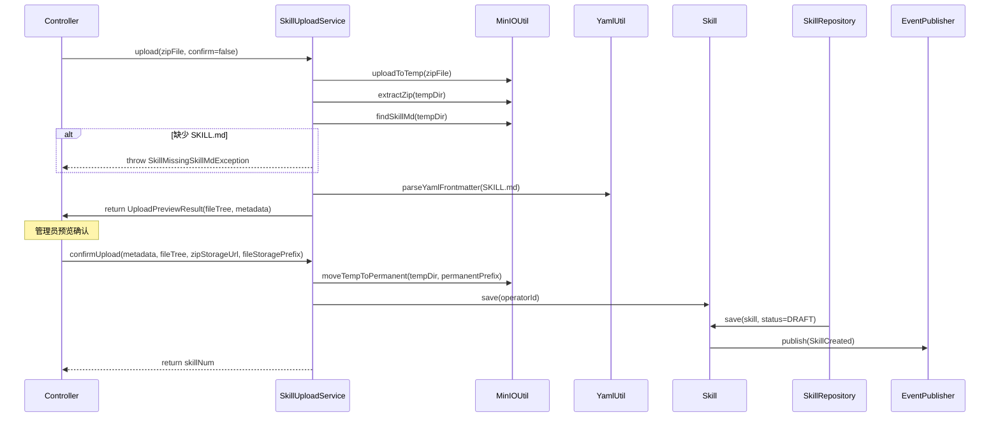

**shelf 时序图（上架）**：

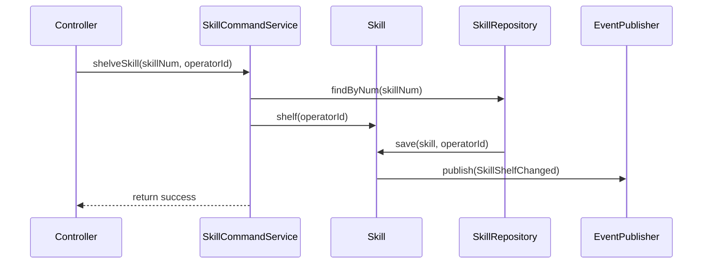

**unshelf 时序图（下架）**：

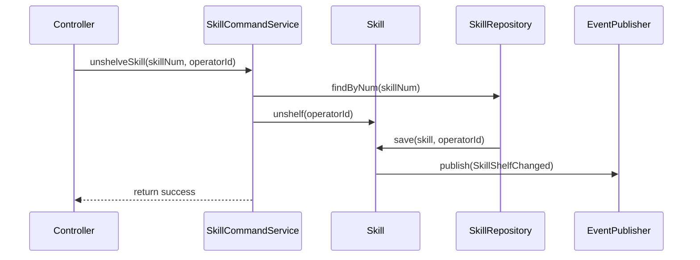

**publish 时序图（发布新版本）**：

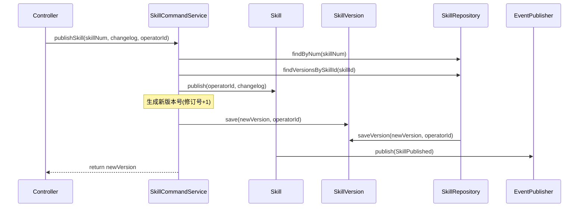

**delete 时序图（删除）**：

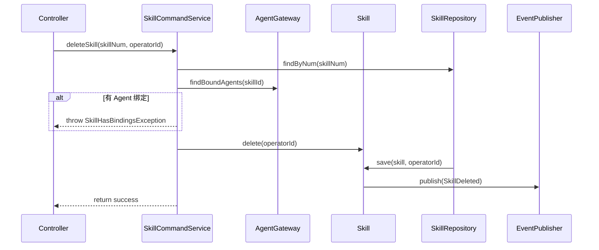

#### 3.2.4 领域事件

| 事件名 | 触发时机 | 载荷要点 | 可订阅方/用途 |
|-------|---------|---------|-------------|
| SkillCreated | 上传确认入库成功 | skillNum, skillName, category, operatorId | 审计日志 |
| SkillUpdated | 编辑 Skill 元数据成功 | skillNum, operatorId | 审计日志 |
| SkillDeleted | 删除 Skill 成功 | skillNum, operatorId | 审计日志 |
| SkillShelfChanged | 上架/下架 Skill 成功 | skillNum, status, operatorId | 审计日志 |
| SkillPublished | 发布 Skill 版本成功 | skillNum, version, operatorId | 审计日志 |


## 4. 应用层设计

### 4.1 业务模块划分

| 应用模块 | 对应领域 | Service 类型 | 说明 |
|---------|---------|-------------|------|
| skill | Skill 管理 | CommandService | Skill 创建/编辑/删除/上架/下架/发布 |
| skill | Skill 管理 | QueryService | Skill 列表/详情/版本历史/发布备注/绑定 Agent 查询 |
| skill | Skill 上传 | UploadService | 两步式上传（上传预览 + 确认入库） |

### 4.2 Skill 管理（skill）

#### 4.2.1 Service 方法清单

| Service | 方法签名 | 职责 | 入参 | 出参 |
|---------|---------|------|------|------|
| SkillCommandService | `createSkill(param: CreateSkillParam, operatorId: Long): String` | 创建 Skill（手动填写表单） | skillName, description, category, tags, icon, author | skillNum |
| SkillCommandService | `updateSkill(num: String, param: UpdateSkillParam, operatorId: Long): Void` | 更新 Skill 元数据 | num, skillName, description, category, tags | - |
| SkillCommandService | `deleteSkill(num: String, operatorId: Long): Void` | 删除 Skill | num | - |
| SkillCommandService | `shelveSkill(num: String, operatorId: Long): Void` | 上架 Skill | num | - |
| SkillCommandService | `unshelveSkill(num: String, operatorId: Long): Void` | 下架 Skill | num | - |
| SkillCommandService | `publishSkill(num: String, changelog: String, operatorId: Long): String` | 发布新版本 | num, changelog | newVersion |
| SkillCommandService | `publishWithUpload(num: String, changelog: String, zipFile: MultipartFile, operatorId: Long): String` | 上传完整包发布新版本 | num, changelog, zipFile | newVersion |
| SkillCommandService | `publishWithEdit(num: String, changelog: String, skillMdContent: String, operatorId: Long): String` | 在线编辑 SKILL.md 发布新版本 | num, changelog, skillMdContent | newVersion |
| SkillQueryService | `querySkillList(param: SkillQueryParam): PageResult~SkillVO~` | Skill 列表（分页+筛选） | pageNo, pageSize, keyword, category, tags, status | PageResult~SkillVO~ |
| SkillQueryService | `querySkillByNum(num: String): SkillVO` | Skill 详情 | num | SkillVO |
| SkillQueryService | `querySkillVersions(skillNum: String): List~SkillVersionVO~` | 版本列表 | skillNum | List~SkillVersionVO~ |
| SkillQueryService | `queryReleaseNotes(skillNum: String): List~ReleaseNoteVO~` | 发布备注列表 | skillNum | List~ReleaseNoteVO~ |
| SkillQueryService | `queryBoundAgents(skillNum: String): List~AgentInfoVO~` | 已绑定 Agent 列表 | skillNum | List~AgentInfoVO~ |

#### 4.2.2 方法时序逻辑

**createSkill 时序图**：

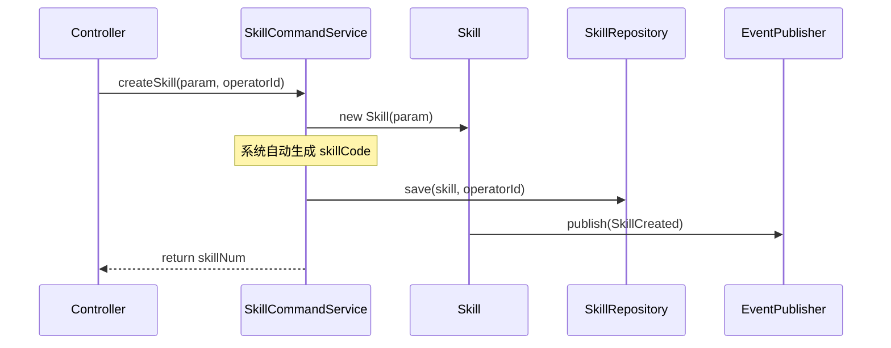

**querySkillList 时序图**：

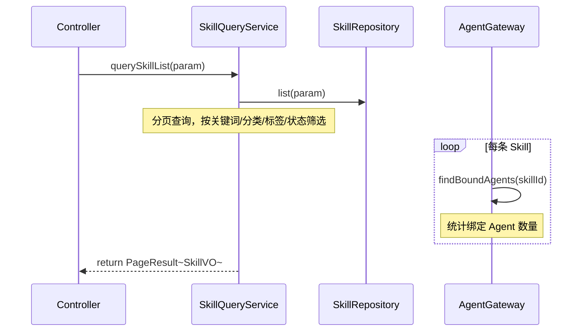

**querySkillByNum 时序图**：

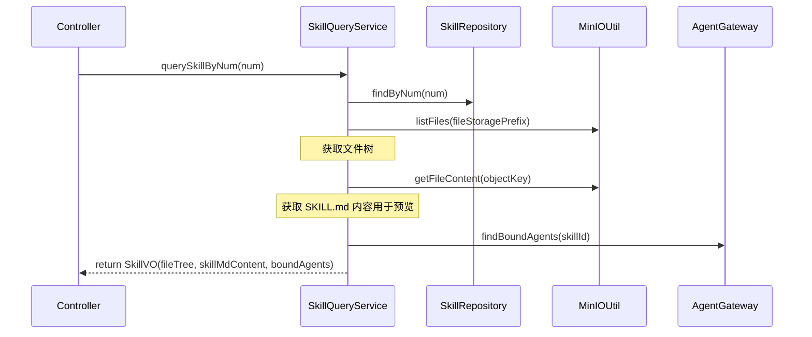

**shelveSkill 时序图**：

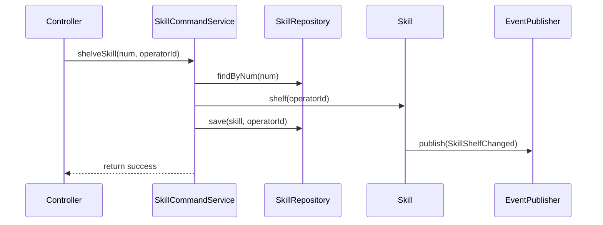

**unshelveSkill 时序图**：

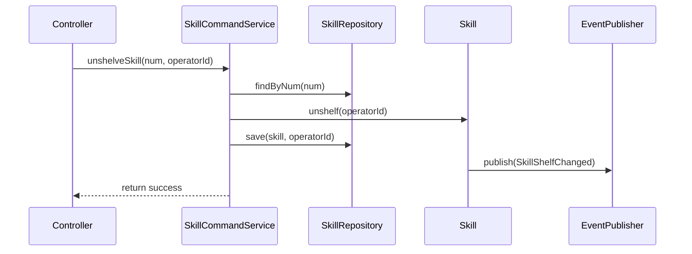

**publishSkill 时序图**：

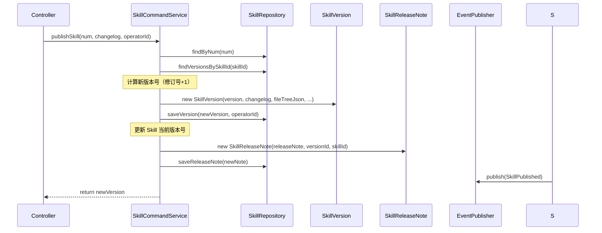

**deleteSkill 时序图**：

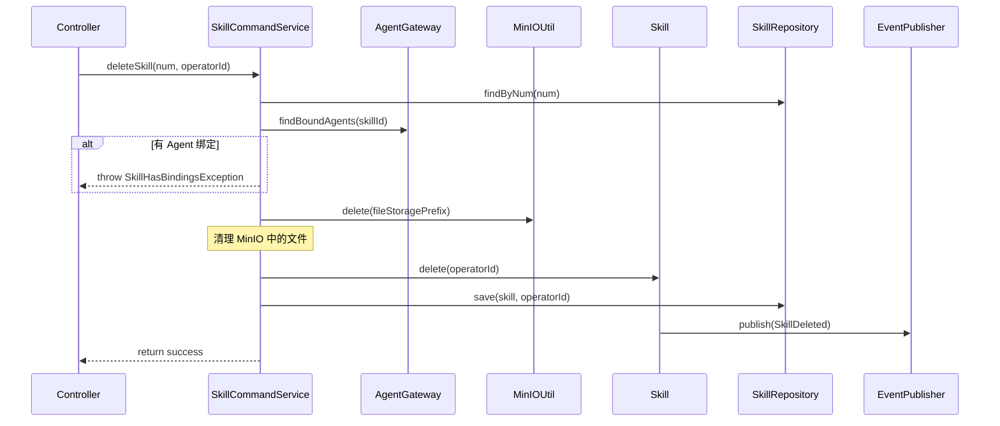

### 4.3 Skill 上传（skill）

#### 4.3.1 Service 方法清单

| Service | 方法签名 | 职责 | 入参 | 出参 |
|---------|---------|------|------|------|
| SkillUploadService | `uploadZip(zipFile: MultipartFile): UploadPreviewVO` | 第 1 步：上传 zip 到临时目录，解压并解析元数据 | zipFile | UploadPreviewVO(fileTree, metadata, tempPath) |
| SkillUploadService | `uploadFolder(files: MultipartFile[]): UploadPreviewVO` | 第 1 步：上传文件夹到临时目录，解析元数据 | files | UploadPreviewVO(fileTree, metadata, tempPath) |
| SkillUploadService | `confirmUpload(param: ConfirmUploadParam, operatorId: Long): String` | 第 2 步：确认入库，移动文件到正式目录 | param(skillName, description, category, tags, tempPath, ...) | skillNum |
| SkillUploadService | `cancelUpload(tempPath: String): Void` | 取消上传，清理临时目录 | tempPath | - |

#### 4.3.2 方法时序逻辑

**uploadZip 时序图**：

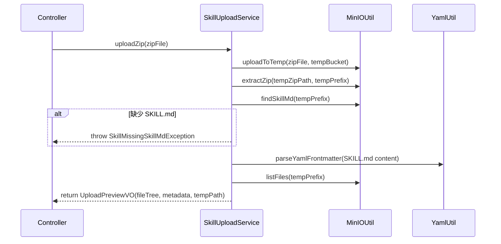

**confirmUpload 时序图**：

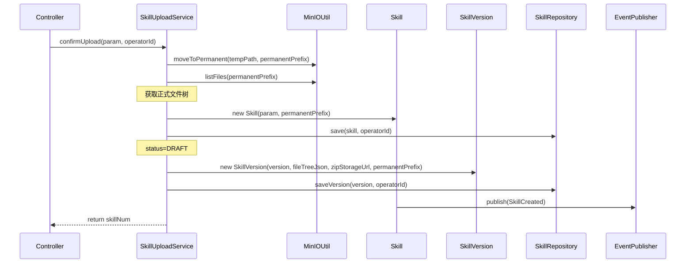

**cancelUpload 时序图**：

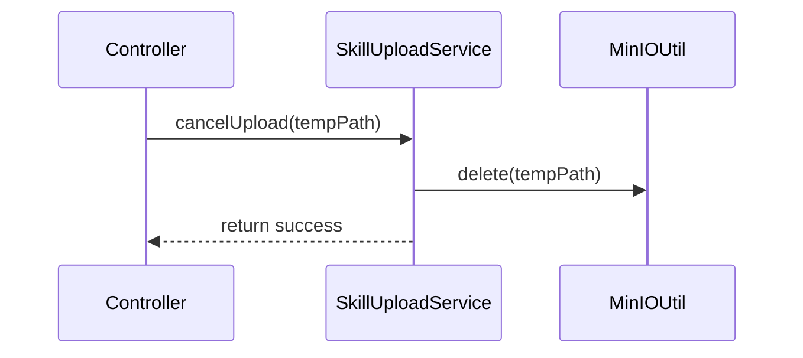

---

## 5. 控制器/Adapter 层设计

### 5.1 业务模块划分

| Controller | 对应应用模块 | URL 前缀 |
|-----------|-------------|---------|
| SkillCommandController | skill / SkillCommandService | `/api/skill/command` |
| SkillQueryController | skill / SkillQueryService | `/api/skill/query` |
| SkillUploadController | skill / SkillUploadService | `/api/skill/upload` |

### 5.2 Skill 上传（skill）

#### 5.2.1 Controller 接口清单

| 接口 | 方法 | 路径 | 入参 | 返回值 JSON | 职责 |
|-----|------|------|------|-----------|------|
| 上传 zip | POST | `/api/skill/upload/zip` | multipart: `zipFile` | `{"code": 200, "data": {"tempPath": "/tmp/...", "fileTree": [{"name": "SKILL.md", "size": 2300}], "metadata": {"name": "...", "description": "..."}}}` | 第 1 步：上传并预览 |
| 上传文件夹 | POST | `/api/skill/upload/folder` | multipart: `files[]` | 同上 | 第 1 步：上传文件夹并预览 |
| 确认入库 | POST | `/api/skill/upload/confirm` | `{"skillName": "代码助手", "description": "...", "category": "TOOL_CALL", "tags": ["code"], "tempPath": "/tmp/...", "author": "张三"}` | `{"code": 200, "data": "SKILL-001"}` | 第 2 步：确认入库 |
| 取消上传 | POST | `/api/skill/upload/cancel` | `{"tempPath": "/tmp/..."}` | `{"code": 200, "data": null}` | 取消上传，清理临时文件 |

#### 5.2.2 接口时序逻辑

**上传 zip 时序图**：

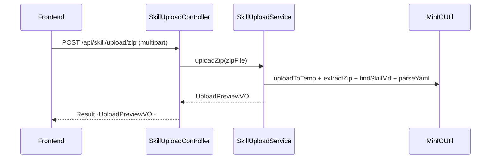

**确认入库时序图**：

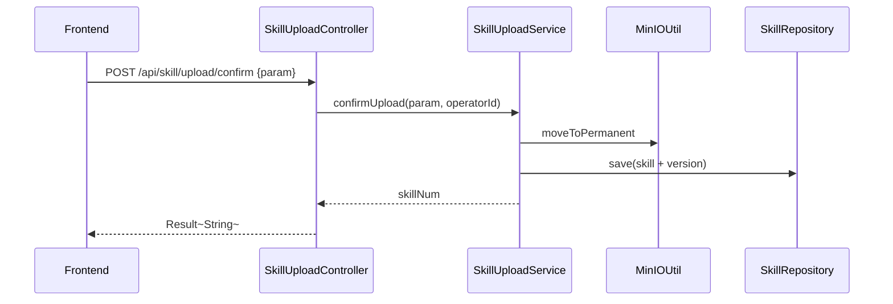

### 5.3 Skill 命令（skill）

#### 5.3.1 Controller 接口清单

| 接口 | 方法 | 路径 | 入参 | 返回值 JSON | 职责 |
|-----|------|------|------|-----------|------|
| 创建 Skill | POST | `/api/skill/command/create` | `{"skillName": "代码助手", "description": "...", "category": "TOOL_CALL", "tags": ["code"], "author": "张三"}` | `{"code": 200, "data": "SKILL-001"}` | 手动创建 Skill |
| 更新 Skill | POST | `/api/skill/command/update` | `{"num": "SKILL-001", "skillName": "...", "description": "...", "category": "...", "tags": [...]}` | `{"code": 200, "data": null}` | 更新 Skill 元数据 |
| 删除 Skill | POST | `/api/skill/command/delete` | `{"num": "SKILL-001"}` | `{"code": 200, "data": null}` | 删除 Skill |
| 上架 Skill | POST | `/api/skill/command/shelve` | `{"num": "SKILL-001"}` | `{"code": 200, "data": null}` | 上架 |
| 下架 Skill | POST | `/api/skill/command/unshelve` | `{"num": "SKILL-001"}` | `{"code": 200, "data": null}` | 下架 |
| 发布版本 | POST | `/api/skill/command/publish` | `{"num": "SKILL-001", "changelog": "新增代码格式化功能"}` | `{"code": 200, "data": "V1.2.1"}` | 发布新版本（在线编辑） |
| 上传发布 | POST | `/api/skill/command/publish-with-upload` | multipart: `num`, `changelog`, `zipFile` | `{"code": 200, "data": "V2.0.0"}` | 重新上传完整包发布 |
| 编辑发布 | POST | `/api/skill/command/publish-with-edit` | `{"num": "SKILL-001", "changelog": "...", "skillMdContent": "# Skill 内容..."}` | `{"code": 200, "data": "V1.2.1"}` | 在线编辑 SKILL.md 发布 |

#### 5.3.2 接口时序逻辑

**上架 Skill 时序图**：

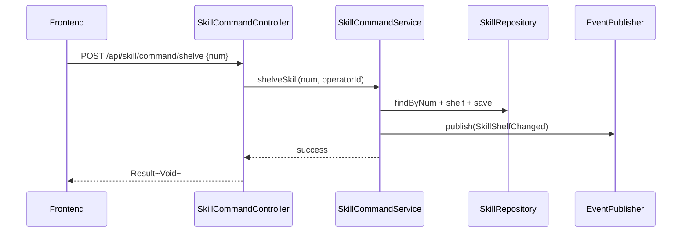

**下架 Skill 时序图**：

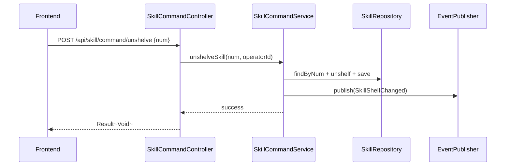

**发布版本时序图**：

```mermaid
sequenceDiagram
    participant FE as Frontend
    participant Ctrl as SkillCommandController
    participant Svc as SkillCommandService
    participant Repo as SkillRepository
    participant E as EventPublisher

    FE->>Ctrl: POST /api/skill/command/publish {num, changelog}
    Ctrl->>Svc: publishSkill(num, changelog, operatorId)
    Svc->>Repo: findByNum + findVersions + computeNewVersion + saveVersion
    Svc->>E: publish(SkillPublished)
    Svc-->>Ctrl: newVersion
    Ctrl-->>FE: Result~String~
```

### 5.4 Skill 查询（skill）

#### 5.4.1 Controller 接口清单

| 接口 | 方法 | 路径 | 入参 | 返回值 JSON | 职责 |
|-----|------|------|------|-----------|------|
| Skill 列表 | GET | `/api/skill/query/list` | pageNo, pageSize, keyword, category, tags, status | `{"code": 200, "data": {"total": 42, "records": [{"num": "SKILL-001", "skillName": "代码助手", "category": "工具调用", "status": "ON_SHELF", "version": "V1.2.0"}]}}` | 分页查询 |
| Skill 详情 | GET | `/api/skill/query/detail` | num | `{"code": 200, "data": {"num": "SKILL-001", "skillName": "代码助手", "description": "...", "fileTree": [...], "skillMdContent": "...", "boundAgents": [...]}}` | 详情（含文件树+SKILL.md预览） |
| 版本列表 | GET | `/api/skill/query/versions` | skillNum | `{"code": 200, "data": [{"num": "VER-001", "version": "V1.2.0", "changelog": "...", "publishTime": "2026-05-01"}]}` | 版本历史 |
| 发布备注 | GET | `/api/skill/query/release-notes` | skillNum | `{"code": 200, "data": [{"versionId": 1, "releaseNote": "新增...", "releaseTime": "2026-05-01"}]}` | 发布备注列表 |
| 绑定 Agent | GET | `/api/skill/query/bound-agents` | skillNum | `{"code": 200, "data": [{"agentId": "AGT-001", "agentName": "助手A", "bindTime": "2026-04-20"}]}` | 已绑定 Agent 列表 |

#### 5.4.2 接口时序逻辑

**Skill 列表时序图**：

```mermaid
sequenceDiagram
    participant FE as Frontend
    participant Ctrl as SkillQueryController
    participant Svc as SkillQueryService
    participant Repo as SkillRepository

    FE->>Ctrl: GET /api/skill/query/list?keyword=代码&status=ON_SHELF
    Ctrl->>Svc: querySkillList(param)
    Svc->>Repo: list(param)
    Svc-->>Ctrl: PageResult~SkillVO~
    Ctrl-->>FE: Result~PageResult~
```

**Skill 详情时序图**：

```mermaid
sequenceDiagram
    participant FE as Frontend
    participant Ctrl as SkillQueryController
    participant Svc as SkillQueryService
    participant Repo as SkillRepository
    participant MU as MinIOUtil
    participant AG as AgentGateway

    FE->>Ctrl: GET /api/skill/query/detail?num=SKILL-001
    Ctrl->>Svc: querySkillByNum(num)
    Svc->>Repo: findByNum(num)
    Svc->>MU: listFiles(fileStoragePrefix)
    Svc->>MU: getFileContent(objectKey)
    Svc->>AG: findBoundAgents(skillId)
    Svc-->>Ctrl: SkillVO
    Ctrl-->>FE: Result~SkillVO~
```

**版本列表时序图**：

```mermaid
sequenceDiagram
    participant FE as Frontend
    participant Ctrl as SkillQueryController
    participant Svc as SkillQueryService
    participant Repo as SkillRepository

    FE->>Ctrl: GET /api/skill/query/versions?skillNum=SKILL-001
    Ctrl->>Svc: querySkillVersions(skillNum)
    Svc->>Repo: findVersionsBySkillId(skillId)
    Svc-->>Ctrl: List~SkillVersionVO~
    Ctrl-->>FE: Result~List~
```

---

## 6. 数据库设计

### 6.1 表结构

| 表 | 对应领域 | 说明 |
|---|---------|------|
| `skill` | skill / Skill | Skill 元数据 |
| `skill_version` | skill / SkillVersion | Skill 版本记录（含文件树和 MinIO 存储位置） |
| `skill_release_note` | skill / SkillReleaseNote | 版本发布备注（替代旧 SkillReview） |

> **已移除**：`skill_review`（评价系统不在范围内）、`skill_install_record`（无安装/卸载概念）

### 6.2 DDL 语句

```sql
-- Skill 元数据表
CREATE TABLE `skill` (
    `id`                BIGINT          NOT NULL AUTO_INCREMENT COMMENT '主键',
    `num`               VARCHAR(64)     NOT NULL                COMMENT 'Skill编号（系统自动生成，如 SKILL-0001）',
    `skill_code`        VARCHAR(64)     NOT NULL                COMMENT 'Skill编码（系统自动生成，全局唯一）',
    `skill_name`        VARCHAR(128)    NOT NULL                COMMENT 'Skill名称（手动填写）',
    `description`       TEXT            NOT NULL                COMMENT '功能描述（手动填写）',
    `icon`              VARCHAR(512)    DEFAULT NULL            COMMENT 'Skill图标URL',
    `category`          VARCHAR(32)     NOT NULL                COMMENT '分类（枚举：DATA_PROCESSING/TOOL_CALL/CONTENT_GENERATION/SEARCH_QUERY/SYSTEM_INTEGRATION/CUSTOM/DEVELOPMENT/AUTOMATION/CREATIVE/COMMUNICATION）',
    `tags`              JSON            DEFAULT NULL            COMMENT '标签列表',
    `version`           VARCHAR(16)     NOT NULL DEFAULT 'V1.0.0' COMMENT '当前版本号',
    `author`            VARCHAR(64)     DEFAULT NULL            COMMENT '作者（手动填写）',
    `status`            VARCHAR(16)     NOT NULL DEFAULT 'DRAFT' COMMENT '状态：DRAFT/ON_SHELF/OFF_SHELF',
    `min_agent_version` VARCHAR(16)     DEFAULT NULL            COMMENT '最低兼容Agent版本',
    `file_storage_prefix` VARCHAR(256)  DEFAULT NULL            COMMENT 'MinIO 文件存储前缀',
    `create_no`         VARCHAR(64)     NOT NULL                COMMENT '创建人',
    `update_no`         VARCHAR(64)     NOT NULL                COMMENT '更新人',
    `create_time`       DATETIME(3)     NOT NULL DEFAULT CURRENT_TIMESTAMP(3) COMMENT '创建时间',
    `update_time`       DATETIME(3)     NOT NULL DEFAULT CURRENT_TIMESTAMP(3) ON UPDATE CURRENT_TIMESTAMP(3) COMMENT '更新时间',
    `deleted`           TINYINT(1)      NOT NULL DEFAULT 0      COMMENT '逻辑删除',
    PRIMARY KEY (`id`),
    UNIQUE KEY `uk_num` (`num`, `deleted`),
    UNIQUE KEY `uk_skill_code` (`skill_code`, `deleted`),
    KEY `idx_category` (`category`),
    KEY `idx_status` (`status`),
    KEY `idx_skill_name` (`skill_name`)
) ENGINE=InnoDB DEFAULT CHARSET=utf8mb4 COLLATE=utf8mb4_unicode_ci COMMENT='Skill元数据表';

-- Skill 版本记录表
CREATE TABLE `skill_version` (
    `id`                BIGINT          NOT NULL AUTO_INCREMENT COMMENT '主键',
    `num`               VARCHAR(64)     NOT NULL                COMMENT '版本编号',
    `skill_id`          BIGINT          NOT NULL                COMMENT '所属Skill ID',
    `version`           VARCHAR(16)     NOT NULL                COMMENT '版本号（语义化，如 V1.2.0）',
    `version_tag`       VARCHAR(16)     NOT NULL DEFAULT 'DRAFT' COMMENT '版本标签：DRAFT/PUBLISHED/DEPRECATED',
    `changelog`         VARCHAR(1000)   DEFAULT NULL            COMMENT '版本变更说明',
    `file_tree_json`    JSON            DEFAULT NULL            COMMENT '文件树结构（JSON数组）',
    `zip_storage_url`   VARCHAR(512)    DEFAULT NULL            COMMENT '原始zip在MinIO中的存储URL',
    `file_storage_prefix` VARCHAR(256)  DEFAULT NULL            COMMENT '文件树在MinIO中的存储前缀',
    `creator`           VARCHAR(64)     NOT NULL                COMMENT '创建人',
    `publish_time`      DATETIME(3)     DEFAULT NULL            COMMENT '发布时间',
    `create_time`       DATETIME(3)     NOT NULL DEFAULT CURRENT_TIMESTAMP(3) COMMENT '版本创建时间',
    `update_time`       DATETIME(3)     NOT NULL DEFAULT CURRENT_TIMESTAMP(3) ON UPDATE CURRENT_TIMESTAMP(3) COMMENT '更新时间',
    `deleted`           TINYINT(1)      NOT NULL DEFAULT 0      COMMENT '逻辑删除',
    PRIMARY KEY (`id`),
    UNIQUE KEY `uk_num` (`num`, `deleted`),
    KEY `idx_skill_id` (`skill_id`),
    KEY `idx_version` (`skill_id`, `version`)
) ENGINE=InnoDB DEFAULT CHARSET=utf8mb4 COLLATE=utf8mb4_unicode_ci COMMENT='Skill版本记录表';

-- Skill 发布备注表
CREATE TABLE `skill_release_note` (
    `id`                BIGINT          NOT NULL AUTO_INCREMENT COMMENT '主键',
    `num`               VARCHAR(64)     NOT NULL                COMMENT '备注编号',
    `version_id`        BIGINT          NOT NULL                COMMENT '关联版本ID',
    `skill_id`          BIGINT          NOT NULL                COMMENT '所属Skill ID',
    `release_note`      VARCHAR(1000)   NOT NULL                COMMENT '发布备注（必填）',
    `operator_no`       VARCHAR(64)     NOT NULL                COMMENT '操作人',
    `release_time`      DATETIME(3)     NOT NULL                COMMENT '发布时间',
    `create_time`       DATETIME(3)     NOT NULL DEFAULT CURRENT_TIMESTAMP(3) COMMENT '创建时间',
    PRIMARY KEY (`id`),
    KEY `idx_version_id` (`version_id`),
    KEY `idx_skill_id` (`skill_id`)
) ENGINE=InnoDB DEFAULT CHARSET=utf8mb4 COLLATE=utf8mb4_unicode_ci COMMENT='Skill发布备注表';
```

### 6.3 枚举值字典

| 枚举 | 值 | 说明 |
|------|-----|------|
| SkillStatus | DRAFT | 草稿 |
| SkillStatus | ON_SHELF | 已上架 |
| SkillStatus | OFF_SHELF | 已下架 |
| VersionTag | DRAFT | 草稿 |
| VersionTag | PUBLISHED | 已发布 |
| VersionTag | DEPRECATED | 已废弃 |
| SkillCategory | DATA_PROCESSING | 数据处理 |
| SkillCategory | TOOL_CALL | 工具调用 |
| SkillCategory | CONTENT_GENERATION | 内容生成 |
| SkillCategory | SEARCH_QUERY | 搜索查询 |
| SkillCategory | SYSTEM_INTEGRATION | 系统集成 |
| SkillCategory | CUSTOM | 自定义 |
| SkillCategory | DEVELOPMENT | 开发 |
| SkillCategory | AUTOMATION | 自动化 |
| SkillCategory | CREATIVE | 创意 |
| SkillCategory | COMMUNICATION | 通信 |

---

## 7. 模块变更清单

| 层级 | 变更项 | 对应 Skill |
|------|--------|------------|
| facade | Skill 领域事件 DTO（SkillCreated、SkillUpdated、SkillDeleted、SkillShelfChanged、SkillPublished） | impl-facade-module |
| client | SkillVO、SkillVersionVO、UploadPreviewVO、CreateSkillParam、UpdateSkillParam、SkillQueryParam、PublishParam、SkillFileNodeVO | impl-client-module |
| domain | Skill/SkillVersion/SkillReleaseNote 聚合与实体、Repository 接口、AgentGateway 接口 | impl-domain-module |
| infra | 3 张表 Entity/Mapper、Repository 实现、MinIO 工具类（MinIOUtil/ZipUtil/YamlUtil） | impl-infra-module |
| application | SkillCommandService、SkillQueryService、SkillUploadService | impl-application-module |
| adapter | SkillCommandController、SkillQueryController、SkillUploadController、MinIOConfig | impl-adapter-module |

---

## 8. 代码分支命名

**分支名**：`feature-20260501-skill-management`

---

## 9. 实现顺序

```
facade（领域事件 DTO）
  → client（VO、Param、DTO）
  → domain（聚合根、实体、Repository/Gateway 接口）
  → infra（3 张表 Entity/Mapper/Repository 实现 + MinIO/Zip/YAML 工具类）
  → application（CommandService、QueryService、UploadService）
  → adapter（Controller + MinIOConfig）
```

**分阶段实现**：

| 阶段 | 内容 | 依赖 |
|------|------|------|
| Phase 1 | facade + client + domain 基础模型 | 无 |
| Phase 2 | infra：3 张表 Entity/Mapper/Repository + 工具类 | Phase 1 |
| Phase 3 | application：UploadService（两步式上传） | Phase 2 |
| Phase 4 | application：CommandService + QueryService | Phase 2 |
| Phase 5 | adapter：所有 Controller | Phase 3 + Phase 4 |

---

## 10. 接口与数据契约

### 10.1 前端 API 适配

前端 `frontend/admin/src/api/skill.ts` 需适配新接口路径和参数：

| 前端方法 | 旧路径 | 新路径 | 变更说明 |
|---------|--------|--------|---------|
| `getSkills(params)` | GET `/admin/skills/list` | GET `/api/skill/query/list` | 路径变更 |
| `getSkill(id)` | GET `/admin/skills/get` | GET `/api/skill/query/detail?num=xxx` | 路径变更，参数改为 num |
| `createSkill(data)` | POST `/admin/skills/create` | POST `/api/skill/command/create` | 路径变更 |
| `updateSkill(data)` | POST `/admin/skills/update` | POST `/api/skill/command/update` | 路径变更 |
| `deleteSkill(num)` | POST `/admin/skills/delete` | POST `/api/skill/command/delete` | 路径变更 |
| `installSkill(num)` | POST `/admin/skills/install` | **移除** | 不在范围内 |
| `uninstallSkill(num)` | POST `/admin/skills/uninstall` | **移除** | 不在范围内 |
| `getSkillVersions(skillNum)` | GET `/admin/skills/versions` | GET `/api/skill/query/versions` | 路径变更 |
| **新方法** | - | POST `/api/skill/upload/zip` | 上传 zip 文件 |
| **新方法** | - | POST `/api/skill/upload/folder` | 上传文件夹 |
| **新方法** | - | POST `/api/skill/upload/confirm` | 确认入库 |
| **新方法** | - | POST `/api/skill/upload/cancel` | 取消上传 |
| **新方法** | - | POST `/api/skill/command/shelve` | 上架 |
| **新方法** | - | POST `/api/skill/command/unshelve` | 下架 |
| **新方法** | - | POST `/api/skill/command/publish` | 发布版本 |
| **新方法** | - | POST `/api/skill/command/publish-with-upload` | 上传完整包发布 |
| **新方法** | - | POST `/api/skill/command/publish-with-edit` | 在线编辑发布 |
| **新方法** | - | GET `/api/skill/query/release-notes` | 发布备注列表 |
| **新方法** | - | GET `/api/skill/query/bound-agents` | 已绑定 Agent 列表 |

### 10.2 错误码（1301 ~ 1399）

| 错误码 | 说明 |
|-------|------|
| 1301 | Skill 编码已存在 |
| 1304 | Skill 有 Agent 绑定，不可删除 |
| 1307 | 缺少 SKILL.md 文件 |
| 1308 | YAML 元数据解析失败 |
| 1309 | 发布备注不能为空 |
| 1310 | 版本号格式无效 |

---

## 11. 其他

### 11.1 MinIO 配置要点

项目中尚无 MinIO 配置，需在 `infra/util` 包中新增：

- `MinIOProperties`：配置类（endpoint、accessKey、secretKey、bucket、tempBucket）
- `MinIOClientConfig`：Spring Bean 配置
- `MinIOUtil`：MinIO 操作工具类（上传临时目录、解压、移动正式目录、文件树列出、内容读取、删除）

### 11.2 YAML 解析

引入 SnakeYAML 依赖（如项目中尚未引入），用于解析 SKILL.md 中的 YAML frontmatter：

```java
// 解析 SKILL.md 的 YAML frontmatter
String content = ...; // SKILL.md 内容
String yamlContent = extractFrontmatter(content); // --- 之间的内容
Map<String, Object> metadata = yaml.load(yamlContent);
```

提取字段：`name`（参考）、`description`（参考）、`author`（参考）、`version`（参考）、`tags`（参考）、`category`（参考）。解析结果仅作为预览参考，最终以管理员手动填写的表单为准。

### 11.3 权限控制

- 所有 Skill 操作（上传/创建/编辑/删除/上架/下架/发布）仅限管理端（系统管理员/Agent 管理员）
- 通过现有 RBAC 权限系统控制，在 `SecurityConfig` 中新增 Skill 相关权限规则
- 普通用户端不展示任何 Skill 相关功能和页面

### 11.4 Agent 域 Gateway 实现

`AgentGateway` 为 Skill 域定义的接口，由 Agent 域实现：

```java
public interface AgentGateway {
    List<AgentInfoVO> findBoundAgents(Long skillId);
}
```

Agent 域需根据 `agent_resource_relation` 表（或等价表）查询 `skillId` 对应的绑定 Agent 列表。在实现时，Skill 域通过 Spring 的 `@Autowired` 注入该 Gateway。
