# 权限管理（RBAC）技术方案

## 1. 目标与范围

- **目标**：基于现有六层 RBAC 代码，补充领域动作完整性、事务一致性、查询增强（userCount 填充、权限矩阵、去重），并完成时间字段毫秒精度统一，使权限管理模块达到可交付状态。
- **范围**：角色 CRUD + 权限配置 + 用户角色绑定 + 权限矩阵查询 + 用户权限去重查询 + 时间字段精度修正。不涉及权限资源/动作的动态 CRUD（通过初始化脚本预置）。
- **不涉及**：权限资源树/权限动作的新增编辑、数据级权限控制、临时权限/过期权限管理 UI、事件发布机制。

**共识要点**（来自设计决策确认）：
- Role 聚合根补充 `ensureNum()` 方法（num = "ROLE-" + 时间戳）
- deleteRole 不校验关联用户数
- assignPermissions 方法加 `@Transactional` 确保事务一致性
- UserRole/RolePermission 实体增加 `delete(operatorId)` 领域动作
- PermissionResource/PermissionAction 视为静态数据，不需要领域动作
- 不补事件发布逻辑
- getPermissionsByUserId 返回去重后的权限码列表
- 新增 `batchAssignUsers` 方法（一个用户关联多个角色）
- 角色列表查询时通过 `countByRoleId` 填充 `userCount` 字段
- 新增权限矩阵接口（PermissionMatrixVO）
- 所有 RBAC 表时间字段统一为 `DATETIME(3)` 毫秒精度

## 2. 架构设计（仅代码结构）

| 层 | 领域 | 包 | 职责 |
|------|------|------|------|
| facade | rbac | com.gagentmanager.facade.rbac | 已有事件定义（RoleCreatedEvent/RoleStatusChangedEvent/PermissionChangedEvent/UserRoleChangedEvent/RbacEventConstants），本次无变更 |
| client | rbac | com.gagentmanager.client.rbac | 已有 Param/VO 定义，本次新增 BatchAssignUsersParam 的使用、PermissionMatrixVO 返回结构 |
| domain | rbac | com.gagentmanager.domain.rbac | Role 聚合根补充 ensureNum()；RolePermission/UserRole 增加 delete(operatorId) 领域动作 |
| infra | rbac | com.gagentmanager.infra.rbac.entity | 已有 Entity 定义，无变更 |
| infra | rbac | com.gagentmanager.infra.rbac.mapper | 已有 Mapper 接口，无变更 |
| infra | rbac | com.gagentmanager.infra.rbac.repository | UserRoleRepositoryImpl/RoleRepositoryImpl 补充 userCount 填充、去重等逻辑修正 |
| application | rbac | com.gagentmanager.application.rbac | RbacCommandService 补充 batchAssignUsers 方法、@Transactional 注解；RbacQueryService 补充 userCount 填充、去重、权限矩阵 |
| adapter | rbac | com.gagentmanager.adapter.rbac | RbacQueryController 新增权限矩阵查询接口 |

## 3. 领域模型设计

### 3.1 业务层级划分

| 层级 | 业务/子域 | 说明 |
|------|-----------|------|
| 核心域 | rbac（权限管理） | 角色、权限资源、权限动作、角色权限关联、用户角色关联 |

### 3.2 角色（role）

#### 3.2.1 领域模型

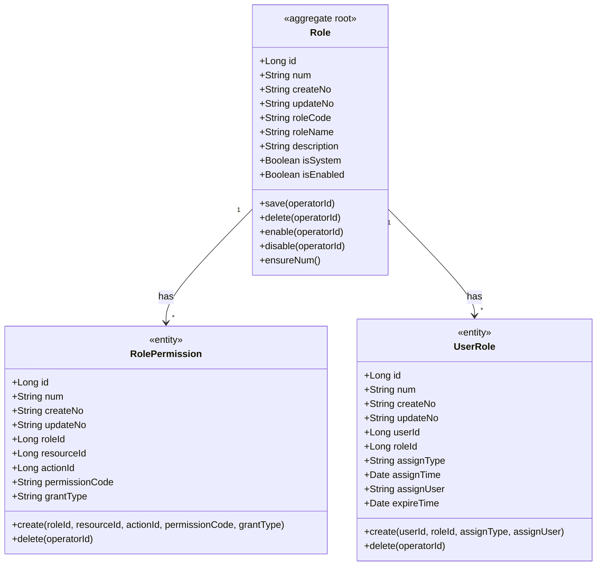
```mermaid
classDiagram
    class Role {
        <<aggregate root>>
        +Long id
        +String num
        +String createNo
        +String updateNo
        +String roleCode
        +String roleName
        +String description
        +Boolean isSystem
        +Boolean isEnabled
        +save(operatorId)
        +delete(operatorId)
        +enable(operatorId)
        +disable(operatorId)
        +ensureNum()
    }
    class RolePermission {
        <<entity>>
        +Long id
        +String num
        +String createNo
        +String updateNo
        +Long roleId
        +Long resourceId
        +Long actionId
        +String permissionCode
        +String grantType
        +create(roleId, resourceId, actionId, permissionCode, grantType)
        +delete(operatorId)
    }
    class UserRole {
        <<entity>>
        +Long id
        +String num
        +String createNo
        +String updateNo
        +Long userId
        +Long roleId
        +String assignType
        +Date assignTime
        +String assignUser
        +Date expireTime
        +create(userId, roleId, assignType, assignUser)
        +delete(operatorId)
    }
    Role "1" --> "*" RolePermission : has
    Role "1" --> "*" UserRole : has
```

| 对象 | 类型 | 属性 | 与其它对象关系 |
|------|------|------|----------------|
| Role | 聚合根 | id, num, createNo, updateNo, roleCode, roleName, description, isSystem, isEnabled | 聚合根 |
| RolePermission | 实体 | id, num, createNo, updateNo, roleId, resourceId, actionId, permissionCode, grantType | 属于 Role 聚合，通过 roleId 引用 |
| UserRole | 实体 | id, num, createNo, updateNo, userId, roleId, assignType, assignTime, assignUser, expireTime | 属于 Role 聚合，通过 roleId 引用 |

**聚合与边界**：
- Role 为聚合根，RolePermission 和 UserRole 为聚合内实体
- 跨聚合引用：resourceId 引用 PermissionResource，actionId 引用 PermissionAction，userId 引用 User
- 一致性边界：一次事务内只修改一个 Role 聚合

#### 3.2.2 领域规则

| 聚合/对象 | 规则类型 | 规则描述 | 违反时表达 |
|-----------|----------|----------|------------|
| Role | 不变性 | roleCode 全局唯一 | ROLE_CODE_ALREADY_EXISTS (1701) |
| Role | 业务规则 | 系统内置角色（isSystem=true）不可删除 | ROLE_IS_SYSTEM (1705) |
| Role | 业务规则 | 删除为逻辑删除（deleted=true） | — |
| Role | 业务规则 | num 为空时自动生成（ROLE-时间戳） | — |
| RolePermission | 不变性 | 同一角色对同一资源+动作组合唯一 | 数据库唯一索引 uk_role_resource_action |
| UserRole | 不变性 | 同一用户与同一角色关联唯一 | 数据库唯一索引 uk_user_role |
| RolePermission | 业务规则 | grantType 仅允许 ALLOW 或 DENY | — |
| UserRole | 业务规则 | assignType 默认为 DIRECT | — |

#### 3.2.3 领域动作

| 聚合/实体 | 领域动作 | 职责 | 前置条件 | 后置条件/规则 | 领域事件 |
|-----------|----------|------|----------|----------------|----------|
| Role | save(operatorId) | 保存/更新角色 | operatorId 有效 | num 已生成，createNo/updateNo 已更新 | — |
| Role | delete(operatorId) | 逻辑删除角色 | 非系统内置角色 | deleted=true，updateNo 已更新 | — |
| Role | enable(operatorId) | 启用角色 | operatorId 有效 | isEnabled=true，updateNo 已更新 | — |
| Role | disable(operatorId) | 禁用角色 | operatorId 有效 | isEnabled=false，updateNo 已更新 | — |
| Role | ensureNum() | 生成业务编号 | num 为空 | num = "ROLE-" + 当前时间戳 | — |
| RolePermission | delete(operatorId) | 逻辑删除权限关联 | operatorId 有效 | deleted=true，updateNo 已更新 | — |
| UserRole | delete(operatorId) | 逻辑删除用户角色关联 | operatorId 有效 | deleted=true，updateNo 已更新 | — |

**ensureNum() 时序图**：

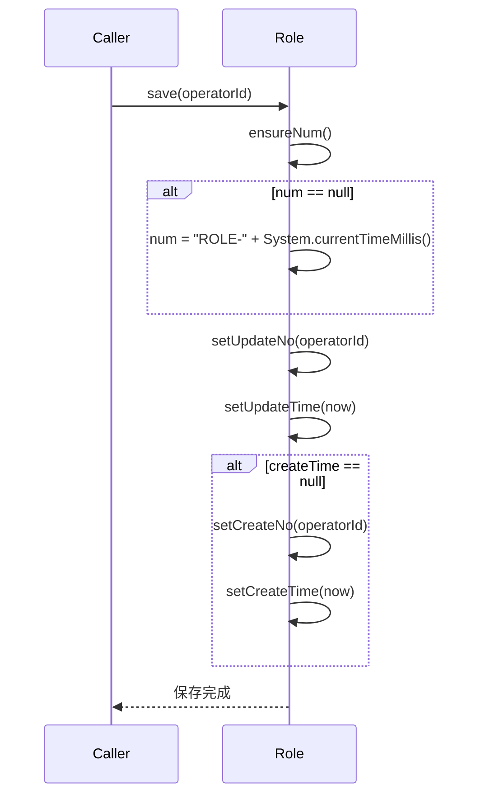
```mermaid
sequenceDiagram
    participant Caller
    participant Role
    Caller->>Role: save(operatorId)
    Role->>Role: ensureNum()
    alt num == null
        Role->>Role: num = "ROLE-" + System.currentTimeMillis()
    end
    Role->>Role: setUpdateNo(operatorId)
    Role->>Role: setUpdateTime(now)
    alt createTime == null
        Role->>Role: setCreateNo(operatorId)
        Role->>Role: setCreateTime(now)
    end
    Role-->>Caller: 保存完成
```

**delete(operatorId) - Role 时序图**：

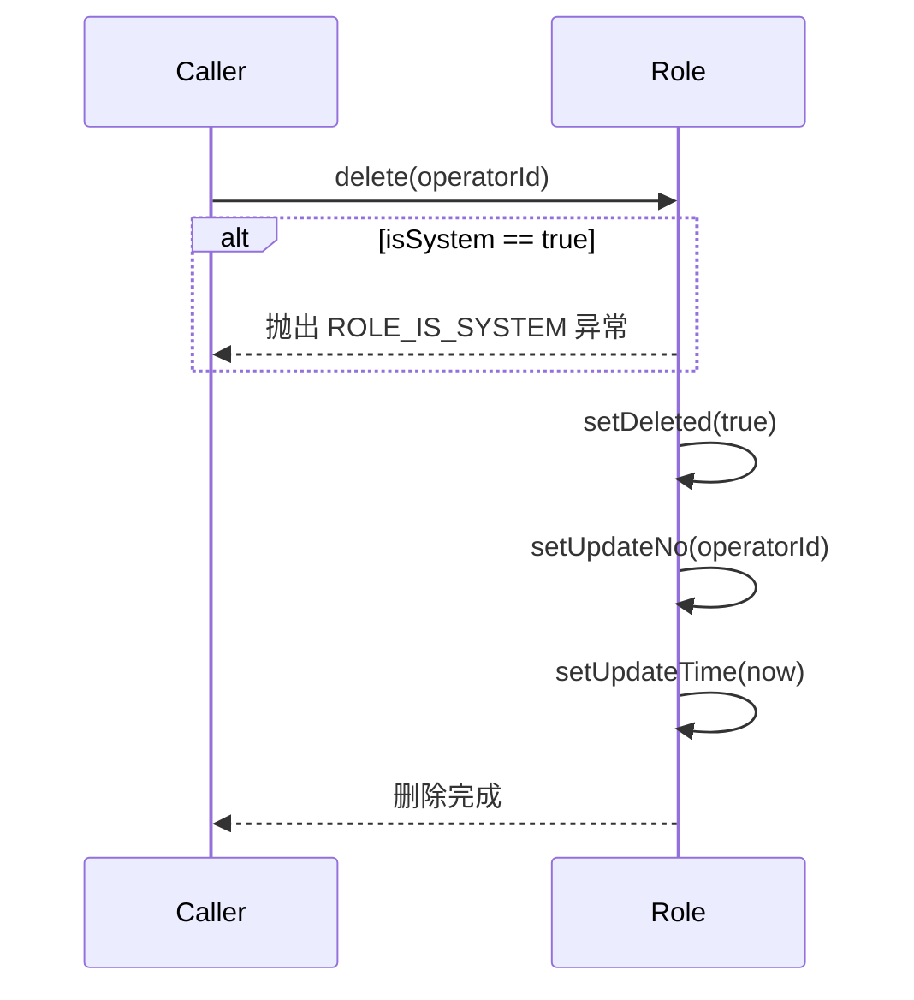
```mermaid
sequenceDiagram
    participant Caller
    participant Role
    Caller->>Role: delete(operatorId)
    alt isSystem == true
        Role-->>Caller: 抛出 ROLE_IS_SYSTEM 异常
    end
    Role->>Role: setDeleted(true)
    Role->>Role: setUpdateNo(operatorId)
    Role->>Role: setUpdateTime(now)
    Role-->>Caller: 删除完成
```

**delete(operatorId) - RolePermission 时序图**：

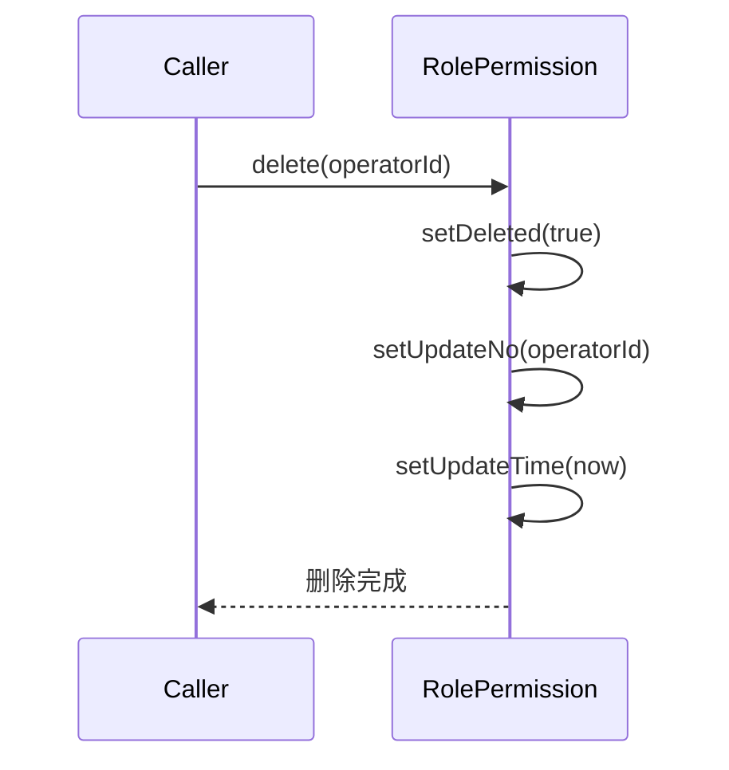
```mermaid
sequenceDiagram
    participant Caller
    participant RolePermission
    Caller->>RolePermission: delete(operatorId)
    RolePermission->>RolePermission: setDeleted(true)
    RolePermission->>RolePermission: setUpdateNo(operatorId)
    RolePermission->>RolePermission: setUpdateTime(now)
    RolePermission-->>Caller: 删除完成
```

**delete(operatorId) - UserRole 时序图**：

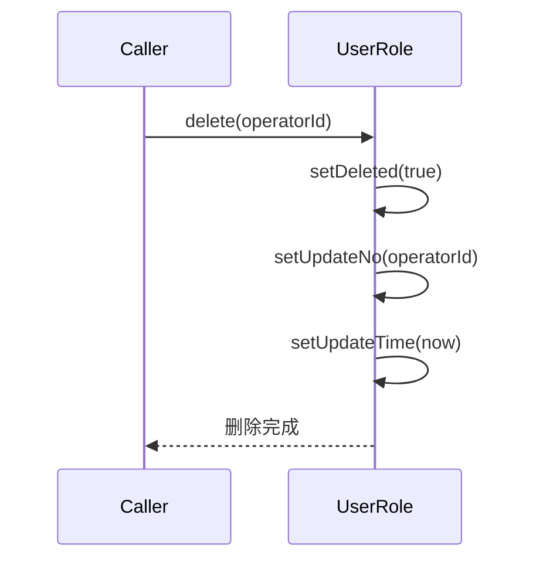
```mermaid
sequenceDiagram
    participant Caller
    participant UserRole
    Caller->>UserRole: delete(operatorId)
    UserRole->>UserRole: setDeleted(true)
    UserRole->>UserRole: setUpdateNo(operatorId)
    UserRole->>UserRole: setUpdateTime(now)
    UserRole-->>Caller: 删除完成
```

**enable/disable 时序图**：

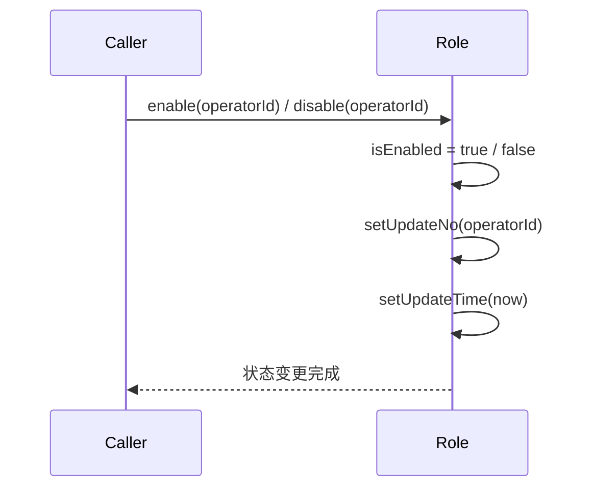
```mermaid
sequenceDiagram
    participant Caller
    participant Role
    Caller->>Role: enable(operatorId) / disable(operatorId)
    Role->>Role: isEnabled = true / false
    Role->>Role: setUpdateNo(operatorId)
    Role->>Role: setUpdateTime(now)
    Role-->>Caller: 状态变更完成
```

#### 3.2.4 领域事件

| 事件名 | 触发时机 | 载荷要点 | 可订阅方/用途 |
|--------|----------|----------|----------------|
| RoleCreatedEvent | 新建角色后 | roleNum, roleCode, roleName, operatorId, eventTime | 审计日志 |
| RoleStatusChangedEvent | 启用/禁用角色后 | roleNum, roleName, isEnabled, operatorId, eventTime | 审计日志 |
| PermissionChangedEvent | 角色权限变更后 | roleNum, resourceCode, actionCode, grantType, operatorId, eventTime | 审计日志 |
| UserRoleChangedEvent | 分配/移除用户角色后 | userNum, roleNum, assignType, operatorId, eventTime | 审计日志 |

> 注：事件定义已存在于 facade 层，本次不补充事件发布代码。

### 3.3 权限资源（permission_resource）

#### 3.3.1 领域模型

| 对象 | 类型 | 属性 | 说明 |
|------|------|------|------|
| PermissionResource | 实体 | id, num, createNo, updateNo, resourceCode, resourceName, resourceType, parentId, sortOrder | 静态数据，通过初始化脚本预置 |

权限资源为静态数据，不参与聚合边界，仅被 RolePermission 通过 resourceId 引用。

#### 3.3.2 领域规则

| 聚合/对象 | 规则类型 | 规则描述 | 违反时表达 |
|-----------|----------|----------|------------|
| PermissionResource | 不变性 | resourceCode 全局唯一 | 数据库唯一索引 uk_resource_code |
| PermissionResource | 业务规则 | 通过初始化脚本预置，不做动态 CRUD | — |

#### 3.3.3 领域动作

无。权限资源为静态数据，不需要领域动作。

#### 3.3.4 领域事件

无。

### 3.4 权限动作（permission_action）

#### 3.4.1 领域模型

| 对象 | 类型 | 属性 | 说明 |
|------|------|------|------|
| PermissionAction | 实体 | id, num, createNo, updateNo, actionCode, actionName, description | 静态数据，通过初始化脚本预置 |

#### 3.4.2 领域规则

| 聚合/对象 | 规则类型 | 规则描述 | 违反时表达 |
|-----------|----------|----------|------------|
| PermissionAction | 不变性 | actionCode 全局唯一 | 数据库唯一索引 uk_action_code |
| PermissionAction | 业务规则 | 通过初始化脚本预置，不做动态 CRUD | — |

#### 3.4.3 领域动作

无。权限动作为静态数据，不需要领域动作。

#### 3.4.4 领域事件

无。

## 4. 应用层设计

### 4.1 业务模块划分

| application 模块 | 对应领域 | 说明 |
|-----------------|----------|------|
| rbac（权限管理） | rbac | RbacCommandService + RbacQueryService |

### 4.2 权限管理（rbac）

#### 4.2.1 Service 方法清单

**RbacCommandService**：

| Service | 方法 | 职责 | 入参 | 出参 | 变更 |
|---------|------|------|------|------|------|
| RbacCommandService | createRole(param, operatorId) | 创建角色 | CreateRoleParam, Long | RoleVO | 无变更 |
| RbacCommandService | updateRole(param, operatorId) | 编辑角色（名称、描述） | UpdateRoleParam, Long | void | 无变更 |
| RbacCommandService | deleteRole(num, operatorId) | 逻辑删除角色 | String, Long | void | 无变更 |
| RbacCommandService | enableRole(num, operatorId) | 启用角色 | String, Long | void | 无变更 |
| RbacCommandService | disableRole(num, operatorId) | 禁用角色 | String, Long | void | 无变更 |
| RbacCommandService | assignUsers(param, operatorId) | 为角色批量分配用户 | AssignUsersParam, Long | void | 无变更 |
| RbacCommandService | removeUserFromRole(userId, roleId, operatorId) | 从角色移除用户 | Long, Long, Long | void | 无变更 |
| RbacCommandService | assignPermissions(param, operatorId) | 为角色配置权限（全量覆盖） | AssignPermissionsParam, Long | void | 新增 @Transactional |
| RbacCommandService | **batchAssignUsers(param, operatorId)** | 为用户批量分配角色（新增） | BatchAssignUsersParam, Long | void | **新增** |

**RbacQueryService**：

| Service | 方法 | 职责 | 入参 | 出参 | 变更 |
|---------|------|------|------|------|------|
| RbacQueryService | getRoleById(id) | 根据 ID 查询角色详情 | Long | RoleVO | 无变更 |
| RbacQueryService | getRoleByNum(num) | 根据编号查询角色详情 | String | RoleVO | 无变更 |
| RbacQueryService | listRoles(pageParam, keyword, isEnabled) | 分页查询角色列表 | PageParam, String, Boolean | IPage~RoleVO~ | 新增 userCount 填充 |
| RbacQueryService | listPermissionTree() | 查询权限资源树 | — | List~PermissionResourceVO~ | 无变更 |
| RbacQueryService | listActions() | 查询权限动作列表 | — | List~PermissionActionVO~ | 无变更 |
| RbacQueryService | getRolePermissions(roleId) | 查询角色权限列表 | Long | List~RolePermissionVO~ | 无变更 |
| RbacQueryService | getUsersByRole(pageParam, roleId) | 查询角色下的用户 | PageParam, Long | IPage~UserInRoleVO~ | 无变更 |
| RbacQueryService | getPermissionsByUserId(userId) | 查询用户的权限码列表 | Long | List~String~ | 新增去重逻辑 |
| RbacQueryService | **getPermissionMatrix(roleId)** | 查询角色权限矩阵（新增） | Long | List~PermissionMatrixVO~ | **新增** |

#### 4.2.2 方法时序逻辑

**createRole**：

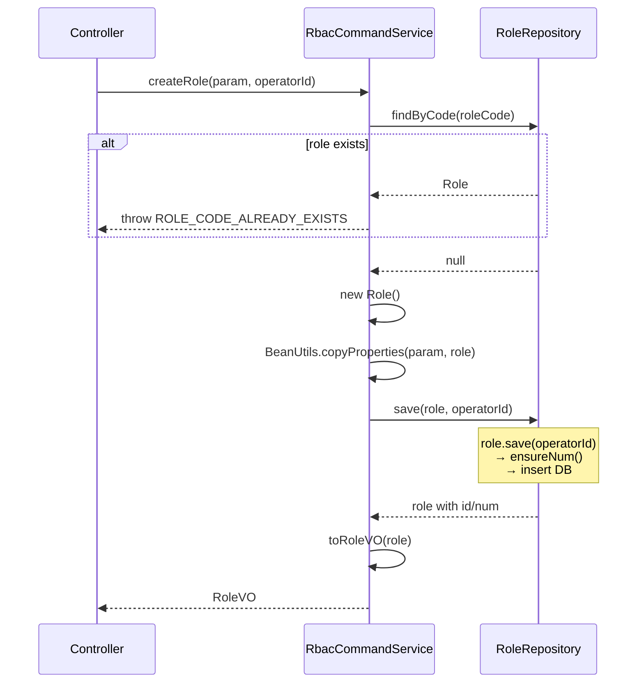
```mermaid
sequenceDiagram
    participant Controller
    participant RbacCommandService
    participant RoleRepository
    Controller->>RbacCommandService: createRole(param, operatorId)
    RbacCommandService->>RoleRepository: findByCode(roleCode)
    alt role exists
        RoleRepository-->>RbacCommandService: Role
        RbacCommandService-->>Controller: throw ROLE_CODE_ALREADY_EXISTS
    end
    RoleRepository-->>RbacCommandService: null
    RbacCommandService->>RbacCommandService: new Role()
    RbacCommandService->>RbacCommandService: BeanUtils.copyProperties(param, role)
    RbacCommandService->>RoleRepository: save(role, operatorId)
    Note over RoleRepository: role.save(operatorId)<br/>→ ensureNum()<br/>→ insert DB
    RoleRepository-->>RbacCommandService: role with id/num
    RbacCommandService->>RbacCommandService: toRoleVO(role)
    RbacCommandService-->>Controller: RoleVO
```

**updateRole**：

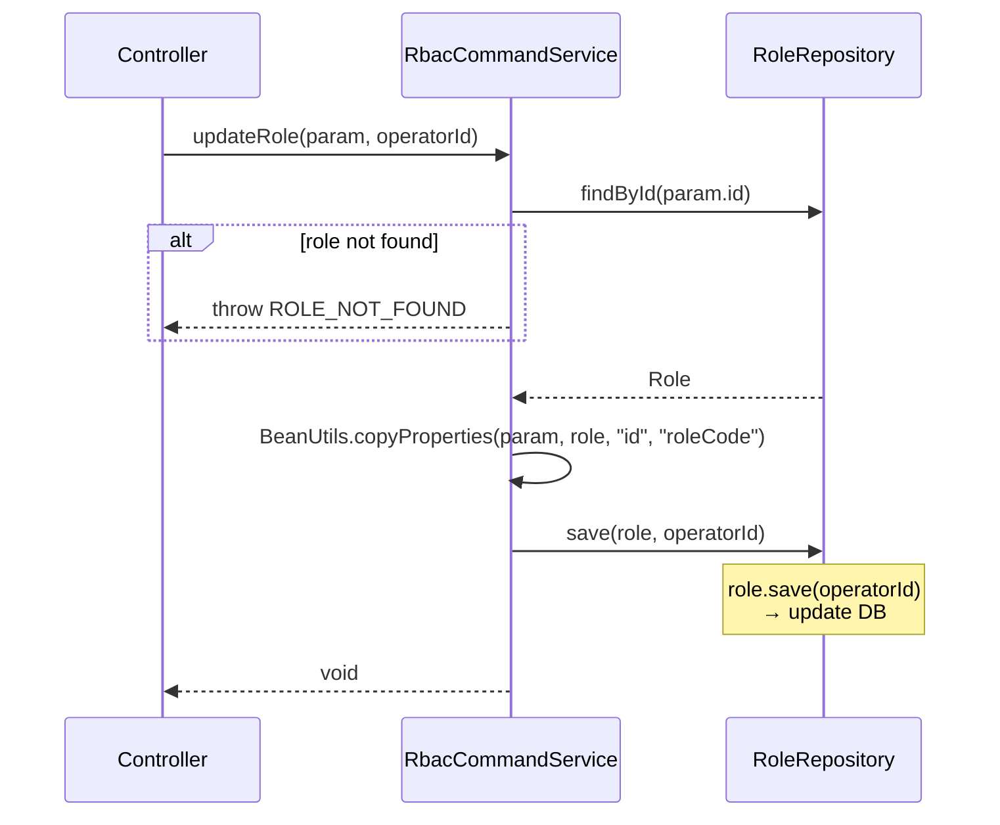
```mermaid
sequenceDiagram
    participant Controller
    participant RbacCommandService
    participant RoleRepository
    Controller->>RbacCommandService: updateRole(param, operatorId)
    RbacCommandService->>RoleRepository: findById(param.id)
    alt role not found
        RbacCommandService-->>Controller: throw ROLE_NOT_FOUND
    end
    RoleRepository-->>RbacCommandService: Role
    RbacCommandService->>RbacCommandService: BeanUtils.copyProperties(param, role, "id", "roleCode")
    RbacCommandService->>RoleRepository: save(role, operatorId)
    Note over RoleRepository: role.save(operatorId)<br/>→ update DB
    RbacCommandService-->>Controller: void
```

**deleteRole**：

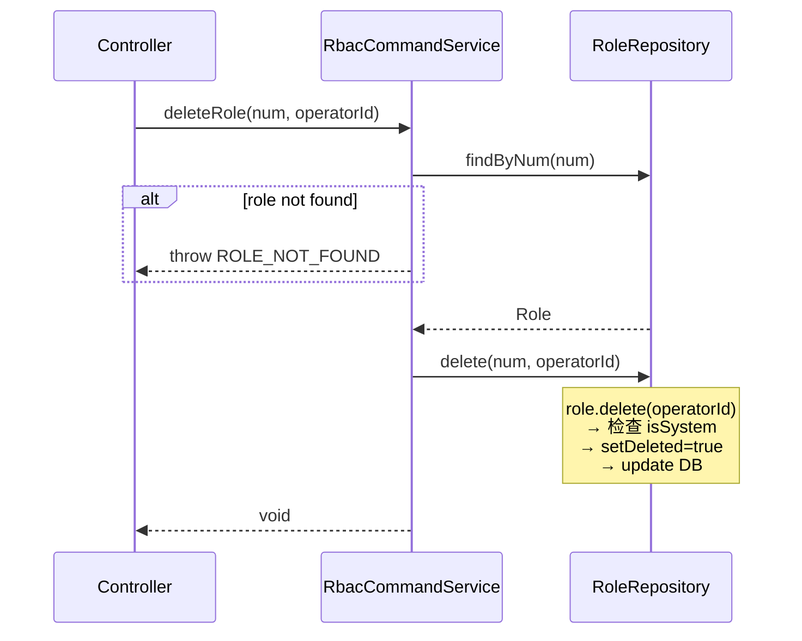
```mermaid
sequenceDiagram
    participant Controller
    participant RbacCommandService
    participant RoleRepository
    Controller->>RbacCommandService: deleteRole(num, operatorId)
    RbacCommandService->>RoleRepository: findByNum(num)
    alt role not found
        RbacCommandService-->>Controller: throw ROLE_NOT_FOUND
    end
    RoleRepository-->>RbacCommandService: Role
    RbacCommandService->>RoleRepository: delete(num, operatorId)
    Note over RoleRepository: role.delete(operatorId)<br/>→ 检查 isSystem<br/>→ setDeleted=true<br/>→ update DB
    RbacCommandService-->>Controller: void
```

**enableRole / disableRole**：

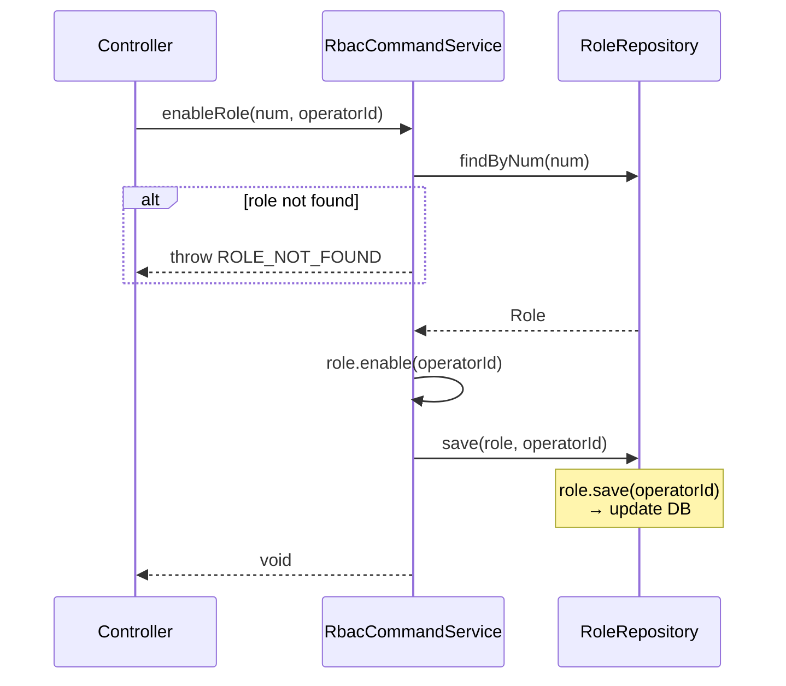
```mermaid
sequenceDiagram
    participant Controller
    participant RbacCommandService
    participant RoleRepository
    Controller->>RbacCommandService: enableRole(num, operatorId)
    RbacCommandService->>RoleRepository: findByNum(num)
    alt role not found
        RbacCommandService-->>Controller: throw ROLE_NOT_FOUND
    end
    RoleRepository-->>RbacCommandService: Role
    RbacCommandService->>RbacCommandService: role.enable(operatorId)
    RbacCommandService->>RoleRepository: save(role, operatorId)
    Note over RoleRepository: role.save(operatorId)<br/>→ update DB
    RbacCommandService-->>Controller: void
```

**assignUsers**：

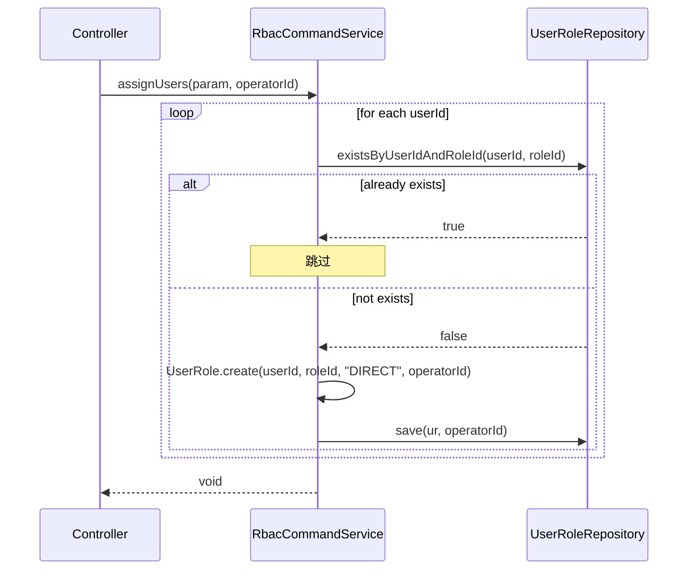
```mermaid
sequenceDiagram
    participant Controller
    participant RbacCommandService
    participant UserRoleRepository
    Controller->>RbacCommandService: assignUsers(param, operatorId)
    loop for each userId
        RbacCommandService->>UserRoleRepository: existsByUserIdAndRoleId(userId, roleId)
        alt already exists
            UserRoleRepository-->>RbacCommandService: true
            Note over RbacCommandService: 跳过
        else not exists
            UserRoleRepository-->>RbacCommandService: false
            RbacCommandService->>RbacCommandService: UserRole.create(userId, roleId, "DIRECT", operatorId)
            RbacCommandService->>UserRoleRepository: save(ur, operatorId)
        end
    end
    RbacCommandService-->>Controller: void
```

**removeUserFromRole**：

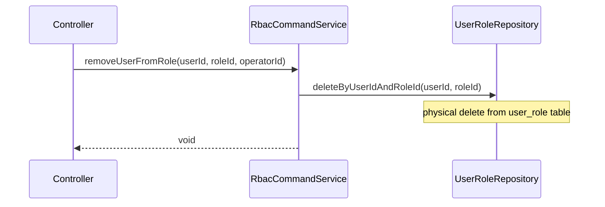
```mermaid
sequenceDiagram
    participant Controller
    participant RbacCommandService
    participant UserRoleRepository
    Controller->>RbacCommandService: removeUserFromRole(userId, roleId, operatorId)
    RbacCommandService->>UserRoleRepository: deleteByUserIdAndRoleId(userId, roleId)
    Note over UserRoleRepository: physical delete from user_role table
    RbacCommandService-->>Controller: void
```

**assignPermissions**（新增 @Transactional）：

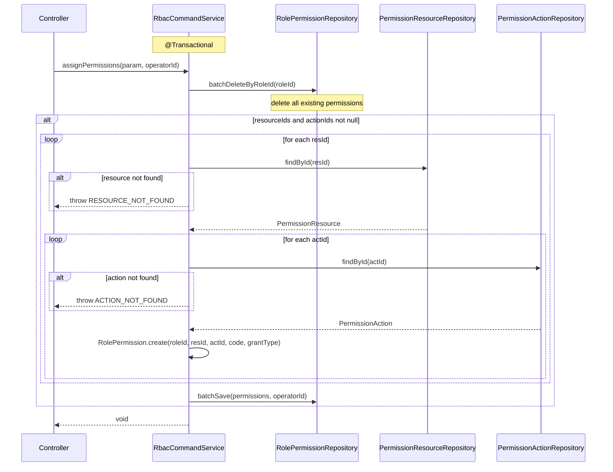
```mermaid
sequenceDiagram
    participant Controller
    participant RbacCommandService
    participant RolePermissionRepository
    participant PermissionResourceRepository
    participant PermissionActionRepository
    Note over RbacCommandService: @Transactional
    Controller->>RbacCommandService: assignPermissions(param, operatorId)
    RbacCommandService->>RolePermissionRepository: batchDeleteByRoleId(roleId)
    Note over RolePermissionRepository: delete all existing permissions
    alt resourceIds and actionIds not null
        loop for each resId
            RbacCommandService->>PermissionResourceRepository: findById(resId)
            alt resource not found
                RbacCommandService-->>Controller: throw RESOURCE_NOT_FOUND
            end
            PermissionResourceRepository-->>RbacCommandService: PermissionResource
            loop for each actId
                RbacCommandService->>PermissionActionRepository: findById(actId)
                alt action not found
                    RbacCommandService-->>Controller: throw ACTION_NOT_FOUND
                end
                PermissionActionRepository-->>RbacCommandService: PermissionAction
                RbacCommandService->>RbacCommandService: RolePermission.create(roleId, resId, actId, code, grantType)
            end
        end
        RbacCommandService->>RolePermissionRepository: batchSave(permissions, operatorId)
    end
    RbacCommandService-->>Controller: void
```

**batchAssignUsers**（新增方法）：

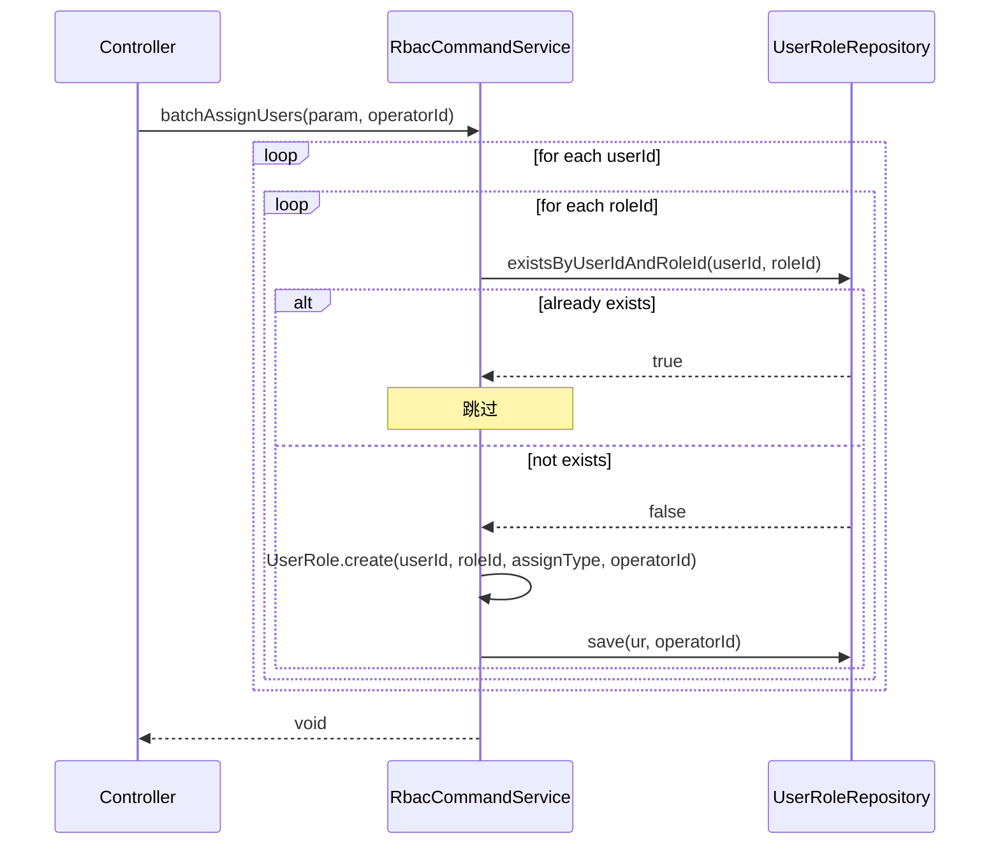
```mermaid
sequenceDiagram
    participant Controller
    participant RbacCommandService
    participant UserRoleRepository
    Controller->>RbacCommandService: batchAssignUsers(param, operatorId)
    loop for each userId
        loop for each roleId
            RbacCommandService->>UserRoleRepository: existsByUserIdAndRoleId(userId, roleId)
            alt already exists
                UserRoleRepository-->>RbacCommandService: true
                Note over RbacCommandService: 跳过
            else not exists
                UserRoleRepository-->>RbacCommandService: false
                RbacCommandService->>RbacCommandService: UserRole.create(userId, roleId, assignType, operatorId)
                RbacCommandService->>UserRoleRepository: save(ur, operatorId)
            end
        end
    end
    RbacCommandService-->>Controller: void
```

**listRoles**（新增 userCount 填充）：

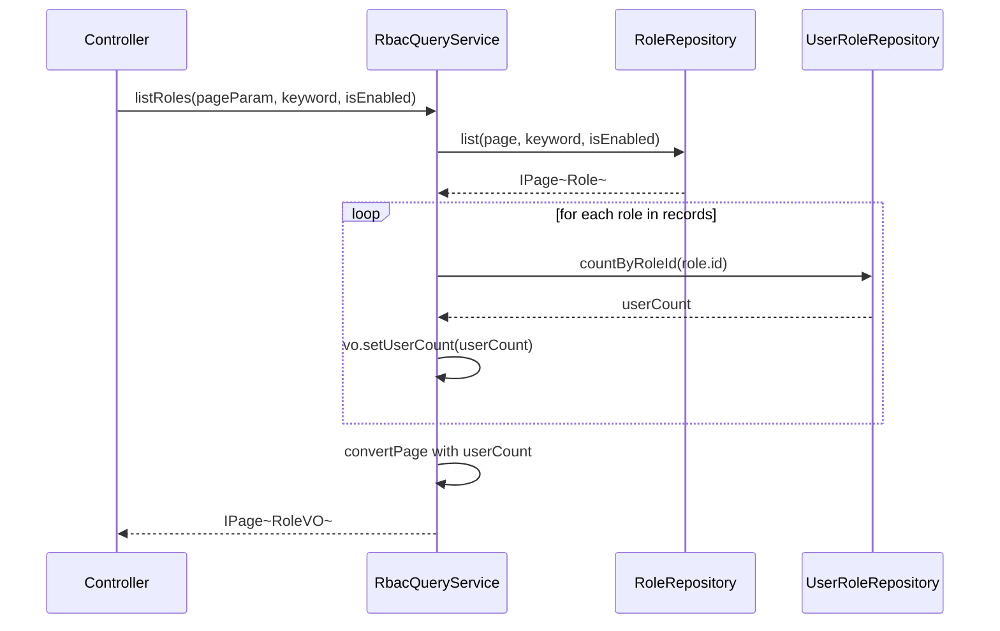
```mermaid
sequenceDiagram
    participant Controller
    participant RbacQueryService
    participant RoleRepository
    participant UserRoleRepository
    Controller->>RbacQueryService: listRoles(pageParam, keyword, isEnabled)
    RbacQueryService->>RoleRepository: list(page, keyword, isEnabled)
    RoleRepository-->>RbacQueryService: IPage~Role~
    loop for each role in records
        RbacQueryService->>UserRoleRepository: countByRoleId(role.id)
        UserRoleRepository-->>RbacQueryService: userCount
        RbacQueryService->>RbacQueryService: vo.setUserCount(userCount)
    end
    RbacQueryService->>RbacQueryService: convertPage with userCount
    RbacQueryService-->>Controller: IPage~RoleVO~
```

**getPermissionsByUserId**（新增去重）：

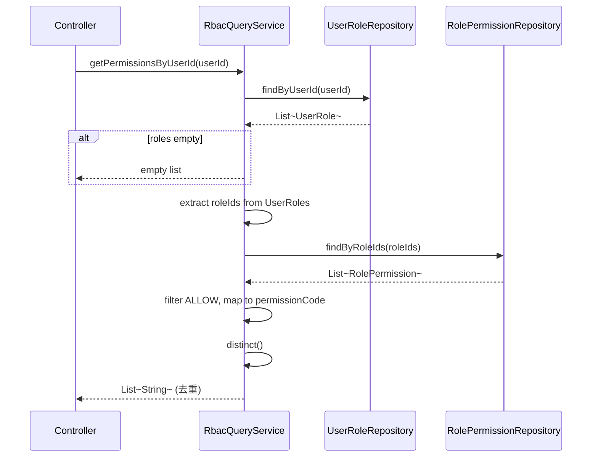
```mermaid
sequenceDiagram
    participant Controller
    participant RbacQueryService
    participant UserRoleRepository
    participant RolePermissionRepository
    Controller->>RbacQueryService: getPermissionsByUserId(userId)
    RbacQueryService->>UserRoleRepository: findByUserId(userId)
    UserRoleRepository-->>RbacQueryService: List~UserRole~
    alt roles empty
        RbacQueryService-->>Controller: empty list
    end
    RbacQueryService->>RbacQueryService: extract roleIds from UserRoles
    RbacQueryService->>RolePermissionRepository: findByRoleIds(roleIds)
    RolePermissionRepository-->>RbacQueryService: List~RolePermission~
    RbacQueryService->>RbacQueryService: filter ALLOW, map to permissionCode
    RbacQueryService->>RbacQueryService: distinct()
    RbacQueryService-->>Controller: List~String~ (去重)
```

**getPermissionMatrix**（新增方法）：

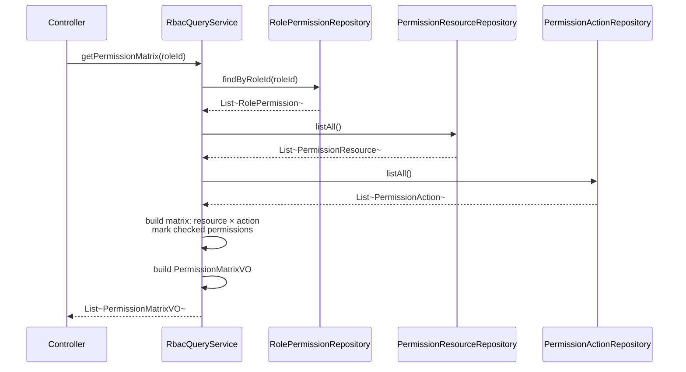
```mermaid
sequenceDiagram
    participant Controller
    participant RbacQueryService
    participant RolePermissionRepository
    participant PermissionResourceRepository
    participant PermissionActionRepository
    Controller->>RbacQueryService: getPermissionMatrix(roleId)
    RbacQueryService->>RolePermissionRepository: findByRoleId(roleId)
    RolePermissionRepository-->>RbacQueryService: List~RolePermission~
    RbacQueryService->>PermissionResourceRepository: listAll()
    PermissionResourceRepository-->>RbacQueryService: List~PermissionResource~
    RbacQueryService->>PermissionActionRepository: listAll()
    PermissionActionRepository-->>RbacQueryService: List~PermissionAction~
    RbacQueryService->>RbacQueryService: build matrix: resource × action<br/>mark checked permissions
    RbacQueryService->>RbacQueryService: build PermissionMatrixVO
    RbacQueryService-->>Controller: List~PermissionMatrixVO~
```

## 5. 控制器/Adapter 层设计

### 5.1 业务模块划分

| Controller | 对应应用层模块 | 说明 |
|-----------|----------------|------|
| RbacCommandController | rbac | POST 写操作接口（角色 CRUD、用户分配、权限配置） |
| RbacQueryController | rbac | GET 查询接口（角色列表、权限树、权限矩阵等） |

### 5.2 权限管理（rbac）

#### 5.2.1 Controller 接口清单

**RbacCommandController**（POST 写操作）：

| HTTP | 路径 | 入参 JSON | 返回值 JSON | 职责 |
|------|------|-----------|-------------|------|
| POST | /api/rbac/command/role/create | `{"roleCode": "ADMIN", "roleName": "管理员", "description": "..."}` | `{"code": 0, "data": {"id": 1, "num": "ROLE-xxx", "roleCode": "ADMIN", ...}}` | 创建角色 |
| POST | /api/rbac/command/role/update | `{"id": 1, "roleName": "高级管理员", "description": "..."}` | `{"code": 0}` | 编辑角色 |
| POST | /api/rbac/command/role/delete | num=ROLE-xxx | `{"code": 0}` | 删除角色 |
| POST | /api/rbac/command/role/enable | num=ROLE-xxx | `{"code": 0}` | 启用角色 |
| POST | /api/rbac/command/role/disable | num=ROLE-xxx | `{"code": 0}` | 禁用角色 |
| POST | /api/rbac/command/role/assign-users | `{"roleId": 1, "userIds": [1, 2, 3]}` | `{"code": 0}` | 为角色分配用户 |
| POST | /api/rbac/command/role/remove-user | userId=1&roleId=1 | `{"code": 0}` | 从角色移除用户 |
| POST | /api/rbac/command/role/assign-permissions | `{"roleId": 1, "resourceIds": [1,2], "actionIds": [1,2], "grantType": "ALLOW"}` | `{"code": 0}` | 配置角色权限 |

**RbacQueryController**（GET 查询）：

| HTTP | 路径 | 入参 | 返回值 JSON | 职责 |
|------|------|------|-------------|------|
| GET | /api/rbac/query/role/get | id=1 | `{"code": 0, "data": {"id": 1, "roleCode": "ADMIN", ...}}` | 根据 ID 查询角色 |
| GET | /api/rbac/query/role/detail | num=ROLE-xxx | `{"code": 0, "data": {...}}` | 根据编号查询角色 |
| GET | /api/rbac/query/role/list | pageNo=1&pageSize=20&keyword=admin&isEnabled=true | `{"code": 0, "data": {"records": [...], "total": 5, "current": 1, "size": 20}}` | 分页查询角色列表 |
| GET | /api/rbac/query/permissions/tree | — | `{"code": 0, "data": [{"id": 1, "resourceCode": "home", "children": [...]}]}` | 查询权限资源树 |
| GET | /api/rbac/query/permissions/actions | — | `{"code": 0, "data": [{"actionCode": "read", "actionName": "查看"}, ...]}` | 查询权限动作列表 |
| GET | /api/rbac/query/role/permissions | roleId=1 | `{"code": 0, "data": [{"roleId": 1, "resourceCode": "home", "actionCode": "read", ...}]}` | 查询角色权限列表 |
| GET | /api/rbac/query/role/users | pageNo=1&pageSize=20&roleId=1 | `{"code": 0, "data": {"records": [{"userId": 1, "assignType": "DIRECT", ...}], "total": 3}}` | 查询角色下的用户 |
| GET | /api/rbac/query/user/permissions | userId=1 | `{"code": 0, "data": ["home:read", "agent:list", ...]}` | 查询用户权限码（去重） |
| **GET** | **/api/rbac/query/role/permission-matrix** | **roleId=1** | **`{"code": 0, "data": [{"roleId": 1, "roleCode": "ADMIN", "resources": [{"id": 1, "resourceCode": "home", "checkedActions": ["read"], "children": [...]}]}]}`** | **查询角色权限矩阵（新增）** |

#### 5.2.2 接口时序逻辑

**POST /api/rbac/command/role/create**：

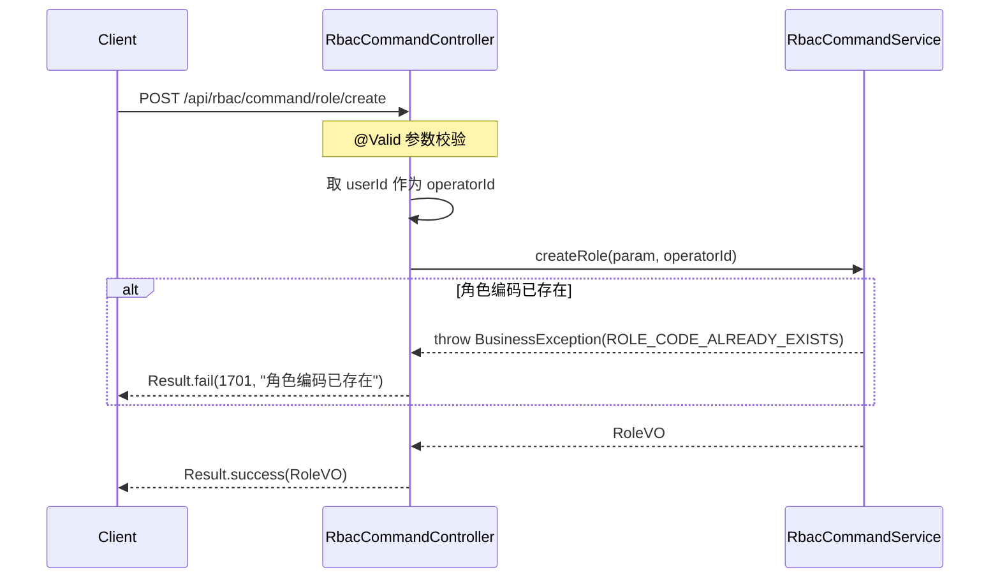
```mermaid
sequenceDiagram
    participant Client
    participant RbacCommandController
    participant RbacCommandService
    Client->>RbacCommandController: POST /api/rbac/command/role/create
    Note over RbacCommandController: @Valid 参数校验
    RbacCommandController->>RbacCommandController: 取 userId 作为 operatorId
    RbacCommandController->>RbacCommandService: createRole(param, operatorId)
    alt 角色编码已存在
        RbacCommandService-->>RbacCommandController: throw BusinessException(ROLE_CODE_ALREADY_EXISTS)
        RbacCommandController-->>Client: Result.fail(1701, "角色编码已存在")
    end
    RbacCommandService-->>RbacCommandController: RoleVO
    RbacCommandController-->>Client: Result.success(RoleVO)
```

**POST /api/rbac/command/role/update**：

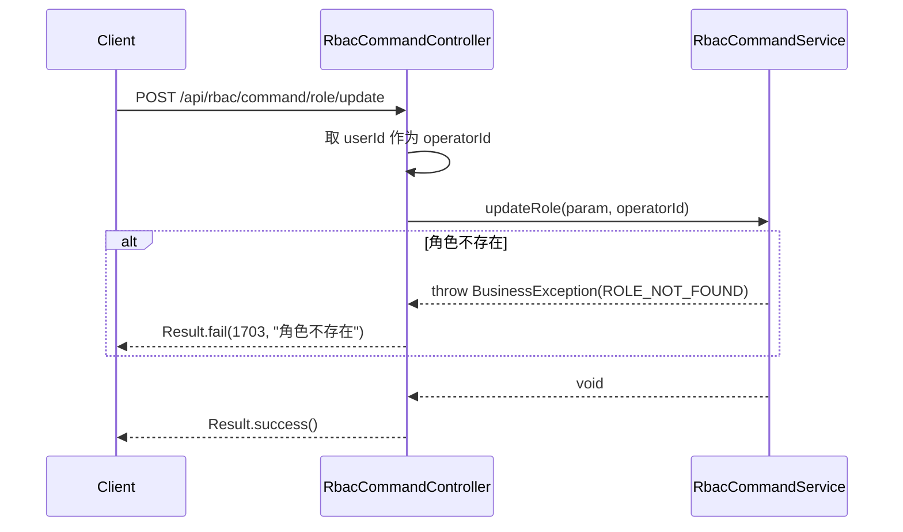
```mermaid
sequenceDiagram
    participant Client
    participant RbacCommandController
    participant RbacCommandService
    Client->>RbacCommandController: POST /api/rbac/command/role/update
    RbacCommandController->>RbacCommandController: 取 userId 作为 operatorId
    RbacCommandController->>RbacCommandService: updateRole(param, operatorId)
    alt 角色不存在
        RbacCommandService-->>RbacCommandController: throw BusinessException(ROLE_NOT_FOUND)
        RbacCommandController-->>Client: Result.fail(1703, "角色不存在")
    end
    RbacCommandService-->>RbacCommandController: void
    RbacCommandController-->>Client: Result.success()
```

**POST /api/rbac/command/role/delete**：

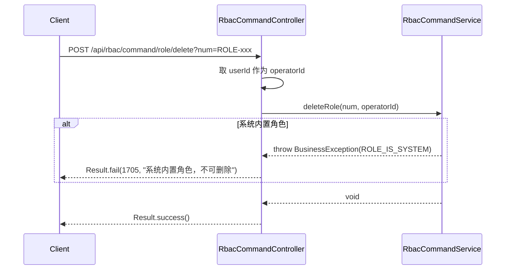
```mermaid
sequenceDiagram
    participant Client
    participant RbacCommandController
    participant RbacCommandService
    Client->>RbacCommandController: POST /api/rbac/command/role/delete?num=ROLE-xxx
    RbacCommandController->>RbacCommandController: 取 userId 作为 operatorId
    RbacCommandController->>RbacCommandService: deleteRole(num, operatorId)
    alt 系统内置角色
        RbacCommandService-->>RbacCommandController: throw BusinessException(ROLE_IS_SYSTEM)
        RbacCommandController-->>Client: Result.fail(1705, "系统内置角色，不可删除")
    end
    RbacCommandService-->>RbacCommandController: void
    RbacCommandController-->>Client: Result.success()
```

**POST /api/rbac/command/role/enable**：

```mermaid
sequenceDiagram
    participant Client
    participant RbacCommandController
    participant RbacCommandService
    Client->>RbacCommandController: POST /api/rbac/command/role/enable?num=ROLE-xxx
    RbacCommandController->>RbacCommandController: 取 userId 作为 operatorId
    RbacCommandController->>RbacCommandService: enableRole(num, operatorId)
    alt 角色不存在
        RbacCommandService-->>RbacCommandController: throw BusinessException(ROLE_NOT_FOUND)
    end
    RbacCommandService-->>RbacCommandController: void
    RbacCommandController-->>Client: Result.success()
```

**POST /api/rbac/command/role/disable**：

```mermaid
sequenceDiagram
    participant Client
    participant RbacCommandController
    participant RbacCommandService
    Client->>RbacCommandController: POST /api/rbac/command/role/disable?num=ROLE-xxx
    RbacCommandController->>RbacCommandController: 取 userId 作为 operatorId
    RbacCommandController->>RbacCommandService: disableRole(num, operatorId)
    alt 角色不存在
        RbacCommandService-->>RbacCommandController: throw BusinessException(ROLE_NOT_FOUND)
    end
    RbacCommandService-->>RbacCommandController: void
    RbacCommandController-->>Client: Result.success()
```

**POST /api/rbac/command/role/assign-users**：

```mermaid
sequenceDiagram
    participant Client
    participant RbacCommandController
    participant RbacCommandService
    Client->>RbacCommandController: POST /api/rbac/command/role/assign-users
    Note over RbacCommandController: @Valid 校验 roleId/userIds 非空
    RbacCommandController->>RbacCommandController: 取 userId 作为 operatorId
    RbacCommandController->>RbacCommandService: assignUsers(param, operatorId)
    RbacCommandService-->>RbacCommandController: void
    RbacCommandController-->>Client: Result.success()
```

**POST /api/rbac/command/role/remove-user**：

```mermaid
sequenceDiagram
    participant Client
    participant RbacCommandController
    participant RbacCommandService
    Client->>RbacCommandController: POST /api/rbac/command/role/remove-user?userId=1&roleId=1
    RbacCommandController->>RbacCommandController: 取 userId 作为 operatorId
    RbacCommandController->>RbacCommandService: removeUserFromRole(userId, roleId, operatorId)
    RbacCommandService-->>RbacCommandController: void
    RbacCommandController-->>Client: Result.success()
```

**POST /api/rbac/command/role/assign-permissions**：

```mermaid
sequenceDiagram
    participant Client
    participant RbacCommandController
    participant RbacCommandService
    Client->>RbacCommandController: POST /api/rbac/command/role/assign-permissions
    Note over RbacCommandController: @Valid 校验 roleId 非空
    RbacCommandController->>RbacCommandController: 取 userId 作为 operatorId
    RbacCommandController->>RbacCommandService: assignPermissions(param, operatorId)
    alt 资源不存在
        RbacCommandService-->>RbacCommandController: throw BusinessException(RESOURCE_NOT_FOUND)
        RbacCommandController-->>Client: Result.fail(1706, "权限资源不存在")
    end
    alt 动作不存在
        RbacCommandService-->>RbacCommandController: throw BusinessException(ACTION_NOT_FOUND)
        RbacCommandController-->>Client: Result.fail(1707, "权限操作不存在")
    end
    RbacCommandService-->>RbacCommandController: void
    RbacCommandController-->>Client: Result.success()
```

**GET /api/rbac/query/role/list**：

```mermaid
sequenceDiagram
    participant Client
    participant RbacQueryController
    participant RbacQueryService
    Client->>RbacQueryController: GET /api/rbac/query/role/list?pageNo=1&pageSize=20&keyword=admin
    RbacQueryController->>RbacQueryService: listRoles(pageParam, keyword, isEnabled)
    RbacQueryService-->>RbacQueryController: IPage~RoleVO~ (含 userCount)
    RbacQueryController->>RbacQueryController: PageResult.of(records, total, current, size)
    RbacQueryController-->>Client: Result.success(PageResult)
```

**GET /api/rbac/query/permissions/tree**：

```mermaid
sequenceDiagram
    participant Client
    participant RbacQueryController
    participant RbacQueryService
    Client->>RbacQueryController: GET /api/rbac/query/permissions/tree
    RbacQueryController->>RbacQueryService: listPermissionTree()
    RbacQueryService-->>RbacQueryController: List~PermissionResourceVO~ (树形)
    RbacQueryController-->>Client: Result.success(List)
```

**GET /api/rbac/query/permissions/actions**：

```mermaid
sequenceDiagram
    participant Client
    participant RbacQueryController
    participant RbacQueryService
    Client->>RbacQueryController: GET /api/rbac/query/permissions/actions
    RbacQueryController->>RbacQueryService: listActions()
    RbacQueryService-->>RbacQueryController: List~PermissionActionVO~
    RbacQueryController-->>Client: Result.success(List)
```

**GET /api/rbac/query/role/permissions**：

```mermaid
sequenceDiagram
    participant Client
    participant RbacQueryController
    participant RbacQueryService
    Client->>RbacQueryController: GET /api/rbac/query/role/permissions?roleId=1
    RbacQueryController->>RbacQueryService: getRolePermissions(roleId)
    RbacQueryService-->>RbacQueryController: List~RolePermissionVO~
    RbacQueryController-->>Client: Result.success(List)
```

**GET /api/rbac/query/role/users**：

```mermaid
sequenceDiagram
    participant Client
    participant RbacQueryController
    participant RbacQueryService
    Client->>RbacQueryController: GET /api/rbac/query/role/users?pageNo=1&pageSize=20&roleId=1
    RbacQueryController->>RbacQueryService: getUsersByRole(pageParam, roleId)
    RbacQueryService-->>RbacQueryController: IPage~UserInRoleVO~
    RbacQueryController->>RbacQueryController: PageResult.of(records, total, current, size)
    RbacQueryController-->>Client: Result.success(PageResult)
```

**GET /api/rbac/query/user/permissions**：

```mermaid
sequenceDiagram
    participant Client
    participant RbacQueryController
    participant RbacQueryService
    Client->>RbacQueryController: GET /api/rbac/query/user/permissions?userId=1
    RbacQueryController->>RbacQueryService: getPermissionsByUserId(userId)
    RbacQueryService-->>RbacQueryController: List~String~ (去重)
    RbacQueryController-->>Client: Result.success(List)
```

**GET /api/rbac/query/role/permission-matrix**（新增）：

```mermaid
sequenceDiagram
    participant Client
    participant RbacQueryController
    participant RbacQueryService
    Client->>RbacQueryController: GET /api/rbac/query/role/permission-matrix?roleId=1
    RbacQueryController->>RbacQueryService: getPermissionMatrix(roleId)
    RbacQueryService-->>RbacQueryController: List~PermissionMatrixVO~
    RbacQueryController-->>Client: Result.success(List)
```

## 6. 数据库设计

### 6.1 表结构

所有 RBAC 表已存在于 init.sql 中，本次需修正时间字段精度为毫秒。

| 表名 | 对应领域 | 主要字段 | 索引 |
|------|----------|----------|------|
| role | Role 聚合根 | **id(PK, BIGINT AI)**, role_code, role_name, description, is_system, is_enabled, num, create_no, update_no, **create_time(DATETIME(3))**, **update_time(DATETIME(3))**, deleted | uk_role_code(role_code), idx_is_enabled(is_enabled) |
| permission_resource | PermissionResource 实体 | **id(PK, BIGINT AI)**, resource_code, resource_name, resource_type, parent_id, sort_order, num, create_no, update_no, **create_time(DATETIME(3))**, **update_time(DATETIME(3))**, deleted | uk_resource_code(resource_code), idx_parent_id(parent_id), idx_resource_type(resource_type) |
| permission_action | PermissionAction 实体 | **id(PK, BIGINT AI)**, action_code, action_name, description, num, create_no, update_no, **create_time(DATETIME(3))**, **update_time(DATETIME(3))**, deleted | uk_action_code(action_code) |
| role_permission | RolePermission 实体 | **id(PK, BIGINT AI)**, role_id(BIGINT), resource_id(BIGINT), action_id(BIGINT), permission_code, grant_type, num, create_no, update_no, **create_time(DATETIME(3))**, **update_time(DATETIME(3))**, deleted | uk_role_resource_action(role_id, resource_id, action_id), idx_role_id(role_id), idx_permission_code(permission_code) |
| user_role | UserRole 实体 | **id(PK, BIGINT AI)**, user_id(BIGINT), role_id(BIGINT), assign_type, assign_time, assign_user, expire_time, num, create_no, update_no, **create_time(DATETIME(3))**, **update_time(DATETIME(3))**, deleted | uk_user_role(user_id, role_id), idx_role_id(role_id), idx_expire_time(expire_time) |

### 6.2 DDL 语句（时间字段精度修正）

```sql
-- 修正 role 表时间字段为毫秒精度
ALTER TABLE `role` MODIFY COLUMN `create_time` DATETIME(3) DEFAULT CURRENT_TIMESTAMP(3) COMMENT '创建时间';
ALTER TABLE `role` MODIFY COLUMN `update_time` DATETIME(3) DEFAULT CURRENT_TIMESTAMP(3) ON UPDATE CURRENT_TIMESTAMP(3) COMMENT '更新时间';

-- 修正 permission_resource 表时间字段为毫秒精度
ALTER TABLE `permission_resource` MODIFY COLUMN `create_time` DATETIME(3) DEFAULT CURRENT_TIMESTAMP(3) COMMENT '创建时间';
ALTER TABLE `permission_resource` MODIFY COLUMN `update_time` DATETIME(3) DEFAULT CURRENT_TIMESTAMP(3) ON UPDATE CURRENT_TIMESTAMP(3) COMMENT '更新时间';

-- 修正 permission_action 表时间字段为毫秒精度
ALTER TABLE `permission_action` MODIFY COLUMN `create_time` DATETIME(3) DEFAULT CURRENT_TIMESTAMP(3) COMMENT '创建时间';
ALTER TABLE `permission_action` MODIFY COLUMN `update_time` DATETIME(3) DEFAULT CURRENT_TIMESTAMP(3) ON UPDATE CURRENT_TIMESTAMP(3) COMMENT '更新时间';

-- 修正 role_permission 表时间字段为毫秒精度
ALTER TABLE `role_permission` MODIFY COLUMN `create_time` DATETIME(3) DEFAULT CURRENT_TIMESTAMP(3) COMMENT '创建时间';
ALTER TABLE `role_permission` MODIFY COLUMN `update_time` DATETIME(3) DEFAULT CURRENT_TIMESTAMP(3) ON UPDATE CURRENT_TIMESTAMP(3) COMMENT '更新时间';

-- 修正 user_role 表时间字段为毫秒精度
ALTER TABLE `user_role` MODIFY COLUMN `create_time` DATETIME(3) DEFAULT CURRENT_TIMESTAMP(3) COMMENT '创建时间';
ALTER TABLE `user_role` MODIFY COLUMN `update_time` DATETIME(3) DEFAULT CURRENT_TIMESTAMP(3) ON UPDATE CURRENT_TIMESTAMP(3) COMMENT '更新时间';
```

### 6.3 索引建议

| 表 | 查询场景 | 建议索引 |
|------|----------|----------|
| role | 按角色编码查询 | uk_role_code（已有） |
| role | 按关键词搜索（编码/名称） | 现有 LIKE 查询，数据量大时考虑全文索引 |
| role_permission | 按角色 ID 查询权限 | idx_role_id（已有） |
| role_permission | 按角色 ID + 资源 ID + 动作 ID 唯一性 | uk_role_resource_action（已有） |
| user_role | 按角色 ID 分页查询成员 | idx_role_id（已有） |
| user_role | 按用户 ID 查询角色 | uk_user_role（已有，联合索引可覆盖） |

## 7. 模块变更清单

| 层级 | 变更项 | 变更类型 | 对应 Skill |
|------|--------|----------|------------|
| facade | 无变更 | — | — |
| client | 无变更（BatchAssignUsersParam、PermissionMatrixVO 已存在） | — | — |
| domain | Role 增加 `ensureNum()` 私有方法 | 修改 | impl-domain-module |
| domain | RolePermission 增加 `delete(operatorId)` 方法 | 新增 | impl-domain-module |
| domain | UserRole 增加 `delete(operatorId)` 方法 | 新增 | impl-domain-module |
| infra | 无变更（Entity/Mapper 无需改动） | — | — |
| application | RbacCommandService.assignPermissions 增加 `@Transactional` | 修改 | impl-application-module |
| application | RbacCommandService 增加 `batchAssignUsers(param, operatorId)` 方法 | 新增 | impl-application-module |
| application | RbacQueryService.listRoles 填充 userCount | 修改 | impl-application-module |
| application | RbacQueryService.getPermissionsByUserId 增加去重 | 修改 | impl-application-module |
| application | RbacQueryService 增加 `getPermissionMatrix(roleId)` 方法 | 新增 | impl-application-module |
| adapter | RbacQueryController 增加 GET /role/permission-matrix 接口 | 新增 | impl-adapter-module |
| SQL | 5 张表时间字段修正为 DATETIME(3) | 修改 | impl-infra-module |

## 8. 代码分支命名

- **需求类**：`feature-20260502-rbac-management`

## 9. 实现顺序

1. **domain** — Role 增加 ensureNum()，RolePermission/UserRole 增加 delete(operatorId)
2. **application** — assignPermissions 加 @Transactional，新增 batchAssignUsers，listRoles 填充 userCount，getPermissionsByUserId 去重，新增 getPermissionMatrix
3. **adapter** — RbacQueryController 新增 permission-matrix 接口
4. **SQL** — 执行 5 张表时间字段精度修正 DDL

## 10. 接口与数据契约

### 新增接口

**GET /api/rbac/query/role/permission-matrix**

请求参数：
```
roleId=1
```

响应体：
```json
{
  "code": 0,
  "data": [
    {
      "roleId": 1,
      "roleCode": "ADMIN",
      "resources": [
        {
          "id": 1,
          "resourceCode": "home",
          "resourceName": "首页",
          "resourceType": "MODULE",
          "checkedActions": ["read"],
          "children": []
        },
        {
          "id": 2,
          "resourceCode": "agent",
          "resourceName": "Agent管理",
          "resourceType": "MODULE",
          "checkedActions": ["read", "create"],
          "children": [
            {
              "id": 3,
              "resourceCode": "agent:list",
              "resourceName": "Agent列表",
              "resourceType": "MENU",
              "checkedActions": ["read"],
              "children": []
            }
          ]
        }
      ]
    }
  ]
}
```

### 已有接口契约（无变更）

详见 5.2.1 Controller 接口清单中的 JSON 描述。

## 11. 其他

### 事务边界

- `assignPermissions` 方法标记 `@Transactional`，确保清空旧权限 + 写入新权限在同一事务内
- 其他方法为单步操作，不需要额外事务注解

### 权限矩阵构建逻辑

`getPermissionMatrix(roleId)` 的实现思路：
1. 查询该角色的所有 RolePermission，构建 `Set<resourceId, actionCode>` 的已勾选集合
2. 查询全部 PermissionResource，构建树形结构
3. 遍历资源树，为每个节点标记 `checkedActions`（该资源在角色中已勾选的动作编码列表）
4. 返回 `PermissionMatrixVO` 列表（通常只有一个元素，因为查询的是单个角色）

### 与用户管理模块的关联

用户管理模块中用户详情页展示关联角色（只读），通过 RoleGateway 接口跨域查询。RoleGateway 接口定义在用户管理技术方案中，由 RBAC 模块的 infra 层实现。
