# 用户管理 - 技术方案

> **文档版本**：V1.0
> **创建日期**：2026-05-02
> **关联 PRD**：`doc/产品方案/2026-05-02_用户管理-PRD.md`
> **对应分支**：`feature-20260502-user-management`

---

## 1. 目标与范围

### 1.1 目标

- 提供用户全生命周期管理（新增、启用、禁用、删除、离职、重置密码）
- 支持用户列表分页查询、关键词搜索、状态/来源筛选
- 提供用户详情查看（基本信息、关联角色展示）
- 提供用户操作记录查询
- 支持管理员重置用户密码

### 1.2 范围

| 范围内 | 范围外 |
|--------|--------|
| 用户新增/编辑/删除/启用/禁用/离职 | 用户权限分配（RBAC 模块处理） |
| 重置密码（管理员操作） | 用户端 Chat 功能（Session/Message） |
| 用户列表/详情（分页、搜索、筛选） | 批量用户导入/导出 |
| 用户操作记录查看 | 用户分组管理、MFA 管理 |
| 关联角色只读展示 | 账号过期时间设置 |

### 1.3 关键技术决策

| 决策点 | 方案 |
|--------|------|
| 密码存储 | BCrypt 加密，使用现有 BCryptPasswordEncoder |
| 唯一约束 | username 全局唯一（已有 uk_username 索引）、email 全局唯一（需新增唯一索引） |
| 删除方式 | 逻辑删除（标记 status=DELETED + deleted=true） |
| 操作记录 | 复用现有审计日志模块，不新建操作记录表 |
| 关联角色 | 通过 RBAC 模块的 user_role 关联表查询，只读展示 |
| HTTP 方法 | 仅 GET（查询）和 POST（增删改） |
| 错误码 | 复用现有 1001-1009 段，新增 1501-1505 段用于用户管理 |

---

## 2. 架构设计（代码结构）

| 层 | 领域 | 包 | 职责 |
|---|------|---|------|
| facade | user | `com.gagentmanager.facade.user` | User 领域事件 DTO（UserCreatedEvent、UserStatusChangedEvent 已有）、事件常量 |
| client | user | `com.gagentmanager.client.user` | UserVO、CreateUserParam、UpdateUserParam、PasswordChangeParam、UserProfileVO、UserOperationLogVO |
| client | common | `com.gagentmanager.client.common` | PageParam、PageResult |
| domain | user | `com.gagentmanager.domain.user` | User 聚合根（已有）、UserRepository 接口（已有）、RoleGateway（查询用户关联角色） |
| infra | user | `com.gagentmanager.infra.user` | UserEntity（已有）、UserMapper（已有）、UserRepositoryImpl（已有） |
| application | user | `com.gagentmanager.application.user` | UserCommandService（已有）、UserQueryService（已有）、UserProfileService（已有） |
| adapter | user | `com.gagentmanager.adapter.user` | UserCommandController（已有）、UserQueryController（已有） |

---

## 3. 领域模型设计

### 3.1 业务层级划分

| 层级 | 业务领域 | 说明 |
|-----|---------|------|
| 核心域 | user | 用户管理（新增/编辑/删除/启用/禁用/离职/重置密码/列表/详情） |
| 支撑域 | rbac（跨域） | 用户关联角色查询（通过 RoleGateway 调用 RBAC 域） |

### 3.2 User（user）

#### 3.2.1 领域模型

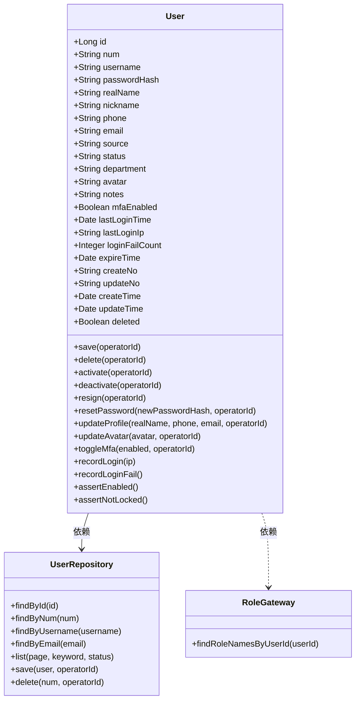

| 对象 | 类型 | 属性 | 与其它对象关系 |
|------|------|------|--------------|
| User | 聚合根 | id、num、username、passwordHash、realName、nickname、phone、email、source、status、department、avatar、notes、mfaEnabled、lastLoginTime、lastLoginIp、loginFailCount、expireTime、createNo、updateNo、createTime、updateTime、deleted | 聚合根，通过 RoleGateway 查询关联角色 |
| UserRepository | 仓储接口 | findById、findByNum、findByUsername、findByEmail、list、save、delete | 操作 User 聚合 |
| RoleGateway | 领域网关 | findRoleNamesByUserId | 跨域：查询 RBAC 域的用户角色关联 |

#### 3.2.2 领域规则

| 聚合/对象 | 规则类型 | 规则描述 | 违反时表达 |
|-----------|---------|---------|-----------|
| User | 不变性 | username 全局唯一 | 抛出 USERNAME_ALREADY_EXISTS |
| User | 不变性 | email 全局唯一 | 抛出 EMAIL_ALREADY_EXISTS（新增） |
| User | 不变性 | username 创建后不可修改 | 编辑时不暴露 username 字段 |
| User | 业务规则 | status 枚举值限定：ENABLED / DISABLED / RESIGNED / DELETED | 状态转换时校验 |
| User | 业务规则 | source 枚举值限定：MANUAL / IMPORT / SSO / INVITE / API | 创建时校验 |
| User | 业务规则 | 已 DELETED 状态不可再次删除 | 抛出 USER_NOT_FOUND |
| User | 业务规则 | 非 ENABLED 状态不可登录 | assertEnabled() 抛出 ACCOUNT_DISABLED |
| User | 业务规则 | loginFailCount >= 5 自动锁定 | assertNotLocked() 抛出 ACCOUNT_LOCKED |
| User | 业务规则 | passwordHash 必须为 BCrypt 加密格式 | 重置密码时强制 BCrypt |

#### 3.2.3 领域动作

| 聚合/实体 | 领域动作 | 职责 | 前置条件 | 后置条件/规则 | 领域事件 |
|-----------|---------|------|---------|--------------|---------|
| User | save(operatorId) | 新建或更新用户 | username 不重复、email 不重复 | 新建时 status=ENABLED，更新 updateTime | UserCreatedEvent |
| User | delete(operatorId) | 逻辑删除用户 | status != DELETED | status=DELETED + deleted=true | UserDeletedEvent |
| User | activate(operatorId) | 启用用户 | 无 | status=ENABLED | UserStatusChangedEvent（新增） |
| User | deactivate(operatorId) | 禁用用户 | 无 | status=DISABLED | UserStatusChangedEvent（新增） |
| User | resign(operatorId) | 标记用户离职 | 无 | status=RESIGNED | UserStatusChangedEvent（新增） |
| User | resetPassword(newHash, operatorId) | 重置密码 | 新密码非空 | passwordHash 更新 | PasswordResetEvent（新增） |
| User | updateProfile(realName, phone, email, operatorId) | 更新基本信息 | email 不与其他用户重复 | realName/phone/email 更新 | UserUpdatedEvent（新增） |

**save 时序图**：

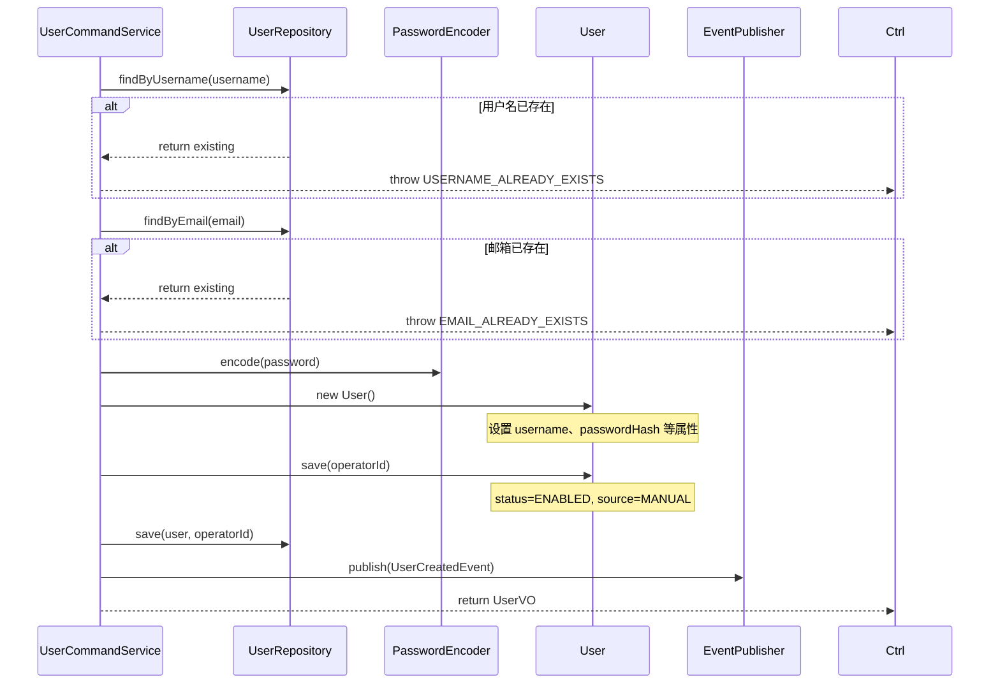

**delete 时序图**：

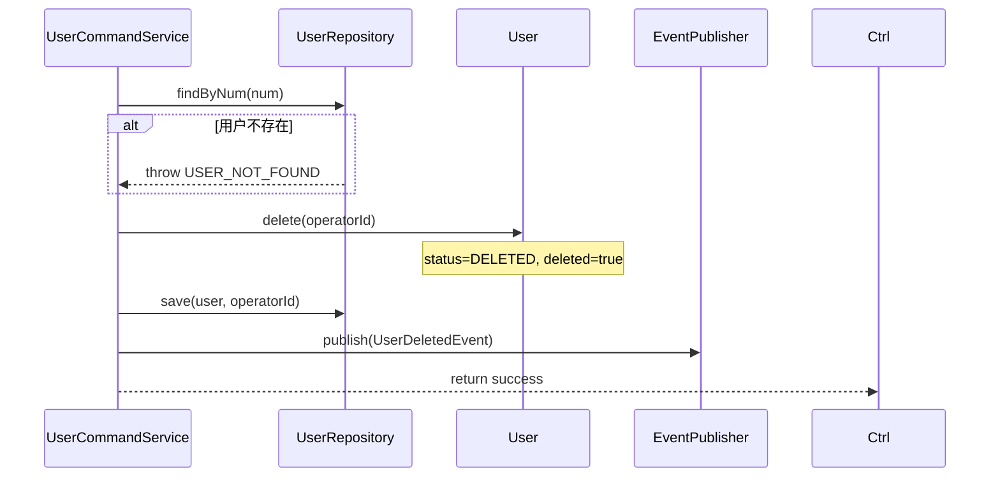

**activate 时序图**：

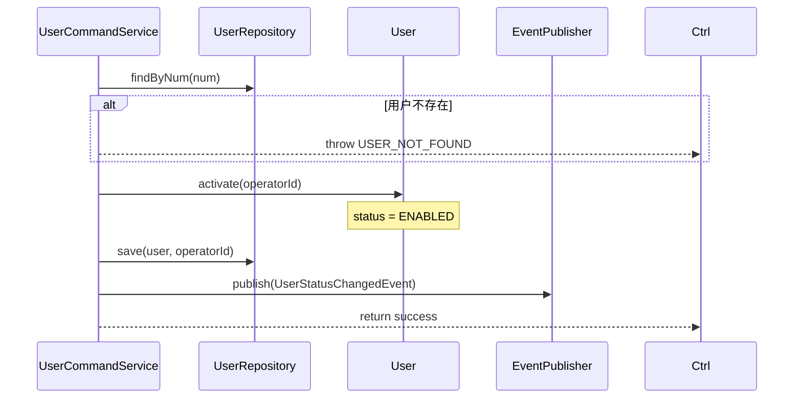

**deactivate 时序图**：

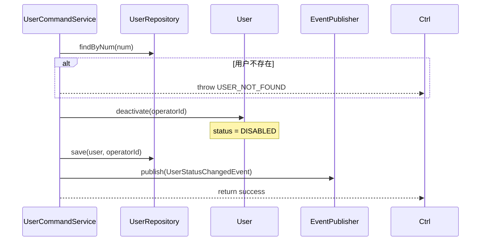

**resign 时序图**：

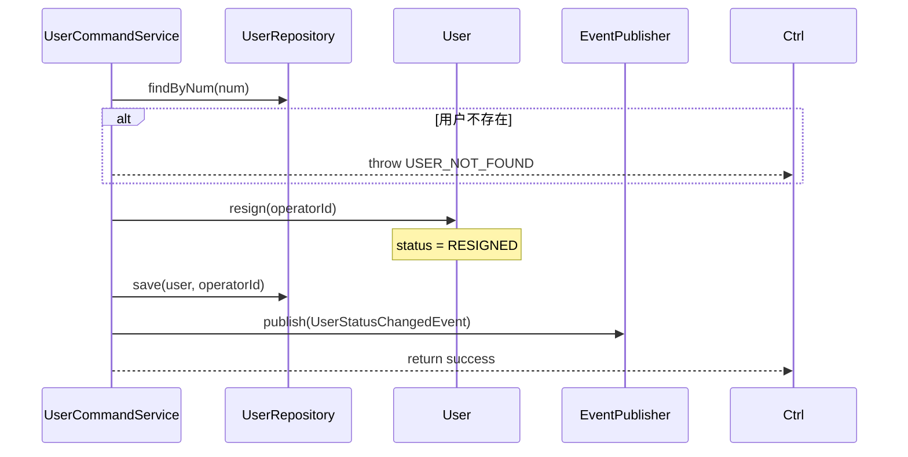

**resetPassword 时序图**：

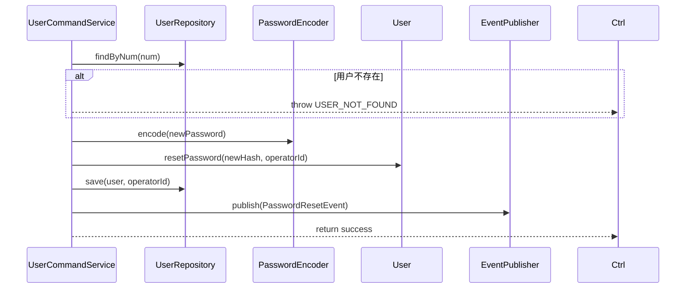

**updateProfile 时序图**：

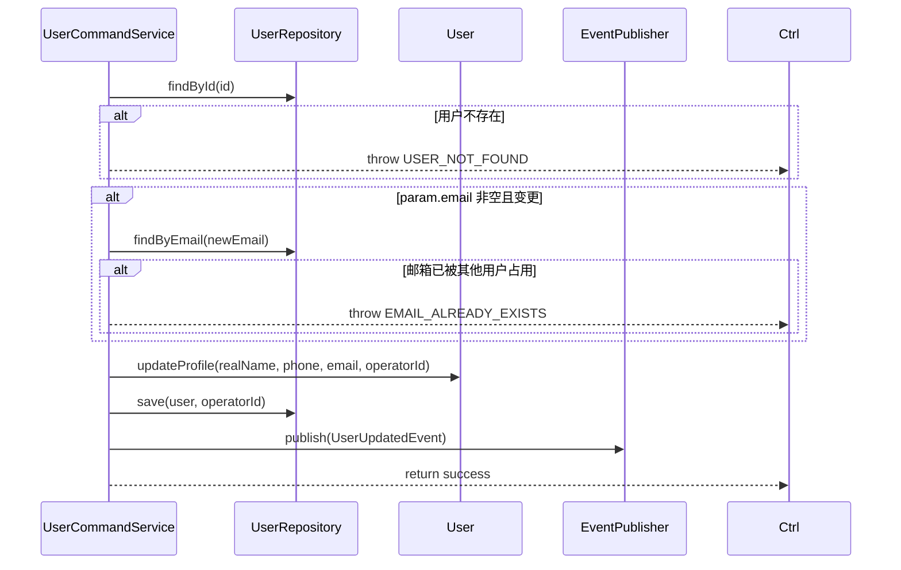

#### 3.2.4 领域事件

| 事件名 | 触发时机 | 载荷要点 | 可订阅方/用途 |
|--------|---------|---------|-------------|
| UserCreatedEvent | 新建用户后 | userNum、username、realName、email、operatorId、eventTime | 审计日志 |
| UserUpdatedEvent | 更新用户信息后 | userNum、operatorId、eventTime | 审计日志 |
| UserDeletedEvent | 删除用户后 | userNum、username、operatorId、eventTime | 审计日志 |
| UserStatusChangedEvent | 启用/禁用/离职后 | userNum、username、status、operatorId、eventTime | 审计日志 |
| PasswordResetEvent | 重置密码后 | userNum、username、operatorId、eventTime | 审计日志 |

---

## 4. 应用层设计

### 4.1 业务模块划分

| 应用模块 | 对应领域 | 包含 Service |
|---------|---------|-------------|
| user | user | UserCommandService（写操作）、UserQueryService（读操作）、UserProfileService（个人中心） |

### 4.2 User（user）

#### 4.2.1 Service 方法清单

| Service | 方法签名 | 职责 | 入参 | 出参 |
|---------|---------|------|------|------|
| UserCommandService | `createUser(param: CreateUserParam, operatorId: Long): UserVO` | 创建用户（BCrypt 加密密码） | param | UserVO |
| UserCommandService | `updateUser(id: Long, param: UpdateUserParam, operatorId: Long): Void` | 更新用户基本信息 | id, param | - |
| UserCommandService | `deleteUser(num: String, operatorId: Long): Void` | 逻辑删除用户 | num | - |
| UserCommandService | `activateUser(num: String, operatorId: Long): Void` | 启用用户 | num | - |
| UserCommandService | `deactivateUser(num: String, operatorId: Long): Void` | 禁用用户 | num | - |
| UserCommandService | `resignUser(num: String, operatorId: Long): Void` | 标记用户离职 | num | - |
| UserCommandService | `resetUserPassword(num: String, newPassword: String, operatorId: Long): Void` | 重置用户密码 | num, newPassword | - |
| UserQueryService | `getUserByNum(num: String): UserVO` | 按编号查询用户详情 | num | UserVO |
| UserQueryService | `listUsers(pageParam: PageParam, keyword, status): IPage~UserVO~` | 分页查询用户列表 | pageParam, keyword, status | IPage~UserVO~ |
| UserQueryService | `getUserDetailWithRoles(num: String): UserDetailVO` | 查询用户详情（含关联角色） | num | UserDetailVO |

#### 4.2.2 方法时序逻辑

**createUser 时序图**：

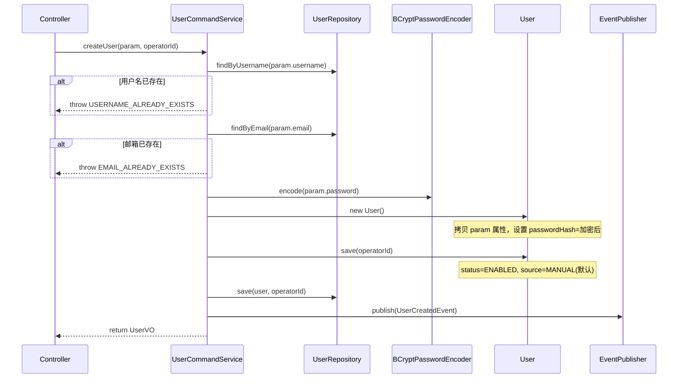

**updateUser 时序图**：

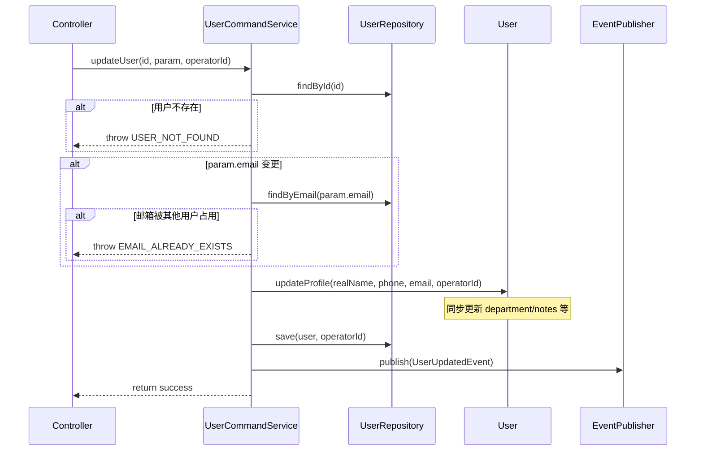

**deleteUser 时序图**：

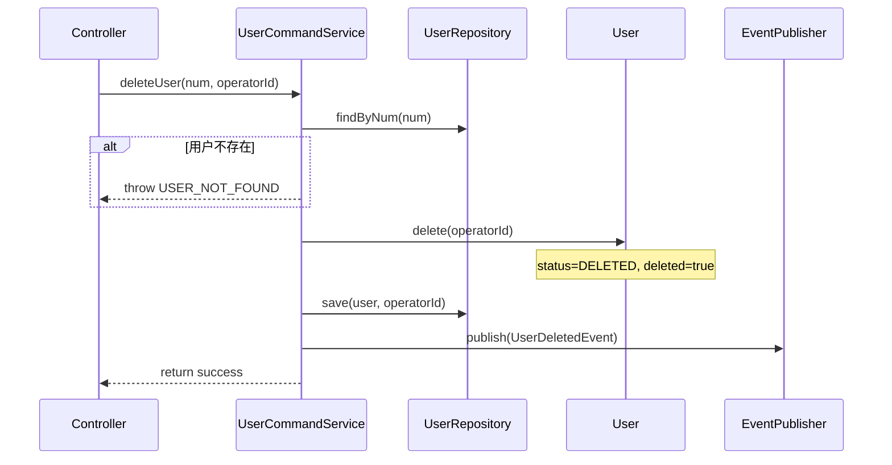

**activateUser 时序图**：

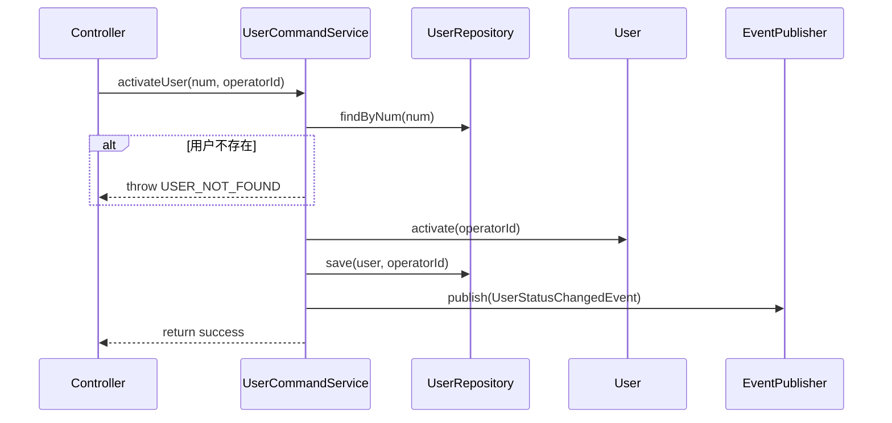

**deactivateUser 时序图**：

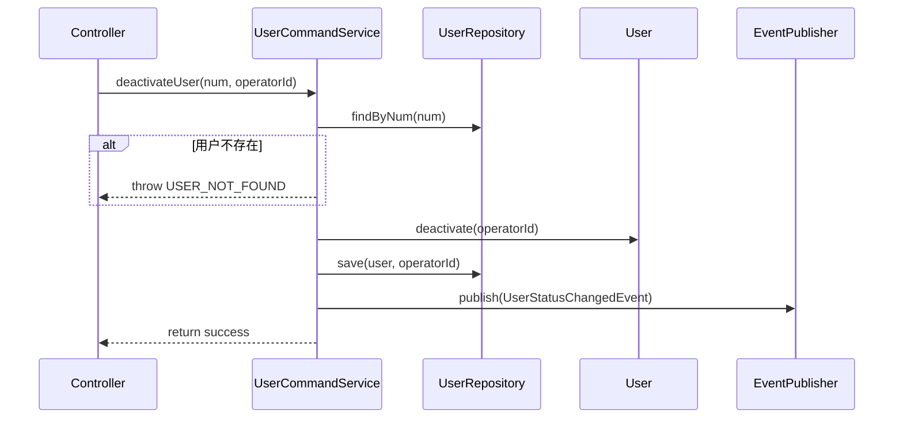

**resignUser 时序图**：

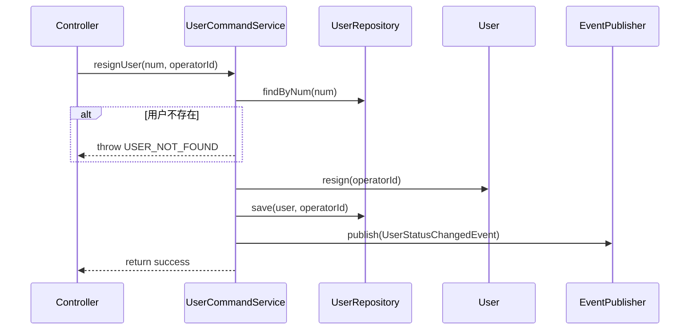

**resetUserPassword 时序图**：

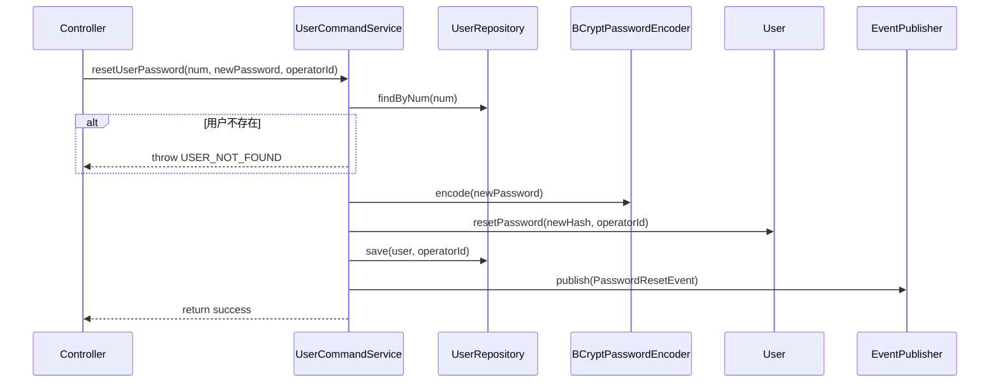

**getUserByNum 时序图**：

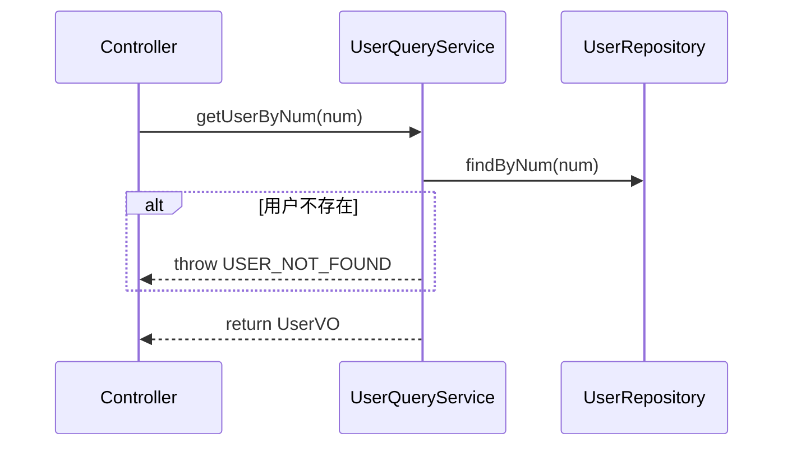

**listUsers 时序图**：

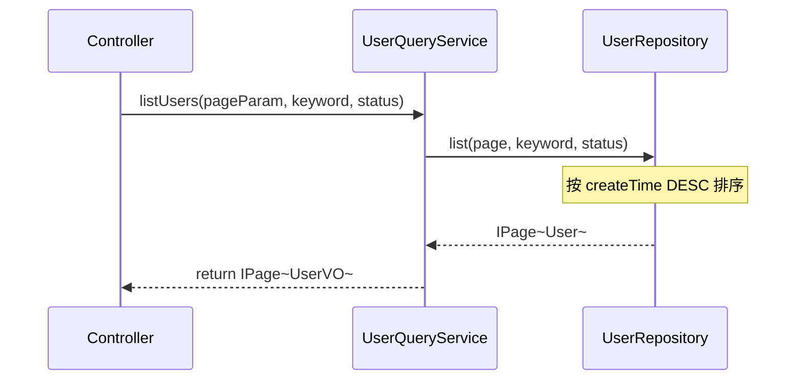

**getUserDetailWithRoles 时序图**：

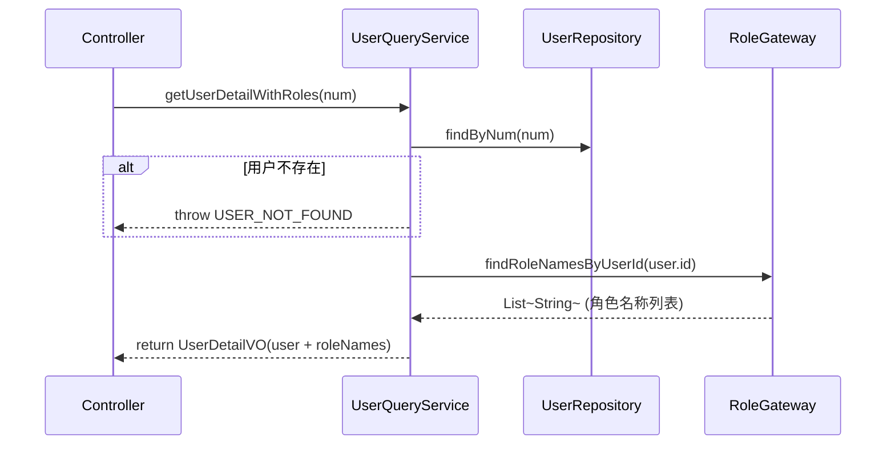

---

## 5. 控制器/Adapter 层设计

### 5.1 业务模块划分

| Controller | 对应应用模块 | URL 前缀 |
|-----------|-------------|---------|
| UserCommandController | user / UserCommandService | `/api/user/command` |
| UserQueryController | user / UserQueryService | `/api/user/query` |

### 5.2 User 命令（user）

#### 5.2.1 Controller 接口清单

| 接口 | 方法 | 路径 | 入参 | 返回值 JSON | 职责 |
|-----|------|------|------|-----------|------|
| 创建用户 | POST | `/api/user/command/create` | `{"username": "admin", "password": "Abc@123456", "realName": "张三", "email": "zhangsan@example.com", "phone": "13800138000", "department": "技术部", "notes": "系统管理员"}` | `{"code": 200, "data": {"num": "USER-001", "username": "admin", "realName": "张三", ...}}` | 新建用户 |
| 更新用户 | POST | `/api/user/command/update` | `{"id": 1, "realName": "张三三", "email": "zhangsan_new@example.com", "phone": "13900139000", "department": "产品部", "notes": "更新备注"}` | `{"code": 200, "data": null}` | 更新用户基本信息 |
| 删除用户 | POST | `/api/user/command/delete` | `{"num": "USER-001"}` | `{"code": 200, "data": null}` | 逻辑删除用户 |
| 启用用户 | POST | `/api/user/command/activate` | `{"num": "USER-001"}` | `{"code": 200, "data": null}` | 启用用户 |
| 禁用用户 | POST | `/api/user/command/deactivate` | `{"num": "USER-001"}` | `{"code": 200, "data": null}` | 禁用用户 |
| 标记离职 | POST | `/api/user/command/resign` | `{"num": "USER-001"}` | `{"code": 200, "data": null}` | 标记用户离职 |
| 重置密码 | POST | `/api/user/command/reset-password` | `{"num": "USER-001", "newPassword": "NewAbc@123456"}` | `{"code": 200, "data": null}` | 管理员重置用户密码 |

#### 5.2.2 接口时序逻辑

**创建用户时序图**：

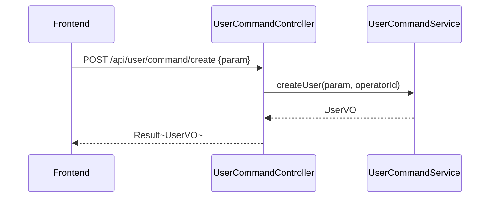

**更新用户时序图**：

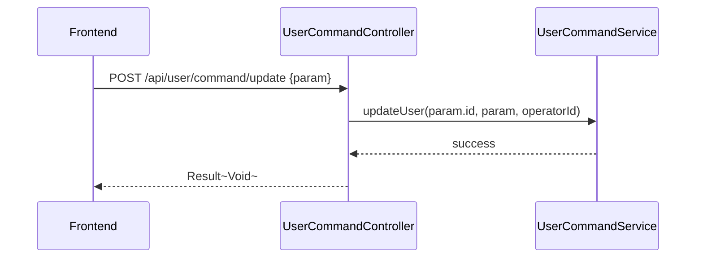

**删除用户时序图**：

```mermaid
sequenceDiagram
    participant FE as Frontend
    participant Ctrl as UserCommandController
    participant Svc as UserCommandService

    FE->>Ctrl: POST /api/user/command/delete {num}
    Ctrl->>Svc: deleteUser(num, operatorId)
    Svc-->>Ctrl: success
    Ctrl-->>FE: Result~Void~
```

**启用用户时序图**：

```mermaid
sequenceDiagram
    participant FE as Frontend
    participant Ctrl as UserCommandController
    participant Svc as UserCommandService

    FE->>Ctrl: POST /api/user/command/activate {num}
    Ctrl->>Svc: activateUser(num, operatorId)
    Svc-->>Ctrl: success
    Ctrl-->>FE: Result~Void~
```

**禁用用户时序图**：

```mermaid
sequenceDiagram
    participant FE as Frontend
    participant Ctrl as UserCommandController
    participant Svc as UserCommandService

    FE->>Ctrl: POST /api/user/command/deactivate {num}
    Ctrl->>Svc: deactivateUser(num, operatorId)
    Svc-->>Ctrl: success
    Ctrl-->>FE: Result~Void~
```

**标记离职时序图**：

```mermaid
sequenceDiagram
    participant FE as Frontend
    participant Ctrl as UserCommandController
    participant Svc as UserCommandService

    FE->>Ctrl: POST /api/user/command/resign {num}
    Ctrl->>Svc: resignUser(num, operatorId)
    Svc-->>Ctrl: success
    Ctrl-->>FE: Result~Void~
```

**重置密码时序图**：

```mermaid
sequenceDiagram
    participant FE as Frontend
    participant Ctrl as UserCommandController
    participant Svc as UserCommandService

    FE->>Ctrl: POST /api/user/command/reset-password {num, newPassword}
    Ctrl->>Svc: resetUserPassword(num, newPassword, operatorId)
    Svc-->>Ctrl: success
    Ctrl-->>FE: Result~Void~
```

### 5.3 User 查询（user）

#### 5.3.1 Controller 接口清单

| 接口 | 方法 | 路径 | 入参 | 返回值 JSON | 职责 |
|-----|------|------|------|-----------|------|
| 用户详情 | GET | `/api/user/query/detail` | num | `{"code": 200, "data": {"num": "USER-001", "username": "admin", "realName": "张三", "email": "zhangsan@example.com", "phone": "13800138000", "department": "技术部", "status": "ENABLED", "source": "MANUAL", "roleNames": ["系统管理员", "Agent 管理员"], "lastLoginTime": "2026-05-01T10:30:00", ...}}` | 详情（含关联角色列表） |
| 用户列表 | GET | `/api/user/query/list` | pageNo, pageSize, keyword, status | `{"code": 200, "data": {"total": 42, "records": [{"num": "USER-001", "username": "admin", "realName": "张三", "email": "zhangsan@example.com", "department": "技术部", "status": "ENABLED", "source": "MANUAL", "lastLoginTime": "2026-05-01T10:30:00", "createTime": "2026-05-01T10:00:00"}]}}` | 分页查询 |

#### 5.3.2 接口时序逻辑

**用户详情时序图**：

```mermaid
sequenceDiagram
    participant FE as Frontend
    participant Ctrl as UserQueryController
    participant Svc as UserQueryService
    participant RG as RoleGateway

    FE->>Ctrl: GET /api/user/query/detail?num=USER-001
    Ctrl->>Svc: getUserDetailWithRoles(num)
    Svc->>RG: findRoleNamesByUserId(userId)
    Svc-->>Ctrl: UserDetailVO
    Ctrl-->>FE: Result~UserDetailVO~
```

**用户列表时序图**：

```mermaid
sequenceDiagram
    participant FE as Frontend
    participant Ctrl as UserQueryController
    participant Svc as UserQueryService

    FE->>Ctrl: GET /api/user/query/list?keyword=admin&status=ENABLED
    Ctrl->>Svc: listUsers(pageParam, keyword, status)
    Svc-->>Ctrl: PageResult~UserVO~
    Ctrl-->>FE: Result~PageResult~
```

---

## 6. 数据库设计

### 6.1 表结构

| 表 | 对应领域 | 说明 |
|---|---------|------|
| `user` | user / User | 用户元数据（已存在） |
| `user_role` | rbac（关联表） | 用户-角色关联（已存在，用于查询关联角色） |

### 6.2 DDL 语句

**user 表（已存在，init.sql 第 20 行），需新增 email 唯一索引**：

```sql
-- User 表（已存在）
CREATE TABLE `user` (
    `id`              BIGINT       NOT NULL AUTO_INCREMENT COMMENT '主键ID',
    `username`        VARCHAR(64)  NOT NULL                COMMENT '登录账号',
    `password_hash`   VARCHAR(255) NOT NULL                COMMENT 'BCrypt密码哈希',
    `real_name`       VARCHAR(64)  DEFAULT NULL            COMMENT '真实姓名',
    `nickname`        VARCHAR(64)  DEFAULT NULL            COMMENT '昵称',
    `phone`           VARCHAR(20)  DEFAULT NULL            COMMENT '手机号',
    `email`           VARCHAR(128) DEFAULT NULL            COMMENT '邮箱',
    `source`          VARCHAR(20)  DEFAULT 'MANUAL'        COMMENT '来源: MANUAL/IMPORT/SSO/INVITE/API',
    `status`          VARCHAR(20)  DEFAULT 'ENABLED'       COMMENT '状态: ENABLED/DISABLED/RESIGNED/DELETED',
    `department`      VARCHAR(128) DEFAULT NULL            COMMENT '部门',
    `avatar`          VARCHAR(512) DEFAULT NULL            COMMENT '头像URL',
    `notes`           VARCHAR(500) DEFAULT NULL            COMMENT '备注',
    `mfa_enabled`     TINYINT(1)   DEFAULT 0               COMMENT '是否开启MFA',
    `last_login_time` DATETIME     DEFAULT NULL            COMMENT '最后登录时间',
    `last_login_ip`   VARCHAR(64)  DEFAULT NULL            COMMENT '最后登录IP',
    `login_fail_count`INT          DEFAULT 0               COMMENT '连续登录失败次数',
    `expire_time`     DATETIME     DEFAULT NULL            COMMENT '账号过期时间',
    `num`             VARCHAR(64)  DEFAULT NULL            COMMENT '编号',
    `create_no`       VARCHAR(64)  DEFAULT NULL            COMMENT '创建人编号',
    `update_no`       VARCHAR(64)  DEFAULT NULL            COMMENT '更新人编号',
    `create_time`     DATETIME     DEFAULT CURRENT_TIMESTAMP COMMENT '创建时间',
    `update_time`     DATETIME     DEFAULT CURRENT_TIMESTAMP ON UPDATE CURRENT_TIMESTAMP COMMENT '更新时间',
    `deleted`         TINYINT(1)   DEFAULT 0               COMMENT '逻辑删除',
    PRIMARY KEY (`id`),
    UNIQUE KEY `uk_username` (`username`),
    UNIQUE KEY `uk_email` (`email`),
    KEY `idx_phone` (`phone`),
    KEY `idx_email` (`email`),
    KEY `idx_status` (`status`),
    KEY `idx_create_time` (`create_time`)
) ENGINE=InnoDB DEFAULT CHARSET=utf8mb4 COLLATE=utf8mb4_unicode_ci COMMENT='用户表';
```

**需执行的 DDL 变更**（如果 uk_email 索引不存在）：

```sql
-- 新增 email 唯一索引（确保 email 全局唯一）
ALTER TABLE `user` ADD UNIQUE KEY `uk_email` (`email`);
```

**user_role 关联表（已存在，用于 RBAC 角色查询）**：

```sql
-- 用户-角色关联表（已存在）
CREATE TABLE `user_role` (
    `id`          BIGINT       NOT NULL AUTO_INCREMENT COMMENT '主键ID',
    `user_id`     BIGINT       NOT NULL                COMMENT '用户ID',
    `role_id`     BIGINT       NOT NULL                COMMENT '角色ID',
    `create_time` DATETIME     DEFAULT CURRENT_TIMESTAMP COMMENT '创建时间',
    `update_time` DATETIME     DEFAULT CURRENT_TIMESTAMP ON UPDATE CURRENT_TIMESTAMP COMMENT '更新时间',
    PRIMARY KEY (`id`),
    UNIQUE KEY `uk_user_role` (`user_id`, `role_id`),
    KEY `idx_role_id` (`role_id`)
) ENGINE=InnoDB DEFAULT CHARSET=utf8mb4 COLLATE=utf8mb4_unicode_ci COMMENT='用户角色关联表';
```

---

## 7. 模块变更清单

| 层级 | 变更项 | 对应 Skill |
|------|--------|------------|
| facade | UserStatusChangedEvent（已有，需确认包含 status 字段）、PasswordResetEvent（新增）、UserUpdatedEvent（新增） | impl-facade-module |
| client | UserVO（已有）、CreateUserParam（已有）、UpdateUserParam（已有）、UserDetailVO（新增：含 roleNames 字段）、PasswordChangeParam（已有） | impl-client-module |
| domain | User 聚合根（已有，无需变更）、UserRepository（已有，无需变更）、RoleGateway（新增：findRoleNamesByUserId） | impl-domain-module |
| infra | UserEntity（已有，无需变更）、UserMapper（已有）、UserRepositoryImpl（已有）、RoleGatewayImpl（新增：通过 user_role 表查询角色名称） | impl-infra-module |
| application | UserCommandService（已有，updateUser 需完善 department/notes 更新逻辑）、UserQueryService（新增 getUserDetailWithRoles 方法） | impl-application-module |
| adapter | UserCommandController（已有）、UserQueryController（新增 /detail 接口调用 getUserDetailWithRoles） | impl-adapter-module |

---

## 8. 代码分支命名

**分支名**：`feature-20260502-user-management`

---

## 9. 实现顺序

```
facade（新增 PasswordResetEvent、UserUpdatedEvent）
  → client（新增 UserDetailVO）
  → domain（新增 RoleGateway 接口）
  → infra（新增 RoleGatewayImpl 实现）
  → application（UserCommandService 完善 updateUser、UserQueryService 新增 getUserDetailWithRoles）
  → adapter（UserQueryController 新增 /detail 接口）
  → SQL（ALTER TABLE 添加 uk_email 唯一索引，如不存在）
```

**分阶段实现**：

| 阶段 | 内容 | 依赖 |
|------|------|------|
| Phase 1 | facade + client：新增事件 DTO、UserDetailVO | 无 |
| Phase 2 | domain + infra：RoleGateway 接口 + 实现 | Phase 1 |
| Phase 3 | application：UserCommandService 完善、UserQueryService 新增方法 | Phase 2 |
| Phase 4 | adapter + SQL：Controller 完善、DDL 变更 | Phase 3 |

---

## 10. 接口与数据契约

### 10.1 前端 API 适配

现有前端 API（`frontend/admin/src/api/user.ts`）路径需适配：

| 前端方法 | 后端路径 | 变更 |
|---------|---------|------|
| getUsers | `GET /api/user/query/list` | 路径变更 |
| getUser | `GET /api/user/query/detail` | 路径变更，参数改为 num |
| createUser | `POST /api/user/command/create` | 路径变更 |
| updateUser | `POST /api/user/command/update` | 路径变更 |
| deleteUser | `POST /api/user/command/delete` | 路径变更 |
| activateUser | `POST /api/user/command/activate` | 路径变更 |
| deactivateUser | `POST /api/user/command/deactivate` | 路径变更 |
| resignUser | `POST /api/user/command/resign` | 路径变更 |
| resetPassword | `POST /api/user/command/reset-password` | 路径变更 |
| getUserDetail | `GET /api/user/query/detail` | **新增**：含关联角色 |

### 10.2 错误码

| 错误码 | 说明 | 对应前端提示 |
|--------|------|------------|
| 1008 | 用户不存在 | 「用户不存在」 |
| 1009 | 用户名已存在 | 「用户名已存在」 |
| **1501** | **邮箱已存在** | **「邮箱已存在」** |
| **1502** | **密码不符合复杂度要求** | **「密码需包含大小写字母、数字和特殊字符，长度 8-32 位」** |
| **1503** | **两次密码不一致** | **「两次输入的密码不一致」** |
| 1001 | 用户名或密码错误 | 「用户名或密码错误」 |
| 1010 | 账号已禁用 | 「账号已禁用，无法登录」 |
| 1011 | 账号已锁定 | 「账号已锁定，请连续登录失败次数过多」 |

### 10.3 前端类型定义

```typescript
interface UserItem {
  id: number
  num: string
  username: string
  realName: string
  nickname?: string
  email: string
  phone?: string
  department?: string
  status: 'ENABLED' | 'DISABLED' | 'RESIGNED' | 'DELETED'
  source: 'MANUAL' | 'IMPORT' | 'SSO' | 'INVITE' | 'API'
  lastLoginTime?: string
  createTime: string
}

interface UserDetailVO extends UserItem {
  notes?: string
  avatar?: string
  mfaEnabled: boolean
  loginFailCount: number
  expireTime?: string
  roleNames: string[]  // 关联角色列表（只读）
}
```

---

## 11. 其他

### 11.1 BCrypt 密码加密

复用 Spring Security 的 `BCryptPasswordEncoder`（已在 UserCommandService 和 UserProfileService 中使用）：

```java
private final BCryptPasswordEncoder passwordEncoder = new BCryptPasswordEncoder();
// 加密
String hash = passwordEncoder.encode(plainPassword);
```

### 11.2 RoleGateway 角色查询

User 域定义的 Gateway 接口，由 RBAC 域实现：

```java
public interface RoleGateway {
    /** 查询用户关联的角色名称列表 */
    List<String> findRoleNamesByUserId(Long userId);
}
```

实现时通过 `user_role` 关联 `role` 表查询：

```sql
SELECT r.role_name FROM role r
INNER JOIN user_role ur ON r.id = ur.role_id
WHERE ur.user_id = ? AND r.deleted = 0;
```

### 11.3 操作记录

用户操作记录复用现有审计日志模块。所有用户管理操作（创建/更新/删除/启用/禁用/离职/重置密码）均通过领域事件（UserCreatedEvent、UserStatusChangedEvent、PasswordResetEvent 等）触发，由审计日志模块消费并记录。

前端展示操作记录时，调用审计日志查询接口，按目标用户过滤：

```
GET /api/audit/query/logs?targetUserNum=USER-001
```

### 11.4 密码复杂度校验

在应用层进行密码复杂度校验：

```java
private void validatePassword(String password) {
    if (password == null || password.length() < 8 || password.length() > 32) {
        throw new BusinessException(ErrorCode.PASSWORD_COMPLEXITY_INVALID);
    }
    if (!password.matches(".*[a-z].*")) {
        throw new BusinessException(ErrorCode.PASSWORD_COMPLEXITY_INVALID);
    }
    if (!password.matches(".*[A-Z].*")) {
        throw new BusinessException(ErrorCode.PASSWORD_COMPLEXITY_INVALID);
    }
    if (!password.matches(".*\\d.*")) {
        throw new BusinessException(ErrorCode.PASSWORD_COMPLEXITY_INVALID);
    }
    if (!password.matches(".*[^a-zA-Z0-9].*")) {
        throw new BusinessException(ErrorCode.PASSWORD_COMPLEXITY_INVALID);
    }
}
```

### 11.5 权限控制

- 所有用户管理操作（创建/编辑/删除/启用/禁用/离职/重置密码）仅限管理端（系统管理员）
- 通过现有 RBAC 权限系统控制，在 `SecurityConfig` 中配置 User 相关权限规则
- 普通用户端不展示任何用户管理功能和页面

### 11.6 与现有代码的兼容

- 现有 User 聚合根、Repository、Service、Controller 均已存在，本次主要是补充和完善
- 现有 `updateUser` 方法中 department 和 notes 字段更新不完整，本次完善
- 现有错误码 1008/1009 已定义，本次新增 1501-1503
- 现有 `user` 表可能缺少 `uk_email` 唯一索引，本次新增 DDL 变更
