# 用户端重构 技术方案

## 1. 目标与范围

### 1.1 目标

- 将用户端从简单的单栏聊天页重构为三栏布局（会话列表 + 聊天区 + 文件面板），保留顶部导航栏
- 增强聊天体验：文件上传/预览、Agent 实时切换、消息引用/回复、对话分享、智能推荐 Prompt
- 完善个人中心：基础信息编辑、历史对话管理、安全设置
- 首屏加载 ≤ 2 秒，SSE 消息 ≤ 1 秒可见首字

### 1.2 范围

- **包含**：用户端前端完全重构 + 后端新增接口（文件上传、Agent 列表查询、对话分享、Prompt 推荐、设备管理）
- **不包含**：管理端功能、多 Agent 并发对话、付费/计费功能

### 1.3 设计约定确认

| 决策项 | 结论 |
|--------|------|
| 文件存储 | OSS/MinIO 对象存储 |
| Agent 选择器 | 新增专供用户端的 Agent 查询接口 |
| SSE 流式回复 | 本次新增 SSE 接口 |
| 自动 Agent 路由 | 基于消息内容语义分析自动选择 |
| 引用消息 | chat_message 表加 reply_to_message_id 字段 |
| 对话分享 | 新建 chat_share 表 |
| 文件上传 API | 独立上传接口（先上传获取 fileUrl，再发消息） |
| Prompt 推荐 | 新建 prompt_template 表，支持后端管理 |
| 设备管理 | 新建 user_device 表 |
| 历史分页 | 滚动到底加载更多 |
| 文件面板范围 | 仅当前会话的所有附件 |
| 分享页权限 | 需要登录才能查看 |

### 1.4 分支命名

`feature-20260505-user-end-refactor`

## 2. 代码结构

| 层 | 领域 | 包 | 职责 |
|----|------|----|------|
| client | user (chat) | `com.gagentmanager.client.user` | 新增/修改聊天和文件相关的 VO/Param/DTO |
| client | agent | `com.gagentmanager.client.agent` | 新增用户端 Agent 列表 VO |
| client | file | `com.gagentmanager.client.file` | 新增文件上传相关 VO（UploadResultVO, FileInfoVO） |
| client | share | `com.gagentmanager.client.share` | 新增对话分享相关 VO |
| client | prompt | `com.gagentmanager.client.prompt` | 新增 Prompt 推荐相关 VO |
| domain | user (chat) | `com.gagentmanager.domain.user` | ChatSession/ChatMessage 新增领域动作，新增 ChatShare 实体 |
| domain | agent | `com.gagentmanager.domain.agent` | AgentRepository 新增用户端查询方法 |
| domain | file | `com.gagentmanager.domain.file` | 新增 FileAttachment 聚合根、FileGateway 接口（对象存储） |
| domain | prompt | `com.gagentmanager.domain.prompt` | 新增 PromptTemplate 聚合根、PromptRepository |
| domain | device | `com.gagentmanager.domain.user` | 新增 UserDevice 聚合根、UserDeviceRepository |
| infra | user (chat) | `com.gagentmanager.infra.user` | 实现新增仓储方法 |
| infra | agent | `com.gagentmanager.infra.agent` | 实现用户端 Agent 查询方法 |
| infra | file | `com.gagentmanager.infra.file` | 实现 FileAttachment 仓储、MinIO/OSS Gateway 实现 |
| infra | prompt | `com.gagentmanager.infra.prompt` | 实现 PromptTemplate 仓储 |
| infra | device | `com.gagentmanager.infra.user` | 实现 UserDevice 仓储 |
| application | user (chat) | `com.gagentmanager.application.user` | ChatCommandService 和 ChatQueryService 扩展，新增 ChatShareService |
| application | file | `com.gagentmanager.application.file` | 新增 FileUploadService |
| application | agent | `com.gagentmanager.application.agent` | 新增 AgentQueryForUserService |
| application | prompt | `com.gagentmanager.application.prompt` | 新增 PromptQueryService |
| application | device | `com.gagentmanager.application.user` | 新增 DeviceQueryService/DeviceCommandService |
| adapter | user (chat) | `com.gagentmanager.adapter.user` | 修改 ChatCommandController/ChatQueryController，新增 ChatShareController |
| adapter | file | `com.gagentmanager.adapter.file` | 新增 FileUploadController |
| adapter | agent | `com.gagentmanager.adapter.agent` | 新增 AgentUserController（用户端 Agent 查询） |
| adapter | prompt | `com.gagentmanager.adapter.prompt` | 新增 PromptController |
| adapter | device | `com.gagentmanager.adapter.user` | 新增 DeviceController |

## 3. 领域模型设计

### 3.1 业务层级划分

| 层级 | 子域 | 说明 |
|------|------|------|
| 核心域 | chat（user） | 会话管理、消息发送、消息引用、对话分享 |
| 核心域 | agent | 用户端可见 Agent 查询 |
| 支撑域 | file | 文件上传、附件管理、对象存储 Gateway |
| 支撑域 | prompt | Prompt 模板管理、推荐查询 |
| 支撑域 | device（user） | 登录设备管理、强制下线 |

### 3.2 聊天与分享（chat）

#### 3.2.1 领域模型

**ChatSession（聚合根）** — 已有，本次扩展。

**ChatMessage（实体）** — 已有，本次扩展 `replyToMessageId` 属性。

**ChatShare（新增聚合根）** — 对话分享：

| 属性 | 类型 | 说明 |
|------|------|------|
| id | Long | 主键 |
| num | String | 分享编号 |
| shareToken | String | 唯一分享 Token |
| sessionId | Long | 关联会话 ID |
| userId | Long | 创建者用户 ID |
| expireTime | Date | 过期时间（创建后 7 天） |
| isExpired | Boolean | 是否已过期 |
| viewCount | Integer | 浏览次数 |
| createNo | String | 创建人编号 |
| updateNo | String | 更新人编号 |
| createTime | Date | 创建时间 |
| updateTime | Date | 更新时间 |

**领域类图：**

```
ChatSession (聚合根)
├── id: Long
├── num: String
├── userId: Long
├── agentId: Long
├── sessionTitle: String
├── messageCount: Integer
├── lastMessageTime: Date
└── 动作: save(), delete(), rename(), replyMessage()

ChatMessage (实体)
├── id: Long
├── num: String
├── sessionId: Long
├── role: String (USER/ASSISTANT/SYSTEM)
├── content: String
├── replyToMessageId: Long   ← 新增
├── attachments: String (JSON)
├── thinkingChain: String
├── usedModel: String
├── tokenUsage: Integer
├── isError: Boolean
└── 工厂: create(), createAssistant()

ChatShare (聚合根)
├── id: Long
├── num: String
├── shareToken: String
├── sessionId: Long
├── userId: Long
├── expireTime: Date
├── isExpired: Boolean
├── viewCount: Integer
└── 动作: save(), invalidate(), incrementView()
```

**仓储方法清单（ChatShareRepository）：**

| 方法 | 返回值 | 职责 |
|------|--------|------|
| `findByShareToken(String token): ChatShare` | ChatShare | 根据分享 Token 查找 |
| `findBySessionId(Long sessionId): ChatShare` | ChatShare | 根据会话 ID 查找最新分享 |
| `save(ChatShare share, Long operatorId): void` | void | 持久化分享 |
| `invalidate(String shareToken, Long operatorId): void` | void | 使分享失效 |

#### 3.2.2 领域规则

| 聚合/对象 | 规则类型 | 规则描述 | 违反时表达 |
|-----------|----------|----------|------------|
| ChatShare | 不变性 | shareToken 全局唯一 | 生成时加 UUID，唯一索引保护 |
| ChatShare | 业务规则 | 分享有效期 7 天 | expireTime = createTime + 7 天 |
| ChatShare | 业务规则 | 过期后不可访问 | isExpired 字段标记，查询时校验 |
| ChatMessage | 不变性 | replyToMessageId 必须属于同一会话 | 创建时校验目标消息 sessionId 一致 |

#### 3.2.3 领域动作

| 聚合/实体 | 领域动作 | 职责 | 前置条件 | 后置条件/规则 | 领域事件 |
|-----------|----------|------|----------|---------------|----------|
| ChatSession | replyMessage(content, replyToMessageId, operatorId) | 创建引用消息 | 会话归属用户 | 生成 ChatMessage 实体，replyToMessageId 指向原消息 | 无 |
| ChatShare | save(operatorId) | 创建分享 | 分享未过期 | 生成唯一 shareToken，设置 expireTime = now + 7 天 | SessionSharedEvent |
| ChatShare | invalidate(operatorId) | 使分享失效 | 分享存在 | isExpired = true | SessionShareInvalidatedEvent |
| ChatShare | incrementView() | 增加浏览次数 | 分享未过期 | viewCount++ | 无 |

**replyMessage 时序图：**

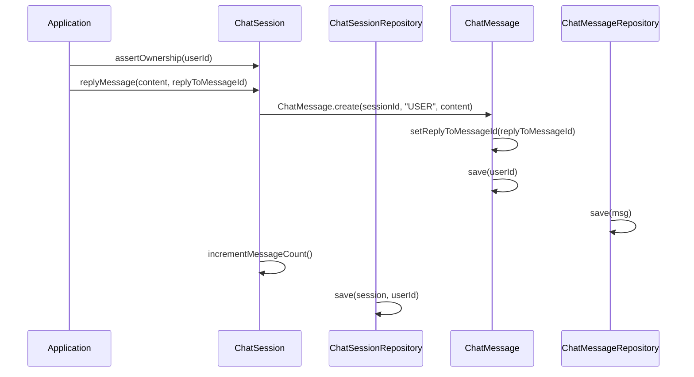
```mermaid
sequenceDiagram
    participant App as Application
    participant CS as ChatSession
    participant Repo as ChatSessionRepository
    participant CM as ChatMessage
    participant CMR as ChatMessageRepository

    App->>CS: assertOwnership(userId)
    App->>CS: replyMessage(content, replyToMessageId)
    CS->>CM: ChatMessage.create(sessionId, "USER", content)
    CM->>CM: setReplyToMessageId(replyToMessageId)
    CM->>CM: save(userId)
    CMR->>CMR: save(msg)
    CS->>CS: incrementMessageCount()
    Repo->>Repo: save(session, userId)
```

**ChatShare save 时序图：**

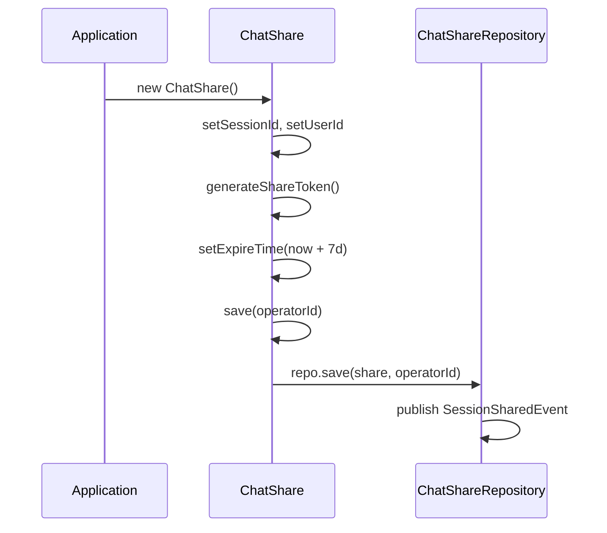
```mermaid
sequenceDiagram
    participant App as Application
    participant Share as ChatShare
    participant Repo as ChatShareRepository

    App->>Share: new ChatShare()
    Share->>Share: setSessionId, setUserId
    Share->>Share: generateShareToken()
    Share->>Share: setExpireTime(now + 7d)
    Share->>Share: save(operatorId)
    Share->>Repo: repo.save(share, operatorId)
    Repo->>Repo: publish SessionSharedEvent
```

**ChatShare invalidate 时序图：**

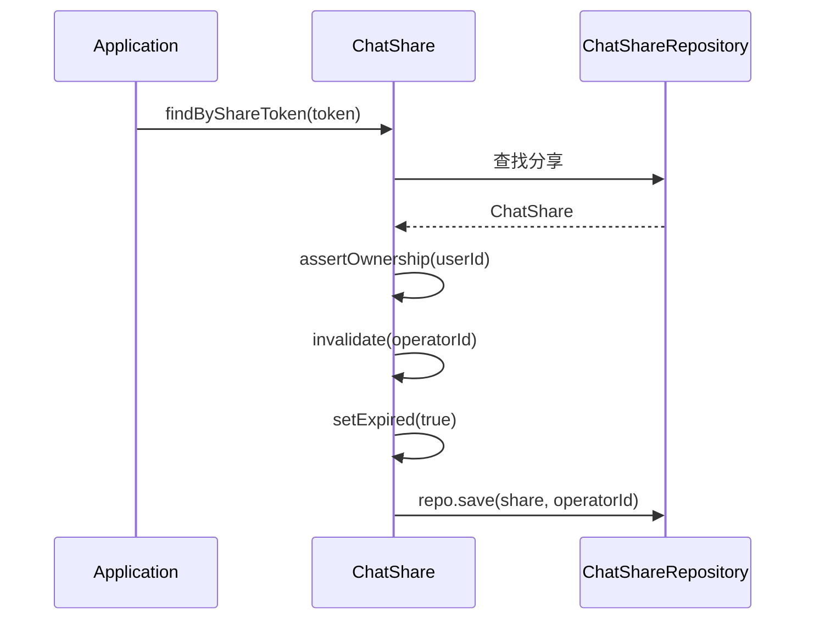
```mermaid
sequenceDiagram
    participant App as Application
    participant Share as ChatShare
    participant Repo as ChatShareRepository

    App->>Share: findByShareToken(token)
    Share->>Repo: 查找分享
    Repo-->>Share: ChatShare
    Share->>Share: assertOwnership(userId)
    Share->>Share: invalidate(operatorId)
    Share->>Share: setExpired(true)
    Share->>Repo: repo.save(share, operatorId)
```

#### 3.2.4 领域事件

| 事件名 | 触发时机 | 载荷要点 | 可订阅方/用途 |
|--------|----------|----------|--------------|
| SessionSharedEvent | 创建对话分享时 | shareToken, sessionId, userId | 审计日志记录 |
| SessionShareInvalidatedEvent | 使分享失效时 | shareToken, sessionId | 审计日志记录 |

### 3.3 Agent 查询（agent）

#### 3.3.1 领域模型

复用现有 Agent 实体，新增用户端查询方法。

**仓储方法清单（AgentRepository）：**

| 方法 | 返回值 | 职责 |
|------|--------|------|
| `listForUser(Long userId): List<Agent>` | List<Agent> | 查询用户可见的 Agent（ONLINE/PUBLISHED 状态） |
| `selectAutoAgent(content: String): Agent` | Agent | 根据消息内容语义分析自动选择最合适的 Agent |

#### 3.3.2 领域规则

| 聚合/对象 | 规则类型 | 规则描述 | 违反时表达 |
|-----------|----------|----------|------------|
| Agent | 可见性规则 | 用户只能看到 ONLINE 或 PUBLISHED 状态的 Agent | 查询时按 status 过滤 |

#### 3.3.3 领域动作

| 聚合/实体 | 领域动作 | 职责 | 前置条件 | 后置条件/规则 | 领域事件 |
|-----------|----------|------|----------|---------------|----------|
| Agent | selectAutoAgent(content) | 根据内容选择 Agent | Agent 列表非空 | 返回最匹配的 Agent | 无 |

**selectAutoAgent 时序图：**

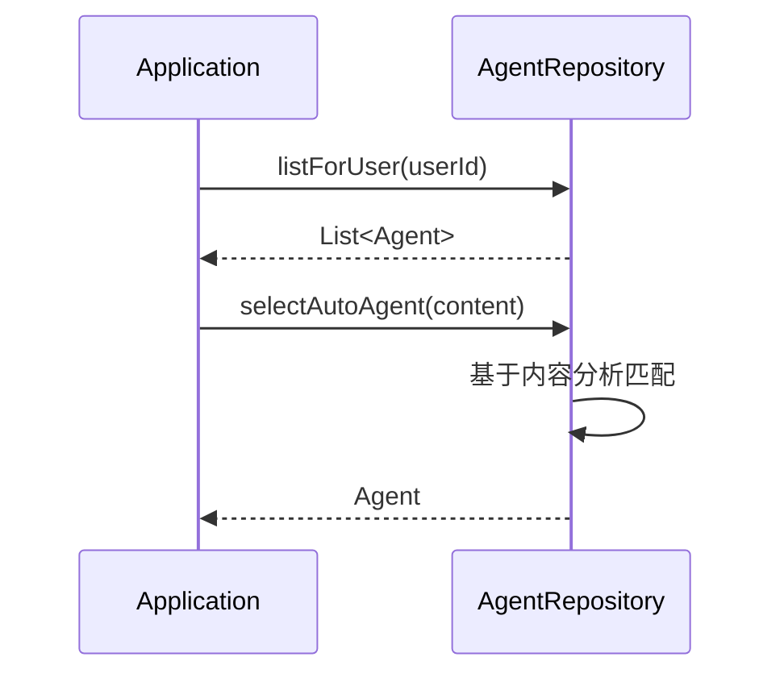
```mermaid
sequenceDiagram
    participant App as Application
    participant Repo as AgentRepository

    App->>Repo: listForUser(userId)
    Repo-->>App: List<Agent>
    App->>Repo: selectAutoAgent(content)
    Repo->>Repo: 基于内容分析匹配
    Repo-->>App: Agent
```

#### 3.3.4 领域事件

无。

### 3.4 文件与附件（file）

#### 3.4.1 领域模型

**FileAttachment（新增聚合根）** — 文件附件：

| 属性 | 类型 | 说明 |
|------|------|------|
| id | Long | 主键 |
| num | String | 附件编号 |
| sessionId | Long | 所属会话 ID |
| userId | Long | 上传者 ID |
| fileKey | String | 对象存储 Key |
| fileUrl | String | 文件访问 URL |
| fileName | String | 原始文件名 |
| fileSize | Long | 文件大小（字节） |
| mimeType | String | MIME 类型 |
| fileType | String | 文件分类（IMAGE/TEXT/PDF/OFFICE） |
| createNo | String | 创建人编号 |
| updateNo | String | 更新人编号 |
| createTime | Date | 创建时间 |
| updateTime | Date | 更新时间 |

**FileGateway（接口）** — 对象存储 Gateway：

| 方法 | 返回值 | 职责 |
|------|--------|------|
| `upload(InputStream input, String key, String mimeType): String` | String | 上传文件，返回 URL |
| `download(String key): InputStream` | InputStream | 下载文件 |
| `delete(String key): void` | void | 删除文件 |

**领域类图：**

```
FileAttachment (聚合根)
├── id: Long
├── num: String
├── sessionId: Long
├── userId: Long
├── fileKey: String
├── fileUrl: String
├── fileName: String
├── fileSize: Long
├── mimeType: String
├── fileType: String
└── 动作: save(), delete()

FileGateway (接口)
├── upload(input, key, mimeType): String
├── download(key): InputStream
└── delete(key): void
```

**仓储方法清单（FileAttachmentRepository）：**

| 方法 | 返回值 | 职责 |
|------|--------|------|
| `save(FileAttachment attachment, Long operatorId): void` | void | 持久化附件 |
| `findBySessionId(Long sessionId): List<FileAttachment>` | List<FileAttachment> | 查询会话所有附件 |
| `delete(String num, Long operatorId): void` | void | 删除附件 |

#### 3.4.2 领域规则

| 聚合/对象 | 规则类型 | 规则描述 | 违反时表达 |
|-----------|----------|----------|------------|
| FileAttachment | 业务规则 | 单文件最大 20MB | 上传前校验 fileSize |
| FileAttachment | 不变性 | fileKey 全局唯一 | 生成时加时间戳+UUID |
| FileAttachment | 业务规则 | 文件类型白名单：图片、TXT、MD、CSV、JSON、XML、PDF、DOCX、XLSX、PPTX | 非白名单类型拒绝上传 |

#### 3.4.3 领域动作

| 聚合/实体 | 领域动作 | 职责 | 前置条件 | 后置条件/规则 | 领域事件 |
|-----------|----------|------|----------|---------------|----------|
| FileAttachment | save(operatorId) | 创建附件记录 | 文件已上传到对象存储 | 生成 fileKey 和 fileUrl | FileUploadedEvent |
| FileAttachment | delete(operatorId) | 删除附件 | 文件存在 | 逻辑删除 + 删除对象存储文件 | FileDeletedEvent |

**FileAttachment save 时序图：**

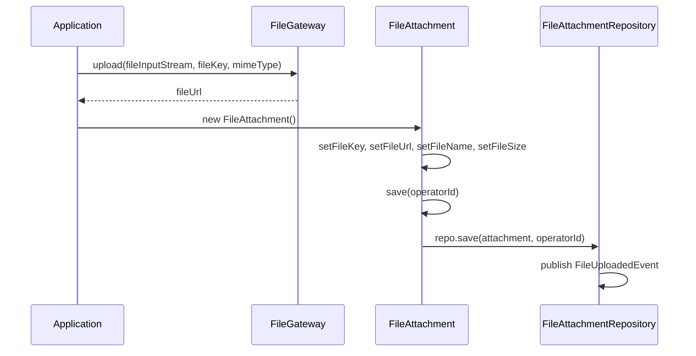
```mermaid
sequenceDiagram
    participant App as Application
    participant GW as FileGateway
    participant Att as FileAttachment
    participant Repo as FileAttachmentRepository

    App->>GW: upload(fileInputStream, fileKey, mimeType)
    GW-->>App: fileUrl
    App->>Att: new FileAttachment()
    Att->>Att: setFileKey, setFileUrl, setFileName, setFileSize
    Att->>Att: save(operatorId)
    Att->>Repo: repo.save(attachment, operatorId)
    Repo->>Repo: publish FileUploadedEvent
```

**FileAttachment delete 时序图：**

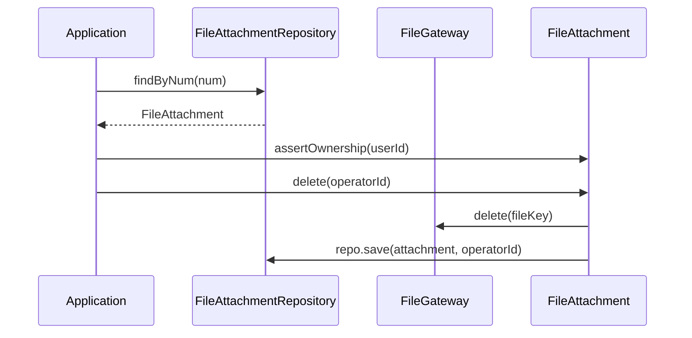
```mermaid
sequenceDiagram
    participant App as Application
    participant Repo as FileAttachmentRepository
    participant GW as FileGateway
    participant Att as FileAttachment

    App->>Repo: findByNum(num)
    Repo-->>App: FileAttachment
    App->>Att: assertOwnership(userId)
    App->>Att: delete(operatorId)
    Att->>GW: delete(fileKey)
    Att->>Repo: repo.save(attachment, operatorId)
```

#### 3.4.4 领域事件

| 事件名 | 触发时机 | 载荷要点 | 可订阅方/用途 |
|--------|----------|----------|--------------|
| FileUploadedEvent | 文件上传完成时 | fileKey, fileName, sessionId, userId | 审计日志、文件存储统计 |
| FileDeletedEvent | 附件删除时 | fileKey, sessionId | 审计日志 |

### 3.5 Prompt 模板（prompt）

#### 3.5.1 领域模型

**PromptTemplate（新增聚合根）** — 推荐 Prompt 模板：

| 属性 | 类型 | 说明 |
|------|------|------|
| id | Long | 主键 |
| num | String | 模板编号 |
| title | String | Prompt 标题（如"写代码"） |
| content | String | Prompt 内容 |
| category | String | 分类（CODE/DATA/DOC/BUG/TRANSLATE/BRAINSTORM） |
| icon | String | 图标 Emoji |
| sortOrder | Integer | 排序 |
| isEnabled | Boolean | 是否启用 |
| createNo | String | 创建人编号 |
| updateNo | String | 更新人编号 |
| createTime | Date | 创建时间 |
| updateTime | Date | 更新时间 |

**仓储方法清单（PromptRepository）：**

| 方法 | 返回值 | 职责 |
|------|--------|------|
| `listEnabled(): List<PromptTemplate>` | List<PromptTemplate> | 查询所有启用的 Prompt 模板 |

#### 3.5.2 领域规则

| 聚合/对象 | 规则类型 | 规则描述 | 违反时表达 |
|-----------|----------|----------|------------|
| PromptTemplate | 业务规则 | 只返回已启用模板 | 查询时过滤 isEnabled=true |
| PromptTemplate | 排序规则 | 按 sortOrder 升序 | 返回按 sortOrder 排序 |

#### 3.5.3 领域动作

无领域动作（纯查询场景）。

#### 3.5.4 领域事件

无。

### 3.6 设备管理（device）

#### 3.6.1 领域模型

**UserDevice（新增聚合根）** — 登录设备：

| 属性 | 类型 | 说明 |
|------|------|------|
| id | Long | 主键 |
| num | String | 设备编号 |
| userId | Long | 用户 ID |
| deviceToken | String | 登录 Token |
| deviceName | String | 设备名称（浏览器+OS） |
| ipAddress | String | 登录 IP |
| userAgent | String | User-Agent |
| loginTime | Date | 登录时间 |
| lastActiveTime | Date | 最后活跃时间 |
| isOnline | Boolean | 是否在线 |
| createNo | String | 创建人编号 |
| updateNo | String | 更新人编号 |
| createTime | Date | 创建时间 |
| updateTime | Date | 更新时间 |

**仓储方法清单（UserDeviceRepository）：**

| 方法 | 返回值 | 职责 |
|------|--------|------|
| `listByUserId(Long userId): List<UserDevice>` | List<UserDevice> | 查询用户所有设备 |
| `save(UserDevice device, Long operatorId): void` | void | 保存设备记录 |
| `kickOut(String num, Long operatorId): void` | void | 强制下线设备 |

#### 3.6.2 领域规则

| 聚合/对象 | 规则类型 | 规则描述 | 违反时表达 |
|-----------|----------|----------|------------|
| UserDevice | 业务规则 | 用户只能踢出非当前设备的设备 | 校验 deviceToken != 当前 token |
| UserDevice | 业务规则 | 踢出后 Token 失效 | 加入黑名单或 Redis 失效列表 |

#### 3.6.3 领域动作

| 聚合/实体 | 领域动作 | 职责 | 前置条件 | 后置条件/规则 | 领域事件 |
|-----------|----------|------|----------|---------------|----------|
| UserDevice | save(operatorId) | 登录时记录设备 | 无 | 记录 IP、UA、登录时间 | DeviceLoginEvent |
| UserDevice | kickOut(operatorId) | 强制下线 | 设备非当前设备 | isOnline=false, token 失效 | DeviceKickedOutEvent |

**UserDevice save 时序图：**

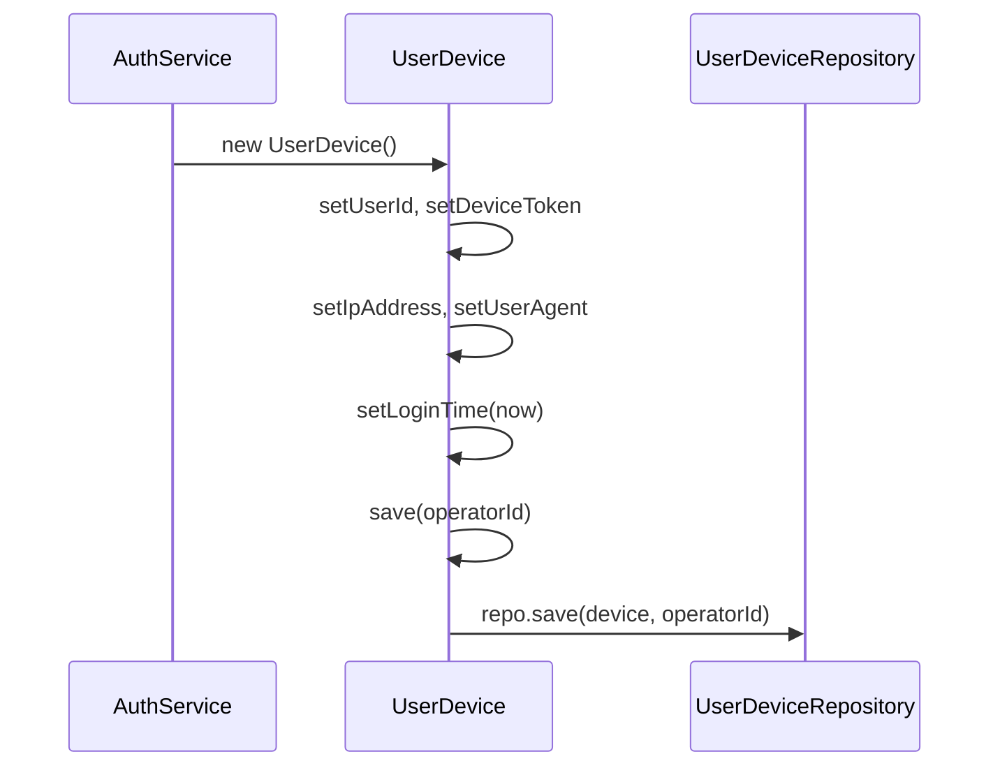
```mermaid
sequenceDiagram
    participant Auth as AuthService
    participant Device as UserDevice
    participant Repo as UserDeviceRepository

    Auth->>Device: new UserDevice()
    Device->>Device: setUserId, setDeviceToken
    Device->>Device: setIpAddress, setUserAgent
    Device->>Device: setLoginTime(now)
    Device->>Device: save(operatorId)
    Device->>Repo: repo.save(device, operatorId)
```

**UserDevice kickOut 时序图：**

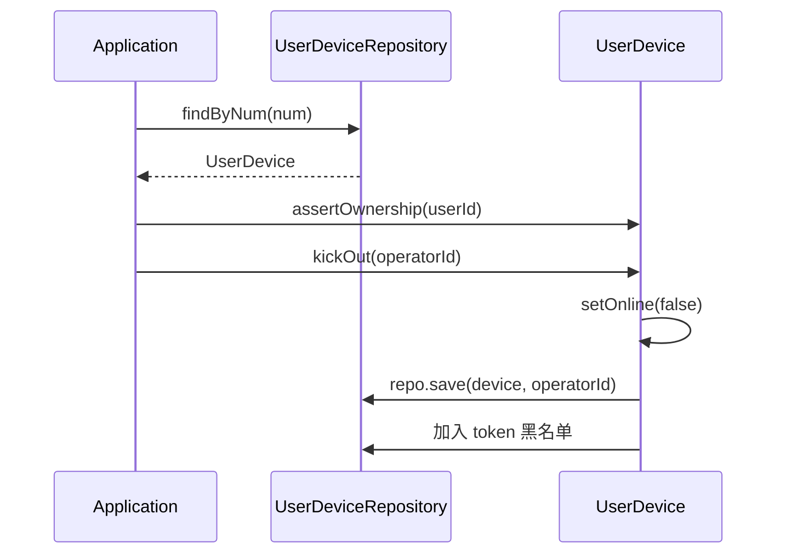
```mermaid
sequenceDiagram
    participant App as Application
    participant Repo as UserDeviceRepository
    participant Device as UserDevice

    App->>Repo: findByNum(num)
    Repo-->>App: UserDevice
    App->>Device: assertOwnership(userId)
    App->>Device: kickOut(operatorId)
    Device->>Device: setOnline(false)
    Device->>Repo: repo.save(device, operatorId)
    Device->>Repo: 加入 token 黑名单
```

#### 3.6.4 领域事件

| 事件名 | 触发时机 | 载荷要点 | 可订阅方/用途 |
|--------|----------|----------|--------------|
| DeviceLoginEvent | 用户登录时 | userId, deviceName, ipAddress, loginTime | 审计日志、异常登录告警 |
| DeviceKickedOutEvent | 强制下线设备时 | userId, deviceNum | 审计日志 |

## 4. 应用层设计

### 4.1 业务模块划分

| 模块 | 对应 Service | 职责 |
|------|-------------|------|
| chat | ChatCommandService / ChatQueryService | 扩展消息引用、分享、分页查询 |
| chat | ChatShareService | 新增，对话分享管理 |
| agent | AgentUserQueryService | 新增，用户端 Agent 查询 |
| file | FileUploadService | 新增，文件上传管理 |
| prompt | PromptQueryService | 新增，Prompt 推荐查询 |
| device | DeviceQueryService / DeviceCommandService | 新增，设备管理 |

### 4.2 聊天模块（chat）

#### 4.2.1 Service 方法清单

**ChatQueryService 新增方法：**

| 方法签名 | 职责 | 入参 | 出参 |
|----------|------|------|------|
| `listSessionsWithPage(userId, pageNo, pageSize): PageResult<SessionVO>` | 分页查询用户会话列表 | userId, pageNo, pageSize | PageResult<SessionVO> |
| `listSessionAttachments(sessionId, userId): List<FileInfoVO>` | 查询会话附件列表 | sessionId, userId | List<FileInfoVO> |
| `getShareContent(shareToken, userId): ShareContentVO` | 获取分享内容（需登录） | shareToken, userId | ShareContentVO |

**ChatCommandService 新增方法：**

| 方法签名 | 职责 | 入参 | 出参 |
|----------|------|------|------|
| `sendMessageWithReply(sessionNum, content, replyToMsgId, userId): void` | 发送引用消息 | sessionNum, content, replyToMsgId, userId | void |
| `sendMessageWithAttachments(sessionNum, content, fileUrls, userId): void` | 发送带附件的消息 | sessionNum, content, fileUrls, userId | void |
| `createShare(sessionNum, userId): ShareResultVO` | 创建对话分享 | sessionNum, userId | ShareResultVO |
| `invalidateShare(shareToken, userId): void` | 使分享失效 | shareToken, userId | void |
| `exportSessionMarkdown(sessionNum, userId): String` | 导出对话为 Markdown | sessionNum, userId | Markdown 文本 |

**ChatShareService 方法清单：**

| 方法签名 | 职责 | 入参 | 出参 |
|----------|------|------|------|
| `createShare(sessionNum, userId): ShareResultVO` | 创建对话分享 | sessionNum, userId | ShareResultVO |
| `getShareContent(shareToken): ShareContentVO` | 获取分享内容 | shareToken | ShareContentVO |
| `invalidateShare(shareToken, userId): void` | 使分享失效 | shareToken, userId | void |

#### 4.2.2 方法时序逻辑

**listSessionsWithPage 时序：**

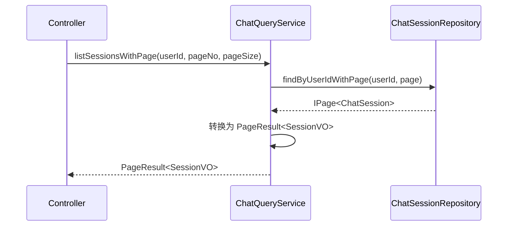
```mermaid
sequenceDiagram
    participant C as Controller
    participant Svc as ChatQueryService
    participant Repo as ChatSessionRepository

    C->>Svc: listSessionsWithPage(userId, pageNo, pageSize)
    Svc->>Repo: findByUserIdWithPage(userId, page)
    Repo-->>Svc: IPage<ChatSession>
    Svc->>Svc: 转换为 PageResult<SessionVO>
    Svc-->>C: PageResult<SessionVO>
```

**listSessionAttachments 时序：**

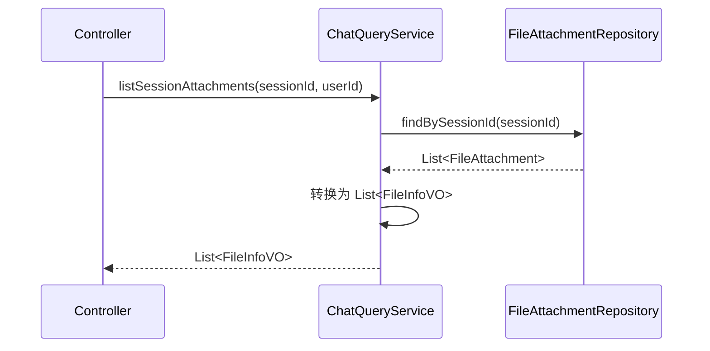
```mermaid
sequenceDiagram
    participant C as Controller
    participant Svc as ChatQueryService
    participant Repo as FileAttachmentRepository

    C->>Svc: listSessionAttachments(sessionId, userId)
    Svc->>Repo: findBySessionId(sessionId)
    Repo-->>Svc: List<FileAttachment>
    Svc->>Svc: 转换为 List<FileInfoVO>
    Svc-->>C: List<FileInfoVO>
```

**sendMessageWithAttachments 时序：**

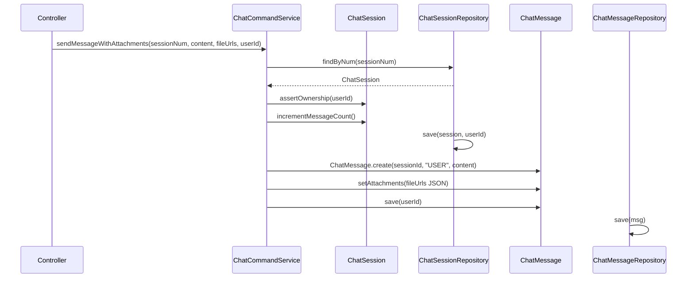
```mermaid
sequenceDiagram
    participant C as Controller
    participant Svc as ChatCommandService
    participant CS as ChatSession
    participant CSRepo as ChatSessionRepository
    participant CM as ChatMessage
    participant CMRepo as ChatMessageRepository

    C->>Svc: sendMessageWithAttachments(sessionNum, content, fileUrls, userId)
    Svc->>CSRepo: findByNum(sessionNum)
    CSRepo-->>Svc: ChatSession
    Svc->>CS: assertOwnership(userId)
    Svc->>CS: incrementMessageCount()
    CSRepo->>CSRepo: save(session, userId)
    Svc->>CM: ChatMessage.create(sessionId, "USER", content)
    Svc->>CM: setAttachments(fileUrls JSON)
    Svc->>CM: save(userId)
    CMRepo->>CMRepo: save(msg)
```

**createShare 时序：**

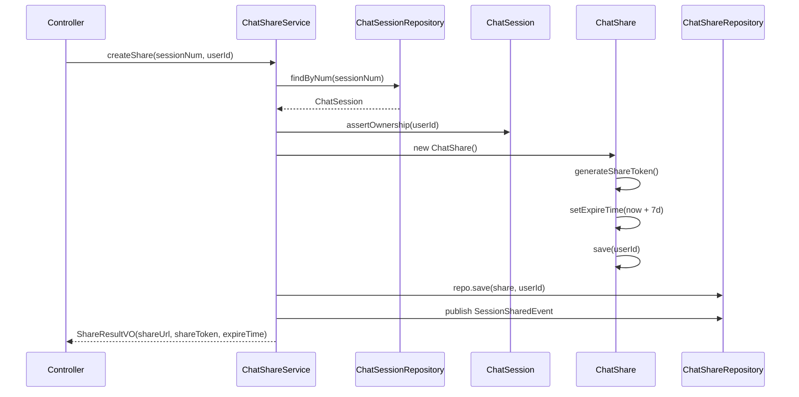
```mermaid
sequenceDiagram
    participant C as Controller
    participant Svc as ChatShareService
    participant CSRepo as ChatSessionRepository
    participant CS as ChatSession
    participant Share as ChatShare
    participant SRepo as ChatShareRepository

    C->>Svc: createShare(sessionNum, userId)
    Svc->>CSRepo: findByNum(sessionNum)
    CSRepo-->>Svc: ChatSession
    Svc->>CS: assertOwnership(userId)
    Svc->>Share: new ChatShare()
    Share->>Share: generateShareToken()
    Share->>Share: setExpireTime(now + 7d)
    Share->>Share: save(userId)
    Svc->>SRepo: repo.save(share, userId)
    Svc->>SRepo: publish SessionSharedEvent
    Svc-->>C: ShareResultVO(shareUrl, shareToken, expireTime)
```

**getShareContent 时序：**

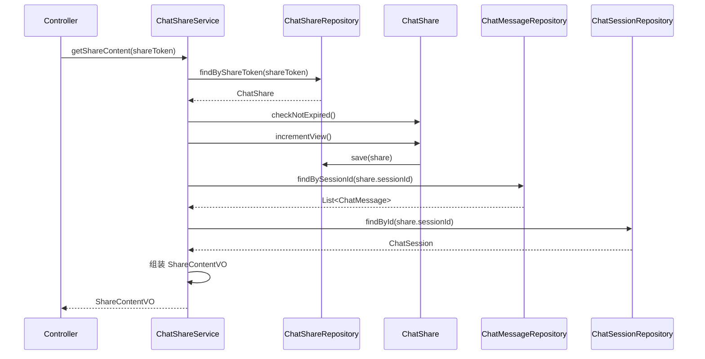
```mermaid
sequenceDiagram
    participant C as Controller
    participant Svc as ChatShareService
    participant SRepo as ChatShareRepository
    participant Share as ChatShare
    participant CMRepo as ChatMessageRepository
    participant CSRepo as ChatSessionRepository

    C->>Svc: getShareContent(shareToken)
    Svc->>SRepo: findByShareToken(shareToken)
    SRepo-->>Svc: ChatShare
    Svc->>Share: checkNotExpired()
    Svc->>Share: incrementView()
    Share->>SRepo: save(share)
    Svc->>CMRepo: findBySessionId(share.sessionId)
    CMRepo-->>Svc: List<ChatMessage>
    Svc->>CSRepo: findById(share.sessionId)
    CSRepo-->>Svc: ChatSession
    Svc->>Svc: 组装 ShareContentVO
    Svc-->>C: ShareContentVO
```

**exportSessionMarkdown 时序：**

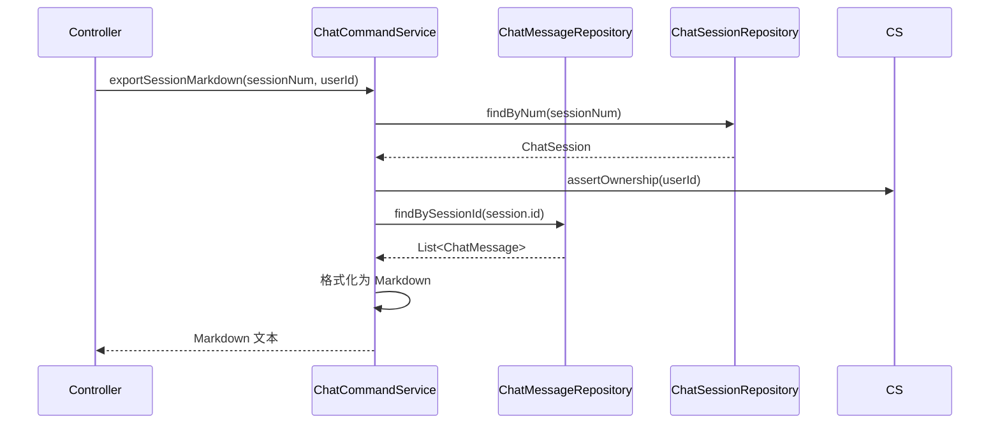
```mermaid
sequenceDiagram
    participant C as Controller
    participant Svc as ChatCommandService
    participant CMRepo as ChatMessageRepository
    participant CSRepo as ChatSessionRepository

    C->>Svc: exportSessionMarkdown(sessionNum, userId)
    Svc->>CSRepo: findByNum(sessionNum)
    CSRepo-->>Svc: ChatSession
    Svc->>CS: assertOwnership(userId)
    Svc->>CMRepo: findBySessionId(session.id)
    CMRepo-->>Svc: List<ChatMessage>
    Svc->>Svc: 格式化为 Markdown
    Svc-->>C: Markdown 文本
```

### 4.3 Agent 模块（agent）

#### 4.3.1 Service 方法清单

| 方法签名 | 职责 | 入参 | 出参 |
|----------|------|------|------|
| `listAgentsForUser(userId): List<AgentSimpleVO>` | 查询用户可见的 Agent 列表 | userId | List<AgentSimpleVO> |
| `selectAutoAgent(userId, content): AgentSimpleVO` | 根据内容自动选择 Agent | userId, content | AgentSimpleVO |

#### 4.3.2 方法时序逻辑

**listAgentsForUser 时序：**

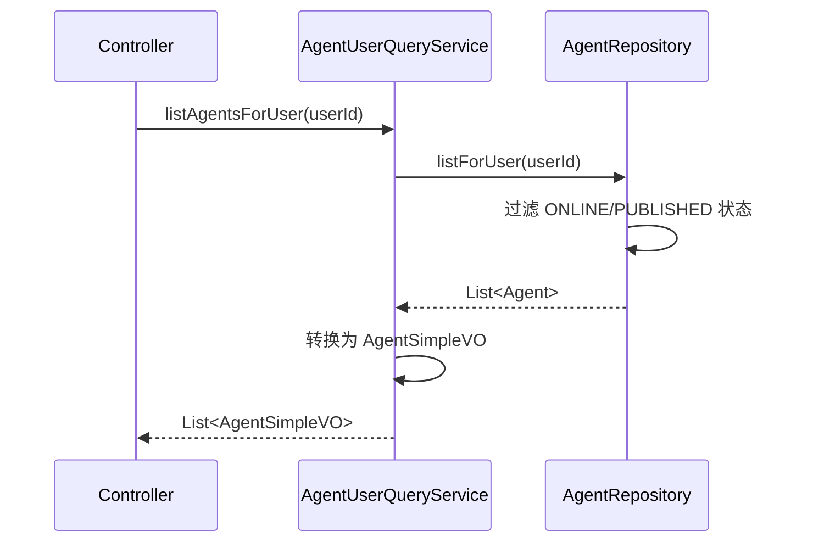
```mermaid
sequenceDiagram
    participant C as Controller
    participant Svc as AgentUserQueryService
    participant Repo as AgentRepository

    C->>Svc: listAgentsForUser(userId)
    Svc->>Repo: listForUser(userId)
    Repo->>Repo: 过滤 ONLINE/PUBLISHED 状态
    Repo-->>Svc: List<Agent>
    Svc->>Svc: 转换为 AgentSimpleVO
    Svc-->>C: List<AgentSimpleVO>
```

**selectAutoAgent 时序：**

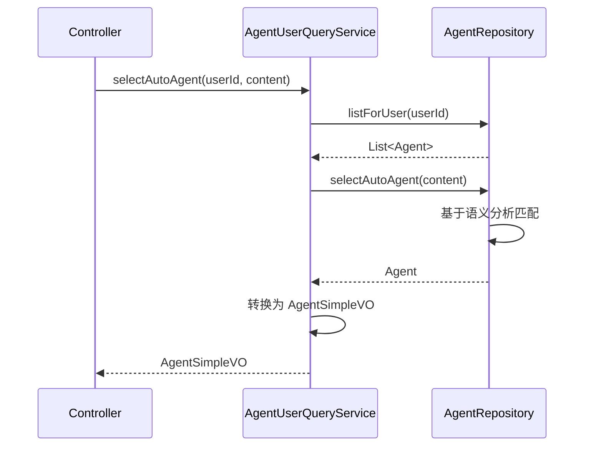
```mermaid
sequenceDiagram
    participant C as Controller
    participant Svc as AgentUserQueryService
    participant Repo as AgentRepository

    C->>Svc: selectAutoAgent(userId, content)
    Svc->>Repo: listForUser(userId)
    Repo-->>Svc: List<Agent>
    Svc->>Repo: selectAutoAgent(content)
    Repo->>Repo: 基于语义分析匹配
    Repo-->>Svc: Agent
    Svc->>Svc: 转换为 AgentSimpleVO
    Svc-->>C: AgentSimpleVO
```

### 4.4 文件上传模块（file）

#### 4.4.1 Service 方法清单

| 方法签名 | 职责 | 入参 | 出参 |
|----------|------|------|------|
| `uploadFile(sessionNum, multipartFile, userId): UploadResultVO` | 上传文件到对象存储并创建附件记录 | sessionNum, multipartFile, userId | UploadResultVO |
| `downloadFile(fileNum, userId): InputStream` | 下载文件 | fileNum, userId | InputStream |

#### 4.4.2 方法时序逻辑

**uploadFile 时序：**

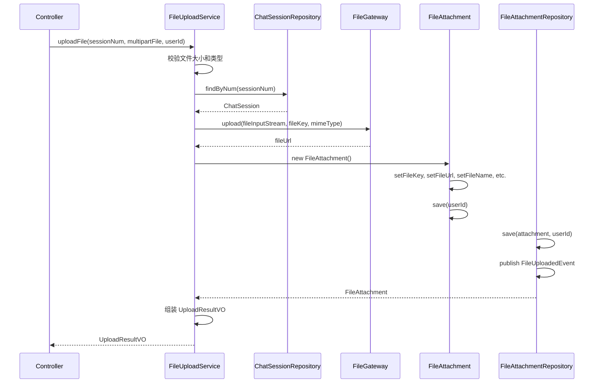
```mermaid
sequenceDiagram
    participant C as Controller
    participant Svc as FileUploadService
    participant CSRepo as ChatSessionRepository
    participant GW as FileGateway
    participant Att as FileAttachment
    participant ARepo as FileAttachmentRepository

    C->>Svc: uploadFile(sessionNum, multipartFile, userId)
    Svc->>Svc: 校验文件大小和类型
    Svc->>CSRepo: findByNum(sessionNum)
    CSRepo-->>Svc: ChatSession
    Svc->>GW: upload(fileInputStream, fileKey, mimeType)
    GW-->>Svc: fileUrl
    Svc->>Att: new FileAttachment()
    Att->>Att: setFileKey, setFileUrl, setFileName, etc.
    Att->>Att: save(userId)
    ARepo->>ARepo: save(attachment, userId)
    ARepo->>ARepo: publish FileUploadedEvent
    ARepo-->>Svc: FileAttachment
    Svc->>Svc: 组装 UploadResultVO
    Svc-->>C: UploadResultVO
```

**downloadFile 时序：**

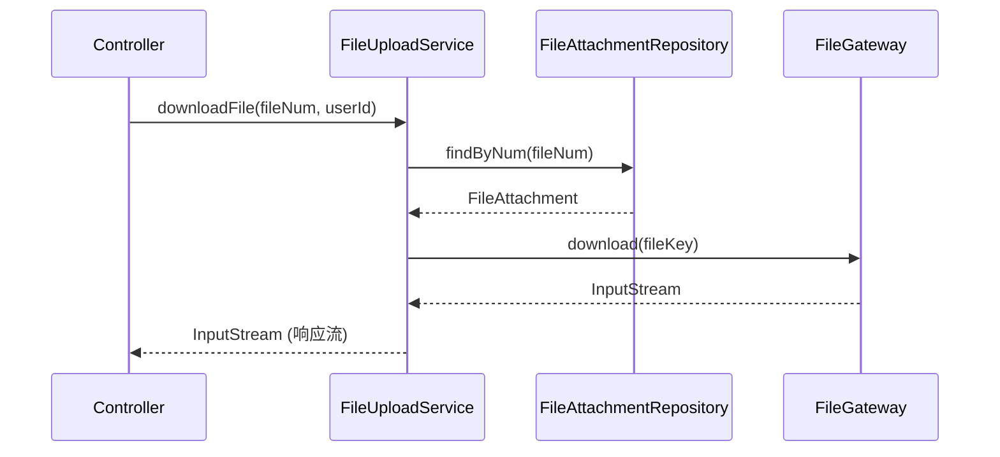
```mermaid
sequenceDiagram
    participant C as Controller
    participant Svc as FileUploadService
    participant ARepo as FileAttachmentRepository
    participant GW as FileGateway

    C->>Svc: downloadFile(fileNum, userId)
    Svc->>ARepo: findByNum(fileNum)
    ARepo-->>Svc: FileAttachment
    Svc->>GW: download(fileKey)
    GW-->>Svc: InputStream
    Svc-->>C: InputStream (响应流)
```

### 4.5 Prompt 模块（prompt）

#### 4.5.1 Service 方法清单

| 方法签名 | 职责 | 入参 | 出参 |
|----------|------|------|------|
| `listEnabledPrompts(): List<PromptTemplateVO>` | 查询所有启用的 Prompt 模板 | 无 | List<PromptTemplateVO> |

#### 4.5.2 方法时序逻辑

**listEnabledPrompts 时序：**

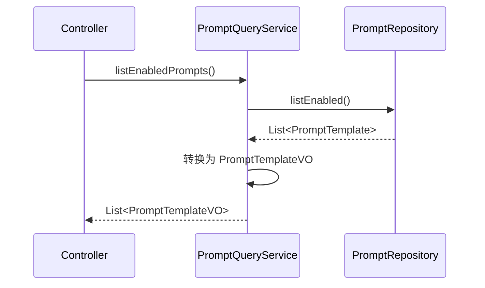
```mermaid
sequenceDiagram
    participant C as Controller
    participant Svc as PromptQueryService
    participant Repo as PromptRepository

    C->>Svc: listEnabledPrompts()
    Svc->>Repo: listEnabled()
    Repo-->>Svc: List<PromptTemplate>
    Svc->>Svc: 转换为 PromptTemplateVO
    Svc-->>C: List<PromptTemplateVO>
```

### 4.6 设备管理模块（device）

#### 4.6.1 Service 方法清单

**DeviceQueryService 方法清单：**

| 方法签名 | 职责 | 入参 | 出参 |
|----------|------|------|------|
| `listUserDevices(userId): List<UserDeviceVO>` | 查询用户登录设备列表 | userId | List<UserDeviceVO> |

**DeviceCommandService 方法清单：**

| 方法签名 | 职责 | 入参 | 出参 |
|----------|------|------|------|
| `kickOutDevice(deviceNum, userId): void` | 强制下线指定设备 | deviceNum, userId | void |

#### 4.6.2 方法时序逻辑

**listUserDevices 时序：**

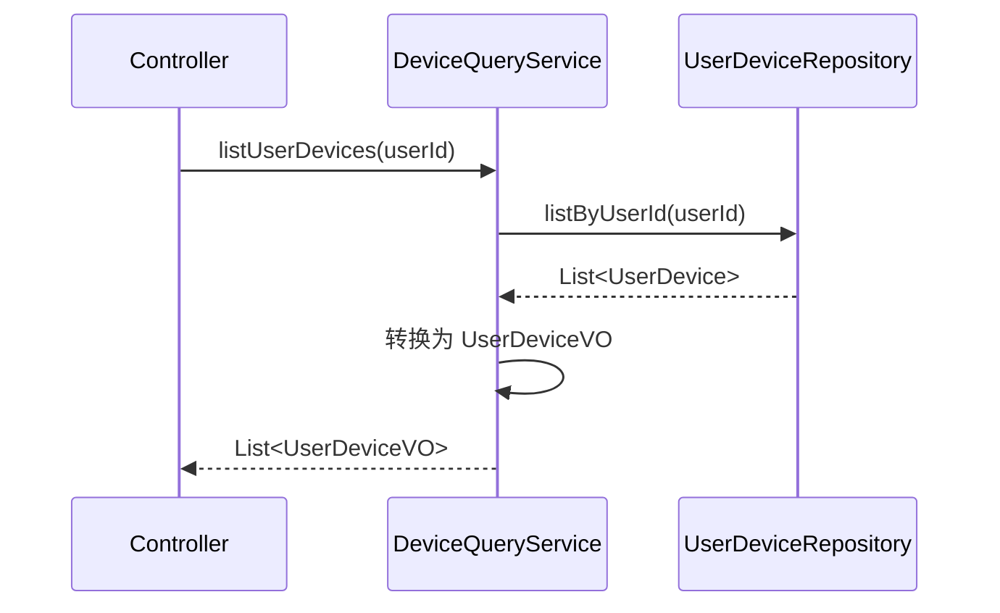
```mermaid
sequenceDiagram
    participant C as Controller
    participant Svc as DeviceQueryService
    participant Repo as UserDeviceRepository

    C->>Svc: listUserDevices(userId)
    Svc->>Repo: listByUserId(userId)
    Repo-->>Svc: List<UserDevice>
    Svc->>Svc: 转换为 UserDeviceVO
    Svc-->>C: List<UserDeviceVO>
```

**kickOutDevice 时序：**

```mermaid
sequenceDiagram
    participant C as Controller
    participant Svc as DeviceCommandService
    participant Repo as UserDeviceRepository
    participant Device as UserDevice

    C->>Svc: kickOutDevice(deviceNum, userId)
    Svc->>Repo: findByNum(deviceNum)
    Repo-->>Svc: UserDevice
    Svc->>Device: assertOwnership(userId)
    Svc->>Device: kickOut(userId)
    Device->>Device: setOnline(false)
    Device->>Repo: save(device, userId)
    Device->>Repo: 加入 token 黑名单
    Svc-->>C: void
```

## 5. 控制器/Adapter 层设计

### 5.1 业务模块划分

| 模块 | Controller | 对应 Service 方法 |
|------|-----------|------------------|
| chat | ChatQueryController | 扩展会话分页、附件查询、分享查看 |
| chat | ChatCommandController | 扩展消息发送（引用/附件）、新增分享创建/失效、导出 |
| chat | ChatShareController | 新增，分享相关接口 |
| agent | AgentUserController | 新增，用户端 Agent 查询 |
| file | FileUploadController | 新增，文件上传下载 |
| prompt | PromptController | 新增，Prompt 推荐查询 |
| device | DeviceController | 新增，设备管理 |

### 5.2 聊天模块（chat）

#### 5.2.1 Controller 接口清单

**ChatQueryController 新增接口：**

```
GET /api/chat/query/session/list-page?pageNo=1&pageSize=20
```

职责：分页查询会话列表

响应体 JSON：

```json
{
  "code": 200,
  "message": "success",
  "data": {
    "records": [
      { "id": 1, "num": "xxx", "sessionTitle": "帮我分析数据", "agentId": 1, "messageCount": 12, "lastMessageTime": "2026-05-05 10:30:00", "createTime": "2026-05-05 09:00:00" }
    ],
    "total": 50,
    "pageNo": 1,
    "pageSize": 20
  }
}
```

```
GET /api/chat/query/session/attachments?sessionNum=xxx
```

职责：查询会话附件列表

响应体 JSON：

```json
{
  "code": 200,
  "message": "success",
  "data": [
    { "num": "att-001", "fileUrl": "https://...", "fileName": "data.csv", "fileSize": 24576, "mimeType": "text/csv", "fileType": "TEXT", "createTime": "2026-05-05 10:30:00" }
  ]
}
```

```
GET /api/chat/query/share/content?shareToken=xxx
```

职责：获取分享内容（需登录）

响应体 JSON：

```json
{
  "code": 200,
  "message": "success",
  "data": {
    "sessionTitle": "帮我分析数据",
    "agentName": "代码专家",
    "shareTime": "2026-05-05 10:00:00",
    "messages": [
      { "num": "msg-001", "role": "USER", "content": "帮我分析这份数据", "createTime": "2026-05-05 10:00:00" },
      { "num": "msg-002", "role": "ASSISTANT", "content": "分析结果如下...", "thinkingChain": "...", "createTime": "2026-05-05 10:00:01" }
    ]
  }
}
```

**ChatCommandController 新增/修改接口：**

```
POST /api/chat/command/session/send-with-attachments
```

职责：发送带附件的消息

请求体 JSON：

```json
{
  "sessionNum": "xxx",
  "content": "帮我分析这份数据",
  "replyToMessageNum": "msg-001",
  "fileUrls": [
    { "fileUrl": "https://...", "fileName": "data.csv", "fileSize": 24576, "mimeType": "text/csv" }
  ]
}
```

响应体 JSON：

```json
{
  "code": 200,
  "message": "success",
  "data": null
}
```

```
POST /api/chat/command/share/create
```

职责：创建对话分享

请求体 JSON：

```json
{
  "sessionNum": "xxx"
}
```

响应体 JSON：

```json
{
  "code": 200,
  "message": "success",
  "data": {
    "shareToken": "abc123",
    "shareUrl": "/share/abc123",
    "expireTime": "2026-05-12 10:00:00"
  }
}
```

```
POST /api/chat/command/share/invalidate
```

职责：使分享失效

请求体 JSON：

```json
{
  "shareToken": "abc123"
}
```

响应体 JSON：

```json
{
  "code": 200,
  "message": "success",
  "data": null
}
```

```
GET /api/chat/query/session/export-markdown?sessionNum=xxx
```

职责：导出对话为 Markdown

响应体 JSON：

```json
{
  "code": 200,
  "message": "success",
  "data": {
    "content": "# 帮我分析数据\n\n**用户**: 帮我分析这份数据\n\n**AI**: 分析结果如下...\n"
  }
}
```

**SSE 流式回复接口：**

```
POST /api/chat/command/stream
```

职责：发送消息并接收 SSE 流式回复

请求体 JSON：

```json
{
  "sessionNum": "xxx",
  "content": "你好",
  "agentId": 1
}
```

响应：SSE 事件流

```
event: message
data: {"chunk": "你", "isDone": false}

event: message
data: {"chunk": "好", "isDone": false}

event: done
data: {"content": "你好！", "isDone": true}
```

#### 5.2.2 接口时序逻辑

**session/list-page 时序：**

```mermaid
sequenceDiagram
    participant Client as 前端
    participant Ctrl as ChatQueryController
    participant Svc as ChatQueryService

    Client->>Ctrl: GET /session/list-page?pageNo=1&pageSize=20
    Ctrl->>Svc: listSessionsWithPage(userId, 1, 20)
    Svc-->>Ctrl: PageResult<SessionVO>
    Ctrl-->>Client: Result<PageResult<SessionVO>>
```

**session/attachments 时序：**

```mermaid
sequenceDiagram
    participant Client as 前端
    participant Ctrl as ChatQueryController
    participant Svc as ChatQueryService

    Client->>Ctrl: GET /session/attachments?sessionNum=xxx
    Ctrl->>Svc: listSessionAttachments(sessionId, userId)
    Svc-->>Ctrl: List<FileInfoVO>
    Ctrl-->>Client: Result<List<FileInfoVO>>
```

**share/content 时序：**

```mermaid
sequenceDiagram
    participant Client as 前端
    participant Ctrl as ChatQueryController
    participant Svc as ChatShareService

    Client->>Ctrl: GET /share/content?shareToken=xxx
    Ctrl->>Svc: getShareContent(shareToken)
    Svc-->>Ctrl: ShareContentVO
    Ctrl-->>Client: Result<ShareContentVO>
```

**session/send-with-attachments 时序：**

```mermaid
sequenceDiagram
    participant Client as 前端
    participant Ctrl as ChatCommandController
    participant Svc as ChatCommandService

    Client->>Ctrl: POST /session/send-with-attachments
    Ctrl->>Svc: sendMessageWithAttachments(sessionNum, content, fileUrls, userId)
    Svc-->>Ctrl: void
    Ctrl-->>Client: Result<Void>
```

**share/create 时序：**

```mermaid
sequenceDiagram
    participant Client as 前端
    participant Ctrl as ChatCommandController
    participant Svc as ChatShareService

    Client->>Ctrl: POST /share/create
    Ctrl->>Svc: createShare(sessionNum, userId)
    Svc-->>Ctrl: ShareResultVO
    Ctrl-->>Client: Result<ShareResultVO>
```

**share/invalidate 时序：**

```mermaid
sequenceDiagram
    participant Client as 前端
    participant Ctrl as ChatCommandController
    participant Svc as ChatShareService

    Client->>Ctrl: POST /share/invalidate
    Ctrl->>Svc: invalidateShare(shareToken, userId)
    Svc-->>Ctrl: void
    Ctrl-->>Client: Result<Void>
```

**session/export-markdown 时序：**

```mermaid
sequenceDiagram
    participant Client as 前端
    participant Ctrl as ChatQueryController
    participant Svc as ChatCommandService

    Client->>Ctrl: GET /session/export-markdown?sessionNum=xxx
    Ctrl->>Svc: exportSessionMarkdown(sessionNum, userId)
    Svc-->>Ctrl: Markdown 文本
    Ctrl-->>Client: Result<MarkdownExportVO>
```

**stream (SSE) 时序：**

```mermaid
sequenceDiagram
    participant Client as 前端
    participant Ctrl as ChatCommandController
    participant Svc as ChatCommandService
    participant AI as AI Service

    Client->>Ctrl: POST /stream {sessionNum, content, agentId}
    Ctrl->>Svc: sendMessageStream(sessionNum, content, agentId, userId)
    Svc->>AI: 发送用户消息
    loop SSE 流式接收
        AI-->>Svc: 返回 chunk
        Svc->>Svc: 发送 SSE event
        Svc-->>Ctrl: SseEmitter 事件
        Ctrl-->>Client: event: message {chunk}
    end
    AI-->>Svc: 完成
    Svc->>Svc: 保存完整消息
    Svc-->>Ctrl: SSE done
    Ctrl-->>Client: event: done {complete}
```

### 5.3 Agent 模块（agent）

#### 5.3.1 Controller 接口清单

```
GET /api/agent/user/list
```

职责：查询用户可见的 Agent 列表

响应体 JSON：

```json
{
  "code": 200,
  "message": "success",
  "data": [
    { "id": 1, "num": "agent-001", "agentName": "代码专家", "description": "擅长编程", "agentType": "CHAT", "iconUrl": "...", "status": "ONLINE" }
  ]
}
```

```
GET /api/agent/user/auto-select?content=xxx
```

职责：根据消息内容自动选择 Agent

请求参数（Query String）：

| 参数 | 类型 | 必填 | 说明 |
|------|------|------|------|
| content | String | 是 | 用户消息内容 |

响应体 JSON：

```json
{
  "code": 200,
  "message": "success",
  "data": {
    "id": 1,
    "agentName": "代码专家",
    "description": "擅长编程",
    "iconUrl": "...",
    "status": "ONLINE"
  }
}
```

#### 5.3.2 接口时序逻辑

**agent/user/list 时序：**

```mermaid
sequenceDiagram
    participant Client as 前端
    participant Ctrl as AgentUserController
    participant Svc as AgentUserQueryService

    Client->>Ctrl: GET /api/agent/user/list
    Ctrl->>Svc: listAgentsForUser(userId)
    Svc-->>Ctrl: List<AgentSimpleVO>
    Ctrl-->>Client: Result<List<AgentSimpleVO>>
```

**agent/user/auto-select 时序：**

```mermaid
sequenceDiagram
    participant Client as 前端
    participant Ctrl as AgentUserController
    participant Svc as AgentUserQueryService

    Client->>Ctrl: GET /api/agent/user/auto-select?content=xxx
    Ctrl->>Svc: selectAutoAgent(userId, content)
    Svc-->>Ctrl: AgentSimpleVO
    Ctrl-->>Client: Result<AgentSimpleVO>
```

### 5.4 文件上传模块（file）

#### 5.4.1 Controller 接口清单

```
POST /api/file/upload
```

职责：上传文件到对象存储

请求：multipart/form-data

| 参数 | 类型 | 必填 | 说明 |
|------|------|------|------|
| sessionNum | String | 是 | 所属会话编号 |
| file | File | 是 | 上传的文件 |

响应体 JSON：

```json
{
  "code": 200,
  "message": "success",
  "data": {
    "num": "att-001",
    "fileUrl": "https://minio.example.com/bucket/xxx/data.csv",
    "fileName": "data.csv",
    "fileSize": 24576,
    "mimeType": "text/csv",
    "fileType": "TEXT"
  }
}
```

```
GET /api/file/download?fileNum=xxx
```

职责：下载文件

响应：文件流（application/octet-stream）

#### 5.4.2 接口时序逻辑

**file/upload 时序：**

```mermaid
sequenceDiagram
    participant Client as 前端
    participant Ctrl as FileUploadController
    participant Svc as FileUploadService

    Client->>Ctrl: POST /file/upload (multipart/form-data)
    Ctrl->>Svc: uploadFile(sessionNum, file, userId)
    Svc-->>Ctrl: UploadResultVO
    Ctrl-->>Client: Result<UploadResultVO>
```

**file/download 时序：**

```mermaid
sequenceDiagram
    participant Client as 前端
    participant Ctrl as FileUploadController
    participant Svc as FileUploadService

    Client->>Ctrl: GET /file/download?fileNum=xxx
    Ctrl->>Svc: downloadFile(fileNum, userId)
    Svc-->>Ctrl: InputStream
    Ctrl-->>Client: 文件流响应
```

### 5.5 Prompt 模块（prompt）

#### 5.5.1 Controller 接口清单

```
GET /api/prompt/list
```

职责：查询所有启用的 Prompt 模板

响应体 JSON：

```json
{
  "code": 200,
  "message": "success",
  "data": [
    { "num": "pt-001", "title": "写代码", "content": "请帮我写一段代码...", "category": "CODE", "icon": "💬" },
    { "num": "pt-002", "title": "数据分析", "content": "请帮我分析这份数据...", "category": "DATA", "icon": "📊" }
  ]
}
```

#### 5.5.2 接口时序逻辑

**prompt/list 时序：**

```mermaid
sequenceDiagram
    participant Client as 前端
    participant Ctrl as PromptController
    participant Svc as PromptQueryService

    Client->>Ctrl: GET /api/prompt/list
    Ctrl->>Svc: listEnabledPrompts()
    Svc-->>Ctrl: List<PromptTemplateVO>
    Ctrl-->>Client: Result<List<PromptTemplateVO>>
```

### 5.6 设备管理模块（device）

#### 5.6.1 Controller 接口清单

```
GET /api/device/list
```

职责：查询用户登录设备列表

响应体 JSON：

```json
{
  "code": 200,
  "message": "success",
  "data": [
    { "num": "dev-001", "deviceName": "Chrome on macOS", "ipAddress": "192.168.1.100", "loginTime": "2026-05-05 10:00:00", "lastActiveTime": "2026-05-05 10:30:00", "isOnline": true }
  ]
}
```

```
POST /api/device/kick-out
```

职责：强制下线指定设备

请求体 JSON：

```json
{
  "deviceNum": "dev-001"
}
```

响应体 JSON：

```json
{
  "code": 200,
  "message": "success",
  "data": null
}
```

#### 5.6.2 接口时序逻辑

**device/list 时序：**

```mermaid
sequenceDiagram
    participant Client as 前端
    participant Ctrl as DeviceController
    participant Svc as DeviceQueryService

    Client->>Ctrl: GET /api/device/list
    Ctrl->>Svc: listUserDevices(userId)
    Svc-->>Ctrl: List<UserDeviceVO>
    Ctrl-->>Client: Result<List<UserDeviceVO>>
```

**device/kick-out 时序：**

```mermaid
sequenceDiagram
    participant Client as 前端
    participant Ctrl as DeviceController
    participant Svc as DeviceCommandService

    Client->>Ctrl: POST /api/device/kick-out
    Ctrl->>Svc: kickOutDevice(deviceNum, userId)
    Svc-->>Ctrl: void
    Ctrl-->>Client: Result<Void>
```

## 6. 数据库设计

### 6.1 说明

本方案需要新增 5 张业务表，修改 2 张现有表。所有表遵循 `id BIGINT AUTO_INCREMENT` 主键约定，`create_time`/`update_time` 使用 `DATETIME(3)`。

### 6.2 表结构

#### 6.2.1 chat_share（对话分享表）— 新增

| 字段 | 类型 | 必填 | 说明 |
|------|------|------|------|
| id | BIGINT | 是 | 主键，自增 |
| share_token | VARCHAR(64) | 是 | 唯一分享 Token |
| session_id | BIGINT | 是 | 关联会话 ID |
| user_id | BIGINT | 是 | 创建者用户 ID |
| expire_time | DATETIME(3) | 是 | 过期时间 |
| is_expired | TINYINT(1) | 是 | 是否已过期（0/1） |
| view_count | INT | 是 | 浏览次数，默认 0 |
| num | VARCHAR(64) | 否 | 编号 |
| create_no | VARCHAR(64) | 否 | 创建人编号 |
| update_no | VARCHAR(64) | 否 | 更新人编号 |
| create_time | DATETIME(3) | 是 | 创建时间 |
| update_time | DATETIME(3) | 是 | 更新时间 |
| deleted | TINYINT(1) | 是 | 逻辑删除 |

#### 6.2.2 file_attachment（文件附件表）— 新增

| 字段 | 类型 | 必填 | 说明 |
|------|------|------|------|
| id | BIGINT | 是 | 主键，自增 |
| session_id | BIGINT | 是 | 所属会话 ID |
| user_id | BIGINT | 是 | 上传者 ID |
| file_key | VARCHAR(256) | 是 | 对象存储 Key |
| file_url | VARCHAR(512) | 是 | 文件访问 URL |
| file_name | VARCHAR(256) | 是 | 原始文件名 |
| file_size | BIGINT | 是 | 文件大小（字节） |
| mime_type | VARCHAR(128) | 是 | MIME 类型 |
| file_type | VARCHAR(32) | 是 | 文件分类（IMAGE/TEXT/PDF/OFFICE） |
| num | VARCHAR(64) | 否 | 编号 |
| create_no | VARCHAR(64) | 否 | 创建人编号 |
| update_no | VARCHAR(64) | 否 | 更新人编号 |
| create_time | DATETIME(3) | 是 | 创建时间 |
| update_time | DATETIME(3) | 是 | 更新时间 |
| deleted | TINYINT(1) | 是 | 逻辑删除 |

#### 6.2.3 prompt_template（Prompt 模板表）— 新增

| 字段 | 类型 | 必填 | 说明 |
|------|------|------|------|
| id | BIGINT | 是 | 主键，自增 |
| title | VARCHAR(128) | 是 | Prompt 标题 |
| content | TEXT | 是 | Prompt 内容 |
| category | VARCHAR(32) | 是 | 分类（CODE/DATA/DOC/BUG/TRANSLATE/BRAINSTORM） |
| icon | VARCHAR(16) | 是 | 图标 Emoji |
| sort_order | INT | 是 | 排序 |
| is_enabled | TINYINT(1) | 是 | 是否启用 |
| num | VARCHAR(64) | 否 | 编号 |
| create_no | VARCHAR(64) | 否 | 创建人编号 |
| update_no | VARCHAR(64) | 否 | 更新人编号 |
| create_time | DATETIME(3) | 是 | 创建时间 |
| update_time | DATETIME(3) | 是 | 更新时间 |
| deleted | TINYINT(1) | 是 | 逻辑删除 |

#### 6.2.4 user_device（登录设备表）— 新增

| 字段 | 类型 | 必填 | 说明 |
|------|------|------|------|
| id | BIGINT | 是 | 主键，自增 |
| user_id | BIGINT | 是 | 用户 ID |
| device_token | VARCHAR(256) | 是 | 登录 Token |
| device_name | VARCHAR(128) | 是 | 设备名称 |
| ip_address | VARCHAR(64) | 是 | 登录 IP |
| user_agent | VARCHAR(512) | 是 | User-Agent |
| login_time | DATETIME(3) | 是 | 登录时间 |
| last_active_time | DATETIME(3) | 是 | 最后活跃时间 |
| is_online | TINYINT(1) | 是 | 是否在线 |
| num | VARCHAR(64) | 否 | 编号 |
| create_no | VARCHAR(64) | 否 | 创建人编号 |
| update_no | VARCHAR(64) | 否 | 更新人编号 |
| create_time | DATETIME(3) | 是 | 创建时间 |
| update_time | DATETIME(3) | 是 | 更新时间 |
| deleted | TINYINT(1) | 是 | 逻辑删除 |

#### 6.2.5 chat_message（消息表）— 修改

新增字段：

| 字段 | 类型 | 必填 | 说明 |
|------|------|------|------|
| reply_to_message_id | BIGINT | 否 | 被引用消息的 ID，为空表示非引用消息 |

### 6.3 DDL 语句

```sql
-- ============================================================================
-- 用户端重构 DDL
-- ============================================================================

USE `gagent_manager`;

-- 1. 对话分享表 (chat_share)
DROP TABLE IF EXISTS `chat_share`;
CREATE TABLE `chat_share` (
    `id`            BIGINT       NOT NULL AUTO_INCREMENT COMMENT '主键ID',
    `share_token`   VARCHAR(64)  NOT NULL                COMMENT '唯一分享Token',
    `session_id`    BIGINT       NOT NULL                COMMENT '关联会话ID',
    `user_id`       BIGINT       NOT NULL                COMMENT '创建者用户ID',
    `expire_time`   DATETIME(3)  NOT NULL                COMMENT '过期时间',
    `is_expired`    TINYINT(1)   DEFAULT 0               COMMENT '是否已过期',
    `view_count`    INT          DEFAULT 0               COMMENT '浏览次数',
    `num`           VARCHAR(64)  DEFAULT NULL            COMMENT '编号',
    `create_no`     VARCHAR(64)  DEFAULT NULL            COMMENT '创建人编号',
    `update_no`     VARCHAR(64)  DEFAULT NULL            COMMENT '更新人编号',
    `create_time`   DATETIME(3)  DEFAULT CURRENT_TIMESTAMP(3) COMMENT '创建时间',
    `update_time`   DATETIME(3)  DEFAULT CURRENT_TIMESTAMP(3) ON UPDATE CURRENT_TIMESTAMP(3) COMMENT '更新时间',
    `deleted`       TINYINT(1)   DEFAULT 0               COMMENT '逻辑删除',
    PRIMARY KEY (`id`),
    UNIQUE KEY `uk_share_token` (`share_token`),
    KEY `idx_session_id` (`session_id`),
    KEY `idx_user_id` (`user_id`),
    KEY `idx_expire_time` (`expire_time`)
) ENGINE=InnoDB DEFAULT CHARSET=utf8mb4 COLLATE=utf8mb4_unicode_ci COMMENT='对话分享表';

-- 2. 文件附件表 (file_attachment)
DROP TABLE IF EXISTS `file_attachment`;
CREATE TABLE `file_attachment` (
    `id`          BIGINT        NOT NULL AUTO_INCREMENT COMMENT '主键ID',
    `session_id`  BIGINT        NOT NULL                COMMENT '所属会话ID',
    `user_id`     BIGINT        NOT NULL                COMMENT '上传者ID',
    `file_key`    VARCHAR(256)  NOT NULL                COMMENT '对象存储Key',
    `file_url`    VARCHAR(512)  NOT NULL                COMMENT '文件访问URL',
    `file_name`   VARCHAR(256)  NOT NULL                COMMENT '原始文件名',
    `file_size`   BIGINT        NOT NULL                COMMENT '文件大小(字节)',
    `mime_type`   VARCHAR(128)  NOT NULL                COMMENT 'MIME类型',
    `file_type`   VARCHAR(32)   NOT NULL                COMMENT '文件分类: IMAGE/TEXT/PDF/OFFICE',
    `num`         VARCHAR(64)   DEFAULT NULL            COMMENT '编号',
    `create_no`   VARCHAR(64)   DEFAULT NULL            COMMENT '创建人编号',
    `update_no`   VARCHAR(64)   DEFAULT NULL            COMMENT '更新人编号',
    `create_time` DATETIME(3)   DEFAULT CURRENT_TIMESTAMP(3) COMMENT '创建时间',
    `update_time` DATETIME(3)   DEFAULT CURRENT_TIMESTAMP(3) ON UPDATE CURRENT_TIMESTAMP(3) COMMENT '更新时间',
    `deleted`     TINYINT(1)    DEFAULT 0               COMMENT '逻辑删除',
    PRIMARY KEY (`id`),
    UNIQUE KEY `uk_file_key` (`file_key`),
    KEY `idx_session_id` (`session_id`),
    KEY `idx_user_id` (`user_id`)
) ENGINE=InnoDB DEFAULT CHARSET=utf8mb4 COLLATE=utf8mb4_unicode_ci COMMENT='文件附件表';

-- 3. Prompt 模板表 (prompt_template)
DROP TABLE IF EXISTS `prompt_template`;
CREATE TABLE `prompt_template` (
    `id`          BIGINT        NOT NULL AUTO_INCREMENT COMMENT '主键ID',
    `title`       VARCHAR(128)  NOT NULL                COMMENT 'Prompt标题',
    `content`     TEXT          NOT NULL                COMMENT 'Prompt内容',
    `category`    VARCHAR(32)   NOT NULL                COMMENT '分类: CODE/DATA/DOC/BUG/TRANSLATE/BRAINSTORM',
    `icon`        VARCHAR(16)   NOT NULL                COMMENT '图标Emoji',
    `sort_order`  INT           DEFAULT 0               COMMENT '排序',
    `is_enabled`  TINYINT(1)    DEFAULT 1               COMMENT '是否启用',
    `num`         VARCHAR(64)   DEFAULT NULL            COMMENT '编号',
    `create_no`   VARCHAR(64)   DEFAULT NULL            COMMENT '创建人编号',
    `update_no`   VARCHAR(64)   DEFAULT NULL            COMMENT '更新人编号',
    `create_time` DATETIME(3)   DEFAULT CURRENT_TIMESTAMP(3) COMMENT '创建时间',
    `update_time` DATETIME(3)   DEFAULT CURRENT_TIMESTAMP(3) ON UPDATE CURRENT_TIMESTAMP(3) COMMENT '更新时间',
    `deleted`     TINYINT(1)    DEFAULT 0               COMMENT '逻辑删除',
    PRIMARY KEY (`id`),
    KEY `idx_is_enabled` (`is_enabled`),
    KEY `idx_sort_order` (`sort_order`)
) ENGINE=InnoDB DEFAULT CHARSET=utf8mb4 COLLATE=utf8mb4_unicode_ci COMMENT='Prompt模板表';

-- 4. 登录设备表 (user_device)
DROP TABLE IF EXISTS `user_device`;
CREATE TABLE `user_device` (
    `id`               BIGINT        NOT NULL AUTO_INCREMENT COMMENT '主键ID',
    `user_id`          BIGINT        NOT NULL                COMMENT '用户ID',
    `device_token`     VARCHAR(256)  NOT NULL                COMMENT '登录Token',
    `device_name`      VARCHAR(128)  NOT NULL                COMMENT '设备名称',
    `ip_address`       VARCHAR(64)   NOT NULL                COMMENT '登录IP',
    `user_agent`       VARCHAR(512)  NOT NULL                COMMENT 'User-Agent',
    `login_time`       DATETIME(3)   NOT NULL                COMMENT '登录时间',
    `last_active_time` DATETIME(3)   NOT NULL                COMMENT '最后活跃时间',
    `is_online`        TINYINT(1)    DEFAULT 1               COMMENT '是否在线',
    `num`              VARCHAR(64)   DEFAULT NULL            COMMENT '编号',
    `create_no`        VARCHAR(64)   DEFAULT NULL            COMMENT '创建人编号',
    `update_no`        VARCHAR(64)   DEFAULT NULL            COMMENT '更新人编号',
    `create_time`      DATETIME(3)   DEFAULT CURRENT_TIMESTAMP(3) COMMENT '创建时间',
    `update_time`      DATETIME(3)   DEFAULT CURRENT_TIMESTAMP(3) ON UPDATE CURRENT_TIMESTAMP(3) COMMENT '更新时间',
    `deleted`          TINYINT(1)    DEFAULT 0               COMMENT '逻辑删除',
    PRIMARY KEY (`id`),
    UNIQUE KEY `uk_device_token` (`device_token`),
    KEY `idx_user_id` (`user_id`),
    KEY `idx_is_online` (`is_online`)
) ENGINE=InnoDB DEFAULT CHARSET=utf8mb4 COLLATE=utf8mb4_unicode_ci COMMENT='登录设备表';

-- 5. 消息表增加引用字段 (chat_message)
ALTER TABLE `chat_message` ADD COLUMN `reply_to_message_id` BIGINT DEFAULT NULL COMMENT '被引用消息ID' AFTER `content`;
ALTER TABLE `chat_message` ADD INDEX `idx_reply_to_message_id` (`reply_to_message_id`);

-- 6. user 表增加 last_login_time 索引（支持按最后登录时间统计活跃用户）
ALTER TABLE `user` ADD INDEX `idx_last_login_time` (`last_login_time`);
```

### 6.4 刷数/初始数据

```sql
-- 初始化 Prompt 模板数据
INSERT INTO `prompt_template` (`title`, `content`, `category`, `icon`, `sort_order`, `is_enabled`) VALUES
('写代码', '请帮我写一段实现快速排序的 Python 代码，要求包含注释', 'CODE', '💬', 1, 1),
('数据分析', '请帮我分析下面这份 CSV 数据，给出统计摘要和可视化建议', 'DATA', '📊', 2, 1),
('写文档', '请帮我写一份项目技术方案文档，包含架构设计和技术选型', 'DOC', '📝', 3, 1),
('Bug 排查', '我遇到了一个 Bug，错误信息如下：\n\n```\n...\n```\n\n请帮我分析原因', 'BUG', '🔍', 4, 1),
('翻译', '请将以下英文内容翻译为中文：\n\n...', 'TRANSLATE', '🌐', 5, 1),
('头脑风暴', '请帮我 brainstorm 一个 AI 产品的 10 个核心功能点', 'BRAINSTORM', '💡', 6, 1);
```

### 6.5 表与领域对应关系

| 表 | 对应领域 |
|----|----------|
| chat_share | ChatShare 聚合根 |
| file_attachment | FileAttachment 聚合根 |
| prompt_template | PromptTemplate 聚合根 |
| user_device | UserDevice 聚合根 |
| chat_message（修改） | ChatMessage 实体（新增 replyToMessageId） |

## 7. 模块变更清单

| 层 | 变更类型 | 变更内容 | 对应 Skill |
|----|----------|----------|------------|
| client | 新增 | 新增 VO：`FileInfoVO`, `UploadResultVO`, `ShareContentVO`, `ShareResultVO`, `MarkdownExportVO` | impl-client-module |
| client | 新增 | 新增 VO：`AgentSimpleVO`（用户端 Agent 简版视图） | impl-client-module |
| client | 新增 | 新增 VO：`PromptTemplateVO` | impl-client-module |
| client | 新增 | 新增 VO：`UserDeviceVO` | impl-client-module |
| client | 修改 | `MessageVO` 新增 `replyToMessageNum` 字段 | impl-client-module |
| client | 修改 | `SendMessageParam` 新增 `replyToMessageNum` 字段 | impl-client-module |
| client | 新增 | 新增 Param：`CreateShareParam`, `KickOutDeviceParam` | impl-client-module |
| domain (chat) | 修改 | ChatMessage 新增 `replyToMessageId` 属性 | impl-domain-module |
| domain (chat) | 新增 | ChatShare 聚合根（id/num/shareToken 等），ChatShareRepository | impl-domain-module |
| domain (agent) | 修改 | AgentRepository 新增 `listForUser`, `selectAutoAgent` | impl-domain-module |
| domain (file) | 新增 | FileAttachment 聚合根，FileGateway 接口（对象存储），FileAttachmentRepository | impl-domain-module |
| domain (prompt) | 新增 | PromptTemplate 聚合根，PromptRepository | impl-domain-module |
| domain (user) | 新增 | UserDevice 聚合根，UserDeviceRepository | impl-domain-module |
| infra (chat) | 修改 | ChatSessionRepositoryImpl、ChatMessageRepositoryImpl 扩展方法 | impl-infra-module |
| infra (chat) | 新增 | ChatShareRepositoryImpl（基于 MyBatis Plus Mapper） | impl-infra-module |
| infra (agent) | 修改 | AgentRepositoryImpl 实现 `listForUser`, `selectAutoAgent` | impl-infra-module |
| infra (file) | 新增 | FileAttachmentRepositoryImpl、MinIO/OSS Gateway 实现 | impl-infra-module |
| infra (prompt) | 新增 | PromptRepositoryImpl | impl-infra-module |
| infra (user) | 新增 | UserDeviceRepositoryImpl | impl-infra-module |
| application (chat) | 修改 | ChatQueryService 新增分页查询、附件查询；ChatCommandService 新增引用消息、附件消息、导出方法 | impl-application-module |
| application (chat) | 新增 | ChatShareService（创建分享、获取内容、使分享失效） | impl-application-module |
| application (agent) | 新增 | AgentUserQueryService（用户端 Agent 查询、自动选择） | impl-application-module |
| application (file) | 新增 | FileUploadService（文件上传、下载） | impl-application-module |
| application (prompt) | 新增 | PromptQueryService（查询启用 Prompt） | impl-application-module |
| application (user) | 新增 | DeviceQueryService、DeviceCommandService（设备管理） | impl-application-module |
| adapter (chat) | 修改 | ChatQueryController 新增分页/附件/分享接口；ChatCommandController 新增引用消息/分享/SSE 接口 | impl-adapter-module |
| adapter (chat) | 新增 | ChatShareController（分享管理接口） | impl-adapter-module |
| adapter (agent) | 新增 | AgentUserController（用户端 Agent 列表 + 自动选择） | impl-adapter-module |
| adapter (file) | 新增 | FileUploadController（文件上传/下载） | impl-adapter-module |
| adapter (prompt) | 新增 | PromptController（Prompt 推荐查询） | impl-adapter-module |
| adapter (user) | 新增 | DeviceController（设备列表/强制下线） | impl-adapter-module |

## 8. 代码分支命名

`feature-20260505-user-end-refactor`

## 9. 实现顺序与依赖

按照六层依赖顺序，推荐以下实现步骤：

### 阶段 1：基础层（后端）

1. **client** — 新增所有 VO/Param（FileInfoVO, UploadResultVO, ShareContentVO, AgentSimpleVO, PromptTemplateVO, UserDeviceVO 等）
2. **domain** — 新增领域实体（ChatShare, FileAttachment, PromptTemplate, UserDevice），扩展 ChatMessage（replyToMessageId），新增 Repository 接口和 FileGateway 接口
3. **infra** — 实现所有 Repository（Mapper + 实现类），实现 FileGateway（MinIO/OSS）

### 阶段 2：业务层（后端）

4. **application** — 实现 Service（ChatShareService, FileUploadService, AgentUserQueryService, PromptQueryService, DeviceQueryService/DeviceCommandService）

### 阶段 3：接口层（后端）

5. **adapter** — 实现 Controller（ChatQueryController 扩展, ChatCommandController 扩展, ChatShareController, AgentUserController, FileUploadController, PromptController, DeviceController）
6. **数据库** — 执行 DDL 建表语句 + Prompt 模板初始数据

### 阶段 4：前端

7. **前端** — 重构用户端页面：
   - 引入必要依赖（文件上传、Markdown 增强等）
   - 重构 ChatLayout 为三栏布局
   - 重构 Chat 页面为消息气泡流 + 文件面板
   - 新增 Profile/History/Security 页面
   - 新增 Share 只读页
   - 新增 Prompt 推荐卡片组件
   - 新增文件预览组件（支持全屏）

### 阶段 5：联调与测试

8. **联调** — 前后端联调，验证所有接口
9. **测试** — 功能测试、性能测试、文件上传测试、分享链接测试

## 10. 接口与数据契约

详见第 5 章「控制器/Adapter 层设计」中的接口清单与 JSON 描述。

## 11. 其他

### 11.1 对象存储配置

需要在 `application.yml` 中新增对象存储配置：

```yaml
file:
  storage:
    type: minio  # minio / oss
    minio:
      endpoint: http://localhost:9000
      access-key: minioadmin
      secret-key: minioadmin
      bucket: gagent-files
    oss:
      endpoint: oss-cn-hangzhou.aliyuncs.com
      access-key-id: xxx
      access-key-secret: xxx
      bucket: gagent-files
    max-file-size: 20971520  # 20MB
    allowed-types:
      - image/png
      - image/jpeg
      - image/gif
      - text/plain
      - text/markdown
      - text/csv
      - application/json
      - text/xml
      - application/pdf
      - application/msword
      - application/vnd.openxmlformats-officedocument.wordprocessingml.document
      - application/vnd.ms-excel
      - application/vnd.openxmlformats-officedocument.spreadsheetml.sheet
      - application/vnd.ms-powerpoint
      - application/vnd.openxmlformats-officedocument.presentationml.presentation
```

### 11.2 非功能约束

- 所有接口响应时间 ≤ 2 秒
- SSE 消息延迟 ≤ 1 秒可见首字
- 文件上传需双重校验：MIME 类型 + 文件扩展名
- 分享链接有效期 7 天
- 所有接口均需 Token 鉴权（含分享查看页）

### 11.3 前端技术栈

- 保留：React 18 + Vite + Ant Design + Ant Design X + Zustand + axios
- 新增：
  - 文件预览组件（react-file-viewer 或自定义）
  - Markdown 增强：语法高亮（highlight.js 或 prismjs）
  - 文件拖拽上传（react-dropzone）
