# 管理端首页数据可视化重构 技术方案

## 1. 目标与范围

### 1.1 目标

- 将管理端首页从简单的数字卡片升级为多维度数据可视化仪表盘
- 通过折线图、饼图、柱状图等丰富图表展示平台运行状态
- 前后端并行加载，首屏 3 秒内可见

### 1.2 范围

- **包含**：管理端 Dashboard 页面完全重构、配套后端统计接口、前端引入 ECharts
- **不包含**：数据导出、自定义看板、图表下钻到明细页、Redis 缓存层

### 1.3 架构简述

采用六层架构（facade → client → domain → infra → application → adapter），首页统计为纯查询场景，无需新增领域实体和状态变更。现有 Repository 新增统计查询方法即可。

### 1.4 设计约定确认

| 决策项 | 结论 |
|--------|------|
| Agent 趋势数据来源 | 按 `agent.create_time` 分组统计每日新增量 |
| 用户活跃数据来源 | `chat_session.create_time` + `user.last_login_time` 双维度 |
| Agent 状态分布 | 展示全部 6 种状态（DRAFT/PUBLISHED/ONLINE/OFFLINE/ABNORMAL/PUBLISHING） |
| 模型调用量排行 | 按 `chat_message.used_model` 聚合统计 |
| Skill 使用排行 | 按 `skill.install_count` 做安装量排行 |
| MCP 调用统计 | 按 `mcp_log.create_time` 分组统计每日请求数 |
| 近期活动来源 | `audit_log` 表倒序取最新 N 条 |
| 增长率对比基准 | 上周同期（同星期几） |
| 数据刷新策略 | 纯实时查询，不加缓存 |
| 前端图表库 | echarts-for-react + echarts |
| 本次范围 | P0+P1+P2 全部功能一次完成 |
| 接口拆分 | 多个小接口并行请求 |

### 1.5 分支命名

`feature-20260505-dashboard-statistics`

## 2. 代码结构

| 层 | 领域 | 包 | 职责 |
|----|------|----|------|
| client | home (stats) | `com.gagentmanager.client.home` | 新增统计相关 VO/DTO |
| domain | agent | `com.gagentmanager.domain.agent` | AgentRepository 新增统计查询方法 |
| domain | user | `com.gagentmanager.domain.user` | UserRepository、ChatSessionRepository 新增统计查询方法 |
| domain | model | `com.gagentmanager.domain.model` | ModelRepository 新增统计查询方法 |
| domain | skill | `com.gagentmanager.domain.skill` | SkillRepository 新增统计查询方法 |
| domain | mcp | `com.gagentmanager.domain.mcp` | McpLogRepository 新增统计查询方法 |
| domain | audit | `com.gagentmanager.domain.audit` | AuditLogRepository 新增统计查询方法 |
| application | home | `com.gagentmanager.application.home` | HomeQueryService 新增统计查询方法 |
| adapter | home | `com.gagentmanager.adapter.home` | HomeQueryController 新增统计接口 |

## 3. 领域模型设计

本需求为纯查询场景，不引入新的领域实体。各仓储新增统计查询方法，返回聚合后的 VO 对象。

### 3.1 业务层级划分

| 层级 | 子域 | 说明 |
|------|------|------|
| 核心域 | agent | Agent 统计数据查询 |
| 核心域 | user | 用户活跃数据查询 |
| 支撑域 | model | 模型调用排行查询 |
| 支撑域 | skill | Skill 安装排行查询 |
| 支撑域 | mcp | MCP 调用统计查询 |
| 支撑域 | audit | 操作活动记录查询 |

### 3.2 Agent 统计（agent）

#### 3.2.1 领域模型

本次不新增领域实体，仅通过现有 Agent 实体和 `create_time` 字段聚合查询。

**查询方法清单**：

| 方法 | 返回值 | 职责 |
|------|--------|------|
| `AgentRepository.countByDateRange(Date start, Date end)` | `long` | 统计指定日期范围内创建的 Agent 数量 |
| `AgentRepository.countDailyStats(Date start, Date end)` | `List<DailyStatDTO>` | 按天分组统计每日新增 Agent 数量 |
| `AgentRepository.countByStatus()` | `Map<String, Long>` | 按状态分组统计数量 |

**DailyStatDTO**（client 层定义）：

| 属性 | 类型 | 说明 |
|------|------|------|
| date | String | 日期（yyyy-MM-dd） |
| total | long | 当日新增数量 |

#### 3.2.2 领域规则

| 规则类型 | 规则描述 |
|----------|----------|
| 时间范围 | 统计日期范围不超过 30 天 |
| 状态分布 | 各状态数量之和等于总 Agent 数（不含已逻辑删除） |
| 增长率 | 增长率 = (今日累计 - 上周同日累计) / 上周同日累计 × 100%，上周同日累计为 0 时增长率为 null |

#### 3.2.3 领域动作

无领域动作（纯查询场景）。

#### 3.2.4 领域事件

无。

### 3.3 用户活跃统计（user）

#### 3.3.1 领域模型

通过 ChatSession 和 User 实体的时间字段聚合。

**查询方法清单**：

| 方法 | 返回值 | 职责 |
|------|--------|------|
| `UserRepository.countActiveUsersDaily(Date start, Date end)` | `List<DailyStatDTO>` | 按 `last_login_time` 统计每日活跃用户数 |
| `ChatSessionRepository.countActiveSessionsDaily(Date start, Date end)` | `List<DailyStatDTO>` | 按 `create_time` 统计每日新会话数 |

#### 3.3.2 领域规则

| 规则类型 | 规则描述 |
|----------|----------|
| 活跃定义 | 用户当日有登录记录或有会话创建即视为活跃 |
| 时间范围 | 同上，不超过 30 天 |

#### 3.3.3 领域动作

无领域动作（纯查询场景）。

#### 3.3.4 领域事件

无。

### 3.4 模型调用排行（model）

#### 3.4.1 领域模型

通过 ChatMessage 表的 `used_model` 字段聚合。

**查询方法清单**：

| 方法 | 返回值 | 职责 |
|------|--------|------|
| `ModelRepository.countUsageRanking(int limit)` | `List<UsageRankingDTO>` | 按模型名称统计调用量排行 |

**UsageRankingDTO**（client 层定义）：

| 属性 | 类型 | 说明 |
|------|------|------|
| name | String | 模型名称 |
| count | long | 调用次数 |

#### 3.4.2 领域规则

| 规则类型 | 规则描述 |
|----------|----------|
| 排序 | 按调用量降序排列 |
| 限制 | 默认取 TOP 8 |

#### 3.4.3 领域动作

无领域动作（纯查询场景）。

#### 3.4.4 领域事件

无。

### 3.5 Skill 安装排行（skill）

#### 3.5.1 领域模型

通过 Skill 表的 `install_count` 字段直接查询。

**查询方法清单**：

| 方法 | 返回值 | 职责 |
|------|--------|------|
| `SkillRepository.listInstallRank(int limit)` | `List<UsageRankingDTO>` | 按安装量排行 |

#### 3.5.2 领域规则

| 规则类型 | 规则描述 |
|----------|----------|
| 排序 | 按 install_count 降序 |
| 限制 | 默认取 TOP 8 |

#### 3.5.3 领域动作

无领域动作。

#### 3.5.4 领域事件

无。

### 3.6 MCP 调用统计（mcp）

#### 3.6.1 领域模型

通过 McpLog 表的 `create_time` 分组聚合。

**查询方法清单**：

| 方法 | 返回值 | 职责 |
|------|--------|------|
| `McpLogRepository.countDailyCalls(Date start, Date end)` | `List<DailyStatDTO>` | 按天分组统计 MCP 调用数 |

#### 3.6.2 领域规则

| 规则类型 | 规则描述 |
|----------|----------|
| 时间范围 | 固定近 7 天 |

#### 3.6.3 领域动作

无领域动作。

#### 3.6.4 领域事件

无。

### 3.7 操作活动记录（audit）

#### 3.7.1 领域模型

通过 AuditLog 表倒序查询。

**查询方法清单**：

| 方法 | 返回值 | 职责 |
|------|--------|------|
| `AuditLogRepository.listRecent(int limit)` | `List<RecentActivityDTO>` | 查询最近操作活动 |

**RecentActivityDTO**（client 层定义）：

| 属性 | 类型 | 说明 |
|------|------|------|
| time | Date | 操作时间 |
| operatorName | String | 操作人名称 |
| resourceType | String | 资源类型 |
| action | String | 操作动作 |
| detail | String | 详情摘要 |
| result | String | 结果 SUCCESS/FAIL |

#### 3.7.2 领域规则

| 规则类型 | 规则描述 |
|----------|----------|
| 排序 | 按 create_time 倒序 |
| 限制 | 默认取最近 10 条 |

#### 3.7.3 领域动作

无领域动作。

#### 3.7.4 领域事件

无。

## 4. 应用层设计

### 4.1 业务模块划分

| 模块 | 对应 Service | 职责 |
|------|-------------|------|
| 首页统计 | HomeQueryService | 聚合各领域统计数据，返回给 Controller |

所有统计接口在现有 `HomeQueryService` 中扩展，保持单一服务类。

### 4.2 首页统计（home）

#### 4.2.1 Service 方法清单

在现有 `HomeQueryService` 中新增以下方法：

| 方法签名 | 职责 | 入参 | 出参 |
|----------|------|------|------|
| `getDashboardMetrics(): DashboardMetricsVO` | 核心指标卡片数据 | 无 | DashboardMetricsVO |
| `getAgentDailyStats(days: int): AgentDailyStatsVO` | Agent 趋势数据 | days: 7 或 30 | AgentDailyStatsVO |
| `getUserDailyStats(days: int): UserDailyStatsVO` | 用户活跃趋势数据 | days: 7 或 30 | UserDailyStatsVO |
| `getAgentStatusDistribution(): List<StatusDistributionVO>` | Agent 状态分布 | 无 | List<StatusDistributionVO> |
| `getModelUsageRanking(limit: int): List<UsageRankingVO>` | 模型调用排行 | limit: 默认 8 | List<UsageRankingVO> |
| `getSkillInstallRanking(limit: int): List<UsageRankingVO>` | Skill 安装排行 | limit: 默认 8 | List<UsageRankingVO> |
| `getMcpDailyCalls(): List<DailyStatVO>` | MCP 调用统计 | 无 | List<DailyStatVO> |
| `getRecentActivities(limit: int): List<RecentActivityVO>` | 近期活动 | limit: 默认 10 | List<RecentActivityVO> |

#### 4.2.2 方法时序逻辑

**getDashboardMetrics 时序：**

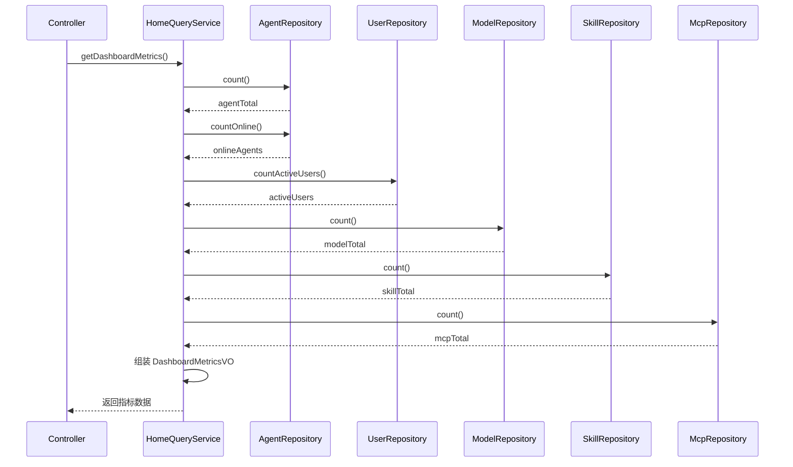

**getAgentDailyStats 时序：**

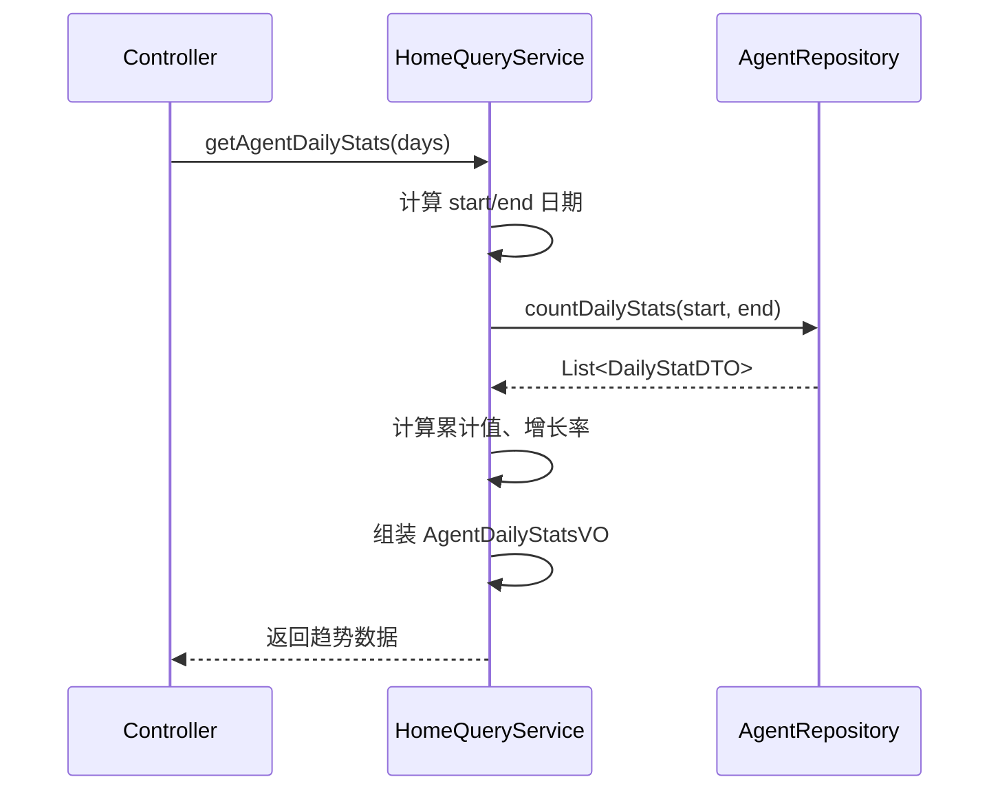

**getUserDailyStats 时序：**

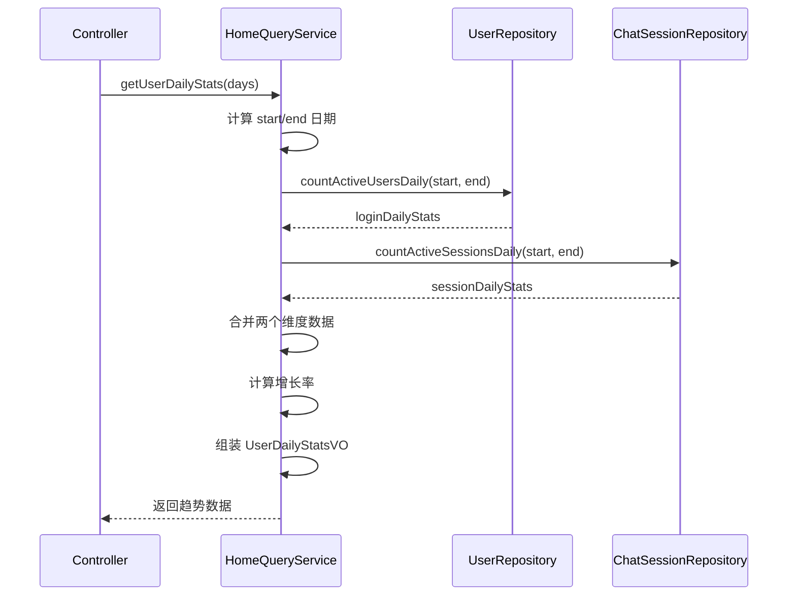

**getAgentStatusDistribution 时序：**

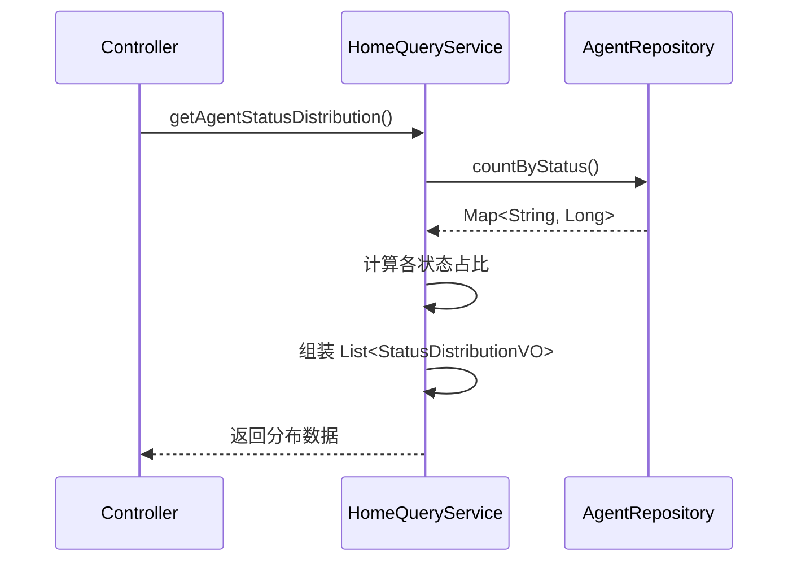

**getModelUsageRanking 时序：**

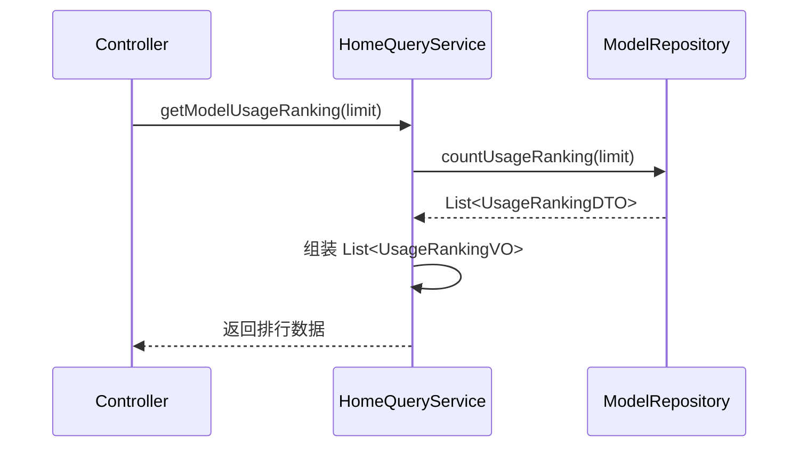

**getSkillInstallRanking 时序：**

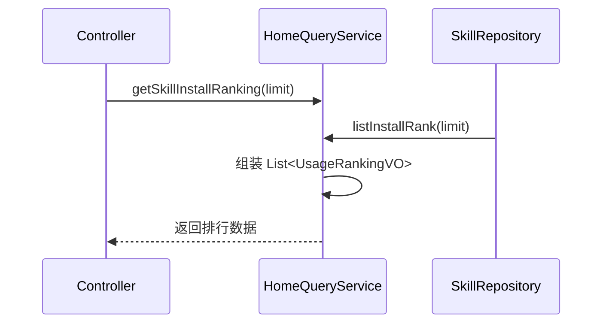

**getMcpDailyCalls 时序：**

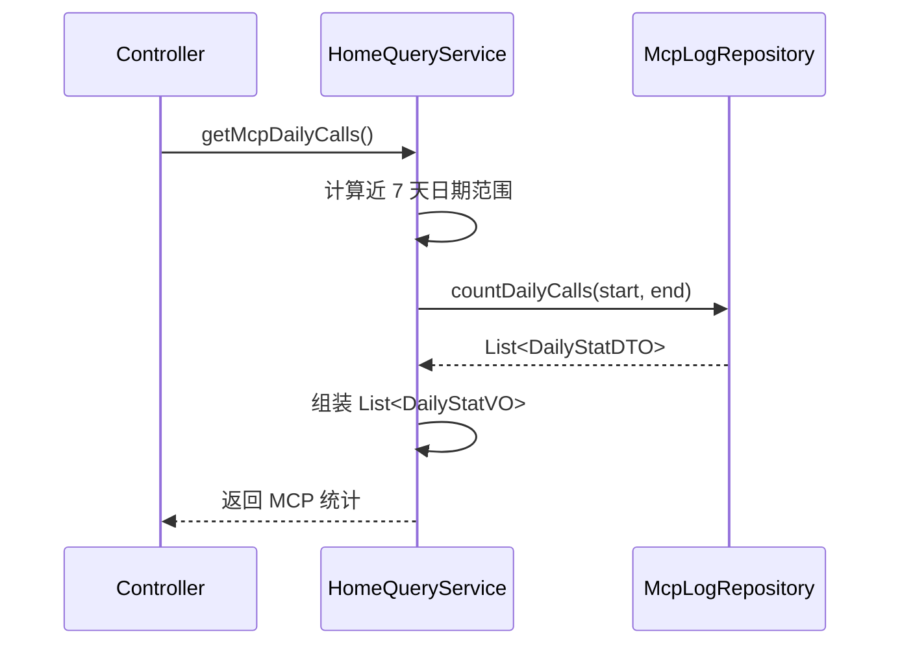

**getRecentActivities 时序：**

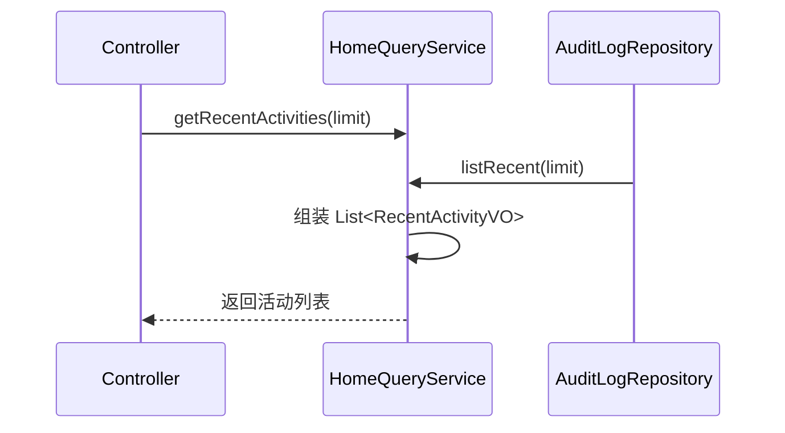

## 5. 控制器/Adapter 层设计

### 5.1 业务模块划分

| 模块 | Controller | 对应 Service 方法 |
|------|-----------|------------------|
| 首页统计 | HomeQueryController | HomeQueryService 各统计方法 |

### 5.2 首页统计（home）

#### 5.2.1 Controller 接口清单

所有接口均在 `HomeQueryController` 中新增，路径前缀为 `/api/home/query`。仅使用 GET/POST。

**接口 1：核心指标卡片**

```
GET /api/home/query/metrics
```

职责：返回 6 个核心指标卡片数据（含增长率）

请求参数：无（Query String 为空）

响应体 JSON：

```json
{
  "code": 200,
  "message": "success",
  "data": {
    "agentTotal": { "value": 128, "growthRate": 8.5 },
    "onlineAgents": { "value": 96, "growthRate": 3.2 },
    "activeUsers": { "value": 1245, "growthRate": -2.1 },
    "modelTotal": { "value": 24, "growthRate": 4.0 },
    "skillTotal": { "value": 58, "growthRate": 16.0 },
    "mcpTotal": { "value": 12, "growthRate": 0.0 }
  }
}
```

**接口时序：**

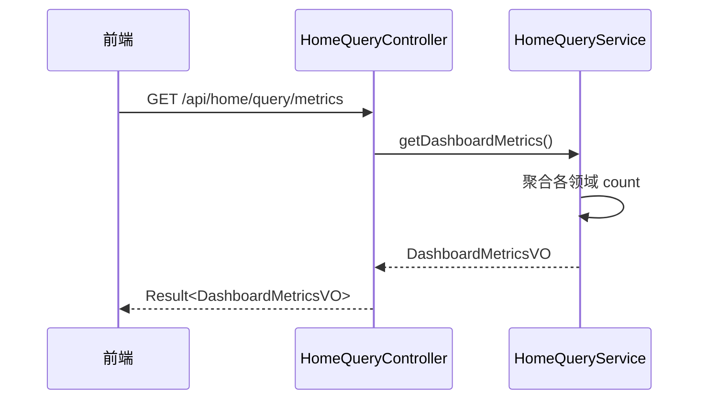

---

**接口 2：Agent 趋势数据**

```
GET /api/home/query/agent-stats?days=7
```

职责：返回 Agent 每日新增累计趋势

请求参数（Query String）：

| 参数 | 类型 | 必填 | 默认值 | 说明 |
|------|------|------|--------|------|
| days | int | 否 | 7 | 天数，7 或 30 |

响应体 JSON：

```json
{
  "code": 200,
  "message": "success",
  "data": {
    "dates": ["2026-04-28", "2026-04-29", "2026-04-30", ...],
    "values": [100, 105, 112, ...]
  }
}
```

**接口时序：**

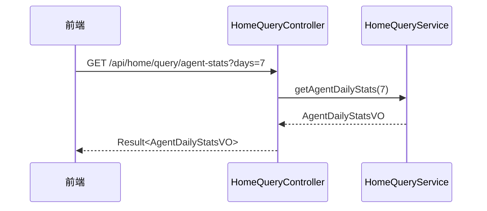

---

**接口 3：用户活跃趋势数据**

```
GET /api/home/query/user-activity?days=7
```

职责：返回用户每日活跃趋势（登录 + 会话双维度）

请求参数（Query String）：

| 参数 | 类型 | 必填 | 默认值 | 说明 |
|------|------|------|--------|------|
| days | int | 否 | 7 | 天数，7 或 30 |

响应体 JSON：

```json
{
  "code": 200,
  "message": "success",
  "data": {
    "dates": ["2026-04-28", "2026-04-29", "2026-04-30", ...],
    "loginActiveUsers": [45, 52, 48, ...],
    "sessionActiveUsers": [30, 35, 42, ...]
  }
}
```

**接口时序：**

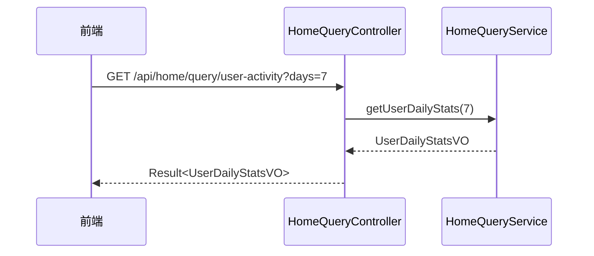

---

**接口 4：Agent 状态分布**

```
GET /api/home/query/agent-status-distribution
```

职责：返回各状态 Agent 数量及占比

请求参数：无

响应体 JSON：

```json
{
  "code": 200,
  "message": "success",
  "data": [
    { "status": "ONLINE", "count": 96, "percentage": 75.0 },
    { "status": "OFFLINE", "count": 20, "percentage": 15.6 },
    { "status": "DRAFT", "count": 6, "percentage": 4.7 },
    { "status": "PUBLISHED", "count": 3, "percentage": 2.3 },
    { "status": "ABNORMAL", "count": 2, "percentage": 1.6 },
    { "status": "PUBLISHING", "count": 1, "percentage": 0.8 }
  ]
}
```

**接口时序：**

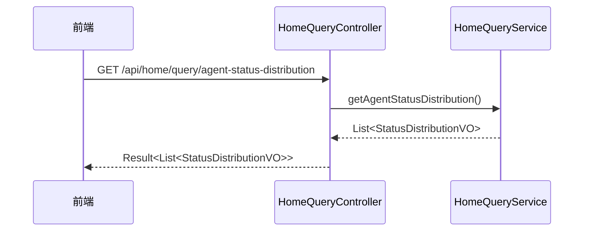

---

**接口 5：模型调用排行**

```
GET /api/home/query/model-ranking
```

职责：返回模型调用量 TOP 排行

请求参数（Query String）：

| 参数 | 类型 | 必填 | 默认值 | 说明 |
|------|------|------|--------|------|
| limit | int | 否 | 8 | 排行数量 |

响应体 JSON：

```json
{
  "code": 200,
  "message": "success",
  "data": [
    { "name": "GPT-4", "count": 1245 },
    { "name": "Claude-Sonet", "count": 987 },
    { "name": "Qwen-Max", "count": 654 }
  ]
}
```

**接口时序：**

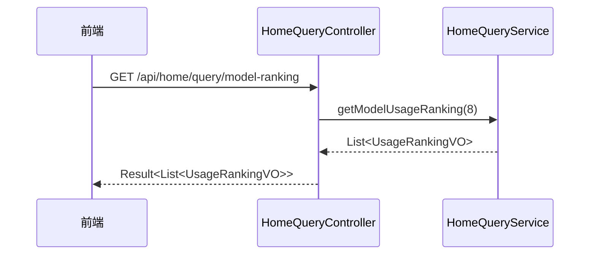

---

**接口 6：Skill 安装排行**

```
GET /api/home/query/skill-ranking
```

职责：返回 Skill 安装量 TOP 排行

请求参数（Query String）：

| 参数 | 类型 | 必填 | 默认值 | 说明 |
|------|------|------|--------|------|
| limit | int | 否 | 8 | 排行数量 |

响应体 JSON：

```json
{
  "code": 200,
  "message": "success",
  "data": [
    { "name": "code-review", "count": 856 },
    { "name": "data-analysis", "count": 723 },
    { "name": "doc-summary", "count": 612 }
  ]
}
```

**接口时序：**

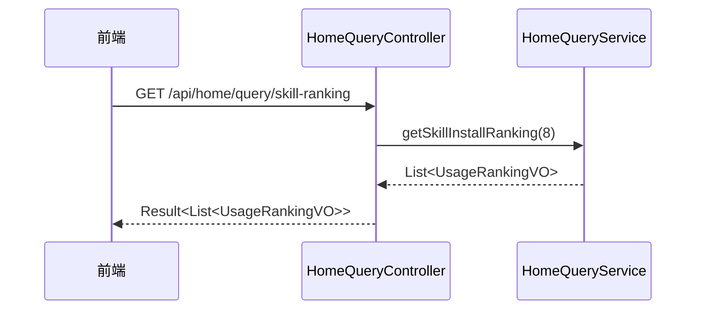

---

**接口 7：MCP 调用统计**

```
GET /api/home/query/mcp-calls
```

职责：返回近 7 天 MCP 每日调用数

请求参数：无

响应体 JSON：

```json
{
  "code": 200,
  "message": "success",
  "data": [
    { "date": "2026-04-28", "count": 120 },
    { "date": "2026-04-29", "count": 245 },
    { "date": "2026-04-30", "count": 310 }
  ]
}
```

**接口时序：**

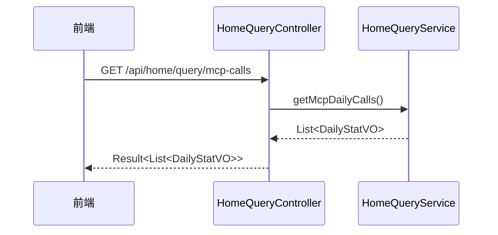

---

**接口 8：近期活动**

```
GET /api/home/query/activities
```

职责：返回最近操作活动记录

请求参数（Query String）：

| 参数 | 类型 | 必填 | 默认值 | 说明 |
|------|------|------|--------|------|
| limit | int | 否 | 10 | 记录条数 |

响应体 JSON：

```json
{
  "code": 200,
  "message": "success",
  "data": [
    {
      "time": "2026-05-05 10:32:15",
      "operatorName": "张三",
      "resourceType": "AGENT",
      "action": "CREATE",
      "detail": "创建了 Agent 订单助手",
      "result": "SUCCESS"
    }
  ]
}
```

**接口时序：**

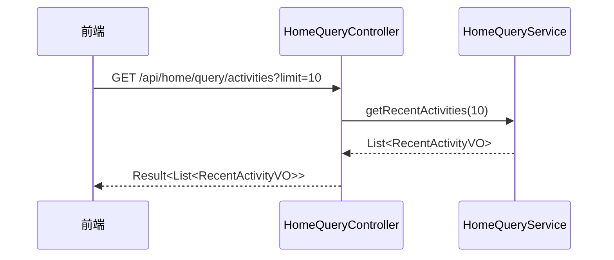

## 6. 数据库设计

### 6.1 说明

本需求为纯查询场景，**不新建任何表**，全部基于现有表进行聚合查询。

### 6.2 数据来源与 SQL 查询逻辑

| 图表 | 数据表 | 查询逻辑 |
|------|--------|----------|
| 核心指标 | agent, user, model, skill, mcp_service | COUNT + 条件过滤 |
| Agent 趋势 | agent | `DATE(create_time)` 分组 + 累计 |
| 用户活跃趋势 | user, chat_session | `DATE(last_login_time)` / `DATE(create_time)` 分组 |
| Agent 状态分布 | agent | `status` 分组 COUNT |
| 模型调用排行 | chat_message | `used_model` 分组 COUNT，取 TOP |
| Skill 安装排行 | skill | 按 `install_count` 排序，取 TOP |
| MCP 调用统计 | mcp_log | `DATE(create_time)` 分组 COUNT |
| 近期活动 | audit_log | `create_time` 倒序 LIMIT |

### 6.3 关键查询场景与索引建议

现有 `idx_create_time` 索引已覆盖大部分时间分组查询场景：

| 表 | 现有索引 | 是否满足 | 建议 |
|----|----------|----------|------|
| agent | idx_create_time, idx_status | 是 | 无需新增 |
| user | idx_create_time | 是 | last_login_time 无索引，建议新增 |
| chat_session | idx_create_time | 是 | 无需新增 |
| chat_message | idx_create_time | 是 | 无需新增（used_model 为 TEXT 字段，走全表扫描） |
| skill | idx_category, idx_status | 是 | install_count 排序无需额外索引 |
| mcp_log | idx_create_time | 是 | 无需新增 |
| audit_log | idx_create_time | 是 | 无需新增 |

**建议新增索引**（可选，提升性能）：

```sql
-- user 表 last_login_time 索引
ALTER TABLE `user` ADD INDEX `idx_last_login_time` (`last_login_time`);
```

### 6.4 DDL 语句

仅新增一个索引：

```sql
-- 支持按 last_login_time 统计每日活跃用户
ALTER TABLE `user` ADD INDEX `idx_last_login_time` (`last_login_time`);
```

## 7. 模块变更清单

| 层 | 变更类型 | 变更内容 | 对应 Skill |
|----|----------|----------|------------|
| client | 新增 | 新增 VO：`DashboardMetricsVO`, `MetricVO`, `AgentDailyStatsVO`, `UserDailyStatsVO`, `StatusDistributionVO`, `UsageRankingVO`, `DailyStatVO`, `RecentActivityVO` | impl-client-module |
| domain (agent) | 修改 | AgentRepository 新增方法：`countDailyStats`, `countByStatus` | impl-domain-module |
| domain (user) | 修改 | UserRepository 新增方法：`countActiveUsersDaily` | impl-domain-module |
| domain (user) | 修改 | ChatSessionRepository 新增方法：`countActiveSessionsDaily` | impl-domain-module |
| domain (model) | 修改 | ModelRepository 新增方法：`countUsageRanking` | impl-domain-module |
| domain (skill) | 修改 | SkillRepository 新增方法：`listInstallRank` | impl-domain-module |
| domain (mcp) | 修改 | McpLogRepository 新增方法：`countDailyCalls` | impl-domain-module |
| domain (audit) | 修改 | AuditLogRepository 新增方法：`listRecent` | impl-domain-module |
| infra (agent) | 修改 | AgentRepositoryImpl 实现新增方法 | impl-infra-module |
| infra (user) | 修改 | UserRepositoryImpl、ChatSessionRepositoryImpl 实现新增方法 | impl-infra-module |
| infra (model) | 修改 | ModelRepositoryImpl 实现新增方法 | impl-infra-module |
| infra (skill) | 修改 | SkillRepositoryImpl 实现新增方法 | impl-infra-module |
| infra (mcp) | 修改 | McpLogRepositoryImpl 实现新增方法 | impl-infra-module |
| infra (audit) | 修改 | AuditLogRepositoryImpl 实现新增方法 | impl-infra-module |
| application | 修改 | HomeQueryService 新增 8 个统计方法 | impl-application-module |
| adapter | 修改 | HomeQueryController 新增 8 个 GET 接口 | impl-adapter-module |

## 8. 代码分支命名

`feature-20260505-dashboard-statistics`

## 9. 实现顺序与依赖

按照六层依赖顺序：

1. **client** — 新增统计相关 VO/DTO
2. **domain** — 各 Repository 新增统计查询方法
3. **infra** — 实现 Repository 方法（Mapper 层 SQL）
4. **application** — HomeQueryService 新增聚合方法
5. **adapter** — HomeQueryController 新增 REST 接口
6. **前端** — 引入 echarts-for-react，重构 Dashboard 页面

前端可与后端并行开发（基于接口契约）。

## 10. 接口与数据契约

详见第 5 章「控制器/Adapter 层设计」中的接口清单与 JSON 描述。

### 关键 VO 结构

**DashboardMetricsVO**：

```
DashboardMetricsVO
├── agentTotal: MetricVO { value: long, growthRate: double }
├── onlineAgents: MetricVO { value: long, growthRate: double }
├── activeUsers: MetricVO { value: long, growthRate: double }
├── modelTotal: MetricVO { value: long, growthRate: double }
├── skillTotal: MetricVO { value: long, growthRate: double }
└── mcpTotal: MetricVO { value: long, growthRate: double }
```

**AgentDailyStatsVO**：

```
AgentDailyStatsVO
├── dates: List<String>    // ["2026-04-28", "2026-04-29", ...]
└── values: List<Long>     // [100, 105, ...] 累计值
```

**UserDailyStatsVO**：

```
UserDailyStatsVO
├── dates: List<String>
├── loginActiveUsers: List<Long>
└── sessionActiveUsers: List<Long>
```

**StatusDistributionVO**：

```
StatusDistributionVO
├── status: String    // ONLINE, OFFLINE, etc.
├── count: Long
└── percentage: Double  // 0~100
```

**UsageRankingVO**：

```
UsageRankingVO
├── name: String
└── count: Long
```

**DailyStatVO**：

```
DailyStatVO
├── date: String
└── count: Long
```

**RecentActivityVO**：

```
RecentActivityVO
├── time: Date
├── operatorName: String
├── resourceType: String
├── action: String
├── detail: String
└── result: String
```

## 11. 其他

### 11.1 前端技术栈变更

- 新增依赖：`echarts`（最新版）和 `echarts-for-react`
- 安装命令：`cd frontend/admin && npm install echarts echarts-for-react`

### 11.2 增长率计算规则

- 对比基准 = 上周同期（同星期几）
- 公式：`growthRate = (todayValue - lastWeekValue) / lastWeekValue * 100`
- lastWeekValue 为 0 时，growthRate 返回 null

### 11.3 非功能约束

- 全部接口响应时间 ≤ 2 秒
- 纯实时查询，无缓存层
- 接口均不需要鉴权升级（沿用现有 Token 鉴权）
