# Agent 管理 技术方案

> **版本**：V1.0  
> **日期**：2026-05-15  
> **输入 PRD**：`doc/产品方案/2026-05-15_Agent管理-PRD.md`  
> **分支名**：`feature-20260515-agent-management`  

---

## 1. 目标与范围

### 1.1 目标
- 扩展 Agent 基础信息，新增 `userPrompt` 字段和乐观锁 `version` 字段
- Agent 支持从模型管理中单选已启用模型作为绑定模型（通过 AgentResourceBinding）
- Agent 支持绑定多个工作流，支持排序、启停、解绑
- Agent 支持绑定多个 Skill，支持排序、解绑
- 发布 Agent 时必须已绑定模型，否则阻止
- 发布时将工作流/Skill 绑定快照存入 config_snapshot
- 前端 Agent 页面同步适配新增字段和接口

### 1.2 范围
- **包含**：backend 六层变更 + frontend/admin 前端变更
- **不包含**：工作流可视化编排、Skill 运行时追踪、Agent 版本回滚 UI 改造、Agent 市场发布

### 1.3 六层依赖关系
```
adapter → application → domain → facade
                      → infra → facade
           → client → facade
```
adapter 调用 application service 和 query service；application 调用 domain repository；infra 实现 domain repository 接口。

---

## 2. 架构设计（代码结构）

| 层 | 领域 | 包 | 职责 |
|---|------|---|------|
| facade | common | `com.gagentmanager.facade.common` | 新增 3 个 ErrorCode |
| client | agent | `com.gagentmanager.client.agent` | 新增 4 个 Param 类，扩展 AgentVO |
| client | model | `com.gagentmanager.client.model` | 复用已有 ModelVO（查询已启用模型列表） |
| client | workflow | `com.gagentmanager.client.workflow` | 复用已有 WorkflowVO（查询可用工作流） |
| client | skill | `com.gagentmanager.client.skill` | 复用已有 SkillVO（查询可用 Skill） |
| domain | agent | `com.gagentmanager.domain.agent` | Agent 新增字段和方法、AgentResourceBinding 新增字段和方法 |
| infra | agent | `com.gagentmanager.infra.agent` | Entity 新增字段、Mapper/Repository 新增方法 |
| application | agent | `com.gagentmanager.application.agent` | CommandService 新增 6 个方法、QueryService 新增 3 个方法 |
| adapter | agent | `com.gagentmanager.adapter.agent` | CommandController 新增 7 个接口、QueryController 新增 1 个接口 |
| adapter | model | `com.gagentmanager.adapter.model` | 复用已有 ModelCommandController 的 list 接口（查询已启用模型） |
| adapter | workflow | `com.gagentmanager.adapter.workflow` | 复用已有 WorkflowCommandController 的 list 接口（查询已发布工作流） |
| adapter | skill | `com.gagentmanager.adapter.skill` | 复用已有 SkillCommandController 的 list 接口（查询可用 Skill） |

---

## 3. 领域模型设计

### 3.1 业务层级划分

| 层级 | 领域 | 说明 | 是否变更 |
|------|------|------|---------|
| 核心域 | Agent | Agent 全生命周期管理 | **是** |
| 支撑域 | Model | 模型管理（提供已启用模型列表） | 仅查询，不修改 |
| 支撑域 | Workflow | 工作流管理（提供已发布工作流列表） | 仅查询，不修改 |
| 支撑域 | Skill | Skill 管理（提供可用 Skill 列表） | 仅查询，不修改 |

### 3.2 Agent 领域

#### 3.2.1 领域模型

**领域类图**：
```mermaid
classDiagram
    class Agent {
        +Long id
        +String num
        +String agentCode
        +String agentName
        +String agentType
        +String description
        +String iconUrl
        +String systemPrompt
        +String userPrompt
        +String status
        +String version
        +BigDecimal temperature
        +Integer maxTokens
        +BigDecimal topP
        +Integer topK
        +BigDecimal frequencyPenalty
        +BigDecimal presencePenalty
        +String stopSequences
        +String responseFormat
        +Integer timeoutSeconds
        +Integer retryCount
        +Long version
        +save(operatorId)
        +delete(operatorId)
        +updateConfig(...)
        +publish(newVersion, operatorId)
        +deploy(operatorId)
        +start(operatorId)
        +stop(operatorId)
        +rollback(targetVersion, operatorId)
        +validateModelBound()
    }

    class AgentVersion {
        +Long id
        +String num
        +Long agentId
        +String version
        +String versionTag
        +String changelog
        +String configSnapshot
        +String status
        +publish()
    }

    class AgentResourceBinding {
        +Long id
        +String num
        +Long agentId
        +String resourceType
        +Long resourceId
        +Boolean isDefault
        +Integer sortOrder
        +String config
        +Boolean isEnabled
        +create(...)
        +delete(operatorId)
        +toggleEnabled(operatorId)
        +updateSort(sortOrder, operatorId)
    }

    Agent "1" --> "0..*" AgentVersion : 版本历史
    Agent "1" --> "0..*" AgentResourceBinding : 资源绑定
    AgentResourceBinding "resourceType" ..> "MODEL|WORKFLOW|SKILL|MCP" : 枚举
```

**领域对象结构**：

| 对象 | 类型 | 基本属性 | 说明 |
|------|------|---------|------|
| Agent | 聚合根 | id, num, create_no, update_no, version(乐观锁) | Agent 聚合根，包含基础信息和 LLM 配置 |
| AgentVersion | 可持久化实体 | id, num, create_no, update_no | 版本快照实体 |
| AgentResourceBinding | 可持久化实体 | id, num, create_no, update_no | 资源绑定实体（MODEL/WORKFLOW/SKILL/MCP） |

#### 3.2.2 领域规则

| 聚合/对象 | 规则类型 | 规则描述 | 违反时表达 |
|-----------|---------|---------|-----------|
| Agent | 不变性 | agentCode 全局唯一 | AGENT_CODE_ALREADY_EXISTS(1101) |
| Agent | 状态机 | 删除：ONLINE 状态不可删除 | AGENT_ALREADY_ONLINE(1107) |
| Agent | 状态机 | 部署：仅 PUBLISHED 可部署 | AGENT_NOT_PUBLISHED(1106) |
| Agent | 状态机 | 启动：已在线不可重复启动 | AGENT_ALREADY_ONLINE(1107) |
| Agent | 状态机 | 停止：已离线不可重复停止 | AGENT_ALREADY_OFFLINE(1108) |
| Agent | 业务规则 | 发布前必须绑定模型 | AGENT_MODEL_NOT_BOUND(1111) |
| Agent | 乐观锁 | 更新时 version 必须匹配 | OPTIMISTIC_LOCK_FAILURE(1112) |
| AgentResourceBinding | 不变性 | 同一 Agent 只能绑定一个 MODEL | AGENT_MODEL_ALREADY_BOUND(1113) |
| AgentResourceBinding | 业务规则 | 绑定 WORKFLOW 时必须为已发布状态 | WORKFLOW_NOT_PUBLISHED(1505) |
| AgentResourceBinding | 业务规则 | 绑定 SKILL 时必须为已安装状态 | SKILL_NOT_INSTALLED(1303) |

#### 3.2.3 领域动作

| 聚合/实体 | 领域动作 | 职责 | 前置条件 | 后置条件/规则 | 领域事件 |
|-----------|---------|------|---------|--------------|---------|
| Agent | save(operatorId) | 新建或更新 Agent | agentCode 唯一 | 新建时 status=DRAFT, version=V1.0.0 | - |
| Agent | delete(operatorId) | 逻辑删除 Agent | 非 ONLINE 状态 | deleted=true | AgentDeletedEvent |
| Agent | updateConfig(params, operatorId) | 热更新 LLM 配置和提示词 | Agent 存在 | 仅非空字段覆盖 | AgentConfigUpdatedEvent |
| Agent | publish(newVersion, operatorId) | 发布 Agent | 已绑定模型 | status=PUBLISHED, 更新版本号 | AgentPublishedEvent |
| Agent | deploy(operatorId) | 部署 Agent | PUBLISHED 状态 | status=ONLINE | AgentDeployedEvent |
| Agent | start(operatorId) | 启动 Agent | 非 ONLINE 状态 | status=ONLINE | AgentStartedEvent |
| Agent | stop(operatorId) | 停止 Agent | 非 OFFLINE 状态 | status=OFFLINE | AgentStoppedEvent |
| Agent | rollback(targetVersion, operatorId) | 回滚到指定版本 | 版本存在 | version=targetVersion | AgentRolledBackEvent |
| Agent | validateModelBound() | 校验是否已绑定模型 | Agent 存在 | 至少有一个 MODEL 类型的绑定 | - |
| AgentResourceBinding | create(agentId, resourceType, resourceId, ...) | 创建资源绑定 | Agent 存在、resource 可用 | 入库，sortOrder 默认 0，isEnabled 默认 true | ResourceBindingCreatedEvent |
| AgentResourceBinding | delete(operatorId) | 解绑资源 | 绑定存在 | 逻辑删除 | ResourceBindingDeletedEvent |
| AgentResourceBinding | toggleEnabled(operatorId) | 启停资源 | 绑定存在 | isEnabled 取反 | ResourceBindingToggledEvent |
| AgentResourceBinding | updateSort(sortOrder, operatorId) | 更新排序 | 绑定存在 | sortOrder 更新 | ResourceBindingSortUpdatedEvent |

**领域动作时序图**：

**（1）Agent.publish**：
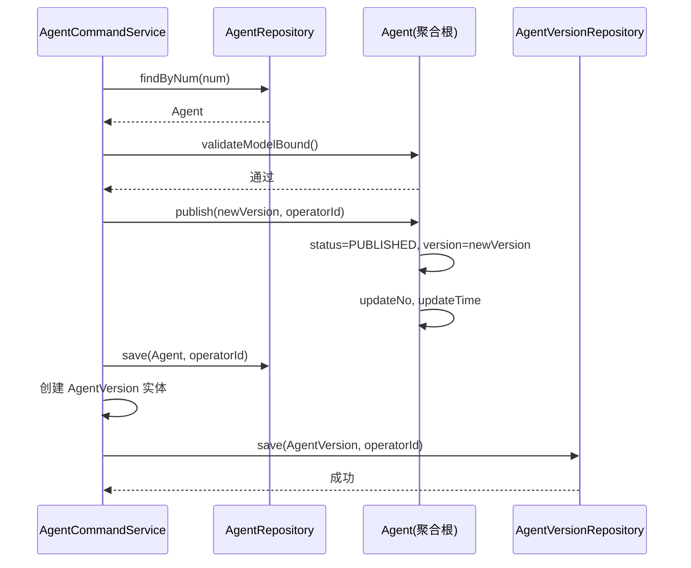

**（2）Agent.bindResource（绑定工作流/Skill）**：
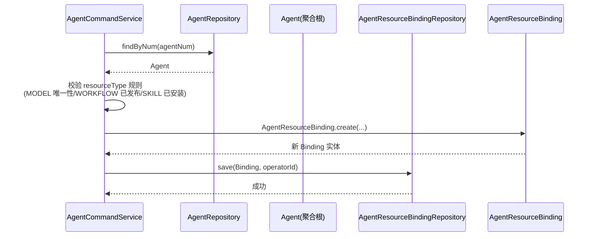

**（3）AgentResourceBinding.toggleEnabled**：
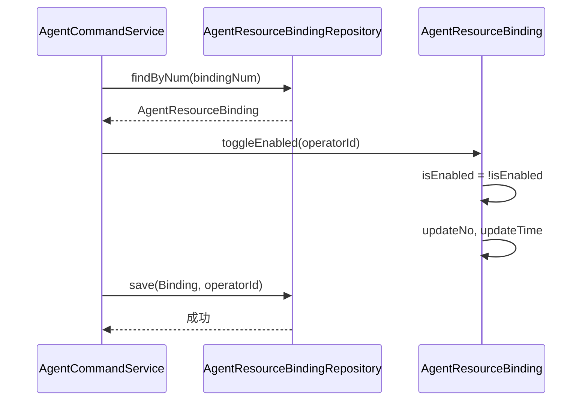

**（4）Agent.updateSort（批量排序）**：
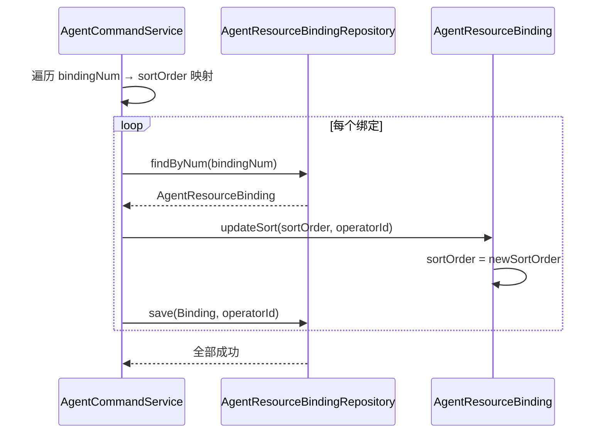

#### 3.2.4 领域事件

| 事件名 | 触发时机 | 载荷要点 | 可订阅方/用途 |
|--------|---------|---------|--------------|
| AgentPublishedEvent | Agent 发布成功 | agentId, num, version, operatorId | 审计日志、通知 |
| AgentDeployedEvent | Agent 部署成功 | agentId, num, operatorId | 运维监控 |
| AgentStartedEvent | Agent 启动成功 | agentId, num, operatorId | 运维监控 |
| AgentStoppedEvent | Agent 停止成功 | agentId, num, operatorId | 运维监控 |
| AgentConfigUpdatedEvent | Agent 配置更新 | agentId, num, changedFields | 审计日志 |
| ResourceBindingCreatedEvent | 资源绑定创建 | agentId, resourceType, resourceId | 审计日志 |
| ResourceBindingDeletedEvent | 资源解绑 | agentId, bindingNum, resourceType | 审计日志 |
| ResourceBindingToggledEvent | 资源启停 | agentId, bindingNum, isEnabled | 审计日志 |

---

## 4. 应用层设计

### 4.1 业务模块划分

| application 模块 | 对应领域 | 变更类型 |
|-----------------|---------|---------|
| agent.AgentCommandService | Agent 聚合根 | 新增 6 个方法 |
| agent.AgentQueryService | Agent 查询 | 新增 3 个方法 |

### 4.2 Agent Command 服务

#### 4.2.1 Service 方法清单

| 方法签名 | 职责 | 入参 | 出参 |
|---------|------|------|------|
| `bindModel(agentNum, modelId, operatorId)` | 绑定模型（resourceType=MODEL，唯一） | String, Long, Long | void |
| `bindWorkflow(agentNum, workflowId, sortOrder, operatorId)` | 绑定工作流 | String, Long, Integer, Long | void |
| `unbindWorkflow(bindingNum, operatorId)` | 解绑工作流 | String, Long | void |
| `toggleWorkflow(bindingNum, operatorId)` | 启停工作流 | String, Long | void |
| `bindSkill(agentNum, skillId, sortOrder, operatorId)` | 绑定 Skill | String, Long, Integer, Long | void |
| `unbindSkill(bindingNum, operatorId)` | 解绑 Skill | String, Long | void |

> 注：`updateBindingSort` 为通用方法，接受 `List<UpdateBindingSortParam>` 批量更新排序。

#### 4.2.2 方法时序逻辑

**bindModel**：
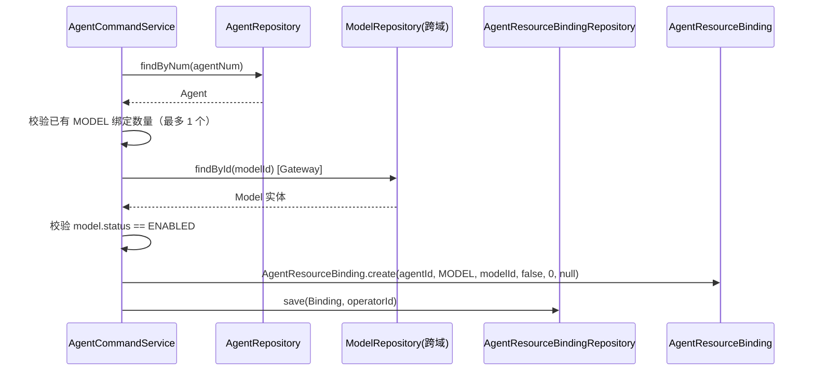

**bindWorkflow**：
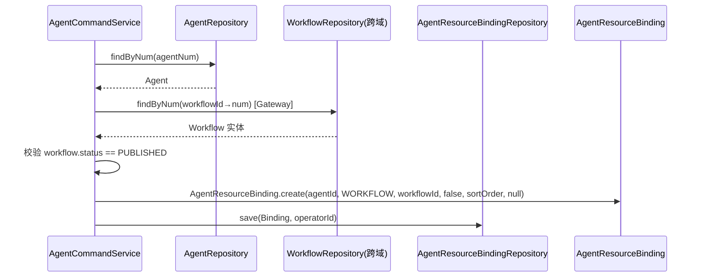

**bindSkill**：
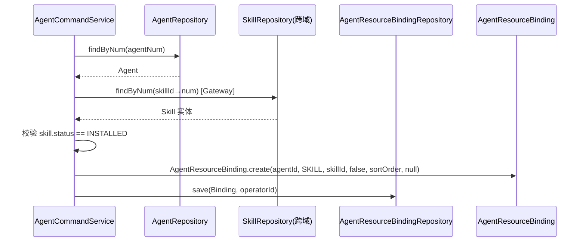

**unbindWorkflow / unbindSkill**（统一 unbindResource，已通过 bindingNum 解绑，复用现有方法）

**toggleWorkflow**：
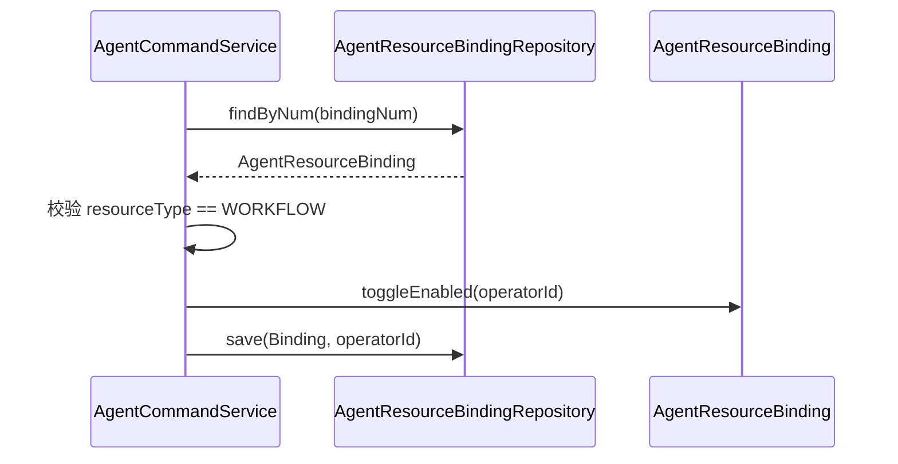

**updateBindingSort（通用批量排序）**：
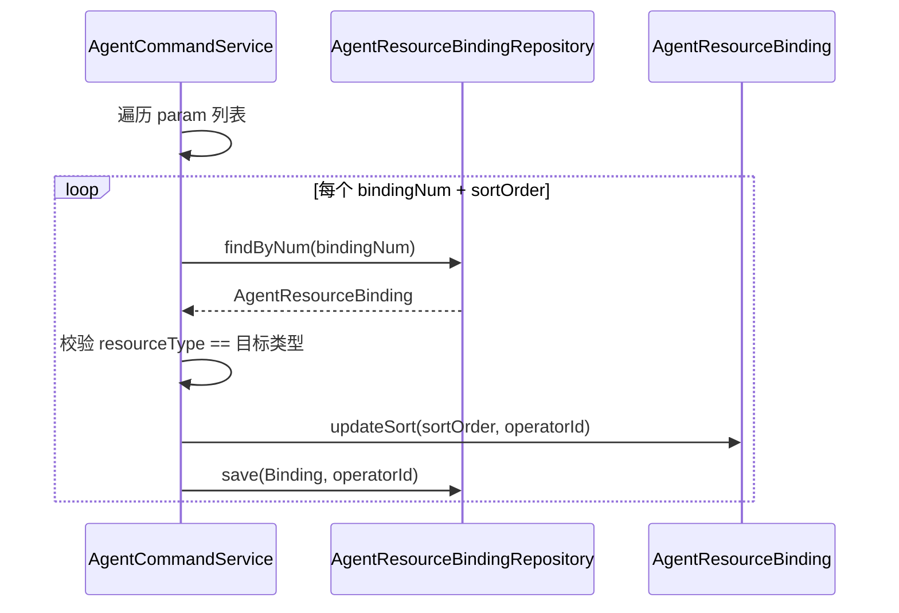

**publishAgent（修改现有方法）**：
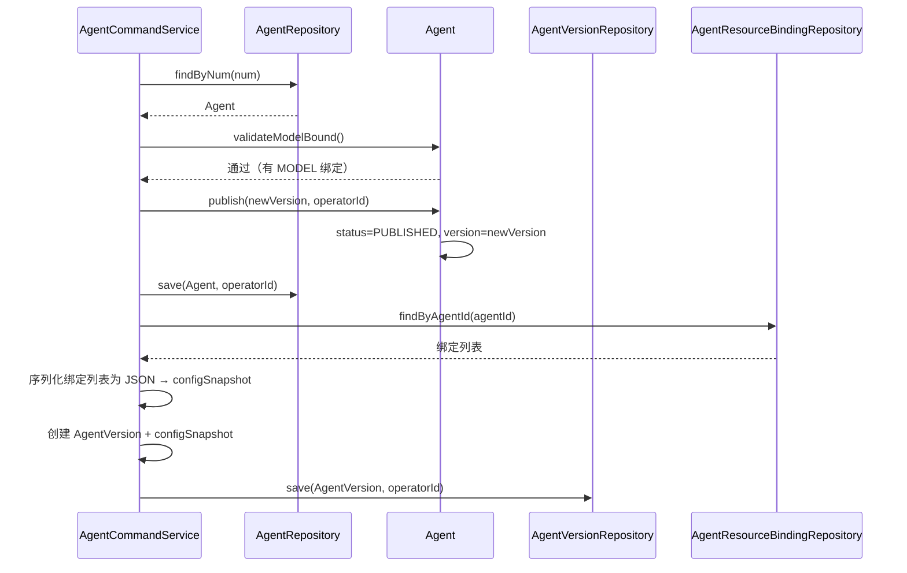

### 4.3 Agent Query 服务

#### 4.3.1 Service 方法清单

| 方法签名 | 职责 | 入参 | 出参 |
|---------|------|------|------|
| `listBindingsByType(agentId, resourceType)` | 按类型查询绑定列表 | Long, String | List<AgentResourceBindingVO> |
| `listBindingsByTypeWithStatus(agentId, resourceType)` | 按类型查询绑定列表（含资源状态实时校验） | Long, String | List<AgentResourceBindingVO> |
| `listEnabledModels()` | 查询所有已启用模型列表 | 无 | List<ModelVO> |

#### 4.4.2 方法时序逻辑

**listBindingsByTypeWithStatus**（核心新方法，实时校验资源状态）：
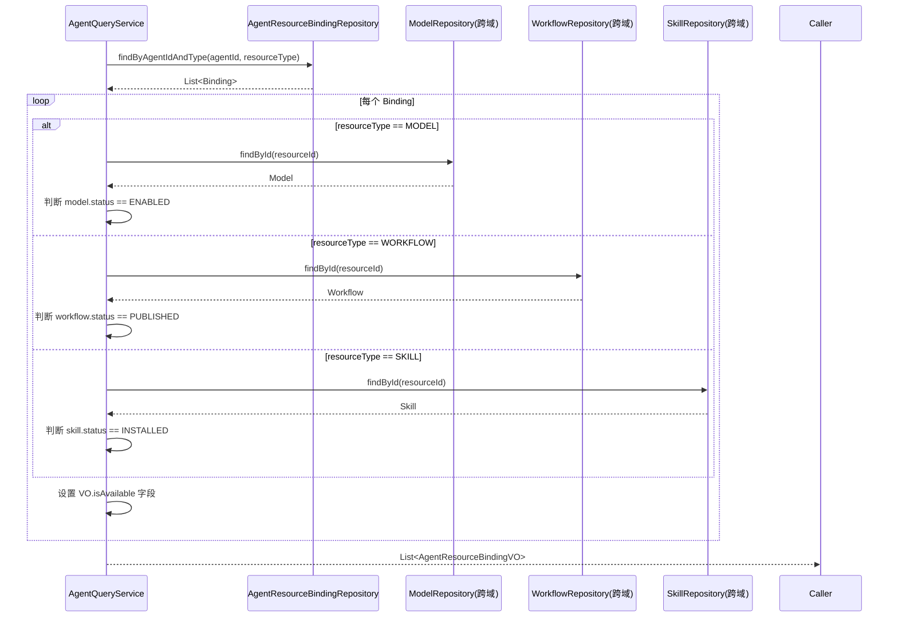

**listEnabledModels**：
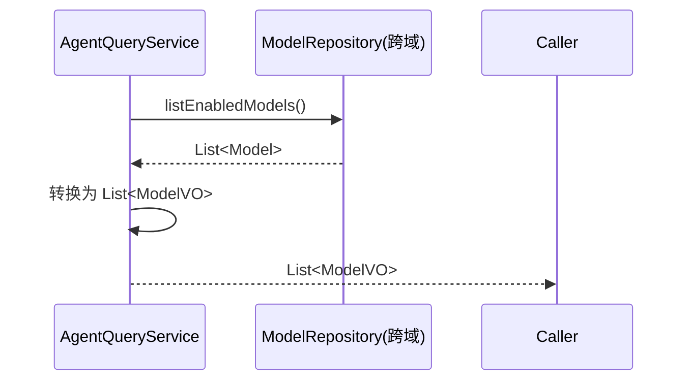

---

## 5. 控制器/Adapter 层设计

### 5.1 业务模块划分

| Controller | 路径前缀 | 对应 Service | 变更类型 |
|-----------|---------|-------------|---------|
| AgentCommandController | `/api/agent/command` | AgentCommandService | 新增 7 个接口 |
| AgentQueryController | `/api/agent/query` | AgentQueryService | 新增 1 个接口 |

> Model/Workflow/Skill 的列表查询接口已存在于各自的 CommandController 中，通过 GET 复用。

### 5.2 Agent Command 接口

#### 5.2.1 接口清单

| # | HTTP | 路径 | 职责 | 入参 | 返回值 |
|---|------|------|------|------|--------|
| 1 | POST | `/api/agent/command/bind-model` | 绑定模型 | `{ "modelId": 1001 }` | `{ "code": 200, "data": null }` |
| 2 | POST | `/api/agent/command/bind-workflow` | 绑定工作流 | `{ "resourceId": 2001, "sortOrder": 1 }` | `{ "code": 200, "data": null }` |
| 3 | POST | `/api/agent/command/unbind-workflow` | 解绑工作流 | `bindingNum` (query) | `{ "code": 200, "data": null }` |
| 4 | POST | `/api/agent/command/toggle-workflow` | 启停工作流 | `bindingNum` (query) | `{ "code": 200, "data": null }` |
| 5 | POST | `/api/agent/command/bind-skill` | 绑定 Skill | `{ "resourceId": 3001, "sortOrder": 1 }` | `{ "code": 200, "data": null }` |
| 6 | POST | `/api/agent/command/unbind-skill` | 解绑 Skill | `bindingNum` (query) | `{ "code": 200, "data": null }` |
| 7 | POST | `/api/agent/command/update-binding-sort` | 批量更新排序 | `{ "bindings": [{"bindingNum":"xxx","sortOrder":1}] }` | `{ "code": 200, "data": null }` |

**入参 JSON 详情**：

**BindModelParam**：
```json
{
  "modelId": 1001
}
```

**BindResourceParam**（复用，workflow/skill 共用）：
```json
{
  "resourceId": 2001,
  "sortOrder": 1
}
```

**UpdateBindingSortParam**：
```json
{
  "bindings": [
    { "bindingNum": "BIND-001", "sortOrder": 1 },
    { "bindingNum": "BIND-002", "sortOrder": 2 }
  ]
}
```

#### 5.2.2 接口时序逻辑

**bind-model**：
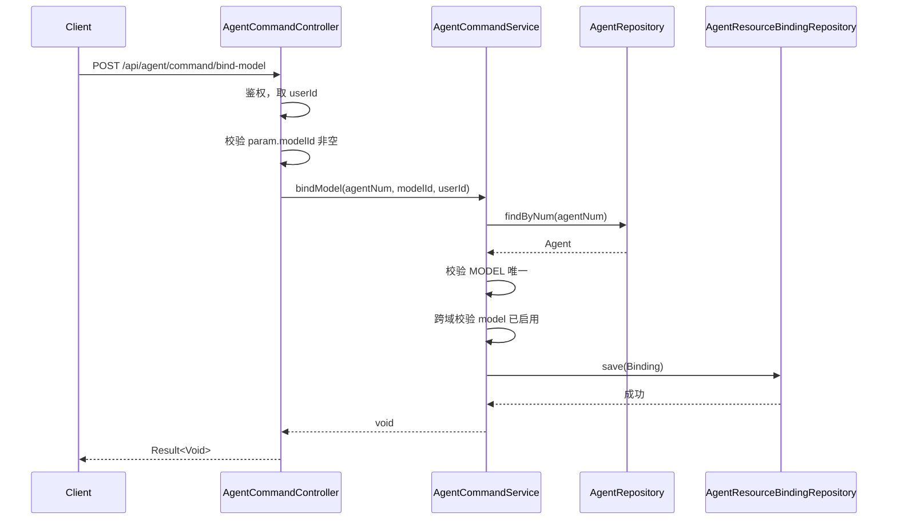

**bind-workflow**：
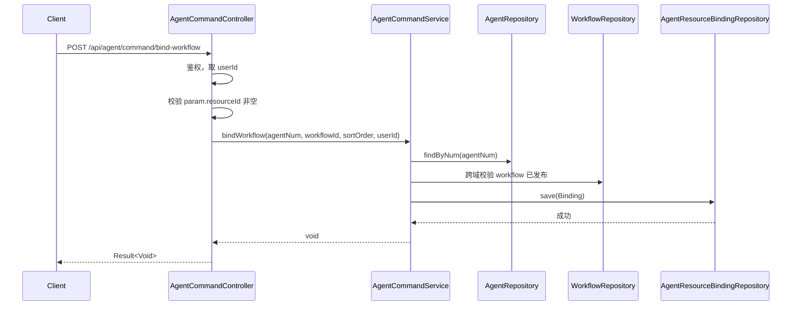

**update-binding-sort**：
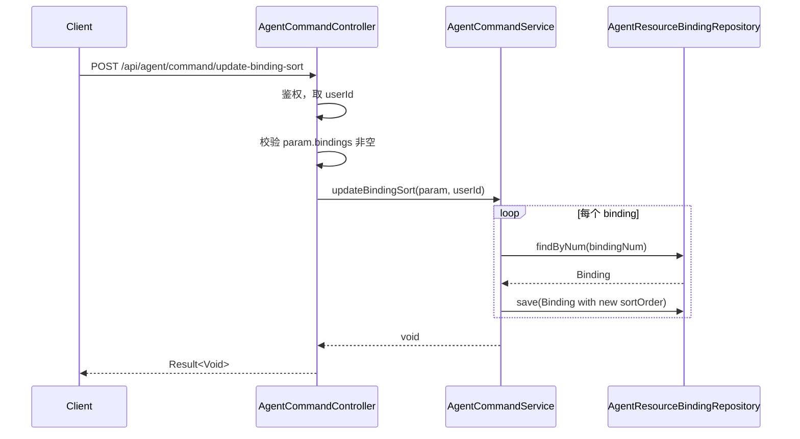

### 5.3 Agent Query 接口

#### 5.3.1 接口清单

| # | HTTP | 路径 | 职责 | 入参 | 返回值 |
|---|------|------|------|------|--------|
| 1 | GET | `/api/agent/query/bindings` | 查询绑定列表（含资源状态） | `agentId`, `resourceType`(query) | `{ "code": 200, "data": [...] }` |
| 2 | GET | `/api/agent/query/enabled-models` | 查询已启用模型列表 | 无 | `{ "code": 200, "data": [...] }` |

**返回值 JSON 示例**（bindings）：
```json
{
  "code": 200,
  "data": [
    {
      "id": 100,
      "num": "BIND-001",
      "agentId": 1001,
      "resourceType": "WORKFLOW",
      "resourceId": 2001,
      "resourceName": "审批流程",
      "isEnabled": true,
      "isAvailable": true,
      "sortOrder": 1,
      "config": null,
      "createTime": "2026-05-15 10:00:00"
    }
  ]
}
```

**返回值 JSON 示例**（enabled-models）：
```json
{
  "code": 200,
  "data": [
    {
      "id": 1001,
      "num": "MODEL-GPT4",
      "modelName": "GPT-4",
      "provider": "OpenAI",
      "status": "ENABLED"
    }
  ]
}
```

#### 5.3.2 接口时序逻辑

**bindings（含状态校验）**：
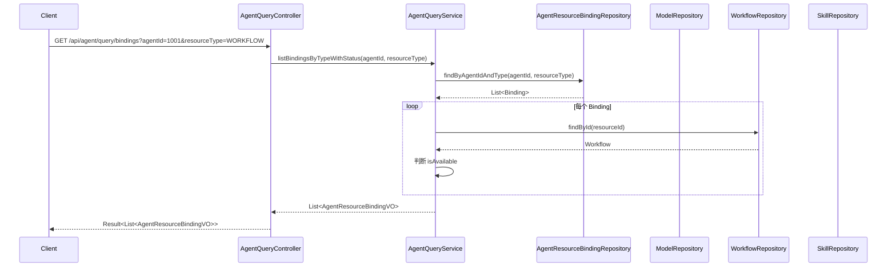

---

## 6. 数据库设计

### 6.1 表结构变更

#### 6.1.1 agent 表

| 变更 | 字段名 | 类型 | 必填 | 说明 |
|------|--------|------|------|------|
| 新增 | `user_prompt` | TEXT | 否 | 用户提示词（预设输入模板） |
| 新增 | `version` | BIGINT | 是，默认 0 | 乐观锁版本号 |

#### 6.1.2 agent_resource_binding 表

| 变更 | 字段名 | 类型 | 必填 | 说明 |
|------|--------|------|------|------|
| 新增 | `is_enabled` | TINYINT(1) | 是，默认 1 | Agent 级启停开关 |

#### 6.1.3 表与领域对应

| 表 | 领域聚合/实体 | 说明 |
|---|-------------|------|
| agent | Agent（聚合根） | 新增 user_prompt, version 字段 |
| agent_resource_binding | AgentResourceBinding（实体） | 新增 is_enabled 字段 |
| agent_version | AgentVersion（实体） | 无变更，config_snapshot 已存在 |

### 6.2 DDL 语句

```sql
-- ============================================================================
-- Agent 管理扩展 DDL
-- ============================================================================

-- 1. agent 表新增 user_prompt 和 version（乐观锁）字段
ALTER TABLE `agent`
    ADD COLUMN `user_prompt` TEXT DEFAULT NULL COMMENT '用户提示词（预设输入模板）' AFTER `system_prompt`,
    ADD COLUMN `version` BIGINT NOT NULL DEFAULT 0 COMMENT '乐观锁版本号' AFTER `retry_count`;

-- 2. agent_resource_binding 表新增 is_enabled 字段
ALTER TABLE `agent_resource_binding`
    ADD COLUMN `is_enabled` TINYINT(1) NOT NULL DEFAULT 1 COMMENT 'Agent 级启停开关' AFTER `sort_order`;
```

### 6.3 刷数/DML 语句

```sql
-- 历史数据初始化：已有 binding 默认启用
UPDATE `agent_resource_binding` SET `is_enabled` = 1 WHERE `is_enabled` IS NULL;
```

---

## 7. 模块变更清单

| 层 | 文件/类 | 变更类型 | 对应 skill |
|---|---------|---------|-----------|
| **facade** | `ErrorCode.java` | 新增 3 个错误码 | impl-facade-module |
| **client** | `AgentVO.java` | 新增 userPrompt 字段 | impl-client-module |
| **client** | `CreateAgentParam.java` | 新增 userPrompt 字段 | impl-client-module |
| **client** | `UpdateAgentParam.java` | 新增 userPrompt 字段 | impl-client-module |
| **client** | `BindModelParam.java` | 新建 | impl-client-module |
| **client** | `BindWorkflowParam.java` | 新建 | impl-client-module |
| **client** | `BindSkillParam.java` | 新建 | impl-client-module |
| **client** | `UpdateBindingSortParam.java` | 新建 | impl-client-module |
| **client** | `AgentResourceBindingVO.java` | 新增 isEnabled, isAvailable, resourceName 字段 | impl-client-module |
| **domain** | `Agent.java` | 新增 userPrompt, version 字段；新增 validateModelBound() 方法 | impl-domain-module |
| **domain** | `AgentResourceBinding.java` | 新增 isEnabled 字段；新增 toggleEnabled(), updateSort() 方法 | impl-domain-module |
| **domain** | `AgentRepository.java` | 新增 findByIdWithVersion（乐观锁校验）方法 | impl-domain-module |
| **infra** | `AgentEntity.java` | 新增 userPrompt, version 字段 | impl-infra-module |
| **infra** | `AgentResourceBindingEntity.java` | 新增 isEnabled 字段 | impl-infra-module |
| **infra** | `AgentRepositoryImpl.java` | 实现 optimistic lock 更新逻辑 | impl-infra-module |
| **application** | `AgentCommandService.java` | 新增 6 个方法，修改 publishAgent | impl-application-module |
| **application** | `AgentQueryService.java` | 新增 3 个方法 | impl-application-module |
| **adapter** | `AgentCommandController.java` | 新增 7 个接口 | impl-adapter-module |
| **adapter** | `AgentQueryController.java` | 新增 1 个接口 | impl-adapter-module |
| **frontend** | `types/agent.ts` | 扩展类型定义 | 前端自行实现 |
| **frontend** | `api/agent.ts` | 新增 API 函数 | 前端自行实现 |
| **frontend** | `pages/agent/` | 新增/改造页面组件 | 前端自行实现 |

---

## 8. 代码分支命名

- **分支名**：`feature-20260515-agent-management`
- **命名规则**：`feature-年月日-需求名称(英文)`

---

## 9. 实现顺序与依赖

按六层依赖顺序，从下往上实现：

| 步骤 | 层 | 内容 | 对应 skill |
|------|---|------|-----------|
| 1 | facade | 新增 3 个 ErrorCode | impl-facade-module |
| 2 | client | 新增 4 个 Param 类、扩展 AgentVO/AgentResourceBindingVO | impl-client-module |
| 3 | domain | Agent 新增字段和方法、AgentResourceBinding 新增字段和方法 | impl-domain-module |
| 4 | infra | Entity 新增字段、DDL 执行、Mapper/Repository 适配 | impl-infra-module |
| 5 | application | AgentCommandService 新增 6 方法、AgentQueryService 新增 3 方法 | impl-application-module |
| 6 | adapter | AgentCommandController 新增 7 接口、AgentQueryController 新增 1 接口 | impl-adapter-module |
| 7 | frontend | types + api + 页面组件 | 前端自行实现 |

---

## 10. 前端变更要点

### 10.1 类型定义（`types/agent.ts`）

```typescript
// 扩展 AgentDetailVO
export interface AgentDetailVO {
  // ... 已有字段 ...
  userPrompt?: string;          // 新增
  modelId?: string;             // 新增
  version?: number;             // 新增（乐观锁）
}

// 扩展 AgentFormValues
export interface AgentFormValues {
  // ... 已有字段 ...
  userPrompt?: string;          // 新增
  modelId?: string;             // 新增
}

// 新增：资源绑定 VO
export interface AgentBindingVO {
  id: string;
  num: string;
  agentId: string;
  resourceType: 'MODEL' | 'WORKFLOW' | 'SKILL' | 'MCP';
  resourceId: string;
  resourceName: string;
  isEnabled: boolean;
  isAvailable: boolean;
  sortOrder: number;
  config?: string;
  createTime: string;
}

// 新增：绑定/解绑参数
export interface BindModelParam {
  modelId: string;
}

export interface BindResourceParam {
  resourceId: string;
  sortOrder?: number;
}

export interface UpdateBindingSortParam {
  bindings: { bindingNum: string; sortOrder: number }[];
}

// 新增：已启用模型 VO
export interface EnabledModelVO {
  id: string;
  num: string;
  modelName: string;
  provider: string;
  status: string;
}

// 新增：工作流/Skill 选择项
export interface WorkflowOption {
  id: string;
  num: string;
  workflowName: string;
  description?: string;
  status: string;
}

export interface SkillOption {
  id: string;
  num: string;
  skillName: string;
  category: string;
  description?: string;
  status: string;
}
```

### 10.2 API 函数（`api/agent.ts`）

```typescript
// 新增接口
export function bindModel(agentNum: string, data: BindModelParam) {
  return post(`/agent/command/bind-model`, data, { params: { agentNum } })
}

export function bindWorkflow(agentNum: string, data: BindResourceParam) {
  return post(`/agent/command/bind-workflow`, data, { params: { agentNum } })
}

export function unbindWorkflow(bindingNum: string) {
  return post('/agent/command/unbind-workflow', null, { params: { bindingNum } })
}

export function toggleWorkflow(bindingNum: string) {
  return post('/agent/command/toggle-workflow', null, { params: { bindingNum } })
}

export function bindSkill(agentNum: string, data: BindResourceParam) {
  return post(`/agent/command/bind-skill`, data, { params: { agentNum } })
}

export function unbindSkill(bindingNum: string) {
  return post('/agent/command/unbind-skill', null, { params: { bindingNum } })
}

export function updateBindingSort(data: UpdateBindingSortParam) {
  return post('/agent/command/update-binding-sort', data)
}

export function getAgentBindings(agentId: string, resourceType?: string) {
  return get<AgentBindingVO[]>('/agent/query/bindings', { params: { agentId, resourceType } })
}

export function getEnabledModels() {
  return get<EnabledModelVO[]>('/agent/query/enabled-models')
}
```

### 10.3 页面组件变更

- **Agent 列表页**：列表增加「模型」列展示
- **Agent 创建/编辑页**：
  - 基础信息 Tab 新增「用户提示词」字段
  - 新增「模型配置」Tab：模型下拉选择（从 `/agent/query/enabled-models` 获取）+ LLM 参数配置
  - 新增「工作流」Tab：已绑定工作流列表 + 添加弹窗 + 排序/启停/解绑
  - 新增「Skill」Tab：已绑定 Skill 列表 + 添加弹窗 + 排序/解绑
- **Agent 详情页**：增加模型信息展示、工作流列表、Skill 列表

---

## 11. 其他

### 11.1 非功能需求实现要点

| 维度 | 实现方式 |
|------|---------|
| 性能 | AgentResourceBinding 表增加 `(agent_id, resource_type)` 联合索引 |
| 安全 | 所有写操作记录操作人到审计日志（现有体系已支持） |
| 并发 | Agent 表新增 `version` 列做乐观锁：UPDATE ... WHERE id=? AND version=? |
| 兼容 | `user_prompt` 为 TEXT DEFAULT NULL，不影响历史数据 |
| 数据一致性 | 绑定工作流/Skill 时，在 application service 层跨域 Gateway 查询目标状态校验 |

### 11.2 配置项

无需新增 application.yml 配置项。

### 11.3 风险点

- **跨域依赖**：绑定工作流/Skill 时需要查询其他域的 Repository。当前架构中通过 domain 层的 Gateway 接口实现，需要在 WorkflowRepository 和 SkillRepository 中新增 `findById` 方法供 Agent 域调用。
- **实时状态校验性能**：`listBindingsByTypeWithStatus` 需跨域 JOIN 查询，若绑定数量较多（>50），考虑批量查询或缓存优化。
