# MCP 管理 - 技术方案

> **文档版本**：V1.0
> **创建日期**：2026-05-15
> **关联 PRD**：`doc/产品方案/2026-05-01_MCP管理-PRD.md`
> **对应分支**：`feature-20260515-mcp-management`

---

## 1. 目标与范围

### 1.1 目标

- 支持远程 MCP 服务录入（仅 HTTP/SSE 协议），支持多种认证方式
- 为 MCP 服务增加内部备注字段，方便管理员记录维护信息
- 远程 MCP 连通性测试，验证服务可达性和认证有效性
- MCP 删除前校验 Agent 绑定关系

### 1.2 范围

| 范围内 | 范围外 |
|--------|--------|
| 远程 MCP 录入（HTTP/SSE）、认证信息动态表单 | 本地 stdio 方式 MCP（command/args/envVariables） |
| 备注字段（内部管理员可见） | MCP 服务自动发现/扫描 |
| 连通性测试（URL 可达性 + 认证有效性） | MCP 故障自动转移 |
| MCP 启用/禁用、列表/详情/编辑 | |
| MCP 删除（需校验 Agent 绑定） | |

### 1.3 关键技术决策

| 决策点 | 方案 |
|--------|------|
| 传输类型 | 仅 sse 和 http，前端不展示 stdio 选项 |
| 认证方式 | 5 种：无认证 / API Key / Bearer Token / OAuth2.0 / Basic Auth |
| credentials 存储 | JSON 字符串，AES 对称加密存储，使用现有 AesEncryptor |
| credentials 查询 | 列表/详情接口不返回凭证明文，仅返回 authType |
| 备注字段 | 新增 remarks 字段到 mcp_service 表 |
| Agent 绑定检查 | 通过 agent_resource_binding 表（resourceType=MCP）查询 |
| 连通性测试 | 通过 McpClientGateway 发送 MCP 初始化握手请求 |
| 现有字段处理 | command/args/envVariables 等 stdio 字段保留 DB 兼容性，前端不展示 |

---

## 2. 架构设计（代码结构）

| 层 | 领域 | 包 | 职责 |
|---|------|---|------|
| facade | mcp | `com.gagentmanager.facade.mcp` | MCP 领域事件 DTO、事件常量 |
| client | mcp | `com.gagentmanager.client.mcp` | McpVO、CreateMcpParam、UpdateMcpParam、TestResult、McpAuthCredentialVO |
| client | common | `com.gagentmanager.client.common` | PageParam、PageResult |
| domain | mcp | `com.gagentmanager.domain.mcp` | McpService 聚合根、McpRepository 接口、McpClientGateway（连通性测试）、AgentGateway（Agent 绑定查询） |
| infra | mcp | `com.gagentmanager.infra.mcp` | McpServiceEntity、Mapper、McpRepositoryImpl、McpClientGatewayImpl |
| application | mcp | `com.gagentmanager.application.mcp` | McpCommandService（写操作）、McpQueryService（读操作） |
| adapter | mcp | `com.gagentmanager.adapter.mcp` | McpCommandController、McpQueryController |

---

## 3. 领域模型设计

### 3.1 业务层级划分

| 层级 | 业务领域 | 说明 |
|-----|---------|------|
| 核心域 | mcp | MCP 管理（注册、启用/禁用、编辑、删除、连通性测试、备注） |
| 支撑域 | agent（跨域） | Agent-MCP 绑定关系查询（通过 AgentGateway 调用 Agent 域） |

### 3.2 MCP（mcp）

#### 3.2.1 领域模型

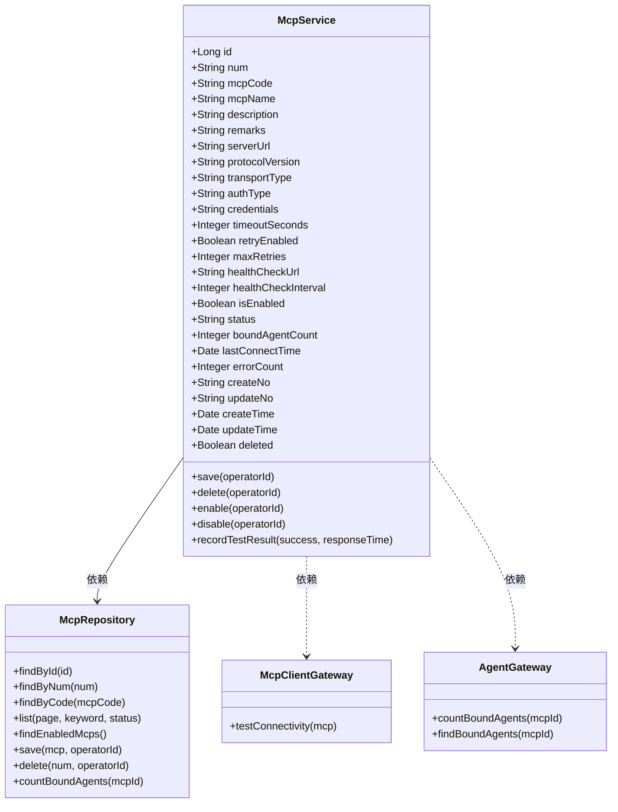

| 对象 | 类型 | 属性 | 与其它对象关系 |
|------|------|------|--------------|
| McpService | 聚合根 | id、num、mcpCode、mcpName、description、remarks、serverUrl、protocolVersion、transportType、authType、credentials（加密 JSON）、timeoutSeconds、retryEnabled、maxRetries、healthCheckUrl、healthCheckInterval、isEnabled、status、boundAgentCount、lastConnectTime、errorCount、createNo、updateNo、createTime、updateTime、deleted | 聚合根，通过 AgentGateway 查询关联 Agent |
| McpRepository | 仓储接口 | findById、findByNum、findByCode、list、findEnabledMcps、save、delete、countBoundAgents | 操作 McpService 聚合 |
| McpClientGateway | 领域网关 | testConnectivity | 跨域：调用外部 MCP 服务进行连通性测试 |
| AgentGateway | 领域网关 | countBoundAgents、findBoundAgents | 跨域：查询 Agent 域的绑定关系 |

#### 3.2.2 领域规则

| 聚合/对象 | 规则类型 | 规则描述 | 违反时表达 |
|-----------|---------|---------|-----------|
| McpService | 不变性 | mcpCode 全局唯一 | 抛出 MCP_CODE_ALREADY_EXISTS |
| McpService | 业务规则 | transportType 枚举值限定：sse / http | 创建时校验 |
| McpService | 业务规则 | authType 枚举值限定：无认证 / API Key / Bearer Token / OAuth2.0 / Basic Auth | 创建时校验 |
| McpService | 业务规则 | serverUrl 必须为合法 URL 格式 | 创建/编辑时校验 |
| McpService | 业务规则 | credentials 必须根据 authType 填写对应子字段 | 创建/编辑时校验 |
| McpService | 业务规则 | credentials 必须 AES 加密后存储 | 写入时强制加密 |
| McpService | 业务规则 | remarks 最大 500 字符 | 超长时截断或报错 |
| McpService | 业务规则 | timeoutSeconds 取值范围：1-300 秒 | 参数校验 |
| McpService | 业务规则 | 有 Agent 绑定时不可删除 | 抛出 MCP_HAS_BINDINGS |

#### 3.2.3 领域动作

| 聚合/实体 | 领域动作 | 职责 | 前置条件 | 后置条件/规则 | 领域事件 |
|-----------|---------|------|---------|--------------|---------|
| McpService | save(operatorId) | 新建或更新 MCP 服务 | mcpCode 不重复、serverUrl 合法、credentials 与 authType 匹配 | 新建时 isEnabled=true, status=UNCONNECTED | McpCreatedEvent / McpUpdatedEvent |
| McpService | delete(operatorId) | 逻辑删除 MCP | 无 Agent 绑定 | 标记 deleted=true | McpDeletedEvent |
| McpService | enable(operatorId) | 启用 MCP | mcpCode 存在 | isEnabled=true | McpStatusChangedEvent |
| McpService | disable(operatorId) | 禁用 MCP | mcpCode 存在 | isEnabled=false | McpStatusChangedEvent |
| McpService | recordTestResult(success, responseTime) | 记录连通性测试结果 | 无 | 更新 status、lastConnectTime、errorCount | McpTestedEvent |

**save 时序图**：

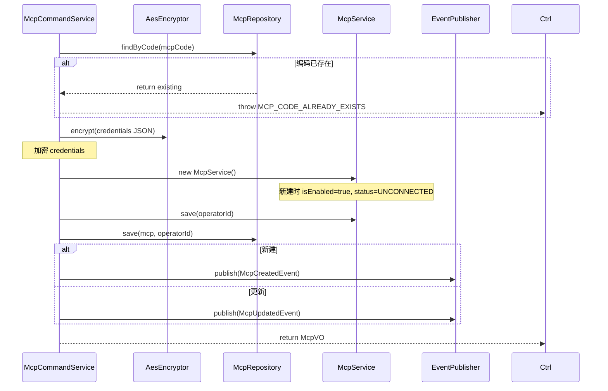

**delete 时序图**：

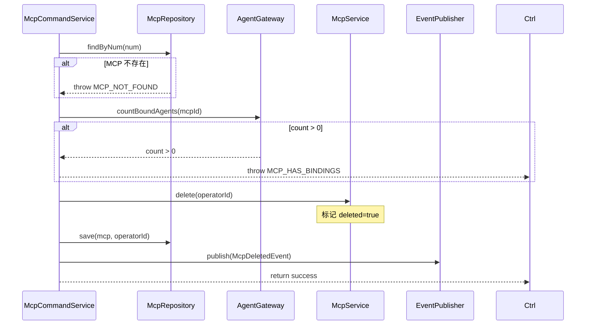

**enable 时序图**：


**disable 时序图**：

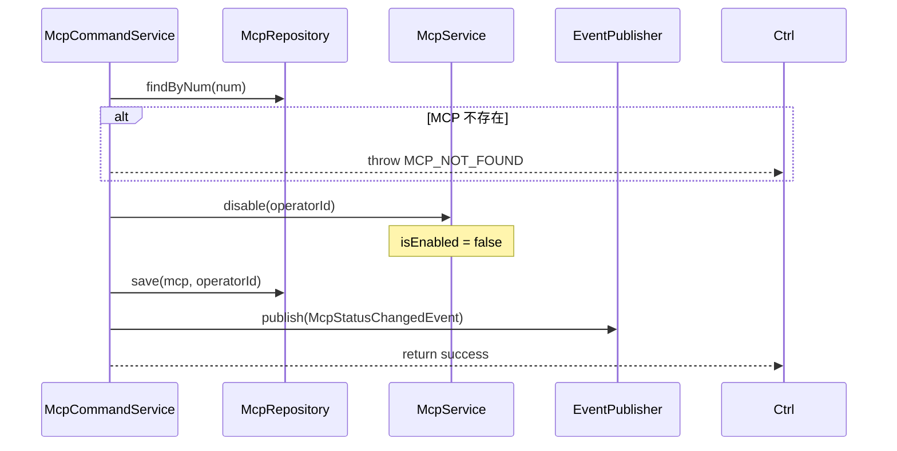

**recordTestResult 时序图**：

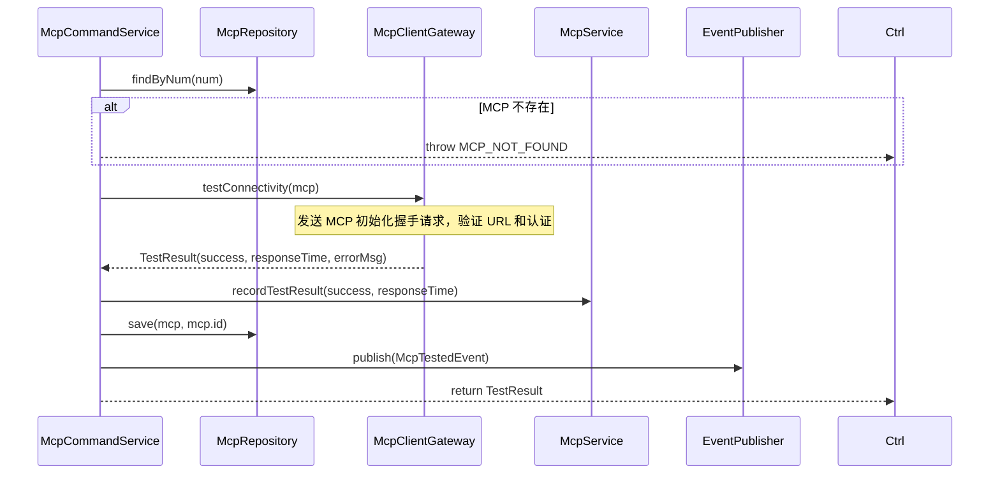

#### 3.2.4 领域事件

| 事件名 | 触发时机 | 载荷要点 | 可订阅方/用途 |
|--------|---------|---------|-------------|
| McpCreatedEvent | 新建 MCP 后 | mcpNum、mcpName、serverUrl、operatorId、eventTime | 审计日志 |
| McpUpdatedEvent | 更新 MCP 后 | mcpNum、mcpName、operatorId、eventTime | 审计日志 |
| McpDeletedEvent | 删除 MCP 后 | mcpNum、mcpName、operatorId、eventTime | 审计日志 |
| McpStatusChangedEvent | 启用/禁用 MCP 后 | mcpNum、mcpName、isEnabled、operatorId、eventTime | 审计日志 |
| McpTestedEvent | 连通性测试完成后 | mcpNum、success、status、eventTime | 审计日志、告警 |

---

## 4. 应用层设计

### 4.1 业务模块划分

| 应用模块 | 对应领域 | 包含 Service |
|---------|---------|-------------|
| mcp | mcp | McpCommandService（写操作）、McpQueryService（读操作） |

### 4.2 MCP（mcp）

#### 4.2.1 Service 方法清单

| Service | 方法签名 | 职责 | 入参 | 出参 |
|---------|---------|------|------|------|
| McpCommandService | `createMcp(param: CreateMcpParam, operatorId: Long): McpVO` | 创建 MCP（加密 credentials） | param | McpVO |
| McpCommandService | `updateMcp(param: UpdateMcpParam, operatorId: Long): Void` | 更新 MCP（credentials 留空则不修改） | param | - |
| McpCommandService | `deleteMcp(num: String, operatorId: Long): Void` | 逻辑删除（校验 Agent 绑定） | num | - |
| McpCommandService | `enableMcp(num: String, operatorId: Long): Void` | 启用 MCP | num | - |
| McpCommandService | `disableMcp(num: String, operatorId: Long): Void` | 禁用 MCP | num | - |
| McpCommandService | `testMcp(num: String): TestResult` | 连通性测试 | num | TestResult |
| McpQueryService | `getMcpByNum(num: String): McpVO` | 按编号查询 MCP 详情 | num | McpVO（credentials 脱敏） |
| McpQueryService | `listMcps(pageParam: PageParam, keyword, status): IPage~McpVO~` | 分页查询 MCP 列表 | pageParam, keyword, status | IPage~McpVO~ |

#### 4.2.2 方法时序逻辑

**createMcp 时序图**：

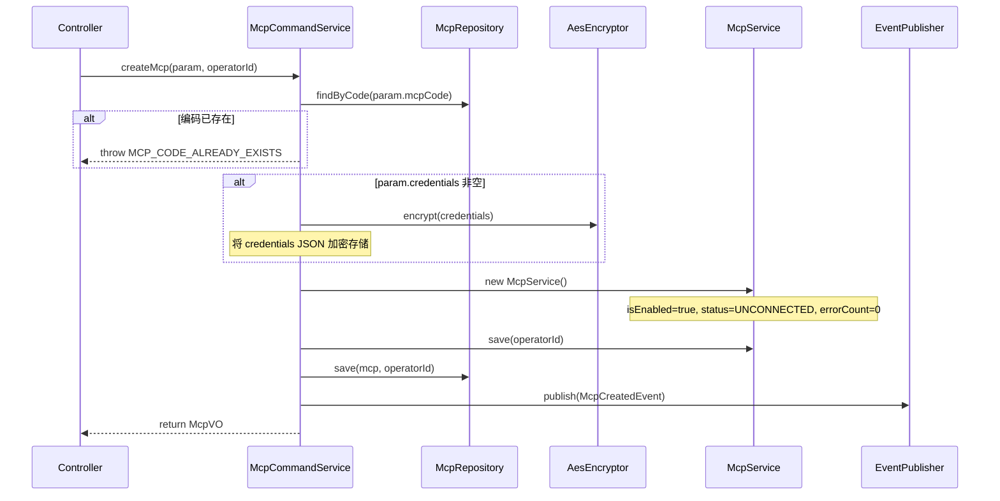

**updateMcp 时序图**：

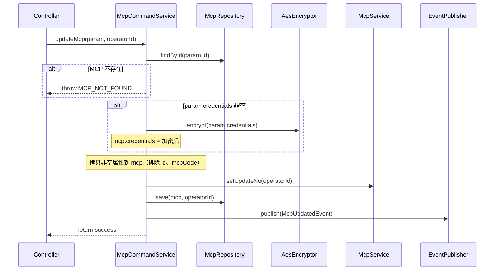

**deleteMcp 时序图**：

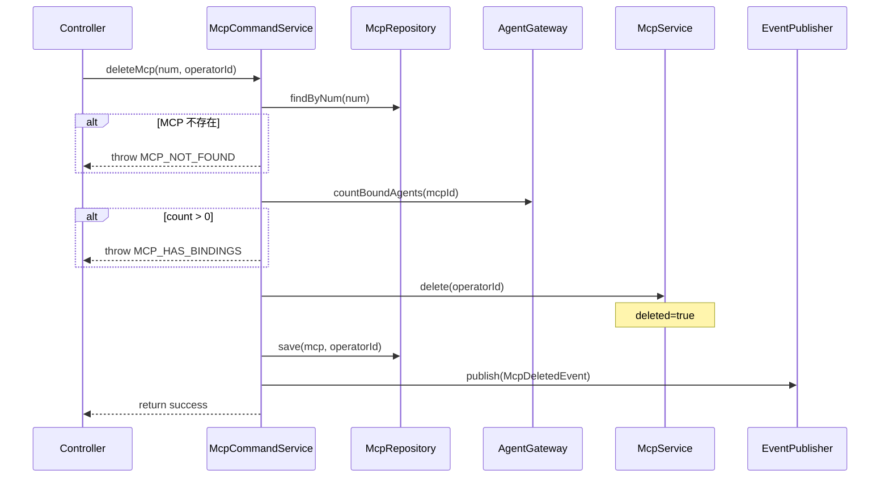

**enableMcp 时序图**：

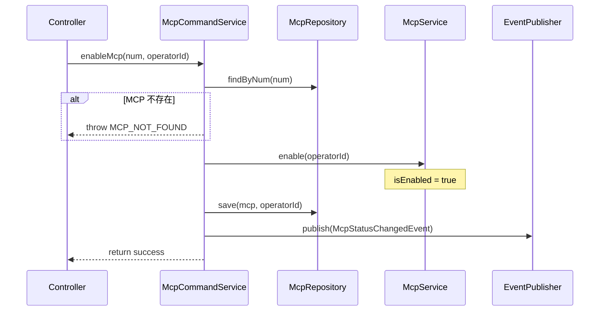

**disableMcp 时序图**：

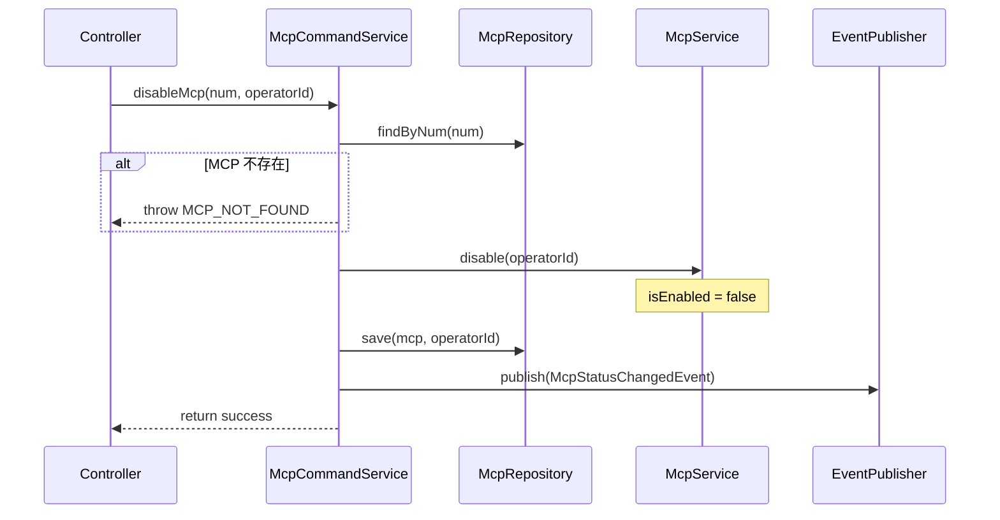

**testMcp 时序图**：

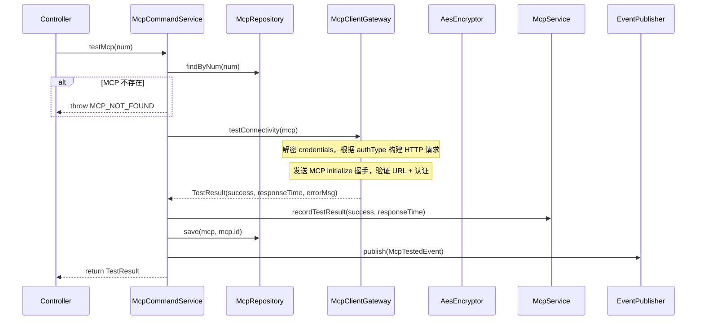

**getMcpByNum 时序图**：

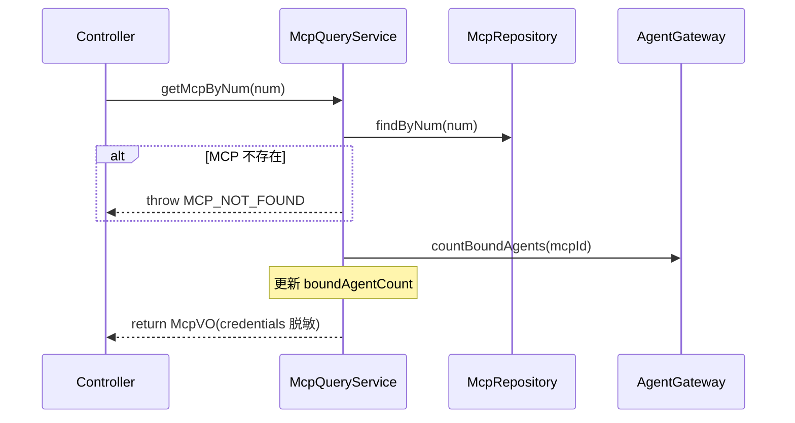

**listMcps 时序图**：

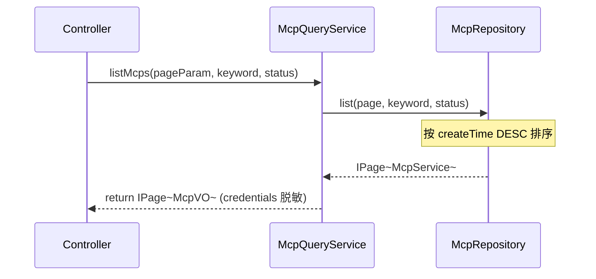

---

## 5. 控制器/Adapter 层设计

### 5.1 业务模块划分

| Controller | 对应应用模块 | URL 前缀 |
|-----------|-------------|---------|
| McpCommandController | mcp / McpCommandService | `/api/mcp/command` |
| McpQueryController | mcp / McpQueryService | `/api/mcp/query` |

### 5.2 MCP 命令（mcp）

#### 5.2.1 Controller 接口清单

| 接口 | 方法 | 路径 | 入参 | 返回值 JSON | 职责 |
|-----|------|------|------|-----------|------|
| 创建 MCP | POST | `/api/mcp/command/create` | `{"mcpCode": "remote-db", "mcpName": "远程数据库", "description": "...", "serverUrl": "https://mcp.example.com/sse", "protocolVersion": "v1.0", "transportType": "sse", "authType": "API Key", "credentials": "{\"apiKey\":\"sk-xxx\",\"headerName\":\"X-API-Key\"}", "timeoutSeconds": 30, "remarks": "张三维护"}` | `{"code": 200, "data": {"num": "MCP-001", "mcpCode": "remote-db", ...}}` | 新建远程 MCP |
| 更新 MCP | POST | `/api/mcp/command/update` | `{"id": 1, "mcpName": "...", "serverUrl": "...", "authType": "...", "credentials": "{\"apiKey\":\"sk-new\"}", "remarks": "..."}` | `{"code": 200, "data": null}` | 更新 MCP（credentials 留空则不修改） |
| 删除 MCP | POST | `/api/mcp/command/delete` | `{"num": "MCP-001"}` | `{"code": 200, "data": null}` | 逻辑删除（校验 Agent 绑定） |
| 启用 MCP | POST | `/api/mcp/command/enable` | `{"num": "MCP-001"}` | `{"code": 200, "data": null}` | 启用 MCP |
| 禁用 MCP | POST | `/api/mcp/command/disable` | `{"num": "MCP-001"}` | `{"code": 200, "data": null}` | 禁用 MCP |
| 连通性测试 | POST | `/api/mcp/command/test` | `{"num": "MCP-001"}` | `{"code": 200, "data": {"success": true, "responseTime": 520, "errorMessage": null}}` | 测试 MCP 连通性 |

#### 5.2.2 接口时序逻辑

**创建 MCP 时序图**：

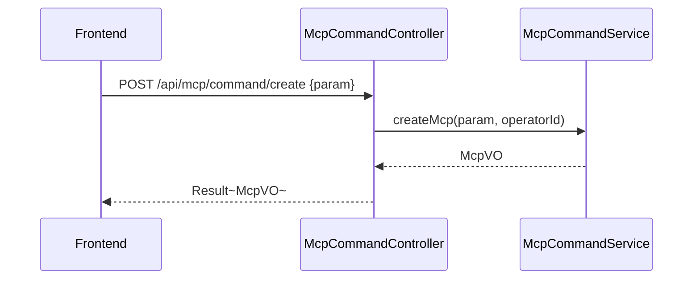

**更新 MCP 时序图**：

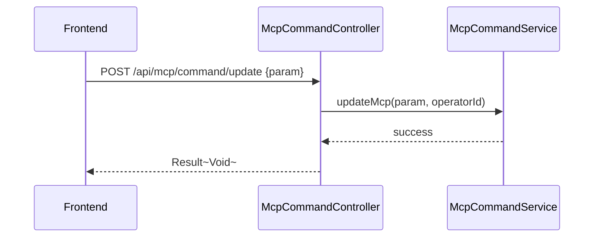

**删除 MCP 时序图**：


**启用 MCP 时序图**：

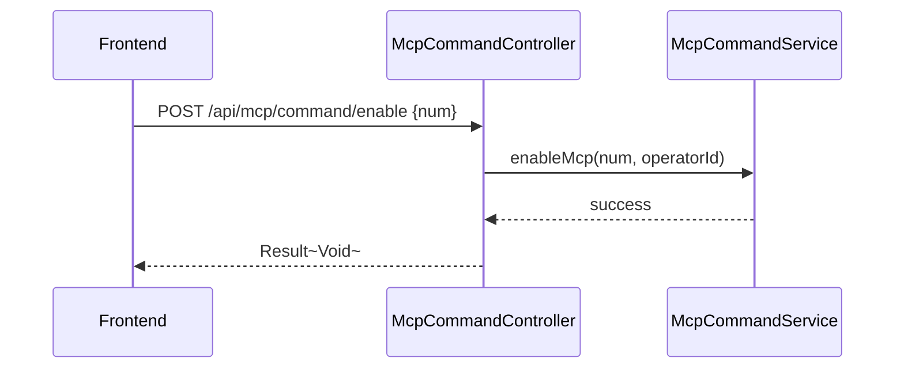

**禁用 MCP 时序图**：

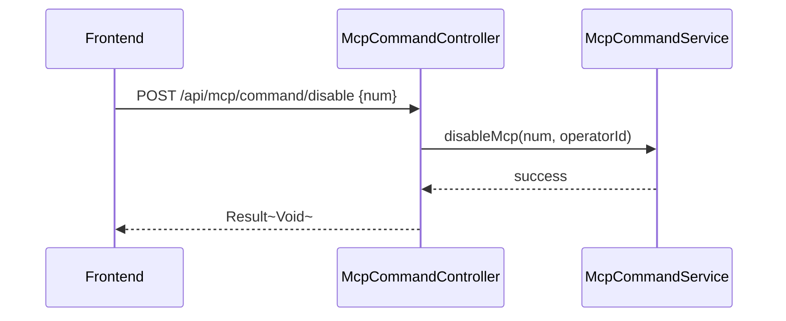

**连通性测试时序图**：

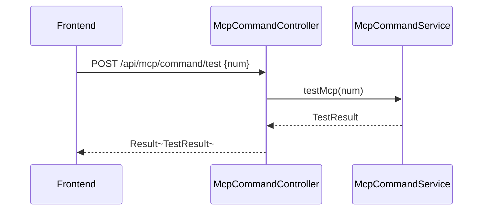

### 5.3 MCP 查询（mcp）

#### 5.3.1 Controller 接口清单

| 接口 | 方法 | 路径 | 入参 | 返回值 JSON | 职责 |
|-----|------|------|------|-----------|------|
| MCP 详情 | GET | `/api/mcp/query/detail` | num | `{"code": 200, "data": {"num": "MCP-001", "mcpCode": "remote-db", "mcpName": "远程数据库", "description": "...", "remarks": "张三维护", "serverUrl": "https://mcp.example.com/sse", "protocolVersion": "v1.0", "transportType": "sse", "authType": "API Key", "timeoutSeconds": 30, "isEnabled": true, "status": "CONNECTED", "boundAgentCount": 2, ...}}` | 详情（credentials 脱敏 + 备注 + 绑定 Agent 数） |
| MCP 列表 | GET | `/api/mcp/query/list` | pageNo, pageSize, keyword, status | `{"code": 200, "data": {"total": 5, "records": [{"num": "MCP-001", "mcpName": "远程数据库", "description": "...", "remarks": "张三维护", "isEnabled": true, "status": "CONNECTED", "boundAgentCount": 2, "createTime": "2026-05-01"}]}}` | 分页查询 |

#### 5.3.2 接口时序逻辑

**MCP 详情时序图**：

```mermaid
sequenceDiagram
    participant FE as Frontend
    participant Ctrl as McpQueryController
    participant Svc as McpQueryService
    participant AG as AgentGateway

    FE->>Ctrl: GET /api/mcp/query/detail?num=MCP-001
    Ctrl->>Svc: getMcpByNum(num)
    Svc->>AG: countBoundAgents(mcpId)
    Svc-->>Ctrl: McpVO
    Ctrl-->>FE: Result~McpVO~
```

**MCP 列表时序图**：

```mermaid
sequenceDiagram
    participant FE as Frontend
    participant Ctrl as McpQueryController
    participant Svc as McpQueryService

    FE->>Ctrl: GET /api/mcp/query/list?keyword=数据库&status=CONNECTED
    Ctrl->>Svc: listMcps(pageParam, keyword, status)
    Svc-->>Ctrl: PageResult~McpVO~
    Ctrl-->>FE: Result~PageResult~
```

---

## 6. 数据库设计

### 6.1 表结构

| 表 | 对应领域 | 说明 |
|---|---------|------|
| `mcp_service` | mcp / McpService | MCP 服务元数据（需新增 remarks 字段） |

### 6.2 DDL 语句

```sql
-- MCP 服务表（已存在，init.sql 第 375 行），需新增 remarks 字段
ALTER TABLE `mcp_service` ADD COLUMN `remarks` VARCHAR(500) DEFAULT NULL COMMENT '内部备注，仅管理端可见' AFTER `description`;
```

**现有表结构（保留不动）**：

```sql
-- MCP 服务表（已存在）
CREATE TABLE `mcp_service` (
    `id`                    BIGINT       NOT NULL AUTO_INCREMENT COMMENT '主键ID',
    `mcp_code`              VARCHAR(64)  NOT NULL                COMMENT 'MCP编码',
    `mcp_name`              VARCHAR(128) NOT NULL                COMMENT 'MCP名称',
    `description`           VARCHAR(1000) DEFAULT NULL           COMMENT '描述',
    `remarks`               VARCHAR(500)  DEFAULT NULL           COMMENT '内部备注，仅管理端可见',
    `latest_version`        VARCHAR(32)  DEFAULT NULL            COMMENT '最新版本',
    `current_version`       VARCHAR(32)  DEFAULT NULL            COMMENT '当前版本',
    `is_enabled`            TINYINT(1)   DEFAULT 1               COMMENT '是否启用',
    `status`                VARCHAR(20)  DEFAULT 'UNCONNECTED'   COMMENT '状态: UNCONNECTED/CONNECTING/CONNECTED/ERROR',
    `bound_agent_count`     INT          DEFAULT 0               COMMENT '绑定Agent数量',
    `server_url`            VARCHAR(512) DEFAULT NULL            COMMENT '服务器地址',
    `protocol_version`      VARCHAR(16)  DEFAULT 'v1.0'          COMMENT '协议版本',
    `transport_type`        VARCHAR(16)  DEFAULT 'sse'           COMMENT '传输类型: stdio/sse/http',
    `auth_type`             VARCHAR(32)  DEFAULT '无认证'        COMMENT '认证方式',
    `credentials`           TEXT         DEFAULT NULL            COMMENT '认证凭据JSON(加密)',
    `timeout_seconds`       INT          DEFAULT 30              COMMENT '超时时间(秒)',
    `retry_enabled`         TINYINT(1)   DEFAULT 1               COMMENT '是否启用重试',
    `max_retries`           INT          DEFAULT 3               COMMENT '最大重试次数',
    `health_check_url`      VARCHAR(512) DEFAULT NULL            COMMENT '健康检查URL',
    `health_check_interval` INT          DEFAULT 60              COMMENT '健康检查间隔(秒)',
    `env_variables`         JSON         DEFAULT NULL            COMMENT '环境变量JSON',
    `command`               VARCHAR(512) DEFAULT NULL            COMMENT '启动命令',
    `args`                  TEXT         DEFAULT NULL            COMMENT '启动参数',
    `last_connect_time`     DATETIME     DEFAULT NULL            COMMENT '最后连接时间',
    `error_count`           INT          DEFAULT 0               COMMENT '错误次数',
    `num`                   VARCHAR(64)  DEFAULT NULL            COMMENT '编号',
    `create_no`             VARCHAR(64)  DEFAULT NULL            COMMENT '创建人编号',
    `update_no`             VARCHAR(64)  DEFAULT NULL            COMMENT '更新人编号',
    `create_time`           DATETIME     DEFAULT CURRENT_TIMESTAMP COMMENT '创建时间',
    `update_time`           DATETIME     DEFAULT CURRENT_TIMESTAMP ON UPDATE CURRENT_TIMESTAMP COMMENT '更新时间',
    `deleted`               TINYINT(1)   DEFAULT 0               COMMENT '逻辑删除',
    PRIMARY KEY (`id`),
    UNIQUE KEY `uk_mcp_code` (`mcp_code`),
    KEY `idx_is_enabled` (`is_enabled`),
    KEY `idx_status` (`status`)
) ENGINE=InnoDB DEFAULT CHARSET=utf8mb4 COLLATE=utf8mb4_unicode_ci COMMENT='MCP服务表';
```

### 6.3 关联表

```sql
-- Agent 资源绑定表（已存在，用于查询 Agent-MCP 绑定关系）
-- resource_type = 'MCP', resource_id = mcp_service.id
```

MCP 删除时通过 `agent_resource_binding` 表查询：
```sql
SELECT COUNT(*) FROM agent_resource_binding
WHERE resource_type = 'MCP' AND resource_id = ?;
```

---

## 7. 模块变更清单

| 层级 | 变更项 | 对应 Skill |
|------|--------|------------|
| facade | McpEventConstants（已有）、McpCreatedEvent（已有）、McpStatusChangedEvent（已有） | impl-facade-module |
| client | McpVO（新增 remarks 字段 + credentials 脱敏逻辑）、CreateMcpParam（新增 remarks，credentials 支持动态认证子字段）、UpdateMcpParam（新增 remarks，credentials 可选更新）、TestResult（已有） | impl-client-module |
| domain | McpService（新增 remarks 属性）、McpRepository（新增 countBoundAgents 方法）、McpClientGateway（已有，待完善连通性测试实现）、AgentGateway（新增：countBoundAgents、findBoundAgents） | impl-domain-module |
| infra | McpServiceEntity（新增 remarks 字段映射）、McpRepositoryImpl（实现 countBoundAgents）、McpClientGatewayImpl（完善连通性测试：解密 credentials + 根据 authType 构建 HTTP 请求） | impl-infra-module |
| application | McpCommandService（credentials 加密处理、Agent 绑定校验）、McpQueryService（新增 boundAgentCount 查询） | impl-application-module |
| adapter | McpCommandController（已有）、McpQueryController（已有） | impl-adapter-module |

---

## 8. 代码分支命名

**分支名**：`feature-20260515-mcp-management`

---

## 9. 实现顺序

```
domain（McpService 新增 remarks、Repository/Gateway 接口新增 countBoundAgents）
  → client（VO、Param 新增 remarks 字段，credentials 动态认证子字段）
  → infra（Entity 新增 remarks 映射、RepositoryImpl 实现 countBoundAgents、GatewayImpl 完善连通性测试）
  → application（CommandService 加密 credentials + Agent 绑定校验、QueryService 补充 boundAgentCount）
  → adapter（Controller 已有，无需变更）
  → SQL（ALTER TABLE 添加 remarks 字段）
```

**分阶段实现**：

| 阶段 | 内容 | 依赖 |
|------|------|------|
| Phase 1 | domain：McpService 新增 remarks、McpRepository 新增 countBoundAgents、新增 AgentGateway 接口 | 无 |
| Phase 2 | client：VO/Param 新增 remarks、credentials 结构扩展 | Phase 1 |
| Phase 3 | infra：Entity 新增 remarks、RepositoryImpl 实现 countBoundAgents、McpClientGatewayImpl 连通性测试实现 | Phase 1 + Phase 2 |
| Phase 4 | application：CommandService credentials 加密 + Agent 绑定校验、QueryService boundAgentCount | Phase 3 |
| Phase 5 | adapter + SQL：Controller（已有）、ALTER TABLE 添加 remarks | Phase 4 |

---

## 10. 接口与数据契约

### 10.1 前端 API 适配

现有前端 API（`frontend/admin/src/api/mcp.ts`）需适配以下路径和参数：

| 前端方法 | 后端路径 | 变更 |
|---------|---------|------|
| getMcps | `GET /api/mcp/query/list` | 路径变更 |
| getMcp | `GET /api/mcp/query/detail` | 路径变更 |
| createMcp | `POST /api/mcp/command/create` | 路径变更，新增 remarks 字段 |
| updateMcp | `POST /api/mcp/command/update` | 路径变更，新增 remarks 字段 |
| deleteMcp | `POST /api/mcp/command/delete` | 路径变更 |
| enableMcp | `POST /api/mcp/command/enable` | 路径变更 |
| disableMcp | `POST /api/mcp/command/disable` | 路径变更 |
| testMcp | `POST /api/mcp/command/test` | 路径变更 |

### 10.2 错误码

| 错误码 | 说明 | 对应前端提示 |
|--------|------|------------|
| 1401 | MCP 编码已存在 | 「MCP 编码已存在，请更换编码」 |
| 1404 | 有 Agent 绑定 | 「该 MCP 已被 X 个 Agent 绑定，请先解除绑定后再删除」 |
| 1405 | 连通性测试失败 | 「连通性测试失败：{具体原因}」 |
| 1407 | MCP 不存在 | 「MCP 不存在」 |

### 10.3 前端类型定义

```typescript
interface McpItem {
  id: number
  num: string
  mcpCode: string
  mcpName: string
  description?: string
  remarks?: string
  serverUrl: string
  protocolVersion: string
  transportType: 'sse' | 'http'
  authType: '无认证' | 'API Key' | 'Bearer Token' | 'OAuth2.0' | 'Basic Auth'
  timeoutSeconds: number
  isEnabled: boolean
  status: 'UNCONNECTED' | 'CONNECTED' | 'ERROR'
  boundAgentCount: number
  createTime: string
}

// 认证凭据动态表单，根据 authType 渲染不同子字段
interface McpCredentials {
  // API Key
  apiKey?: string
  headerName?: string
  headerPrefix?: string
  // Bearer Token
  token?: string
  // OAuth2.0
  clientId?: string
  clientSecret?: string
  tokenUrl?: string
  scope?: string
  grantType?: string
  // Basic Auth
  username?: string
  password?: string
}
```

---

## 11. 其他

### 11.1 credentials 加密与脱敏

复用现有 `infra/common/AesEncryptor`。

- **创建/更新时**：前端传入 credentials JSON 字符串 → `AesEncryptor.encrypt()` → 存入 DB
- **查询时**：不返回 credentials 字段（或返回 `null`），仅返回 authType
- **测试连通性时**：`McpClientGatewayImpl` 读取加密 credentials → `AesEncryptor.decrypt()` → 构建 HTTP 请求
- **编辑模式**：credentials 字段留空表示不修改

### 11.2 McpClientGateway 连通性测试实现

根据 authType 和 credentials 构建 MCP initialize 握手请求：

```java
// 伪代码
public TestResult testConnectivity(McpService mcp) {
    try {
        long start = System.currentTimeMillis();
        String url = mcp.getServerUrl();
        String authType = mcp.getAuthType();
        String credentialsJson = AesEncryptor.decrypt(mcp.getCredentials());

        // 根据 transportType 选择测试方式
        if ("sse".equals(mcp.getTransportType())) {
            // SSE: 发送 HTTP GET 到 serverUrl，验证 SSE 连接
            httpClient.get(url, buildHeaders(authType, credentialsJson));
        } else if ("http".equals(mcp.getTransportType())) {
            // HTTP: 发送 MCP initialize JSON-RPC 请求
            String initPayload = "{\"jsonrpc\":\"2.0\",\"id\":1,\"method\":\"initialize\",\"params\":{...}}";
            httpClient.post(url, initPayload, buildHeaders(authType, credentialsJson));
        }

        long responseTime = System.currentTimeMillis() - start;
        return TestResult.success(responseTime);
    } catch (Exception e) {
        return TestResult.failure(e.getMessage());
    }
}
```

### 11.3 AgentGateway Agent 绑定查询

MCP 域定义的 Gateway 接口，由 Agent 域实现：

```java
public interface AgentGateway {
    /** 查询绑定指定 MCP 的 Agent 数量 */
    long countBoundAgents(Long mcpId);
    /** 查询绑定指定 MCP 的 Agent 列表 */
    List<AgentInfoVO> findBoundAgents(Long mcpId);
}
```

实现时通过 `agent_resource_binding` 表查询 `resourceType = 'MCP' AND resourceId = mcpId`。

### 11.4 credentials JSON 结构示例

不同 authType 对应的 credentials JSON 结构：

```json
// 无认证
{}

// API Key
{"apiKey": "sk-xxx", "headerName": "X-API-Key", "headerPrefix": ""}

// Bearer Token
{"token": "eyJhbG..."}

// OAuth2.0
{"clientId": "app-123", "clientSecret": "secret-456", "tokenUrl": "https://auth.example.com/oauth/token", "scope": "read write", "grantType": "client_credentials"}

// Basic Auth
{"username": "admin", "password": "password123"}
```

### 11.5 权限控制

- 所有 MCP 操作（创建/编辑/删除/启用/禁用/测试）仅限管理端（系统管理员/Agent 管理员/开发者）
- 通过现有 RBAC 权限系统控制
- 普通用户端不展示任何 MCP 管理功能和页面
- 备注字段仅管理端可见

### 11.6 与现有代码的兼容

- 现有 `mcp_service` 表已存在，本次仅需 `ALTER TABLE ADD COLUMN remarks`
- 现有 McpService 聚合根、Repository、Gateway 接口、Service、Controller 均已存在
- 现有 command/args/envVariables 等 stdio 字段保留在 DB 中但不参与 PRD 核心流程
- 现有错误码 1401-1407 已定义，本次复用
