# 模型管理 - 技术方案

> **文档版本**：V1.0
> **创建日期**：2026-05-15
> **关联 PRD**：`doc/产品方案/2026-05-15_模型管理-PRD.md`
> **对应分支**：`feature-20260515-model-management`

---

## 1. 目标与范围

### 1.1 目标

- 提供模型注册能力，支持主流 LLM 提供商和自部署模型
- 实现模型启用/停用控制，为 Agent 模型选择提供数据源
- 提供模型列表筛选能力（按提供商、状态、关键词搜索）
- 建立模型连接参数管理体系（API endpoint、API key、timeout 等）
- Agent 删除前校验模型绑定关系，Agent 创建/编辑时获取已启用模型列表

### 1.2 范围

| 范围内 | 范围外 |
|--------|--------|
| 模型注册（提供商、名称、连接参数） | 模型配额管理（TPM/RPM 限流） |
| 模型启用/停用 | 模型健康监控（调用统计、失败率） |
| 模型列表/详情/编辑 | 模型默认推理参数（temperature、max_tokens 等） |
| API Key 加密存储（AES） | 模型调用链路代理/网关 |
| 模型删除（需校验 Agent 绑定） | 普通用户端的模型管理功能 |
| Agent 创建/编辑时获取已启用模型列表 | |
| 可选：连通性测试 | |

### 1.3 关键技术决策

| 决策点 | 方案 |
|--------|------|
| 模型参数范围 | 精简为连接参数：provider、modelCode、modelName、baseUrl、apiKey、timeout、description |
| 唯一约束 | modelCode 全局唯一（数据库唯一索引），与现有代码一致 |
| API Key 存储 | AES 对称加密存储，使用现有 AesEncryptor |
| API Key 展示 | 详情页脱敏显示（sk-****abcd） |
| Agent 绑定检查 | 通过 agent_resource_binding 表（resourceType=MODEL）查询 |
| HTTP 方法 | 仅 GET（查询）和 POST（增删改） |
| 错误码前缀 | 1401 起（PRD 约定），但现有 12xx 段已使用，沿用现有 |
| 连通性测试 | 可选功能，通过 ModelGateway 发送轻量请求验证 |

---

## 2. 架构设计（代码结构）

| 层 | 领域 | 包 | 职责 |
|---|------|---|------|
| facade | model | `com.gagentmanager.facade.model` | Model 领域事件 DTO、事件常量 |
| client | model | `com.gagentmanager.client.model` | ModelVO、CreateModelParam、UpdateModelParam、TestResultVO、EnabledModelVO |
| client | common | `com.gagentmanager.client.common` | PageParam、PageResult |
| domain | model | `com.gagentmanager.domain.model` | Model 聚合根、ModelRepository 接口、ModelGateway（连通性测试）、AgentGateway（Agent 绑定查询） |
| infra | model | `com.gagentmanager.infra.model` | Model Entity、Mapper、ModelRepositoryImpl、ModelGatewayImpl |
| application | model | `com.gagentmanager.application.model` | ModelCommandService（写操作）、ModelQueryService（读操作） |
| adapter | model | `com.gagentmanager.adapter.model` | ModelCommandController、ModelQueryController |

---

## 3. 领域模型设计

### 3.1 业务层级划分

| 层级 | 业务领域 | 说明 |
|-----|---------|------|
| 核心域 | model | 模型管理（注册、启用/停用、编辑、删除、连通性测试） |
| 支撑域 | agent（跨域） | Agent-Model 绑定关系查询（通过 AgentGateway 调用 Agent 域） |

### 3.2 Model（model）

#### 3.2.1 领域模型

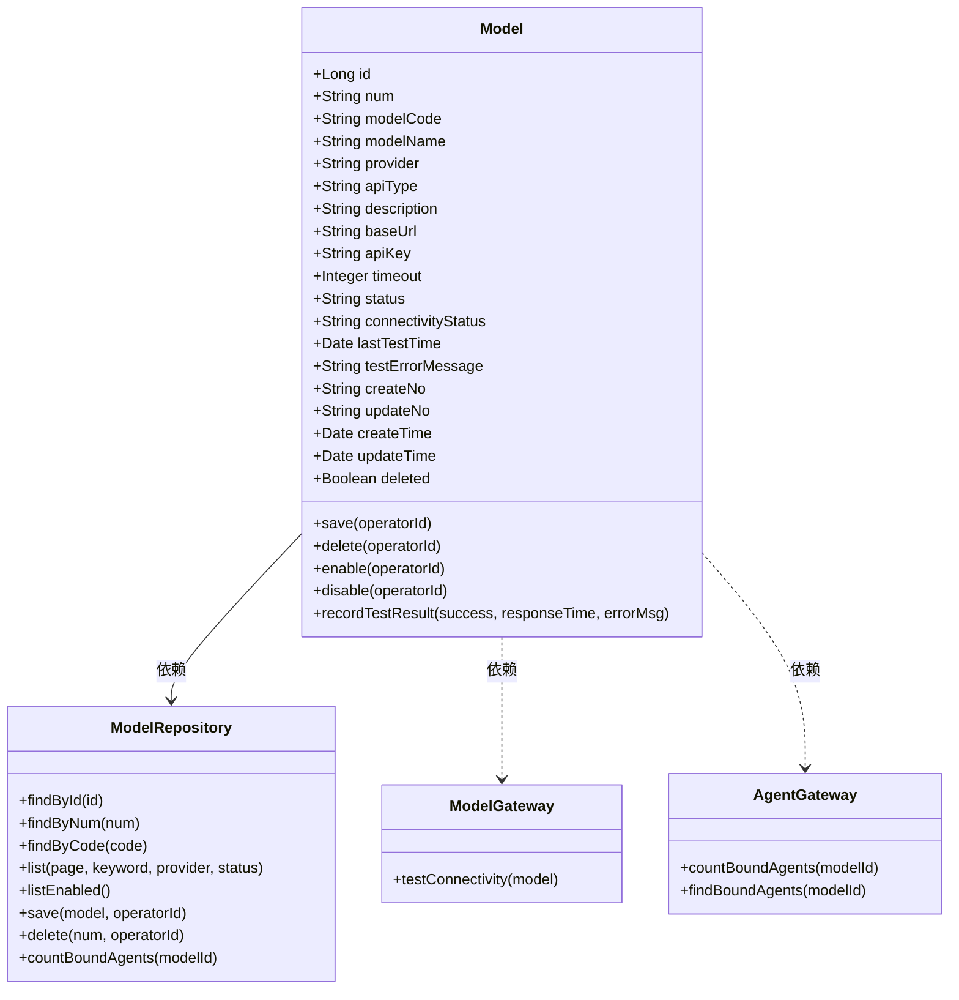

| 对象 | 类型 | 属性 | 与其它对象关系 |
|------|------|------|--------------|
| Model | 聚合根 | id、num、modelCode、modelName、provider、apiType、description、baseUrl、apiKey、timeout、status、connectivityStatus、lastTestTime、testErrorMessage、createNo、updateNo、createTime、updateTime、deleted | 聚合根，通过 AgentGateway 查询关联 Agent |
| ModelRepository | 仓储接口 | findById、findByNum、findByCode、list、listEnabled、save、delete、countBoundAgents | 操作 Model 聚合 |
| ModelGateway | 领域网关 | testConnectivity | 跨域：调用外部 LLM API 进行连通性测试 |
| AgentGateway | 领域网关 | countBoundAgents、findBoundAgents | 跨域：查询 Agent 域的绑定关系 |

#### 3.2.2 领域规则

| 聚合/对象 | 规则类型 | 规则描述 | 违反时表达 |
|-----------|---------|---------|-----------|
| Model | 不变性 | modelCode 全局唯一 | 抛出 MODEL_CODE_ALREADY_EXISTS |
| Model | 业务规则 | status 枚举值限定：ENABLED / DISABLED | 状态转换时校验 |
| Model | 业务规则 | connectivityStatus 枚举值限定：UNTESTED / CONNECTED / ERROR | 测试记录时校验 |
| Model | 业务规则 | timeout 取值范围：1-300 秒 | 抛出 MODEL_TIMEOUT_INVALID |
| Model | 业务规则 | baseUrl 必须为合法 URL 格式 | 抛出 MODEL_CONNECTIVITY_TEST_FAILED |
| Model | 业务规则 | 有 Agent 绑定时不可删除 | 抛出 MODEL_ALREADY_BOUND |

#### 3.2.3 领域动作

| 聚合/实体 | 领域动作 | 职责 | 前置条件 | 后置条件/规则 | 领域事件 |
|-----------|---------|------|---------|--------------|---------|
| Model | save(operatorId) | 新建或更新模型 | modelCode 不重复、baseUrl 合法 | 自动设置 status=ENABLED（新建时），更新 updateTime | ModelCreatedEvent / ModelUpdatedEvent |
| Model | delete(operatorId) | 逻辑删除模型 | 无 Agent 绑定 | 标记 deleted=true，更新 updateTime | ModelDeletedEvent |
| Model | enable(operatorId) | 启用模型 | status != ENABLED | status=ENABLED，更新 updateTime | ModelStatusChangedEvent |
| Model | disable(operatorId) | 禁用模型 | status != DISABLED | status=DISABLED，更新 updateTime | ModelStatusChangedEvent |
| Model | recordTestResult(success, responseTime, errorMsg) | 记录连通性测试结果 | 无 | 更新 connectivityStatus、lastTestTime | ModelTestedEvent |

**save 时序图**：

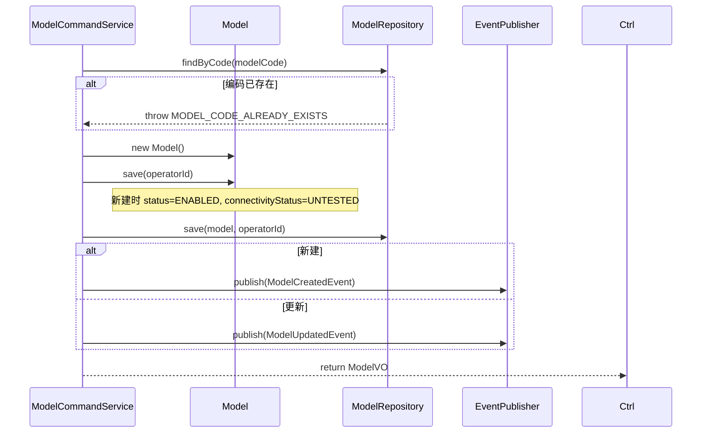

**delete 时序图**：

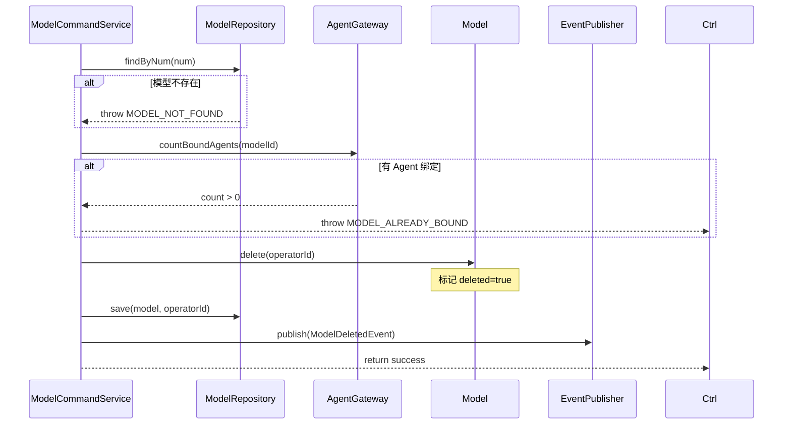

**enable 时序图**：


**disable 时序图**：

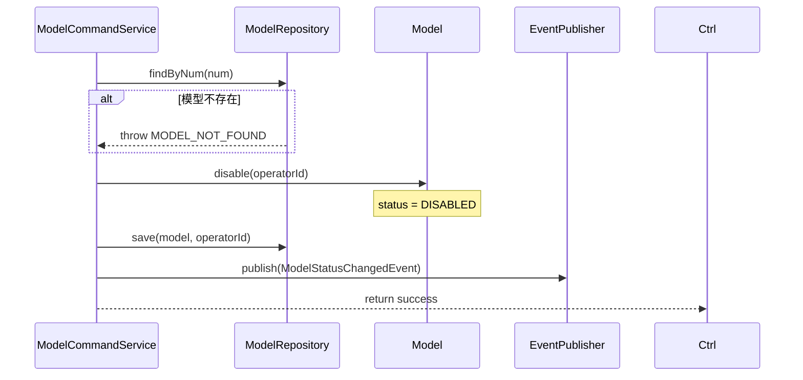

**recordTestResult 时序图**：

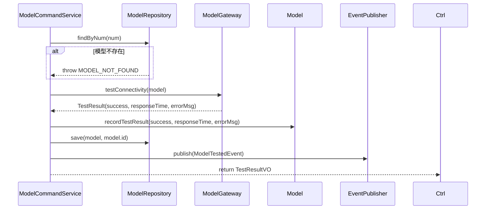

#### 3.2.4 领域事件

| 事件名 | 触发时机 | 载荷要点 | 可订阅方/用途 |
|--------|---------|---------|-------------|
| ModelCreatedEvent | 新建模型后 | modelNum, modelCode, modelName, provider, operatorId, eventTime | 审计日志 |
| ModelUpdatedEvent | 更新模型后 | modelNum, modelCode, operatorId, eventTime | 审计日志 |
| ModelDeletedEvent | 删除模型后 | modelNum, modelCode, operatorId, eventTime | 审计日志 |
| ModelStatusChangedEvent | 启用/禁用模型后 | modelNum, modelName, status, operatorId, eventTime | 审计日志 |
| ModelTestedEvent | 连通性测试完成后 | modelNum, success, connectivityStatus, eventTime | 审计日志、告警 |

---

## 4. 应用层设计

### 4.1 业务模块划分

| 应用模块 | 对应领域 | 包含 Service |
|---------|---------|-------------|
| model | model | ModelCommandService（写操作）、ModelQueryService（读操作） |

### 4.2 Model（model）

#### 4.2.1 Service 方法清单

| Service | 方法签名 | 职责 | 入参 | 出参 |
|---------|---------|------|------|------|
| ModelCommandService | `createModel(param: CreateModelParam, operatorId: Long): ModelVO` | 创建模型（加密 API Key） | param | ModelVO |
| ModelCommandService | `updateModel(param: UpdateModelParam, operatorId: Long): Void` | 更新模型（可选更新 API Key） | param | - |
| ModelCommandService | `deleteModel(num: String, operatorId: Long): Void` | 逻辑删除（校验 Agent 绑定） | num | - |
| ModelCommandService | `enableModel(num: String, operatorId: Long): Void` | 启用模型 | num | - |
| ModelCommandService | `disableModel(num: String, operatorId: Long): Void` | 禁用模型 | num | - |
| ModelCommandService | `testConnectivity(num: String): TestResultVO` | 连通性测试 | num | TestResultVO |
| ModelQueryService | `getModelByNum(num: String): ModelVO` | 按编号查询模型详情 | num | ModelVO |
| ModelQueryService | `listModels(pageParam: PageParam, keyword, provider, status): IPage~ModelVO~` | 分页查询模型列表 | pageParam, keyword, provider, status | IPage~ModelVO~ |
| ModelQueryService | `listEnabledModels(): List~EnabledModelVO~` | 查询已启用模型列表（供 Agent 域使用） | - | List~EnabledModelVO~ |

#### 4.2.2 方法时序逻辑

**createModel 时序图**：

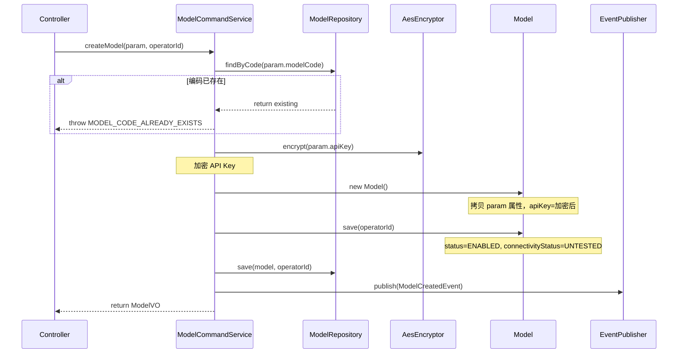

**updateModel 时序图**：

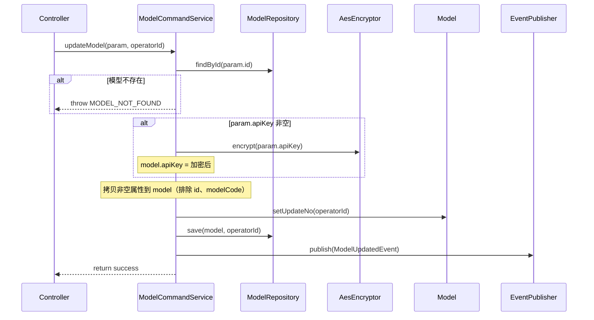

**deleteModel 时序图**：

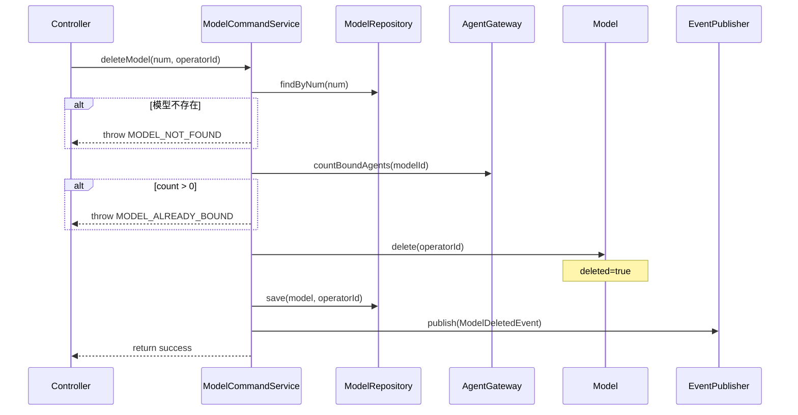

**enableModel 时序图**：

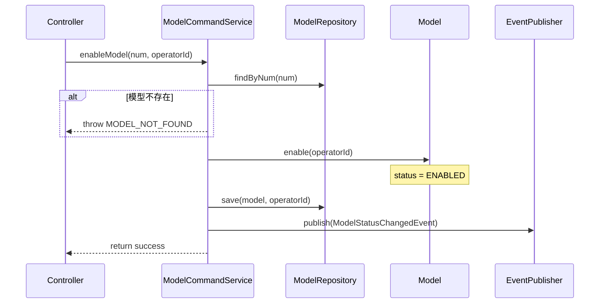

**disableModel 时序图**：

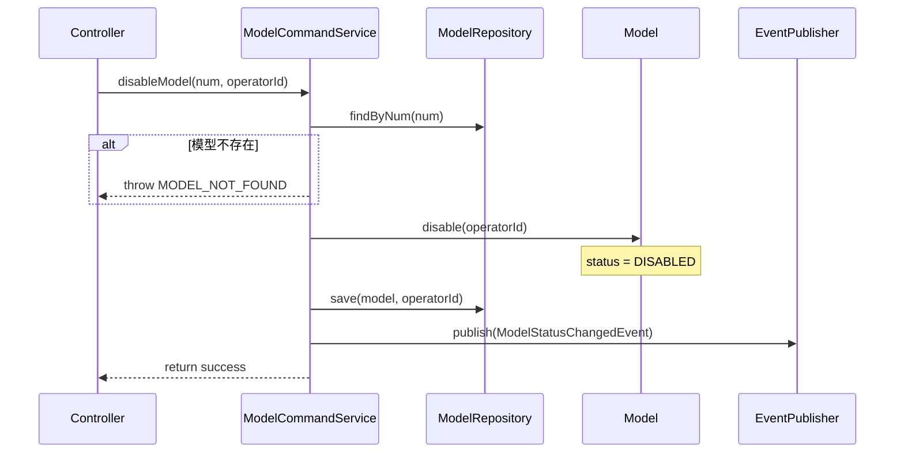

**testConnectivity 时序图**：

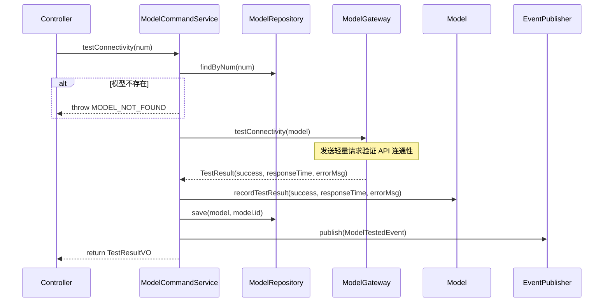

**getModelByNum 时序图**：

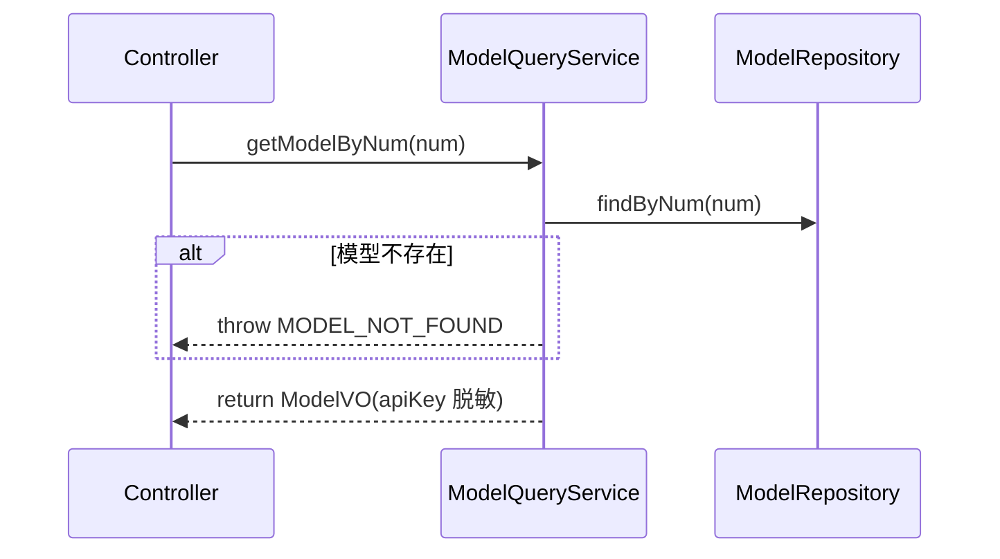

**listModels 时序图**：

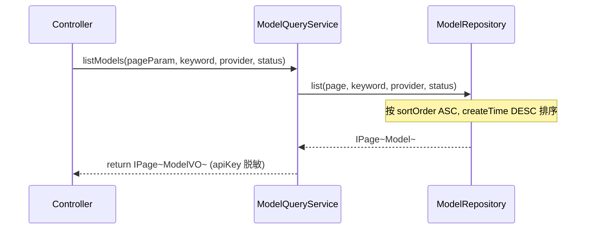

**listEnabledModels 时序图**：

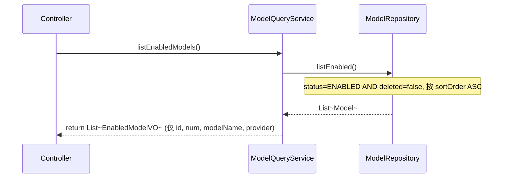

---

## 5. 控制器/Adapter 层设计

### 5.1 业务模块划分

| Controller | 对应应用模块 | URL 前缀 |
|-----------|-------------|---------|
| ModelCommandController | model / ModelCommandService | `/api/model/command` |
| ModelQueryController | model / ModelQueryService | `/api/model/query` |

### 5.2 Model 命令（model）

#### 5.2.1 Controller 接口清单

| 接口 | 方法 | 路径 | 入参 | 返回值 JSON | 职责 |
|-----|------|------|------|-----------|------|
| 创建模型 | POST | `/api/model/command/create` | `{"modelCode": "gpt-4o", "modelName": "GPT-4o", "provider": "OpenAI", "apiType": "OpenAI兼容", "baseUrl": "https://api.openai.com/v1", "apiKey": "sk-xxx", "timeout": 60, "description": "..."}` | `{"code": 200, "data": {"num": "MODEL-001", "modelCode": "gpt-4o", "modelName": "GPT-4o", ...}}` | 新建模型 |
| 更新模型 | POST | `/api/model/command/update` | `{"id": 1, "modelName": "GPT-4o Turbo", "baseUrl": "https://api.openai.com/v1", "apiKey": "sk-new", "timeout": 30, "description": "..."}` | `{"code": 200, "data": null}` | 更新模型（apiKey 留空则不修改） |
| 删除模型 | POST | `/api/model/command/delete` | `{"num": "MODEL-001"}` | `{"code": 200, "data": null}` | 逻辑删除（校验 Agent 绑定） |
| 启用模型 | POST | `/api/model/command/enable` | `{"num": "MODEL-001"}` | `{"code": 200, "data": null}` | 启用模型 |
| 禁用模型 | POST | `/api/model/command/disable` | `{"num": "MODEL-001"}` | `{"code": 200, "data": null}` | 禁用模型 |
| 连通性测试 | POST | `/api/model/command/test` | `{"num": "MODEL-001"}` | `{"code": 200, "data": {"success": true, "responseTime": 120, "errorMessage": null}}` | 测试模型连通性 |

#### 5.2.2 接口时序逻辑

**创建模型时序图**：

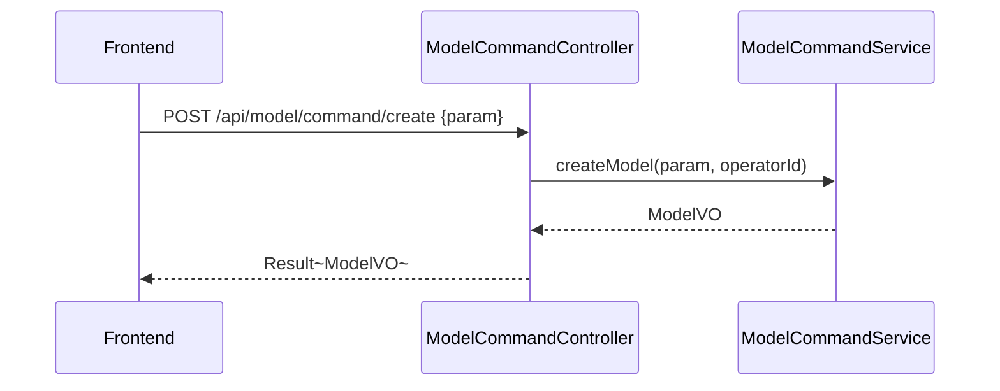

**更新模型时序图**：

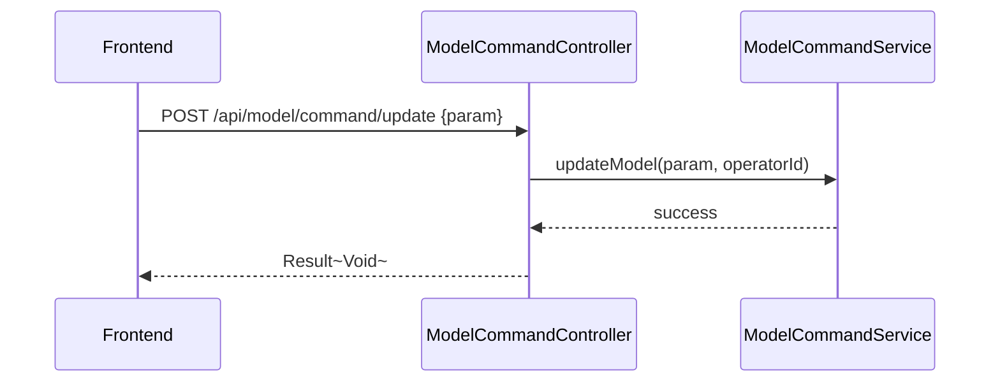

**删除模型时序图**：

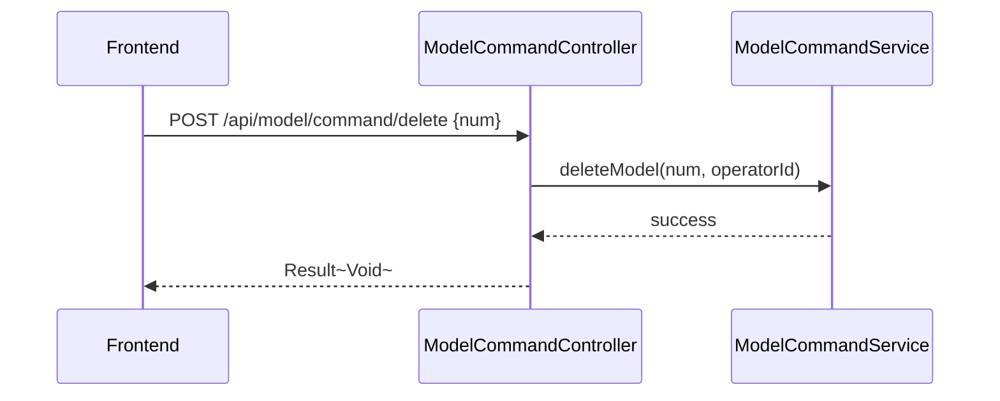

**启用模型时序图**：

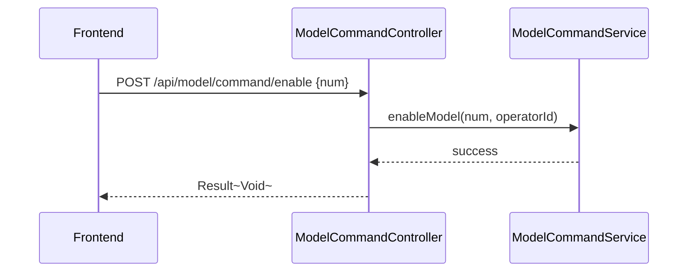

**禁用模型时序图**：

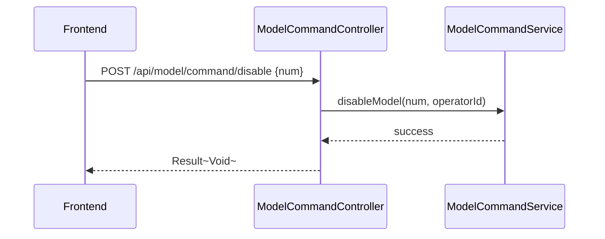

**连通性测试时序图**：

```mermaid
sequenceDiagram
    participant FE as Frontend
    participant Ctrl as ModelCommandController
    participant Svc as ModelCommandService

    FE->>Ctrl: POST /api/model/command/test {num}
    Ctrl->>Svc: testConnectivity(num)
    Svc-->>Ctrl: TestResultVO
    Ctrl-->>FE: Result~TestResultVO~
```

### 5.3 Model 查询（model）

#### 5.3.1 Controller 接口清单

| 接口 | 方法 | 路径 | 入参 | 返回值 JSON | 职责 |
|-----|------|------|------|-----------|------|
| 模型详情 | GET | `/api/model/query/detail` | num | `{"code": 200, "data": {"num": "MODEL-001", "modelCode": "gpt-4o", "modelName": "GPT-4o", "provider": "OpenAI", "baseUrl": "https://api.openai.com/v1", "apiKey": "sk-****abcd", "timeout": 60, "status": "ENABLED", "connectivityStatus": "UNTESTED", "boundAgents": [...]}}` | 详情（含 API Key 脱敏 + 绑定 Agent 列表） |
| 模型列表 | GET | `/api/model/query/list` | pageNo, pageSize, keyword, provider, status | `{"code": 200, "data": {"total": 10, "records": [{"num": "MODEL-001", "modelCode": "gpt-4o", "modelName": "GPT-4o", "provider": "OpenAI", "status": "ENABLED", "boundAgentCount": 5, "createTime": "2026-05-15"}]}}` | 分页查询 |
| 已启用模型 | GET | `/api/model/query/enabled` | - | `{"code": 200, "data": [{"id": 1, "num": "MODEL-001", "modelName": "GPT-4o", "provider": "OpenAI"}]}` | 查询已启用模型（供 Agent 域使用） |

#### 5.3.2 接口时序逻辑

**模型详情时序图**：

```mermaid
sequenceDiagram
    participant FE as Frontend
    participant Ctrl as ModelQueryController
    participant Svc as ModelQueryService
    participant AG as AgentGateway

    FE->>Ctrl: GET /api/model/query/detail?num=MODEL-001
    Ctrl->>Svc: getModelByNum(num)
    Svc-->>Ctrl: ModelVO + boundAgents
    Ctrl-->>FE: Result~ModelVO~
```

**模型列表时序图**：

```mermaid
sequenceDiagram
    participant FE as Frontend
    participant Ctrl as ModelQueryController
    participant Svc as ModelQueryService

    FE->>Ctrl: GET /api/model/query/list?keyword=gpt&status=ENABLED
    Ctrl->>Svc: listModels(pageParam, keyword, provider, status)
    Svc-->>Ctrl: PageResult~ModelVO~
    Ctrl-->>FE: Result~PageResult~
```

**已启用模型时序图**：

```mermaid
sequenceDiagram
    participant FE as Frontend
    participant Ctrl as ModelQueryController
    participant Svc as ModelQueryService

    FE->>Ctrl: GET /api/model/query/enabled
    Ctrl->>Svc: listEnabledModels()
    Svc-->>Ctrl: List~EnabledModelVO~
    Ctrl-->>FE: Result~List~
```

---

## 6. 数据库设计

### 6.1 表结构

| 表 | 对应领域 | 说明 |
|---|---------|------|
| `model` | model / Model | 模型元数据（精简版，仅连接参数） |

### 6.2 DDL 语句

> **说明**：现有 `model` 表包含大量扩展字段（temperature、top_p、maxTokens 等），按 PRD 精简后需执行 ALTER 移除冗余字段，或保留不动仅不使用。以下为当前表结构（已存在），新增字段无需额外 DDL。

```sql
-- Model 表（已存在，init.sql 第 244 行）
CREATE TABLE `model` (
    `id`                    BIGINT         NOT NULL AUTO_INCREMENT COMMENT '主键ID',
    `model_code`            VARCHAR(64)    NOT NULL                COMMENT '模型编码',
    `model_name`            VARCHAR(128)   NOT NULL                COMMENT '模型名称',
    `provider`              VARCHAR(64)    NOT NULL                COMMENT '提供商: OpenAI/Anthropic/DeepSeek等',
    `api_type`              VARCHAR(32)    DEFAULT 'openai'        COMMENT 'API类型',
    `description`           VARCHAR(1000)  DEFAULT NULL            COMMENT '描述',
    `category`              VARCHAR(64)    DEFAULT NULL            COMMENT '分类',
    `sort_order`            INT            DEFAULT 0               COMMENT '排序',
    `api_key`               VARCHAR(512)   DEFAULT NULL            COMMENT 'API密钥(加密存储)',
    `base_url`              VARCHAR(512)   DEFAULT NULL            COMMENT 'API地址',
    `timeout`               INT            DEFAULT 30              COMMENT '超时时间(秒)',
    `retry_count`           INT            DEFAULT 3               COMMENT '重试次数',
    `max_tokens`            INT            DEFAULT NULL            COMMENT '最大Token数',
    `min_temperature`       DECIMAL(5,2)   DEFAULT NULL            COMMENT '最低temperature',
    `max_temperature`       DECIMAL(5,2)   DEFAULT NULL            COMMENT '最高temperature',
    `default_temperature`   DECIMAL(5,2)   DEFAULT 1.00            COMMENT '默认temperature',
    `default_top_p`         DECIMAL(5,2)   DEFAULT 1.00            COMMENT '默认top_p',
    `default_top_k`         INT            DEFAULT NULL            COMMENT '默认top_k',
    `capabilities`          JSON           DEFAULT NULL            COMMENT '能力标签JSON',
    `input_types`           JSON           DEFAULT NULL            COMMENT '支持的输入类型JSON',
    `output_types`          JSON           DEFAULT NULL            COMMENT '支持的输出类型JSON',
    `status`                VARCHAR(20)    DEFAULT 'ENABLED'       COMMENT '状态: ENABLED/DISABLED/ERROR',
    `connectivity_status`   VARCHAR(20)    DEFAULT 'UNTESTED'      COMMENT '连通状态: UNTESTED/CONNECTED/ERROR',
    `last_test_time`        DATETIME       DEFAULT NULL            COMMENT '最后测试时间',
    `test_error_message`    VARCHAR(1000)  DEFAULT NULL            COMMENT '测试错误信息',
    `num`                   VARCHAR(64)    DEFAULT NULL            COMMENT '编号',
    `create_no`             VARCHAR(64)    DEFAULT NULL            COMMENT '创建人编号',
    `update_no`             VARCHAR(64)    DEFAULT NULL            COMMENT '更新人编号',
    `create_time`           DATETIME       DEFAULT CURRENT_TIMESTAMP COMMENT '创建时间',
    `update_time`           DATETIME       DEFAULT CURRENT_TIMESTAMP ON UPDATE CURRENT_TIMESTAMP COMMENT '更新时间',
    `deleted`               TINYINT(1)     DEFAULT 0               COMMENT '逻辑删除',
    PRIMARY KEY (`id`),
    UNIQUE KEY `uk_model_code` (`model_code`),
    KEY `idx_provider` (`provider`),
    KEY `idx_status` (`status`),
    KEY `idx_connectivity_status` (`connectivity_status`)
) ENGINE=InnoDB DEFAULT CHARSET=utf8mb4 COLLATE=utf8mb4_unicode_ci COMMENT='模型表';
```

**说明**：
- `retry_count`、`max_tokens`、`temperature`、`top_p`、`top_k`、`capabilities`、`input_types`、`output_types`、`category`、`sort_order` 字段保留在数据库中但不纳入 PRD 核心流程，前端表单为可选展示。
- `create_time` / `update_time` 当前为 `DATETIME` 而非 `DATETIME(3)`，与项目规范略有差异，本次不修改（属历史遗留）。

### 6.3 关联表

```sql
-- Agent 资源绑定表（已存在，用于查询 Agent-Model 绑定关系）
CREATE TABLE `agent_resource_binding` (
    `id`              BIGINT         NOT NULL AUTO_INCREMENT COMMENT '主键ID',
    `agent_id`        BIGINT         NOT NULL                COMMENT 'Agent ID',
    `resource_type`   VARCHAR(32)    NOT NULL                COMMENT '资源类型: MODEL/SKILL/MCP/WORKFLOW',
    `resource_id`     BIGINT         NOT NULL                COMMENT '资源ID（model.id）',
    `create_time`     DATETIME       DEFAULT CURRENT_TIMESTAMP COMMENT '创建时间',
    `update_time`     DATETIME       DEFAULT CURRENT_TIMESTAMP ON UPDATE CURRENT_TIMESTAMP COMMENT '更新时间',
    PRIMARY KEY (`id`),
    UNIQUE KEY `uk_agent_resource` (`agent_id`, `resource_type`, `resource_id`),
    KEY `idx_resource_type` (`resource_type`),
    KEY `idx_resource_id` (`resource_id`)
) ENGINE=InnoDB DEFAULT CHARSET=utf8mb4 COLLATE=utf8mb4_unicode_ci COMMENT='Agent资源绑定表';
```

模型删除时通过 `agent_resource_binding` 表查询：
```sql
SELECT COUNT(*) FROM agent_resource_binding
WHERE resource_type = 'MODEL' AND resource_id = ?;
```

---

## 7. 模块变更清单

| 层级 | 变更项 | 对应 Skill |
|------|--------|------------|
| facade | ModelCreatedEvent、ModelUpdatedEvent、ModelDeletedEvent、ModelStatusChangedEvent、ModelTestedEvent、ModelEventConstants | impl-facade-module |
| client | ModelVO（精简展示字段 + apiKey 脱敏）、CreateModelParam、UpdateModelParam、TestResultVO、EnabledModelVO | impl-client-module |
| domain | Model 聚合根（精简属性）、ModelRepository 接口（新增 countBoundAgents）、ModelGateway（连通性测试）、AgentGateway（Agent 绑定查询） | impl-domain-module |
| infra | ModelEntity（精简字段映射）、ModelMapper、ModelRepositoryImpl（实现 countBoundAgents）、ModelGatewayImpl（TODO 桩） | impl-infra-module |
| application | ModelCommandService（精简参数）、ModelQueryService（新增 listEnabledModels） | impl-application-module |
| adapter | ModelCommandController、ModelQueryController（新增 /query/enabled 接口） | impl-adapter-module |

---

## 8. 代码分支命名

**分支名**：`feature-20260515-model-management`

---

## 9. 实现顺序

```
domain（Model 聚合根精简、Repository/Gateway 接口调整）
  → facade（领域事件 DTO）
  → client（VO、Param）
  → infra（Entity 精简、Mapper、RepositoryImpl、GatewayImpl）
  → application（CommandService、QueryService）
  → adapter（Controller）
```

**分阶段实现**：

| 阶段 | 内容 | 依赖 |
|------|------|------|
| Phase 1 | domain：Model 聚合根精简、Repository/Gateway 接口 | 无 |
| Phase 2 | facade + client：事件 DTO、VO、Param | Phase 1 |
| Phase 3 | infra：Entity、Mapper、RepositoryImpl、GatewayImpl | Phase 1 + Phase 2 |
| Phase 4 | application：CommandService、QueryService | Phase 3 |
| Phase 5 | adapter：Controller | Phase 4 |

---

## 10. 接口与数据契约

### 10.1 前端 API 适配

现有前端 API（`frontend/admin/src/api/model.ts`）路径为 `/admin/models/*`，需适配为与后端一致的 `/api/model/*` 路径。

| 前端方法 | 旧路径 | 新路径 | 变更 |
|---------|--------|--------|------|
| getModels | `/admin/models/list` | `/api/model/query/list` | 路径变更 |
| getModel | `/admin/models/get` | `/api/model/query/detail` | 路径变更 |
| createModel | `/admin/models/create` | `/api/model/command/create` | 路径变更 |
| updateModel | `/admin/models/update` | `/api/model/command/update` | 路径变更 |
| deleteModel | `/admin/models/delete` | `/api/model/command/delete` | 路径变更 |
| enableModel | `/admin/models/enable` | `/api/model/command/enable` | 路径变更 |
| disableModel | `/admin/models/disable` | `/api/model/command/disable` | 路径变更 |
| testModelConnection | `/admin/models/test` | `/api/model/command/test` | 路径变更 |
| **getEnabledModels** | - | `/api/model/query/enabled` | **新增** |

### 10.2 错误码

| 错误码 | 说明 | 对应前端提示 |
|--------|------|------------|
| 1201 | 模型编码已存在 | 「模型编码已存在，请更换编码」 |
| 1203 | 模型不存在 | 「模型不存在」 |
| 1204 | 连通性测试失败 | 「连通性测试失败：{具体原因}」 |
| 1205 | 超时参数无效 | 「超时参数无效，请输入 1-300 之间的整数」 |
| **1401** | **模型已被 Agent 使用** | **「该模型已被 X 个 Agent 使用，请先解除绑定后再删除」** |

### 10.3 前端类型定义

现有 `frontend/admin/src/types/model.ts` 中 `ModelItem` 包含较多监控字段（totalCalls、todayCalls、todayTokenCount 等），需精简为 PRD 范围内的字段：

```typescript
interface ModelItem {
  id: number
  num?: string
  modelCode: string
  modelName: string
  provider: string
  baseUrl: string
  timeout: number
  description?: string
  status: 'ENABLED' | 'DISABLED'
  connectivityStatus?: 'UNTESTED' | 'CONNECTED' | 'ERROR'
  boundAgentCount: number
  createTime: string
  updateTime: string
}

interface EnabledModelVO {
  id: number
  num: string
  modelName: string
  provider: string
}
```

---

## 11. 其他

### 11.1 AES 加密

复用现有 `infra/common/AesEncryptor`，密钥优先读取环境变量 `AES_ENCRYPT_KEY`。

- 创建/更新模型时：`AesEncryptor.encrypt(apiKey)` 加密后存储
- 查询详情时：API Key 不返回明文，列表完全隐藏，详情脱敏展示（`sk-****abcd`）
- 前端脱敏逻辑：后端返回 `apiKeyMasked` 字段（如 `sk-****abcd`），前端直接展示

### 11.2 ModelGateway 连通性测试

当前为 TODO 桩实现，返回 `TestResult.success(0L)`。后续接入 Spring AI ChatClient 后实现真实测试：

```java
// 伪代码
public TestResult testConnectivity(Model model) {
    try {
        long start = System.currentTimeMillis();
        // 发送一个最小请求（如 "hello"）验证连通性
        ChatClient client = ChatClient.builder()
            .baseUrl(model.getBaseUrl())
            .apiKey(AesEncryptor.decrypt(model.getApiKey()))
            .build();
        client.call("hello");
        long responseTime = System.currentTimeMillis() - start;
        return TestResult.success(responseTime);
    } catch (Exception e) {
        return TestResult.failure(e.getMessage());
    }
}
```

### 11.3 AgentGateway Agent 绑定查询

Model 域定义的 Gateway 接口，由 Agent 域实现：

```java
public interface AgentGateway {
    /** 查询绑定指定模型的 Agent 数量 */
    long countBoundAgents(Long modelId);
    /** 查询绑定指定模型的 Agent 列表 */
    List<AgentInfoVO> findBoundAgents(Long modelId);
}
```

实现时通过 `agent_resource_binding` 表查询 `resourceType = 'MODEL' AND resourceId = modelId`。

### 11.4 权限控制

- 所有模型操作（创建/编辑/删除/启用/禁用/测试）仅限管理端（系统管理员/Agent 管理员）
- 通过现有 RBAC 权限系统控制，在 `SecurityConfig` 中配置 Model 相关权限规则
- 已启用模型查询（`/api/model/query/enabled`）可供 Agent 域内部调用，不受管理端权限限制
- 普通用户端不展示任何模型管理功能和页面

### 11.5 与现有代码的兼容

- 现有 Model 聚合根已包含扩展字段（temperature、maxTokens 等），本次精简后这些字段不参与核心业务流程，但保留在 Entity 和数据库中
- 现有 `ModelRepository.listEnabled()` 方法已存在，直接复用
- 现有 `ModelRepository.findByCode()` 方法已存在，直接复用
- 现有错误码 1201-1206 已定义，本次复用并新增 1401（Agent 绑定拦截）
