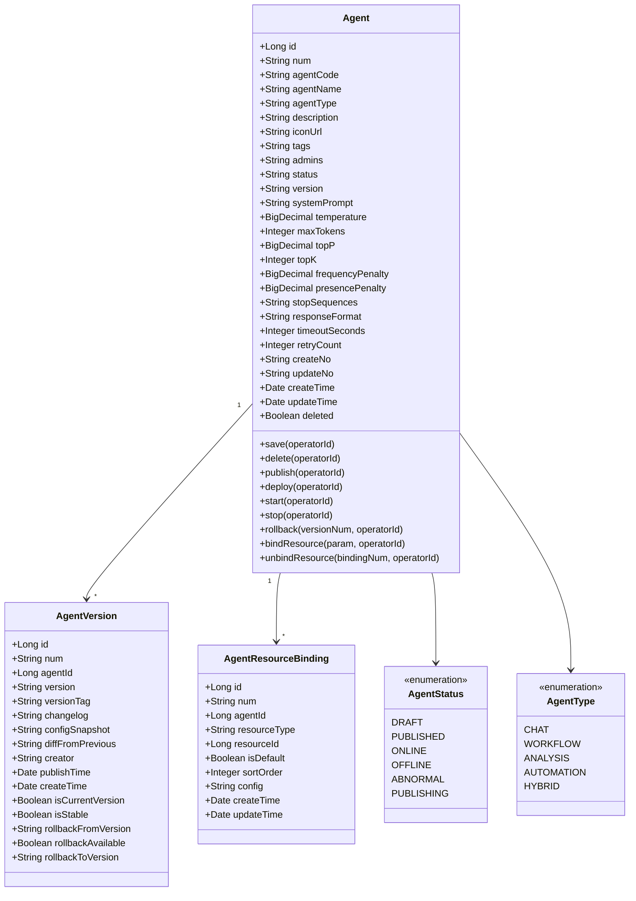
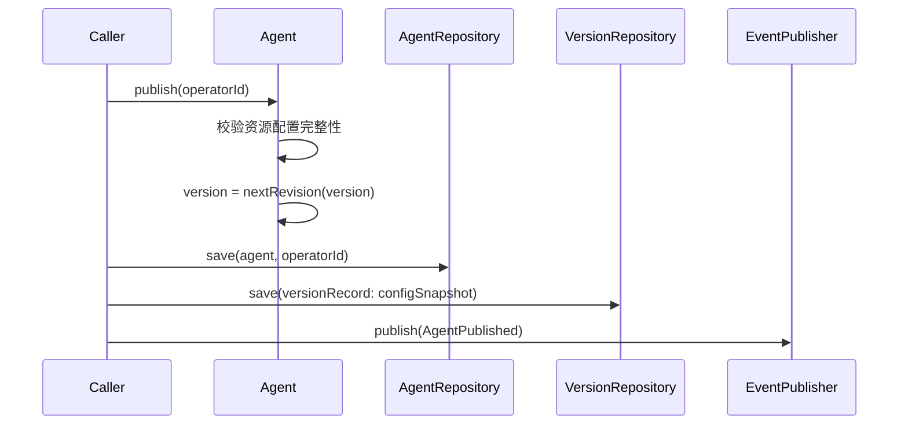
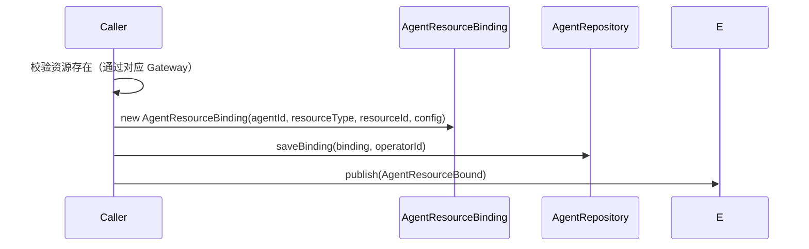
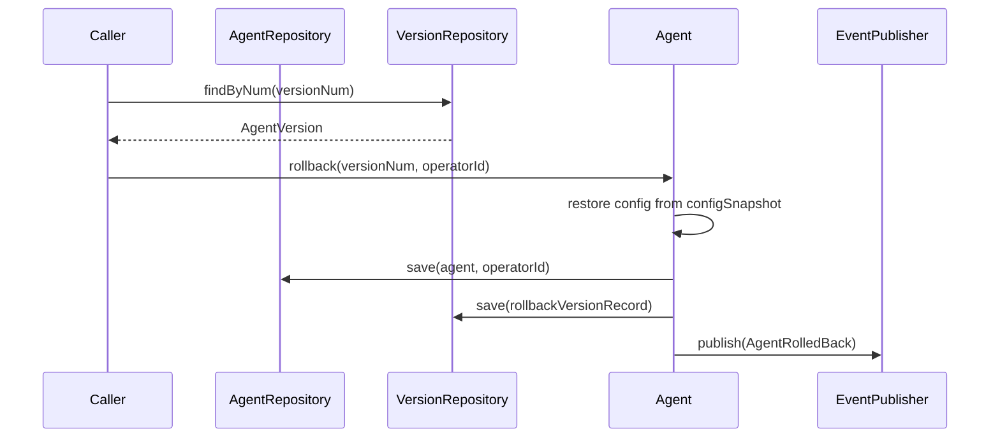
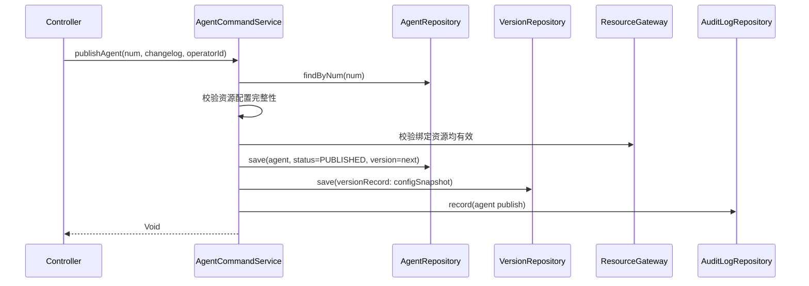
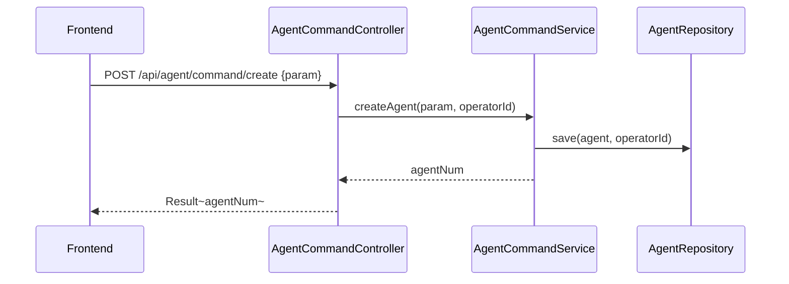
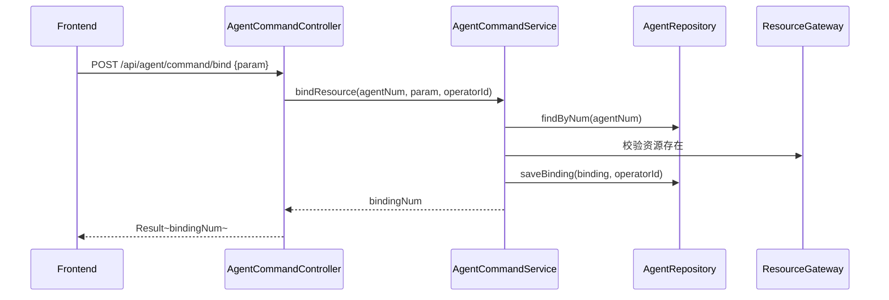

# Agent 管理 - 技术方案

> **文档版本**：V1.0  
> **创建日期**：2026-04-29  
> **关联 PRD**：4.1.1 Agent 管理（基础配置/Skill配置/MCP配置/工作流管理/版本控制）  
> **关联蓝图**：总体技术架构蓝图 V2.4，§3.3/§6.3.9/§6.3.10  
> **对应分支**：`feature-20260501-agent-model`

---

## 1. 目标与范围

### 1.1 目标

提供 Agent 全生命周期管理能力，包括：
- Agent CRUD（新增、查询、更新、删除）
- Agent 发布/上线/下线/部署/启动/停止/回滚
- Agent 版本控制（语义化版本、版本历史、版本对比、版本回滚）
- Agent 资源绑定（模型/Skill/MCP/工作流）
- Agent 管理员管理

### 1.2 范围

| 范围内 | 范围外 |
|-------|--------|
| Agent 基础配置与参数配置 | 工作流引擎实现（Phase 3） |
| Agent 资源绑定（模型/Skill/MCP/工作流） | Agent 运行时调度 |
| Agent 版本管理与回滚 | Agent 运行时监控（暂不需要） |
| Agent 发布/上线/下线 | Agent 灰度发布（Phase 3） |

---

## 2. 架构设计（代码结构）

| 层 | 领域 | 包 | 职责 |
|---|------|---|------|
| facade | agent | `com.gagentmanager.facade.agent` | Agent 领域事件 DTO、事件常量 |
| client | agent | `com.gagentmanager.client.agent` | CreateAgentParam、UpdateAgentParam、AgentVO、AgentVersionVO、ResourceBindingVO、BindResourceParam 等 |
| client | common | `com.gagentmanager.client.common` | PageParam、PageResult |
| domain | agent | `com.gagentmanager.domain.agent` | Agent 聚合根、AgentVersion/AgentResourceBinding 实体、Repository/Gateway 接口 |
| infra | agent | `com.gagentmanager.infra.agent` | Agent Entity、AgentVersion Entity、AgentResourceBinding Entity、Mapper、Repository 实现 |
| application | agent | `com.gagentmanager.application.agent` | AgentCommandService、AgentQueryService |
| adapter | agent | `com.gagentmanager.adapter.agent` | AgentCommandController、AgentQueryController |

---

## 3. 领域模型设计

### 3.1 业务层级划分

| 层级 | 业务领域 | 说明 |
|-----|---------|------|
| 核心域 | agent | Agent 全生命周期管理 + 资源绑定 + 版本控制 |

### 3.2 Agent 管理（agent）

#### 3.2.1 领域模型



| 对象 | 类型 | 属性 | 说明 |
|-----|------|------|------|
| Agent | 聚合根 | id, num, agentCode, agentName, agentType, description, iconUrl, tags, admins, status, version, systemPrompt, temperature, maxTokens, topP, topK, frequencyPenalty, presencePenalty, stopSequences, responseFormat, timeoutSeconds, retryCount | Agent 全生命周期 |
| AgentVersion | 实体 | id, num, agentId, version, versionTag, changelog, configSnapshot, diffFromPrevious, creator, publishTime, createTime, isCurrentVersion, isStable, rollbackFromVersion, rollbackAvailable, rollbackToVersion | 版本记录 |
| AgentResourceBinding | 实体 | id, num, agentId, resourceType(MODEL/SKILL/MCP/WORKFLOW), resourceId, isDefault, sortOrder, config | 资源绑定 |

**Repository 接口**：

| 方法 | 说明 |
|-----|------|
| `findByNum(num)` | 按编号查找 Agent |
| `findByCode(agentCode)` | 按编码查找 Agent |
| `list(param): PageResult~Agent~` | 分页查询 Agent |
| `save(agent, operatorId)` | 保存 Agent |
| `delete(num, operatorId)` | 逻辑删除 |
|  |  |
| `findVersionsByAgentId(agentId): List~AgentVersion~` | 查 Agent 版本列表 |
| `findCurrentVersion(agentId): AgentVersion` | 查当前版本 |
| `saveVersion(version, operatorId)` | 保存版本 |
|  |  |
| `findBindingsByAgentId(agentId): List~AgentResourceBinding~` | 查资源绑定列表 |
| `findBindingsByAgentAndType(agentId, resourceType): List~AgentResourceBinding~` | 按类型查绑定 |
| `saveBinding(binding, operatorId)` | 保存绑定 |
| `deleteBinding(num, operatorId)` | 删除绑定 |

#### 3.2.2 领域规则

| 聚合/对象 | 规则类型 | 规则描述 | 违反时表达 |
|----------|---------|---------|-----------|
| Agent | 不变性 | agentCode 全局唯一（忽略 deleted） | AgentCodeAlreadyExistsException |
| Agent | 不变性 | agentName 全局唯一（忽略 deleted） | AgentNameAlreadyExistsException |
| Agent | 业务规则 | 已发布/已上线的 Agent 不可直接删除 | AgentNotDeletableException |
| Agent | 业务规则 | 下线后的 Agent 才可删除 | AgentMustBeOfflineException |
| Agent | 业务规则 | 发布前须校验资源配置完整性（至少绑定一个模型） | AgentConfigIncompleteException |
| Agent | 业务规则 | 每次发布自动生成新版本号（修订号+1） | - |
| Agent | 业务规则 | 修改后状态回退为 DRAFT | - |
| AgentVersion | 业务规则 | 回滚目标须为 rollbackAvailable=true 的版本 | VersionNotRollableException |
| AgentResourceBinding | 业务规则 | resourceType 必须是 MODEL/SKILL/MCP/WORKFLOW | InvalidResourceTypeException |
| AgentResourceBinding | 业务规则 | 绑定的资源必须存在于对应管理模块中 | ResourceNotFoundException |

#### 3.2.3 领域动作

| 聚合/实体 | 领域动作 | 职责 | 前置条件 | 后置条件/规则 | 领域事件 |
|----------|---------|------|---------|-------------|---------|
| Agent | `save(operatorId)` | 创建/更新 Agent | agentCode/agentName 唯一 | 修改后状态回退为 DRAFT | AgentCreated / AgentUpdated |
| Agent | `delete(operatorId)` | 删除 Agent | 状态为 OFFLINE | 标记 deleted=1 | AgentDeleted |
| Agent | `publish(operatorId)` | 发布 Agent | 配置完整性校验通过 | 生成新版本记录，状态变为 PUBLISHED 或 ONLINE | AgentPublished |
| Agent | `deploy(operatorId)` | 部署 Agent | 状态为 PUBLISHED | 状态变为 PUBLISHING → ONLINE | AgentDeployed |
| Agent | `start(operatorId)` | 启动 Agent | 状态为 OFFLINE | 状态变为 ONLINE | AgentStarted |
| Agent | `stop(operatorId)` | 停止 Agent | 状态为 ONLINE | 状态变为 OFFLINE | AgentStopped |
| Agent | `rollback(versionNum, operatorId)` | 回滚到指定版本 | 目标版本可回滚 | 恢复配置快照，创建回滚版本记录 | AgentRolledBack |
| Agent | `bindResource(param, operatorId)` | 绑定资源到 Agent | 资源存在 | 写入 AgentResourceBinding | AgentResourceBound |
| Agent | `unbindResource(bindingNum, operatorId)` | 解绑资源 | 绑定存在 | 删除 AgentResourceBinding | AgentResourceUnbound |
| Agent | `updateResourceConfig(param, operatorId)` | 更新绑定资源配置 | 绑定存在 | 更新 config 字段 | AgentResourceConfigUpdated |

**publish 时序图**：



**bindResource 时序图**：



**rollback 时序图**：



#### 3.2.4 领域事件

| 事件名 | 触发时机 | 载荷要点 | 可订阅方/用途 |
|-------|---------|---------|-------------|
| AgentCreated | 创建 Agent 成功 | agentNum, agentName, agentType, operatorId | 审计日志 |
| AgentUpdated | 更新 Agent 成功 | agentNum, changes, operatorId | 审计日志 |
| AgentPublished | 发布 Agent | agentNum, version, operatorId | 审计日志 |
| AgentDeployed | 部署 Agent | agentNum, operatorId | 审计日志 |
| AgentStarted | 启动 Agent | agentNum, operatorId | 审计日志 |
| AgentStopped | 停止 Agent | agentNum, operatorId | 审计日志 |
| AgentRolledBack | 回滚 Agent | agentNum, fromVersion, toVersion, operatorId | 审计日志 |
| AgentResourceBound | 绑定资源 | agentNum, resourceType, resourceId, operatorId | 审计日志 |
| AgentResourceUnbound | 解绑资源 | agentNum, resourceType, resourceId, operatorId | 审计日志 |

---

## 4. 应用层设计

### 4.1 业务模块划分

| 应用模块 | 对应领域 | Service 类型 | 说明 |
|---------|---------|-------------|------|
| agent | Agent 管理 | CommandService | Agent CRUD、发布/上线/下线/回滚、资源绑定 |
| agent | Agent 管理 | QueryService | Agent 列表/详情、版本列表、资源绑定列表 |

### 4.2 Agent 管理（agent）

#### 4.2.1 Service 方法清单

| Service | 方法签名 | 职责 | 入参 | 出参 |
|---------|---------|------|------|------|
| AgentCommandService | `createAgent(param: CreateAgentParam, operatorId: Long): String` | 创建 Agent | agentName, agentType, description, systemPrompt, temperature, maxTokens, topP, topK, frequencyPenalty, presencePenalty, responseFormat, timeoutSeconds, retryCount, admins | agentNum |
| AgentCommandService | `updateAgent(param: UpdateAgentParam, operatorId: Long): Void` | 更新 Agent | num, 同上 | - |
| AgentCommandService | `deleteAgent(num: String, operatorId: Long): Void` | 删除 Agent | num | - |
| AgentCommandService | `publishAgent(num: String, changelog: String, operatorId: Long): Void` | 发布 Agent | num, changelog | - |
| AgentCommandService | `deployAgent(num: String, operatorId: Long): Void` | 部署 Agent | num | - |
| AgentCommandService | `startAgent(num: String, operatorId: Long): Void` | 启动 Agent | num | - |
| AgentCommandService | `stopAgent(num: String, operatorId: Long): Void` | 停止 Agent | num | - |
| AgentCommandService | `rollbackAgent(num: String, versionNum: String, operatorId: Long): Void` | 回滚 Agent | num, versionNum | - |
| AgentCommandService | `bindResource(agentNum: String, param: BindResourceParam, operatorId: Long): String` | 绑定资源 | agentNum, resourceType, resourceId, isDefault, sortOrder, config | bindingNum |
| AgentCommandService | `unbindResource(bindingNum: String, operatorId: Long): Void` | 解绑资源 | bindingNum | - |
| AgentCommandService | `updateResourceConfig(param: UpdateBindingParam, operatorId: Long): Void` | 更新绑定配置 | bindingNum, config | - |
| AgentQueryService | `queryAgentList(param: AgentQueryParam): PageResult~AgentVO~` | Agent 列表 | pageNo, pageSize, keyword, status, agentType | PageResult~AgentVO~ |
| AgentQueryService | `queryAgentByNum(num: String): AgentVO` | Agent 详情 | num | AgentVO |
| AgentQueryService | `queryAgentVersions(agentNum: String): List~AgentVersionVO~` | 版本列表 | agentNum | List~AgentVersionVO~ |
| AgentQueryService | `queryResourceBindings(agentNum: String, resourceType: String): List~ResourceBindingVO~` | 资源绑定列表 | agentNum, resourceType | List~ResourceBindingVO~ |

#### 4.2.2 方法时序逻辑

**publishAgent 时序图**：



---

## 5. 控制器/Adapter 层设计

### 5.1 业务模块划分

| Controller | 对应应用模块 | URL 前缀 |
|-----------|-------------|---------|
| AgentCommandController | agent | `/api/agent/command` |
| AgentQueryController | agent | `/api/agent/query` |

### 5.2 Agent 管理（agent）

#### 5.2.1 Controller 接口清单

| 接口 | 方法 | 路径 | 入参 JSON | 返回值 JSON | 职责 |
|-----|------|------|----------|-----------|------|
| Agent 列表 | GET | `/api/agent/query/list` | pageNo, pageSize, keyword, status, agentType | `{"code": 200, "data": {"records": [{"num": "AGENT-001", "agentName": "客服助手", "agentType": "CHAT", "status": "ONLINE", "boundModel": "gpt-4o", "skillCount": 3, "mcpCount": 1, "version": "V1.2.0"}]}}` | 分页查询 |
| Agent 详情 | GET | `/api/agent/query/detail` | num | `{"code": 200, "data": {"num": "AGENT-001", "agentName": "客服助手", "systemPrompt": "...", "temperature": 0.7, "admins": ["admin"], "boundModel": "gpt-4o"}}` | 详情 |
| 创建 Agent | POST | `/api/agent/command/create` | `{"agentName": "客服助手", "agentType": "CHAT", "description": "...", "systemPrompt": "..."}` | `{"code": 200, "data": "AGENT-001"}` | 创建 |
| 更新 Agent | POST | `/api/agent/command/update` | `{"num": "AGENT-001", "agentName": "新名称", ...}` | `{"code": 200, "data": null}` | 更新 |
| 删除 Agent | POST | `/api/agent/command/delete` | `{"num": "AGENT-001"}` | `{"code": 200, "data": null}` | 删除 |
| 发布 Agent | POST | `/api/agent/command/publish` | `{"num": "AGENT-001", "changelog": "新增功能"}` | `{"code": 200, "data": null}` | 发布 |
| 上线 Agent | POST | `/api/agent/command/online` | `{"num": "AGENT-001"}` | `{"code": 200, "data": null}` | 上线 |
| 下线 Agent | POST | `/api/agent/command/offline` | `{"num": "AGENT-001"}` | `{"code": 200, "data": null}` | 下线 |
| 回滚 Agent | POST | `/api/agent/command/rollback` | `{"num": "AGENT-001", "versionNum": "AGENT-VER-005"}` | `{"code": 200, "data": null}` | 回滚 |
| 版本列表 | GET | `/api/agent/query/versions` | agentNum | `{"code": 200, "data": [{"num": "AGENT-VER-001", "version": "V1.0.0", "versionTag": "已发布", "creator": "admin"}]}` | 版本列表 |
| 资源绑定列表 | GET | `/api/agent/query/bindings` | agentNum, resourceType | `{"code": 200, "data": [{"num": "BIND-001", "resourceType": "MODEL", "resourceName": "gpt-4o", "isDefault": true}]}` | 资源绑定列表 |
| 绑定资源 | POST | `/api/agent/command/bind` | `{"agentNum": "AGENT-001", "resourceType": "MODEL", "resourceNum": "MODEL-001"}` | `{"code": 200, "data": "BIND-001"}` | 绑定资源 |
| 解绑资源 | POST | `/api/agent/command/unbind` | `{"bindingNum": "BIND-001"}` | `{"code": 200, "data": null}` | 解绑资源 |
| 更新绑定配置 | POST | `/api/agent/command/update-binding-config` | `{"bindingNum": "BIND-001", "config": {"priority": 80}}` | `{"code": 200, "data": null}` | 更新绑定配置 |

#### 5.2.2 接口时序逻辑

**创建 Agent 时序图**：



**绑定资源时序图**：



---

## 6. 数据库设计

### 6.1 表结构

| 表 | 对应领域 | 说明 |
|---|---------|------|
| `agent` | agent / Agent | Agent 基本信息（蓝图 §6.3.9） |
| `agent_version` | agent / AgentVersion | Agent 版本记录 |
| `agent_resource_binding` | agent / AgentResourceBinding | Agent-资源绑定关系（蓝图 §6.3.10） |

### 6.2 补充 DDL

`agent` 表和 `agent_resource_binding` 表已在蓝图定义。`agent_version` 表需要补充 DDL：

```sql
CREATE TABLE `agent_version` (
    `id`                  BIGINT          NOT NULL AUTO_INCREMENT COMMENT '主键',
    `num`                 VARCHAR(64)     NOT NULL                COMMENT '版本编号',
    `agent_id`            BIGINT          NOT NULL                COMMENT '所属 Agent ID',
    `version`             VARCHAR(16)     NOT NULL                COMMENT '版本号（语义化版本）',
    `version_tag`         VARCHAR(16)     NOT NULL DEFAULT 'DRAFT' COMMENT '版本标签：DRAFT/PUBLISHED/ONLINE/OFFLINE/ROLLED_BACK/DEPRECATED',
    `changelog`           VARCHAR(1000)   DEFAULT NULL            COMMENT '版本变更说明',
    `config_snapshot`     JSON            NOT NULL                COMMENT '版本配置快照',
    `diff_from_previous`  JSON            DEFAULT NULL            COMMENT '与上一版本的差异对比',
    `creator`             VARCHAR(64)     NOT NULL                COMMENT '版本创建人',
    `publish_time`        DATETIME(3)     DEFAULT NULL            COMMENT '发布时间',
    `is_current`          TINYINT(1)      NOT NULL DEFAULT 0      COMMENT '是否为当前活跃版本',
    `is_stable`           TINYINT(1)      NOT NULL DEFAULT 0      COMMENT '是否为稳定版本',
    `rollback_from`       VARCHAR(16)     DEFAULT NULL            COMMENT '如果是回滚版本，记录回滚来源',
    `rollback_available`  TINYINT(1)      NOT NULL DEFAULT 1      COMMENT '是否可回滚到此版本',
    `rollback_to`         VARCHAR(16)     DEFAULT NULL            COMMENT '如果已回滚，记录回滚到的目标版本',
    `create_time`         DATETIME(3)     NOT NULL DEFAULT CURRENT_TIMESTAMP(3) COMMENT '版本创建时间',
    `deleted`             TINYINT(1)      NOT NULL DEFAULT 0      COMMENT '逻辑删除',
    PRIMARY KEY (`id`),
    UNIQUE KEY `uk_num` (`num`, `deleted`),
    KEY `idx_agent_id` (`agent_id`),
    KEY `idx_version` (`agent_id`, `version`),
    KEY `idx_is_current` (`agent_id`, `is_current`)
) ENGINE=InnoDB DEFAULT CHARSET=utf8mb4 COLLATE=utf8mb4_unicode_ci COMMENT='Agent版本记录表';
```

---

## 7. 模块变更清单

| 层级 | 变更项 | 对应 Skill |
|------|--------|------------|
| facade | Agent 领域事件 DTO（AgentPublishedEventDTO 等） | impl-facade-module |
| client | CreateAgentParam、UpdateAgentParam、BindResourceParam、AgentVO、AgentVersionVO、ResourceBindingVO | impl-client-module |
| domain | Agent/AgentVersion/AgentResourceBinding 聚合与实体、Repository/Gateway 接口 | impl-domain-module |
| infra | Agent/AgentVersion/AgentResourceBinding Entity/Mapper、Repository 实现、ResourceGateway 实现 | impl-infra-module |
| application | AgentCommandService、AgentQueryService | impl-application-module |
| adapter | AgentCommandController、AgentQueryController | impl-adapter-module |

---

## 8. 代码分支命名

**分支名**：`feature-20260501-agent-model`

---

## 9. 实现顺序

```
facade → client → domain(Agent 聚合 + Gateway 接口) → infra(Entity/Mapper/ResourceGateway) → application(AgentCommandService) → adapter(AgentCommandController)
```

---

## 10. 接口与数据契约

### 10.1 前端 API 对接约定

前端 `api/agent.ts` 已定义接口，需适配路径：

| 前端方法 | 前端路径 | 后端路径 | 说明 |
|---------|---------|---------|------|
| `getAgents(params)` | GET `/agents` | GET `/api/agent/query/list` | 需适配 |
| `getAgent(id)` | GET `/agents/:id` | GET `/api/agent/query/detail?num=xxx` | 需适配 |
| `createAgent(data)` | POST `/agents` | POST `/api/agent/command/create` | 需适配 |
| `updateAgent(id, data)` | PUT `/agents/:id` | POST `/api/agent/command/update` | 需适配 |
| `deleteAgent(id)` | DELETE `/agents/:id` | POST `/api/agent/command/delete` | 需适配 |
| `publishAgent(id)` | POST `/agents/:id/publish` | POST `/api/agent/command/publish` | 需适配 |
| `onlineAgent(id)` | POST `/agents/:id/online` | POST `/api/agent/command/online` | 需适配 |
| `offlineAgent(id)` | POST `/agents/:id/offline` | POST `/api/agent/command/offline` | 需适配 |
| `getAgentVersions(id)` | GET `/agents/:id/versions` | GET `/api/agent/query/versions?agentNum=xxx` | 需适配 |
| `rollbackAgent(id, versionId)` | POST `/agents/:id/rollback/:versionId` | POST `/api/agent/command/rollback` | 需适配 |

### 10.2 错误码（1101 ~ 1199）

| 错误码 | 说明 |
|-------|------|
| 1101 | Agent 编码已存在 |
| 1102 | Agent 名称已存在 |
| 1103 | Agent 配置不完整（未绑定模型） |
| 1104 | Agent 已发布，不可直接删除 |
| 1105 | Agent 未下线，不可删除 |
| 1106 | 版本不可回滚 |
| 1107 | 绑定资源不存在 |
| 1108 | Agent 部署中，不可操作 |
