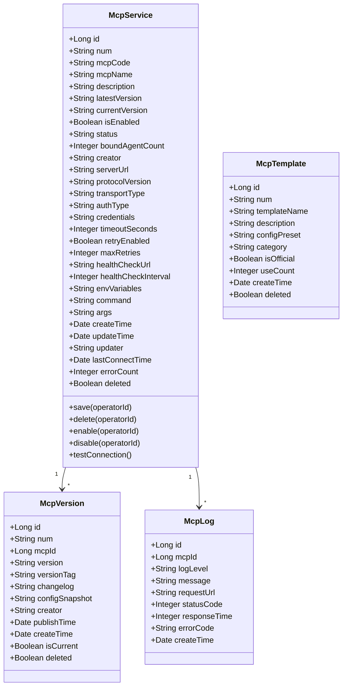
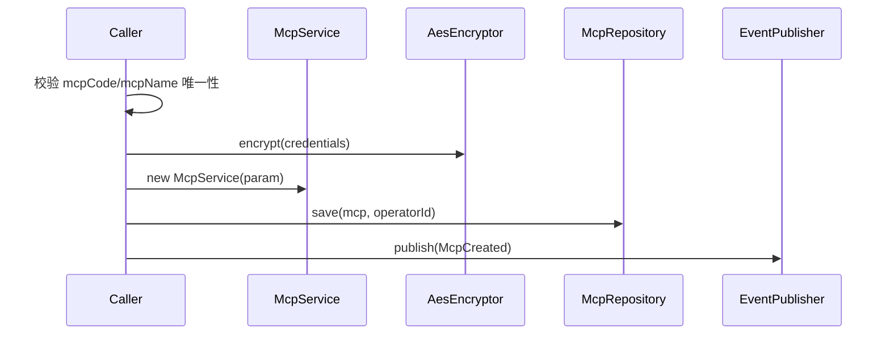
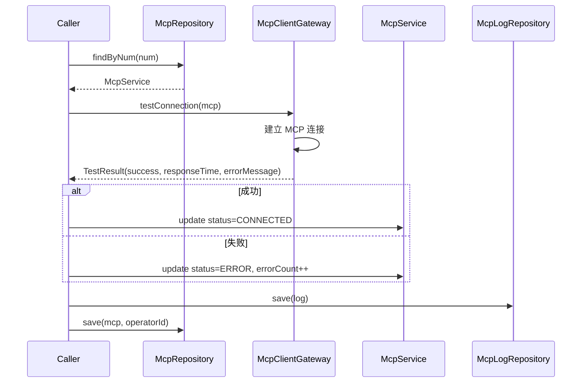
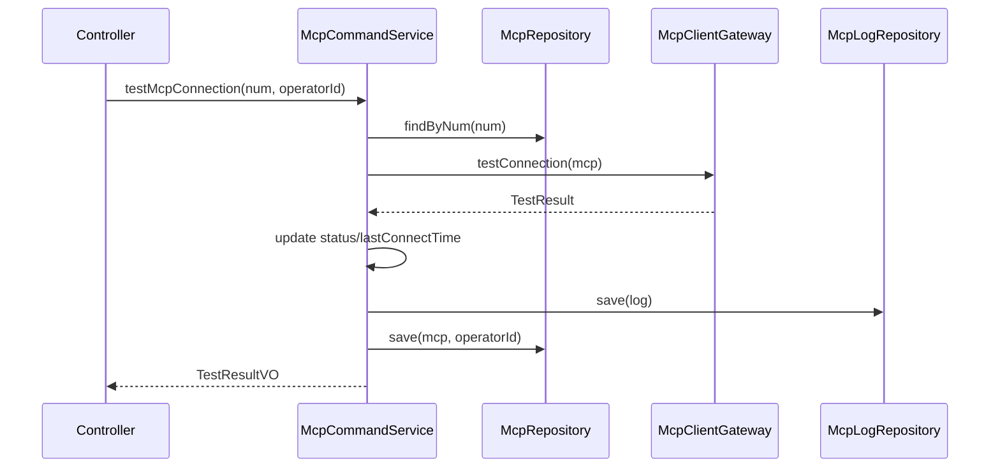
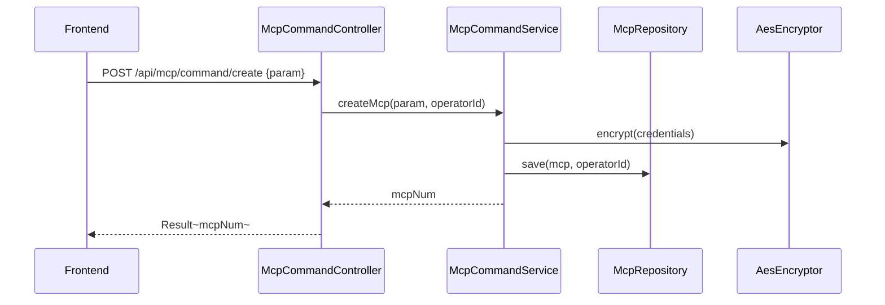

# MCP 管理 - 技术方案

> **文档版本**：V1.0  
> **创建日期**：2026-04-29  
> **关联 PRD**：4.1.6 MCP 管理  
> **关联蓝图**：总体技术架构蓝图 V2.4，§3.7/§6.3.17~§6.3.18/§6.3.20(部分)  
> **对应分支**：`feature-20260515-skill-mcp`

---

## 1. 目标与范围

### 1.1 目标

提供 MCP（Model Context Protocol）服务管理能力，包括：
- MCP 服务 CRUD（新增、查询、更新、删除）
- MCP 启停控制
- MCP 连通性测试
- MCP 版本控制（版本历史、版本回滚）
- MCP 日志查看
- MCP 模板管理（预置配置模板）

### 1.2 范围

| 范围内 | 范围外 |
|-------|--------|
| MCP 服务配置管理 | MCP 协议底层实现（使用 Spring AI MCP Client） |
| MCP 启停 + 连通性测试 | MCP 性能分析与自动故障恢复（Phase 3） |
| MCP 版本控制 | MCP 权限控制（与 Agent 绑定时的权限） |
| MCP 日志查看 | MCP 故障转移 |

---

## 2. 架构设计（代码结构）

| 层 | 领域 | 包 | 职责 |
|---|------|---|------|
| facade | mcp | `com.gagentmanager.facade.mcp` | MCP 领域事件 DTO、事件常量 |
| client | mcp | `com.gagentmanager.client.mcp` | CreateMcpParam、UpdateMcpParam、McpVO、McpVersionVO、McpLogVO、McpTemplateVO |
| client | common | `com.gagentmanager.client.common` | PageParam、PageResult |
| domain | mcp | `com.gagentmanager.domain.mcp` | McpService 聚合根、McpVersion/McpLog/McpTemplate 实体、Repository/Gateway 接口 |
| infra | mcp | `com.gagentmanager.infra.mcp` | MCP 相关 Entity/Mapper、Repository 实现、McpClientGateway 实现 |
| application | mcp | `com.gagentmanager.application.mcp` | McpCommandService、McpQueryService |
| adapter | mcp | `com.gagentmanager.adapter.mcp` | McpCommandController、McpQueryController |

---

## 3. 领域模型设计

### 3.1 业务层级划分

| 层级 | 业务领域 | 说明 |
|-----|---------|------|
| 支撑域 | mcp | MCP 服务管理（连接/日志/模板/版本） |

### 3.2 MCP 管理（mcp）

#### 3.2.1 领域模型



| 对象 | 类型 | 属性 | 说明 |
|-----|------|------|------|
| McpService | 聚合根 | id, num, mcpCode, mcpName, description, latestVersion, currentVersion, isEnabled, status, boundAgentCount, serverUrl, protocolVersion, transportType, authType, credentials(加密), timeoutSeconds, retryEnabled, maxRetries, healthCheckUrl, healthCheckInterval, envVariables, command, args, lastConnectTime, errorCount | MCP 服务配置 |
| McpVersion | 实体 | id, num, mcpId, version, versionTag, changelog, configSnapshot, creator, publishTime, createTime, isCurrent, deleted | MCP 版本记录 |
| McpLog | 实体 | id, mcpId, logLevel, message, requestUrl, statusCode, responseTime, errorCode, createTime | MCP 连接与交互日志 |
| McpTemplate | 实体 | id, num, templateName, description, configPreset, category, isOfficial, useCount, createTime, deleted | MCP 预置配置模板 |

**Repository 接口**：

| 方法 | 说明 |
|-----|------|
| `findByNum(num)` | 按编号查找 |
| `list(param): PageResult~McpService~` | 分页查询 |
| `save(mcp, operatorId)` | 保存 |
| `delete(num, operatorId)` | 逻辑删除 |
| `findEnabledMcps(): List~McpService~` | 查询已启用的 MCP |
|  |  |
| `findVersionsByMcpId(mcpId): List~McpVersion~` | 查版本列表 |
| `saveVersion(version, operatorId)` | 保存版本 |
|  |  |
| `findLogsByMcpId(mcpId, param): PageResult~McpLog~` | 查日志分页 |
| `saveLog(log)` | 保存日志 |
|  |  |
| `findTemplates(category: String): List~McpTemplate~` | 查模板列表 |
| `saveTemplate(template, operatorId)` | 保存模板 |

#### 3.2.2 领域规则

| 聚合/对象 | 规则类型 | 规则描述 | 违反时表达 |
|----------|---------|---------|-----------|
| McpService | 不变性 | mcpCode 全局唯一 | McpCodeAlreadyExistsException |
| McpService | 不变性 | mcpName 全局唯一 | McpNameAlreadyExistsException |
| McpService | 业务规则 | 有 Agent 绑定的 MCP 不可删除 | McpHasBindingsException |
| McpService | 业务规则 | credentials 须加密存储 | - |
| McpVersion | 业务规则 | 最新版本自动标记为 isCurrent=true | - |

#### 3.2.3 领域动作

| 聚合/实体 | 领域动作 | 职责 | 前置条件 | 后置条件/规则 | 领域事件 |
|----------|---------|------|---------|-------------|---------|
| McpService | `save(operatorId)` | 创建/更新 MCP | mcpCode/mcpName 唯一 | 加密存储 credentials | McpCreated / McpUpdated |
| McpService | `delete(operatorId)` | 删除 MCP | 无 Agent 绑定 | 标记 deleted=1 | McpDeleted |
| McpService | `enable(operatorId)` | 启用 MCP | MCP 存在 | isEnabled=true | McpEnabled |
| McpService | `disable(operatorId)` | 禁用 MCP | MCP 存在 | isEnabled=false | McpDisabled |
| McpService | `testConnection()` | 连通性测试 | MCP 已启用 | 更新 status + lastConnectTime | McpTested |
| McpVersion | `publish(changelog, operatorId)` | 发布版本 | MCP 存在 | 保存版本快照，更新 currentVersion | McpVersionPublished |
| McpVersion | `rollback(versionNum, operatorId)` | 回滚版本 | 目标版本存在 | 恢复 configSnapshot，更新 currentVersion | McpVersionRolledBack |

**createMcp 时序图**：



**testConnection 时序图**：



#### 3.2.4 领域事件

| 事件名 | 触发时机 | 载荷要点 | 可订阅方/用途 |
|-------|---------|---------|-------------|
| McpCreated | 创建 MCP 成功 | mcpNum, mcpName, serverUrl, operatorId | 审计日志 |
| McpUpdated | 更新 MCP 成功 | mcpNum, changes, operatorId | 审计日志 |
| McpEnabled | 启用 MCP | mcpNum, operatorId | 审计日志 |
| McpDisabled | 禁用 MCP | mcpNum, operatorId | 审计日志 |
| McpTested | 连通性测试完成 | mcpNum, status, responseTime | 审计日志、日志记录 |
| McpVersionPublished | 发布 MCP 版本 | mcpNum, version, operatorId | 审计日志 |

---

## 4. 应用层设计

### 4.1 业务模块划分

| 应用模块 | 对应领域 | Service 类型 | 说明 |
|---------|---------|-------------|------|
| mcp | MCP 管理 | CommandService | MCP CRUD、启停、连通性测试、版本控制 |
| mcp | MCP 管理 | QueryService | MCP 列表/详情、版本/日志/模板查询 |

### 4.2 MCP 管理（mcp）

#### 4.2.1 Service 方法清单

| Service | 方法签名 | 职责 | 入参 | 出参 |
|---------|---------|------|------|------|
| McpCommandService | `createMcp(param: CreateMcpParam, operatorId: Long): String` | 创建 MCP 服务 | mcpName, serverUrl, protocolVersion, transportType, authType, credentials, timeoutSeconds, ... | mcpNum |
| McpCommandService | `updateMcp(param: UpdateMcpParam, operatorId: Long): Void` | 更新 MCP | num, 同上 | - |
| McpCommandService | `deleteMcp(num: String, operatorId: Long): Void` | 删除 MCP | num | - |
| McpCommandService | `enableMcp(num: String, operatorId: Long): Void` | 启用 MCP | num | - |
| McpCommandService | `disableMcp(num: String, operatorId: Long): Void` | 禁用 MCP | num | - |
| McpCommandService | `testMcpConnection(num: String, operatorId: Long): TestResultVO` | 连通性测试 | num | TestResultVO |
| McpQueryService | `queryMcpList(param: McpQueryParam): PageResult~McpVO~` | MCP 列表 | pageNo, pageSize, keyword, status | PageResult~McpVO~ |
| McpQueryService | `queryMcpByNum(num: String): McpVO` | MCP 详情 | num | McpVO |
| McpQueryService | `queryMcpVersions(mcpNum: String): List~McpVersionVO~` | 版本列表 | mcpNum | List~McpVersionVO~ |
| McpQueryService | `queryMcpLogs(param: McpLogQueryParam): PageResult~McpLogVO~` | MCP 日志 | mcpId, logLevel, startTime, endTime, pageNo, pageSize | PageResult~McpLogVO~ |
| McpQueryService | `queryMcpTemplates(category: String): List~McpTemplateVO~` | MCP 模板 | category | List~McpTemplateVO~ |

#### 4.2.2 方法时序逻辑

**testMcpConnection 时序图**：



---

## 5. 控制器/Adapter 层设计

### 5.1 业务模块划分

| Controller | 对应应用模块 | URL 前缀 |
|-----------|-------------|---------|
| McpCommandController | mcp | `/api/mcp/command` |
| McpQueryController | mcp | `/api/mcp/query` |

### 5.2 MCP 管理（mcp）

#### 5.2.1 Controller 接口清单

| 接口 | 方法 | 路径 | 入参 | 返回值 JSON | 职责 |
|-----|------|------|------|-----------|------|
| MCP 列表 | GET | `/api/mcp/query/list` | pageNo, pageSize, keyword, status | `{"code": 200, "data": {"records": [{"num": "MCP-001", "mcpName": "MySQL MCP", "status": "已连接", "boundAgentCount": 2}]}}` | 分页查询 |
| MCP 详情 | GET | `/api/mcp/query/detail` | num | `{"code": 200, "data": {"num": "MCP-001", "mcpName": "MySQL MCP", "serverUrl": "...", "protocolVersion": "v1.0"}}` | 详情 |
| 创建 MCP | POST | `/api/mcp/command/create` | `{"mcpName": "MySQL MCP", "serverUrl": "...", "protocolVersion": "v1.0", "transportType": "sse", "authType": "API Key"}` | `{"code": 200, "data": "MCP-001"}` | 创建 |
| 更新 MCP | POST | `/api/mcp/command/update` | `{"num": "MCP-001", "mcpName": "..."}` | `{"code": 200, "data": null}` | 更新 |
| 删除 MCP | POST | `/api/mcp/command/delete` | `{"num": "MCP-001"}` | `{"code": 200, "data": null}` | 删除 |
| 启用 MCP | POST | `/api/mcp/command/enable` | `{"num": "MCP-001"}` | `{"code": 200, "data": null}` | 启用 |
| 禁用 MCP | POST | `/api/mcp/command/disable` | `{"num": "MCP-001"}` | `{"code": 200, "data": null}` | 禁用 |
| 连通性测试 | POST | `/api/mcp/command/test` | `{"num": "MCP-001"}` | `{"code": 200, "data": {"success": true, "responseTime": 500}}` | 连通性测试 |
| 版本列表 | GET | `/api/mcp/query/versions` | mcpNum | `{"code": 200, "data": [{"num": "VER-001", "version": "V1.0.0"}]}` | 版本列表 |
| MCP 日志 | GET | `/api/mcp/query/logs` | mcpId, logLevel, pageNo, pageSize | `{"code": 200, "data": {"records": [{"logLevel": "INFO", "message": "Connected"}]}}` | 日志查询 |
| MCP 模板 | GET | `/api/mcp/query/templates` | category | `{"code": 200, "data": [{"templateName": "MySQL 标准配置", "category": "DATABASE"}]}` | 模板列表 |

#### 5.2.2 接口时序逻辑

**创建 MCP 时序图**：



---

## 6. 数据库设计

### 6.1 表结构

| 表 | 对应领域 | 说明 |
|---|---------|------|
| `mcp_service` | mcp / McpService | MCP 服务配置（蓝图待补充 DDL） |
| `mcp_version` | mcp / McpVersion | MCP 版本记录（蓝图 §6.3.16） |
| `mcp_log` | mcp / McpLog | MCP 日志（蓝图 §6.3.17） |
| `mcp_template` | mcp / McpTemplate | MCP 模板（蓝图 §6.3.18） |

### 6.2 补充 DDL

`mcp_service` 表需要补充：

```sql
CREATE TABLE `mcp_service` (
    `id`                    BIGINT          NOT NULL AUTO_INCREMENT COMMENT '主键',
    `num`                   VARCHAR(64)     NOT NULL                COMMENT 'MCP服务编号',
    `mcp_code`              VARCHAR(64)     NOT NULL                COMMENT 'MCP服务编码',
    `mcp_name`              VARCHAR(50)     NOT NULL                COMMENT '服务名称',
    `description`           VARCHAR(500)    DEFAULT NULL            COMMENT '描述信息',
    `latest_version`        VARCHAR(16)     NOT NULL                COMMENT '最新版本号',
    `current_version`       VARCHAR(16)     NOT NULL                COMMENT '当前使用版本号',
    `is_enabled`            TINYINT(1)      NOT NULL DEFAULT 1      COMMENT '是否启用',
    `status`                VARCHAR(16)     NOT NULL DEFAULT 'UNCONNECTED' COMMENT '连接状态',
    `bound_agent_count`     INT             NOT NULL DEFAULT 0      COMMENT '已绑定Agent数量',
    `creator`               VARCHAR(64)     NOT NULL                COMMENT '创建人',
    `server_url`            VARCHAR(512)    NOT NULL                COMMENT 'MCP服务器地址',
    `protocol_version`      VARCHAR(8)      NOT NULL                COMMENT '协议版本：v1.0/v1.1/v2.0',
    `transport_type`        VARCHAR(16)     NOT NULL                COMMENT '传输类型：stdio/sse/http',
    `auth_type`             VARCHAR(16)     NOT NULL                COMMENT '认证方式',
    `credentials`           TEXT            DEFAULT NULL            COMMENT '认证凭据（加密存储）',
    `timeout_seconds`       INT             NOT NULL DEFAULT 30     COMMENT '连接超时（秒）',
    `retry_enabled`         TINYINT(1)      NOT NULL DEFAULT 1      COMMENT '是否启用自动重试',
    `max_retries`           INT             NOT NULL DEFAULT 3      COMMENT '最大重试次数',
    `health_check_url`      VARCHAR(512)    DEFAULT NULL            COMMENT '健康检查URL',
    `health_check_interval` INT             NOT NULL DEFAULT 60     COMMENT '健康检查间隔（秒）',
    `env_variables`         JSON            DEFAULT NULL            COMMENT '环境变量配置',
    `command`               VARCHAR(256)    DEFAULT NULL            COMMENT '启动命令（stdio传输方式）',
    `args`                  JSON            DEFAULT NULL            COMMENT '启动参数列表',
    `last_connect_time`     DATETIME(3)     DEFAULT NULL            COMMENT '最近连接时间',
    `error_count`           INT             NOT NULL DEFAULT 0      COMMENT '累计错误次数',
    `updater`               VARCHAR(64)     DEFAULT NULL            COMMENT '更新人',
    `create_time`           DATETIME(3)     NOT NULL DEFAULT CURRENT_TIMESTAMP(3) COMMENT '创建时间',
    `update_time`           DATETIME(3)     NOT NULL DEFAULT CURRENT_TIMESTAMP(3) ON UPDATE CURRENT_TIMESTAMP(3) COMMENT '更新时间',
    `deleted`               TINYINT(1)      NOT NULL DEFAULT 0      COMMENT '逻辑删除',
    PRIMARY KEY (`id`),
    UNIQUE KEY `uk_num` (`num`, `deleted`),
    UNIQUE KEY `uk_mcp_code` (`mcp_code`, `deleted`),
    UNIQUE KEY `uk_mcp_name` (`mcp_name`, `deleted`),
    KEY `idx_status` (`status`)
) ENGINE=InnoDB DEFAULT CHARSET=utf8mb4 COLLATE=utf8mb4_unicode_ci COMMENT='MCP服务配置表';
```

---

## 7. 模块变更清单

| 层级 | 变更项 | 对应 Skill |
|------|--------|------------|
| facade | MCP 领域事件 DTO | impl-facade-module |
| client | CreateMcpParam、UpdateMcpParam、McpVO、McpVersionVO、McpLogVO、McpTemplateVO | impl-client-module |
| domain | McpService/McpVersion/McpLog/McpTemplate 聚合与实体、Repository/Gateway 接口 | impl-domain-module |
| infra | 4 张表 Entity/Mapper、Repository 实现、McpClientGateway 实现、AesEncryptor | impl-infra-module |
| application | McpCommandService、McpQueryService | impl-application-module |
| adapter | McpCommandController、McpQueryController | impl-adapter-module |

---

## 8. 代码分支命名

**分支名**：`feature-20260515-skill-mcp`

---

## 9. 实现顺序

```
facade → client → domain → infra(4 张表 + McpClientGateway) → application → adapter
```

---

## 10. 接口与数据契约

### 10.1 前端 API 对接约定

前端 `api/mcp.ts` 已定义接口，需适配路径：

| 前端方法 | 前端路径 | 后端路径 | 说明 |
|---------|---------|---------|------|
| `getMCPs(params)` | GET `/mcps` | GET `/api/mcp/query/list` | 需适配 |
| `getMCP(id)` | GET `/mcps/:id` | GET `/api/mcp/query/detail?num=xxx` | 需适配 |
| `createMCP(data)` | POST `/mcps` | POST `/api/mcp/command/create` | 需适配 |
| `updateMCP(id, data)` | PUT `/mcps/:id` | POST `/api/mcp/command/update` | 需适配 |
| `deleteMCP(id)` | DELETE `/mcps/:id` | POST `/api/mcp/command/delete` | 需适配 |
| `enableMCP(id)` | POST `/mcps/:id/enable` | POST `/api/mcp/command/enable` | 需适配 |
| `disableMCP(id)` | POST `/mcps/:id/disable` | POST `/api/mcp/command/disable` | 需适配 |
| `testMCPConnection(id)` | POST `/mcps/:id/test` | POST `/api/mcp/command/test` | 需适配 |

### 10.2 错误码（1401 ~ 1499）

| 错误码 | 说明 |
|-------|------|
| 1401 | MCP 编码已存在 |
| 1402 | MCP 名称已存在 |
| 1403 | MCP 已被禁用 |
| 1404 | MCP 有 Agent 绑定，不可删除 |
| 1405 | 连通性测试失败 |
| 1406 | MCP 连接超时 |
