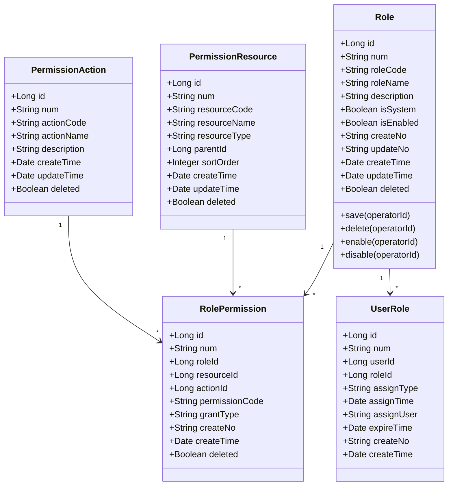
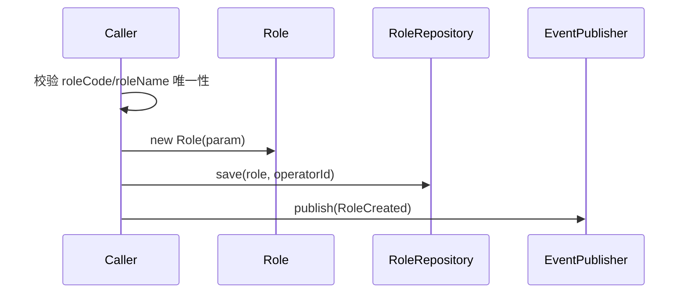
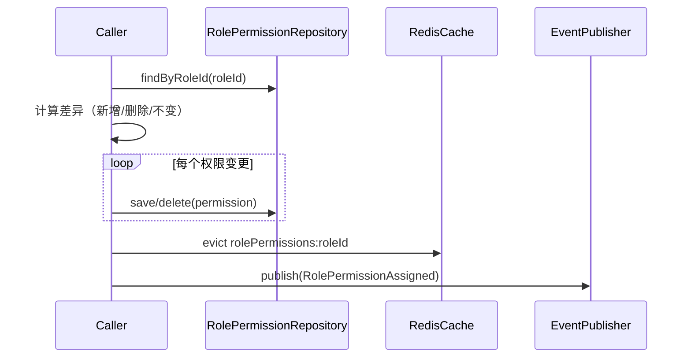
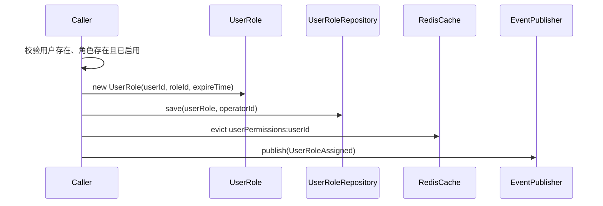
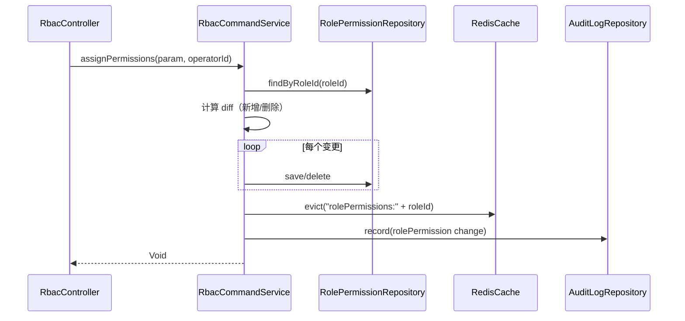
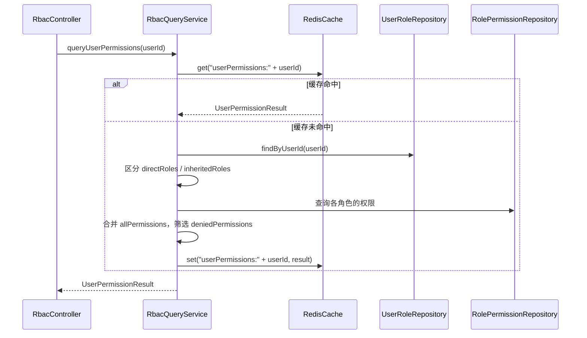
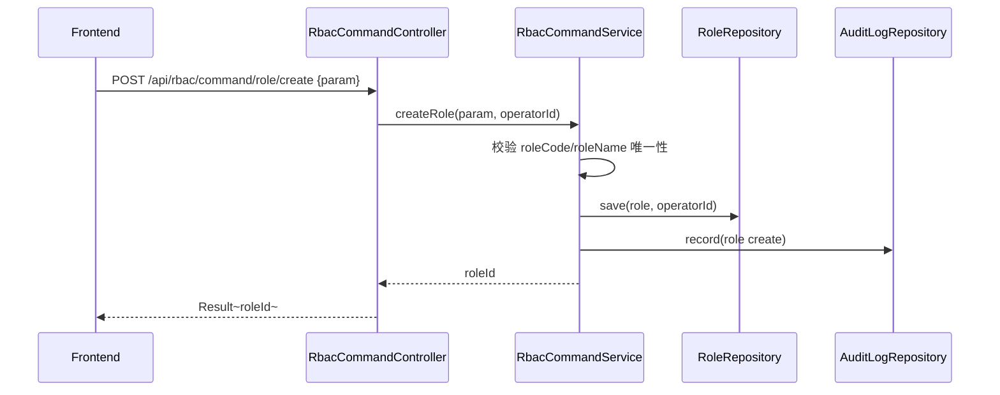
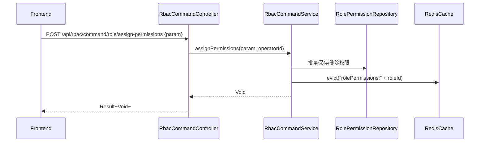

# RBAC 权限管理 - 技术方案

> **文档版本**：V1.0  
> **创建日期**：2026-04-29  
> **关联 PRD**：4.1.4 权限管理  
> **关联蓝图**：总体技术架构蓝图 V2.4，§3.5/§6.3.2~§6.3.6  
> **对应分支**：`feature-20260428-init-foundation`

---

## 1. 目标与范围

### 1.1 目标

基于 RBAC（Role-Based Access Control）模型提供细粒度权限管理能力，包括：
- 角色 CRUD（新增、修改、删除、启用/禁用、复制）
- 权限矩阵配置（模块级/菜单级/按钮级/接口级）
- 用户-角色关联（分配、移除、批量分配）
- 权限资源树查询
- 用户权限查询（含继承和拒绝）
- 权限缓存（Redis）

### 1.2 范围

| 范围内 | 范围外 |
|-------|--------|
| 角色增删改查 + 启用/禁用 + 复制 | 动态权限资源注册（Phase 2） |
| 权限矩阵配置（resource + action） | 数据权限/行级权限 |
| 用户-角色关联管理 | 用户组继承角色（Phase 2） |
| 权限缓存与刷新 | 权限模板管理（Phase 2） |

---

## 2. 架构设计（代码结构）

| 层 | 领域 | 包 | 职责 |
|---|------|---|------|
| facade | rbac | `com.gagentmanager.facade.rbac` | RBAC 领域事件 DTO、事件常量 |
| client | rbac | `com.gagentmanager.client.rbac` | CreateRoleParam、AssignPermissionsParam、AssignUsersParam、RoleVO、PermissionMatrixVO、ResourceTreeNode |
| client | common | `com.gagentmanager.client.common` | PageParam、PageResult |
| domain | rbac | `com.gagentmanager.domain.rbac` | Role/PermissionResource/PermissionAction/RolePermission/UserRole 聚合根与实体、Repository 接口 |
| infra | rbac | `com.gagentmanager.infra.rbac` | Entity、Mapper、Repository 实现 |
| infra | common | `com.gagentmanager.infra.common` | Redis 权限缓存组件 |
| application | rbac | `com.gagentmanager.application.rbac` | RbacCommandService、RbacQueryService |
| adapter | rbac | `com.gagentmanager.adapter.rbac` | RbacCommandController、RbacQueryController |

---

## 3. 领域模型设计

### 3.1 业务层级划分

| 层级 | 业务领域 | 说明 |
|-----|---------|------|
| 通用域 | rbac | 角色、权限资源、用户-角色关联（RBAC） |

### 3.2 权限管理（rbac）

#### 3.2.1 领域模型



| 对象 | 类型 | 属性 | 说明 |
|-----|------|------|------|
| Role | 聚合根 | id, num, roleCode, roleName, description, isSystem, isEnabled | 角色定义 |
| PermissionResource | 实体 | id, num, resourceCode, resourceName, resourceType, parentId, sortOrder | 权限资源（树形） |
| PermissionAction | 实体 | id, num, actionCode, actionName, description | 权限操作定义 |
| RolePermission | 实体 | id, num, roleId, resourceId, actionId, permissionCode, grantType | 角色-权限关联 |
| UserRole | 实体 | id, num, userId, roleId, assignType, assignTime, assignUser, expireTime | 用户-角色关联 |

**Repository 接口**：

| 方法 | 说明 |
|-----|------|
| `findByNum(num)` | 按编号查角色 |
| `findByCode(roleCode)` | 按编码查角色 |
| `list(param): PageResult~Role~` | 分页查询角色 |
| `save(role, operatorId)` | 保存角色 |
| `delete(num, operatorId)` | 逻辑删除 |
| `batchDelete(roleNums, operatorId)` | 批量删除 |
|  |  |
| `findAllResources()` | 查询全部权限资源树 |
| `findAllActions()` | 查询全部权限操作 |
|  |  |
| `findByRoleId(roleId)` | 查角色的全部权限 |
| `batchSavePermissions(permissions, operatorId)` | 批量保存角色权限 |
|  |  |
| `findByUserId(userId)` | 查用户的角色关联 |
| `findByRoleId(roleId)` | 查角色的用户关联 |
| `save(userRole, operatorId)` | 保存用户-角色关联 |
| `batchSave(userRoles, operatorId)` | 批量保存用户-角色关联 |
| `delete(userRoleId, operatorId)` | 删除用户-角色关联 |

#### 3.2.2 领域规则

| 聚合/对象 | 规则类型 | 规则描述 | 违反时表达 |
|----------|---------|---------|-----------|
| Role | 不变性 | roleCode 全局唯一（忽略 deleted） | RoleCodeAlreadyExistsException |
| Role | 不变性 | roleName 全局唯一（忽略 deleted） | RoleNameAlreadyExistsException |
| Role | 业务规则 | 系统内置角色不可删除 | SystemRoleCannotDeleteException |
| Role | 业务规则 | 禁用后不可用于新用户分配（已关联用户不受影响） | RoleDisabledException |
| Role | 业务规则 | 复制角色时新 roleCode/roleName 须唯一 | RoleCopyException |
| RolePermission | 业务规则 | grantType 为 DENY 时优先级高于 ALLOW | - |
| UserRole | 业务规则 | expireTime 过期后该角色对该用户失效 | UserRoleExpiredException |
| PermissionResource | 不变性 | resourceCode 全局唯一 | ResourceCodeAlreadyExistsException |

#### 3.2.3 领域动作

| 聚合/实体 | 领域动作 | 职责 | 前置条件 | 后置条件/规则 | 领域事件 |
|----------|---------|------|---------|-------------|---------|
| Role | `save(operatorId)` | 创建/更新角色 | roleCode/roleName 唯一 | 保存角色记录 | RoleCreated / RoleUpdated |
| Role | `delete(operatorId)` | 删除角色 | 非系统内置、无关联用户 | 逻辑删除 | RoleDeleted |
| Role | `enable(operatorId)` | 启用角色 | 角色存在 | isEnabled=true | RoleEnabled |
| Role | `disable(operatorId)` | 禁用角色 | 角色存在、非系统内置 | isEnabled=false | RoleDisabled |
| Role | `copy(newCode, newName, operatorId)` | 复制角色 | 新 code/name 唯一 | 创建新角色，复制权限 | RoleCopied |
| RolePermission | `assignPermissions(roleId, permissions, operatorId)` | 配置角色权限 | 角色存在且已启用 | 批量写入/更新 role_permission，清除 Redis 缓存 | RolePermissionAssigned |
| RolePermission | `revokePermissions(roleId, resourceIds, operatorId)` | 撤销角色权限 | 角色存在 | 标记 deleted，清除 Redis 缓存 | RolePermissionRevoked |
| UserRole | `assignUser(userId, roleId, expireTime, operatorId)` | 关联用户到角色 | 用户存在、角色存在且已启用 | 写入 user_role | UserRoleAssigned |
| UserRole | `batchAssignUsers(userIds, roleId, operatorId)` | 批量关联用户 | 用户均存在、角色有效 | 批量写入 user_role | UserRoleBatchAssigned |
| UserRole | `removeUser(userRoleId, operatorId)` | 从角色移除用户 | 关联存在 | 删除 user_role，清除 Redis 缓存 | UserRoleRemoved |

**createRole 时序图**：



**assignPermissions 时序图**：



**assignUserToRole 时序图**：



#### 3.2.4 领域事件

| 事件名 | 触发时机 | 载荷要点 | 可订阅方/用途 |
|-------|---------|---------|-------------|
| RoleCreated | 创建角色成功 | roleId, roleCode, roleName, operatorId | 审计日志 |
| RoleUpdated | 更新角色成功 | roleId, changes, operatorId | 审计日志 |
| RoleDeleted | 删除角色 | roleId, roleCode, operatorId | 审计日志 |
| RoleEnabled | 启用角色 | roleId, roleCode, operatorId | 审计日志 |
| RoleDisabled | 禁用角色 | roleId, roleCode, operatorId | 审计日志 |
| RoleCopied | 复制角色 | sourceRoleId, newRoleId, operatorId | 审计日志 |
| RolePermissionAssigned | 配置角色权限 | roleId, permissionCount, operatorId | 审计日志、缓存刷新 |
| RolePermissionRevoked | 撤销角色权限 | roleId, resourceIds, operatorId | 审计日志、缓存刷新 |
| UserRoleAssigned | 关联用户到角色 | userId, roleId, assignType, operatorId | 审计日志、缓存刷新 |
| UserRoleRemoved | 从角色移除用户 | userId, roleId, operatorId | 审计日志、缓存刷新 |

---

## 4. 应用层设计

### 4.1 业务模块划分

| 应用模块 | 对应领域 | Service 类型 | 说明 |
|---------|---------|-------------|------|
| rbac | 权限管理 | CommandService | 角色 CRUD、权限配置、用户-角色关联 |
| rbac | 权限管理 | QueryService | 角色列表/详情、权限资源树、用户权限查询 |

### 4.2 权限管理（rbac）

#### 4.2.1 Service 方法清单

| Service | 方法签名 | 职责 | 入参 | 出参 |
|---------|---------|------|------|------|
| RbacCommandService | `createRole(param: CreateRoleParam, operatorId: Long): Long` | 创建角色 | roleCode, roleName, description, permissions, isEnabled | roleId |
| RbacCommandService | `updateRole(param: UpdateRoleParam, operatorId: Long): Void` | 更新角色基本信息 | num, roleName, description, isEnabled | - |
| RbacCommandService | `deleteRole(num: String, operatorId: Long): Void` | 删除角色 | num | - |
| RbacCommandService | `enableRole(num: String, operatorId: Long): Void` | 启用角色 | num | - |
| RbacCommandService | `disableRole(num: String, operatorId: Long): Void` | 禁用角色 | num | - |
| RbacCommandService | `copyRole(num: String, newCode: String, newName: String, operatorId: Long): Long` | 复制角色 | num, newCode, newName | newRoleId |
| RbacCommandService | `assignPermissions(param: AssignPermissionsParam, operatorId: Long): Void` | 配置角色权限 | roleId, permissions[{resourceId, actionId, grantType}] | - |
| RbacCommandService | `assignUser(param: AssignUserParam, operatorId: Long): Void` | 关联用户到角色 | userId, roleId, expireTime | - |
| RbacCommandService | `batchAssignUsers(param: BatchAssignUsersParam, operatorId: Long): BatchResultVO` | 批量关联用户 | userIds, roleId | BatchResultVO |
| RbacCommandService | `removeUser(userRoleId: String, operatorId: Long): Void` | 从角色移除用户 | userRoleId | - |
| RbacQueryService | `queryRoleList(param: RoleQueryParam): PageResult~RoleVO~` | 角色列表 | pageNo, pageSize, keyword, isEnabled | PageResult~RoleVO~ |
| RbacQueryService | `queryRoleByNum(num: String): RoleVO` | 角色详情 | num | RoleVO |
| RbacQueryService | `queryRolePermissions(roleNum: String): PermissionMatrixVO` | 角色权限矩阵 | roleNum | PermissionMatrixVO |
| RbacQueryService | `queryRoleUsers(roleNum: String): PageResult~UserInRoleVO~` | 角色关联用户 | roleNum, pageNo, pageSize | PageResult~UserInRoleVO~ |
| RbacQueryService | `queryPermissionResources(): List~ResourceTreeNode~` | 权限资源树 | - | List~ResourceTreeNode~ |
| RbacQueryService | `queryPermissionActions(): List~PermissionActionVO~` | 权限操作列表 | - | List~PermissionActionVO~ |
| RbacQueryService | `queryUserPermissions(userId: Long): UserPermissionResult` | 用户权限汇总 | userId | UserPermissionResult |

#### 4.2.2 方法时序逻辑

**assignPermissions 时序图**：



**queryUserPermissions 时序图**：



---

## 5. 控制器/Adapter 层设计

### 5.1 业务模块划分

| Controller | 对应应用模块 | URL 前缀 |
|-----------|-------------|---------|
| RbacCommandController | rbac | `/api/rbac/command` |
| RbacQueryController | rbac | `/api/rbac/query` |

### 5.2 权限管理（rbac）

#### 5.2.1 Controller 接口清单

| 接口 | 方法 | 路径 | 入参 JSON | 返回值 JSON | 职责 |
|-----|------|------|----------|-----------|------|
| 角色列表 | GET | `/api/rbac/query/role/list` | pageNo, pageSize, keyword, isEnabled | `{"code": 200, "data": {"records": [{"num": "ROLE-001", "roleCode": "SUPER_ADMIN", "roleName": "超级管理员", "userCount": 1}]}}` | 角色分页 |
| 角色详情 | GET | `/api/rbac/query/role/detail` | num | `{"code": 200, "data": {"num": "ROLE-001", "roleCode": "SUPER_ADMIN", "roleName": "超级管理员", "isSystem": true}}` | 角色详情 |
| 创建角色 | POST | `/api/rbac/command/role/create` | `{"roleCode": "custom_role", "roleName": "自定义角色", "permissions": ["agent:read", "agent:write"], "isEnabled": true}` | `{"code": 200, "data": 10}` | 创建角色 |
| 更新角色 | POST | `/api/rbac/command/role/update` | `{"num": "ROLE-010", "roleName": "新名称", "isEnabled": true}` | `{"code": 200, "data": null}` | 更新角色 |
| 删除角色 | POST | `/api/rbac/command/role/delete` | `{"num": "ROLE-010"}` | `{"code": 200, "data": null}` | 删除角色 |
| 启用角色 | POST | `/api/rbac/command/role/enable` | `{"num": "ROLE-010"}` | `{"code": 200, "data": null}` | 启用角色 |
| 禁用角色 | POST | `/api/rbac/command/role/disable` | `{"num": "ROLE-010"}` | `{"code": 200, "data": null}` | 禁用角色 |
| 复制角色 | POST | `/api/rbac/command/role/copy` | `{"num": "ROLE-005", "newRoleCode": "copy_role", "newRoleName": "复制角色"}` | `{"code": 200, "data": 11}` | 复制角色 |
| 角色权限矩阵 | GET | `/api/rbac/query/role/permissions` | roleNum | `{"code": 200, "data": {"roleNum": "ROLE-001", "permissions": [{"resourceCode": "agent", "actionCode": "read", "grantType": "ALLOW"}]}}` | 角色权限矩阵 |
| 配置角色权限 | POST | `/api/rbac/command/role/assign-permissions` | `{"roleNum": "ROLE-005", "permissions": [{"resourceId": 1, "actionId": 1, "grantType": "ALLOW"}]}` | `{"code": 200, "data": null}` | 配置角色权限 |
| 角色关联用户 | GET | `/api/rbac/query/role/users` | roleNum, pageNo, pageSize | `{"code": 200, "data": {"records": [{"userId": 1, "username": "admin", "assignType": "DIRECT"}]}}` | 角色关联用户 |
| 关联用户到角色 | POST | `/api/rbac/command/user-role/assign` | `{"userId": 2, "roleNum": "ROLE-005"}` | `{"code": 200, "data": null}` | 关联用户 |
| 批量关联用户 | POST | `/api/rbac/command/user-role/batch-assign` | `{"userIds": [2, 3], "roleNum": "ROLE-005"}` | `{"code": 200, "data": {"successCount": 2}}` | 批量关联 |
| 移除用户 | POST | `/api/rbac/command/user-role/remove` | `{"userRoleId": 1}` | `{"code": 200, "data": null}` | 移除用户 |
| 权限资源树 | GET | `/api/rbac/query/resource/tree` | - | `{"code": 200, "data": [{"resourceCode": "agent", "resourceName": "Agent管理", "children": [...]}]}` | 权限资源树 |
| 权限操作列表 | GET | `/api/rbac/query/action/list` | - | `{"code": 200, "data": [{"actionCode": "read", "actionName": "查看"}]}` | 权限操作列表 |
| 用户权限汇总 | GET | `/api/rbac/query/user/permissions` | userId | `{"code": 200, "data": {"directRoles": ["ADMIN"], "allPermissions": ["agent:read", "agent:write"], "deniedPermissions": []}}` | 用户权限 |

#### 5.2.2 接口时序逻辑

**创建角色时序图**：



**配置角色权限时序图**：



---

## 6. 数据库设计

### 6.1 表结构

| 表 | 对应领域 | 说明 |
|---|---------|------|
| `role` | rbac / Role | 角色定义（蓝图 §6.3.2） |
| `permission_resource` | rbac / PermissionResource | 权限资源定义（蓝图 §6.3.3） |
| `permission_action` | rbac / PermissionAction | 权限操作定义（蓝图 §6.3.4） |
| `role_permission` | rbac / RolePermission | 角色-权限关联（蓝图 §6.3.6） |
| `user_role` | rbac | 用户-角色关联（蓝图 §6.3.5） |

### 6.2 DDL

所有 DDL 已在蓝图 §6.3.2~§6.3.6 中定义，字段一致。

### 6.3 初始化 DML

蓝图 §6.4 已定义初始化数据（6种角色 + 权限资源 + 权限操作 + 角色-权限关联 + 默认管理员用户），确认执行顺序：

```sql
-- 1. permission_resource 初始化（8 个模块资源）
-- 2. permission_action 初始化（5 个操作：read/create/update/delete/admin）
-- 3. role 初始化（6 种预设角色）
-- 4. role_permission 初始化（超级管理员全权限 + 开发者 + 数据科学家 + 普通用户 + 访客）
-- 5. user 初始化（默认管理员 admin）
-- 6. user_role 初始化（admin -> SUPER_ADMIN）
```

---

## 7. 模块变更清单

| 层级 | 变更项 | 对应 Skill |
|------|--------|------------|
| facade | RBAC 领域事件 DTO（RoleCreatedEventDTO 等） | impl-facade-module |
| client | CreateRoleParam、AssignPermissionsParam、AssignUsersParam、RoleVO、PermissionMatrixVO、ResourceTreeNode、UserPermissionResult | impl-client-module |
| domain | Role/PermissionResource/PermissionAction/RolePermission/UserRole 聚合与实体、Repository 接口 | impl-domain-module |
| infra | 5 张表 Entity/Mapper、Repository 实现、Redis 缓存组件 | impl-infra-module |
| application | RbacCommandService、RbacQueryService | impl-application-module |
| adapter | RbacCommandController、RbacQueryController | impl-adapter-module |

---

## 8. 代码分支命名

**分支名**：`feature-20260428-init-foundation`

---

## 9. 实现顺序

```
facade(RBAC 事件 DTO) → client(RBAC Param/VO) → domain(Role/RP/UR 聚合) → infra(Entity/Mapper/RedisCache) → application(RbacCommandService/RbacQueryService) → adapter(RbacCommandController/RbacQueryController)
```

---

## 10. 接口与数据契约

### 10.1 前端 API 对接约定

前端 `api/permission.ts` 已定义以下接口，需适配路径：

| 前端方法 | 前端路径 | 后端路径 | 说明 |
|---------|---------|---------|------|
| `getRoles(params)` | GET `/roles` | GET `/api/rbac/query/role/list` | 需适配路径 |
| `getRole(id)` | GET `/roles/:id` | GET `/api/rbac/query/role/detail?num=xxx` | 需适配 |
| `createRole(data)` | POST `/roles` | POST `/api/rbac/command/role/create` | 需适配 |
| `updateRole(id, data)` | PUT `/roles/:id` | POST `/api/rbac/command/role/update` | 需适配 |
| `deleteRole(id)` | DELETE `/roles/:id` | POST `/api/rbac/command/role/delete` | 需适配 |
| `enableRole(id)` | POST `/roles/:id/enable` | POST `/api/rbac/command/role/enable` | 需适配 |
| `disableRole(id)` | POST `/roles/:id/disable` | POST `/api/rbac/command/role/disable` | 需适配 |
| `copyRole(id, data)` | POST `/roles/:id/copy` | POST `/api/rbac/command/role/copy` | 需适配 |
| `getPermissionResources()` | GET `/permissions/resources` | GET `/api/rbac/query/resource/tree` | 需适配 |
| `getPermissionActions()` | GET `/permissions/actions` | GET `/api/rbac/query/action/list` | 需适配 |
| `setRolePermissions(roleId, permissions)` | POST `/roles/:roleId/permissions` | POST `/api/rbac/command/role/assign-permissions` | 需适配 |
| `getRoleUsers(roleId)` | GET `/roles/:roleId/users` | GET `/api/rbac/query/role/users?roleNum=xxx` | 需适配 |
| `assignUserToRole(data)` | POST `/roles/users` | POST `/api/rbac/command/user-role/assign` | 需适配 |
| `batchAssignUsersToRole(data)` | POST `/roles/users/batch` | POST `/api/rbac/command/user-role/batch-assign` | 需适配 |
| `removeUserFromRole(userRoleId)` | DELETE `/roles/users/:userRoleId` | POST `/api/rbac/command/user-role/remove` | 需适配 |

### 10.2 错误码（1701 ~ 1799）

| 错误码 | 说明 |
|-------|------|
| 1701 | 角色编码已存在 |
| 1702 | 角色名称已存在 |
| 1703 | 系统内置角色不可删除 |
| 1704 | 角色已禁用 |
| 1705 | 角色有关联用户，不可删除 |
| 1706 | 权限资源不存在 |
| 1707 | 用户角色关联已过期 |
| 1708 | 权限资源编码已存在 |
