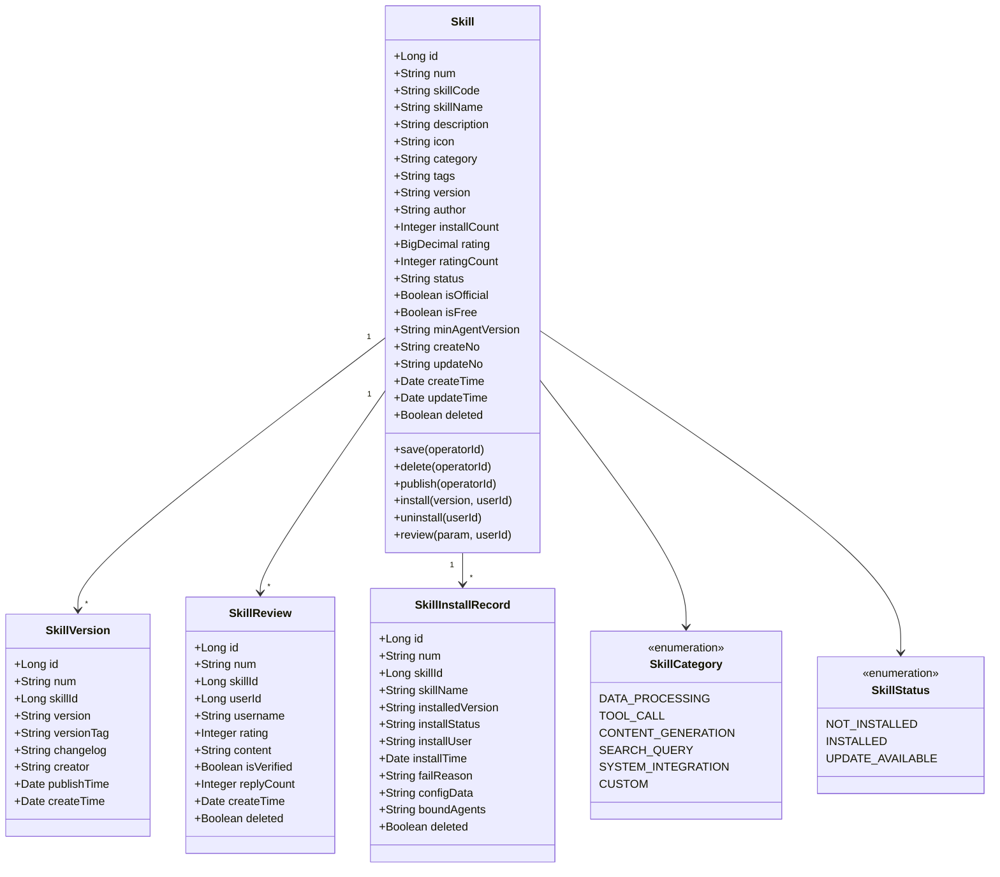
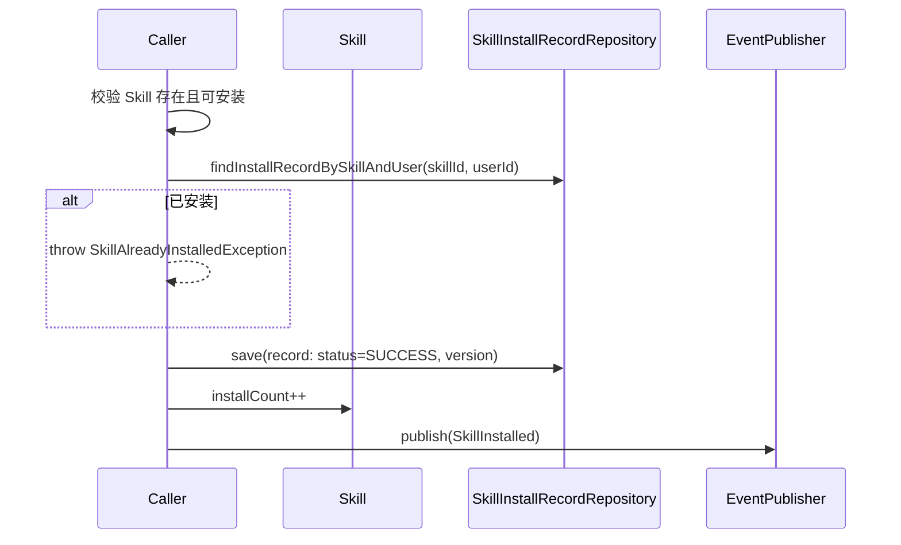
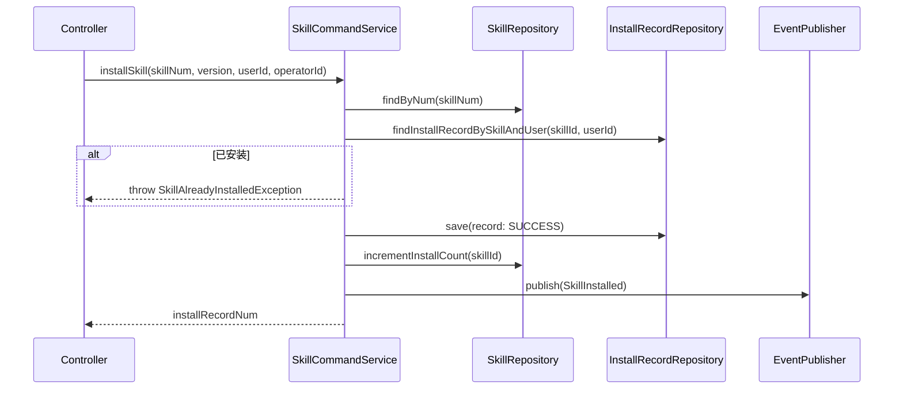
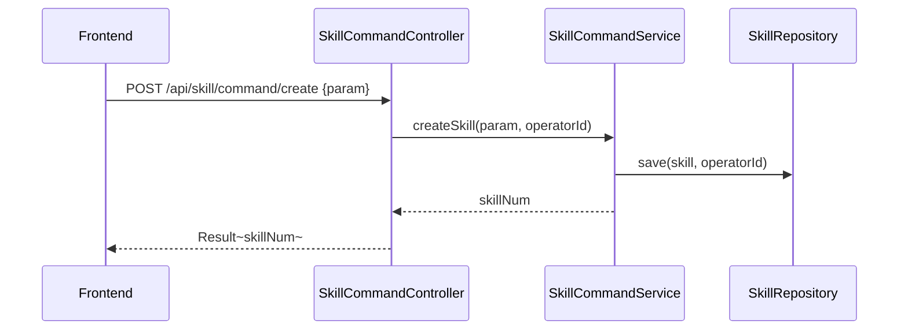

# Skill 商店 - 技术方案

> **文档版本**：V1.0  
> **创建日期**：2026-04-29  
> **关联 PRD**：4.1.5 Skill 商店  
> **关联蓝图**：总体技术架构蓝图 V2.4，§3.6/§6.3.15(部分)/§6.3.19/§6.3.20  
> **对应分支**：`feature-20260515-skill-mcp`

---

## 1. 目标与范围

### 1.1 目标

提供 Skill 商店管理能力，包括：
- Skill 市场浏览（分类、标签、搜索）
- Skill 详情查看
- Skill 安装/更新/卸载
- Skill 版本管理（版本历史、发布）
- Skill 评价系统（评分、评论）
- Skill 安装记录追踪

### 1.2 范围

| 范围内 | 范围外 |
|-------|--------|
| Skill 元数据管理 | 第三方 Skill 市场集成（Phase 3） |
| Skill 安装/卸载/版本管理 | Skill 安全验证与自动测试 |
| Skill 评价（评分、评论） | Skill 推荐算法 |
| Skill 安装记录追踪 | Skill 与 Agent 绑定的配置管理（在 Agent 域中） |

---

## 2. 架构设计（代码结构）

| 层 | 领域 | 包 | 职责 |
|---|------|---|------|
| facade | skill | `com.gagentmanager.facade.skill` | Skill 领域事件 DTO、事件常量 |
| client | skill | `com.gagentmanager.client.skill` | CreateSkillParam、SkillVO、SkillVersionVO、SkillReviewParam、SkillReviewVO、InstallRecordVO |
| client | common | `com.gagentmanager.client.common` | PageParam、PageResult |
| domain | skill | `com.gagentmanager.domain.skill` | Skill 聚合根、SkillVersion/SkillReview/SkillInstallRecord 实体、Repository/Gateway 接口 |
| infra | skill | `com.gagentmanager.infra.skill` | Skill/Review/InstallRecord Entity、Mapper、Repository 实现 |
| application | skill | `com.gagentmanager.application.skill` | SkillCommandService、SkillQueryService |
| adapter | skill | `com.gagentmanager.adapter.skill` | SkillCommandController、SkillQueryController |

---

## 3. 领域模型设计

### 3.1 业务层级划分

| 层级 | 业务领域 | 说明 |
|-----|---------|------|
| 支撑域 | skill | Skill 商店生态（发现/安装/评价/版本） |

### 3.2 Skill 管理（skill）

#### 3.2.1 领域模型



| 对象 | 类型 | 属性 | 说明 |
|-----|------|------|------|
| Skill | 聚合根 | id, num, skillCode, skillName, description, icon, category, tags, version, author, installCount, rating, ratingCount, status, isOfficial, isFree, minAgentVersion | Skill 元数据 |
| SkillVersion | 实体 | id, num, skillId, version, versionTag, changelog, creator, publishTime, createTime | Skill 版本记录 |
| SkillReview | 实体 | id, num, skillId, userId, username, rating, content, isVerified, replyCount, createTime, deleted | Skill 评价 |
| SkillInstallRecord | 实体 | id, num, skillId, skillName, installedVersion, installStatus, installUser, installTime, failReason, configData, boundAgents, deleted | Skill 安装记录 |

**Repository 接口**：

| 方法 | 说明 |
|-----|------|
| `findByNum(num)` | 按编号查找 Skill |
| `list(param): PageResult~Skill~` | 分页查询 Skill |
| `save(skill, operatorId)` | 保存 Skill |
| `delete(num, operatorId)` | 逻辑删除 |
|  |  |
| `findVersionsBySkillId(skillId): List~SkillVersion~` | 查版本列表 |
| `saveVersion(version, operatorId)` | 保存版本 |
|  |  |
| `findReviewsBySkillId(skillId, param): PageResult~SkillReview~` | 查评价列表 |
| `saveReview(review)` | 保存评价 |
|  |  |
| `findInstallRecordsBySkillId(skillId): List~SkillInstallRecord~` | 查安装记录 |
| `findInstallRecordBySkillAndUser(skillId, userId): SkillInstallRecord` | 查用户安装记录 |
| `saveInstallRecord(record)` | 保存安装记录 |

#### 3.2.2 领域规则

| 聚合/对象 | 规则类型 | 规则描述 | 违反时表达 |
|----------|---------|---------|-----------|
| Skill | 不变性 | skillCode 全局唯一 | SkillCodeAlreadyExistsException |
| Skill | 业务规则 | 有 Agent 绑定的 Skill 不可删除 | SkillHasBindingsException |
| Skill | 业务规则 | 安装成功后 installCount+1 | - |
| SkillReview | 业务规则 | 仅已安装用户可评论（isVerified=true 区分） | UserNotInstalledException |
| SkillReview | 不变性 | 每个用户对同一 Skill 只能评价一次 | ReviewAlreadyExistsException |
| SkillReview | 业务规则 | rating 范围 1-5 | InvalidRatingException |

#### 3.2.3 领域动作

| 聚合/实体 | 领域动作 | 职责 | 前置条件 | 后置条件/规则 | 领域事件 |
|----------|---------|------|---------|-------------|---------|
| Skill | `save(operatorId)` | 创建/更新 Skill | skillCode 唯一 | 保存 Skill 记录 | SkillCreated / SkillUpdated |
| Skill | `delete(operatorId)` | 删除 Skill | 无 Agent 绑定 | 标记 deleted=1 | SkillDeleted |
| Skill | `publish(operatorId)` | 发布新版本 | Skill 存在 | 生成新版本记录 | SkillPublished |
| Skill | `install(version, userId, operatorId)` | 安装 Skill | Skill 存在且未安装 | 写入安装记录，installCount+1 | SkillInstalled |
| Skill | `uninstall(userId, operatorId)` | 卸载 Skill | 已安装 | 更新安装记录状态 | SkillUninstalled |
| SkillReview | `review(param, userId)` | 评价 Skill | 已安装用户 | 写入评价，更新 rating/ratingCount | SkillReviewed |

**install 时序图**：



#### 3.2.4 领域事件

| 事件名 | 触发时机 | 载荷要点 | 可订阅方/用途 |
|-------|---------|---------|-------------|
| SkillCreated | 创建 Skill 成功 | skillNum, skillName, category, operatorId | 审计日志 |
| SkillPublished | 发布 Skill 版本 | skillNum, version, operatorId | 审计日志 |
| SkillInstalled | 安装 Skill 成功 | skillNum, version, installUser | 审计日志 |
| SkillUninstalled | 卸载 Skill | skillNum, installUser, operatorId | 审计日志 |
| SkillReviewed | 评价 Skill | skillNum, userId, rating, content | 审计日志 |

---

## 4. 应用层设计

### 4.1 业务模块划分

| 应用模块 | 对应领域 | Service 类型 | 说明 |
|---------|---------|-------------|------|
| skill | Skill 管理 | CommandService | Skill 安装/更新/卸载/发布/评价 |
| skill | Skill 管理 | QueryService | Skill 列表/详情/版本/评价查询 |

### 4.2 Skill 管理（skill）

#### 4.2.1 Service 方法清单

| Service | 方法签名 | 职责 | 入参 | 出参 |
|---------|---------|------|------|------|
| SkillCommandService | `createSkill(param: CreateSkillParam, operatorId: Long): String` | 创建 Skill | skillName, description, category, tags | skillNum |
| SkillCommandService | `updateSkill(param: UpdateSkillParam, operatorId: Long): Void` | 更新 Skill | num, skillName, description, category, tags | - |
| SkillCommandService | `deleteSkill(num: String, operatorId: Long): Void` | 删除 Skill | num | - |
| SkillCommandService | `publishSkill(num: String, changelog: String, operatorId: Long): Void` | 发布新版本 | num, changelog | - |
| SkillCommandService | `installSkill(skillNum: String, version: String, userId: Long, operatorId: Long): String` | 安装 Skill | skillNum, version, userId | installRecordNum |
| SkillCommandService | `uninstallSkill(installRecordNum: String, operatorId: Long): Void` | 卸载 Skill | installRecordNum | - |
| SkillCommandService | `reviewSkill(param: SkillReviewParam, userId: Long): Void` | 评价 Skill | skillNum, rating, content | - |
| SkillQueryService | `querySkillList(param: SkillQueryParam): PageResult~SkillVO~` | Skill 列表 | pageNo, pageSize, keyword, category, tags | PageResult~SkillVO~ |
| SkillQueryService | `querySkillByNum(num: String): SkillVO` | Skill 详情 | num | SkillVO |
| SkillQueryService | `querySkillVersions(skillNum: String): List~SkillVersionVO~` | 版本列表 | skillNum | List~SkillVersionVO~ |
| SkillQueryService | `querySkillReviews(skillNum: String, param: ReviewQueryParam): PageResult~SkillReviewVO~` | 评价列表 | skillNum, pageNo, pageSize | PageResult~SkillReviewVO~ |
| SkillQueryService | `queryInstallRecords(skillNum: String): List~InstallRecordVO~` | 安装记录 | skillNum | List~InstallRecordVO~ |

#### 4.2.2 方法时序逻辑

**installSkill 时序图**：



---

## 5. 控制器/Adapter 层设计

### 5.1 业务模块划分

| Controller | 对应应用模块 | URL 前缀 |
|-----------|-------------|---------|
| SkillCommandController | skill | `/api/skill/command` |
| SkillQueryController | skill | `/api/skill/query` |

### 5.2 Skill 管理（skill）

#### 5.2.1 Controller 接口清单

| 接口 | 方法 | 路径 | 入参 | 返回值 JSON | 职责 |
|-----|------|------|------|-----------|------|
| Skill 列表 | GET | `/api/skill/query/list` | pageNo, pageSize, keyword, category, tags | `{"code": 200, "data": {"records": [{"num": "SKILL-001", "skillName": "代码助手", "category": "工具调用", "installCount": 150, "rating": 4.5}]}}` | 分页查询 |
| Skill 详情 | GET | `/api/skill/query/detail` | num | `{"code": 200, "data": {"num": "SKILL-001", "skillName": "代码助手", "description": "...", "installCount": 150}}` | 详情 |
| 创建 Skill | POST | `/api/skill/command/create` | `{"skillName": "代码助手", "description": "...", "category": "工具调用"}` | `{"code": 200, "data": "SKILL-001"}` | 创建 |
| 更新 Skill | POST | `/api/skill/command/update` | `{"num": "SKILL-001", "skillName": "..."}` | `{"code": 200, "data": null}` | 更新 |
| 删除 Skill | POST | `/api/skill/command/delete` | `{"num": "SKILL-001"}` | `{"code": 200, "data": null}` | 删除 |
| 发布版本 | POST | `/api/skill/command/publish` | `{"num": "SKILL-001", "changelog": "..."}` | `{"code": 200, "data": null}` | 发布 |
| 安装 Skill | POST | `/api/skill/command/install` | `{"skillNum": "SKILL-001", "version": "V1.0.0"}` | `{"code": 200, "data": "INSTALL-001"}` | 安装 |
| 卸载 Skill | POST | `/api/skill/command/uninstall` | `{"installRecordNum": "INSTALL-001"}` | `{"code": 200, "data": null}` | 卸载 |
| 评价 Skill | POST | `/api/skill/command/review` | `{"skillNum": "SKILL-001", "rating": 5, "content": "..."}` | `{"code": 200, "data": null}` | 评价 |
| 版本列表 | GET | `/api/skill/query/versions` | skillNum | `{"code": 200, "data": [{"num": "VER-001", "version": "V1.0.0"}]}` | 版本列表 |
| 评价列表 | GET | `/api/skill/query/reviews` | skillNum, pageNo, pageSize | `{"code": 200, "data": {"records": [{"username": "user1", "rating": 5, "content": "..."}]}}` | 评价列表 |

#### 5.2.2 接口时序逻辑

**创建 Skill 时序图**：



---

## 6. 数据库设计

### 6.1 表结构

| 表 | 对应领域 | 说明 |
|---|---------|------|
| `skill` | skill / Skill | Skill 元数据 |
| `skill_version` | skill / SkillVersion | Skill 版本记录 |
| `skill_review` | skill / SkillReview | Skill 评价（蓝图 §6.3.19） |
| `skill_install_record` | skill / SkillInstallRecord | Skill 安装记录（蓝图 §6.3.20） |

### 6.2 补充 DDL

`skill_review` 和 `skill_install_record` 已在蓝图定义。`skill` 和 `skill_version` 需要补充：

```sql
CREATE TABLE `skill` (
    `id`                BIGINT          NOT NULL AUTO_INCREMENT COMMENT '主键',
    `num`               VARCHAR(64)     NOT NULL                COMMENT 'Skill编号',
    `skill_code`        VARCHAR(64)     NOT NULL                COMMENT 'Skill编码',
    `skill_name`        VARCHAR(50)     NOT NULL                COMMENT 'Skill名称',
    `description`       TEXT            NOT NULL                COMMENT '功能描述',
    `icon`              VARCHAR(256)    DEFAULT NULL            COMMENT 'Skill图标URL',
    `category`          VARCHAR(32)     NOT NULL                COMMENT '分类',
    `tags`              JSON            DEFAULT NULL            COMMENT '标签列表',
    `version`           VARCHAR(16)     NOT NULL                COMMENT '当前版本号',
    `author`            VARCHAR(64)     NOT NULL                COMMENT '开发者/作者',
    `install_count`     INT             NOT NULL DEFAULT 0      COMMENT '安装次数',
    `rating`            DECIMAL(2,1)    NOT NULL DEFAULT 0.0    COMMENT '平均评分',
    `rating_count`      INT             NOT NULL DEFAULT 0      COMMENT '评分人数',
    `status`            VARCHAR(16)     NOT NULL DEFAULT 'NOT_INSTALLED' COMMENT '状态',
    `is_official`       TINYINT(1)      NOT NULL DEFAULT 0      COMMENT '是否官方Skill',
    `is_free`           TINYINT(1)      NOT NULL DEFAULT 1      COMMENT '是否免费',
    `min_agent_version` VARCHAR(16)     DEFAULT NULL            COMMENT '最低兼容Agent版本',
    `create_no`         VARCHAR(64)     DEFAULT NULL            COMMENT '创建人',
    `update_no`         VARCHAR(64)     DEFAULT NULL            COMMENT '更新人',
    `create_time`       DATETIME(3)     NOT NULL DEFAULT CURRENT_TIMESTAMP(3) COMMENT '创建时间',
    `update_time`       DATETIME(3)     NOT NULL DEFAULT CURRENT_TIMESTAMP(3) ON UPDATE CURRENT_TIMESTAMP(3) COMMENT '更新时间',
    `deleted`           TINYINT(1)      NOT NULL DEFAULT 0      COMMENT '逻辑删除',
    PRIMARY KEY (`id`),
    UNIQUE KEY `uk_num` (`num`, `deleted`),
    UNIQUE KEY `uk_skill_code` (`skill_code`, `deleted`),
    KEY `idx_category` (`category`),
    KEY `idx_status` (`status`)
) ENGINE=InnoDB DEFAULT CHARSET=utf8mb4 COLLATE=utf8mb4_unicode_ci COMMENT='Skill元数据表';

CREATE TABLE `skill_version` (
    `id`                BIGINT          NOT NULL AUTO_INCREMENT COMMENT '主键',
    `num`               VARCHAR(64)     NOT NULL                COMMENT '版本编号',
    `skill_id`          BIGINT          NOT NULL                COMMENT '所属Skill ID',
    `version`           VARCHAR(16)     NOT NULL                COMMENT '版本号',
    `version_tag`       VARCHAR(16)     NOT NULL DEFAULT 'DRAFT' COMMENT '版本标签：DRAFT/PUBLISHED/DEPRECATED',
    `changelog`         VARCHAR(1000)   DEFAULT NULL            COMMENT '版本变更说明',
    `creator`           VARCHAR(64)     NOT NULL                COMMENT '创建人',
    `publish_time`      DATETIME(3)     DEFAULT NULL            COMMENT '发布时间',
    `create_time`       DATETIME(3)     NOT NULL DEFAULT CURRENT_TIMESTAMP(3) COMMENT '版本创建时间',
    `deleted`           TINYINT(1)      NOT NULL DEFAULT 0      COMMENT '逻辑删除',
    PRIMARY KEY (`id`),
    UNIQUE KEY `uk_num` (`num`, `deleted`),
    KEY `idx_skill_id` (`skill_id`),
    KEY `idx_version` (`skill_id`, `version`)
) ENGINE=InnoDB DEFAULT CHARSET=utf8mb4 COLLATE=utf8mb4_unicode_ci COMMENT='Skill版本记录表';
```

---

## 7. 模块变更清单

| 层级 | 变更项 | 对应 Skill |
|------|--------|------------|
| facade | Skill 领域事件 DTO | impl-facade-module |
| client | CreateSkillParam、SkillVO、SkillVersionVO、SkillReviewParam、SkillReviewVO、InstallRecordVO | impl-client-module |
| domain | Skill/SkillVersion/SkillReview/SkillInstallRecord 聚合与实体、Repository 接口 | impl-domain-module |
| infra | 4 张表 Entity/Mapper、Repository 实现 | impl-infra-module |
| application | SkillCommandService、SkillQueryService | impl-application-module |
| adapter | SkillCommandController、SkillQueryController | impl-adapter-module |

---

## 8. 代码分支命名

**分支名**：`feature-20260515-skill-mcp`

---

## 9. 实现顺序

```
facade → client → domain → infra(4 张表) → application → adapter
```

---

## 10. 接口与数据契约

### 10.1 前端 API 对接约定

前端 `api/skill.ts` 已定义接口，需适配路径：

| 前端方法 | 前端路径 | 后端路径 | 说明 |
|---------|---------|---------|------|
| `getSkills(params)` | GET `/skills` | GET `/api/skill/query/list` | 需适配 |
| `getSkill(id)` | GET `/skills/:id` | GET `/api/skill/query/detail?num=xxx` | 需适配 |
| `createSkill(data)` | POST `/skills` | POST `/api/skill/command/create` | 需适配 |
| `updateSkill(id, data)` | PUT `/skills/:id` | POST `/api/skill/command/update` | 需适配 |
| `deleteSkill(id)` | DELETE `/skills/:id` | POST `/api/skill/command/delete` | 需适配 |
| `publishSkill(id)` | POST `/skills/:id/publish` | POST `/api/skill/command/publish` | 需适配 |
| `getSkillVersions(id)` | GET `/skills/:id/versions` | GET `/api/skill/query/versions?skillNum=xxx` | 需适配 |
| `installSkill(id, version)` | POST `/skills/:id/install` | POST `/api/skill/command/install` | 需适配 |
| `uninstallSkill(id)` | POST `/skills/:id/uninstall` | POST `/api/skill/command/uninstall` | 需适配 |

### 10.2 错误码（1301 ~ 1399）

| 错误码 | 说明 |
|-------|------|
| 1301 | Skill 编码已存在 |
| 1302 | Skill 已安装 |
| 1303 | Skill 未安装 |
| 1304 | Skill 有 Agent 绑定，不可删除 |
| 1305 | 评分超出 1-5 范围 |
| 1306 | 已存在评价 |
