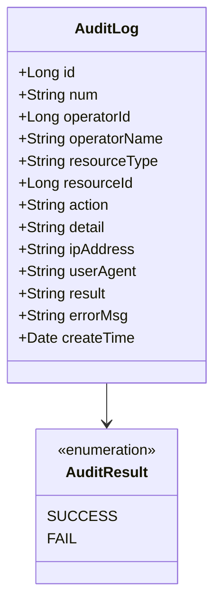
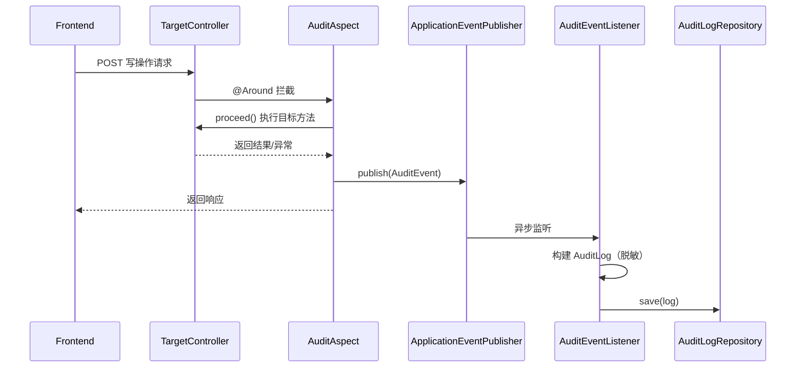
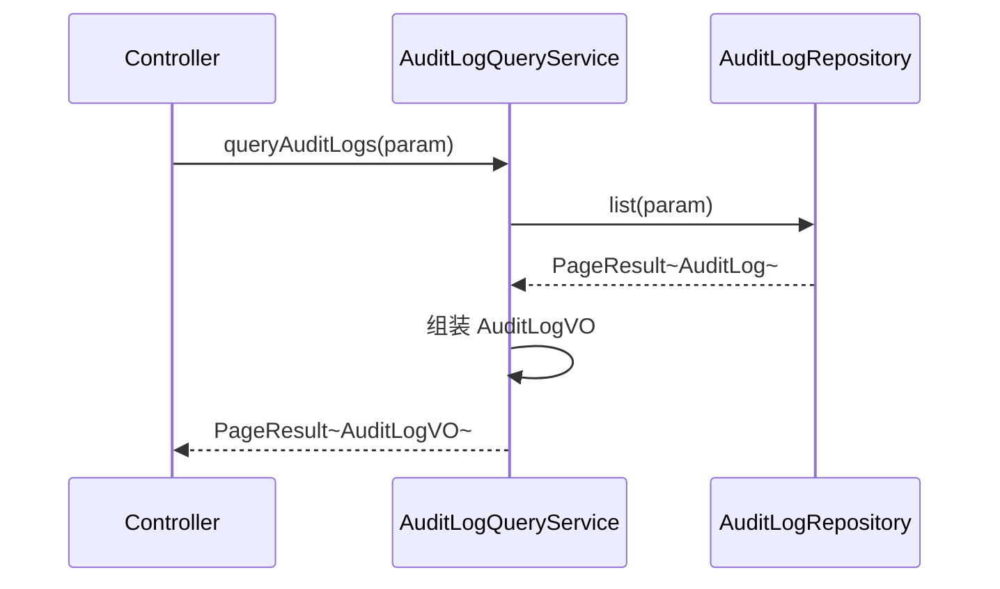
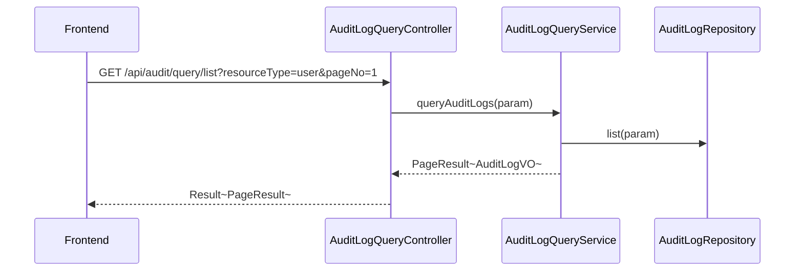

# 审计日志 - 技术方案

> **文档版本**：V1.0  
> **创建日期**：2026-04-29  
> **关联 PRD**：4.1.2 用户行为审计 / 4.1.4 权限变更审计  
> **关联蓝图**：总体技术架构蓝图 V2.4，§3.11/§6.3.7/§7.4  
> **对应分支**：`feature-20260428-init-foundation`

---

## 1. 目标与范围

### 1.1 目标

提供全局操作审计日志能力，包括：
- 自动拦截所有写操作 Controller，记录操作审计
- 审计日志查询（分页、按资源类型/操作人/时间范围筛选）
- 异步写入，不影响主流程性能
- 敏感字段脱敏（密码、Token）

### 1.2 范围

| 范围内 | 范围外 |
|-------|--------|
| AOP 切面拦截写操作 | 审计日志的删除/修改（审计日志不可变） |
| Application Event 驱动异步写入 | ELK 日志系统对接（运维层面） |
| 审计日志分页查询 | 审计日志导出 |

---

## 2. 架构设计（代码结构）

| 层 | 领域 | 包 | 职责 |
|---|------|---|------|
| facade | audit | `com.gagentmanager.facade.audit` | 审计领域事件 DTO |
| client | audit | `com.gagentmanager.client.audit` | AuditLogVO、AuditLogQueryParam |
| client | common | `com.gagentmanager.client.common` | PageParam、PageResult |
| domain | audit | `com.gagentmanager.domain.audit` | AuditLog 实体、AuditLogRepository 接口 |
| infra | audit | `com.gagentmanager.infra.audit` | AuditLog Entity、Mapper、Repository 实现 |
| application | audit | `com.gagentmanager.application.audit` | AuditLogQueryService |
| application | common | `com.gagentmanager.application.common` | AuditAspect（AOP 切面）、AuditEvent/AuditEventListener |
| adapter | audit | `com.gagentmanager.adapter.audit` | AuditLogQueryController |
| adapter | common | `com.gagentmanager.adapter.common` | AuditAnnotation（自定义注解）、DesensitizationUtil |

---

## 3. 领域模型设计

### 3.1 业务层级划分

| 层级 | 业务领域 | 说明 |
|-----|---------|------|
| 通用域 | audit | 操作审计日志 |

### 3.2 审计日志（audit）

#### 3.2.1 领域模型



| 对象 | 类型 | 属性 | 说明 |
|-----|------|------|------|
| AuditLog | 实体 | id, num, operatorId, operatorName, resourceType, resourceId, action, detail, ipAddress, userAgent, result, errorMsg, createTime | 操作审计记录 |

**Repository 接口**：

| 方法 | 说明 |
|-----|------|
| `list(param: AuditLogQueryParam): PageResult~AuditLog~` | 分页查询审计日志 |
| `save(log)` | 保存审计记录 |

#### 3.2.2 领域规则

| 聚合/对象 | 规则类型 | 规则描述 | 违反时表达 |
|----------|---------|---------|-----------|
| AuditLog | 不变性 | 审计日志创建后不可修改 | - |
| AuditLog | 不变性 | 审计日志不可删除 | - |
| AuditLog | 业务规则 | 敏感字段（密码、Token）在写入前须脱敏 | - |

#### 3.2.3 领域动作

| 聚合/实体 | 领域动作 | 职责 | 前置条件 | 后置条件/规则 | 领域事件 |
|----------|---------|------|---------|-------------|---------|
| AuditLog | `save()` | 记录审计日志 | 操作人、资源类型、操作类型非空 | 写入 audit_log 表 | - |

**审计记录时序图**：



#### 3.2.4 领域事件

| 事件名 | 触发时机 | 载荷要点 | 可订阅方/用途 |
|-------|---------|---------|-------------|
| AuditEvent | AOP 拦截到写操作完成 | operatorId, resourceType, resourceId, action, detail, result | AuditEventListener 异步写入 |

---

## 4. 应用层设计

### 4.1 业务模块划分

| 应用模块 | 对应领域 | Service 类型 | 说明 |
|---------|---------|-------------|------|
| audit | 审计日志 | QueryService | 审计日志分页查询 |
| common | 审计切面 | - | AOP 拦截 + 事件发布 |

### 4.2 审计日志（audit）

#### 4.2.1 Service 方法清单

| Service | 方法签名 | 职责 | 入参 | 出参 |
|---------|---------|------|------|------|
| AuditLogQueryService | `queryAuditLogs(param: AuditLogQueryParam): PageResult~AuditLogVO~` | 分页查询审计日志 | pageNo, pageSize, operatorId, resourceType, action, startTime, endTime | PageResult~AuditLogVO~ |

#### 4.2.2 方法时序逻辑

**queryAuditLogs 时序图**：



---

## 5. 控制器/Adapter 层设计

### 5.1 业务模块划分

| Controller | 对应应用模块 | URL 前缀 |
|-----------|-------------|---------|
| AuditLogQueryController | audit | `/api/audit/query` |

### 5.2 审计日志（audit）

#### 5.2.1 Controller 接口清单

| 接口 | 方法 | 路径 | 入参 | 返回值 JSON | 职责 |
|-----|------|------|------|-----------|------|
| 审计日志列表 | GET | `/api/audit/query/list` | pageNo, pageSize, operatorId, resourceType, action, startTime, endTime | `{"code": 200, "data": {"records": [{"num": "AUDIT-001", "operatorName": "admin", "resourceType": "user", "action": "create", "result": "SUCCESS", "createTime": "..."}]}}` | 分页查询 |

#### 5.2.2 接口时序逻辑

**审计日志查询时序图**：



---

## 6. 数据库设计

### 6.1 表结构

| 表 | 对应领域 | 说明 |
|---|---------|------|
| `audit_log` | audit / AuditLog | 操作审计日志（蓝图 §6.3.7） |

### 6.2 DDL

蓝图 §6.3.7 已定义，包含 operatorId, operatorName, resourceType, resourceId, action, detail(JSON), ipAddress, userAgent, result, errorMsg, createTime。

---

## 7. 模块变更清单

| 层级 | 变更项 | 对应 Skill |
|------|--------|------------|
| facade | AuditEventDTO | impl-facade-module |
| client | AuditLogVO、AuditLogQueryParam | impl-client-module |
| domain | AuditLog 实体、AuditLogRepository 接口 | impl-domain-module |
| infra | AuditLog Entity、Mapper、Repository 实现 | impl-infra-module |
| application | AuditLogQueryService、AuditAspect、AuditEvent/Listener | impl-application-module |
| adapter | AuditLogQueryController、@AuditLog 注解、DesensitizationUtil | impl-adapter-module |

---

## 8. 代码分支命名

**分支名**：`feature-20260428-init-foundation`

---

## 9. 实现顺序

```
facade → client → domain → infra → application(AuditAspect 优先于 QueryService) → adapter
```

---

## 10. 接口与数据契约

### 10.1 前端 API 对接约定

当前前端未单独定义审计日志 API 调用。管理端用户操作日志通过 `api/user.ts` 中的 `getUserOperationLogs` 查询（独立的用户管理审计）。全局审计日志 API 待前端需要时补充。

### 10.2 AOP 切面设计

```java
@Aspect
@Component
public class AuditAspect {
    @Around("@annotation(AuditLog) || @within(AuditLog)")
    public Object audit(ProceedingJoinPoint pjp) throws Throwable {
        long start = System.currentTimeMillis();
        try {
            Object result = pjp.proceed();
            publishAuditEvent(pjp, result, "SUCCESS", null);
            return result;
        } catch (Exception e) {
            publishAuditEvent(pjp, null, "FAIL", e.getMessage());
            throw e;
        }
    }
}
```

### 10.3 错误码

审计日志只读查询，不定义业务错误码。
