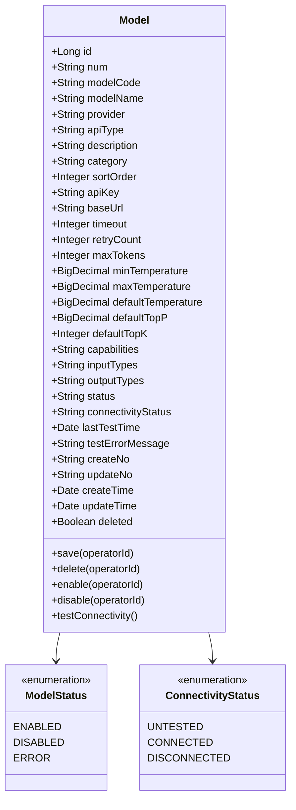
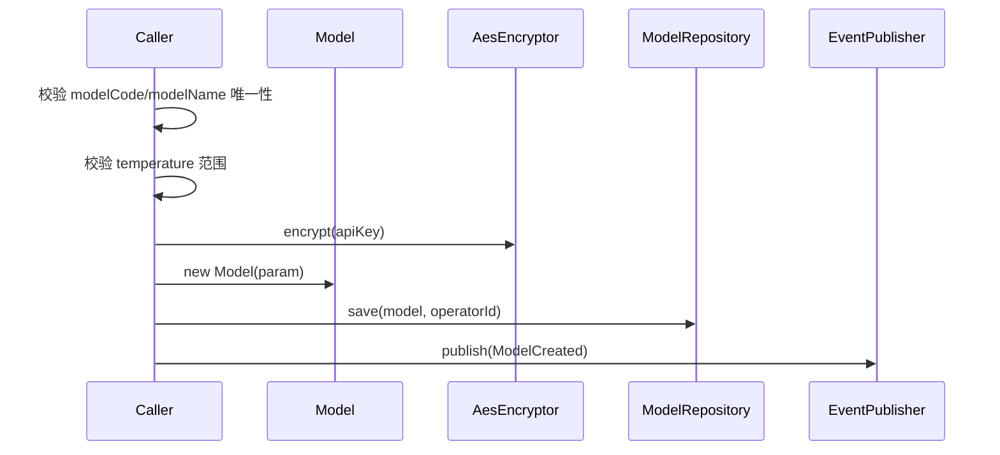
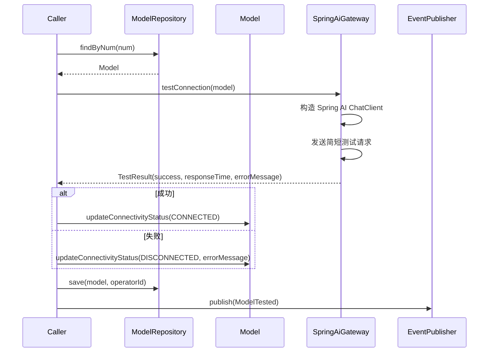
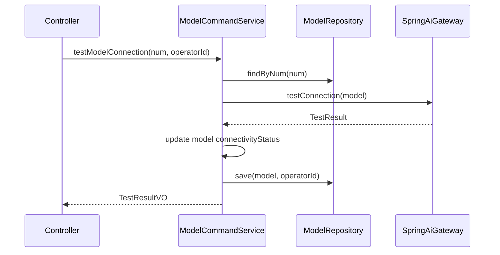
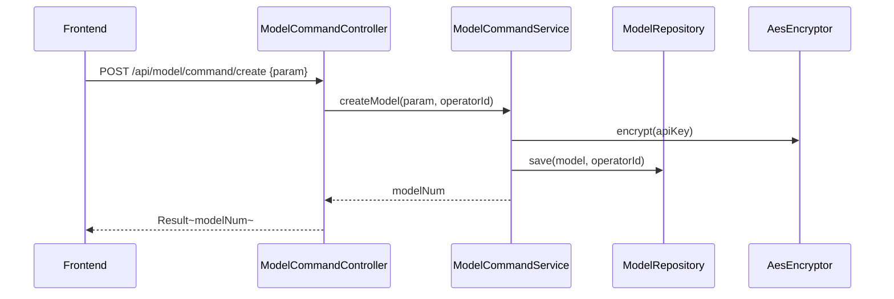

# 模型管理 - 技术方案

> **文档版本**：V1.0  
> **创建日期**：2026-04-29  
> **关联 PRD**：4.1.7 模型管理  
> **关联蓝图**：总体技术架构蓝图 V2.4，§3.2/§6.3.8  
> **对应分支**：`feature-20260501-agent-model`

---

## 1. 目标与范围

### 1.1 目标

提供 LLM 模型注册与管理能力，包括：
- 模型 CRUD（新增、查询、更新、删除）
- 模型启停控制
- 模型连通性测试
- 模型分类/分组管理
- 能力标签管理
- 模型列表筛选（按提供商、状态、能力标签）

### 1.2 范围

| 范围内 | 范围外 |
|-------|--------|
| 模型注册与配置管理 | 模型部署（本地模型） |
| 模型连通性测试（Spring AI 统一调用层） | 模型调用监控统计（Phase 3） |
| 模型启用/禁用 | 模型文件存储（MinIO/S3，Phase 3） |
| API Key 加密存储 | 模型推理调优 |

---

## 2. 架构设计（代码结构）

| 层 | 领域 | 包 | 职责 |
|---|------|---|------|
| facade | model | `com.gagentmanager.facade.model` | Model 领域事件 DTO、事件常量 |
| client | model | `com.gagentmanager.client.model` | CreateModelParam、UpdateModelParam、ModelVO、TestResultVO、ModelMonitoringVO |
| client | common | `com.gagentmanager.client.common` | PageParam、PageResult |
| domain | model | `com.gagentmanager.domain.model` | Model 聚合根、Repository/Gateway 接口 |
| infra | model | `com.gagentmanager.infra.model` | Model Entity、Mapper、Repository 实现、SpringAiGateway 实现 |
| application | model | `com.gagentmanager.application.model` | ModelCommandService、ModelQueryService |
| adapter | model | `com.gagentmanager.adapter.model` | ModelCommandController、ModelQueryController |

---

## 3. 领域模型设计

### 3.1 业务层级划分

| 层级 | 业务领域 | 说明 |
|-----|---------|------|
| 支撑域 | model | LLM 模型注册与 API 配置管理 |

### 3.2 模型管理（model）

#### 3.2.1 领域模型



| 对象 | 类型 | 属性 | 说明 |
|-----|------|------|------|
| Model | 聚合根 | id, num, modelCode, modelName, provider, apiType, description, category, sortOrder, apiKey, baseUrl, timeout, retryCount, maxTokens, minTemperature, maxTemperature, defaultTemperature, defaultTopP, defaultTopK, capabilities, inputTypes, outputTypes, status, connectivityStatus, lastTestTime, testErrorMessage | 模型配置 |

**Repository 接口**：

| 方法 | 说明 |
|-----|------|
| `findByNum(num)` | 按编号查找 |
| `findByCode(modelCode)` | 按编码查找 |
| `list(param): PageResult~Model~` | 分页查询 |
| `save(model, operatorId)` | 保存 |
| `delete(num, operatorId)` | 逻辑删除 |
| `findEnabledModels(): List~Model~` | 查询已启用的模型 |

**Gateway 接口**：

| 方法 | 说明 |
|-----|------|
| `testConnection(model: Model): TestResult` | 通过 Spring AI 测试模型连通性 |

#### 3.2.2 领域规则

| 聚合/对象 | 规则类型 | 规则描述 | 违反时表达 |
|----------|---------|---------|-----------|
| Model | 不变性 | modelCode 全局唯一（忽略 deleted） | ModelCodeAlreadyExistsException |
| Model | 不变性 | modelName 全局唯一（忽略 deleted） | ModelNameAlreadyExistsException |
| Model | 业务规则 | apiKey 必须使用 AES-256 加密存储 | - |
| Model | 业务规则 | 禁用后已绑定该模型的 Agent 应收到提示 | - |
| Model | 业务规则 | 删除前须检查是否有 Agent 绑定 | ModelHasBindingsException |
| Model | 业务规则 | temperature 范围须合法（min <= default <= max） | TemperatureRangeException |

#### 3.2.3 领域动作

| 聚合/实体 | 领域动作 | 职责 | 前置条件 | 后置条件/规则 | 领域事件 |
|----------|---------|------|---------|-------------|---------|
| Model | `save(operatorId)` | 创建/更新模型 | modelCode/modelName 唯一 | 加密存储 apiKey | ModelCreated / ModelUpdated |
| Model | `delete(operatorId)` | 逻辑删除模型 | 无 Agent 绑定 | 标记 deleted=1 | ModelDeleted |
| Model | `enable(operatorId)` | 启用模型 | 模型存在 | status=ENABLED | ModelEnabled |
| Model | `disable(operatorId)` | 禁用模型 | 模型存在 | status=DISABLED | ModelDisabled |
| Model | `testConnectivity()` | 连通性测试 | 模型已启用 | 更新 connectivityStatus + lastTestTime | ModelTested |

**createModel 时序图**：



**testConnectivity 时序图**：



#### 3.2.4 领域事件

| 事件名 | 触发时机 | 载荷要点 | 可订阅方/用途 |
|-------|---------|---------|-------------|
| ModelCreated | 创建模型成功 | modelNum, modelName, provider, operatorId | 审计日志 |
| ModelUpdated | 更新模型成功 | modelNum, changes, operatorId | 审计日志 |
| ModelDeleted | 删除模型 | modelNum, modelName, operatorId | 审计日志 |
| ModelEnabled | 启用模型 | modelNum, modelName, operatorId | 审计日志 |
| ModelDisabled | 禁用模型 | modelNum, modelName, operatorId | 审计日志 |
| ModelTested | 连通性测试完成 | modelNum, connectivityStatus, responseTime, operatorId | 审计日志 |

---

## 4. 应用层设计

### 4.1 业务模块划分

| 应用模块 | 对应领域 | Service 类型 | 说明 |
|---------|---------|-------------|------|
| model | 模型管理 | CommandService | 模型 CRUD、启停、连通性测试 |
| model | 模型管理 | QueryService | 模型列表/详情查询 |

### 4.2 模型管理（model）

#### 4.2.1 Service 方法清单

| Service | 方法签名 | 职责 | 入参 | 出参 |
|---------|---------|------|------|------|
| ModelCommandService | `createModel(param: CreateModelParam, operatorId: Long): Long` | 创建模型 | modelName, provider, apiType, baseUrl, apiKey, timeout, maxRetries, maxTokens, capabilities, inputTypes, outputTypes, description, category, isEnabled, sortOrder | modelNum |
| ModelCommandService | `updateModel(param: UpdateModelParam, operatorId: Long): Void` | 更新模型 | num, 同上（apiKey 留空表示不修改） | - |
| ModelCommandService | `deleteModel(num: String, operatorId: Long): Void` | 删除模型 | num | - |
| ModelCommandService | `enableModel(num: String, operatorId: Long): Void` | 启用模型 | num | - |
| ModelCommandService | `disableModel(num: String, operatorId: Long): Void` | 禁用模型 | num | - |
| ModelCommandService | `testModelConnection(num: String, operatorId: Long): TestResultVO` | 连通性测试 | num | TestResultVO |
| ModelQueryService | `queryModelList(param: ModelQueryParam): PageResult~ModelVO~` | 分页查询模型列表 | pageNo, pageSize, keyword, provider, status, capabilities | PageResult~ModelVO~ |
| ModelQueryService | `queryModelByNum(num: String): ModelVO` | 按编号查详情 | num | ModelVO |

#### 4.2.2 方法时序逻辑

**testModelConnection 时序图**：



---

## 5. 控制器/Adapter 层设计

### 5.1 业务模块划分

| Controller | 对应应用模块 | URL 前缀 |
|-----------|-------------|---------|
| ModelCommandController | model | `/api/model/command` |
| ModelQueryController | model | `/api/model/query` |

### 5.2 模型管理（model）

#### 5.2.1 Controller 接口清单

| 接口 | 方法 | 路径 | 入参 JSON | 返回值 JSON | 职责 |
|-----|------|------|----------|-----------|------|
| 模型列表 | GET | `/api/model/query/list` | pageNo, pageSize, keyword, provider, status | `{"code": 200, "data": {"records": [{"num": "MODEL-001", "modelName": "gpt-4o", "provider": "OpenAI", "status": "ENABLED", "capabilities": ["对话", "函数调用"]}]}}` | 分页查询 |
| 模型详情 | GET | `/api/model/query/detail` | num | `{"code": 200, "data": {"num": "MODEL-001", "modelName": "gpt-4o", "provider": "OpenAI", "baseUrl": "https://api.openai.com", "status": "ENABLED"}}` | 详情查询 |
| 创建模型 | POST | `/api/model/command/create` | `{"modelName": "gpt-4o", "provider": "OpenAI", "apiType": "OpenAI兼容", "baseUrl": "...", "apiKey": "...", "capabilities": ["对话"]}` | `{"code": 200, "data": "MODEL-001"}` | 创建模型 |
| 更新模型 | POST | `/api/model/command/update` | `{"num": "MODEL-001", "modelName": "gpt-4o-mini", ...}` | `{"code": 200, "data": null}` | 更新模型 |
| 删除模型 | POST | `/api/model/command/delete` | `{"num": "MODEL-001"}` | `{"code": 200, "data": null}` | 删除模型 |
| 启用模型 | POST | `/api/model/command/enable` | `{"num": "MODEL-001"}` | `{"code": 200, "data": null}` | 启用模型 |
| 禁用模型 | POST | `/api/model/command/disable` | `{"num": "MODEL-001"}` | `{"code": 200, "data": null}` | 禁用模型 |
| 连通性测试 | POST | `/api/model/command/test` | `{"num": "MODEL-001"}` | `{"code": 200, "data": {"success": true, "responseTime": 1200}}` | 连通性测试 |

#### 5.2.2 接口时序逻辑

**创建模型时序图**：



---

## 6. 数据库设计

### 6.1 表结构

| 表 | 对应领域 | 说明 |
|---|---------|------|
| `model` | model / Model | LLM 模型配置（蓝图 §6.3.8） |

### 6.2 DDL

蓝图 §6.3.8 已定义全部字段，包含 modelCode, modelName, provider, apiType, baseUrl, apiKey(加密), timeout, retryCount, maxTokens, temperature 范围, capabilities(JSON), inputTypes(JSON), outputTypes(JSON), status, connectivityStatus。

---

## 7. 模块变更清单

| 层级 | 变更项 | 对应 Skill |
|------|--------|------------|
| facade | Model 领域事件 DTO | impl-facade-module |
| client | CreateModelParam、UpdateModelParam、ModelVO、TestResultVO | impl-client-module |
| domain | Model 聚合根、ModelRepository 接口、ModelGateway 接口 | impl-domain-module |
| infra | Model Entity、Mapper、RepositoryImpl、SpringAiGatewayImpl、AesEncryptor | impl-infra-module |
| application | ModelCommandService、ModelQueryService | impl-application-module |
| adapter | ModelCommandController、ModelQueryController | impl-adapter-module |

---

## 8. 代码分支命名

**分支名**：`feature-20260501-agent-model`

---

## 9. 实现顺序

```
facade → client → domain(Model + Gateway) → infra(SpringAiGateway + AesEncryptor) → application → adapter
```

---

## 10. 接口与数据契约

### 10.1 前端 API 对接约定

前端 `api/model.ts` 已定义接口，需适配路径：

| 前端方法 | 前端路径 | 后端路径 | 说明 |
|---------|---------|---------|------|
| `getModels(params)` | GET `/models` | GET `/api/model/query/list` | 需适配 |
| `getModel(id)` | GET `/models/:id` | GET `/api/model/query/detail?num=xxx` | 需适配 |
| `createModel(data)` | POST `/models` | POST `/api/model/command/create` | 需适配 |
| `updateModel(id, data)` | PUT `/models/:id` | POST `/api/model/command/update` | 需适配 |
| `deleteModel(id)` | DELETE `/models/:id` | POST `/api/model/command/delete` | 需适配 |
| `enableModel(id)` | POST `/models/:id/enable` | POST `/api/model/command/enable` | 需适配 |
| `disableModel(id)` | POST `/models/:id/disable` | POST `/api/model/command/disable` | 需适配 |
| `testModelConnection(id)` | POST `/models/:id/test` | POST `/api/model/command/test` | 需适配 |

### 10.2 错误码（1201 ~ 1299）

| 错误码 | 说明 |
|-------|------|
| 1201 | 模型编码已存在 |
| 1202 | 模型名称已存在 |
| 1203 | 模型已被禁用 |
| 1204 | 模型有关联 Agent，不可删除 |
| 1205 | 温度范围配置不合法 |
| 1206 | 连通性测试失败 |
| 1207 | API Key 加密失败 |
