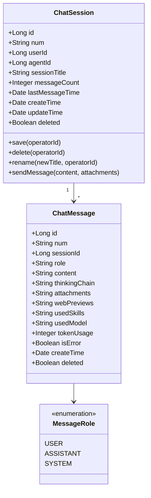
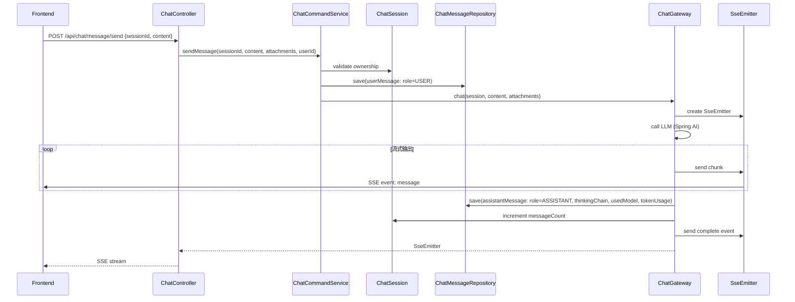
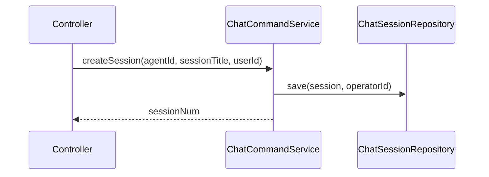
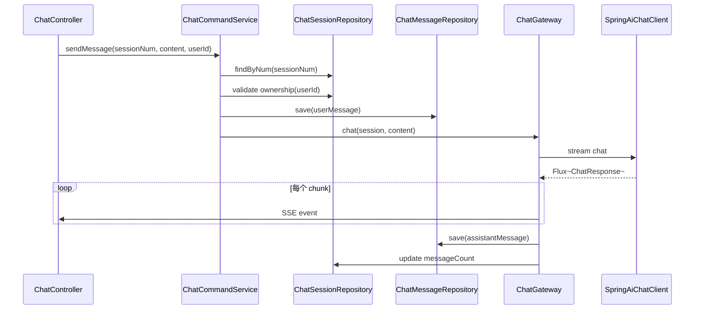
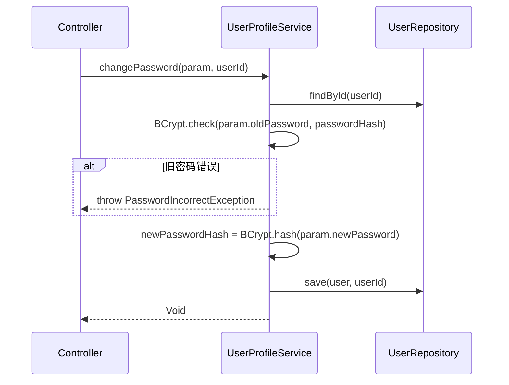
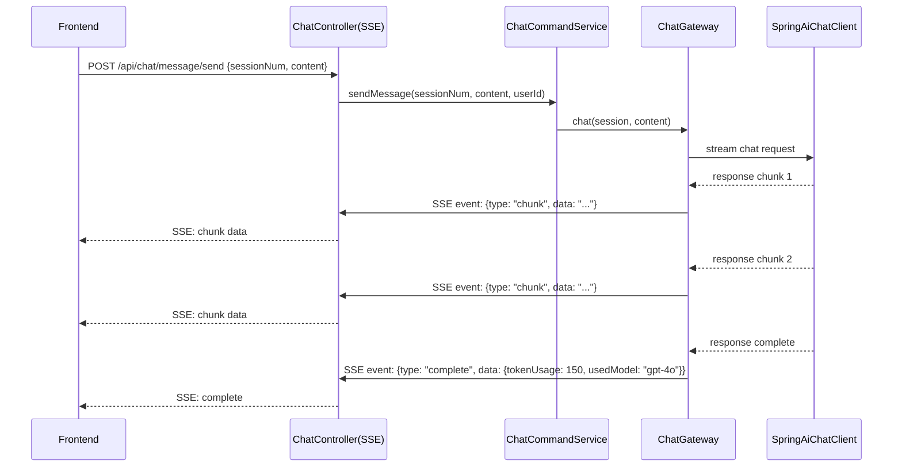
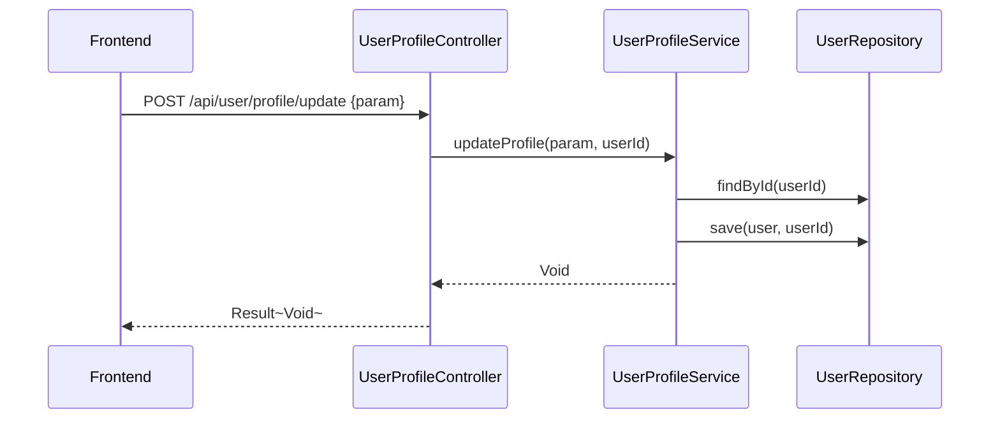

# 用户端对话与会话管理 - 技术方案

> **文档版本**：V1.0  
> **创建日期**：2026-04-29  
> **关联 PRD**：4.2.2 用户端界面（Agent对话/个人中心）  
> **关联蓝图**：总体技术架构蓝图 V2.4，§3.4/§6.3.13/§6.3.14  
> **对应分支**：`feature-20260501-agent-model`

---

## 1. 目标与范围

### 1.1 目标

提供用户端 Agent 对话与会话管理能力，包括：
- 会话管理（创建、查询、删除、重命名）
- 消息发送与流式输出（SSE）
- 消息历史查询
- 附件上传
- 停止回复
- 用户个人中心（信息查看/修改、密码修改、MFA 开关、偏好设置、交互历史）

### 1.2 范围

| 范围内 | 范围外 |
|-------|--------|
| 会话 CRUD | Agent 运行时推理（调用 LLM） |
| 消息持久化与查询 | WebSocket 实时推送（Phase 3，当前使用 SSE） |
| SSE 流式输出 | 附件文件存储（使用简单文件服务） |
| 附件上传 | 前端对话 UI 实现 |
| 个人中心（信息/密码/MFA/偏好） | 邮件/短信通知基础设施 |

---

## 2. 架构设计（代码结构）

| 层 | 领域 | 包 | 职责 |
|---|------|---|------|
| facade | user | `com.gagentmanager.facade.user` | User 领域事件 DTO（复用） |
| client | user | `com.gagentmanager.client.user` | CreateSessionParam、SessionVO、SendMessageParam、MessageVO、AttachmentVO、UserProfileVO、InteractionHistoryVO、PasswordChangeParam、PreferenceParam |
| client | common | `com.gagentmanager.client.common` | PageParam、PageResult |
| domain | user | `com.gagentmanager.domain.user` | ChatSession/ChatMessage 聚合根、Repository 接口、ChatGateway 接口 |
| infra | user | `com.gagentmanager.infra.user` | ChatSession Entity、ChatMessage Entity、Mapper、Repository 实现、ChatGatewayImpl |
| application | user | `com.gagentmanager.application.user` | ChatCommandService、ChatQueryService、UserProfileService |
| adapter | user | `com.gagentmanager.adapter.user` | ChatController（SSE）、UserProfileController |
| adapter | config | `com.gagentmanager.adapter.config` | SSE 配置、CORS（用户端域名） |

---

## 3. 领域模型设计

### 3.1 业务层级划分

| 层级 | 业务领域 | 说明 |
|-----|---------|------|
| 通用域 | user/chat | 用户对话会话 + 消息管理 |

### 3.2 用户对话（user/chat）

#### 3.2.1 领域模型



| 对象 | 类型 | 属性 | 说明 |
|-----|------|------|------|
| ChatSession | 聚合根 | id, num, userId, agentId, sessionTitle, messageCount, lastMessageTime, createTime, updateTime, deleted | 用户对话会话 |
| ChatMessage | 实体 | id, num, sessionId, role, content, thinkingChain, attachments(JSON), webPreviews(JSON), usedSkills(JSON), usedModel, tokenUsage, isError, createTime, deleted | 对话消息 |

**Repository 接口**：

| 方法 | 说明 |
|-----|------|
| `findByNum(num)` | 按编号查会话 |
| `findByUserIdAndAgentId(userId, agentId): List~ChatSession~` | 查用户的会话列表 |
| `list(userId, param): PageResult~ChatSession~` | 分页查询会话 |
| `save(session, operatorId)` | 保存会话 |
| `delete(num, operatorId)` | 逻辑删除 |
| `rename(num, newTitle, operatorId)` | 重命名会话 |
|  |  |
| `findMessagesBySessionId(sessionId, param): PageResult~ChatMessage~` | 查消息历史分页 |
| `saveMessage(message)` | 保存消息 |
| `batchSaveMessages(messages)` | 批量保存消息 |

**Gateway 接口**：

| 方法 | 说明 |
|-----|------|
| `chat(session: ChatSession, userMessage: String, attachments: List): SseEmitter` | 发起 Agent 对话，流式返回 |
| `stopReply(sessionId: Long)` | 停止当前回复 |

#### 3.2.2 领域规则

| 聚合/对象 | 规则类型 | 规则描述 | 违反时表达 |
|----------|---------|---------|-----------|
| ChatSession | 不变性 | 会话归属用户（userId），不可访问他人会话 | SessionAccessDeniedException |
| ChatSession | 业务规则 | 会话标题首次对话时自动生成 | - |
| ChatSession | 业务规则 | 删除会话时同时逻辑删除关联消息 | - |
| ChatMessage | 不变性 | 消息创建后不可修改（思维链/内容） | - |
| ChatMessage | 业务规则 | tokenUsage 在 LLM 响应完成后写入 | - |

#### 3.2.3 领域动作

| 聚合/实体 | 领域动作 | 职责 | 前置条件 | 后置条件/规则 | 领域事件 |
|----------|---------|------|---------|-------------|---------|
| ChatSession | `save(operatorId)` | 创建会话 | 用户存在、Agent 存在 | 生成会话记录 | SessionCreated |
| ChatSession | `delete(operatorId)` | 删除会话 | 会话归属当前用户 | 标记 deleted=1，同时删除关联消息 | SessionDeleted |
| ChatSession | `rename(newTitle, operatorId)` | 重命名会话 | 会话归属当前用户 | 更新 sessionTitle | SessionRenamed |
| ChatMessage | `sendMessage(content, attachments, operatorId)` | 发送消息 | 会话存在 | 写入 USER 消息，触发 Agent 回复流式输出 | MessageSent |
| ChatMessage | `saveAssistantMessage(content, thinkingChain, usedModel, tokenUsage)` | 保存助手回复 | 会话存在 | 写入 ASSISTANT 消息，更新会话 messageCount | AssistantMessageSaved |

**sendMessage 时序图**：



**createSession 时序图**：



#### 3.2.4 领域事件

| 事件名 | 触发时机 | 载荷要点 | 可订阅方/用途 |
|-------|---------|---------|-------------|
| SessionCreated | 创建会话成功 | sessionNum, userId, agentId, operatorId | 审计日志 |
| SessionDeleted | 删除会话 | sessionNum, userId, operatorId | 审计日志 |
| MessageSent | 发送消息成功 | sessionNum, role, content | 审计日志 |

---

## 4. 应用层设计

### 4.1 业务模块划分

| 应用模块 | 对应领域 | Service 类型 | 说明 |
|---------|---------|-------------|------|
| user/chat | 对话会话 | CommandService | 会话创建/删除/重命名、消息发送、停止回复、附件上传 |
| user/chat | 对话会话 | QueryService | 会话列表、消息历史查询 |
| user/profile | 个人中心 | Service | 个人信息查询/修改、密码修改、MFA 开关、偏好设置、交互历史 |

### 4.2 对话会话（user/chat）

#### 4.2.1 Service 方法清单

| Service | 方法签名 | 职责 | 入参 | 出参 |
|---------|---------|------|------|------|
| ChatCommandService | `createSession(param: CreateSessionParam, userId: Long): String` | 创建会话 | agentId, sessionTitle | sessionNum |
| ChatCommandService | `deleteSession(sessionNum: String, userId: Long): Void` | 删除会话 | sessionNum, userId | - |
| ChatCommandService | `renameSession(sessionNum: String, newTitle: String, userId: Long): Void` | 重命名会话 | sessionNum, newTitle, userId | - |
| ChatCommandService | `sendMessage(sessionNum: String, content: String, attachments: List~AttachmentVO~, userId: Long): SseEmitter` | 发送消息（流式） | sessionNum, content, attachments, userId | SseEmitter |
| ChatCommandService | `stopReply(sessionNum: String, userId: Long): Void` | 停止回复 | sessionNum, userId | - |
| ChatCommandService | `uploadAttachment(file: MultipartFile, userId: Long): AttachmentVO` | 附件上传 | file, userId | AttachmentVO |
| ChatQueryService | `querySessions(agentId: Long, userId: Long): List~SessionVO~` | 会话列表 | agentId, userId | List~SessionVO~ |
| ChatQueryService | `queryMessages(sessionNum: String, param: PageParam): PageResult~MessageVO~` | 消息历史 | sessionNum, pageNo, pageSize | PageResult~MessageVO~ |

#### 4.2.2 方法时序逻辑

**sendMessage 时序图**：



### 4.3 个人中心（user/profile）

#### 4.3.1 Service 方法清单

| Service | 方法签名 | 职责 | 入参 | 出参 |
|---------|---------|------|------|------|
| UserProfileService | `getUserProfile(userId: Long): UserProfileVO` | 获取个人信息 | userId | UserProfileVO |
| UserProfileService | `updateProfile(param: UpdateProfileParam, userId: Long): Void` | 更新个人信息 | realName, phone, email | - |
| UserProfileService | `changePassword(param: PasswordChangeParam, userId: Long): Void` | 修改密码 | oldPassword, newPassword | - |
| UserProfileService | `uploadAvatar(file: MultipartFile, userId: Long): Void` | 上传头像 | file, userId | - |
| UserProfileService | `toggleMfa(enabled: Boolean, userId: Long): Void` | 开启/关闭 MFA | enabled, userId | - |
| UserProfileService | `setPreference(param: PreferenceParam, userId: Long): Void` | 设置偏好 | language, theme | - |
| UserProfileService | `queryInteractionHistory(userId: Long, param: PageParam): PageResult~InteractionHistoryVO~` | 交互历史 | userId, pageNo, pageSize, keyword | PageResult~InteractionHistoryVO~ |

#### 4.3.2 方法时序逻辑

**changePassword 时序图**：



---

## 5. 控制器/Adapter 层设计

### 5.1 业务模块划分

| Controller | 对应应用模块 | URL 前缀 |
|-----------|-------------|---------|
| ChatController | user/chat | `/api/chat` |
| UserProfileController | user/profile | `/api/user/profile` |

### 5.2 对话会话（user/chat）

#### 5.2.1 Controller 接口清单

| 接口 | 方法 | 路径 | 入参 JSON | 返回值 JSON | 职责 |
|-----|------|------|----------|-----------|------|
| 会话列表 | GET | `/api/chat/session/list` | agentId | `{"code": 200, "data": [{"num": "SESSION-001", "sessionTitle": "客服咨询", "lastMessageTime": "...", "messageCount": 15}]}` | 会话列表 |
| 创建会话 | POST | `/api/chat/session/create` | `{"agentId": 1, "sessionTitle": "新对话"}` | `{"code": 200, "data": "SESSION-001"}` | 创建会话 |
| 删除会话 | POST | `/api/chat/session/delete` | `{"sessionNum": "SESSION-001"}` | `{"code": 200, "data": null}` | 删除会话 |
| 重命名会话 | POST | `/api/chat/session/rename` | `{"sessionNum": "SESSION-001", "sessionTitle": "新标题"}` | `{"code": 200, "data": null}` | 重命名会话 |
| 消息历史 | GET | `/api/chat/message/history` | sessionNum, pageNo, pageSize | `{"code": 200, "data": {"records": [{"num": "MSG-001", "role": "USER", "content": "你好", "createTime": "..."}]}}` | 消息历史 |
| 发送消息 | POST | `/api/chat/message/send` | `{"sessionNum": "SESSION-001", "content": "你好"}` | SSE Stream（流式输出 JSON event） | 发送消息 |
| 停止回复 | POST | `/api/chat/message/stop` | `{"sessionNum": "SESSION-001"}` | `{"code": 200, "data": null}` | 停止回复 |
| 附件上传 | POST | `/api/chat/attachment/upload` | multipart/form-data | `{"code": 200, "data": {"fileUrl": "...", "fileName": "image.png", "fileSize": 1024, "mimeType": "image/png"}}` | 附件上传 |

#### 5.2.2 接口时序逻辑

**发送消息（SSE）时序图**：



### 5.3 个人中心（user/profile）

#### 5.3.1 Controller 接口清单

| 接口 | 方法 | 路径 | 入参 JSON | 返回值 JSON | 职责 |
|-----|------|------|----------|-----------|------|
| 个人信息 | GET | `/api/user/profile/detail` | - | `{"code": 200, "data": {"userId": 1, "username": "user01", "realName": "张三", "email": "...", "roleNames": ["普通用户"], "source": "MANUAL"}}` | 个人信息 |
| 更新信息 | POST | `/api/user/profile/update` | `{"realName": "张三", "phone": "13800000001"}` | `{"code": 200, "data": null}` | 更新信息 |
| 修改密码 | POST | `/api/user/profile/change-password` | `{"oldPassword": "Old123!", "newPassword": "New456!"}` | `{"code": 200, "data": null}` | 修改密码 |
| 上传头像 | POST | `/api/user/profile/avatar` | multipart/form-data | `{"code": 200, "data": null}` | 上传头像 |
| MFA 开关 | POST | `/api/user/profile/mfa/toggle` | `{"enabled": true}` | `{"code": 200, "data": null}` | MFA 开关 |
| 设置偏好 | POST | `/api/user/profile/preference` | `{"language": "zh-CN", "theme": "dark"}` | `{"code": 200, "data": null}` | 偏好设置 |
| 交互历史 | GET | `/api/user/profile/history` | pageNo, pageSize, keyword | `{"code": 200, "data": {"records": [{"sessionId": "SESSION-001", "agentName": "客服助手", "title": "...", "messageCount": 15, "tokenUsage": 500}]}}` | 交互历史 |

#### 5.3.2 接口时序逻辑

**更新个人信息时序图**：



---

## 6. 数据库设计

### 6.1 表结构

| 表 | 对应领域 | 说明 |
|---|---------|------|
| `chat_session` | user / ChatSession | 用户对话会话（蓝图 §6.3.13） |
| `chat_message` | user / ChatMessage | 对话消息记录（蓝图 §6.3.14） |
| `user` | user / User | 用户基本信息（蓝图 §6.3.1，复用） |

### 6.2 DDL

蓝图 §6.3.13 和 §6.3.14 已定义。

---

## 7. 模块变更清单

| 层级 | 变更项 | 对应 Skill |
|------|--------|------------|
| facade | User 领域事件 DTO（复用） | impl-facade-module |
| client | CreateSessionParam、SessionVO、SendMessageParam、MessageVO、AttachmentVO、UserProfileVO、InteractionHistoryVO、PasswordChangeParam、PreferenceParam | impl-client-module |
| domain | ChatSession/ChatMessage 聚合根、Repository 接口、ChatGateway 接口 | impl-domain-module |
| infra | ChatSession/ChatMessage Entity/Mapper、Repository 实现、ChatGatewayImpl（Spring AI） | impl-infra-module |
| application | ChatCommandService、ChatQueryService、UserProfileService | impl-application-module |
| adapter | ChatController(SSE)、UserProfileController、SSE 配置 | impl-adapter-module |

---

## 8. 代码分支命名

**分支名**：`feature-20260501-agent-model`

---

## 9. 实现顺序

```
facade → client → domain(ChatSession/ChatMessage + ChatGateway) → infra(Entity/Mapper/ChatGatewayImpl) → application(ChatCommandService/UserProfileService) → adapter(ChatController SSE + UserProfileController)
```

---

## 10. 接口与数据契约

### 10.1 前端 API 对接约定

用户端前端（`frontend/user/`）目前为空目录。以下为建议的前端 API 定义，待前端实现时对齐：

| 前端方法 | 请求 | 路径 | 说明 |
|---------|------|------|------|
| `getSessionList(agentId)` | GET | `/api/chat/session/list?agentId=xxx` | 会话列表 |
| `createSession(data)` | POST | `/api/chat/session/create` | 创建会话 |
| `deleteSession(sessionNum)` | POST | `/api/chat/session/delete` | 删除会话 |
| `renameSession(sessionNum, title)` | POST | `/api/chat/session/rename` | 重命名会话 |
| `getMessageHistory(sessionNum, pageNo, pageSize)` | GET | `/api/chat/message/history?sessionNum=xxx` | 消息历史 |
| `sendMessage(sessionNum, content, attachments)` | POST | `/api/chat/message/send` | 发送消息（SSE） |
| `stopReply(sessionNum)` | POST | `/api/chat/message/stop` | 停止回复 |
| `uploadAttachment(file)` | POST | `/api/chat/attachment/upload` | 附件上传 |
| `getUserProfile()` | GET | `/api/user/profile/detail` | 个人信息 |
| `updateProfile(data)` | POST | `/api/user/profile/update` | 更新信息 |
| `changePassword(data)` | POST | `/api/user/profile/change-password` | 修改密码 |
| `toggleMfa(enabled)` | POST | `/api/user/profile/mfa/toggle` | MFA 开关 |
| `setPreference(data)` | POST | `/api/user/profile/preference` | 偏好设置 |
| `getInteractionHistory(pageNo, pageSize)` | GET | `/api/user/profile/history` | 交互历史 |

### 10.2 SSE 事件格式

```
event: message
data: {"type": "chunk", "content": "你好"}

event: message
data: {"type": "chunk", "content": "，我是"}

event: complete
data: {"type": "complete", "tokenUsage": 150, "usedModel": "gpt-4o", "thinkingChain": "..."}
```

### 10.3 错误码

用户端复用认证模块错误码 1001~1099，额外扩展：

| 错误码 | 说明 |
|-------|------|
| 1020 | 会话不属于当前用户 |
| 1021 | 会话已删除 |
| 1022 | Agent 不可用 |
| 1023 | 附件上传失败 |
| 1024 | 文件大小超出限制 |
