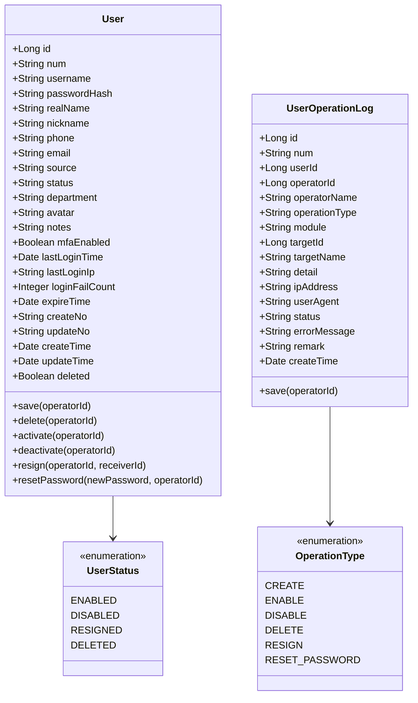
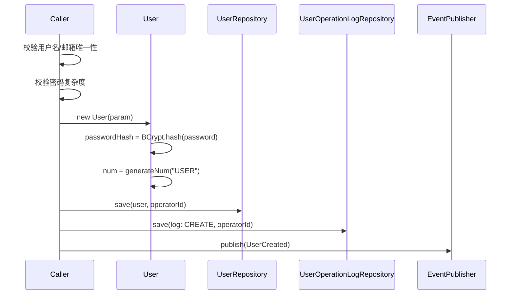
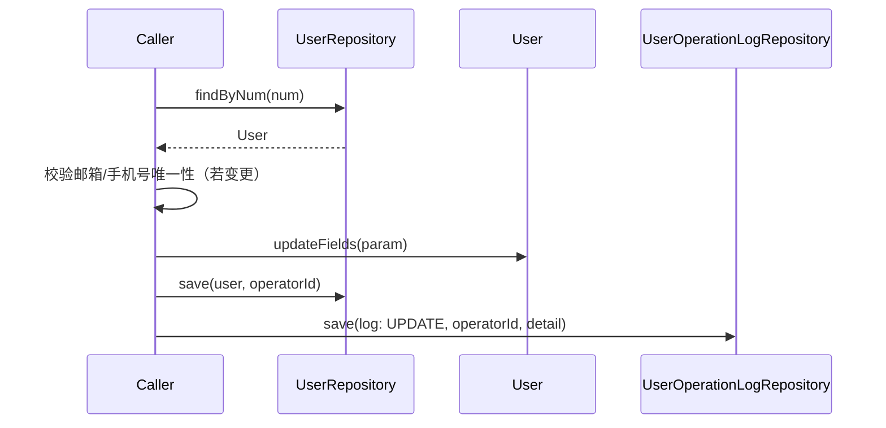
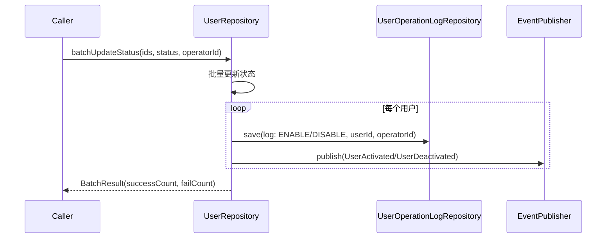
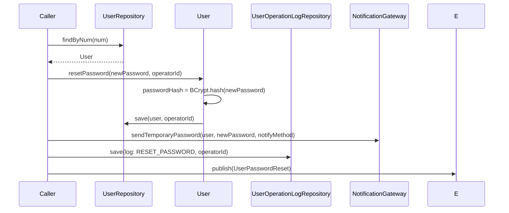
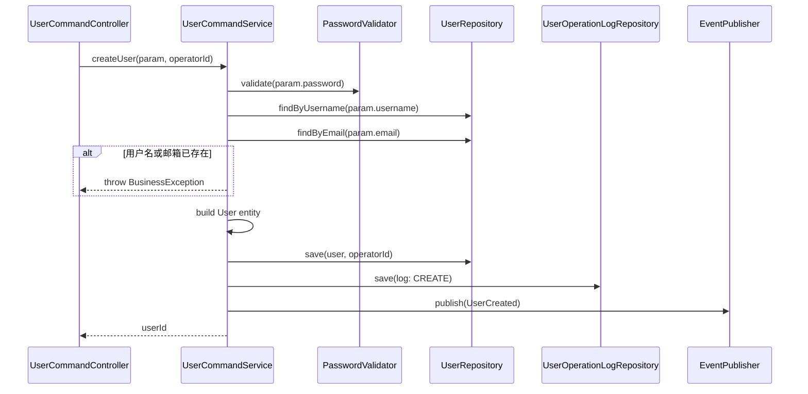
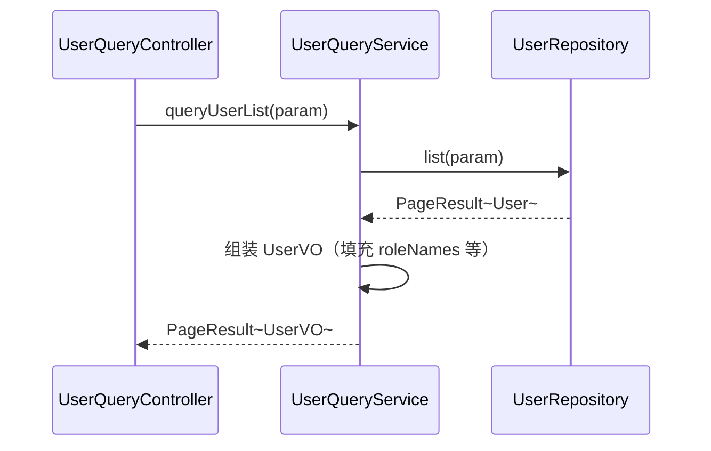
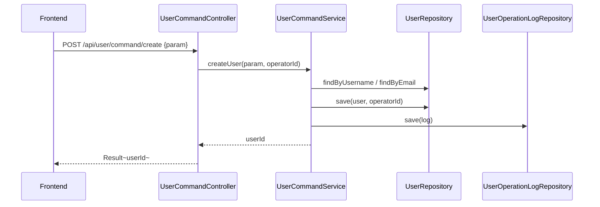
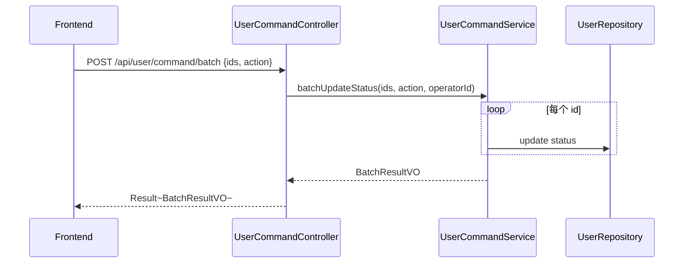

# 用户管理 - 技术方案

> **文档版本**：V1.0  
> **创建日期**：2026-04-29  
> **关联 PRD**：4.1.2 用户管理  
> **关联蓝图**：总体技术架构蓝图 V2.4，§3.4/§6.3.1/§6.3.15  
> **对应分支**：`feature-20260428-init-foundation`

---

## 1. 目标与范围

### 1.1 目标

提供管理端用户全生命周期管理能力，包括：
- 用户 CRUD（新增、查询、更新、删除）
- 用户状态管理（启用、禁用、离职）
- 管理员重置用户密码
- 用户列表分页查询（筛选、搜索）
- 用户详情查询
- 用户批量操作（批量启用/禁用/删除）
- 用户操作日志查询

### 1.2 范围

| 范围内 | 范围外 |
|-------|--------|
| 用户 CRUD 与状态管理 | 用户自助注册（通过认证模块） |
| 密码重置（管理员操作） | 用户组管理（Phase 2） |
| 用户列表/详情查询 | 批量导入/导出（Phase 2） |
| 用户操作日志记录与查询 | MFA 配置（Phase 2） |
| 用户密码策略校验 | SSO 集成（Phase 3） |

---

## 2. 架构设计（代码结构）

| 层 | 领域 | 包 | 职责 |
|---|------|---|------|
| facade | user | `com.gagentmanager.facade.user` | User 领域事件 DTO、事件常量 |
| client | user | `com.gagentmanager.client.user` | CreateUserParam、UpdateUserParam、ResetPasswordParam、UserVO、UserOperationLogVO |
| client | common | `com.gagentmanager.client.common` | PageParam、PageResult |
| domain | user | `com.gagentmanager.domain.user` | User 聚合根、UserOperationLog 实体、UserRepository/UserOperationLogRepository 接口 |
| infra | user | `com.gagentmanager.infra.user` | User Entity、UserOperationLog Entity、Mapper、Repository 实现 |
| application | user | `com.gagentmanager.application.user` | UserCommandService、UserQueryService |
| adapter | user | `com.gagentmanager.adapter.user` | UserCommandController、UserQueryController |

---

## 3. 领域模型设计

### 3.1 业务层级划分

| 层级 | 业务领域 | 说明 |
|-----|---------|------|
| 通用域 | user | 用户全生命周期管理 + 操作日志 |

### 3.2 用户管理（user）

#### 3.2.1 领域模型



| 对象 | 类型 | 属性 | 与其它对象关系 |
|-----|------|------|--------------|
| User | 聚合根 | id, num, username, passwordHash, realName, nickname, phone, email, source, status, department, avatar, notes, mfaEnabled, lastLoginTime, lastLoginIp, loginFailCount, expireTime | - |
| UserOperationLog | 实体 | id, num, userId, operatorId, operatorName, operationType, module, targetId, targetName, detail, ipAddress, userAgent, status, errorMessage, remark, createTime | 引用 User.userId |
| UserStatus | 值对象（枚举） | ENABLED / DISABLED / RESIGNED / DELETED | 被 User 引用 |

**Repository 接口**：

| 方法 | 说明 |
|-----|------|
| `findByNum(num)` | 按业务编号查找 |
| `findByUsername(username)` | 按用户名查找 |
| `findByEmail(email)` | 按邮箱查找 |
| `list(param: UserQueryParam): PageResult~User~` | 分页查询 |
| `save(user, operatorId)` | 保存 |
| `delete(num, operatorId)` | 逻辑删除 |
| `batchUpdateStatus(ids, status, operatorId)` | 批量更新状态 |

| 方法 | 说明 |
|-----|------|
| `listByUserId(userId, param): PageResult~UserOperationLog~` | 按用户ID查操作日志分页 |
| `save(log, operatorId)` | 保存操作日志 |

#### 3.2.2 领域规则

| 聚合/对象 | 规则类型 | 规则描述 | 违反时表达 |
|----------|---------|---------|-----------|
| User | 不变性 | 用户名全局唯一（忽略 deleted） | UserAlreadyExistsException |
| User | 不变性 | 邮箱全局唯一（忽略 deleted） | EmailAlreadyExistsException |
| User | 不变性 | 手机号若提供则全局唯一 | PhoneAlreadyExistsException |
| User | 业务规则 | 密码复杂度：8-32字符，含大小写字母+数字+特殊字符 | PasswordComplexityException |
| User | 业务规则 | 已离职/已删除用户不可再进行状态变更 | UserStatusInvalidException |
| User | 业务规则 | 已删除用户不可恢复（物理删除不可逆） | UserAlreadyDeletedException |
| User | 业务规则 | 离职操作需指定接收人 | ResignReceiverRequiredException |
| User | 业务规则 | 每次状态变更须记录 UserOperationLog | - |
| UserOperationLog | 不变性 | 操作日志不可修改、不可删除 | - |

#### 3.2.3 领域动作

| 聚合/实体 | 领域动作 | 职责 | 前置条件 | 后置条件/规则 | 领域事件 |
|----------|---------|------|---------|-------------|---------|
| User | `save(operatorId)` | 创建/更新用户 | 用户名/邮箱唯一、密码符合复杂度 | 生成/更新用户记录，记录操作日志 | UserCreated / UserUpdated |
| User | `delete(operatorId)` | 逻辑删除用户 | 用户状态为 DISABLED、无未完成业务 | 标记 deleted=1，记录操作日志 | UserDeleted |
| User | `activate(operatorId)` | 启用用户 | 用户状态为 DISABLED | 状态变更为 ENABLED，记录操作日志 | UserActivated |
| User | `deactivate(operatorId)` | 禁用用户 | 用户状态为 ENABLED | 状态变更为 DISABLED，记录操作日志 | UserDeactivated |
| User | `resign(operatorId, receiverId)` | 标记用户离职 | 用户状态为 ENABLED | 状态变更为 RESIGNED，转移业务到接收人，记录操作日志 | UserResigned |
| User | `resetPassword(newPassword, operatorId)` | 管理员重置密码 | 用户存在且未删除 | 更新 passwordHash，生成临时密码通知，记录操作日志 | UserPasswordReset |

**createUser 时序图**：



**updateUser 时序图**：



**batchUpdateStatus 时序图**：



**resetPassword 时序图**：



#### 3.2.4 领域事件

| 事件名 | 触发时机 | 载荷要点 | 可订阅方/用途 |
|-------|---------|---------|-------------|
| UserCreated | 创建用户成功 | userId, num, username, operatorId | 审计日志、通知 |
| UserUpdated | 更新用户成功 | userId, num, changes, operatorId | 审计日志 |
| UserActivated | 启用用户 | userId, num, operatorId | 审计日志 |
| UserDeactivated | 禁用用户 | userId, num, operatorId | 审计日志 |
| UserDeleted | 删除用户 | userId, num, operatorId | 审计日志 |
| UserResigned | 用户离职 | userId, num, receiverId, operatorId | 审计日志、业务转移 |
| UserPasswordReset | 密码重置 | userId, num, operatorId | 审计日志 |

---

## 4. 应用层设计

### 4.1 业务模块划分

| 应用模块 | 对应领域 | Service 类型 | 说明 |
|---------|---------|-------------|------|
| user | 用户管理 | CommandService | 用户 CRUD、状态管理、密码重置、批量操作 |
| user | 用户管理 | QueryService | 用户列表/详情查询、操作日志查询 |

### 4.2 用户管理（user）

#### 4.2.1 Service 方法清单

| Service | 方法签名 | 职责 | 入参 | 出参 |
|---------|---------|------|------|------|
| UserCommandService | `createUser(param: CreateUserParam, operatorId: Long): Long` | 创建用户 | username, password, realName, email, phone, source, department, status, expireTime, mfaEnabled, notes | userId |
| UserCommandService | `updateUser(param: UpdateUserParam, operatorId: Long): Void` | 更新用户信息 | num/num, realName, nickname, phone, email, department, expireTime, mfaEnabled, notes | - |
| UserCommandService | `deleteUser(num: String, operatorId: Long): Void` | 逻辑删除用户 | num | - |
| UserCommandService | `activateUser(num: String, operatorId: Long): Void` | 启用用户 | num | - |
| UserCommandService | `deactivateUser(num: String, operatorId: Long): Void` | 禁用用户 | num | - |
| UserCommandService | `resignUser(num: String, receiverNum: String, operatorId: Long): Void` | 用户离职 | num, receiverNum | - |
| UserCommandService | `resetUserPassword(param: ResetPasswordParam, operatorId: Long): Void` | 重置密码 | num, newPassword, notifyMethod, expireHours | - |
| UserCommandService | `batchUpdateStatus(ids: List~String~, status: String, operatorId: Long): BatchResultVO` | 批量状态操作 | ids, status | BatchResultVO |
| UserQueryService | `queryUserList(param: UserQueryParam): PageResult~UserVO~` | 分页查询用户列表 | pageNo, pageSize, keyword, status, source, department | PageResult~UserVO~ |
| UserQueryService | `queryUserByNum(num: String): UserVO` | 按编号查详情 | num | UserVO |
| UserQueryService | `queryOperationLogs(param: UserOperationLogParam): PageResult~UserOperationLogVO~` | 查询操作日志 | userId, pageNo, pageSize, operationType | PageResult~UserOperationLogVO~ |

#### 4.2.2 方法时序逻辑

**createUser 时序图**：



**queryUserList 时序图**：



---

## 5. 控制器/Adapter 层设计

### 5.1 业务模块划分

| Controller | 对应应用模块 | URL 前缀 |
|-----------|-------------|---------|
| UserCommandController | user | `/api/user/command` |
| UserQueryController | user | `/api/user/query` |

### 5.2 用户管理（user）

#### 5.2.1 Controller 接口清单

| 接口 | 方法 | 路径 | 入参 JSON | 返回值 JSON | 职责 |
|-----|------|------|----------|-----------|------|
| 用户列表 | GET | `/api/user/query/list` | pageNo=1, pageSize=20, keyword, status, source | `{"code": 200, "data": {"records": [{"num": "USER-001", "username": "admin", "realName": "管理员", "status": "ENABLED", "roleNames": ["超级管理员"], "createTime": "..."}], "total": 100, "pageNo": 1, "pageSize": 20}}` | 分页查询 |
| 用户详情 | GET | `/api/user/query/detail` | num | `{"code": 200, "data": {"num": "USER-001", "username": "admin", "realName": "管理员", "email": "...", "status": "ENABLED"}}` | 详情查询 |
| 创建用户 | POST | `/api/user/command/create` | `{"username": "newuser", "password": "Pass123!", "realName": "张三", "email": "zhangsan@example.com"}` | `{"code": 200, "data": 101}` | 创建用户 |
| 更新用户 | POST | `/api/user/command/update` | `{"num": "USER-001", "realName": "张三", "phone": "13800000001"}` | `{"code": 200, "data": null}` | 更新用户 |
| 删除用户 | POST | `/api/user/command/delete` | `{"num": "USER-001"}` | `{"code": 200, "data": null}` | 删除用户 |
| 启用用户 | POST | `/api/user/command/activate` | `{"num": "USER-001"}` | `{"code": 200, "data": null}` | 启用用户 |
| 禁用用户 | POST | `/api/user/command/deactivate` | `{"num": "USER-001"}` | `{"code": 200, "data": null}` | 禁用用户 |
| 用户离职 | POST | `/api/user/command/resign` | `{"num": "USER-001", "receiverNum": "USER-002"}` | `{"code": 200, "data": null}` | 标记离职 |
| 重置密码 | POST | `/api/user/command/reset-password` | `{"num": "USER-001", "newPassword": "Temp123!", "notifyMethod": "SYSTEM"}` | `{"code": 200, "data": null}` | 重置密码 |
| 批量操作 | POST | `/api/user/command/batch` | `{"ids": ["USER-001", "USER-002"], "action": "ENABLE"}` | `{"code": 200, "data": {"successCount": 2, "failCount": 0}}` | 批量启用/禁用/删除 |
| 操作日志 | GET | `/api/user/query/operation-logs` | userId, pageNo, pageSize, operationType | `{"code": 200, "data": {"records": [{"num": "LOG-001", "operationType": "CREATE", "operatorName": "admin", "createTime": "..."}]}}` | 查询操作日志 |

#### 5.2.2 接口时序逻辑

**创建用户时序图**：



**批量操作时序图**：



---

## 6. 数据库设计

### 6.1 表结构

| 表 | 对应领域 | 说明 |
|---|---------|------|
| `user` | user / User | 用户基本信息（蓝图 §6.3.1） |
| `user_operation_log` | user / UserOperationLog | 用户管理操作日志（蓝图 §6.3.15） |

### 6.2 DDL

以下 DDL 已在蓝图定义，确认字段一致：

- `user` 表：蓝图 §6.3.1（已含 nickname, source, department, avatar, notes, mfaEnabled, lastLoginTime, lastLoginIp, loginFailCount, expireTime）
- `user_operation_log` 表：蓝图 §6.3.15（已含 userId, operatorId, operatorName, operationType, module, targetId, targetName, detail, ipAddress, userAgent, status, errorMessage, remark）

---

## 7. 模块变更清单

| 层级 | 变更项 | 对应 Skill |
|------|--------|------------|
| facade | User 领域事件 DTO（UserCreatedEventDTO 等） | impl-facade-module |
| client | CreateUserParam、UpdateUserParam、ResetPasswordParam、UserVO、UserOperationLogVO、BatchResultVO | impl-client-module |
| domain | User 聚合根（activate/deactivate/resign/resetPassword 动作）、UserOperationLog 实体、Repository 接口 | impl-domain-module |
| infra | User Entity、UserOperationLog Entity、UserMapper、UserOperationLogMapper、Repository 实现 | impl-infra-module |
| application | UserCommandService、UserQueryService | impl-application-module |
| adapter | UserCommandController、UserQueryController | impl-adapter-module |

---

## 8. 代码分支命名

**分支名**：`feature-20260428-init-foundation`

---

## 9. 实现顺序

```
facade(User 事件 DTO) → client(User Param/VO) → domain(User 扩展动作/UserOperationLog) → infra(UserOperationLog Entity/Mapper) → application(UserCommandService/UserQueryService) → adapter(UserCommandController/UserQueryController)
```

---

## 10. 接口与数据契约

### 10.1 前端 API 对接约定

前端 `api/user.ts` 已定义以下接口，后端路径需适配：

| 前端方法 | 前端路径 | 后端路径 | 说明 |
|---------|---------|---------|------|
| `getUsers(params)` | GET `/users` | GET `/api/user/query/list` | 需适配路径 |
| `getUser(id)` | GET `/users/:id` | GET `/api/user/query/detail?num=xxx` | 前端传 num，后端按 num 查询 |
| `createUser(data)` | POST `/users` | POST `/api/user/command/create` | 路径不同 |
| `updateUser(id, data)` | PUT `/users/:id` | POST `/api/user/command/update` | 方法+路径不同 |
| `deleteUser(id)` | DELETE `/users/:id` | POST `/api/user/command/delete` | 方法+路径不同 |
| `enableUser(id)` | POST `/users/:id/enable` | POST `/api/user/command/activate` | 路径不同 |
| `disableUser(id)` | POST `/users/:id/disable` | POST `/api/user/command/deactivate` | 路径不同 |
| `resignUser(id)` | POST `/users/:id/resign` | POST `/api/user/command/resign` | 路径不同 |
| `resetUserPassword(id, data)` | POST `/users/:id/reset-password` | POST `/api/user/command/reset-password` | 路径不同 |
| `batchUsers(action, ids)` | POST `/users/batch` | POST `/api/user/command/batch` | 路径不同 |

> 前端需更新 `api/user.ts` 以对齐后端 query/command 路径规范。

### 10.2 错误码（1101 ~ 1199 范围已预留给 Agent，用户为 1001 ~ 1099）

用户管理复用认证模块错误码 1001~1099，额外扩展：

| 错误码 | 说明 |
|-------|------|
| 1011 | 密码不符合复杂度要求 |
| 1012 | 用户已删除 |
| 1013 | 用户状态不可变更 |
| 1014 | 离职操作需指定接收人 |
