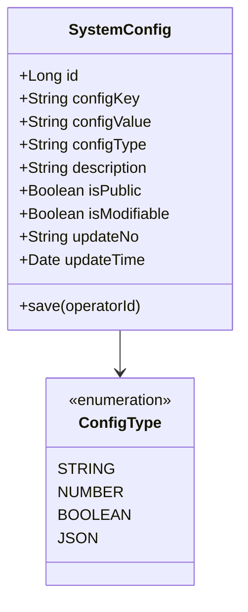
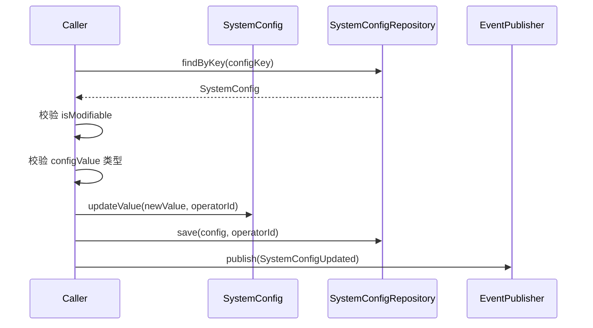
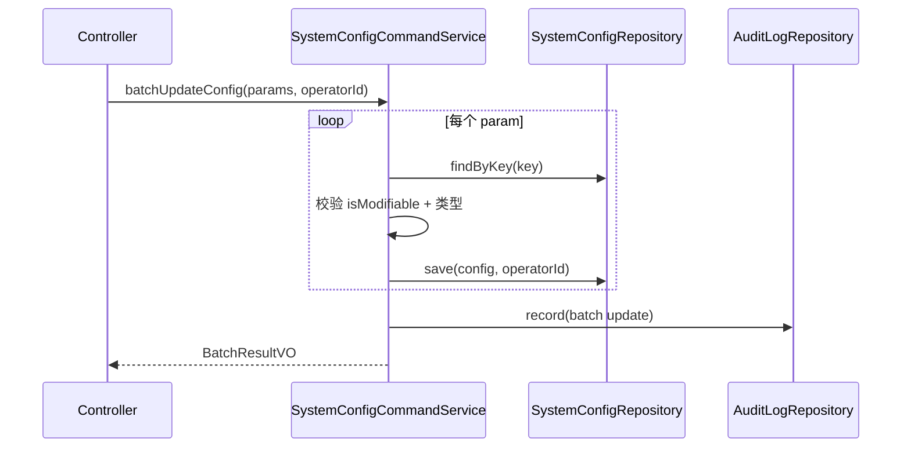
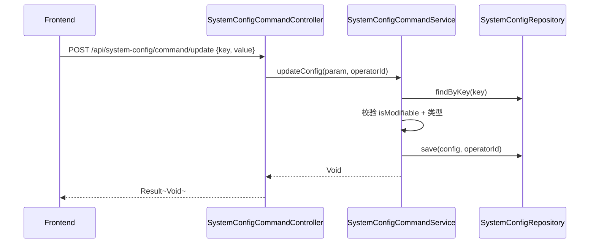

# 系统配置 - 技术方案

> **文档版本**：V1.0  
> **创建日期**：2026-04-29  
> **关联 PRD**：4.2.1 系统配置  
> **关联蓝图**：总体技术架构蓝图 V2.4，§3.10/§6.3.11  
> **对应分支**：`feature-20260428-init-foundation`

---

## 1. 目标与范围

### 1.1 目标

提供系统参数配置管理能力，包括：
- 系统配置项查询（单个/全部）
- 系统配置项更新（单个/批量）
- 密码策略配置
- 安全设置（MFA、SSO、会话超时等）
- 配置项按类型自动解析（STRING/NUMBER/BOOLEAN/JSON）

### 1.2 范围

| 范围内 | 范围外 |
|-------|--------|
| 系统配置 CRUD | 配置版本历史 |
| 配置分类（安全/密码/系统/会话） | 配置热更新推送 |
| 公开/私有配置区分 | 配置回滚 |

---

## 2. 架构设计（代码结构）

| 层 | 领域 | 包 | 职责 |
|---|------|---|------|
| facade | system_config | `com.gagentmanager.facade.system_config` | SystemConfig 领域事件 DTO |
| client | system_config | `com.gagentmanager.client.system_config` | SystemConfigVO、UpdateSystemConfigParam、SystemParamsVO |
| domain | system_config | `com.gagentmanager.domain.system_config` | SystemConfig 聚合根、Repository 接口 |
| infra | system_config | `com.gagentmanager.infra.system_config` | SystemConfig Entity、Mapper、Repository 实现 |
| application | system_config | `com.gagentmanager.application.system_config` | SystemConfigCommandService、SystemConfigQueryService |
| adapter | system_config | `com.gagentmanager.adapter.system_config` | SystemConfigCommandController、SystemConfigQueryController |

---

## 3. 领域模型设计

### 3.1 业务层级划分

| 层级 | 业务领域 | 说明 |
|-----|---------|------|
| 通用域 | system_config | 系统参数配置 |

### 3.2 系统配置（system_config）

#### 3.2.1 领域模型



| 对象 | 类型 | 属性 | 说明 |
|-----|------|------|------|
| SystemConfig | 聚合根 | id, configKey, configValue, configType, description, isPublic, isModifiable, updateNo, updateTime | 系统配置项 |

**Repository 接口**：

| 方法 | 说明 |
|-----|------|
| `findByKey(key)` | 按配置键查找 |
| `findAll()` | 查询全部配置 |
| `findAllPublic()` | 查询全部公开配置 |
| `save(config, operatorId)` | 保存配置 |
| `batchSave(configs, operatorId)` | 批量保存配置 |

#### 3.2.2 领域规则

| 聚合/对象 | 规则类型 | 规则描述 | 违反时表达 |
|----------|---------|---------|-----------|
| SystemConfig | 不变性 | configKey 全局唯一 | ConfigKeyAlreadyExistsException |
| SystemConfig | 业务规则 | isModifiable=false 的配置不可修改 | ConfigNotModifiableException |
| SystemConfig | 业务规则 | configValue 须符合 configType 类型格式 | ConfigValueTypeMismatchException |

#### 3.2.3 领域动作

| 聚合/实体 | 领域动作 | 职责 | 前置条件 | 后置条件/规则 | 领域事件 |
|----------|---------|------|---------|-------------|---------|
| SystemConfig | `save(operatorId)` | 创建/更新单个配置 | configKey 存在（更新时） | 更新配置值和时间 | SystemConfigUpdated |
| SystemConfig | `batchUpdate(configs, operatorId)` | 批量更新配置 | 所有 key 存在且可修改 | 批量更新，返回成功/失败计数 | SystemConfigBatchUpdated |

**updateConfig 时序图**：



#### 3.2.4 领域事件

| 事件名 | 触发时机 | 载荷要点 | 可订阅方/用途 |
|-------|---------|---------|-------------|
| SystemConfigUpdated | 更新配置成功 | configKey, oldValue, newValue, operatorId | 审计日志 |
| SystemConfigBatchUpdated | 批量更新成功 | configCount, operatorId | 审计日志 |

---

## 4. 应用层设计

### 4.1 业务模块划分

| 应用模块 | 对应领域 | Service 类型 | 说明 |
|---------|---------|-------------|------|
| system_config | 系统配置 | CommandService | 配置更新（单个/批量） |
| system_config | 系统配置 | QueryService | 配置查询（单个/全部/按分类） |

### 4.2 系统配置（system_config）

#### 4.2.1 Service 方法清单

| Service | 方法签名 | 职责 | 入参 | 出参 |
|---------|---------|------|------|------|
| SystemConfigCommandService | `updateConfig(param: UpdateConfigParam, operatorId: Long): Void` | 更新单个配置 | key, value | - |
| SystemConfigCommandService | `batchUpdateConfig(params: List~UpdateConfigParam~, operatorId: Long): BatchResultVO` | 批量更新配置 | [{key, value}, ...] | BatchResultVO |
| SystemConfigQueryService | `getConfigByKey(key: String): SystemConfigVO` | 按 key 查询 | key | SystemConfigVO |
| SystemConfigQueryService | `getAllConfigs(): List~SystemConfigVO~` | 查询全部配置 | - | List~SystemConfigVO~ |
| SystemConfigQueryService | `getPublicConfigs(): List~SystemConfigVO~` | 查询公开配置 | - | List~SystemConfigVO~ |
| SystemConfigQueryService | `getSystemParams(): SystemParamsVO` | 查询系统参数汇总 | - | SystemParamsVO |

#### 4.2.2 方法时序逻辑

**batchUpdateConfig 时序图**：



---

## 5. 控制器/Adapter 层设计

### 5.1 业务模块划分

| Controller | 对应应用模块 | URL 前缀 |
|-----------|-------------|---------|
| SystemConfigCommandController | system_config | `/api/system-config/command` |
| SystemConfigQueryController | system_config | `/api/system-config/query` |

### 5.2 系统配置（system_config）

#### 5.2.1 Controller 接口清单

| 接口 | 方法 | 路径 | 入参 JSON | 返回值 JSON | 职责 |
|-----|------|------|----------|-----------|------|
| 查询全部配置 | GET | `/api/system-config/query/all` | - | `{"code": 200, "data": [{"configKey": "max_agents_per_user", "configValue": "50", "configType": "NUMBER"}]}` | 全部配置 |
| 按 key 查询 | GET | `/api/system-config/query/by-key` | key | `{"code": 200, "data": {"configKey": "...", "configValue": "..."}}` | 单个配置 |
| 更新配置 | POST | `/api/system-config/command/update` | `{"key": "max_agents_per_user", "value": "100"}` | `{"code": 200, "data": null}` | 更新单个配置 |
| 批量更新 | POST | `/api/system-config/command/batch-update` | `[{"key": "k1", "value": "v1"}, {"key": "k2", "value": "v2"}]` | `{"code": 200, "data": {"successCount": 2}}` | 批量更新 |
| 系统参数汇总 | GET | `/api/system-config/query/params` | - | `{"code": 200, "data": {"maxAgentsPerUser": 50, "maxConcurrentAgents": 1000, ...}}` | 系统参数 VO |

#### 5.2.2 接口时序逻辑

**更新配置时序图**：



---

## 6. 数据库设计

### 6.1 表结构

| 表 | 对应领域 | 说明 |
|---|---------|------|
| `system_config` | system_config / SystemConfig | 系统参数配置（蓝图 §6.3.11） |

### 6.2 DDL

蓝图 §6.3.11 已定义，包含 configKey、configValue、configType、description、isPublic、isModifiable、updateNo、updateTime。

### 6.3 初始化 DML

蓝图 §6.4 已定义 16 条初始化配置数据，覆盖密码策略、安全设置、系统限制等。

---

## 7. 模块变更清单

| 层级 | 变更项 | 对应 Skill |
|------|--------|------------|
| facade | SystemConfig 领域事件 DTO | impl-facade-module |
| client | SystemConfigVO、UpdateConfigParam、SystemParamsVO | impl-client-module |
| domain | SystemConfig 聚合根、Repository 接口 | impl-domain-module |
| infra | SystemConfig Entity、Mapper、Repository 实现 | impl-infra-module |
| application | SystemConfigCommandService、SystemConfigQueryService | impl-application-module |
| adapter | SystemConfigCommandController、SystemConfigQueryController | impl-adapter-module |

---

## 8. 代码分支命名

**分支名**：`feature-20260428-init-foundation`

---

## 9. 实现顺序

```
facade → client → domain → infra → application → adapter
```

---

## 10. 接口与数据契约

### 10.1 前端 API 对接约定

前端 `api/system.ts` 已定义接口，需适配路径：

| 前端方法 | 前端路径 | 后端路径 | 说明 |
|---------|---------|---------|------|
| `getSystemConfig()` | GET `/system/config` | GET `/api/system-config/query/all` | 需适配 |
| `updateSystemConfig(data)` | PUT `/system/config` | POST `/api/system-config/command/batch-update` | 需适配 |
| `getSystemParams()` | GET `/system/params` | GET `/api/system-config/query/params` | 需适配 |
| `updateSystemParams(data)` | PUT `/system/params` | POST `/api/system-config/command/batch-update` | 需适配 |
| `getConfigByKey(key)` | GET `/system/config/:key` | GET `/api/system-config/query/by-key?key=xxx` | 需适配 |

### 10.2 错误码（1901 ~ 1999）

| 错误码 | 说明 |
|-------|------|
| 1901 | 配置键不存在 |
| 1902 | 配置不可修改 |
| 1903 | 配置值类型不匹配 |
