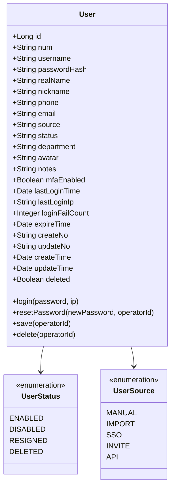
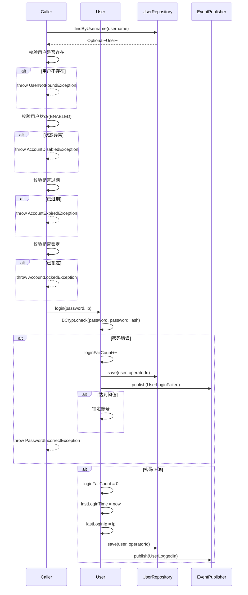
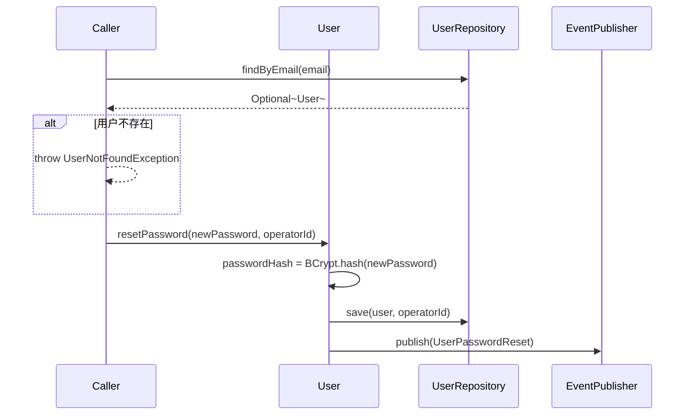
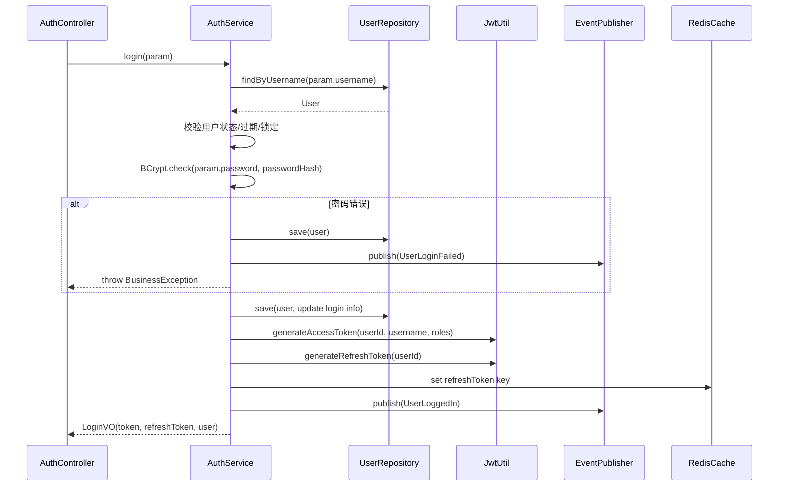
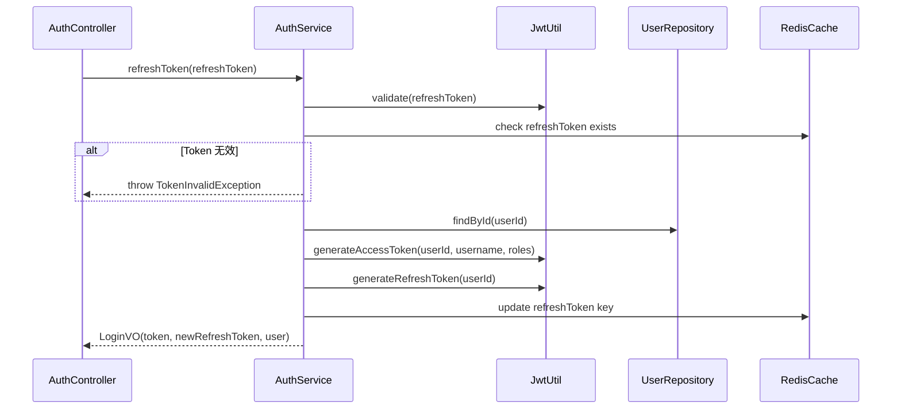
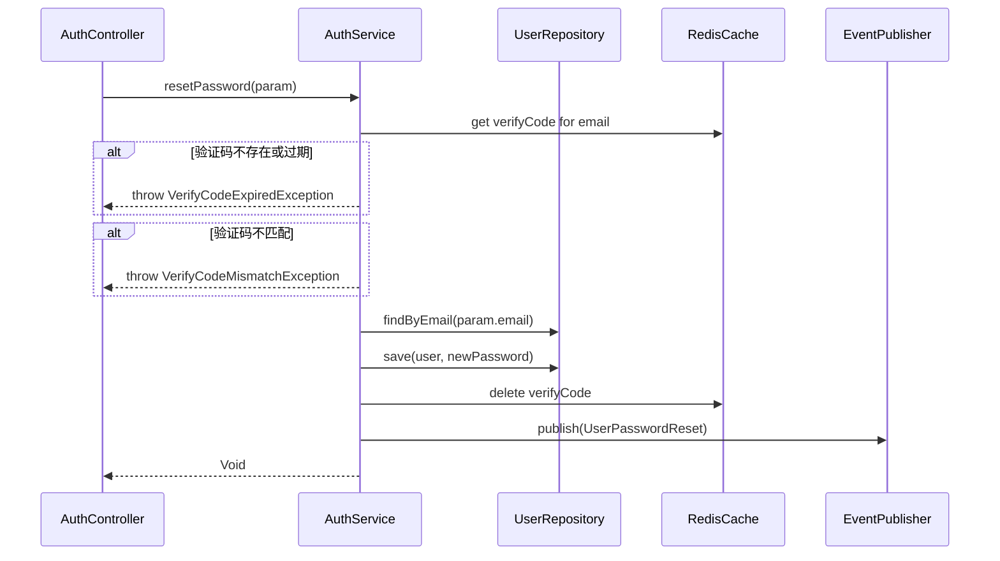
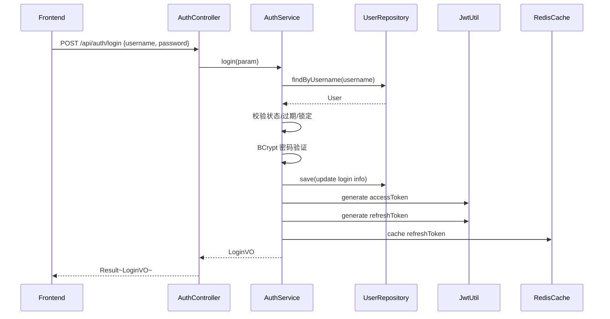
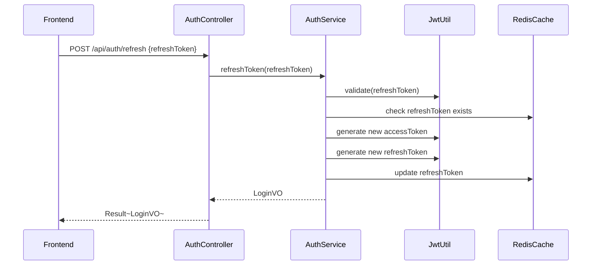
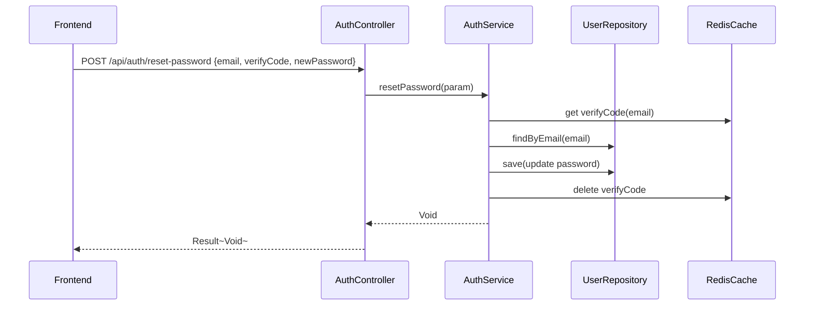

# 认证与登录 - 技术方案

> **文档版本**：V1.0  
> **创建日期**：2026-04-29  
> **关联 PRD**：4.2.2 用户端界面（登录/找回密码）  
> **关联蓝图**：总体技术架构蓝图 V2.4，§7.3 认证与鉴权  
> **对应分支**：`feature-20260428-init-foundation`

---

## 1. 目标与范围

### 1.1 目标

为 GAgentManager 平台提供统一的用户认证与登录能力，包括：
- 用户名/密码登录（JWT Token 认证）
- Token 刷新机制（Access Token + Refresh Token）
- 登出功能
- 邮箱验证码找回密码
- 获取当前登录用户信息

### 1.2 范围

| 范围内 | 范围外 |
|-------|--------|
| JWT 登录（Access Token 2h + Refresh Token 7d） | OAuth2/SSO 集成（Phase 3） |
| 密码 BCrypt 加密验证 | MFA 双因素认证（Phase 2 预留） |
| 登录失败计数与账号锁定 | 图形验证码（前端实现） |
| 邮箱验证码找回密码 | 邮件发送基础设施（使用简单邮件服务） |
| 当前用户信息查询 | 前端登录页面实现 |

### 1.3 六层依赖关系简述

```
adapter → application → domain → infra
              ↓
           client ← facade
```

---

## 2. 架构设计（代码结构）

| 层 | 领域 | 包 | 职责 |
|---|------|---|------|
| facade | common | `com.gagentmanager.facade.common` | Result、DomainEventDTO、ErrorCode、DomainEventPublisher |
| client | common | `com.gagentmanager.client.common` | PageParam、PageResult、全局常量 |
| client | auth | `com.gagentmanager.client.auth` | LoginParam、LoginVO、ResetPasswordParam、验证码 Param |
| domain | user | `com.gagentmanager.domain.user` | User 聚合根、Repository 接口、领域动作（login/resetPassword） |
| infra | user | `com.gagentmanager.infra.user` | User Entity、Mapper、Repository 实现 |
| infra | common | `com.gagentmanager.infra.common` | JWT 工具类、BCrypt 密码工具、全局异常处理 |
| application | auth | `com.gagentmanager.application.auth` | AuthService（登录/登出/刷新Token/找回密码/获取当前用户） |
| adapter | auth | `com.gagentmanager.adapter.auth` | AuthController（登录/登出/刷新/重置密码/当前用户） |
| adapter | config | `com.gagentmanager.adapter.config` | Spring Security 配置、CORS、JWT Filter |
| adapter | common | `com.gagentmanager.adapter.common` | GlobalExceptionHandler、BaseController |

---

## 3. 领域模型设计

### 3.1 业务层级划分

| 层级 | 业务领域 | 说明 |
|-----|---------|------|
| 通用域 | auth | 认证与登录（基于 User 聚合） |
| 通用域 | user | 用户全生命周期管理 |

### 3.2 用户（user）

#### 3.2.1 领域模型



| 对象 | 类型 | 属性 | 与其它对象关系 |
|-----|------|------|--------------|
| User | 聚合根 | id, num, username, passwordHash, realName, nickname, phone, email, source, status, department, avatar, notes, mfaEnabled, lastLoginTime, lastLoginIp, loginFailCount, expireTime | - |
| UserStatus | 值对象（枚举） | ENABLED / DISABLED / RESIGNED / DELETED | 被 User 引用 |
| UserSource | 值对象（枚举） | MANUAL / IMPORT / SSO / INVITE / API | 被 User 引用 |

**Repository 接口**：

| 方法 | 说明 |
|-----|------|
| `findByUsername(username)` | 按用户名查找用户 |
| `findByEmail(email)` | 按邮箱查找用户 |
| `findByNum(num)` | 按业务编号查找用户 |
| `save(user, operatorId)` | 保存用户 |

#### 3.2.2 领域规则

| 聚合/对象 | 规则类型 | 规则描述 | 违反时表达 |
|----------|---------|---------|-----------|
| User | 不变性 | 用户名全局唯一（忽略 deleted） | UserAlreadyExistsException |
| User | 不变性 | 邮箱全局唯一（忽略 deleted） | EmailAlreadyExistsException |
| User | 业务规则 | 已禁用/已离职/已删除用户不可登录 | AccountDisabledException |
| User | 业务规则 | 账号过期后不可登录 | AccountExpiredException |
| User | 业务规则 | 连续登录失败达到阈值后锁定账号 | AccountLockedException |
| User | 业务规则 | 密码必须使用 BCrypt 哈希验证 | - |
| User | 业务规则 | 登录成功后重置 loginFailCount=0，更新 lastLoginTime + lastLoginIp | - |

#### 3.2.3 领域动作

| 聚合/实体 | 领域动作 | 职责 | 前置条件 | 后置条件/规则 | 领域事件 |
|----------|---------|------|---------|-------------|---------|
| User | `login(password, ip)` | 用户登录认证 | 用户存在且已启用、未过期、未锁定 | 密码正确：清空失败计数、更新最后登录时间/IP；密码错误：失败计数+1，达到阈值锁定 | UserLoggedIn / UserLoginFailed |
| User | `resetPassword(newPassword, operatorId)` | 重置密码 | 用户存在、operatorId 有效 | 更新 passwordHash 为新密码的 BCrypt 哈希 | UserPasswordReset |

**login 时序图**：



**resetPassword 时序图**：



#### 3.2.4 领域事件

| 事件名 | 触发时机 | 载荷要点 | 可订阅方/用途 |
|-------|---------|---------|-------------|
| UserLoggedIn | 用户登录成功 | userId, username, loginTime, ip | 审计日志记录 |
| UserLoginFailed | 用户登录失败 | userId/username, reason, ip | 审计日志、安全告警 |
| UserPasswordReset | 密码重置成功 | userId, operatorId, resetTime | 审计日志 |

---

## 4. 应用层设计

### 4.1 业务模块划分

| 应用模块 | 对应领域 | Service 类型 | 说明 |
|---------|---------|-------------|------|
| auth | 认证与登录 | CommandService | 登录/登出/刷新Token/找回密码 |
| auth | 认证与查询 | QueryService | 获取当前用户信息 |

### 4.2 认证（auth）

#### 4.2.1 Service 方法清单

| Service | 方法签名 | 职责 | 入参 | 出参 |
|---------|---------|------|------|------|
| AuthService | `login(param: LoginParam): LoginVO` | 用户名/密码登录，生成 JWT Token | username, password, ip | token, refreshToken, user |
| AuthService | `logout(userId: Long)` | 登出（清除 Token 缓存） | userId | - |
| AuthService | `refreshToken(refreshToken: String): LoginVO` | 刷新 Access Token | refreshToken | token, refreshToken, user |
| AuthService | `sendResetCode(email: String): Void` | 发送邮箱验证码 | email | - |
| AuthService | `resetPassword(param: ResetPasswordParam): Void` | 邮箱验证码重置密码 | email, verifyCode, newPassword | - |
| AuthService | `getCurrentUser(userId: Long): UserVO` | 获取当前用户信息 | userId | UserVO |

#### 4.2.2 方法时序逻辑

**login 时序图**：



**refreshToken 时序图**：



**resetPassword 时序图**：



---

## 5. 控制器/Adapter 层设计

### 5.1 业务模块划分

| Controller | 对应应用模块 | URL 前缀 |
|-----------|-------------|---------|
| AuthController | auth | `/api/auth` |

### 5.2 认证（auth）

#### 5.2.1 Controller 接口清单

| 接口 | 方法 | 路径 | 入参 JSON | 返回值 JSON | 职责 |
|-----|------|------|----------|-----------|------|
| 登录 | POST | `/api/auth/login` | `{"username": "admin", "password": "admin123"}` | `{"code": 200, "data": {"token": "...", "refreshToken": "...", "user": {"userId": 1, "num": "USER-001", "username": "admin", "realName": "管理员", "roleNames": ["超级管理员"]}}}` | 用户名密码登录 |
| 登出 | POST | `/api/auth/logout` | - | `{"code": 200, "data": null}` | 登出 |
| 刷新 Token | POST | `/api/auth/refresh` | `{"refreshToken": "..."}` | 同 login 返回值 | 刷新 Access Token |
| 发送验证码 | POST | `/api/auth/reset-code` | `{"email": "user@example.com"}` | `{"code": 200, "data": null}` | 发送邮箱验证码 |
| 重置密码 | POST | `/api/auth/reset-password` | `{"email": "user@example.com", "verifyCode": "123456", "newPassword": "NewPass123!"}` | `{"code": 200, "data": null}` | 邮箱验证码重置密码 |
| 当前用户 | GET | `/api/auth/current` | - | `{"code": 200, "data": {"userId": 1, "num": "USER-001", "username": "admin", "realName": "管理员", "email": "...", "roleNames": ["超级管理员"]}}` | 获取当前用户信息 |

#### 5.2.2 接口时序逻辑

**登录时序图**：



**刷新 Token 时序图**：



**重置密码时序图**：



---

## 6. 数据库设计

### 6.1 表结构

本方案复用蓝图已定义的 `user` 表（§6.3.1），不新增表。

新增系统配置项（用于认证相关配置）：

| 表 | 对应领域 | 说明 |
|---|---------|------|
| `user` | user / User | 用户基本信息（蓝图已定义） |
| `system_config` | system_config | 认证相关配置项（蓝图已定义） |

### 6.2 补充 DML 语句

在蓝图已定义的 `system_config` 初始化数据基础上，确认以下认证相关配置已包含：

```sql
-- 以下配置已在蓝图 §6.4 初始化数据中定义，确认执行顺序：
-- 1. 先执行 role 初始化
-- 2. 再执行 user 初始化
-- 3. 最后执行 system_config 初始化

-- 认证相关配置确认（已存在，无需重复）：
-- session_timeout: 60 分钟
-- password_min_length: 8
-- password_require_upper/lower/number/special: true
-- password_expire_days: 90
-- max_login_failures: 5
-- lock_duration: 30 分钟
-- enable_mfa: false
-- enable_sso: false
```

---

## 7. 模块变更清单

| 层级 | 变更项 | 对应 Skill |
|------|--------|------------|
| facade | Result、ErrorCode（认证相关错误码 1001~1099） | impl-facade-module |
| client | LoginParam、LoginVO、ResetPasswordParam、UserVO | impl-client-module |
| domain | User 聚合根（login/resetPassword 动作）、UserRepository 接口 | impl-domain-module |
| infra | User Entity、UserMapper、UserRepositoryImpl、JwtUtil、PasswordUtil | impl-infra-module |
| application | AuthService（login/logout/refreshToken/sendResetCode/resetPassword/getCurrentUser） | impl-application-module |
| adapter | AuthController、TokenValidationFilter、SecurityConfig、GlobalExceptionHandler | impl-adapter-module |

---

## 8. 代码分支命名

**分支名**：`feature-20260428-init-foundation`

---

## 9. 实现顺序

```
facade(Result/ErrorCode) → client(LoginParam/LoginVO) → domain(User login/resetPassword) → infra(UserRepositoryImpl/JwtUtil) → application(AuthService) → adapter(AuthController/SecurityConfig)
```

---

## 10. 接口与数据契约

### 10.1 通用约定

- **HTTP 方法**：GET（查询）、POST（增删改）
- **响应格式**：`Result<T>`，`{"code": 200, "message": "success", "data": {...}}`
- **鉴权**：除 `/api/auth/login`、`/api/auth/refresh`、`/api/auth/reset-code`、`/api/auth/reset-password` 外均需 JWT Token

### 10.2 JWT Token 结构

| 字段 | 说明 |
|-----|------|
| sub | userId |
| username | 用户名 |
| roles | 角色编码列表 |
| exp | 过期时间（2h） |
| iat | 签发时间 |

### 10.3 错误码（1001 ~ 1099）

| 错误码 | 说明 |
|-------|------|
| 1001 | 用户不存在 |
| 1002 | 密码错误 |
| 1003 | 账号已禁用 |
| 1004 | 账号已过期 |
| 1005 | 账号已锁定 |
| 1006 | Token 无效 |
| 1007 | Token 已过期 |
| 1008 | 验证码已过期 |
| 1009 | 验证码错误 |
| 1010 | 密码不符合复杂度要求 |

### 10.4 前端 API 对接约定

前端 `api/auth.ts` 已定义以下接口，后端需对齐：

| 前端方法 | 后端路径 | 说明 |
|---------|---------|------|
| `login(data)` | `POST /api/auth/login` | 已对齐 |
| `logout()` | `POST /api/auth/logout` | 已对齐 |
| `getCurrentUser()` | `GET /api/auth/current` | 前端用 `/auth/current`，后端需支持此路径 |
| `sendResetCode(email)` | `POST /api/auth/reset-code` | 前端用 `/auth/reset-code`，后端需支持 |
| `resetPassword(data)` | `POST /api/auth/reset-password` | 前端用 `/auth/reset-password`，后端需支持 |

> **注意**：前端 `request.ts` 中 baseURL 为 `/api`，实际请求路径为 `/api/auth/login` 等。后端 Controller 使用 `@RequestMapping("/api/auth")` 即可对齐。
>
> 前端 `ApiResponse` 期望 `code` 为 0 或 200，后端 `Result.code` 统一使用 200 表示成功。
