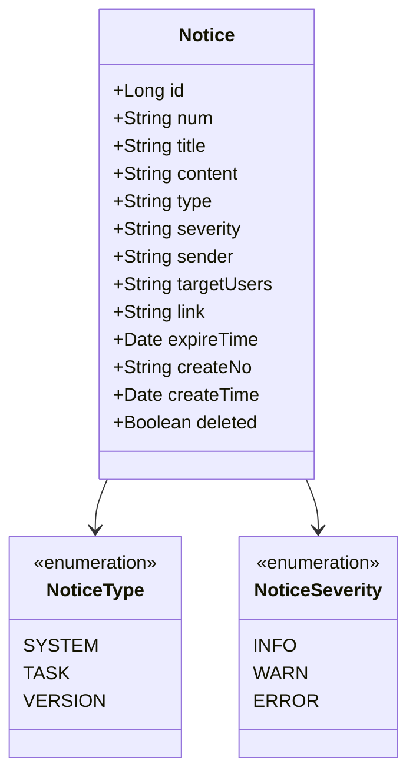
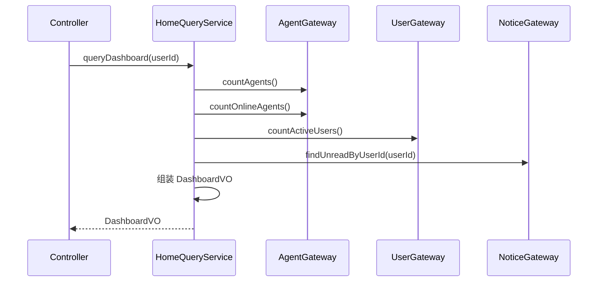
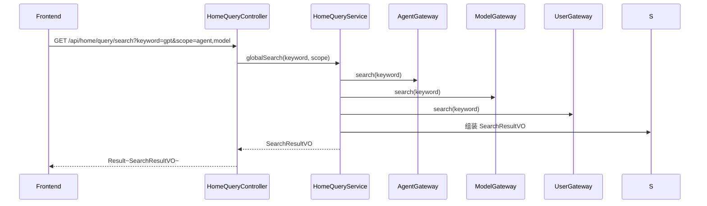

# 首页仪表盘 - 技术方案

> **文档版本**：V1.0  
> **创建日期**：2026-04-29  
> **关联 PRD**：4.1.3 首页  
> **关联蓝图**：总体技术架构蓝图 V2.4，§3.9/§6.3.12  
> **对应分支**：`feature-20260501-agent-model`

---

## 1. 目标与范围

### 1.1 目标

提供管理端首页仪表盘能力，包括：
- 系统概览卡片（Agent 总数、在线用户数、活跃 Agent 数等）
- 快捷操作入口（基于用户角色）
- 通知中心（通知列表、标记已读）
- 全局搜索（Agent/Skill/MCP/模型/工作流/用户/角色）

### 1.2 范围

| 范围内 | 范围外 |
|-------|--------|
| 系统概览数据统计 | 数据可视化图表（Phase 3） |
| 快捷操作（基于角色过滤） | 个性化首页组件拖拽 |
| 通知 CRUD + 标记已读 | 实时推送通知 |
| 全局搜索 | Elasticsearch 全文检索（Phase 3） |

---

## 2. 架构设计（代码结构）

| 层 | 领域 | 包 | 职责 |
|---|------|---|------|
| facade | home | `com.gagentmanager.facade.home` | Home 领域事件 DTO |
| client | home | `com.gagentmanager.client.home` | DashboardVO、NoticeVO、SearchResultVO、ShortcutVO |
| domain | home | `com.gagentmanager.domain.home` | Notice 实体、Repository 接口 |
| infra | home | `com.gagentmanager.infra.home` | Notice Entity、Mapper、Repository 实现 |
| infra | common | `com.gagentmanager.infra.common` | 各统计 Gateway（Agent/User/Audit 统计查询） |
| application | home | `com.gagentmanager.application.home` | HomeQueryService |
| adapter | home | `com.gagentmanager.adapter.home` | HomeQueryController |

---

## 3. 领域模型设计

### 3.1 业务层级划分

| 层级 | 业务领域 | 说明 |
|-----|---------|------|
| 通用域 | home | 首页仪表盘、通知中心 |

### 3.2 首页（home）

#### 3.2.1 领域模型



| 对象 | 类型 | 属性 | 说明 |
|-----|------|------|------|
| Notice | 实体 | id, num, title, content, type, severity, sender, targetUsers(JSON), link, expireTime, createNo, createTime, deleted | 通知记录 |

**Repository 接口**：

| 方法 | 说明 |
|-----|------|
| `list(param): PageResult~Notice~` | 分页查询通知 |
| `findUnreadByUserId(userId): List~Notice~` | 查用户未读通知 |
| `save(notice, operatorId)` | 保存通知 |
| `delete(num, operatorId)` | 逻辑删除 |

#### 3.2.2 领域规则

| 聚合/对象 | 规则类型 | 规则描述 | 违反时表达 |
|----------|---------|---------|-----------|
| Notice | 业务规则 | targetUsers 为空时表示全员通知 | - |
| Notice | 业务规则 | 过期通知不再展示 | - |

#### 3.2.3 领域动作

| 聚合/实体 | 领域动作 | 职责 | 前置条件 | 后置条件/规则 | 领域事件 |
|----------|---------|------|---------|-------------|---------|
| Notice | `save(operatorId)` | 创建通知 | 通知内容非空 | 写入通知表 | NoticeCreated |
| Notice | `delete(operatorId)` | 删除通知 | 通知存在 | 标记 deleted=1 | NoticeDeleted |

#### 3.2.4 领域事件

| 事件名 | 触发时机 | 载荷要点 | 可订阅方/用途 |
|-------|---------|---------|-------------|
| NoticeCreated | 创建通知成功 | noticeNum, type, targetUsers, operatorId | 审计日志 |
| NoticeDeleted | 删除通知 | noticeNum, operatorId | 审计日志 |

---

## 4. 应用层设计

### 4.1 业务模块划分

| 应用模块 | 对应领域 | Service 类型 | 说明 |
|---------|---------|-------------|------|
| home | 首页仪表盘 | QueryService | 仪表盘数据查询、通知中心 |

### 4.2 首页（home）

#### 4.2.1 Service 方法清单

| Service | 方法签名 | 职责 | 入参 | 出参 |
|---------|---------|------|------|------|
| HomeQueryService | `queryDashboard(userId: Long): DashboardVO` | 仪表盘数据汇总 | userId | DashboardVO |
| HomeQueryService | `queryShortcuts(userId: Long): List~ShortcutVO~` | 快捷操作列表 | userId | List~ShortcutVO~ |
| HomeQueryService | `queryNotices(userId: Long, param: NoticeQueryParam): PageResult~NoticeVO~` | 通知列表 | userId, pageNo, pageSize, type | PageResult~NoticeVO~ |
| HomeQueryService | `markNoticeRead(noticeNum: String, userId: Long): Void` | 标记通知已读 | noticeNum, userId | - |
| HomeQueryService | `globalSearch(keyword: String, scope: List~String~): SearchResultVO` | 全局搜索 | keyword, scope | SearchResultVO |

#### 4.2.2 方法时序逻辑

**queryDashboard 时序图**：



---

## 5. 控制器/Adapter 层设计

### 5.1 业务模块划分

| Controller | 对应应用模块 | URL 前缀 |
|-----------|-------------|---------|
| HomeQueryController | home | `/api/home/query` |

### 5.2 首页（home）

#### 5.2.1 Controller 接口清单

| 接口 | 方法 | 路径 | 入参 | 返回值 JSON | 职责 |
|-----|------|------|------|-----------|------|
| 仪表盘数据 | GET | `/api/home/query/dashboard` | - | `{"code": 200, "data": {"agentTotal": 120, "onlineAgents": 45, "activeUsers": 200, "unreadNotices": 3}}` | 仪表盘 |
| 快捷操作 | GET | `/api/home/query/shortcuts` | - | `{"code": 200, "data": [{"name": "创建Agent", "link": "/agents/new", "icon": "plus"}]}` | 快捷操作 |
| 通知列表 | GET | `/api/home/query/notices` | pageNo, pageSize, type | `{"code": 200, "data": {"records": [{"num": "NOTICE-001", "title": "系统升级通知", "severity": "INFO", "isRead": false}]}}` | 通知列表 |
| 标记已读 | POST | `/api/home/command/notice/read` | `{"noticeNum": "NOTICE-001"}` | `{"code": 200, "data": null}` | 标记已读 |
| 全局搜索 | GET | `/api/home/query/search` | keyword, scope | `{"code": 200, "data": {"agents": [{"name": "...", "link": "..."}], "users": [...]}}` | 全局搜索 |

#### 5.2.2 接口时序逻辑

**全局搜索时序图**：



---

## 6. 数据库设计

### 6.1 表结构

| 表 | 对应领域 | 说明 |
|---|---------|------|
| `notice` | home / Notice | 通知中心记录（蓝图 §6.3.12） |

### 6.2 DDL

蓝图 §6.3.12 已定义。

---

## 7. 模块变更清单

| 层级 | 变更项 | 对应 Skill |
|------|--------|------------|
| facade | Home 领域事件 DTO | impl-facade-module |
| client | DashboardVO、NoticeVO、SearchResultVO、ShortcutVO | impl-client-module |
| domain | Notice 实体、Repository 接口 | impl-domain-module |
| infra | Notice Entity、Mapper、Repository 实现、统计 Gateway | impl-infra-module |
| application | HomeQueryService | impl-application-module |
| adapter | HomeQueryController | impl-adapter-module |

---

## 8. 代码分支命名

**分支名**：`feature-20260501-agent-model`

---

## 9. 实现顺序

```
facade → client → domain → infra → application → adapter
```

---

## 10. 接口与数据契约

### 10.1 错误码（1801 ~ 1899）

| 错误码 | 说明 |
|-------|------|
| 1801 | 通知不存在 |
| 1802 | 搜索关键词为空 |
