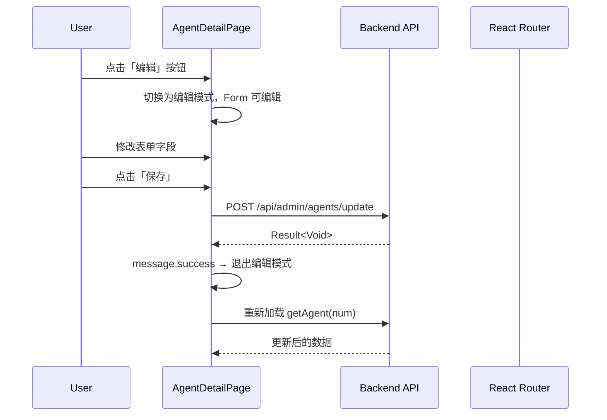
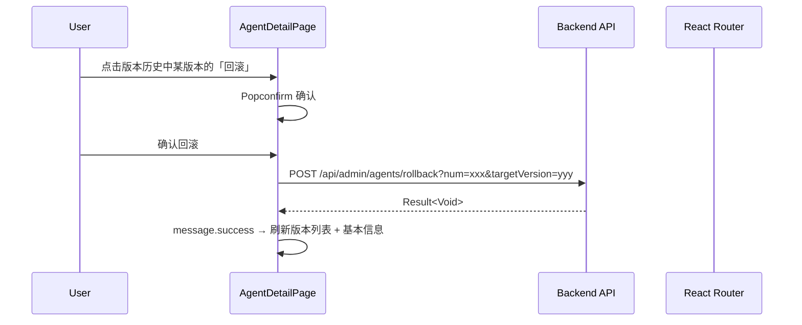
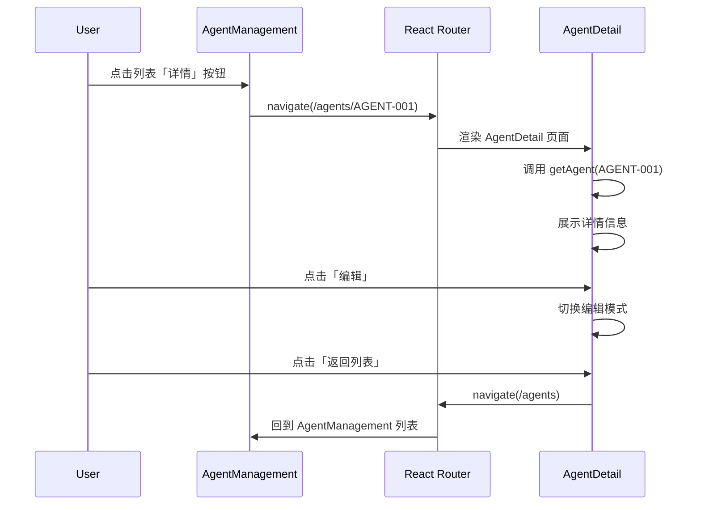

# 2026-04-30_Agent详情页分离与列表搜索筛选-技术方案

> **文档版本**：V1.0
> **创建日期**：2026-04-30
> **关联需求**：Agent 详情/编辑改为独立页面 + 所有列表页增加搜索筛选功能
> **对应分支**：`feature-20260430-agent-detail-page-list-filter`

---

## 1. 目标与范围

### 1.1 目标

- **Agent 详情页分离**：将 AgentManagement 中的 Drawer（详情）和 Modal（编辑/新增）改为独立页面 `/agents/:num`，提供完整的表单编辑、版本历史、资源绑定等能力
- **列表搜索筛选**：为所有 6 个列表页（Agent、User、Model、MCP、Skill、Permission）增加搜索输入和状态/类型筛选下拉框，调用后端已有的 keyword/status/type 等查询参数

### 1.2 范围

| 范围内 | 范围外 |
|-------|--------|
| Agent 独立详情页（只读/编辑/新增三种模式） | 新增后端接口（后端接口已完备） |
| Agent 详情页版本历史 Tab（含回滚操作） | Agent 运行监控、实时状态 |
| Agent 详情页资源绑定 Tab | 工作流引擎集成（Phase 3） |
| 6 个列表页搜索/筛选 UI + 状态管理 | 高级搜索（范围/时间/组合条件） |
| 技术方案、测试方案文档更新 | |

---

## 2. 架构设计（代码结构）

| 层 | 领域 | 包 | 职责 |
|---|------|---|------|
| frontend | pages/AgentDetail | `src/pages/AgentDetail/` | Agent 独立详情页，含基本信息表单、版本历史 Tab、资源绑定 Tab |
| frontend | pages/AgentManagement | `src/pages/AgentManagement/` | 简化为纯列表页，含搜索/筛选栏，操作列路由跳转 |
| frontend | pages/UserManagement 等 | `src/pages/{*Management}/` | 各列表页顶部增加搜索/筛选栏（6 个页面） |
| frontend | api | `src/api/agent.ts` | 补充 `getAgentDetail(num)`、`getAgentBindings(agentId)` |
| frontend | types | `src/types/agent.ts` | 补充 `AgentDetailVO`、`AgentResourceBinding` 类型 |
| frontend | routes | `src/App.tsx` | 新增 `/agents/new` 和 `/agents/:num` 路由 |

---

## 3. 前端设计

### 3.1 Agent 详情页（新建 `src/pages/AgentDetail/index.tsx`）

#### 3.1.1 页面模式

通过路由参数区分三种模式：
- `/agents/new` → **新增模式**：空白表单，提交后跳转到 `/agents/{num}`
- `/agents/:num` + 无编辑态 → **只读模式**：以 Descriptions 展示全部字段
- `/agents/:num` + 编辑态 → **编辑模式**：Form 表单可编辑，显示保存按钮

#### 3.1.2 页面布局

```
┌──────────────────────────────────────────────────────────┐
│  ← 返回列表        Agent 详情：客服助手        [编辑] [删除] │
├──────────────────────────────────────────────────────────┤
│                                                          │
│  ┌─ 基本信息 ──────────────────────────────────────┐    │
│  │  Agent 名称: 客服助手                            │    │
│  │  类型: 聊天型  状态: 已上线  版本: V1.2.0        │    │
│  │  描述: ...                                       │    │
│  │  系统提示词: ...                                 │    │
│  │  模型参数: temperature=0.7, maxTokens=4096 ...   │    │
│  └──────────────────────────────────────────────────┘    │
│                                                          │
│  ┌─ Tabs ──────────────────────────────────────────┐    │
│  │  [版本历史]  [资源绑定]  [操作日志(预留)]          │    │
│  │                                                   │    │
│  │  版本历史 Table: 版本号 | 标签 | 变更日志 | 发布人  │    │
│  │  操作: [回滚]                                     │    │
│  │                                                   │    │
│  │  资源绑定 Table: 类型 | 名称 | 默认 | 排序          │    │
│  │  操作: [解绑]                                     │    │
│  └──────────────────────────────────────────────────┘    │
└──────────────────────────────────────────────────────────┘
```

#### 3.1.3 数据流

```
页面加载 → getAgent(num) → 填充基本信息
         → getAgentVersions(agentId) → 填充版本历史 Tab
         → getAgentBindings(agentId) → 填充资源绑定 Tab
```

#### 3.1.4 编辑模式时序图



#### 3.1.5 版本回滚时序图



#### 3.1.6 所需 API

| 方法 | 后端接口 | 用途 |
|-----|---------|------|
| `getAgent(num)` | GET `/api/admin/agents/detail?num=xxx` | 加载 Agent 详情 |
| `getAgentVersions(agentId)` | GET `/api/admin/agents/versions?agentId=xxx` | 加载版本列表 |
| `getAgentBindings(agentId)` | GET `/api/admin/agents/bindings?agentId=xxx` | 加载资源绑定列表 |
| `updateAgent(data)` | POST `/api/admin/agents/update` | 保存编辑 |
| `deleteAgent(num)` | POST `/api/admin/agents/delete` | 删除 Agent |
| `rollbackAgent(num, targetVersion)` | POST `/api/admin/agents/rollback` | 回滚版本 |
| `unbindResource(bindingNum)` | POST `/api/admin/agents/unbind` | 解绑资源 |

### 3.2 AgentManagement 列表页改造

#### 3.2.1 变更内容

- **移除**：Detail Drawer 和 Create/Edit Modal
- **操作列**：改为路由跳转
  - 「详情」→ `navigate(/agents/${record.num})`
  - 「编辑」→ `navigate(/agents/${record.num})`（进入编辑态）
  - 「新增」→ `navigate(/agents/new)`
- **新增**：搜索/筛选栏（见 §3.4）

#### 3.2.2 路由变更时序图



### 3.3 列表搜索/筛选设计

后端 list 接口已支持查询参数，前端 API 层已支持透传，仅需在页面组件中添加 UI 和状态管理。

#### 3.3.1 各页筛选字段

| 页面 | 搜索 Input | 筛选 Select 1 | 筛选 Select 2 | 后端参数 |
|---|---|---|---|---|
| AgentManagement | keyword（名称模糊搜索） | status（6 种状态） | agentType（5 种类型） | keyword, status, agentType |
| UserManagement | keyword（用户名/姓名） | status（启用/禁用/锁定） | - | keyword, status |
| ModelManagement | keyword（名称） | provider（10 种） | status（3 种） | keyword, provider, status |
| MCPManagement | keyword（名称） | status（4 种） | - | keyword, status |
| SkillStore | keyword（名称） | category | status | keyword, category, status |
| PermissionManagement | keyword（名称/编码） | isEnabled（全部/启用/禁用） | - | keyword, isEnabled |

#### 3.3.2 统一实现模式

每个页面增加：

```tsx
const [filters, setFilters] = useState<FilterState>({ keyword: '', status: '' })

const handleSearch = (keyword: string) => {
  setFilters(f => ({ ...f, keyword }))
  setPagination(p => ({ ...p, current: 1 }))  // 重置到第1页
  loadData({ keyword, ...filters })
}

const handleFilterChange = (key: string, value: string) => {
  setFilters(f => ({ ...f, [key]: value }))
  setPagination(p => ({ ...p, current: 1 }))
  loadData({ [key]: value, ...filters })
}

const handleReset = () => {
  setFilters({ keyword: '', status: '', agentType: '' })
  setPagination(p => ({ ...p, current: 1 }))
  loadData({})
}
```

#### 3.3.3 UI 布局

```
┌──────────────────────────────────────────────────────────────┐
│ [搜索 Agent 名称...] [🔍]  [状态: 全部 ▼]  [类型: 全部 ▼]  [重置] │
├──────────────────────────────────────────────────────────────┤
│                      Table                                    │
└──────────────────────────────────────────────────────────────┘
```

使用 Ant Design `Row` + `Col` + `Space` 布局，搜索使用 `Input.Search`，筛选使用 `Select`，重置使用 `Button`。

### 3.4 路由设计

```tsx
// App.tsx
<Route path="/agents" element={<AgentManagement />} />
<Route path="/agents/new" element={<AgentDetail />} />
<Route path="/agents/:num" element={<AgentDetail />} />
```

AgentManagement 页面保持原路由 `/agents`，新增两个子路由用于详情/新增。

---

## 4. 后端接口确认

后端接口已完备，**无需新增或修改后端代码**：

| 接口 | 状态 | 说明 |
|-----|------|------|
| `GET /api/admin/agents/detail?num=xxx` | 已有 | Agent 详情，返回 AgentVO（含全部配置字段） |
| `GET /api/admin/agents/versions?agentId=xxx` | 已有 | 版本列表，返回 List<AgentVersionVO> |
| `GET /api/admin/agents/bindings?agentId=xxx` | 已有 | 资源绑定列表，返回 List<AgentResourceBindingVO> |
| `GET /api/admin/agents/list?keyword=&status=&agentType=` | 已有 | 列表分页，支持 keyword/status/agentType 过滤 |
| `POST /api/admin/agents/update` | 已有 | 更新 Agent |
| `POST /api/admin/agents/delete` | 已有 | 删除 Agent |
| `POST /api/admin/agents/rollback` | 已有 | 版本回滚 |
| `POST /api/admin/agents/unbind` | 已有 | 解绑资源 |

---

## 5. 模块变更清单

| 层级 | 变更项 | 说明 |
|------|--------|------|
| frontend/pages | 新建 `AgentDetail/index.tsx` | Agent 独立详情页 |
| frontend/pages | 修改 `AgentManagement/index.tsx` | 移除 Drawer/Modal，改路由跳转，加搜索筛选 |
| frontend/pages | 修改 `UserManagement/index.tsx` | 加 keyword + status 搜索筛选 |
| frontend/pages | 修改 `ModelManagement/index.tsx` | 加 keyword + provider + status 搜索筛选 |
| frontend/pages | 修改 `MCPManagement/index.tsx` | 加 keyword + status 搜索筛选 |
| frontend/pages | 修改 `SkillStore/index.tsx` | 加 keyword + category + status 搜索筛选 |
| frontend/pages | 修改 `PermissionManagement/index.tsx` | 加 keyword + isEnabled 搜索筛选 |
| frontend/types | 修改 `agent.ts` | 新增 AgentDetailVO、AgentResourceBinding 类型 |
| frontend/api | 修改 `agent.ts` | 新增 getAgentDetail(num)、getAgentBindings(agentId) |
| frontend/routes | 修改 `App.tsx` | 新增 /agents/new、/agents/:num 路由 |

---

## 6. 代码分支命名

**分支名**：`feature-20260430-agent-detail-page-list-filter`

---

## 7. 实现顺序

```
1. 类型扩展（agent.ts）
2. API 扩展（agent.ts）
3. 路由变更（App.tsx）
4. 新建 AgentDetail 页面
5. 重构 AgentManagement（移除 Drawer/Modal + 搜索筛选）
6. 修改其余 5 个列表页（搜索筛选）
7. TypeScript 编译验证
8. 手动功能测试
```

---

## 8. 接口与数据契约

### 8.1 AgentDetailVO（对齐后端 AgentVO）

```typescript
interface AgentDetailVO {
  id: string
  num: string
  agentCode: string
  agentName: string
  agentType: string
  description: string
  iconUrl: string
  tags: string
  status: string
  version: string
  systemPrompt: string
  temperature: number
  maxTokens: number
  topP: number
  topK: number
  frequencyPenalty: number
  presencePenalty: number
  stopSequences: string
  responseFormat: string
  timeoutSeconds: number
  retryCount: number
  admins: string[]
  createNo: string
  updateNo: string
  createTime: string
  updateTime: string
}
```

### 8.2 AgentResourceBinding（对齐后端 AgentResourceBindingVO）

```typescript
interface AgentResourceBinding {
  id: string
  num: string
  agentId: string
  resourceType: string  // MODEL / SKILL / MCP / WORKFLOW
  resourceId: string
  resourceName: string
  isDefault: boolean
  sortOrder: number
  config: string
  createTime: string
}
```
